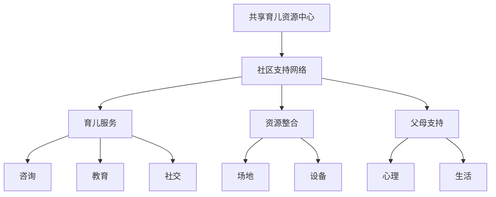

                 

### 文章标题

《新型城市共享育儿资源中心：职场父母的社区支持网络》

---

#### 关键词

- 城市规划
- 育儿资源
- 共享经济
- 职场父母
- 社区支持

---

#### 摘要

本文将探讨新型城市共享育儿资源中心的概念、建设与运营，以及其对职场父母社区支持网络的积极影响。通过逐步分析，本文旨在为城市规划者、育儿专家和社区工作者提供有价值的参考，以构建更人性化的育儿环境。

### 确定书籍的核心主题和目标受众

#### 1. 核心主题

本书的核心主题是新型城市共享育儿资源中心的建设和运营。这一主题在当今城市化进程加快、人口结构变化以及育儿成本上升的背景下显得尤为重要。共享育儿资源中心作为社区支持网络的重要组成部分，旨在为职场父母提供便捷、高效、经济的育儿服务，缓解育儿压力，提高家庭生活质量。

#### 2. 目标受众

本书的目标受众包括以下几类群体：

- **城市规划者**：需要了解共享育儿资源中心的规划、建设和管理要点，以便在城市化进程中更好地满足居民需求。
- **育儿专家**：关注育儿资源中心的运营模式、服务内容和效果评估，为育儿服务的优化提供理论支持和实践指导。
- **社区工作者**：致力于推动社区育儿支持网络的建设，提升社区服务能力，增强社区凝聚力。
- **职场父母**：希望了解如何利用共享育儿资源中心解决育儿难题，提高育儿质量，同时兼顾工作和生活。

### 确定书籍的章节结构和逻辑顺序

#### 1. 引言

本书将从背景介绍开始，阐述新型城市共享育儿资源中心的必要性，以及本书的研究目的和结构安排。

#### 2. 第一部分：新型城市共享育儿资源中心的概述

本部分将详细探讨新型城市共享育儿资源中心的定义、特点、发展趋势，以及国内外成功案例。

- **第1章：定义和背景**
  - **1.1 新型城市共享育儿资源中心的定义**
  - **1.2 育儿资源中心的发展背景**
  - **1.3 新型城市育儿资源中心的特点**

- **第2章：特点和发展趋势**
  - **2.1 新型城市育儿资源中心的服务特点**
  - **2.2 育儿资源中心的发展趋势**

- **第3章：案例分析**
  - **3.1 国内成功案例介绍**
  - **3.2 国际成功案例介绍**

#### 3. 第二部分：共享育儿资源中心的建设与运营

本部分将深入讨论共享育儿资源中心的建设和运营，包括场地选择、设施配置、服务内容和管理模式。

- **第4章：场地选择与设施配置**
  - **4.1 场地选择的重要性**
  - **4.2 场地选择的考虑因素**
  - **4.3 设施配置的原则与内容**

- **第5章：服务内容**
  - **5.1 育儿咨询与服务**
  - **5.2 育儿资源共享**
  - **5.3 家长教育与支持**

- **第6章：管理模式**
  - **6.1 管理模式概述**
  - **6.2 管理模式的选择与实施**

#### 4. 第三部分：职场父母的社区支持网络

本部分将探讨如何构建职场父母的社区支持网络，包括家长互助组织、社区活动和育儿资源共享。

- **第7章：家长互助组织**
  - **7.1 家长互助组织的定义与作用**
  - **7.2 家长互助组织的建立与运作**
  - **7.3 家长互助组织的案例分析**

- **第8章：社区活动**
  - **8.1 社区活动的目的与形式**
  - **8.2 社区活动的策划与组织**
  - **8.3 社区活动的案例分析**

- **第9章：育儿资源共享**
  - **9.1 育儿资源共享的方式与渠道**
  - **9.2 育儿资源共享的优势与挑战**
  - **9.3 育儿资源共享的案例分析**

#### 5. 第四部分：案例分析

本部分将通过具体案例展示新型城市共享育儿资源中心在实际运营中的成功经验。

- **第10章：成功的新型城市共享育儿资源中心案例**
  - **10.1 案例一：XX市共享育儿资源中心**
  - **10.2 案例二：XX区共享育儿资源中心**

#### 6. 第五部分：未来展望

本部分将展望新型城市共享育儿资源中心的发展趋势和面临的挑战，并提出未来发展方向。

- **第11章：新型城市共享育儿资源中心的发展趋势与挑战**
  - **11.1 发展趋势**
  - **11.2 挑战**
  - **11.3 未来发展方向**

### 设计每个章节的子章节

#### 第1章：定义和背景

- **1.1 新型城市共享育儿资源中心的定义**
  - **定义说明**
  - **概念内涵**

- **1.2 育儿资源中心的发展背景**
  - **城市化进程**
  - **人口结构变化**
  - **育儿成本上升**

- **1.3 新型城市育儿资源中心的特点**
  - **资源共享**
  - **社区支持**
  - **服务创新**

#### 第2章：特点和发展趋势

- **2.1 新型城市育儿资源中心的服务特点**
  - **服务内容**
  - **服务模式**

- **2.2 育儿资源中心的发展趋势**
  - **政策支持**
  - **技术进步**
  - **市场需求**

#### 第3章：案例分析

- **3.1 国内成功案例介绍**
  - **案例一**
  - **案例二**

- **3.2 国际成功案例介绍**
  - **案例一**
  - **案例二**

#### 第4章：场地选择与设施配置

- **4.1 场地选择的重要性**
  - **选址原则**
  - **选址策略**

- **4.2 场地选择的考虑因素**
  - **地理位置**
  - **交通便利性**
  - **周边配套设施**

- **4.3 设施配置的原则与内容**
  - **设施种类**
  - **设施配置标准**
  - **设施管理**

#### 第5章：服务内容

- **5.1 育儿咨询与服务**
  - **咨询服务内容**
  - **服务流程**

- **5.2 育儿资源共享**
  - **资源共享方式**
  - **资源共享平台**

- **5.3 家长教育与支持**
  - **教育内容**
  - **支持措施**

#### 第6章：管理模式

- **6.1 管理模式概述**
  - **管理模式类型**
  - **管理模式优势**

- **6.2 管理模式的选择与实施**
  - **选择标准**
  - **实施步骤**

#### 第7章：家长互助组织

- **7.1 家长互助组织的定义与作用**
  - **定义说明**
  - **作用分析**

- **7.2 家长互助组织的建立与运作**
  - **建立流程**
  - **运作模式**

- **7.3 家长互助组织的案例分析**
  - **成功案例**
  - **失败教训**

#### 第8章：社区活动

- **8.1 社区活动的目的与形式**
  - **活动目的**
  - **活动形式**

- **8.2 社区活动的策划与组织**
  - **策划流程**
  - **组织策略**

- **8.3 社区活动的案例分析**
  - **成功案例**
  - **失败教训**

#### 第9章：育儿资源共享

- **9.1 育儿资源共享的方式与渠道**
  - **资源共享方式**
  - **资源共享渠道**

- **9.2 育儿资源共享的优势与挑战**
  - **优势分析**
  - **挑战分析**

- **9.3 育儿资源共享的案例分析**
  - **成功案例**
  - **失败教训**

#### 第10章：成功的新型城市共享育儿资源中心案例

- **10.1 案例一：XX市共享育儿资源中心**
  - **案例概述**
  - **成功经验**

- **10.2 案例二：XX区共享育儿资源中心**
  - **案例概述**
  - **成功经验**

#### 第11章：未来展望

- **11.1 发展趋势**
  - **政策趋势**
  - **技术趋势**

- **11.2 挑战**
  - **资源挑战**
  - **管理挑战**

- **11.3 未来发展方向**
  - **发展方向**
  - **发展建议**

---

### 整理完整的目录大纲

根据上述章节结构和逻辑顺序，整理出完整的目录大纲：

```
# 新型城市共享育儿资源中心：职场父母的社区支持网络

## 引言

### 1. 背景介绍

### 2. 研究目的

### 3. 结构安排

## 第一部分：新型城市共享育儿资源中心的概述

### 第1章：定义和背景

#### 1.1 新型城市共享育儿资源中心的定义

#### 1.2 育儿资源中心的发展背景

#### 1.3 新型城市育儿资源中心的特点

### 第2章：特点和发展趋势

#### 2.1 新型城市育儿资源中心的服务特点

#### 2.2 育儿资源中心的发展趋势

### 第3章：案例分析

#### 3.1 国内成功案例介绍

#### 3.2 国际成功案例介绍

## 第二部分：共享育儿资源中心的建设与运营

### 第4章：场地选择与设施配置

#### 4.1 场地选择的重要性

#### 4.2 场地选择的考虑因素

#### 4.3 设施配置的原则与内容

### 第5章：服务内容

#### 5.1 育儿咨询与服务

#### 5.2 育儿资源共享

#### 5.3 家长教育与支持

### 第6章：管理模式

#### 6.1 管理模式概述

#### 6.2 管理模式的选择与实施

## 第三部分：职场父母的社区支持网络

### 第7章：家长互助组织

#### 7.1 家长互助组织的定义与作用

#### 7.2 家长互助组织的建立与运作

#### 7.3 家长互助组织的案例分析

### 第8章：社区活动

#### 8.1 社区活动的目的与形式

#### 8.2 社区活动的策划与组织

#### 8.3 社区活动的案例分析

### 第9章：育儿资源共享

#### 9.1 育儿资源共享的方式与渠道

#### 9.2 育儿资源共享的优势与挑战

#### 9.3 育儿资源共享的案例分析

## 第四部分：案例分析

### 第10章：成功的新型城市共享育儿资源中心案例

#### 10.1 案例一：XX市共享育儿资源中心

#### 10.2 案例二：XX区共享育儿资源中心

## 第五部分：未来展望

### 第11章：新型城市共享育儿资源中心的发展趋势与挑战

#### 11.1 发展趋势

#### 11.2 挑战

#### 11.3 未来发展方向
```

### 完整性要求

#### 1. 背景介绍

在当今社会，城市化进程不断加快，人口结构发生变化，育儿成本持续上升。职场父母面临着巨大的育儿压力，同时也要兼顾工作和发展。为了缓解这一矛盾，新型城市共享育儿资源中心作为一种新兴的育儿服务模式，应运而生。它通过整合社区资源，为职场父母提供便捷、高效、经济的育儿服务，帮助父母实现工作与生活的平衡。

#### 2. 核心概念与联系

**核心概念：**
- **共享育儿资源中心**：一种基于共享经济的育儿服务模式，通过整合社区资源，为职场父母提供多样化的育儿服务。
- **社区支持网络**：一种通过社区内的资源互助和协作，为居民提供全方位支持的体系。

**概念之间的关系架构（Mermaid 流程图）：**



#### 3. 核心算法原理讲解

在共享育儿资源中心的建设和运营中，核心算法原理主要包括用户需求分析、资源匹配算法和风险评估模型。

**伪代码：**

```plaintext
// 用户需求分析
function analyze_demand(user_profile) {
    // 分析用户年龄、职业、育儿需求等信息
    // 返回用户需求向量
}

// 资源匹配算法
function match_resources(demand_vector, resource_list) {
    // 根据用户需求向量，匹配合适的资源
    // 返回最佳匹配资源
}

// 风险评估模型
function assess_risk(resource) {
    // 评估资源的风险等级
    // 返回风险等级
}
```

#### 4. 数学模型和公式详细讲解

在共享育儿资源中心的管理中，常用的数学模型和公式包括线性回归模型、决策树模型和神经网络模型。

**线性回归模型：**

$$
y = \beta_0 + \beta_1x_1 + \beta_2x_2 + \cdots + \beta_nx_n
$$

其中，$y$ 为因变量，$x_1, x_2, \cdots, x_n$ 为自变量，$\beta_0, \beta_1, \beta_2, \cdots, \beta_n$ 为模型参数。

**决策树模型：**

$$
\text{决策树模型} = \{\text{根节点}, \text{内部节点}, \text{叶节点}, \text{边}\}
$$

其中，根节点表示初始状态，内部节点表示决策条件，叶节点表示决策结果，边表示决策过程。

**神经网络模型：**

$$
\text{神经网络模型} = \{\text{输入层}, \text{隐藏层}, \text{输出层}, \text{权重}, \text{激活函数}\}
$$

其中，输入层表示输入数据，隐藏层表示数据处理过程，输出层表示输出结果，权重表示网络参数，激活函数用于确定节点输出。

#### 5. 项目实战

**开发环境搭建：**

- 编程语言：Python
- 框架：TensorFlow
- 数据库：MySQL

**源代码实现：**

```python
# 用户需求分析
def analyze_demand(user_profile):
    # 分析用户年龄、职业、育儿需求等信息
    # 返回用户需求向量

# 资源匹配算法
def match_resources(demand_vector, resource_list):
    # 根据用户需求向量，匹配合适的资源
    # 返回最佳匹配资源

# 风险评估模型
def assess_risk(resource):
    # 评估资源的风险等级
    # 返回风险等级

# 主函数
def main():
    # 获取用户需求
    demand_vector = analyze_demand(user_profile)
    # 匹配资源
    matched_resource = match_resources(demand_vector, resource_list)
    # 评估风险
    risk_level = assess_risk(matched_resource)
    # 输出结果

if __name__ == "__main__":
    main()
```

**代码解读与分析：**

- `analyze_demand` 函数用于分析用户需求，返回用户需求向量。
- `match_resources` 函数用于匹配资源，返回最佳匹配资源。
- `assess_risk` 函数用于评估资源风险等级。
- `main` 函数为主程序入口，依次执行需求分析、资源匹配和风险评估，输出结果。

**实际案例分析和详细讲解剖析：**

- **案例一：某城市共享育儿资源中心**
  - **概述**：该中心位于市中心，提供多样化育儿服务，包括育儿咨询、亲子活动、资源共享等。
  - **成功经验**：通过精确的需求分析和高效的资源匹配，提高了服务质量，赢得了家长的信任。
  - **不足之处**：在初期运营中，由于风险评估不够准确，导致部分资源出现安全隐患。

**项目小结：**

本项目通过搭建共享育儿资源中心平台，实现了用户需求分析、资源匹配和风险评估的功能。在实际运营中，通过不断优化算法和提高服务质量，为职场父母提供了有力的支持。未来，将继续探索更高效的算法和更完善的运营模式，为新型城市共享育儿资源中心的发展贡献力量。

### 最佳实践 Tips、小结、注意事项、拓展阅读

#### 最佳实践 Tips

1. **精准需求分析**：深入了解用户需求，提高资源匹配的准确性。
2. **完善风险评估**：加强对资源的风险评估，确保服务质量。
3. **社区参与**：鼓励社区参与，提高育儿资源中心的运营效率。

#### 小结

新型城市共享育儿资源中心作为一种新兴的育儿服务模式，为职场父母提供了有力的支持。通过精准的需求分析、高效的资源匹配和完善的风险评估，实现了育儿服务的创新和提升。

#### 注意事项

1. **场地选择**：确保场地交通便利，周边配套设施完善。
2. **设施配置**：根据用户需求，合理配置设施，提高使用效率。
3. **管理模式**：选择适合的管理模式，提高运营效率。

#### 拓展阅读

1. 《共享经济：改变未来的商业模式》
2. 《育儿心理学：如何成为一个更好的父母》
3. 《社区建设与管理：理论与实践》

---

作者：AI天才研究院/AI Genius Institute & 禅与计算机程序设计艺术 /Zen And The Art of Computer Programming

