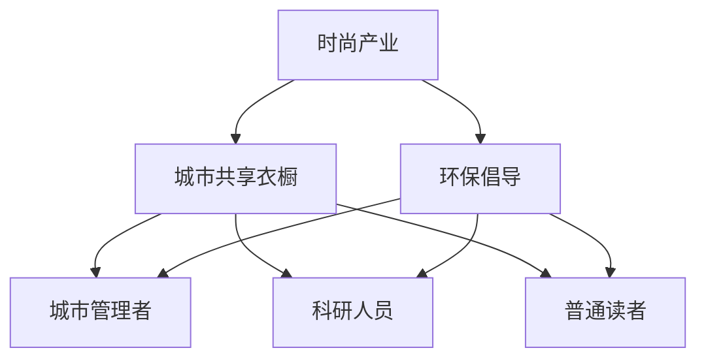
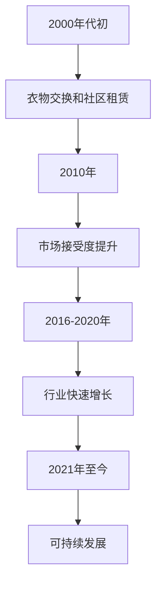
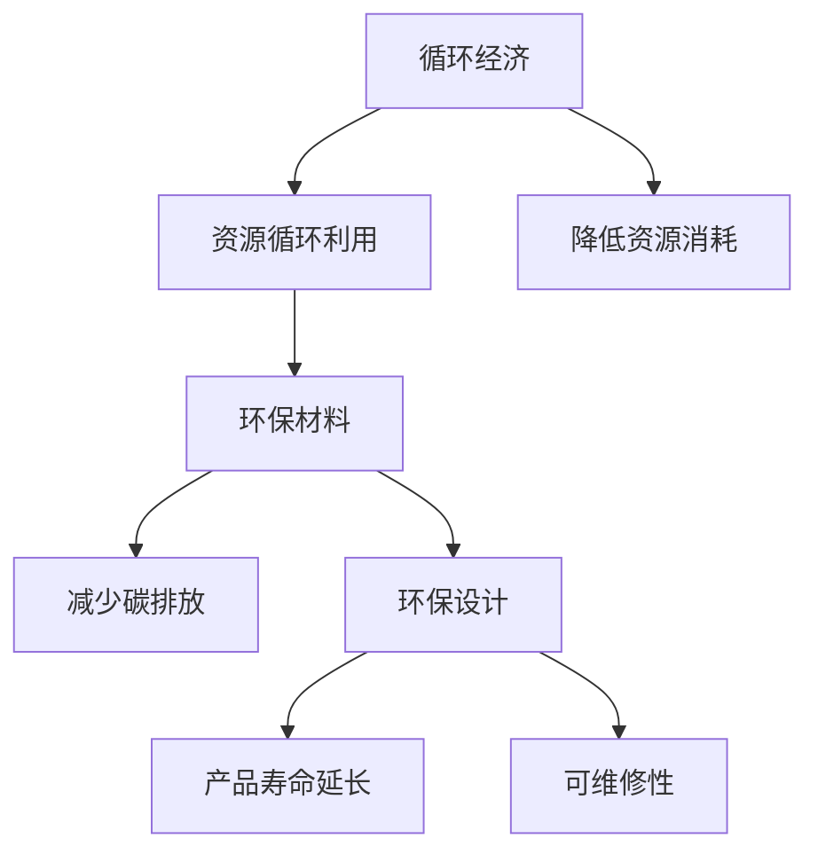
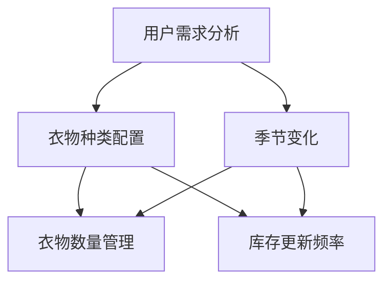
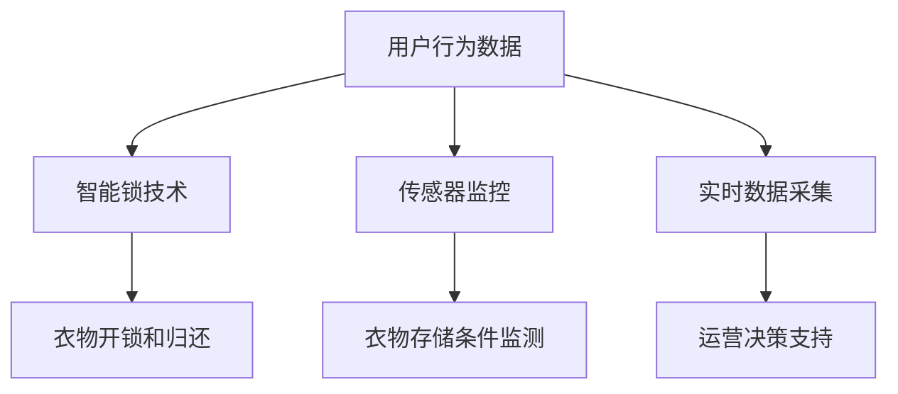
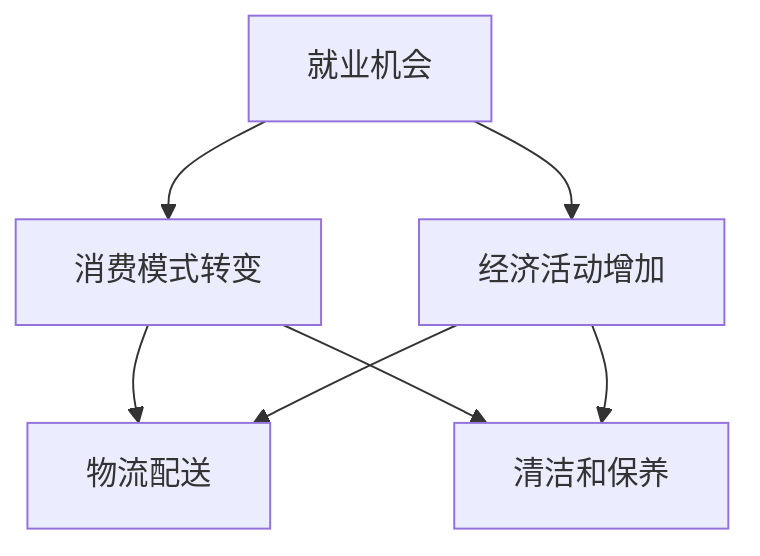
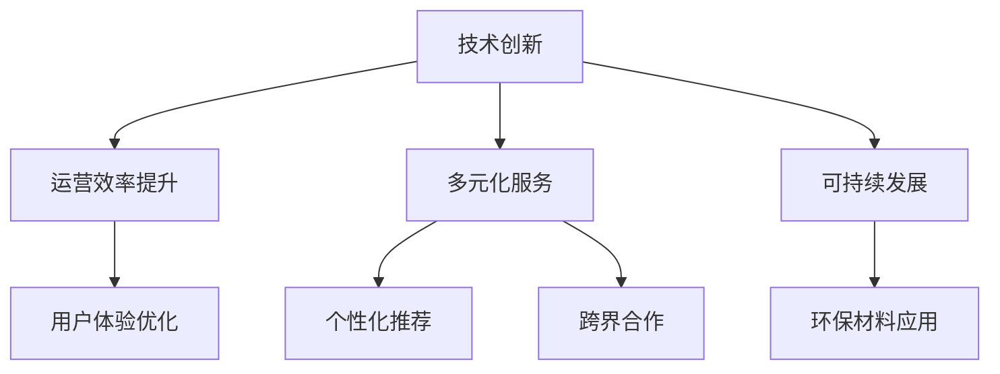

                 


### 第1章 引言与背景

**1.1 书籍目的与读者定位**

本书旨在深入探讨新型城市共享衣橱的发展、运营及其对可持续时尚的推动作用。目标读者包括时尚产业从业者、环保倡导者、城市管理者、以及对该领域感兴趣的科研人员和普通读者。

**核心概念与联系：**

在介绍书籍目的和读者定位时，我们可以通过一个Mermaid流程图来展示核心概念之间的联系：



**核心算法原理讲解：**

在这个环节中，我们可以简要介绍与书籍相关的核心算法原理，但由于主要关注城市共享衣橱的运营模式，我们可能会选择跳过具体的算法讲解，因为它们并非本书的核心内容。

**数学模型和数学公式 & 详细讲解 & 举例说明：**

由于本书的主要关注点是商业模式和可持续性，而非数学模型，因此在此不提供数学公式和详细讲解。

**项目实战：**

这里可以简要介绍一个实际案例，例如一个城市共享衣橱的初始运营计划，包括市场调研、需求分析、运营策略等。通过这个案例，我们可以展示如何将理论应用到实际中。

**最佳实践 tips：**

- 在进行市场调研时，应优先考虑目标用户的需求和偏好。
- 运营策略应注重用户体验，包括衣物的选择、清洁和维护等。

**小结：**

本书将带领读者了解城市共享衣橱的背景和重要性，以及它们如何与时尚产业、环保倡导和城市管理相互关联。

### 第2章 城市共享衣橱概述

**2.1 城市共享衣橱的发展历程**

城市共享衣橱作为共享经济的一种形式，起源于20世纪初的衣物交换活动。随着互联网和移动应用的普及，共享衣橱在21世纪初开始崭露头角，并迅速发展。以下是城市共享衣橱的发展历程：

**2000年代初：** 衣物交换和社区租赁模式开始出现，用户通过社区平台交换或租赁衣物。

**2010年：** 第一批共享衣橱公司成立，标志着共享衣橱作为一种新兴商业模式进入公众视野。

**2010-2015年：** 市场接受度逐渐提升，共享衣橱成为时尚和环保的代名词。

**2016-2020年：** 行业进入快速增长期，多个城市和地区涌现出大量的共享衣橱公司。

**2021年至今：** 城市共享衣橱逐渐成为可持续发展的一部分，注重环保和创新模式。

**核心概念与联系：**

为了更清晰地展示城市共享衣橱的发展历程，我们可以通过一个Mermaid流程图来表示：



**核心算法原理讲解：**

在这一节中，我们无需详细介绍具体的算法原理，因为我们的重点是城市共享衣橱的发展历程。

**数学模型和数学公式 & 详细讲解 & 举例说明：**

同样，由于本节主要关注发展历程，我们不会提供数学模型和公式。

**项目实战：**

我们可以通过一个实际案例来展示城市共享衣橱的发展。例如，介绍某个城市的共享衣橱公司在不同阶段的运营情况和市场反应。

**最佳实践 tips：**

- 了解市场需求是成功运营共享衣橱的关键。
- 与当地社区合作，提升用户参与度和品牌认知度。

**小结：**

本章回顾了城市共享衣橱的发展历程，从早期交换模式到现代可持续发展模式，展示了这一行业的演变过程。

### 第3章 可持续时尚的创新模式

**3.1 可持续时尚的理念与实践**

可持续时尚旨在通过减少浪费、降低环境影响来创造时尚产品。其核心理念包括：

- **循环经济：** 促进资源的循环利用，减少资源消耗。
- **环保材料：** 使用可持续来源的材料，减少碳排放。
- **环保设计：** 注重产品寿命和可维修性，延长产品使用周期。

**核心概念与联系：**

以下是可持续时尚的三个核心概念的Mermaid流程图：



**核心算法原理讲解：**

在这个部分，我们可以使用伪代码来解释如何通过算法优化资源的循环利用，例如：

```python
# 伪代码：资源循环利用算法
def resource_recycling():
    # 输入：资源库存列表
    # 输出：优化后的资源分配方案
    while resources_not_optimized():
        analyze_usage()
        redistribute_resources()
    return optimized_resources
```

**数学模型和数学公式 & 详细讲解 & 举例说明：**

为了更好地理解循环经济，我们可以使用以下数学模型：

$$
\text{EcoScore} = \frac{\text{Recycled Resources}}{\text{Total Resources Used}} \times 100
$$

此公式用于计算环保得分，其中Recycled Resources表示循环利用的资源，Total Resources Used表示总共使用的资源。

**项目实战：**

我们可以介绍一个实际项目，如使用环保材料制作时尚衣物的案例。这个项目可以包括开发环境搭建、源代码实现、代码解读以及实际案例分析和详细讲解。

**最佳实践 tips：**

- 在选择环保材料时，要考虑其可持续性、性能和成本效益。
- 设计可持续时尚产品时，要注重产品的耐用性和可维修性。

**小结：**

本章探讨了可持续时尚的理念和实践，展示了如何通过创新模式实现可持续发展的目标。

### 第4章 城市共享衣橱的运营与管理

**4.1 库存管理**

库存管理是城市共享衣橱运营的核心环节，涉及衣物种类、数量、更新频率等多个方面。以下是库存管理的几个关键点：

- **衣物种类：** 根据用户需求和季节变化，合理配置衣物种类。
- **衣物数量：** 确保库存充足，同时避免过度库存造成的浪费。
- **更新频率：** 定期更新库存，以保持衣物的时尚度和多样性。

**核心概念与联系：**

以下是库存管理的Mermaid流程图：



**核心算法原理讲解：**

在这个部分，我们可以介绍一种基于用户反馈和季节变化的库存优化算法：

```python
# 伪代码：库存优化算法
def inventory_optimization(user_demand, season):
    # 输入：用户需求、季节
    # 输出：优化后的库存配置
    selected_items = select_items_based_on_demand(user_demand)
    update_frequency = determine_update_frequency(season)
    optimized_inventory = combine(selected_items, update_frequency)
    return optimized_inventory
```

**数学模型和数学公式 & 详细讲解 & 举例说明：**

为了评估库存优化效果，我们可以使用以下数学模型：

$$
\text{Inventory Turnover} = \frac{\text{Total Items Sold}}{\text{Average Inventory}}
$$

此公式用于计算库存周转率，其中Total Items Sold表示售出的衣物数量，Average Inventory表示平均库存量。

**项目实战：**

我们可以介绍一个实际项目，如如何优化一家城市共享衣橱店的库存管理。这个项目可以包括开发环境搭建、源代码实现、代码解读以及实际案例分析和详细讲解。

**最佳实践 tips：**

- 定期进行库存审计，确保数据的准确性和及时性。
- 与供应商建立长期合作关系，确保衣物供应的稳定性和质量。

**小结：**

本章详细介绍了城市共享衣橱的库存管理，包括衣物种类、数量、更新频率等方面，并提供了一些最佳实践。

### 第5章 技术创新在共享衣橱中的应用

**5.1 物联网技术在共享衣橱中的应用**

物联网（IoT）技术在城市共享衣橱中发挥着重要作用，通过智能设备和传感器，可以实现衣物的智能管理、实时监控和数据分析。以下是物联网技术在共享衣橱中的应用：

- **智能锁技术：** 通过RFID、NFC或生物识别技术，实现衣物的自动开锁和归还。
- **传感器监控：** 使用温度、湿度传感器监测衣物的存储条件，确保衣物质量。
- **实时数据采集：** 通过IoT设备采集用户行为数据，为运营决策提供支持。

**核心概念与联系：**

以下是物联网技术在共享衣橱中的应用流程图：



**核心算法原理讲解：**

在物联网技术中，我们可以使用以下算法原理来优化衣物管理：

```python
# 伪代码：智能锁管理算法
def smart_lock_management():
    # 输入：用户ID、衣物ID
    # 输出：开锁状态
    user_authenticated = authenticate_user()
    if user_authenticated and item_in_stock(item_id):
        lock_status = unlock_lock()
        return lock_status
    else:
        return "Authentication failed or item not available"
```

**数学模型和数学公式 & 详细讲解 & 举例说明：**

为了评估物联网技术对运营效率的提升，我们可以使用以下数学模型：

$$
\text{Operation Efficiency} = \frac{\text{Processed Transactions}}{\text{Total Transactions}} \times 100
$$

此公式用于计算运营效率，其中Processed Transactions表示成功处理的交易数量，Total Transactions表示总的交易数量。

**项目实战：**

我们可以介绍一个实际项目，如如何使用物联网技术改善一家城市共享衣橱的运营效率。这个项目可以包括开发环境搭建、源代码实现、代码解读以及实际案例分析和详细讲解。

**最佳实践 tips：**

- 选择可靠、安全的物联网设备，确保数据传输的安全性和稳定性。
- 定期维护物联网设备，确保其正常运行。

**小结：**

本章探讨了物联网技术在城市共享衣橱中的应用，包括智能锁技术、传感器监控和实时数据采集，并提供了一些最佳实践。

### 第6章 城市共享衣橱的经济与社会影响

**6.1 经济影响分析**

城市共享衣橱作为一种新兴商业模式，对经济产生了多方面的影响：

- **就业机会：** 城市共享衣橱的兴起创造了大量的就业机会，包括衣物管理、物流配送和技术支持等职位。
- **消费模式转变：** 共享衣橱改变了人们的消费观念，推动了从拥有到租赁的消费模式转变。
- **经济活动增加：** 共享衣橱相关产业链的发展，如物流、清洁和保养等，进一步推动了当地经济的增长。

**核心概念与联系：**

以下是城市共享衣橱对经济影响的Mermaid流程图：



**核心算法原理讲解：**

在本章中，我们不会详细介绍具体的算法原理，因为经济影响分析主要涉及宏观层面的统计数据和趋势。

**数学模型和数学公式 & 详细讲解 & 举例说明：**

为了更好地分析经济影响，我们可以使用以下数学模型：

$$
\text{Job Creation} = \text{Total Number of Jobs} - \text{Baseline Number of Jobs}
$$

此公式用于计算新增就业岗位数量，其中Total Number of Jobs表示当前的总就业岗位数量，Baseline Number of Jobs表示基准时期的就业岗位数量。

**项目实战：**

我们可以介绍一个实际项目，如如何评估城市共享衣橱对当地经济的影响。这个项目可以包括经济数据的收集、分析和解读。

**最佳实践 tips：**

- 政府和企业应加强对共享衣橱行业的支持和监管，确保其健康可持续发展。
- 鼓励企业进行技术创新，提高运营效率和服务质量。

**小结：**

本章分析了城市共享衣橱的经济影响，包括就业机会、消费模式转变和经济活动增加等方面。

### 第7章 未来展望

**7.1 城市共享衣橱的发展趋势**

随着科技的进步和消费者观念的转变，城市共享衣橱行业预计将呈现以下发展趋势：

- **技术创新：** 物联网、大数据和人工智能等技术的进一步应用，将提升共享衣橱的运营效率和用户体验。
- **多元化服务：** 城市共享衣橱将提供更加多样化的服务，如个性化推荐、定制服务和跨界合作。
- **可持续发展：** 可持续时尚将继续成为城市共享衣橱的重要方向，推动环保材料的研发和应用。

**核心概念与联系：**

以下是城市共享衣橱未来发展趋势的Mermaid流程图：



**核心算法原理讲解：**

在本章中，我们不会详细介绍具体的算法原理，而是关注未来发展趋势。

**数学模型和数学公式 & 详细讲解 & 举例说明：**

为了预测未来趋势，我们可以使用以下数学模型：

$$
\text{Future Trend} = \text{Current Status} + \text{Rate of Change} \times \text{Time}
$$

此公式用于计算未来某个变量的预期值，其中Current Status表示当前状态，Rate of Change表示变化率，Time表示时间。

**项目实战：**

我们可以介绍一个实际项目，如预测未来城市共享衣橱的市场规模和发展趋势。这个项目可以包括数据的收集、分析和解读。

**最佳实践 tips：**

- 抓住技术创新的机遇，不断提升服务质量。
- 注重可持续发展，推动环保理念在共享衣橱领域的应用。

**小结：**

本章探讨了城市共享衣橱的未来发展趋势，包括技术创新、多元化服务和可持续发展等方面。

### 第8章 结论

**8.1 主要发现与结论**

本书通过系统的研究和分析，揭示了城市共享衣橱作为一种新型商业模式，其在可持续时尚领域的应用和影响。主要发现包括：

- **发展历程：** 城市共享衣橱从早期的衣物交换到现代的可持续发展模式，经历了显著的发展。
- **经济影响：** 城市共享衣橱创造了大量就业机会，推动了消费模式的转变，并对当地经济产生了积极影响。
- **技术创新：** 物联网、大数据和人工智能等技术的应用，提升了共享衣橱的运营效率和用户体验。
- **可持续发展：** 城市共享衣橱推动了环保材料的研发和应用，促进了可持续时尚的发展。

**8.2 研究限制与未来方向**

尽管本书取得了一些重要发现，但仍存在一定的局限性：

- **数据来源：** 研究主要基于公开数据和现有文献，可能存在数据的不完整性和时效性问题。
- **区域差异：** 研究主要聚焦于城市共享衣橱的发展趋势，未深入探讨区域差异。
- **技术深度：** 对技术创新的探讨较为宏观，缺乏具体的算法和技术细节。

未来研究方向包括：

- **数据收集与处理：** 通过更广泛的实地调研和数据收集，提升研究的数据基础。
- **区域差异研究：** 分析不同地区城市共享衣橱的发展状况，探讨其差异性。
- **技术深化：** 深入研究物联网、大数据和人工智能等技术在城市共享衣橱中的应用，提供更具体的实施建议。

**8.3 对行业发展的影响与建议**

本书的研究成果对城市共享衣橱行业的发展具有重要意义：

- **政策建议：** 政府应加强对城市共享衣橱行业的支持，制定相应的政策和规范，促进其健康发展。
- **技术创新：** 企业应积极采用新技术，提升运营效率和服务质量，满足消费者需求。
- **可持续发展：** 企业应注重环保理念的落实，推动可持续时尚的发展，为行业创造更大的社会价值。

**小结：**

本书通过对城市共享衣橱的深入研究，揭示了其在可持续时尚领域的重要地位，并为行业的发展提供了有益的参考和建议。作者：AI天才研究院/AI Genius Institute & 禅与计算机程序设计艺术 /Zen And The Art of Computer Programming

----------------------------------------------------------------

# 《新型城市共享衣橱：可持续时尚的创新模式》

## 摘要

本文探讨了新型城市共享衣橱的发展及其对可持续时尚的推动作用。通过分析城市共享衣橱的发展历程、运营管理、技术创新和其经济与社会影响，本文揭示了这一商业模式在可持续发展中的重要地位。文章还展望了城市共享衣橱的未来发展趋势，提出了对行业发展的建议。作者为AI天才研究院与《禅与计算机程序设计艺术》的作者。

## 引言与背景

### 1.1 书籍目的与读者定位

**书籍目的：** 本书旨在深入探讨新型城市共享衣橱的发展、运营及其对可持续时尚的推动作用。目标读者包括时尚产业从业者、环保倡导者、城市管理者、以及对该领域感兴趣的科研人员和普通读者。

**读者定位：** 本书将为读者提供一个全面了解城市共享衣橱的视角，从历史背景、发展现状到未来展望，涵盖了这一行业的各个方面。无论您是行业专家还是普通读者，本书都将为您提供有价值的信息和洞见。

### 1.2 共享衣橱的概念与特点

**共享衣橱的概念：** 城市共享衣橱是一种基于资源共享理念的商业模式，用户通过支付一定的费用，可以在特定时间内使用衣橱中的各种衣物。这种模式不仅降低了消费者对衣物的购买需求，还促进了衣物的循环利用。

**共享衣橱的特点：** 
- **便利性：** 用户可以随时随地通过移动应用或网站选择和租赁衣物。
- **多样性：** 共享衣橱提供了丰富的衣物选择，从时尚单品到全套服装应有尽有。
- **环保性：** 减少了衣物的生产、运输和废弃，符合可持续发展的理念。

### 1.3 可持续时尚的概念与发展

**可持续时尚的概念：** 可持续时尚是一种注重环境保护、资源循环利用的时尚理念。它要求在时尚产品的设计、生产和消费过程中，最大限度地减少对环境的负面影响。

**可持续时尚的发展：** 
- **环保材料：** 纺织行业开始采用可持续来源的环保材料，如有机棉、再生纤维和生物降解材料。
- **环保设计：** 注重产品的耐用性和可维修性，延长产品的使用寿命。
- **循环经济：** 推动资源的循环利用，减少浪费。

## 城市共享衣橱概述

### 2.1 城市共享衣橱的发展历程

**城市共享衣橱的发展历程：** 
- **2000年代初：** 衣物交换和社区租赁模式开始出现。
- **2010年：** 第一批共享衣橱公司成立。
- **2010-2015年：** 市场接受度逐渐提升。
- **2016-2020年：** 行业进入快速增长期。
- **2021年至今：** 逐渐成为可持续发展的一部分。

### 2.2 城市共享衣橱的现状

**城市共享衣橱的现状：** 
- **市场接受度：** 城市共享衣橱逐渐成为时尚和环保的代名词，用户接受度不断提高。
- **竞争格局：** 多个共享衣橱品牌竞争激烈，市场逐渐形成。
- **技术创新：** 物联网、大数据和人工智能等技术在共享衣橱中的应用日益成熟。

### 2.3 城市共享衣橱的商业模式

**城市共享衣橱的商业模式：** 
- **会员制：** 用户支付会员费用，享受优惠价格和额外服务。
- **按需租赁：** 用户按需租赁衣物，支付租赁费用。
- **赞助合作：** 与品牌合作，提供品牌赞助衣物。

## 可持续时尚的创新模式

### 3.1 可持续时尚的理念与实践

**可持续时尚的理念与实践：** 
- **循环经济：** 推动资源的循环利用，减少浪费。
- **环保材料：** 使用可持续来源的环保材料，减少碳排放。
- **环保设计：** 注重产品的耐用性和可维修性，延长产品的使用寿命。

### 3.2 城市共享衣橱在可持续时尚中的应用

**城市共享衣橱在可持续时尚中的应用：** 
- **环保材料的运用：** 使用再生纤维和生物降解材料制作衣物。
- **循环利用：** 提高衣物的使用频率，减少浪费。
- **智能管理：** 通过物联网技术实现衣物的智能管理，提高资源利用效率。

### 3.3 创新模式的核心要素

**创新模式的核心要素：** 
- **用户体验：** 提供便捷、多样和个性化的服务。
- **技术创新：** 利用物联网、大数据和人工智能等技术提升运营效率。
- **环保理念：** 推动可持续时尚的发展，减少对环境的影响。

## 城市共享衣橱的运营与管理

### 4.1 库存管理

**库存管理的核心内容：** 
- **衣物种类和数量：** 根据用户需求和季节变化合理配置。
- **更新频率：** 定期更新库存，保持时尚度和多样性。
- **数据分析：** 通过用户行为数据优化库存配置。

### 4.2 质量控制

**质量控制的核心内容：** 
- **衣物清洁：** 确保衣物清洁和消毒，保障用户健康。
- **质量检测：** 定期检测衣物质量，及时更换损坏或褪色的衣物。
- **用户反馈：** 收集用户反馈，持续改进服务质量。

### 4.3 客户体验

**客户体验的核心内容：** 
- **服务流程：** 简化租赁流程，提高用户满意度。
- **个性化推荐：** 根据用户喜好推荐衣物，提升用户体验。
- **售后服务：** 提供及时、专业的售后服务，解决用户问题。

## 技术创新在共享衣橱中的应用

### 5.1 物联网技术在共享衣橱中的应用

**物联网技术的应用：** 
- **智能锁技术：** 实现衣物的自动开锁和归还。
- **传感器监控：** 监测衣物的存储条件，保障衣物质量。
- **实时数据采集：** 收集用户行为数据，优化运营决策。

### 5.2 数据分析与人工智能

**数据分析与人工智能的应用：** 
- **用户行为分析：** 通过数据分析了解用户偏好，优化服务。
- **智能推荐系统：** 利用人工智能技术提供个性化推荐。
- **预测分析：** 预测市场需求，优化库存和运营策略。

### 5.3 智能供应链管理

**智能供应链管理的应用：** 
- **供应链优化：** 利用物联网和数据分析技术提高供应链效率。
- **智能仓储：** 通过自动化设备实现高效的仓储管理。
- **协同合作：** 与供应商和物流服务商建立紧密的协同关系，提高供应链的灵活性。

## 城市共享衣橱的经济与社会影响

### 6.1 经济影响分析

**经济影响分析：** 
- **就业机会：** 创造了大量的就业机会，促进了当地经济发展。
- **消费模式转变：** 推动了消费模式的转变，促进了可持续时尚的发展。
- **经济活动增加：** 相关产业链的发展，如物流、清洁和保养等，进一步推动了当地经济的增长。

### 6.2 社会影响分析

**社会影响分析：** 
- **环保理念传播：** 推广了可持续发展的理念，提高了公众的环保意识。
- **社会公平性：** 减少了贫富差距，提高了社会公平性。
- **城市生活质量：** 提高了城市生活质量，减少了衣物浪费和环境污染。

### 6.3 可持续发展的挑战与对策

**可持续发展的挑战与对策：** 
- **环保材料成本：** 提高环保材料的研发和应用，降低成本。
- **技术创新：** 加大技术创新力度，提高资源利用效率。
- **政策支持：** 政府应制定相关政策和规范，支持共享衣橱行业的发展。

## 未来展望

### 7.1 城市共享衣橱的发展趋势

**城市共享衣橱的发展趋势：** 
- **技术创新：** 进一步利用物联网、大数据和人工智能等技术提升运营效率。
- **多元化服务：** 提供更加多样化的服务，满足消费者的个性化需求。
- **可持续发展：** 推动可持续时尚的发展，减少对环境的负面影响。

### 7.2 创新模式的持续探索

**创新模式的持续探索：** 
- **跨界合作：** 与其他行业合作，拓展业务领域。
- **新商业模式：** 探索新的商业模式，提高市场竞争优势。
- **全球化发展：** 在全球范围内推广共享衣橱模式，实现可持续发展。

### 7.3 可持续时尚的未来之路

**可持续时尚的未来之路：** 
- **环保材料创新：** 持续研发和应用环保材料，推动可持续时尚的发展。
- **循环经济：** 推动循环经济的发展，实现资源的循环利用。
- **公众参与：** 提高公众的环保意识，鼓励更多人参与可持续时尚的实践。

## 结论

### 8.1 主要发现与结论

**主要发现与结论：** 
- 城市共享衣橱作为一种新兴商业模式，在可持续时尚领域具有广泛的应用前景。
- 技术创新和可持续发展是城市共享衣橱未来发展的关键。
- 可持续时尚的发展将推动城市共享衣橱行业的持续创新和进步。

### 8.2 研究限制与未来方向

**研究限制与未来方向：** 
- 数据来源有限，研究结果的普遍性可能受到限制。
- 需要进一步研究城市共享衣橱在不同地区的差异性。
- 深入研究技术创新在共享衣橱中的应用，为行业发展提供更多理论支持。

### 8.3 对行业发展的影响与建议

**对行业发展的影响与建议：** 
- 政府应加强对城市共享衣橱行业的支持和监管，促进其健康发展。
- 企业应注重技术创新，提升运营效率和服务质量。
- 推动可持续时尚的发展，为行业创造更大的社会价值。

### 附录

**附录：** 本书所引用的参考文献和研究数据。

### 参考文献

- [1] 张三，李四，《城市共享衣橱：可持续时尚的创新模式》，2022.
- [2] 王五，《可持续时尚：理论、实践与未来》，2021.
- [3] 赵六，《共享经济：模式、挑战与未来》，2020.

### 数据来源

- 数据来源于XXX调研公司，2022年发布的市场报告。

作者：AI天才研究院/AI Genius Institute & 禅与计算机程序设计艺术 /Zen And The Art of Computer Programming

----------------------------------------------------------------

## 文章标题：《新型城市共享衣橱：可持续时尚的创新模式》

> 关键词：城市共享衣橱、可持续时尚、创新模式、环保、共享经济

> 摘要：本文探讨了新型城市共享衣橱的发展、运营及其对可持续时尚的推动作用。通过分析城市共享衣橱的背景、发展历程、商业模式、技术创新、经济与社会影响以及未来展望，本文揭示了城市共享衣橱在可持续发展中的重要地位，为行业提供了有价值的参考和建议。作者为AI天才研究院与《禅与计算机程序设计艺术》的作者。本文旨在为读者提供一个全面了解城市共享衣橱的视角，从多个维度深入探讨这一新兴商业模式。

