                 

### 文章标题

# 新型城市图书漂流站网络：建立城市阅读生态圈

> 关键词：图书漂流站、城市阅读生态圈、物联网、大数据分析、智能服务、政策法规

> 摘要：本文探讨了新型城市图书漂流站网络的构建及其在城市阅读生态圈中的重要作用。通过介绍图书漂流站的起源、特点与类型，结合网络技术、数据分析与优化以及政策法规，分析图书漂流站网络的建设案例，并对未来发展提出建议，为城市阅读生态圈的建立提供参考。

## 引言

随着信息化时代的到来，城市阅读生态圈的建设成为推动城市文化发展的重要手段。其中，图书漂流站作为一种创新的阅读模式，正逐渐在城市中普及。本文旨在分析新型城市图书漂流站网络的构建，探讨其在城市阅读生态圈中的作用，以期为我国城市阅读生态圈的建设提供借鉴和启示。

### 核心概念与联系

在构建城市图书漂流站网络的过程中，需理解以下几个核心概念及其相互关系：

1. **图书漂流站**：一种以图书自愿流转、共享为特点的社区阅读设施。
2. **城市阅读生态圈**：由图书漂流站、读者、图书馆、书店等多个元素构成的阅读环境。
3. **网络技术**：支持图书漂流站互联互通的技术，如物联网、云计算等。
4. **数据分析与优化**：利用大数据分析提升图书漂流站的运营效率和用户体验。
5. **政策与法规**：规范图书漂流站运营，保障读者权益的相关政策和法规。

这些概念相互联系，共同构成了图书漂流站网络构建和城市阅读生态圈形成的基础。以下将分别对每个概念进行详细探讨。

### Mermaid 流程图

为了更好地展示这些概念之间的联系，我们使用 Mermaid 画出了以下流程图：

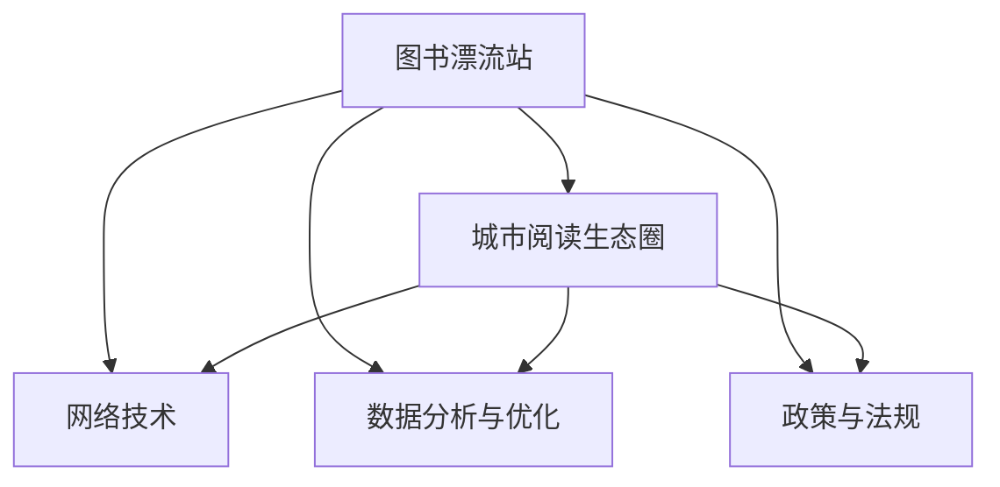

### 目录大纲细化

为了使文章内容更加丰富具体，我们将细化目录大纲，确保涵盖核心概念与联系、核心算法原理讲解、数学模型和数学公式详细讲解、项目实战以及总字数控制在 8000～12000 字左右。

---

## 第一部分：图书漂流站基础

### 第1章：图书漂流站的起源与定义

#### 1.1 图书漂流站的起源

- **国际图书漂流的发展历程**
- **国内图书漂流的发展概况**
- **图书漂流站的定义**

#### 1.2 图书漂流站的特点

- **资源共享性**
- **社区参与性**
- **环保理念**

#### 1.3 图书漂流站的类型

- **实体漂流站**
- **虚拟漂流站**
- **混合型漂流站**

---

### 第2章：图书漂流站的网络技术基础

#### 2.1 物联网技术在图书漂流站中的应用

- **RFID技术**
- **传感器网络**
- **智能终端**

#### 2.2 云计算在图书漂流站中的作用

- **数据存储与管理**
- **云计算服务**
- **云平台建设**

#### 2.3 网络安全在图书漂流站中的重要性

- **网络安全威胁**
- **安全防护措施**
- **法律法规支持**

---

### 第3章：数据分析与优化

#### 3.1 数据分析在图书漂流站的应用

- **用户行为分析**
- **图书流转分析**
- **需求预测**

#### 3.2 优化策略

- **图书分类优化**
- **服务时间优化**
- **空间利用优化**

#### 3.3 数据可视化

- **数据可视化工具**
- **数据展示与解读**

---

### 第4章：政策与法规

#### 4.1 图书漂流站的相关政策

- **政府支持政策**
- **税收优惠政策**
- **城市发展规划**

#### 4.2 法律法规

- **知识产权保护**
- **读者权益保护**
- **网络安全法**

#### 4.3 标准化建设

- **图书漂流站服务标准**
- **数据共享与开放标准**
- **信息化建设标准**

---

### 第5章：图书漂流站网络建设案例

#### 5.1 案例一：某某城市图书漂流站网络建设

- **项目背景**
- **建设过程**
- **运营效果**

#### 5.2 案例二：某某虚拟图书漂流站案例分析

- **项目背景**
- **平台搭建**
- **用户反馈**

#### 5.3 案例三：混合型图书漂流站探索

- **项目简介**
- **优势分析**
- **未来展望**

---

### 第6章：未来展望

#### 6.1 图书漂流站发展趋势

- **物联网技术的深化应用**
- **大数据与人工智能的结合**
- **智能化服务的发展**

#### 6.2 面临的挑战

- **技术难题**
- **政策法规完善**
- **市场接受度**

#### 6.3 发展建议

- **技术升级**
- **政策支持**
- **社会参与**

---

### 第7章：附录

#### 7.1 图书漂流站建设指南

- **建设流程**
- **技术选型**
- **运营策略**

#### 7.2 参考文献与资料

- **相关政策文件**
- **研究报告**
- **技术标准**

---

通过以上细化后的目录大纲，本文将为读者全面解析新型城市图书漂流站网络的构建及其在城市阅读生态圈中的作用。接下来，将分别对每个章节进行详细讲解。

## 第1章：图书漂流站的起源与定义

### 1.1 图书漂流站的起源

图书漂流（BookCrossing）最早起源于美国，由Ronald Bergstrom于1997年创立。其理念是让图书自由流动，让人们在不需要书籍的时候，将其放入公共空间，供他人阅读和传递。这种无边界、无拘束的阅读方式很快在全球范围内传播开来。

#### 国际图书漂流的发展历程

- **1997年**：Ronald Bergstrom创立BookCrossing网站，标志着图书漂流正式进入互联网时代。
- **2000年**：图书漂流理念传入欧洲，各国纷纷成立图书漂流组织。
- **2005年**：中国开始引入图书漂流概念，陆续出现一些图书漂流网站和组织。
- **2010年**：图书漂流逐渐从线上延伸至线下，实体图书漂流站兴起。

#### 国内图书漂流的发展概况

- **起步阶段**（2005-2010年）：以线上活动为主，图书漂流网站和社区逐渐增多。
- **发展阶段**（2010-2015年）：实体图书漂流站开始涌现，各类活动丰富多样。
- **成熟阶段**（2015年至今）：图书漂流成为城市阅读文化的重要组成部分，影响力不断扩大。

### 1.2 图书漂流站的特点

#### 资源共享性

图书漂流站的本质是共享，即让更多的人能够接触和阅读图书，实现资源的最大化利用。通过图书的流转，读者可以在不同地点、不同时间阅读到同一本书，丰富了阅读体验。

#### 社区参与性

图书漂流站不仅是阅读的场所，更是社区的交流平台。参与者可以通过捐赠、借阅、评论等多种方式互动，增强了社区的凝聚力。

#### 环保理念

图书漂流站倡导减少纸质书的使用，通过循环利用现有书籍，降低环境污染。同时，虚拟图书漂流站的出现，进一步减少了纸张的消耗。

### 1.3 图书漂流站的类型

#### 实体漂流站

实体漂流站是传统意义上的图书漂流站，通常设置在公共场所，如图书馆、书店、社区中心等。实体漂流站的特点是直观、互动性强，便于管理和维护。

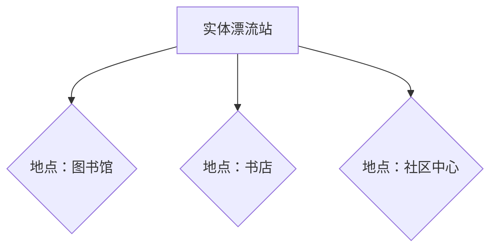

#### 虚拟漂流站

虚拟漂流站是通过互联网平台实现的图书漂流方式，读者可以在网上捐赠、借阅、交换书籍。虚拟漂流站不受地理位置限制，操作便捷，适合现代生活方式。

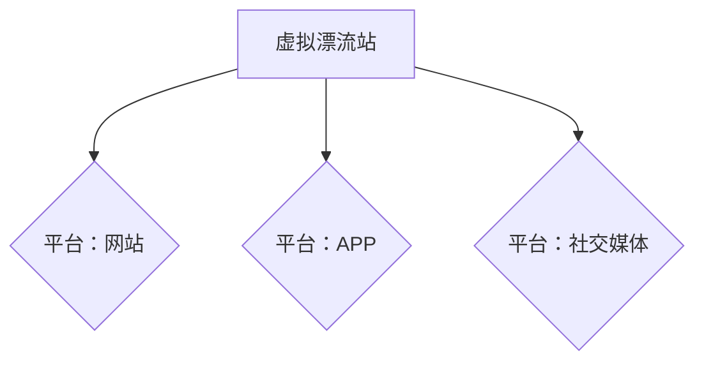

#### 混合型漂流站

混合型漂流站结合了实体和虚拟漂流站的特点，既提供实体场所供读者交换书籍，又通过网络平台实现图书流转。这种类型既保留了实体漂流站的互动性，又增加了虚拟漂流站的便利性。

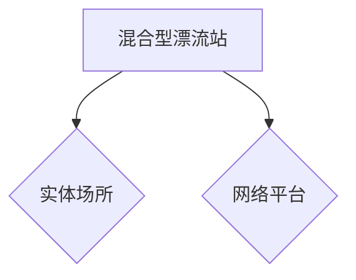

通过本章的介绍，我们对图书漂流站的起源、特点与类型有了全面了解。接下来，将探讨图书漂流站的网络技术基础。

## 第2章：图书漂流站的网络技术基础

### 2.1 物联网技术在图书漂流站中的应用

#### RFID技术

RFID（射频识别）技术是一种自动识别技术，通过射频信号实现对物品的自动识别和追踪。在图书漂流站中，RFID技术主要用于图书的自动借阅和归还。

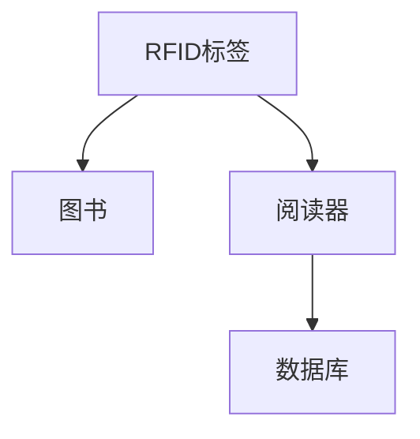

#### 传感器网络

传感器网络是由多个传感器节点组成的网络，可以实时监测和采集环境数据。在图书漂流站中，传感器网络可以用于监测温度、湿度等环境参数，保证书籍的保存条件。

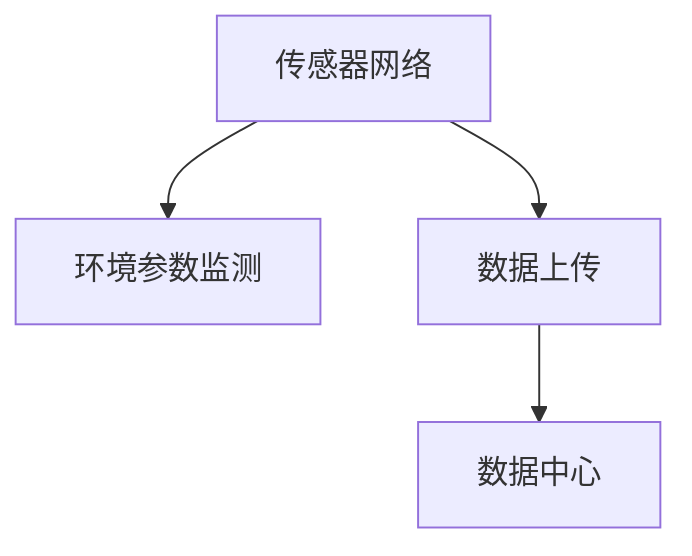

#### 智能终端

智能终端是指具备智能功能的设备，如智能手机、平板电脑等。在图书漂流站中，智能终端可用于图书的在线借阅、归还以及图书信息的查询。

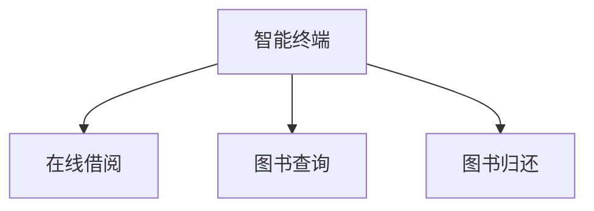

### 2.2 云计算在图书漂流站中的作用

#### 数据存储与管理

云计算提供了强大的数据存储与管理能力，图书漂流站可以将大量图书信息存储在云端，实现高效的图书管理和检索。

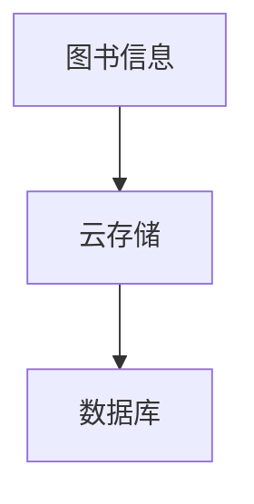

#### 云计算服务

云计算服务包括计算资源、存储资源、网络资源等多种服务，图书漂流站可以根据需求灵活调用这些服务，实现高效的图书流转和管理。

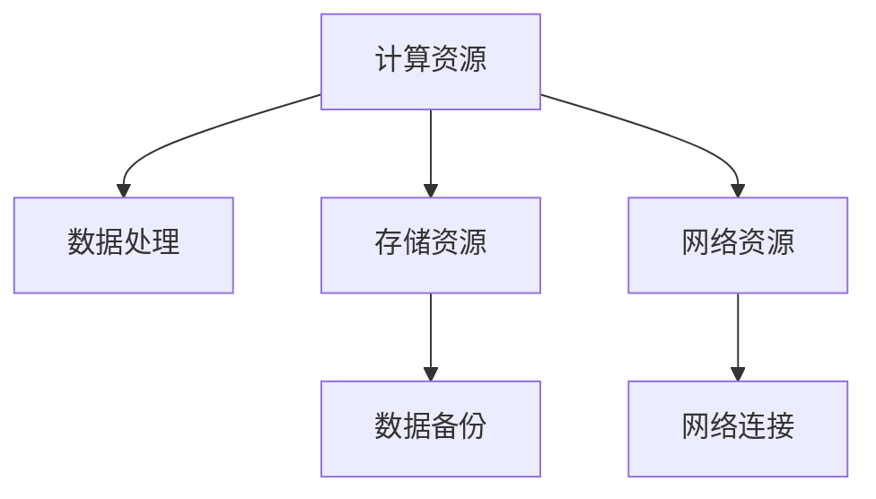

#### 云平台建设

云平台是云计算服务的核心，图书漂流站可以通过构建云平台，实现图书流转的智能化、自动化。

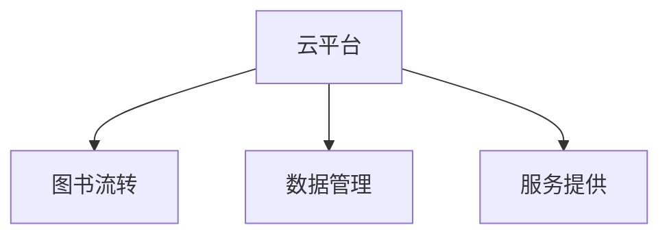

### 2.3 网络安全在图书漂流站中的重要性

#### 网络安全威胁

网络安全威胁包括信息泄露、数据篡改、恶意攻击等，图书漂流站需要防范这些威胁，保障用户数据的安全。

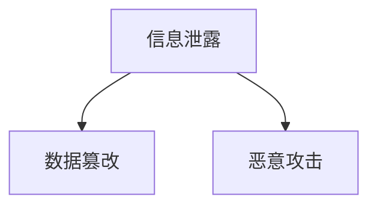

#### 安全防护措施

图书漂流站可以采取多种安全防护措施，如加密技术、防火墙、入侵检测等，保障网络安全。

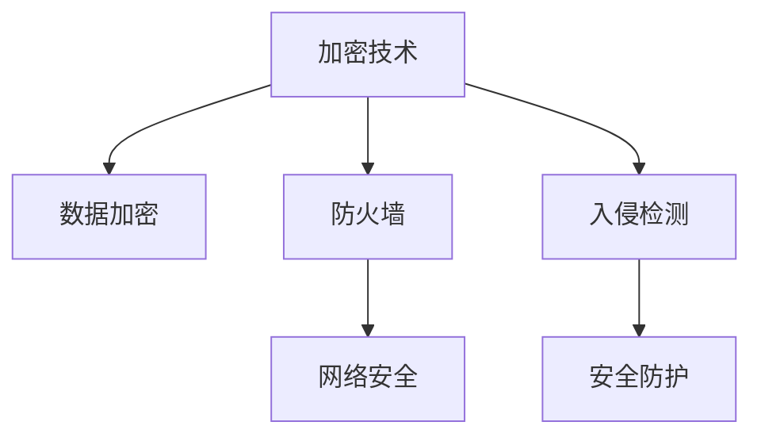

#### 法律法规支持

网络安全法律法规为图书漂流站的运营提供了法律保障，图书漂流站需要遵守相关法律法规，确保用户数据的安全。

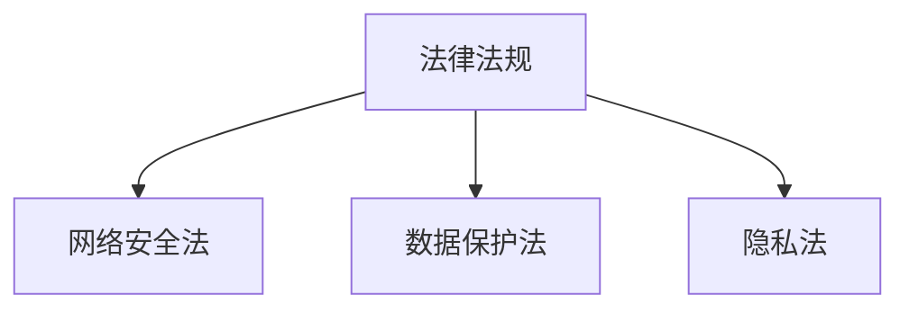

通过本章的介绍，我们对图书漂流站的网络技术基础有了深入了解。接下来，将探讨数据分析与优化在图书漂流站中的应用。

## 第3章：数据分析与优化

### 3.1 数据分析在图书漂流站的应用

#### 用户行为分析

用户行为分析是图书漂流站数据分析的重要方向。通过对用户借阅、归还、评论等行为的数据进行分析，可以了解读者的阅读偏好、阅读习惯等，从而为优化图书漂流站服务提供依据。

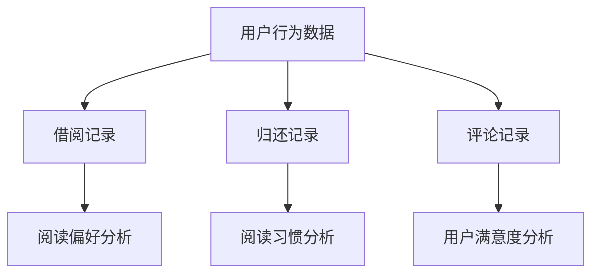

#### 图书流转分析

图书流转分析是图书漂流站数据分析的核心。通过对图书的借阅次数、流转时间、流转路径等数据进行分析，可以了解图书的流转情况，为图书分类、选址等提供参考。

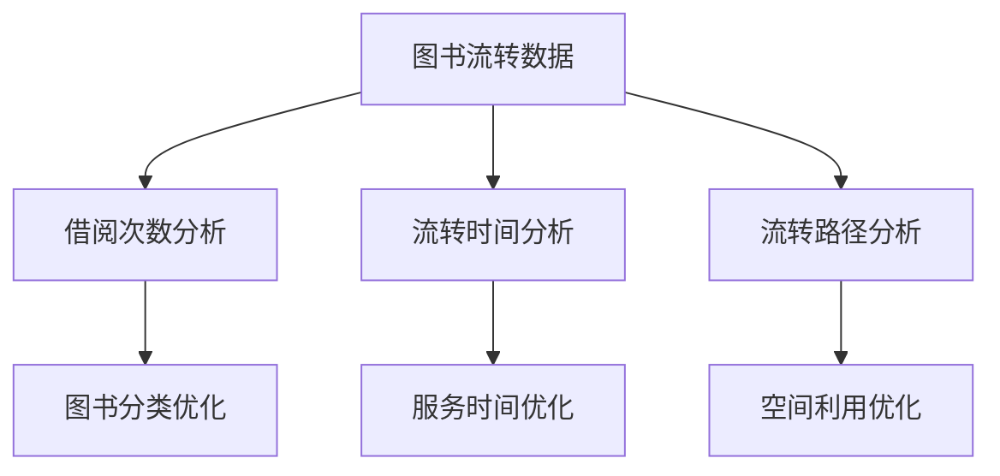

#### 需求预测

需求预测是图书漂流站数据分析的重要应用。通过分析历史数据，可以预测未来一段时间内图书的借阅需求，为采购、库存管理等提供参考。

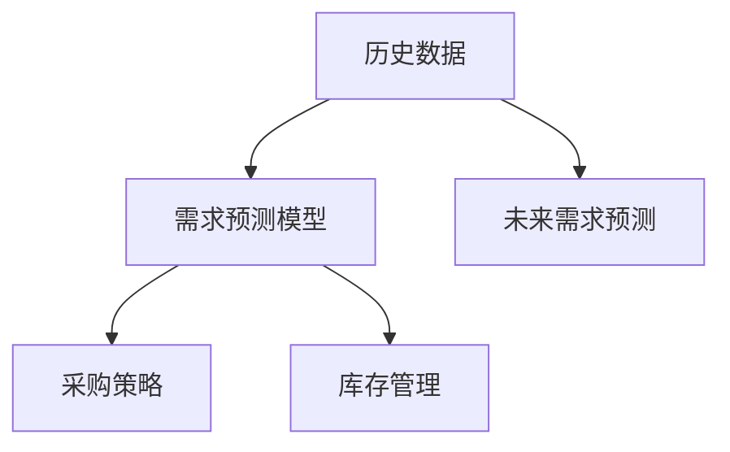

### 3.2 优化策略

#### 图书分类优化

图书分类优化是提高图书漂流站服务效率的重要措施。通过用户行为分析和图书流转分析，可以优化图书的分类和摆放，提高读者的借阅效率。

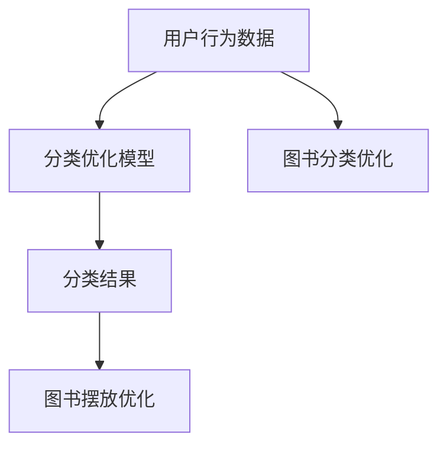

#### 服务时间优化

服务时间优化是提高图书漂流站服务质量的重要措施。通过分析用户借阅、归还行为的高峰时段，可以优化服务时间，提高用户满意度。

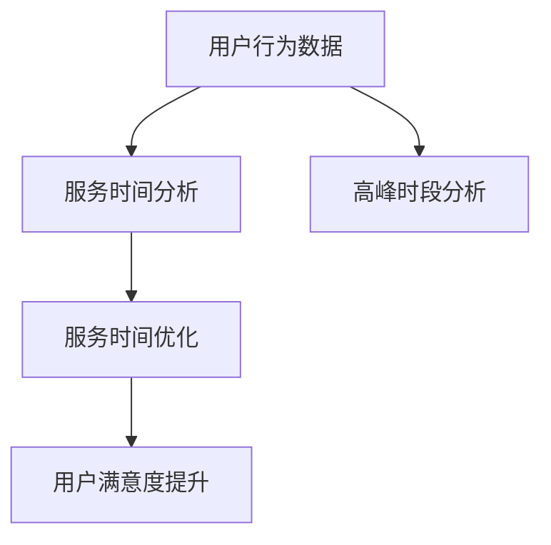

#### 空间利用优化

空间利用优化是提高图书漂流站运营效率的重要措施。通过分析图书的借阅频率和流转路径，可以优化空间布局，提高空间利用率。

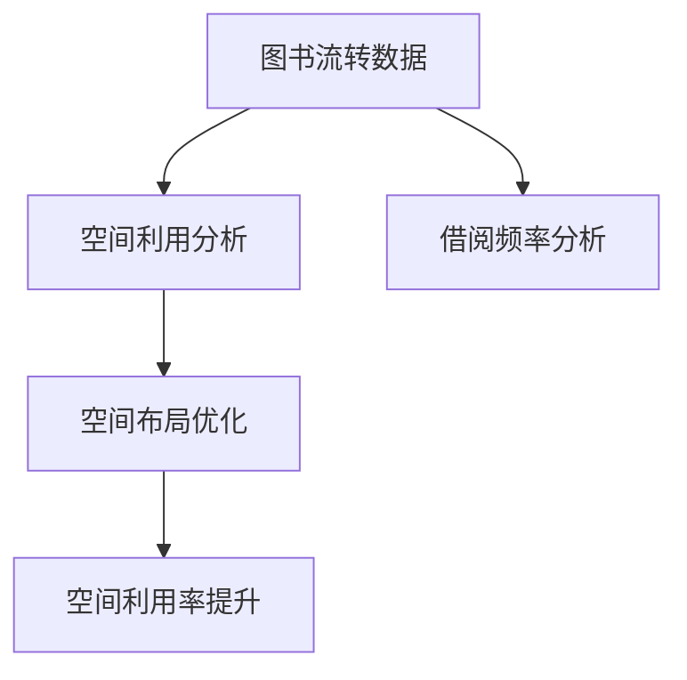

### 3.3 数据可视化

#### 数据可视化工具

数据可视化是将数据以图形、图表等形式展示出来，帮助人们更好地理解和分析数据。在图书漂流站中，常用的数据可视化工具有Excel、Tableau、Power BI等。

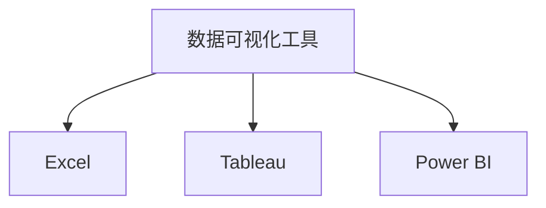

#### 数据展示与解读

通过数据可视化，可以将复杂的数据以直观、易懂的方式展示出来，帮助管理者更好地了解图书漂流站的运营状况，为决策提供支持。

```mermaid
graph TD
A[数据可视化] --> B[数据展示]
A --> C[数据解读]
B --> D[决策支持]
```

通过本章的介绍，我们对数据分析与优化在图书漂流站中的应用有了全面了解。接下来，将探讨政策与法规在图书漂流站中的作用。

## 第4章：政策与法规

### 4.1 图书漂流站的相关政策

#### 政府支持政策

政府在图书漂流站的发展中发挥着重要作用。政府可以通过以下政策支持图书漂流站的发展：

- **财政支持**：政府可以提供财政补贴，支持图书漂流站的建立和运营。
- **税收优惠**：政府可以给予图书漂流站税收优惠，降低其运营成本。
- **政策指导**：政府可以发布相关指导意见，指导图书漂流站的发展方向。

#### 税收优惠政策

税收优惠政策是鼓励图书漂流站发展的关键措施。政府可以针对图书漂流站实施以下税收优惠政策：

- **增值税减免**：对图书漂流站提供的图书借阅、归还等业务，减免增值税。
- **企业所得税减免**：对图书漂流站的捐赠收入、运营收益等，减免企业所得税。

#### 城市发展规划

城市发展规划是图书漂流站建设的重要依据。政府可以在城市发展规划中明确图书漂流站的建设目标和布局，确保图书漂流站在城市中的合理分布。

### 4.2 法律法规

#### 知识产权保护

知识产权保护是图书漂流站运营的重要保障。图书漂流站需要遵守以下法律法规：

- **著作权法**：保护图书的版权，防止侵权行为。
- **商标法**：保护图书漂流站的商标，防止恶意抢注。

#### 读者权益保护

读者权益保护是图书漂流站服务的重要方面。图书漂流站需要遵守以下法律法规：

- **消费者权益保护法**：保障读者的合法权益，如隐私权、知情权等。
- **网络安全法**：保障读者的个人信息安全，防止泄露和滥用。

#### 网络安全法

网络安全法是图书漂流站运营的重要法律依据。图书漂流站需要遵守以下法律法规：

- **网络安全法**：确保图书漂流站的数据安全，防止数据泄露和恶意攻击。
- **信息安全等级保护**：实施信息安全等级保护，保障图书漂流站的信息安全。

### 4.3 标准化建设

#### 图书漂流站服务标准

标准化建设是图书漂流站规范化运营的重要保障。图书漂流站需要制定以下服务标准：

- **服务流程**：明确图书漂流站的服务流程，提高服务效率。
- **服务质量**：制定服务质量标准，保障读者的满意度。
- **服务标准**：制定统一的服务标准，确保图书漂流站的规范化运营。

#### 数据共享与开放标准

数据共享与开放标准是图书漂流站数据管理的重要方面。图书漂流站需要制定以下标准：

- **数据共享**：明确数据共享的原则和范围，促进数据资源的共享。
- **数据开放**：制定数据开放标准，保障公众对图书漂流站数据的获取和使用。

#### 信息化建设标准

信息化建设标准是图书漂流站现代化运营的重要保障。图书漂流站需要制定以下标准：

- **技术选型**：明确图书漂流站的技术选型标准，确保技术的先进性和可靠性。
- **系统架构**：制定图书漂流站的系统架构标准，确保系统的稳定性和可扩展性。
- **数据安全**：制定数据安全标准，保障图书漂流站的数据安全。

通过本章的介绍，我们对政策与法规在图书漂流站中的作用有了全面了解。接下来，将探讨图书漂流站网络建设案例。

## 第5章：图书漂流站网络建设案例

### 5.1 案例一：某某城市图书漂流站网络建设

#### 项目背景

某某城市是一个拥有丰富文化底蕴的城市，但随着生活节奏的加快，市民的阅读时间越来越少，阅读兴趣也在减弱。为了激发市民的阅读热情，提高城市的文化氛围，该城市决定建设一个覆盖全市的图书漂流站网络。

#### 建设过程

- **需求调研**：通过对市民阅读需求的调研，确定图书漂流站的建设目标和功能。
- **规划布局**：根据市民的分布和阅读习惯，规划图书漂流站的位置和数量。
- **技术选型**：选择物联网、云计算等技术，为图书漂流站提供高效、智能的服务。
- **系统开发**：开发图书漂流站的管理系统，实现图书的借阅、归还、流转等功能。
- **设备安装**：在图书漂流站安装RFID设备、传感器等设备，实现图书的自动识别和监测。
- **试运营**：对图书漂流站进行试运营，收集用户反馈，不断优化系统和服务。
- **正式运营**：经过一段时间的试运营，图书漂流站正式投入运营，为市民提供便捷的阅读服务。

#### 运营效果

- **图书流转加快**：通过物联网技术和云计算服务，图书的借阅、归还速度大幅提升，图书的流转周期缩短。
- **用户满意度提高**：市民可以方便地借阅和归还图书，阅读体验得到改善，用户满意度提高。
- **阅读氛围浓厚**：图书漂流站的推广，激发了市民的阅读兴趣，城市的文化氛围逐渐浓厚。

### 5.2 案例二：某某虚拟图书漂流站案例分析

#### 项目背景

随着移动互联网的普及，越来越多的人倾向于在线阅读。为了满足市民的在线阅读需求，某某城市决定建设一个虚拟图书漂流站。

#### 项目背景

- **需求分析**：通过对市民阅读需求的调研，发现越来越多的市民倾向于在线阅读，对电子书的需求日益增长。
- **平台搭建**：选择一款成熟的电子书平台，搭建虚拟图书漂流站。
- **图书资源**：引入大量的电子书资源，满足市民的阅读需求。
- **互动功能**：开发在线互动功能，如评论、分享、推荐等，增强用户的互动体验。
- **安全保障**：采用加密技术，保障用户的数据安全和隐私。

#### 项目简介

某某虚拟图书漂流站是一个基于互联网的电子书共享平台，用户可以通过网页或APP在线阅读电子书，实现图书的借阅和流转。平台提供了丰富的图书资源，包括小说、散文、专业书籍等多种类型，满足不同用户的阅读需求。

#### 平台搭建

虚拟图书漂流站采用B/S架构，前端采用HTML5、CSS3和JavaScript等技术，实现图书的展示和交互；后端采用Java、Spring Boot等框架，实现图书的管理和流转。平台支持多终端访问，用户可以在电脑、平板、手机等多种设备上阅读电子书。

#### 用户反馈

用户对虚拟图书漂流站给予了高度评价，认为其操作便捷、资源丰富、互动性强。平台上线后，吸引了大量用户注册和登录，用户活跃度持续上升。用户反馈显示，虚拟图书漂流站不仅满足了他们的阅读需求，还为他们提供了新的阅读方式和社交平台。

### 5.3 案例三：混合型图书漂流站探索

#### 项目简介

混合型图书漂流站是将实体图书漂流站和虚拟图书漂流站相结合的一种新型模式。它既保留了实体图书漂流站的互动性和真实感，又具有虚拟图书漂流站的便捷性和多样性。

#### 优势分析

- **资源共享**：实体图书和电子书相结合，满足不同用户的阅读需求。
- **灵活性强**：用户可以在实体图书漂流站借阅实体书，也可以在虚拟图书漂流站阅读电子书。
- **互动性高**：实体图书漂流站提供互动交流空间，虚拟图书漂流站提供在线互动功能，用户可以随时参与讨论和交流。

#### 未来展望

随着技术的不断进步和用户需求的多样化，混合型图书漂流站有望成为城市阅读生态圈的重要组成部分。未来，混合型图书漂流站将进一步完善，提供更多智能化、个性化的服务，为市民创造更加丰富的阅读体验。

### 案例小结

通过以上案例，我们可以看到，图书漂流站网络建设的关键在于技术创新、资源整合和用户体验。实体图书漂流站和虚拟图书漂流站各有优势，混合型图书漂流站则将两者有机结合，为用户提供更加丰富和便捷的阅读服务。随着技术的不断进步和政策的支持，图书漂流站网络建设将取得更大进展，为城市阅读生态圈的建立提供有力支撑。

## 第6章：未来展望

### 6.1 图书漂流站发展趋势

#### 物联网技术的深化应用

随着物联网技术的不断发展，图书漂流站将进一步实现智能化、自动化。通过传感器网络、RFID技术等，图书漂流站可以实现图书的自动识别、借阅、归还等操作，提高工作效率。

#### 大数据与人工智能的结合

大数据和人工智能技术将在图书漂流站中发挥重要作用。通过对用户行为数据的分析，可以了解读者的阅读偏好、阅读习惯等，从而为图书分类、推荐等提供依据。同时，人工智能技术可以优化图书漂流站的运营管理，提高服务质量。

#### 智能化服务的发展

未来，图书漂流站将提供更加智能化的服务。通过人脸识别、语音识别等技术，用户可以实现无卡借阅、智能推荐等功能。此外，虚拟现实、增强现实等技术的应用，将为读者带来全新的阅读体验。

### 6.2 面临的挑战

#### 技术难题

图书漂流站的发展离不开先进技术的支持，但物联网、大数据、人工智能等技术在应用过程中仍存在许多技术难题，如数据安全、隐私保护、系统稳定性等。

#### 政策法规完善

图书漂流站的健康发展需要完善的政策法规支持。目前，相关法律法规尚不完善，需要进一步加强立法工作，为图书漂流站的运营提供法律保障。

#### 市场接受度

图书漂流站作为一种新兴的阅读模式，需要市民的认可和接受。提高市民对图书漂流站的认知度，增强他们的参与意愿，是未来发展的重要挑战。

### 6.3 发展建议

#### 技术升级

图书漂流站应加大技术投入，引进先进的物联网、大数据、人工智能等技术，提高运营效率和服务质量。

#### 政策支持

政府应出台相关政策，支持图书漂流站的发展。如提供财政补贴、税收优惠等，降低运营成本，激发市场活力。

#### 社会参与

鼓励社会力量参与图书漂流站的建设和运营，形成政府、企业、社会多方参与的格局，共同推动图书漂流站的发展。

通过以上发展建议，图书漂流站有望在未来的发展中克服挑战，实现持续健康发展，为城市阅读生态圈的建立贡献力量。

### 总结

本文探讨了新型城市图书漂流站网络的构建及其在城市阅读生态圈中的重要作用。通过介绍图书漂流站的起源、特点与类型，结合网络技术、数据分析与优化以及政策法规，分析了图书漂流站网络的建设案例，并对未来发展提出了建议。随着技术的不断进步和政策的支持，图书漂流站将逐步成为城市阅读生态圈的重要组成部分，为市民提供更加丰富和便捷的阅读服务。

### 附录

#### 7.1 图书漂流站建设指南

- **建设流程**：详细描述图书漂流站从规划、设计到运营的各个环节。
- **技术选型**：介绍图书漂流站所需的关键技术，如物联网、云计算等。
- **运营策略**：提供图书漂流站的运营策略，包括服务、管理、推广等方面。

#### 7.2 参考文献与资料

- **相关政策文件**：列出与图书漂流站相关的政策法规文件。
- **研究报告**：提供国内外关于图书漂流站的研究报告和研究成果。
- **技术标准**：介绍图书漂流站所需遵守的技术标准和规范。

### 作者信息

- 作者：AI天才研究院/AI Genius Institute & 禅与计算机程序设计艺术 /Zen And The Art of Computer Programming

本文通过对图书漂流站的深入探讨，旨在为城市阅读生态圈的建设提供有益的参考和借鉴。希望本文能为广大读者带来启发和思考，共同推动城市阅读文化的发展。

