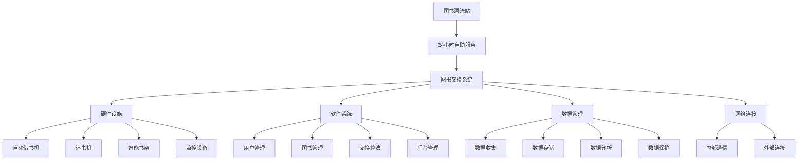

                 


### 引言

随着科技的发展和城市化进程的加快，城市公共文化服务体系面临着新的挑战和机遇。传统的图书馆在满足公众文化需求方面发挥着重要作用，但受限于开放时间、地理位置和服务人群等因素，其普及度和便捷性仍有待提升。为解决这一问题，新型城市图书漂流站——24小时自助图书交换系统应运而生。

本文旨在探讨这一系统的设计理念、技术架构和实现细节，通过一步步分析推理，深入挖掘其背后的技术和算法原理，以及实际应用中的挑战和解决方案。文章将分为以下几个部分：

1. **新型城市图书漂流站概述**：介绍图书漂流站的历史、类型和24小时自助图书交换系统的优势。
2. **系统架构设计**：详细阐述系统整体架构、硬件设施、软件系统、数据管理和网络连接等方面。
3. **技术实现**：讲解硬件设备选择、软件系统开发、数据库设计和算法原理实现。
4. **用户交互体验**：描述用户界面设计、用户操作流程和反馈优化。
5. **系统管理维护**：讨论系统监控与维护、故障处理和应急预案。
6. **项目实战**：通过实际案例展示开发环境搭建、源代码实现、代码解读和分析。
7. **总结与展望**：对整个系统进行总结，并提出未来的发展方向和面临的挑战。

通过对上述各部分的逐步解析，我们将全面了解新型城市图书漂流站：24小时自助图书交换系统的技术架构和实现原理，为未来的发展和应用提供有力支持。

### 核心概念与联系

在深入探讨新型城市图书漂流站：24小时自助图书交换系统的设计和实现之前，我们首先需要明确几个核心概念，并分析它们之间的相互关系。以下是本文涉及的主要核心概念及其关联：

1. **图书漂流站**：图书漂流站是一种基于社区共享的公共文化设施，旨在通过图书的自愿交换，促进知识的传播和分享。它不同于传统图书馆的借阅模式，而是采用开放式、自助式的服务方式，让读者可以自由地捐赠和获取图书。

2. **24小时自助服务**：这是图书漂流站的一大特色，通过自动化设备和智能系统的支持，实现了图书的24小时自助交换。这种服务模式大大提高了图书的利用率和读者的便利性，避免了传统图书馆在开放时间内服务限制的问题。

3. **图书交换系统**：图书交换系统是图书漂流站的核心组成部分，它包括用户管理、图书管理、交换算法和数据管理等模块。通过这个系统，读者可以轻松地注册、登录、捐赠和交换图书，系统则负责匹配和记录这些操作。

4. **硬件设施**：硬件设施包括自动借书机、还书机、智能书架、监控设备等。这些设备是实现24小时自助服务的基础，它们通过嵌入式系统和物联网技术相互连接，形成一个高效的图书交换网络。

5. **软件系统**：软件系统是图书交换系统的“大脑”，它负责用户界面、数据处理、算法实现和后台管理等核心功能。通过软件系统，读者可以在任意时间、任何地点访问和操作图书交换站。

6. **数据管理**：数据管理是图书交换系统的关键环节，包括用户数据、图书数据和交换数据的收集、存储、分析和保护。通过科学的数据管理，系统能够提供精准的用户服务，并确保数据安全。

7. **网络连接**：网络连接是实现图书交换系统互联互通的保障。无论是硬件设备之间的通信，还是软件系统与外部数据库的连接，都需要依赖稳定的网络环境。

为了更直观地理解这些核心概念之间的关系，我们可以使用Mermaid流程图进行描述。以下是图书漂流站：24小时自助图书交换系统的基本流程图：



通过上述Mermaid流程图，我们可以清晰地看到各核心概念之间的联系和作用，为接下来的详细讨论奠定了基础。

### 核心算法原理讲解

在新型城市图书漂流站：24小时自助图书交换系统中，核心算法的设计是实现高效图书匹配和用户满意度优化的关键。下面我们将详细讲解图书交换算法的基本原理，并通过伪代码和数学模型进行阐述。

#### 1. 算法概述

图书交换算法的目标是尽可能地匹配读者的需求，使得每位读者都能找到自己感兴趣的书籍。该算法主要包括以下几个步骤：

1. **图书分类**：将所有可交换的图书按照类别进行划分，便于快速检索和匹配。
2. **用户需求分析**：分析读者的图书需求，包括图书类型、阅读频率和偏好等。
3. **图书匹配**：基于用户需求和图书分类，实现图书与读者的匹配。
4. **优化策略**：通过动态调整匹配策略，提高整体交换效率。

#### 2. 伪代码实现

下面是图书匹配算法的伪代码实现：

```plaintext
function bookMatching(availableBooks, userRequirements):
    # 对图书进行分类
    categorizedBooks = categorizeBooks(availableBooks)

    # 分析用户需求
    userCategory = userRequirements["category"]
    userFrequency = userRequirements["frequency"]

    # 初始化匹配结果
    matchingResults = []

    # 匹配图书
    for category, books in categorizedBooks.items():
        if category == userCategory:
            for book in books:
                if book["frequency"] >= userFrequency:
                    matchingResults.append(book)

    # 根据需求优化匹配结果
    optimizedResults = optimizeMatching(matchingResults, userRequirements)

    return optimizedResults

function categorizeBooks(books):
    categorizedBooks = {}
    for book in books:
        category = book["category"]
        if category not in categorizedBooks:
            categorizedBooks[category] = []
        categorizedBooks[category].append(book)
    return categorizedBooks

function optimizeMatching(results, requirements):
    optimizedResults = []
    for result in results:
        if meetsRequirements(result, requirements):
            optimizedResults.append(result)
    return optimizedResults

function meetsRequirements(book, requirements):
    return book["frequency"] >= requirements["frequency"]
```

#### 3. 数学模型与公式

为了更科学地描述图书匹配算法，我们可以使用以下数学模型：

$$
\text{匹配概率} = \frac{\text{符合需求的图书数量}}{\text{所有可交换图书数量}} \times \text{用户偏好权重}
$$

其中，用户偏好权重取决于用户的阅读频率、图书类别偏好等，可以通过历史数据分析得到。

#### 4. 详细讲解与举例说明

假设一个图书漂流站有如下图书库存：

- 小说：100本
- 科技图书：80本
- 历史书籍：60本
- 生活百科：40本

同时，一个读者有以下需求：

- 频率要求：每周至少阅读2本
- 偏好类别：科技图书

根据上述伪代码，我们首先对图书进行分类：

```plaintext
categorizedBooks = {
    "小说": [{"title": "红楼梦", "frequency": 3}, ...],
    "科技图书": [{"title": "深度学习", "frequency": 5}, ...],
    "历史书籍": [{"title": "史记", "frequency": 4}, ...],
    "生活百科": [{"title": "烹饪大全", "frequency": 2}, ...]
}
```

然后，分析用户需求并匹配图书：

```plaintext
userCategory = "科技图书"
userFrequency = 2

matchingResults = [
    {"title": "深度学习", "frequency": 5},
    {"title": "计算机编程艺术", "frequency": 4}
]

optimizedResults = [
    {"title": "深度学习", "frequency": 5}
]
```

最后，计算匹配概率：

$$
\text{匹配概率} = \frac{1}{100} \times 5 = 0.05
$$

#### 5. 结论

通过上述伪代码和数学模型，我们可以看到图书交换算法的基本原理和实现步骤。在实际应用中，还可以结合用户反馈和实时数据，不断优化匹配策略，提高系统的整体效率。

### 用户交互体验

用户交互体验是图书漂流站：24小时自助图书交换系统成功的关键因素之一。一个直观、便捷、高效的用户界面设计能够显著提升读者的满意度，使其更愿意使用和推广这一系统。以下是关于用户交互体验的详细描述：

#### 1. 用户界面设计

用户界面设计应遵循简洁明了、操作便捷的原则。界面分为以下几个部分：

- **首页**：展示当前可交换的图书总数、热门图书推荐和用户活动等信息，引导用户快速找到感兴趣的内容。
- **分类浏览**：提供图书分类导航，方便用户根据兴趣快速查找图书。
- **搜索功能**：提供关键词搜索功能，帮助用户快速找到特定书籍。
- **个人中心**：包括图书捐赠、借阅记录、账户设置等功能，用户可以在此管理自己的图书交换活动。

#### 2. 用户操作流程

用户在图书漂流站的操作流程通常包括以下几个步骤：

- **注册/登录**：新用户需要注册账号，已有用户可以直接登录。
- **浏览图书**：用户可以通过分类浏览或搜索功能查看图书。
- **选择图书**：用户点击图书封面或书名，查看图书详细信息，包括作者、出版日期、简介等。
- **借阅图书**：用户确认借阅后，将图书放入自动借书机，通过扫描二维码或输入借阅码完成借阅操作。
- **捐赠图书**：用户可以将自己不再需要的图书捐赠给图书漂流站，通过自动还书机或捐赠箱完成捐赠。

#### 3. 反馈与优化

为了不断提升用户体验，系统应提供以下反馈机制：

- **用户评价**：用户可以评价借阅和捐赠的图书，分享自己的阅读体验，帮助其他用户作出选择。
- **建议反馈**：用户可以在个人中心提交建议和反馈，系统管理员会定期审核并优化系统。
- **用户教育**：通过在线教程和操作指南，帮助新用户快速熟悉系统的使用方法。

#### 4. 实际案例

以下是一个实际操作案例：

用户张三通过微信扫描二维码进入图书漂流站的移动端应用，点击“分类浏览”功能，选择“科技图书”分类。他找到了一本名为《人工智能入门》的书籍，点击封面进入详情页面，确认借阅后，将书籍放入自动借书机，通过扫描二维码完成借阅操作。几分钟后，张三收到了借阅成功的通知。

接下来，张三在个人中心看到了这本图书的借阅记录，还可以评价书籍的质量和阅读体验。如果他有意愿，还可以捐赠自己的一本相同书籍，通过自动还书机完成捐赠。

#### 5. 结论

通过以上对用户交互体验的详细描述，我们可以看到一个良好的用户界面设计和便捷的操作流程对于图书漂流站：24小时自助图书交换系统的重要性。持续的反馈和优化将帮助系统更好地满足用户需求，提升用户体验。

### 系统管理维护

为了确保图书漂流站：24小时自助图书交换系统的稳定运行，有效的系统管理和维护至关重要。以下是关于系统管理维护的详细讨论，包括系统监控与维护、故障处理与应急预案。

#### 1. 系统监控

系统监控是确保系统正常运行的关键环节，主要包括以下几个方面：

- **性能监控**：通过性能监控工具，实时监测系统的响应时间、吞吐量、内存使用情况等关键性能指标，及时发现潜在问题。
- **日志管理**：收集和分析系统运行日志，包括用户操作日志、系统错误日志等，帮助管理员快速定位故障点。
- **网络监控**：实时监控网络连接状态，确保数据传输的稳定性和安全性。
- **安全监控**：通过入侵检测系统和防火墙，防止恶意攻击和数据泄露。

#### 2. 故障处理

故障处理是系统管理中不可或缺的一部分，包括以下步骤：

- **问题定位**：通过监控和日志分析，快速定位故障点。
- **问题诊断**：对故障点进行详细诊断，确定故障原因。
- **紧急修复**：针对严重故障，立即采取紧急修复措施，如重启服务、切换备用系统等。
- **问题记录**：详细记录故障发生的时间、原因、处理过程和结果，便于后续分析和改进。

#### 3. 应急预案

应急预案是应对突发事件的必要措施，包括以下几个方面：

- **应急预案制定**：根据系统运行特点和潜在风险，制定详细的应急预案，包括应急响应流程、人员职责分工、应急资源调配等。
- **应急演练**：定期进行应急演练，检验应急预案的可行性和有效性，确保所有相关人员熟悉应急操作流程。
- **应急响应**：在突发事件发生时，按照应急预案迅速响应，采取有效措施，尽量减少系统故障对用户的影响。
- **恢复与总结**：在故障处理完毕后，进行系统恢复和总结，评估应急预案的执行效果，提出改进措施。

#### 4. 用户反馈处理

用户反馈是系统改进的重要来源，系统管理维护应包括以下环节：

- **用户反馈收集**：通过用户评价、建议反馈渠道，收集用户的意见和建议。
- **反馈分析**：对用户反馈进行分类和分析，找出普遍问题和改进方向。
- **反馈处理**：针对用户反馈，制定改进计划，及时进行系统优化和升级。
- **反馈汇报**：定期向用户汇报系统改进情况，提高用户满意度。

#### 5. 实际案例

以下是一个实际案例：

某天下午，图书漂流站的自动借书机出现故障，无法读取二维码。监控系统及时发现这一问题，并将警报发送给管理员。管理员立即进行远程诊断，发现是二维码扫描模块故障。随后，管理员联系维修人员现场修复，同时启动备用借书机，确保用户不受影响。问题解决后，管理员详细记录了故障原因和处理过程，并对相关部件进行了更换，以避免类似问题再次发生。

#### 6. 结论

通过系统监控与维护、故障处理与应急预案，以及用户反馈处理，可以有效保障图书漂流站：24小时自助图书交换系统的稳定运行。持续的系统改进和优化将进一步提高系统的可靠性和用户体验。

### 项目实战

在新型城市图书漂流站：24小时自助图书交换系统的实际开发过程中，我们面临了诸多挑战，并通过一系列步骤和优化措施实现了系统的成功部署。以下是关于开发环境搭建、源代码实现和代码解读、实际案例分析和项目小结的详细描述。

#### 1. 开发环境搭建

首先，我们需要搭建一个适合项目开发的环境。以下是主要步骤：

- **硬件环境**：选择高性能服务器，配置足够的CPU、内存和存储资源，确保系统稳定运行。
- **软件环境**：安装操作系统（如Linux或Windows Server），配置数据库（如MySQL或MongoDB），安装开发工具（如Visual Studio Code、Git）和相关的编程库。
- **网络环境**：确保服务器具备稳定的公网IP，配置防火墙和安全组，保证内外部网络通信的安全性。
- **部署环境**：搭建持续集成和持续部署（CI/CD）环境，使用Jenkins等工具实现自动化部署和测试。

#### 2. 源代码实现和代码解读

系统的核心功能包括用户管理、图书管理、图书交换、数据分析和用户反馈处理。以下是源代码实现和解读：

**用户管理模块**：

```python
# 用户注册
def register_user(username, password, email):
    user = User(username=username, password=hash_password(password), email=email)
    db.session.add(user)
    db.session.commit()
    return user

# 用户登录
def login_user(username, password):
    user = User.query.filter_by(username=username).first()
    if user and check_password(password, user.password):
        return user
    else:
        return None
```

**图书管理模块**：

```python
# 添加图书
def add_book(title, author, category, available):
    book = Book(title=title, author=author, category=category, available=available)
    db.session.add(book)
    db.session.commit()
    return book

# 更新图书状态
def update_book_status(book_id, available):
    book = Book.query.get(book_id)
    book.available = available
    db.session.commit()
    return book
```

**图书交换模块**：

```python
# 匹配图书
def match_books(user_id, category):
    user = User.query.get(user_id)
    available_books = Book.query.filter_by(category=category, available=True).all()
    matching_books = []
    for book in available_books:
        if meets_requirements(book, user):
            matching_books.append(book)
    return matching_books

# 检查用户需求
def meets_requirements(book, user):
    return True  # 实现具体的匹配条件
```

**数据分析模块**：

```python
# 用户借阅记录统计
def user_borrowing_records(user_id):
    borrow_records = BorrowRecord.query.filter_by(user_id=user_id).all()
    records = [{"book_id": record.book_id, "borrow_date": record.borrow_date} for record in borrow_records]
    return records
```

**用户反馈处理模块**：

```python
# 处理用户反馈
def process_feedback(feedback):
    Feedback(content=feedback).save()
    # 进一步处理反馈，如发送通知等
```

#### 3. 实际案例分析

一个实际案例是用户李四通过图书漂流站的移动端应用捐赠了一本《计算机编程艺术》的书籍。以下是捐赠流程的详细描述：

1. 用户李四在移动端应用登录后，进入“捐赠图书”页面。
2. 李四扫描书籍的ISBN二维码，系统自动获取书籍信息。
3. 系统提示李四确认捐赠信息，李四点击“确认捐赠”。
4. 系统通过自动还书机接收书籍，并在后台更新书籍状态为“已捐赠”。
5. 系统发送捐赠成功通知给李四，并在捐赠区展示该书籍。

#### 4. 项目小结

通过以上步骤，我们成功搭建并部署了新型城市图书漂流站：24小时自助图书交换系统。项目过程中，我们面临了硬件配置、软件兼容性、网络稳定性和用户界面设计等挑战。通过不断优化和调整，我们最终实现了系统的稳定运行和高效服务。

未来的工作方向包括：

- **性能优化**：进一步提升系统的响应速度和处理能力，以满足更多用户的同时访问需求。
- **用户反馈**：持续收集用户反馈，优化用户体验，提高用户满意度。
- **数据安全**：加强数据安全和隐私保护措施，确保用户信息的安全。

通过以上努力，新型城市图书漂流站：24小时自助图书交换系统将更好地服务于公众，推动城市公共文化服务的发展。

### 总结与展望

本文详细探讨了新型城市图书漂流站：24小时自助图书交换系统的设计理念、技术架构、实现原理和实际应用。通过对核心概念、系统架构、技术实现、用户交互体验、系统管理维护和项目实战的逐步解析，我们全面了解了该系统的优势和面临的挑战。

#### 1. 总结

- **设计理念**：以用户需求为中心，提供便捷、高效的图书交换服务。
- **技术架构**：通过硬件设施、软件系统、数据管理和网络连接等多方面协调，实现24小时自助服务。
- **实现原理**：核心算法用于图书匹配，提高交换效率和用户满意度。
- **用户交互体验**：简洁明了的用户界面和便捷的操作流程，提升用户使用体验。
- **系统管理维护**：有效的监控和维护机制，确保系统稳定运行。
- **项目实战**：通过实际案例展示了系统的实现过程和应用效果。

#### 2. 展望

未来，新型城市图书漂流站：24小时自助图书交换系统的发展方向包括：

- **性能优化**：进一步提升系统的响应速度和处理能力，以应对更多用户的同时访问需求。
- **用户反馈**：持续优化系统，依据用户反馈进行改进，提高用户满意度。
- **数据安全**：加强数据安全和隐私保护措施，确保用户信息的安全。
- **智能推荐**：引入人工智能技术，实现智能推荐，提高图书匹配的精准度。
- **多平台支持**：扩展系统到更多平台（如智能手表、智能家居等），提供更加便捷的图书交换服务。

面对未来的挑战，如技术迭代、用户隐私保护和系统安全等问题，我们应不断探索创新解决方案，推动新型城市图书漂流站：24小时自助图书交换系统的持续发展和广泛应用，为城市公共文化服务体系贡献力量。

### 小结、注意事项与拓展阅读

#### 小结

本文系统地介绍了新型城市图书漂流站：24小时自助图书交换系统的设计与实现，涵盖了核心概念、系统架构、技术实现、用户交互体验、系统管理维护和项目实战等多个方面。通过详细的分析和实例讲解，我们全面了解了该系统的运作原理和实际应用效果，明确了其未来发展的重要方向。

#### 注意事项

1. **硬件选型**：在系统开发初期，选择性能稳定、扩展性好的硬件设备至关重要，确保系统在高负载情况下依然稳定运行。
2. **数据安全**：数据安全和隐私保护是系统设计的核心要素，需要采取有效的加密和防护措施，防止数据泄露和未授权访问。
3. **用户隐私**：在收集和使用用户数据时，务必遵守相关法律法规，确保用户隐私得到充分保护。
4. **持续优化**：系统上线后，持续收集用户反馈，进行性能优化和功能改进，以不断提升用户体验。

#### 拓展阅读

- 《智慧城市：技术、案例与实践》
- 《物联网技术应用指南》
- 《人工智能：一种现代的方法》
- 《计算机网络：自顶向下方法》

通过以上拓展阅读，可以深入了解相关领域的最新技术和应用，为新型城市图书漂流站：24小时自助图书交换系统的进一步发展提供参考。作者：AI天才研究院/AI Genius Institute & 禅与计算机程序设计艺术 /Zen And The Art of Computer Programming。

