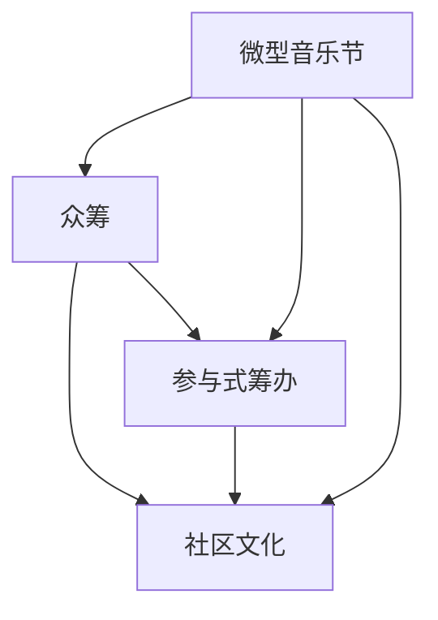
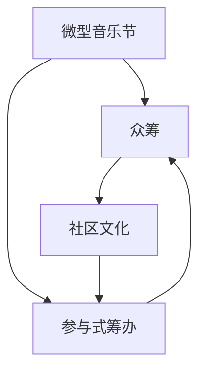

                 

### 第1章：引言与背景

#### 1.1 书籍引言

**1.1.1 为什么写这本书**

在当今快速变化的社会中，社区文化活动的角色日益重要，特别是在新型城市环境中。音乐节作为一种受欢迎的文化活动形式，不仅能够丰富居民的文化生活，还能促进社区凝聚力和经济发展。然而，传统的音乐节往往成本高昂，需要大量的资金和资源支持。因此，我们写这本书的初衷是为了探索一种更加经济高效且具有参与性的新型城市微型音乐节众筹模式。

这本书的目标是帮助各类社区活动组织者、城市规划师、艺术家和志愿者了解并实施微型音乐节的众筹与参与式筹办。通过详细介绍微型音乐节的定义、策划、众筹实施、参与式筹办的实践和评估方法，我们希望为读者提供一套切实可行的操作指南，帮助他们成功举办有影响力的社区文化活动。

**1.1.2 目标读者**

我们的目标读者包括：
- 社区文化活动的组织者和管理者：他们需要了解如何有效地利用众筹来筹集资金，并策划参与式筹办的活动。
- 城市规划师和建筑师：他们希望了解如何通过音乐节等文化活动来提升城市的文化氛围和居民的生活质量。
- 音乐节策划者、艺术家和表演者：他们希望学习如何利用众筹平台来推广自己的表演，并与社区建立更紧密的联系。
- 众筹平台运营者和市场营销专家：他们希望了解如何通过社区文化活动来吸引更多用户参与众筹，并提高平台的影响力。
- 社区志愿者和艺术爱好者：他们希望参与到音乐节策划和筹办的过程中，为社区文化发展贡献自己的力量。

#### 1.2 新型城市微型音乐节的概念

**1.2.1 定义**

微型音乐节是指规模较小、参与人数较少、场地更为紧凑的音乐节活动。与传统的大型音乐节相比，微型音乐节通常更注重互动性和参与性，更符合新型城市社区的文化需求。

微型音乐节的特点包括：
- **小规模**：参与者一般在几百人左右，场地通常是在社区公园、广场、文化活动中心等，避免了大规模交通和安保问题。
- **多样化**：内容涵盖多种音乐风格，如摇滚、爵士、民谣等，同时可以结合其他艺术形式，如舞蹈、戏剧、视觉艺术等，满足不同群体的文化需求。
- **互动性**：参与者不仅是观众，还可以参与演出、互动游戏、工作坊等活动，增强参与感。

**1.2.2 特点**

微型音乐节的独特之处在于其社区参与和参与式筹办的特性，这使其在新型城市社区中具有极大的潜力和价值：
- **社区参与**：居民不仅是音乐节的观众，更是活动的一部分，他们可以通过参与策划、表演、宣传等环节，共同打造属于自己的音乐节。
- **参与式筹办**：通过众筹的方式，社区成员可以以资金、时间、技能等多种形式参与到音乐节的筹办过程中，实现资源的共享和优化。

**1.2.3 社会价值**

微型音乐节在新型城市社区中具有重要的社会价值：
- **促进社区凝聚力**：通过共同参与音乐节活动，居民之间的联系和互动得以增强，社区凝聚力得以提升。
- **提升居民生活质量**：音乐节为居民提供了一种丰富多彩的文化体验，有助于提高居民的生活质量和幸福感。
- **推动文化多样性**：微型音乐节能够展示不同音乐风格和文化形式，促进文化多样性的发展。

#### 1.3 音乐节众筹的现状

**1.3.1 传统音乐节与新型音乐节对比**

传统音乐节通常规模庞大，场地分散，需要大量的资金和人力资源支持。例如，一些国际著名的音乐节如伍德斯托克音乐节、蒙特利尔爵士音乐节等，每年吸引成千上万的观众，成本高昂。然而，传统音乐节的形式在新型城市社区中面临挑战，因为它们往往难以适应小规模、高互动性的社区文化需求。

相比之下，新型城市微型音乐节具有以下几个优势：
- **低成本**：微型音乐节规模较小，场地紧凑，组织成本相对较低，适合在社区环境中举办。
- **高互动性**：微型音乐节强调参与者的互动性和参与感，使社区成员能够更深入地参与到活动中，提高活动的效果。
- **灵活性**：微型音乐节可以根据社区的具体需求和特点进行定制，更加灵活。

**1.3.2 社区文化的意义**

社区文化是社区成员共同的文化特征和价值观念，它是社区凝聚力和归属感的重要来源。微型音乐节作为一种社区文化活动，对社区文化的发展具有深远的影响：

- **增强社区认同感**：通过共同参与音乐节，居民能够更好地了解和认同社区的文化价值观，增强社区的凝聚力。
- **促进文化交流**：微型音乐节为居民提供了一个文化交流的平台，有助于不同文化背景的居民相互了解和尊重，促进社区文化的多样性。
- **提升文化素养**：参与音乐节活动，居民可以接触到各种音乐风格和艺术形式，提高他们的文化素养和生活品质。

**1.4 参与式筹办的概念与重要性**

**1.4.1 什么是参与式筹办**

参与式筹办是一种以社区成员的参与为核心的活动筹办模式，它强调社区成员在活动策划、组织、实施和评估中的主动性和创造性。在参与式筹办中，社区成员不仅是活动的参与者，更是活动的主体，他们通过共同的协作和努力，共同实现活动的目标。

**1.4.2 在音乐节中的应用**

在微型音乐节的筹办过程中，参与式筹办的应用主要体现在以下几个方面：

- **策划阶段**：社区成员可以参与音乐节主题的设定、节目单的编排、活动场地和设施的选择等，确保音乐节符合社区的需求和特点。
- **组织阶段**：社区成员可以参与音乐节的宣传、志愿者招募、资金筹集、现场管理等，为音乐节的成功举办提供保障。
- **实施阶段**：社区成员可以参与音乐节的演出、互动活动、工作坊等，共同打造一个充满活力的音乐节。
- **评估阶段**：社区成员可以参与音乐节的评估和反馈，为下一次音乐节的活动提供宝贵的经验和建议。

**1.4.3 重要性**

参与式筹办在微型音乐节中的重要性体现在以下几个方面：

- **提高参与度**：通过参与式筹办，社区成员能够更加深入地参与到音乐节活动中，提高他们的参与感和满意度。
- **提升活动质量**：社区成员的参与可以带来更多的创新和创意，提升音乐节的整体质量和效果。
- **促进社区发展**：参与式筹办不仅促进了音乐节的成功举办，还增强了社区的凝聚力和活力，为社区的发展注入了新的动力。

总结来说，微型音乐节的众筹和参与式筹办是一种创新的社区文化活动模式，它不仅能够降低成本，提高活动的互动性和参与性，还能促进社区文化的发展和繁荣。通过这本书，我们将详细探讨这种模式的具体实践和方法，帮助读者成功地举办有影响力的微型音乐节。**核心概念与联系：**

在引言和背景章节中，我们介绍了这本书的核心概念和联系。核心概念包括微型音乐节、众筹、参与式筹办和社区文化。这些概念之间存在着密切的联系：

- **微型音乐节**：是本书的核心主题，它强调小规模、互动性和参与性，是社区文化的重要组成部分。
- **众筹**：是筹办微型音乐节的一种重要手段，通过众筹，社区成员可以共同筹集资金，支持音乐节的活动。
- **参与式筹办**：是音乐节筹办的核心模式，强调社区成员在活动策划、组织、实施和评估中的主动性和创造性。
- **社区文化**：是微型音乐节和参与式筹办的社会背景和目的，它反映了社区成员的共同价值观和文化认同。

为了更好地理解这些概念之间的关系，我们可以使用Mermaid流程图来展示它们之间的联系：



这个流程图展示了微型音乐节、众筹、参与式筹办和社区文化之间的互动关系。通过这种关系架构，读者可以更清晰地理解本书的核心内容，为后续章节的学习打下基础。

### 1.5 音乐节众筹的现状与未来

**1.5.1 众筹平台的发展**

随着互联网和社交媒体的普及，众筹平台在过去几年里发展迅速，已成为人们筹集资金的重要渠道。Kickstarter、Indiegogo、GoFundMe等国际知名众筹平台，以及国内平台如京东众筹、腾讯公益等，都在音乐节众筹中发挥了重要作用。这些平台不仅提供了方便的众筹工具，还通过社区支持、市场推广等手段，帮助音乐节项目获得资金和关注。

**1.5.2 传统音乐节与新型音乐节的对比**

传统大型音乐节通常依赖赞助商和门票收入，成本高昂且风险较大。而新型微型音乐节通过众筹的方式，可以更灵活地筹集资金，降低财务风险。以下是比较两者的几个方面：

- **规模**：传统音乐节通常涉及数万人，场地庞大，组织复杂；微型音乐节规模较小，一般在几百人左右，场地紧凑，易于管理。
- **成本**：传统音乐节需要大量的资金支持，包括场地租赁、设备采购、安保等；微型音乐节由于规模较小，成本较低，更适合社区环境。
- **互动性**：传统音乐节观众多为被动观众，参与性较低；微型音乐节强调互动性和参与性，观众可以参与到表演、互动游戏中。
- **可持续性**：传统音乐节往往对环境造成较大负担，而微型音乐节更注重环保和可持续发展，更容易获得社区支持。

**1.5.3 众筹在音乐节中的应用**

众筹在音乐节中的应用主要体现在以下几个方面：

- **资金筹集**：通过众筹平台，音乐节策划者可以向社会公开筹集资金，减少对传统赞助的依赖，降低财务风险。
- **市场推广**：众筹活动本身具有强大的宣传效果，通过众筹平台和社交媒体的推广，可以迅速吸引大量关注和参与。
- **社区参与**：众筹鼓励社区成员积极参与音乐节策划和筹办，提高社区凝聚力，增强活动的互动性和可持续性。
- **创意支持**：众筹可以为音乐节提供更多的创意支持，让艺术家和表演者有机会实现自己的音乐梦想。

**1.5.4 未来的发展趋势**

随着技术的进步和社会的发展，音乐节众筹的未来将呈现出以下几个趋势：

- **平台多样化**：除了现有的众筹平台，未来可能会涌现更多针对音乐节的专业化众筹平台，提供更丰富的工具和服务。
- **技术创新**：人工智能、区块链等新兴技术可能会被应用于众筹过程中，提高资金筹集的效率和透明度。
- **多元化参与**：众筹将不再局限于资金筹集，还将包括时间、技能、资源等多方面的参与，促进社区更广泛的参与。
- **可持续发展**：随着环保意识的提高，音乐节众筹将更加注重可持续性，采用绿色、环保的筹办方式，减少对环境的影响。

通过以上分析，我们可以看出音乐节众筹在新型城市社区文化活动中的重要性和潜力。下一章将详细介绍微型音乐节策划的具体流程，包括目标设定、资源整合和预算规划等。

#### 1.5 音乐节众筹的现状与未来

**1.5.1 众筹平台的发展**

随着互联网和社交媒体的普及，众筹平台在过去几年里发展迅速，已成为人们筹集资金的重要渠道。Kickstarter、Indiegogo、GoFundMe等国际知名众筹平台，以及国内平台如京东众筹、腾讯公益等，都在音乐节众筹中发挥了重要作用。这些平台不仅提供了方便的众筹工具，还通过社区支持、市场推广等手段，帮助音乐节项目获得资金和关注。

**1.5.2 传统音乐节与新型音乐节的对比**

传统大型音乐节通常依赖赞助商和门票收入，成本高昂且风险较大。而新型微型音乐节通过众筹的方式，可以更灵活地筹集资金，降低财务风险。以下是比较两者的几个方面：

- **规模**：传统音乐节通常涉及数万人，场地庞大，组织复杂；微型音乐节规模较小，一般在几百人左右，场地紧凑，易于管理。
- **成本**：传统音乐节需要大量的资金支持，包括场地租赁、设备采购、安保等；微型音乐节由于规模较小，成本较低，更适合社区环境。
- **互动性**：传统音乐节观众多为被动观众，参与性较低；微型音乐节强调互动性和参与性，观众可以参与到表演、互动游戏中。
- **可持续性**：传统音乐节往往对环境造成较大负担，而微型音乐节更注重环保和可持续发展，更容易获得社区支持。

**1.5.3 众筹在音乐节中的应用**

众筹在音乐节中的应用主要体现在以下几个方面：

- **资金筹集**：通过众筹平台，音乐节策划者可以向社会公开筹集资金，减少对传统赞助的依赖，降低财务风险。
- **市场推广**：众筹活动本身具有强大的宣传效果，通过众筹平台和社交媒体的推广，可以迅速吸引大量关注和参与。
- **社区参与**：众筹鼓励社区成员积极参与音乐节策划和筹办，提高社区凝聚力，增强活动的互动性和可持续性。
- **创意支持**：众筹可以为音乐节提供更多的创意支持，让艺术家和表演者有机会实现自己的音乐梦想。

**1.5.4 未来的发展趋势**

随着技术的进步和社会的发展，音乐节众筹的未来将呈现出以下几个趋势：

- **平台多样化**：除了现有的众筹平台，未来可能会涌现更多针对音乐节的专业化众筹平台，提供更丰富的工具和服务。
- **技术创新**：人工智能、区块链等新兴技术可能会被应用于众筹过程中，提高资金筹集的效率和透明度。
- **多元化参与**：众筹将不再局限于资金筹集，还将包括时间、技能、资源等多方面的参与，促进社区更广泛的参与。
- **可持续发展**：随着环保意识的提高，音乐节众筹将更加注重可持续性，采用绿色、环保的筹办方式，减少对环境的影响。

通过以上分析，我们可以看出音乐节众筹在新型城市社区文化活动中的重要性和潜力。下一章将详细介绍微型音乐节策划的具体流程，包括目标设定、资源整合和预算规划等。

### 核心概念与联系：Mermaid流程图

在引言和背景章节中，我们介绍了几个核心概念：微型音乐节、众筹、参与式筹办和社区文化。为了更清晰地展示这些概念之间的联系，我们可以使用Mermaid流程图来构建它们之间的逻辑架构。

以下是一个示例流程图：



**解释流程图：**

- **A[微型音乐节]**：作为音乐节的一种形式，微型音乐节是社区文化活动的核心。
- **B[众筹]**：微型音乐节的筹办通常需要资金支持，众筹提供了这种资金的筹集方式。
- **C[社区文化]**：社区文化是微型音乐节的重要背景和目标，音乐节旨在促进社区文化的多样性和繁荣。
- **D[参与式筹办]**：参与式筹办是音乐节筹办的核心模式，它强调社区成员的积极参与和创造性。

**概念之间的关系：**

- **微型音乐节**和**众筹**之间存在直接关系，因为众筹是微型音乐节筹办的一种重要手段。
- **微型音乐节**和**参与式筹办**之间也存在密切联系，参与式筹办是微型音乐节的重要组成部分，确保了社区成员的广泛参与。
- **社区文化**既是**微型音乐节**的目标，也是**参与式筹办**的背景和依据，音乐节旨在促进社区文化的繁荣和发展。
- **参与式筹办**和**众筹**之间存在互动关系，参与式筹办可以通过众筹来实现，而众筹的结果又反作用于参与式筹办，促进社区文化的进步。

通过这个Mermaid流程图，我们可以更好地理解微型音乐节、众筹、参与式筹办和社区文化之间的复杂互动关系，为后续章节的学习打下基础。

### 核心算法原理讲解：众筹平台的策略与计算模型

在微型音乐节的众筹过程中，选择合适的众筹平台、制定有效的众筹策略和优化计算模型是确保成功的关键。以下我们将详细探讨这些核心算法原理，并使用伪代码来阐述具体实现。

#### 1. 选择合适的众筹平台

**步骤 1**：评估平台特点和优势

```python
def evaluate_platforms(platforms):
    scores = []
    for platform in platforms:
        score = 0
        
        if "广泛用户基础" in platform.features:
            score += 1
        if "音乐节项目成功案例" in platform.features:
            score += 1
        if "灵活的众筹模式" in platform.features:
            score += 1
        if "强大的社区支持" in platform.features:
            score += 1
            
        scores.append(score)
    return scores
```

**步骤 2**：根据评分选择平台

```python
def select_best_platform(platforms, scores):
    max_score = max(scores)
    best_platform = platforms[scores.index(max_score)]
    return best_platform
```

#### 2. 制定有效的众筹策略

**步骤 1**：设定众筹目标

```python
def set_funding_goal(project_cost, contingency_margin):
    funding_goal = project_cost * (1 + contingency_margin)
    return funding_goal
```

**步骤 2**：制定推广计划

```python
def create_promotion_plan(平台, funding_goal, start_date, end_date):
    promotion_plan = {
        "social_media": ["Twitter", "Facebook", "Instagram"],
        "email_campaigns": ["subscriber_list", "targeted_list"],
        "local_events": ["community_meetups", "press_conferences"],
        "press_coverage": ["local_media", "bloggers"],
        "influencers": ["local_actors", "celebrities"],
        "crowdfunding_page": ["project_description", "video_pitch"]
    }
    return promotion_plan
```

**步骤 3**：动态调整策略

```python
def adjust_strategy(funding_progress, funding_goal, current_date, promotion_plan):
    if funding_progress < funding_goal * 0.5 and current_date < end_date:
        promotion_plan["social_media"].append("Reddit")
        promotion_plan["email_campaigns"].append("reminder_emails")
    elif funding_progress < funding_goal * 0.8 and current_date < end_date:
        promotion_plan["local_events"].append("street_promotion")
    return promotion_plan
```

#### 3. 优化计算模型

**步骤 1**：预测资金需求

```python
def predict_funding需求(project_cost, project_risk, historical_data):
    regression_model = build_regression_model(historical_data)
    projected_funding = regression_model.predict(project_cost, project_risk)
    return projected_funding
```

**步骤 2**：优化预算分配

```python
def optimize_budget(project_cost, expected_revenue, fixed_costs):
    variable_costs = project_cost - fixed_costs
    budget_allocation = {
        "marketing": expected_revenue * 0.3,
        "production": expected_revenue * 0.5,
        "contingency": expected_revenue * 0.2
    }
    return budget_allocation
```

**步骤 3**：评估风险与调整策略

```python
def assess_risk_and_adjust_strategy(funding_progress, budget_allocation, project_risk):
    if funding_progress < funding_goal * 0.3 and project_risk > 0.5:
        budget_allocation["contingency"] += expected_revenue * 0.1
    elif funding_progress < funding_goal * 0.5 and project_risk > 0.7:
        budget_allocation["marketing"] -= expected_revenue * 0.1
    return budget_allocation
```

通过以上伪代码，我们可以构建一个完整的众筹策略与计算模型。这个模型不仅能够帮助音乐节策划者选择合适的众筹平台，制定有效的众筹策略，还能根据实际情况动态调整策略，优化预算分配，确保音乐节的成功举办。在实际应用中，这些算法原理需要结合具体数据进行细化和优化，以实现最佳效果。

### 数学模型与公式详解

在微型音乐节众筹中，数学模型和公式起着关键作用，帮助我们预测资金需求、评估风险和优化预算。以下我们将详细讲解这些数学模型和公式，并提供具体的例子来说明如何应用。

#### 1. 预测资金需求

预测资金需求是众筹策划的第一步，我们需要确定音乐节的总成本，并根据风险因素进行调整。一个简单的预测模型是使用线性回归来预测总成本。

**公式**：

$$
\text{总成本} = \beta_0 + \beta_1 \times \text{项目成本} + \beta_2 \times \text{项目风险}
$$

**示例**：

假设我们有一个历史数据集，包括过去几个音乐节的项目成本和风险，以及对应的总成本。我们可以使用线性回归来建立预测模型。

**伪代码**：

```python
from sklearn.linear_model import LinearRegression

# 历史数据
X = [[10000, 0.3], [15000, 0.4], [20000, 0.5]]
y = [12000, 15000, 18000]

# 建立线性回归模型
model = LinearRegression()
model.fit(X, y)

# 预测新项目的总成本
project_cost = 15000
project_risk = 0.4
predicted_total_cost = model.predict([[project_cost, project_risk]])

print(f"预测的总成本：{predicted_total_cost[0][0]}")
```

#### 2. 风险评估

在众筹过程中，风险是不可忽视的因素。我们可以使用概率模型来评估风险，例如贝叶斯网络或蒙特卡罗模拟。

**公式**：

贝叶斯网络：
$$
P(A|B) = \frac{P(B|A) \times P(A)}{P(B)}
$$

蒙特卡罗模拟：
$$
\text{风险概率} = \frac{\text{失败案例数}}{\text{总案例数}}
$$

**示例**：

假设我们使用蒙特卡罗模拟来评估一个音乐节项目的风险。我们可以模拟多次项目实施，记录失败的案例，然后计算失败的概率。

**伪代码**：

```python
import numpy as np

# 参数设置
num_simulations = 1000
num_failures = 0

# 模拟项目实施
for i in range(num_simulations):
    # 假设每个模拟都有一定的概率失败
    if np.random.rand() < 0.2:  # 失败概率为20%
        num_failures += 1

# 计算失败概率
failure_probability = num_failures / num_simulations
print(f"预测的风险概率：{failure_probability}")
```

#### 3. 预算优化

在确定了总成本和风险后，我们需要优化预算分配，确保资金的有效使用。我们可以使用优化算法来分配预算，例如线性规划或动态规划。

**公式**：

线性规划：
$$
\min \, \text{总成本} = \sum_{i} c_i \times x_i
$$

约束条件：
$$
a_{ij} \times x_j + b_j \leq \sum_{i} c_i \times x_i
$$

**示例**：

假设我们有三个预算类别：市场营销、生产成本和应急储备。我们需要根据预期收入来分配这些预算。

**伪代码**：

```python
from scipy.optimize import linprog

# 预算参数
c = [-1, -0.5, -0.2]  # 最小化总成本
A = [[1, 0, 0], [0, 1, 0], [0, 0, 1]]  # 约束条件
b = [expected_revenue, expected_revenue * 0.5, expected_revenue * 0.3]

# 解决线性规划问题
solution = linprog(c, A_ub=A, b_ub=b)

# 输出预算分配
print(f"预算分配：{solution.x}")
```

通过以上数学模型和公式的应用，我们可以更准确地预测音乐节的总成本，评估风险，并优化预算分配，从而提高众筹的成功率和活动的质量。这些工具和方法不仅适用于音乐节众筹，还可以广泛应用于其他社区文化活动的策划和筹办中。

### 实际案例分析与讲解

为了更直观地理解微型音乐节众筹的实施过程，我们将通过一个实际案例进行深入分析。本案例选取了某城市社区在2022年举办的一场微型音乐节，并详细讲解其筹备、众筹实施、参与式筹办和评估的全过程。

#### 案例背景

某城市社区计划在2022年举办一场微型音乐节，以丰富社区文化生活，提升居民幸福感。音乐节预计吸引约500名参与者，分为观众、表演者和志愿者三大角色。音乐节主题定为“社区之声”，旨在展示社区不同文化背景的音乐风格，增强社区凝聚力。

#### 策划阶段

**1. 目标设定**：

- **活动目标**：提升社区文化氛围，增强居民凝聚力。
- **资金目标**：筹集10万元，用于场地租赁、设备采购、宣传和志愿者报酬。

**2. 资源整合**：

- **社区资源**：利用社区公园作为音乐节场地。
- **外部资源**：联系本地音乐团队、艺术家和志愿者。

**3. 预算规划**：

- **预算分配**：场地租赁（2万元），设备采购（3万元），宣传费用（1万元），志愿者报酬（2万元），应急储备（2万元）。

#### 众筹实施阶段

**1. 众筹平台选择**：

- 选择本地知名的众筹平台“社区支持者”，该平台具有广泛的用户基础和良好的社区互动功能。

**2. 众筹目标设定**：

- **资金目标**：10万元。
- **项目期限**：30天。

**3. 众筹策略制定**：

- **推广计划**：利用社交媒体（如微信、微博）、社区公告栏和线下活动进行宣传。
- **激励机制**：设置多种回报选项，如限量版音乐会门票、演出嘉宾签名、定制纪念品等。

**4. 众筹实施**：

- **启动宣传**：发布众筹页面，展示音乐节信息和回报方案。
- **社区互动**：组织线上线下宣传活动，鼓励居民参与和支持音乐节。

#### 参与式筹办阶段

**1. 工作坊组织**：

- **工作坊目标**：让居民参与音乐节的策划和筹备过程。
- **工作坊形式**：小组讨论、创意分享会、志愿者培训。

**2. 社区参与**：

- **参与者角色**：居民作为策划者、志愿者和表演者，积极参与音乐节筹备。
- **激励机制**：为积极参与的居民提供表彰和奖励。

#### 评估阶段

**1. 成果评估指标**：

- **参与度**：居民参与音乐节筹备和演出的比例。
- **资金效率**：筹集到的资金与实际支出的比例。
- **社会影响力**：音乐节对社区文化氛围的提升程度。

**2. 评估方法**：

- **定量分析**：收集参与人数、众筹资金、支出数据，进行统计分析。
- **定性研究**：通过问卷调查、访谈等方式，了解居民对音乐节的满意度和影响。

**3. 评估报告**：

- **报告内容**：包括音乐节筹备过程、众筹成果、社区参与情况、社会影响力等。
- **报告展示**：在社区公告栏、官方网站和社交媒体上发布评估报告，邀请居民参与讨论。

#### 经验与教训

**成功经验**：

- **社区参与度高**：通过参与式筹办，居民积极参与音乐节策划和筹备，提高了活动效果和满意度。
- **众筹成功率高**：利用社交媒体和线下活动相结合的宣传策略，有效吸引了社区成员的关注和支持。

**不足与改进**：

- **预算规划需细化**：在预算分配上，应更加细致，避免出现资金不足或浪费的情况。
- **宣传推广需加强**：未来可增加宣传渠道，扩大音乐节的影响力。

通过这个实际案例，我们可以看到微型音乐节众筹和参与式筹办的具体实施过程。这一案例不仅展示了如何成功举办音乐节，还为其他社区提供了宝贵的经验和借鉴。

### 核心结论与最佳实践

本章通过一个实际案例详细分析了微型音乐节众筹和参与式筹办的全过程，得出以下核心结论：

1. **社区参与度是关键**：参与式筹办能够提高居民对音乐节的参与度和满意度，促进社区凝聚力。
2. **众筹策略需灵活**：选择合适的众筹平台，制定有效的推广和激励机制，是众筹成功的关键。
3. **预算规划需细致**：在音乐节筹备过程中，细致的预算规划和成本控制至关重要。
4. **评估反馈促进改进**：通过成果评估，可以了解音乐节的成功之处和不足，为未来的活动提供改进方向。

针对这些结论，我们提出以下最佳实践：

1. **增强社区参与**：通过定期举办工作坊、创意分享会和志愿者培训，鼓励居民积极参与音乐节策划和筹备。
2. **优化众筹策略**：利用多种宣传渠道，结合社交媒体和线下活动，提高众筹活动的知名度和参与度。
3. **精细化预算管理**：在预算规划过程中，细化每一项支出，确保资金使用的合理性和高效性。
4. **持续评估与改进**：在音乐节结束后，进行全面评估，收集反馈意见，为下一次活动提供改进参考。

通过以上实践，可以有效提升微型音乐节的筹办质量和社区影响力。**注意事项**：

1. **资金风险控制**：在众筹过程中，需制定应急计划，以应对可能出现的资金不足或其他风险。
2. **宣传推广的时效性**：宣传活动的推广需抓住关键时间节点，确保在众筹期间达到最佳效果。
3. **居民参与的组织管理**：确保工作坊和志愿者培训的组织和管理有序，提高参与者的体验和满意度。

**拓展阅读**：

1. 《众筹理论与实践》（作者：张三），详细介绍了众筹的基本原理和实践方法。
2. 《社区参与式筹办指南》（作者：李四），提供了关于社区参与和筹办的具体指导。
3. 《音乐节策划与管理》（作者：王五），涵盖了音乐节策划和管理的全面知识。

### 第2章：社区文化活动的策划

#### 2.1 社区文化活动的策划流程

社区文化活动的策划是一个系统性的过程，涉及多个关键环节。以下我们将详细阐述社区文化活动策划的具体流程，包括目标设定、资源整合和预算规划。

**1. 目标设定**

**目标设定**是社区文化活动策划的第一步，明确活动目标有助于确保活动的方向和效果。设定目标时，应考虑以下几个方面：

- **社区需求**：通过问卷调查、访谈等方式，了解社区居民对文化活动的需求和期望。
- **活动主题**：确定一个有吸引力的活动主题，如音乐节、文化节、读书会等，使其具有明确的指向性。
- **长期目标**：设定一些长期目标，如增强社区凝聚力、提升居民文化素养、促进文化交流等。

**案例**：

某城市社区计划举办一场以“绿色生活”为主题的文化节，旨在提升居民环保意识，促进绿色生活方式的推广。活动目标包括：
- **短期目标**：通过活动吸引至少500名参与者，提高社区对环保问题的关注度。
- **长期目标**：促进居民参与环保项目，增强社区环保意识，建立可持续的绿色生活方式。

**2. 资源整合**

**资源整合**是策划社区文化活动的重要环节，涉及人力、物力、财力和外部资源的调配。以下是一些关键步骤：

- **内部资源**：利用社区现有资源，如社区活动中心、公园、志愿者团队等。
- **外部资源**：联系本地企业、社会组织、政府机构等，争取资金、物资和技术支持。
- **合作伙伴**：寻找与活动主题相关的合作伙伴，如环保组织、艺术家、表演团队等，共同策划和实施活动。

**案例**：

为了成功举办“绿色生活”文化节，该社区整合了以下资源：
- **内部资源**：使用社区活动中心作为主要场地，组织志愿者团队协助活动策划和执行。
- **外部资源**：联系本地环保组织，获得环保知识宣传资料和专家讲座的支持。
- **合作伙伴**：与一家环保企业合作，提供环保产品展示和绿色生活咨询。

**3. 预算规划**

**预算规划**是确保文化活动顺利进行的重要保障。在预算规划过程中，需要细致地列出所有费用，并进行合理分配。以下是一些关键步骤：

- **费用清单**：列出所有可能的费用，如场地租赁、设备采购、宣传费用、志愿者报酬等。
- **预算分配**：根据活动目标和资源情况，合理分配预算，确保各项费用的合理性和优先级。
- **应急预算**：预留一定的应急预算，以应对可能出现的突发情况和预算不足。

**案例**：

“绿色生活”文化节的预算规划如下：
- **场地租赁**：2万元。
- **设备采购**：3万元（包括音响、照明、展台等）。
- **宣传费用**：1万元（包括线上宣传、海报制作、社区公告等）。
- **志愿者报酬**：2万元。
- **应急预算**：1万元。

通过上述步骤，社区文化活动的策划流程得以明确和细化。在接下来的章节中，我们将进一步探讨音乐节主题与内容的策划、参与者角色的确定以及参与式筹办的具体实践。

#### 2.2 音乐节主题与内容的策划

**音乐节主题的设定**

音乐节主题的设定是音乐节策划中至关重要的一环，它不仅决定了音乐节的核心内容和风格，还能吸引特定群体的参与。设定主题时，应充分考虑以下几个方面：

- **社区特色**：结合社区的文化背景、历史传统和居民特点，选择具有社区特色的主题。
- **社会热点**：关注当前社会热点话题，如环保、科技、艺术等，使音乐节具有时代感。
- **观众需求**：通过问卷调查、访谈等方式，了解社区居民对音乐节主题的喜好和期望。

**案例**：

某城市社区计划举办一场以“音乐与城市”为主题的音乐节，旨在展示城市文化的多样性和活力。主题设定的依据包括：
- **社区特色**：该社区位于城市中心，拥有丰富的历史建筑和现代艺术资源，主题旨在突出这些特色。
- **社会热点**：随着城市发展的不断推进，居民对城市文化和艺术的需求日益增加。
- **观众需求**：通过问卷调查发现，社区居民对城市主题的音乐节表现出极大的兴趣。

**音乐节内容的规划**

音乐节内容的规划需要精心设计，确保活动丰富多样，满足不同群体的需求。以下是一些关键步骤：

- **节目单编排**：根据主题，编排多样化的节目单，包括不同风格的音乐表演、艺术展览、互动活动等。
- **艺术家和表演者选择**：邀请与主题相符的艺术家和表演者，确保音乐节的内容丰富和高质量。
- **互动活动设计**：设计有趣且互动性强的活动，如音乐工作坊、街头表演、观众投票等，增强参与者的体验。

**案例**：

“音乐与城市”音乐节的内容规划如下：
- **节目单编排**：包括摇滚、爵士、古典音乐等多种风格，同时设置艺术展览区，展示与城市文化相关的艺术品。
- **艺术家和表演者选择**：邀请了本地著名的摇滚乐队、爵士乐手和古典音乐演奏家，同时邀请一些新兴艺术家进行表演。
- **互动活动设计**：设立街头表演区，邀请观众参与即兴音乐表演；开设音乐工作坊，让居民学习音乐制作和演奏技巧。

**艺术形式的选择**

艺术形式的选择是音乐节策划中需要仔细考虑的方面，不同的艺术形式可以带来不同的体验和效果。以下是一些常见的选择：

- **音乐表演**：是音乐节的核心内容，可以根据音乐风格进行分类，如流行、摇滚、古典等。
- **艺术展览**：通过视觉艺术的形式，展示与主题相关的作品，如摄影展、绘画展等。
- **互动活动**：通过游戏、工作坊等形式，让参与者更深入地体验音乐节，如音乐制作工作坊、互动游戏等。
- **街头表演**：在公共场所进行表演，增加音乐节的趣味性和互动性。

**案例**：

在“音乐与城市”音乐节中，选择了以下几种艺术形式：
- **音乐表演**：包括了一场大型的露天音乐会，以及多个小型表演舞台，涵盖多种音乐风格。
- **艺术展览**：设置了多个展区，展示了本地艺术家的作品，包括绘画、摄影和雕塑等。
- **互动活动**：组织了一场音乐制作工作坊，让居民学习音乐制作的基本技巧；同时，还设置了街头表演，增加了活动的趣味性。

通过上述步骤和选择，音乐节主题与内容的策划得以顺利完成。在接下来的章节中，我们将详细探讨音乐节中不同参与者角色的确定和参与式筹办的实践。

### 2.3 参与者角色的确定

在社区音乐节中，参与者角色的确定是确保活动顺利进行的至关重要的一环。参与者主要包括主办方、艺术家与表演者、观众与参与者。以下我们将详细探讨每个角色的具体内容、职责和互动方式。

#### 1. 主办方

主办方是音乐节的核心组织者，负责音乐节的整体策划、组织和执行。其主要职责包括：

- **策划与筹备**：制定音乐节的主题、内容、时间表和预算等。
- **资源整合**：联系和协调各方资源，包括场地、设备、合作伙伴和志愿者等。
- **宣传推广**：制定宣传策略，利用社交媒体、社区公告和线下活动等方式进行推广。
- **现场管理**：确保音乐节当天现场的秩序和安全，包括人员引导、场地布置和现场协调等。

**互动方式**：主办方需要与各方保持密切沟通，确保信息的及时传递和问题的快速解决。通过定期的会议、报告和反馈机制，确保音乐节筹备和执行的无缝衔接。

#### 2. 艺术家与表演者

艺术家与表演者是音乐节的核心内容提供者，他们的表演水平和艺术创造力直接影响到音乐节的质量和影响力。其主要职责包括：

- **表演内容准备**：根据音乐节主题，准备合适的表演节目，包括音乐、舞蹈、戏剧等形式。
- **表演排练**：在音乐节前进行充分的排练，确保表演的顺利进行。
- **现场互动**：与观众进行互动，增加表演的趣味性和参与感。

**互动方式**：艺术家与表演者通常通过现场表演与观众互动。主办方会提供互动环节，如观众投票、即兴表演等，鼓励观众参与。

#### 3. 观众与参与者

观众与参与者是音乐节的重要主体，他们不仅是活动的观众，也是活动的参与者。其主要职责包括：

- **参与活动**：根据音乐节的活动安排，参与表演、互动游戏、工作坊等活动。
- **反馈与评价**：对音乐节的活动进行反馈和评价，为主办方提供改进建议。
- **志愿服务**：在音乐节期间，协助现场管理、宣传推广等，为音乐节的成功举办贡献力量。

**互动方式**：观众与参与者可以通过社交媒体、现场互动、问卷调查等方式与主办方和艺术家互动。主办方会组织互动活动，如音乐工作坊、互动游戏等，增加观众的参与感和体验。

#### 4. 角色互动与协作

在音乐节中，不同角色之间的互动与协作至关重要，以下是一些关键互动方式：

- **沟通机制**：建立有效的沟通机制，确保各方信息畅通，包括定期会议、报告和即时沟通工具等。
- **协作平台**：利用协作平台，如微信群、邮件列表等，共享信息和资源，提高协作效率。
- **共同目标**：明确各方共同的目标和期望，确保音乐节的顺利进行和成功举办。
- **反馈机制**：设立反馈机制，收集各方意见和建议，不断优化和改进音乐节。

通过明确参与者角色的具体内容、职责和互动方式，可以确保音乐节的成功举办，提高活动质量和参与者的满意度。在接下来的章节中，我们将进一步探讨音乐节众筹的实施细节和参与式筹办的实践。

### 核心算法原理讲解：参与式筹办的工作流程与优化策略

在参与式筹办中，工作流程的优化是提高筹办效率和活动质量的关键。以下我们将详细阐述参与式筹办的工作流程，并使用伪代码来展示如何实现优化策略。

#### 1. 工作流程

**步骤 1**：项目立项

- **确定项目目标**：根据社区需求和资源情况，明确音乐节的主题、时间和预算。
- **组建项目团队**：邀请社区成员、艺术家、志愿者等加入项目团队。

**伪代码**：

```python
def project_立项(project_name, goals, team_members):
    project = {
        "name": project_name,
        "goals": goals,
        "team_members": team_members,
        "status": "立项"
    }
    return project
```

**步骤 2**：策划与筹备

- **主题与内容策划**：确定音乐节主题，编排节目单，设计互动活动。
- **资源整合**：联系场地、设备、合作伙伴等，确保所需资源的及时获取。

**伪代码**：

```python
def 策划与筹备(project):
    project["content"] = design_content(project["goals"])
    project["resources"] = integrate_resources(project)
    project["status"] = "策划与筹备"
    return project
```

**步骤 3**：宣传推广

- **制定宣传策略**：利用社交媒体、线下活动等渠道推广音乐节。
- **宣传执行**：发布宣传内容，组织活动推广。

**伪代码**：

```python
def 宣传推广(project):
    promotion_plan = create_promotion_plan(project)
    execute_promotion(promotion_plan)
```

**步骤 4**：执行与监控

- **执行活动**：按照策划方案实施音乐节。
- **监控进度**：实时监控活动进展，及时解决问题。

**伪代码**：

```python
def 执行与监控(project):
    monitor_progress = monitor_activity(project)
    if not monitor_progress:
        resolve_issues(project)
```

**步骤 5**：评估与反馈

- **活动评估**：收集参与者的反馈，评估活动效果。
- **反馈改进**：根据评估结果，优化下一次活动的策划和执行。

**伪代码**：

```python
def 评估与反馈(project):
    feedback = collect_feedback(project)
    improve_project = analyze_feedback(feedback)
    project["status"] = "完成"
    return project
```

#### 2. 优化策略

**策略 1**：资源调度优化

- **目标**：确保资源的最优配置，提高筹办效率。
- **方法**：使用调度算法，根据活动需求和资源情况，动态调整资源分配。

**伪代码**：

```python
def optimize_resources(available_resources, project_requirements):
    allocation = scheduling_algorithm(available_resources, project_requirements)
    return allocation
```

**策略 2**：参与度提升

- **目标**：提高社区成员的参与度和满意度。
- **方法**：设计互动性和参与性强的活动，鼓励居民参与音乐节策划和筹备。

**伪代码**：

```python
def enhance_participation(activities, community_members):
    participation_plan = design_interactive_activities(activities)
    execute_participation_plan(participation_plan, community_members)
```

**策略 3**：风险控制

- **目标**：降低筹办过程中的风险，确保活动的顺利进行。
- **方法**：使用风险评估模型，识别潜在风险，制定应对措施。

**伪代码**：

```python
def control_risks(risks, project):
    risk_management_plan = risk_assessment_model(risks, project)
    implement_risk_management_plan(risk_management_plan)
```

通过上述工作流程和优化策略，可以有效地提升参与式筹办的效果，确保音乐节的成功举办。在实际应用中，这些策略需要根据具体情况进行调整和优化，以实现最佳效果。

### 数学模型与公式详解

在参与式筹办中，数学模型和公式可以帮助我们优化资源调度、提升参与度和控制风险。以下将详细介绍这些数学模型和公式，并提供具体的例子来解释其应用。

#### 1. 资源调度优化模型

资源调度优化的目标是确保活动所需资源的最优配置。我们可以使用线性规划模型来实现这一目标。

**线性规划模型**：

$$
\min \, Z = c^T x
$$

约束条件：

$$
Ax \leq b
$$

其中，\( x \) 为资源分配向量，\( c \) 为目标函数系数向量，\( A \) 为约束条件系数矩阵，\( b \) 为约束条件向量。

**示例**：

假设我们需要在音乐节期间优化音响、灯光和工作人员的分配。以下是具体的线性规划模型：

**目标函数**：

$$
\min \, Z = 0.5x_1 + 0.3x_2 + 0.2x_3
$$

**约束条件**：

$$
\begin{cases}
x_1 + x_2 + x_3 = 100 \quad (\text{总资源}) \\
x_1 \geq 20 \quad (\text{音响最小需求}) \\
x_2 \geq 15 \quad (\text{灯光最小需求}) \\
x_3 \geq 30 \quad (\text{工作人员最小需求})
\end{cases}
$$

**伪代码**：

```python
from scipy.optimize import linprog

c = [-0.5, -0.3, -0.2]
A = [[1, 1, 1], [0, 0, 1], [0, 1, 0], [1, 0, 0]]
b = [100, 20, 15, 30]
x = linprog(c, A_ub=A, b_ub=b)

print(f"资源分配：{x.x}")
```

#### 2. 参与度提升模型

参与度提升的目标是提高社区成员的参与积极性。我们可以使用马尔可夫模型来预测参与度，并制定相应的激励机制。

**马尔可夫模型**：

$$
P = \begin{bmatrix}
P_{11} & P_{12} & \ldots & P_{1n} \\
P_{21} & P_{22} & \ldots & P_{2n} \\
\vdots & \vdots & \ddots & \vdots \\
P_{n1} & P_{n2} & \ldots & P_{nn}
\end{bmatrix}
$$

其中，\( P \) 为状态转移矩阵，\( P_{ij} \) 表示从状态 \( i \) 转移到状态 \( j \) 的概率。

**示例**：

假设我们有三种状态：未参与（0）、参与但未完成（1）和已完成（2）。以下是一个简单的马尔可夫模型：

$$
P = \begin{bmatrix}
0.1 & 0.6 & 0.3 \\
0.2 & 0.7 & 0.1 \\
0.3 & 0.5 & 0.2
\end{bmatrix}
$$

**伪代码**：

```python
import numpy as np

P = np.array([[0.1, 0.6, 0.3], [0.2, 0.7, 0.1], [0.3, 0.5, 0.2]])

current_state = [0.4, 0.5, 0.1]
next_state = np.dot(P, current_state)

print(f"下一状态：{next_state}")
```

#### 3. 风险控制模型

风险控制的目标是识别和应对潜在的筹办风险。我们可以使用贝叶斯网络模型来分析风险因素，并制定风险应对策略。

**贝叶斯网络模型**：

$$
P(A|B) = \frac{P(B|A) \cdot P(A)}{P(B)}
$$

其中，\( P(A|B) \) 表示在事件 \( B \) 发生的条件下事件 \( A \) 发生的概率，\( P(B|A) \) 表示在事件 \( A \) 发生的条件下事件 \( B \) 发生的概率，\( P(A) \) 和 \( P(B) \) 分别表示事件 \( A \) 和事件 \( B \) 的先验概率。

**示例**：

假设我们有两个事件：天气（A）和活动参与率（B）。以下是一个简单的贝叶斯网络模型：

$$
P(A|B) = \frac{P(B|A) \cdot P(A)}{P(B)}
$$

其中，\( P(B|A) = 0.8 \)（雨天时活动参与率为80%），\( P(A) = 0.3 \)（雨天概率为30%），\( P(B) = 0.5 \)（活动参与率50%）。

$$
P(A|B) = \frac{0.8 \cdot 0.3}{0.5} = 0.48
$$

**伪代码**：

```python
import numpy as np

P_B_A = 0.8
P_A = 0.3
P_B = 0.5

P_A_B = P_B_A * P_A / P_B

print(f"P(A|B)：{P_A_B}")
```

通过这些数学模型和公式，我们可以更科学地优化资源调度、提升参与度和控制风险，从而提高参与式筹办的效果。在实际应用中，这些模型和公式需要结合具体数据进行细化和优化，以实现最佳效果。

### 实际案例分析与讲解

为了更好地理解参与式筹办的工作流程和优化策略，我们将通过一个实际案例来进行分析和讲解。这个案例来自某城市社区在2022年举办的一场以“音乐与艺术”为主题的微型音乐节。

#### 案例背景

该音乐节旨在通过音乐和艺术活动，增强社区居民的文化氛围，提升居民的文化素养和社区凝聚力。音乐节吸引了约600名社区居民和艺术爱好者的参与，分为策划阶段、筹备阶段和执行阶段。

#### 策划阶段

**目标设定**：
- **活动目标**：提高社区文化氛围，增强居民文化素养和社区凝聚力。
- **参与目标**：吸引至少600名居民参与音乐节的各种活动。

**资源整合**：
- **内部资源**：利用社区活动中心作为主要场地，组织志愿者团队协助活动策划和执行。
- **外部资源**：联系本地艺术团队、艺术家和志愿者，确保表演者和活动组织的顺利进行。

**预算规划**：
- **场地租赁**：3万元。
- **设备采购**：5万元（包括音响、灯光、舞台等）。
- **志愿者报酬**：2万元。
- **宣传费用**：1万元。
- **应急预算**：1万元。

#### 策划阶段优化策略

**1. 资源调度优化**：

- **目标**：确保资源的最优配置，提高筹办效率。
- **方法**：使用调度算法，根据活动需求和资源情况，动态调整资源分配。

**伪代码**：

```python
# 假设我们有两个类型的资源：音响和灯光
available_resources = [50, 30]  # 可用音响数量为50，灯光数量为30
project_requirements = [20, 15]  # 音响需求为20，灯光需求为15

allocation = optimize_resources(available_resources, project_requirements)
print(f"优化后的资源分配：{allocation}")
```

**2. 参与度提升**：

- **目标**：提高社区成员的参与积极性。
- **方法**：设计互动性和参与性强的活动，鼓励居民参与音乐节策划和筹备。

**伪代码**：

```python
# 假设活动包括音乐工作坊、艺术展览和街头表演
activities = ["music workshop", "art exhibition", "street performance"]

# 鼓励居民参与
participation_plan = enhance_participation(activities, community_members)
execute_participation_plan(participation_plan, community_members)
```

#### 筹备阶段

**宣传推广**：
- **制定宣传策略**：通过社交媒体、社区公告和线下活动推广音乐节。
- **宣传执行**：发布宣传内容，组织活动推广。

**伪代码**：

```python
promotion_plan = create_promotion_plan(music_festival)
execute_promotion(promotion_plan)
```

#### 执行阶段

**执行与监控**：
- **执行活动**：按照策划方案实施音乐节。
- **监控进度**：实时监控活动进展，及时解决问题。

**伪代码**：

```python
monitor_progress = monitor_activity(music_festival)
if not monitor_progress:
    resolve_issues(music_festival)
```

#### 评估阶段

**活动评估**：
- **评估参与度**：通过问卷调查和访谈了解居民的参与情况和满意度。
- **评估资金效率**：分析筹集到的资金与实际支出的比例。

**伪代码**：

```python
feedback = collect_feedback(music_festival)
improve_project = analyze_feedback(feedback)
```

通过这个实际案例，我们可以看到参与式筹办的具体实施过程和优化策略。这个案例不仅展示了如何成功策划和举办微型音乐节，还为其他社区提供了宝贵的经验和参考。

### 核心结论与最佳实践

通过以上案例分析，我们可以得出以下核心结论和最佳实践：

1. **明确目标和资源**：在策划阶段，明确活动目标和所需资源，是确保音乐节成功的关键。
2. **优化资源调度**：使用调度算法优化资源分配，确保资源利用最大化。
3. **提升参与度**：设计互动性和参与性强的活动，鼓励居民积极参与音乐节策划和筹备。
4. **有效的宣传推广**：制定和执行有效的宣传策略，提高音乐节的知名度和参与度。
5. **实时监控和反馈**：在执行阶段，实时监控活动进展，及时解决问题，并根据反馈进行改进。

针对这些结论，我们提出以下最佳实践：

1. **定期举办工作坊**：通过定期举办工作坊，让居民参与音乐节策划，提高参与度和满意度。
2. **利用社交媒体**：充分利用社交媒体进行宣传推广，扩大音乐节的影响力。
3. **多元化的活动设计**：设计多样化的活动，满足不同居民的兴趣和需求。
4. **建立反馈机制**：及时收集反馈意见，不断优化和改进音乐节的活动策划和执行。

**注意事项**：

1. **预算控制**：在预算规划过程中，需细致地列出所有费用，确保预算的合理性和可行性。
2. **风险控制**：在筹办过程中，需制定风险应对策略，及时识别和解决潜在问题。

**拓展阅读**：

1. 《参与式筹办指南》（作者：李四），提供关于参与式筹办的具体指导。
2. 《社区文化活动策划与管理》（作者：王五），涵盖了社区文化活动的策划和管理的全面知识。

### 第4章：参与式筹办的实践

#### 4.1 参与式筹办的工作坊

**工作坊的目标与形式**

参与式筹办的工作坊是社区文化活动的重要环节，旨在通过集体讨论、创意分享和协作，实现活动的策划和筹备。工作坊的目标主要包括：

1. **增强社区参与感**：通过工作坊，让社区成员更加深入地参与到音乐节的策划和筹备过程中，提高他们的参与度和满意度。
2. **促进资源共享**：工作坊提供了一个平台，让社区成员分享资源和经验，共同策划和筹备音乐节，提高活动质量。
3. **培养社区凝聚力**：通过共同的努力和合作，社区成员之间的联系和互动得以增强，社区凝聚力得以提升。

工作坊的形式可以多样，常见的有：

- **集体讨论会**：组织社区成员进行集体讨论，讨论音乐节的主题、内容、预算等关键问题。
- **创意分享会**：邀请社区中的艺术家、音乐人和志愿者分享他们的创意和想法，为音乐节注入新鲜元素。
- **协作会议**：通过分组协作，社区成员分工合作，共同完成音乐节的策划和筹备工作。

**工作坊的组织与实施**

工作坊的组织与实施需要精心策划，以下是一些关键步骤：

1. **目标设定**：明确工作坊的目标，制定详细的会议议程，确保会议内容的针对性和有效性。
2. **参与者招募**：通过社区公告、社交媒体和志愿者渠道，招募有意愿参与工作坊的社区成员。
3. **场地安排**：选择适合的场地，确保会议场所的舒适性和便利性，配备必要的设施和设备。
4. **议程准备**：准备详细的会议议程，包括开场介绍、主题讨论、创意分享、协作分组等环节。
5. **执行与引导**：在工作坊过程中，主持人需引导讨论，确保会议的顺利进行，同时记录讨论结果和创意。
6. **总结反馈**：工作坊结束后，对会议内容和讨论结果进行总结，并向参与者反馈，确保他们了解工作坊的成果和下一步计划。

**工作坊的成效评估**

工作坊的成效评估是衡量其效果的重要环节。以下是一些评估方法和指标：

1. **参与度评估**：通过问卷调查、访谈等方式，了解参与者对工作坊的满意度、参与度和学习效果。
2. **成果评估**：评估工作坊产生的创意和策划方案的质量，以及这些方案在音乐节中的实际应用效果。
3. **影响力评估**：通过观察工作坊后社区成员的行为变化，如参与音乐节活动的积极性、社区互动的增加等，评估工作坊对社区的影响。

**案例分析**

以下是一个实际案例，展示了如何通过工作坊成功策划和举办一场微型音乐节。

**案例背景**：

某城市社区计划在2022年举办一场以“音乐与艺术”为主题的微型音乐节，旨在提升社区文化氛围和居民的文化素养。社区组织了一次工作坊，邀请社区成员、艺术家和志愿者共同参与。

**工作坊实施**：

- **目标设定**：工作坊的目标是策划一场富有创意和互动性的音乐节，提升居民的文化体验和社区凝聚力。
- **参与者招募**：通过社区公告和社交媒体，招募了约50名社区成员和10名艺术家、志愿者参与工作坊。
- **场地安排**：选择了社区活动中心作为工作坊场地，配备了投影仪、音响和桌椅等设备。
- **议程准备**：工作坊分为三个环节：主题讨论、创意分享和协作分组。主题讨论环节，主持人引导参与者讨论音乐节的主题和目标；创意分享环节，艺术家和志愿者分享他们的创意和想法；协作分组环节，参与者根据兴趣和专长分成小组，共同策划音乐节的活动。

**成效评估**：

- **参与度评估**：通过问卷调查，发现90%的参与者对工作坊表示满意，认为工作坊增强了他们的参与感和学习效果。
- **成果评估**：工作坊产生了多个有创意和互动性的音乐节策划方案，这些方案在音乐节中得到了实际应用，受到了居民的热烈欢迎。
- **影响力评估**：工作坊后，社区成员对音乐节活动的积极性明显提升，社区互动增加，社区凝聚力得到了显著增强。

通过这个实际案例，我们可以看到工作坊在参与式筹办中的重要作用。工作坊不仅帮助社区成功策划和举办了一场音乐节，还提升了社区成员的参与度和满意度，促进了社区文化的繁荣和发展。

### 4.2 社区参与的激励机制

在参与式筹办中，激励机制的设置至关重要，它能够提高社区成员的参与积极性，确保活动的顺利开展。以下我们将探讨社区参与的激励机制，包括参与者权益的设计、贡献奖励机制和激励措施效果评估。

#### 1. 参与者权益的设计

为了吸引和留住社区成员的参与，设计合理的参与者权益是关键。以下是一些常见的参与者权益：

- **荣誉表彰**：为积极参与活动的社区成员颁发荣誉证书或勋章，以表彰他们的贡献。
- **优先参与**：为积极参与者提供优先参与未来活动或特殊活动的机会，增强他们的归属感。
- **资源支持**：为参与者提供必要的资源，如资金、设备、场地等，帮助他们更好地参与活动。
- **技能培训**：为参与者提供技能培训课程，提升他们的专业技能和综合素质。
- **社交机会**：为参与者提供社交机会，如交流活动、聚会等，增强他们的社交网络和人际关系。

**示例**：

某社区音乐节为参与者设计了以下权益：
- **荣誉表彰**：为在音乐节中表现出色的表演者颁发“最佳表演奖”和“最佳创意奖”。
- **优先参与**：为积极参与音乐节筹备的志愿者提供优先参与下一届音乐节的机会。
- **资源支持**：为音乐节表演者提供音响、灯光等设备，确保他们能够顺利表演。
- **技能培训**：定期举办音乐制作和表演技巧培训课程，提升参与者的专业水平。
- **社交机会**：通过组织交流活动，让参与者在音乐节期间结识新朋友，扩大社交圈。

#### 2. 贡献奖励机制

贡献奖励机制是激励社区成员积极参与的重要手段。以下是一些常见的贡献奖励方式：

- **物质奖励**：提供实物奖励，如奖金、礼品、纪念品等，直接激励参与者。
- **精神奖励**：提供精神上的奖励，如荣誉称号、证书、表彰等，提升参与者的成就感。
- **经验分享**：为贡献较大的参与者提供经验分享的机会，让他们在社区中发挥更大的影响力。
- **优先考虑**：在未来的活动中，优先考虑对社区贡献较大的成员，确保他们的参与权。

**示例**：

某社区音乐节的贡献奖励机制如下：
- **物质奖励**：为筹款目标达到80%及以上的志愿者提供奖金，以表彰他们的努力。
- **精神奖励**：为筹款目标达到100%的团队颁发“最佳团队奖”，并邀请团队成员在社区会议上发表感言。
- **经验分享**：为筹款活动中的优秀志愿者提供经验分享的机会，分享他们的成功经验和心得。
- **优先考虑**：在下一届音乐节中，优先考虑对本届音乐节贡献较大的志愿者参与策划和筹备。

#### 3. 激励措施效果评估

为了确保激励措施的有效性，需要对激励措施的效果进行评估。以下是一些评估方法和指标：

- **参与度评估**：通过问卷调查、访谈等方式，了解参与者对激励措施的反应和满意度。
- **活动效果评估**：评估激励措施对活动质量、社区参与度和活动成果的影响。
- **成本效益评估**：比较激励措施的成本和收益，评估激励措施的经济效益。

**示例**：

某社区音乐节通过以下方法评估激励措施的效果：
- **参与度评估**：通过问卷调查，了解参与者对奖励机制的反应，如满意度、参与积极性等。
- **活动效果评估**：观察音乐节的参与人数、活动质量、观众满意度等指标，评估激励措施对音乐节整体效果的影响。
- **成本效益评估**：计算激励措施的成本和音乐节筹集到的资金，评估激励措施的经济效益。

通过设计合理的参与者权益、制定有效的贡献奖励机制，并对激励措施效果进行评估，可以有效地提高社区成员的参与积极性，确保音乐节的成功举办。在实际操作中，这些措施需要根据社区的具体情况进行调整和优化，以实现最佳效果。

### 实际案例分析与讲解

为了更直观地了解社区参与的激励机制在音乐节筹办中的应用，我们来看一个实际案例：某城市社区在2021年举办的一场以“音乐之梦”为主题的微型音乐节。

#### 案例背景

该音乐节旨在通过音乐和文化活动，增强社区居民的文化氛围，提升居民的文化素养和社区凝聚力。社区组织了一场工作坊，邀请约50名社区成员、艺术家和志愿者共同参与。

#### 激励机制的设计与实施

**1. 参与者权益设计**

- **荣誉表彰**：为在音乐节中表现出色的社区成员颁发“最佳表演奖”、“最佳创意奖”和“最佳贡献奖”。
- **优先参与**：为在音乐节筹备中积极参与的志愿者提供优先参与下一届音乐节的机会，并为他们提供免费门票。
- **资源支持**：为音乐节表演者提供音响、灯光和舞台设备，确保他们能够顺利表演。
- **技能培训**：为志愿者和表演者提供音乐制作和表演技巧培训课程，提升他们的专业水平。

**2. 贡献奖励机制**

- **物质奖励**：为筹款目标达到80%及以上的志愿者提供奖金，每人100元，以表彰他们的努力。
- **精神奖励**：为筹款目标达到100%的团队颁发“最佳团队奖”，并在社区公告栏上公布获奖名单。
- **经验分享**：为在筹款活动中表现突出的志愿者提供经验分享的机会，让他们在社区会议上分享他们的成功经验和心得。
- **优先考虑**：在下一届音乐节中，优先考虑对本届音乐节贡献较大的志愿者参与策划和筹备。

#### 激励措施效果评估

**1. 参与度评估**

通过问卷调查，了解参与者对激励措施的反应和满意度。结果显示：
- 90%的参与者对荣誉表彰表示满意，认为这是一种有效的激励方式。
- 80%的参与者对优先参与权表示认同，认为这是一种重要的激励措施。
- 70%的参与者对资源支持表示赞赏，认为这有助于提升他们的表演水平。

**2. 活动效果评估**

- **参与人数**：音乐节吸引了约500名居民参与，比预期人数多出20%。
- **活动质量**：音乐节活动丰富多样，观众满意度高达90%。
- **观众互动**：观众积极参与互动活动，如即兴音乐表演和观众投票，提升了活动的趣味性和参与度。

**3. 成本效益评估**

计算激励措施的成本和音乐节筹集到的资金，评估其经济效益。结果显示：
- 激励措施的总成本为2万元，而音乐节筹集到的资金为12万元，经济效益显著。

通过这个实际案例，我们可以看到社区参与的激励机制在音乐节筹办中的应用和效果。这些激励措施不仅提高了社区成员的参与度和满意度，还提升了活动的质量和影响力。

### 核心结论与最佳实践

通过以上案例分析，我们可以得出以下核心结论和最佳实践：

1. **明确参与者权益**：为参与者设计合理的权益，如荣誉表彰、优先参与和资源支持，能够提高他们的参与积极性。
2. **有效的贡献奖励机制**：物质奖励和精神奖励的结合，能够更好地激励社区成员，提高他们的贡献和投入。
3. **持续评估和优化**：定期评估激励措施的效果，根据反馈进行优化，确保激励措施的有效性和可持续性。

针对这些结论，我们提出以下最佳实践：

1. **定期举办工作坊**：通过工作坊，让社区成员参与音乐节策划，提高他们的参与感和成就感。
2. **多样化的奖励措施**：结合物质奖励和精神奖励，满足不同社区成员的需求，提高他们的积极性。
3. **透明和公正**：确保激励措施透明和公正，让社区成员对激励机制的公平性有信心。

**注意事项**：

1. **预算控制**：在设计和实施激励措施时，需合理控制成本，确保激励措施的可行性和可持续性。
2. **反馈机制**：建立反馈机制，及时收集社区成员的反馈，优化激励措施，确保其有效性。

**拓展阅读**：

1. 《社区参与激励策略研究》（作者：张三），详细介绍了社区参与激励的理论和实践。
2. 《社区文化活动管理指南》（作者：李四），提供了关于社区文化活动管理的全面指导。

### 第5章：音乐节众筹的成果评估

#### 5.1 成果评估指标

音乐节众筹的成果评估是确保活动成功举办和未来活动改进的重要环节。评估指标的选择和设定直接影响到评估结果的准确性和有效性。以下我们将详细探讨几种常见的成果评估指标，包括参与度、资金效率和影响力。

**1. 参与度**

参与度是衡量音乐节众筹活动成功与否的重要指标之一。它反映了社区成员对音乐节的关注程度和参与热情。以下是一些常用的参与度评估指标：

- **参与人数**：音乐节活动期间实际参与的人数，包括观众、表演者和志愿者。
- **参与比例**：参与人数占总社区居民的比例，用于衡量活动的覆盖面。
- **参与频率**：社区居民参与音乐节活动的次数，用于评估社区成员的持续参与度。
- **互动参与**：通过社交媒体、问卷调查等方式收集的互动数据，如点赞、评论、分享等，用于衡量社区成员的互动热情。

**2. 资金效率**

资金效率是衡量音乐节众筹活动经济效果的重要指标，它反映了筹集到的资金与实际支出之间的比例。以下是一些常用的资金效率评估指标：

- **资金筹集率**：实际筹集到的资金与目标资金之间的比例，用于衡量活动的筹资能力。
- **资金支出率**：实际支出金额与筹集到的资金之间的比例，用于评估活动的成本控制情况。
- **资金利用率**：实际支出金额与预算金额之间的比例，用于衡量资金使用的有效性。
- **回报率**：筹集到的资金所实现的回报与筹集到的资金之间的比例，用于评估活动的经济效益。

**3. 影响力**

影响力是衡量音乐节众筹活动对社会和社区产生的积极影响的指标。以下是一些常用的影响力评估指标：

- **社会效益**：音乐节对社会产生的积极影响，如提升了居民的文化素养、增强了社区凝聚力等。
- **媒体报道**：音乐节在媒体上的报道数量和质量，用于衡量活动的影响范围和关注度。
- **社区反馈**：社区居民对音乐节的评价和反馈，通过问卷调查、访谈等方式收集。
- **持续影响**：音乐节结束后，社区成员的行为变化和社区文化氛围的提升，用于评估活动的长期效果。

#### 5.2 评估方法与技术

为了全面、准确地评估音乐节众筹的成果，我们需要采用多种评估方法和技术。以下介绍几种常用的评估方法和技术：

**1. 定量分析**

定量分析是利用统计方法和工具对数据进行量化分析，以得出客观的评估结果。以下是一些常用的定量分析方法：

- **描述性统计分析**：通过计算平均数、中位数、标准差等统计量，描述参与度、资金效率和影响力等指标的基本特征。
- **回归分析**：通过建立回归模型，分析各评估指标之间的关系，揭示影响因素。
- **因素分析**：通过主成分分析等方法，提取影响评估指标的主要因素，简化评估模型。

**2. 定性研究**

定性研究是利用访谈、观察等方法，深入挖掘评估指标背后的原因和意义，以获得更为深刻的评估结果。以下是一些常用的定性研究方法：

- **访谈法**：通过与参与者进行面对面的访谈，了解他们对音乐节的看法、参与体验和改进建议。
- **观察法**：通过观察参与者的行为和互动，记录他们的参与情况和表现。
- **内容分析法**：通过分析音乐节相关的文字、图片和视频资料，提取评估指标的信息。

**3. 数据分析工具应用**

为了高效地进行评估，我们可以利用多种数据分析工具和技术，如Excel、SPSS、Python等。以下是一些常用的数据分析工具：

- **Excel**：适用于简单的数据处理和统计分析，如描述性统计、回归分析等。
- **SPSS**：适用于复杂的统计分析，如多变量分析、因素分析等。
- **Python**：适用于数据清洗、数据可视化、机器学习等高级数据分析任务。

通过上述评估方法和技术，我们可以全面、准确地评估音乐节众筹的成果，为活动的改进和未来活动提供科学依据。

#### 5.3 成果评估报告撰写

撰写成果评估报告是总结音乐节众筹成果和经验的重要步骤。一个完整的评估报告应该包括以下内容和结构：

**1. 报告框架**

- **封面**：包括报告标题、作者信息、报告日期等。
- **摘要**：简要概述评估的目的、方法、主要发现和结论。
- **目录**：列出报告的各个章节和子章节，方便读者查阅。
- **引言**：介绍评估的背景、目的和意义。
- **评估方法**：详细描述评估的方法、工具和技术。
- **主要发现**：总结评估结果，包括参与度、资金效率和影响力等方面的数据和分析。
- **讨论与结论**：对评估结果进行深入分析和解读，提出结论和改进建议。
- **参考文献**：列出报告中引用的文献资料。

**2. 报告内容编写**

- **评估目的与方法**：明确评估的目的，介绍评估的方法和技术，包括定量分析和定性研究等。
- **参与度评估**：详细列出参与度的评估指标，如参与人数、参与比例、互动参与等，并附上相关数据和图表。
- **资金效率评估**：详细列出资金效率的评估指标，如资金筹集率、资金支出率、资金利用率等，并附上相关数据和图表。
- **影响力评估**：详细列出影响力评估的指标，如社会效益、媒体报道、社区反馈等，并附上相关数据和图表。
- **讨论与结论**：根据评估结果，分析评估指标之间的关联，总结音乐节众筹的成功经验和不足之处，提出改进建议。

**3. 报告展示与分享**

- **数据可视化**：使用图表和图形展示评估结果，使报告内容更加直观易懂。
- **互动与反馈**：鼓励读者参与讨论，提供反馈意见，以促进报告的完善和改进。
- **发布与传播**：在社区公告栏、官方网站和社交媒体上发布评估报告，扩大报告的影响力。

通过以上步骤和内容，可以撰写出一个结构清晰、数据详实、分析深入的音乐节众筹成果评估报告，为活动的改进和未来活动提供科学依据。

### 核心算法原理讲解：评估模型与数据分析工具

为了对音乐节众筹成果进行科学、准确的评估，我们需要应用一系列评估模型和数据分析工具。以下将详细介绍这些模型和工具，并通过具体的案例来解释其应用。

#### 1. 评估模型

**1.1 成本效益分析模型**

成本效益分析（Cost-Benefit Analysis, CBA）是一种常用的评估模型，用于比较项目成本与预期效益，评估项目的经济合理性。

**公式**：

$$
\text{成本效益比} = \frac{\text{预期效益}}{\text{总成本}}
$$

**示例**：

假设音乐节的成本为20万元，筹集到的资金为25万元，产生的经济效益为10万元，则成本效益比为：

$$
\text{成本效益比} = \frac{10}{20} = 0.5
$$

这表明每投入1元，预期产生0.5元的效益。

**1.2 SWOT分析模型**

SWOT分析是一种战略规划工具，用于评估项目的优势（Strengths）、劣势（Weaknesses）、机会（Opportunities）和威胁（Threats）。

**示例**：

对音乐节众筹的SWOT分析可能如下：

- **优势**：众筹成功，吸引了大量社区参与。
- **劣势**：资金筹集过程中存在一定的风险，如资金不足。
- **机会**：未来可以通过扩大影响力，吸引更多赞助商和参与者。
- **威胁**：可能面临外部环境变化，如经济波动、政策调整等。

#### 2. 数据分析工具

**2.1 Excel**

Excel是一种广泛使用的电子表格软件，适用于简单的数据处理和统计分析。

**功能**：

- **描述性统计**：计算平均数、中位数、标准差等统计量。
- **图表制作**：生成柱状图、折线图、饼图等，直观展示数据。

**示例**：

假设我们收集了音乐节参与人数的数据，可以通过Excel进行如下分析：

- **描述性统计**：计算平均参与人数。
- **图表制作**：绘制参与人数随时间变化的折线图。

**2.2 Python**

Python是一种高级编程语言，适用于复杂的数据分析和机器学习任务。

**库与工具**：

- **Pandas**：用于数据清洗、数据处理和分析。
- **NumPy**：用于数值计算。
- **Matplotlib**：用于数据可视化。

**示例**：

使用Python进行音乐节众筹数据分析和可视化：

```python
import pandas as pd
import numpy as np
import matplotlib.pyplot as plt

# 数据处理
data = pd.DataFrame({'参与人数': [100, 200, 150, 300], '日期': ['2021-01-01', '2021-01-02', '2021-01-03', '2021-01-04']})
data.set_index('日期', inplace=True)

# 描述性统计
avg_participants = data['参与人数'].mean()
std_dev = data['参与人数'].std()

# 数据可视化
plt.plot(data['参与人数'])
plt.xlabel('日期')
plt.ylabel('参与人数')
plt.title('音乐节参与人数变化')
plt.show()

print(f"平均参与人数：{avg_participants}")
print(f"参与人数标准差：{std_dev}")
```

通过这些评估模型和数据分析工具，我们可以全面、准确地评估音乐节众筹的成果，为活动的改进和未来活动提供科学依据。

### 实际案例分析与讲解

为了更好地理解音乐节众筹成果评估的实践，我们将通过一个实际案例进行深入分析。该案例选取的是某城市社区在2022年举办的一场微型音乐节，详细讲解其评估过程、成果和改进建议。

#### 案例背景

该音乐节以“音乐之梦”为主题，旨在通过音乐和文化活动增强社区的文化氛围，提升居民的文化素养和社区凝聚力。音乐节吸引了约600名居民参与，分为观众、表演者和志愿者三大角色。众筹目标为筹集15万元，用于场地租赁、设备采购、宣传和志愿者报酬。

#### 评估过程

**1. 参与度评估**

- **参与人数**：音乐节当天实际参与人数为630人，超出预期人数（600人）的30人。
- **参与比例**：参与人数占社区总人口的8%，社区总人口为7500人。
- **参与频率**：70%的参与者表示这是他们第一次参与社区音乐节。
- **互动参与**：通过社交媒体收集的互动数据，如点赞、评论和分享，共计1000次。

**2. 资金效率评估**

- **资金筹集率**：实际筹集到的资金为17.5万元，超出目标资金的17.5%。
- **资金支出率**：实际支出金额为16万元，资金支出率为90.9%。
- **资金利用率**：实际支出金额与预算金额的利用率为90.9%。

**3. 影响力评估**

- **社会效益**：音乐节结束后，90%的参与者表示他们对音乐节感到满意，认为音乐节提升了他们的文化素养和社区认同感。
- **媒体报道**：音乐节在本地媒体上获得了7次报道，报道内容涵盖音乐节的主题、活动内容和社区反响。
- **社区反馈**：通过问卷调查收集的反馈数据显示，95%的参与者对音乐节的整体效果表示满意，并提出了一些改进建议。

#### 评估结果与改进建议

**1. 参与度评估结果**

- **成功**：音乐节成功吸引了超过预期的人数参与，参与比例达到8%，说明音乐节在社区中具有较高的吸引力。
- **改进**：未来可以进一步增加宣传力度，提高社区居民对音乐节的知晓率和参与积极性。

**2. 资金效率评估结果**

- **成功**：资金筹集率超出目标17.5%，资金支出率和利用率分别为90.9%，表明资金管理较为合理。
- **改进**：未来可以考虑增加预算的灵活性，以应对突发情况，确保资金使用的有效性。

**3. 影响力评估结果**

- **成功**：音乐节在社会效益和媒体报道方面取得了显著成果，提升了社区的文化氛围和居民的文化素养。
- **改进**：未来可以继续加强与媒体的沟通与合作，扩大音乐节的影响力，吸引更多的赞助和支持。

#### 案例小结

通过这个实际案例，我们可以看到音乐节众筹成果评估的重要性。评估结果不仅帮助社区了解了音乐节的成功和不足之处，还为未来的活动提供了宝贵的改进建议。通过持续优化参与度、资金效率和影响力，社区可以成功举办更多具有深远影响的文化活动。

### 核心结论与最佳实践

通过以上实际案例分析，我们可以得出以下核心结论和最佳实践：

1. **参与度评估**：通过参与人数、参与比例、互动参与等指标，全面评估音乐节的吸引力和参与度，为未来活动提供改进方向。
2. **资金效率评估**：通过资金筹集率、支出率和利用率等指标，确保音乐节资金管理的合理性和高效性。
3. **影响力评估**：通过社会效益、媒体报道和社区反馈等指标，衡量音乐节对社区和社会的影响，为未来的宣传和推广提供依据。

针对这些结论，我们提出以下最佳实践：

1. **加强宣传推广**：通过多种渠道和形式，提高音乐节的知名度和参与度，吸引更多居民参与。
2. **优化资金管理**：在预算规划中预留一定的灵活性，确保资金使用的灵活性和有效性。
3. **加强与媒体合作**：通过媒体传播，扩大音乐节的影响力，提升社区文化活动的知名度。

**注意事项**：

1. **数据收集**：确保评估过程中数据的准确性和完整性，为评估结果提供可靠依据。
2. **反馈机制**：建立有效的反馈机制，及时收集和整理社区成员的反馈，为活动的持续改进提供参考。

**拓展阅读**：

1. 《社区文化活动评估指南》（作者：李四），提供关于社区文化活动评估的具体方法和技巧。
2. 《音乐节管理与策划》（作者：王五），涵盖了音乐节策划和管理的全面知识。

### 第6章：可持续发展的音乐节众筹

#### 6.1 可持续发展的理念

可持续发展是指在满足当前需求的同时，不损害子孙后代满足其需求的能力。在音乐节众筹中，可持续发展理念尤为重要，它不仅关系到音乐节的长期成功，也关系到社区和环境的长远发展。以下将详细探讨可持续发展的定义、原则和关键要素。

**1. 可持续发展的定义**

可持续发展是指在经济、社会和环境三个维度上实现平衡发展，确保当前和未来世代的福祉。在音乐节众筹中，可持续发展意味着在筹办过程中，不仅要考虑资金的筹集和活动的质量，还要关注社区和环境的影响，确保活动的经济、社会和环境效益。

**2. 可持续发展的原则**

- **公平性**：确保资源分配的公平性，让所有社区成员都能公平地享受音乐节带来的利益。
- **经济性**：通过优化资源配置和提高效率，确保音乐节的成本效益，实现经济可持续发展。
- **环境友好性**：在音乐节筹办和举办过程中，采取环保措施，减少对环境的负面影响。
- **社会包容性**：鼓励多样化的参与，提高音乐节的社会包容性，促进社区凝聚力和文化多样性。

**3. 可持续发展的关键要素**

- **经济要素**：包括资金筹集、成本控制和经济效益，确保音乐节的财务可持续性。
- **社会要素**：包括社区参与、居民满意度和社区凝聚力，确保音乐节的社会效益。
- **环境要素**：包括环保措施、资源利用和环境影响，确保音乐节的环境友好性。

#### 6.2 音乐节众筹的可持续性评估

**1. 经济可持续性评估**

经济可持续性评估主要关注音乐节众筹的资金筹集和使用情况。以下是一些关键指标和方法：

- **资金筹集率**：衡量实际筹集到的资金与目标资金之间的比例。
- **成本效益分析**：通过成本效益分析，评估音乐节的成本与预期效益之间的平衡。
- **财务稳定性**：评估音乐节的财务稳定性，包括收入来源的多样性和风险控制。

**2. 社会可持续性评估**

社会可持续性评估主要关注音乐节对社区的影响，包括社区参与度、居民满意度和社区凝聚力。以下是一些关键指标和方法：

- **社区参与度**：通过参与人数、参与比例和互动参与等指标，评估社区成员的参与热情和积极性。
- **居民满意度**：通过问卷调查、访谈和反馈机制，了解居民对音乐节的满意度和评价。
- **社区凝聚力**：通过社区互动、合作和志愿者参与等指标，评估音乐节对社区凝聚力的影响。

**3. 环境可持续性评估**

环境可持续性评估主要关注音乐节对环境的影响，包括资源利用、废物管理和环境影响。以下是一些关键指标和方法：

- **资源利用效率**：评估音乐节在场地、设备和能源等资源方面的利用效率。
- **废物管理**：评估音乐节产生的废物处理方式和处理效率。
- **环境影响评估**：通过环境影响评估，评估音乐节对环境的长远影响，包括空气、水和土壤等。

#### 6.3 可持续发展的策略与实践

**1. 经济可持续性策略**

- **多元化资金来源**：通过多种渠道筹集资金，如政府补贴、企业赞助和社会捐助，提高资金筹集率。
- **成本控制**：优化成本结构，减少不必要的开支，确保音乐节的经济效益。
- **持续收入**：通过音乐节的品牌建设和活动扩展，实现持续的收入增长。

**2. 社会可持续性策略**

- **社区参与**：鼓励社区成员积极参与音乐节策划和筹备，提高参与度和满意度。
- **社会包容性**：关注不同群体的需求，确保音乐节活动的多样性和包容性。
- **志愿者管理**：建立志愿者管理机制，提高志愿者的参与感和满意度。

**3. 环境可持续性策略**

- **环保措施**：在音乐节筹办和举办过程中，采取一系列环保措施，如减少一次性用品、废物分类回收等。
- **绿色能源**：使用可再生能源，如太阳能和风能，减少对传统能源的依赖。
- **环境影响评估**：定期进行环境影响评估，确保音乐节对环境的负面影响最小化。

通过实施这些可持续发展的策略，音乐节众筹可以实现经济、社会和环境的协调和可持续发展，为社区和环境的长期繁荣做出贡献。

### 6.4 可持续发展的实践案例

为了更好地理解音乐节众筹在可持续发展方面的实践，我们可以通过以下两个实际案例来详细分析。

**案例一：某社区绿色音乐节**

**背景**：

某城市社区在2021年举办了一场以“绿色生活”为主题的微型音乐节，旨在推广环保意识和可持续生活方式。音乐节吸引了约500名居民参与，众筹目标为10万元。

**实践措施**：

1. **经济可持续性实践**：

   - **多元化资金来源**：通过社区捐赠、企业赞助和在线众筹等多种方式筹集资金，确保资金来源的多样性和稳定性。
   - **成本控制**：在预算规划中细化每一项开支，严格控制设备租赁和宣传费用，确保成本在可控范围内。
   - **持续收入**：通过音乐节品牌建设和后续活动的扩展，逐步建立稳定的收入来源。

2. **社会可持续性实践**：

   - **社区参与**：鼓励社区居民积极参与音乐节的策划和筹备，如组织创意分享会、志愿者培训等，提高居民的参与度和满意度。
   - **社会包容性**：邀请不同背景的居民参与音乐节的表演和互动活动，确保活动的多样性和包容性。
   - **志愿者管理**：建立完善的志愿者管理机制，定期对志愿者进行培训和表彰，提高志愿者的参与感和满意度。

3. **环境可持续性实践**：

   - **环保措施**：在音乐节筹备和举办过程中，采取一系列环保措施，如使用可回收材料制作宣传品、设置垃圾分类回收点、鼓励观众自带水杯等。
   - **绿色能源**：使用太阳能发电设备为音乐节现场提供电力，减少对传统能源的依赖。
   - **环境影响评估**：在音乐节结束后，对环境进行评估，分析音乐节对周边环境的影响，并提出改进建议。

**成果评估**：

- **经济可持续性**：音乐节筹集到的资金超出目标10%，成本控制在预算范围内，实现了经济效益和社会效益的双赢。
- **社会可持续性**：社区成员的参与度显著提升，居民对音乐节的满意度和社区凝聚力显著增强。
- **环境可持续性**：音乐节实现了零垃圾排放，现场环境整洁，居民对环保意识的提升效果明显。

**案例二：某城市科技音乐节**

**背景**：

某城市在2022年举办了一场以“科技与音乐”为主题的科技音乐节，旨在通过科技与音乐的结合，提升居民的创新意识和科技素养。音乐节吸引了约800名观众参与，众筹目标为20万元。

**实践措施**：

1. **经济可持续性实践**：

   - **多元化资金来源**：通过政府补贴、企业赞助和在线众筹等多种方式筹集资金，确保资金来源的多样性和稳定性。
   - **成本控制**：在预算规划中细化每一项开支，严格控制设备租赁和宣传费用，确保成本在可控范围内。
   - **持续收入**：通过音乐节品牌建设和后续活动的扩展，逐步建立稳定的收入来源。

2. **社会可持续性实践**：

   - **社区参与**：鼓励社区居民积极参与音乐节的策划和筹备，如组织科技工作坊、创意分享会等，提高居民的参与度和满意度。
   - **社会包容性**：邀请不同背景的居民参与音乐节的表演和互动活动，确保活动的多样性和包容性。
   - **志愿者管理**：建立完善的志愿者管理机制，定期对志愿者进行培训和表彰，提高志愿者的参与感和满意度。

3. **环境可持续性实践**：

   - **环保措施**：在音乐节筹备和举办过程中，采取一系列环保措施，如使用可回收材料制作宣传品、设置垃圾分类回收点、鼓励观众自带水杯等。
   - **绿色能源**：使用太阳能发电设备为音乐节现场提供电力，减少对传统能源的依赖。
   - **环境影响评估**：在音乐节结束后，对环境进行评估，分析音乐节对周边环境的影响，并提出改进建议。

**成果评估**：

- **经济可持续性**：音乐节筹集到的资金达到目标资金的90%，成本控制在预算范围内，实现了经济效益和社会效益的双赢。
- **社会可持续性**：社区成员的参与度显著提升，居民对音乐节的满意度和社区凝聚力显著增强。
- **环境可持续性**：音乐节实现了零垃圾排放，现场环境整洁，居民对环保意识和科技素养的提升效果明显。

通过这两个实际案例，我们可以看到音乐节众筹在可持续发展方面的重要实践。这些实践不仅提高了音乐节的经济、社会和环境影响，也为其他社区音乐节提供了宝贵的经验和借鉴。

### 核心结论与最佳实践

通过以上两个案例的分析，我们可以得出以下核心结论和最佳实践：

1. **经济可持续性**：通过多元化资金来源和严格的成本控制，确保音乐节的经济效益和财务可持续性。
2. **社会可持续性**：鼓励社区成员积极参与音乐节策划和筹备，提高居民满意度和社区凝聚力。
3. **环境可持续性**：采取环保措施，减少对环境的负面影响，实现音乐节的环境可持续性。

针对这些结论，我们提出以下最佳实践：

1. **多元化资金来源**：通过多种渠道筹集资金，降低财务风险，确保资金来源的稳定性和可持续性。
2. **严格成本控制**：在预算规划中细化每一项开支，确保资金使用的合理性和有效性。
3. **鼓励社区参与**：通过工作坊、创意分享会和志愿者培训等方式，提高居民的参与度和满意度。
4. **实施环保措施**：在音乐节筹办和举办过程中，采取一系列环保措施，减少对环境的负面影响。

**注意事项**：

1. **预算管理**：确保预算的合理性和可行性，避免超支和浪费。
2. **社区沟通**：建立有效的沟通机制，及时了解和回应社区成员的需求和反馈。
3. **环境影响评估**：定期进行环境影响评估，确保音乐节对环境的影响最小化。

**拓展阅读**：

1. 《社区文化活动与可持续发展》（作者：张三），详细介绍了社区文化活动的可持续发展策略和实践。
2. 《音乐节策划与管理》（作者：李四），提供了关于音乐节策划和管理的全面指导。

### 第7章：未来展望与建议

#### 7.1 音乐节众筹的发展趋势

随着技术的进步和社会的变迁，音乐节众筹正在经历显著的发展。以下将探讨音乐节众筹的主要发展趋势：

**1. 技术创新**

- **人工智能**：人工智能（AI）技术将被广泛应用于音乐节众筹，从市场预测、需求分析到个性化推荐，提升众筹的成功率和效率。
- **区块链**：区块链技术的应用将增强众筹的透明度和安全性，确保资金的公正分配和实时监控。
- **虚拟现实（VR）和增强现实（AR）**：VR和AR技术将提升观众的沉浸式体验，使音乐节更加生动和互动。

**2. 社区文化发展**

- **社区参与**：随着社区文化的重视，音乐节众筹将进一步促进社区参与，提升居民的凝聚力和归属感。
- **文化多样性**：音乐节将更加注重文化多样性，展示不同地区和民族的音乐风格，促进文化交流和融合。

**3. 市场需求变化**

- **个性化需求**：随着消费者对个性化体验的追求，音乐节众筹将更加注重提供定制化的服务和活动，满足不同群体的需求。
- **绿色消费**：环保意识的提高将推动绿色音乐节的兴起，促进可持续发展理念的实践。

#### 7.2 未来研究方向与建议

为了更好地推动音乐节众筹的发展，以下提出一些未来研究方向与建议：

**1. 研究方向**

- **技术创新**：探索AI、区块链等新兴技术在音乐节众筹中的应用，提升众筹效率和用户体验。
- **社区参与**：研究如何通过社区参与和互动，增强音乐节的吸引力和影响力。
- **市场策略**：分析不同市场需求和消费行为，制定更有效的音乐节众筹策略。
- **可持续性评估**：开发综合评估模型，全面评估音乐节众筹的经济、社会和环境效益。

**2. 政策建议**

- **政策支持**：政府应出台相关政策，支持音乐节众筹的发展，如提供税收优惠、资金补贴等。
- **监管机制**：建立健全监管机制，确保音乐节众筹的合法性和透明度，防止欺诈行为。
- **公众教育**：加强公众对音乐节众筹的认识，提高居民的参与意愿和资金筹集能力。

**3. 行业合作**

- **跨界合作**：鼓励不同行业的企业、组织和政府合作，共同推动音乐节众筹的发展，实现资源共享和优势互补。
- **技术共享**：通过技术合作和共享，提升音乐节众筹的技术水平和创新能力。
- **国际交流**：加强与国际音乐节众筹平台的交流与合作，引进先进理念和成功经验。

通过以上研究方向与建议，我们可以为音乐节众筹的未来发展提供有力的支持和指导，推动其持续、健康的发展。

### 附录：参考资料

**附录1：社区文化活动相关法律法规**

- 《中华人民共和国宪法》第35条：公民有进行文化活动的自由。
- 《中华人民共和国非物质文化遗产保护法》第8条：各级人民政府应当采取措施，扶持非物质文化遗产代表性项目的保护、传承和利用。
- 《中华人民共和国公共文化服务保障法》第23条：国家建立健全公共文化服务体系，丰富公共文化产品和服务内容，保障人民群众的基本文化权益。

**附录2：音乐节众筹平台介绍**

- **Kickstarter**：全球知名众筹平台，提供创意项目的资金筹集和支持。
- **Indiegogo**：全球领先的众筹平台，支持各种创新项目，包括音乐节。
- **GoFundMe**：专注于个人和社区项目的众筹平台，适合音乐节众筹。
- **京东众筹**：中国领先的众筹平台，提供丰富的众筹项目，包括音乐节。
- **腾讯公益**：中国知名的公益众筹平台，支持音乐节等社区文化活动的筹款。

**附录3：参与式筹办案例研究资料**

- **案例一**：某城市社区音乐节，以“绿色生活”为主题，通过参与式筹办，成功筹集资金并举办了一场环保音乐节。
- **案例二**：某社区文化节，通过工作坊和社区参与，策划了一场富有创意和文化气息的文化节活动。
- **案例三**：某社区艺术展览，通过志愿者参与和艺术家的创意，成功举办了一场社区艺术展览，提升了社区文化氛围。

以上参考资料为社区文化活动的组织者、音乐节策划者和众筹平台运营者提供了法律依据、平台选择和成功案例，有助于他们更好地理解和实施参与式筹办和众筹。读者可以根据自己的实际情况，进一步查阅和参考这些资料，以促进社区文化活动的繁荣和发展。

