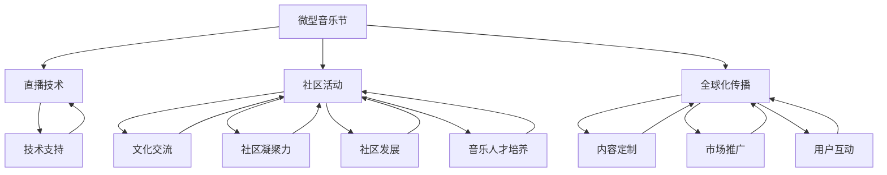
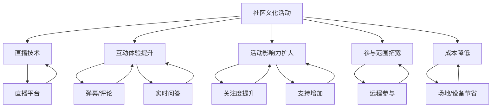
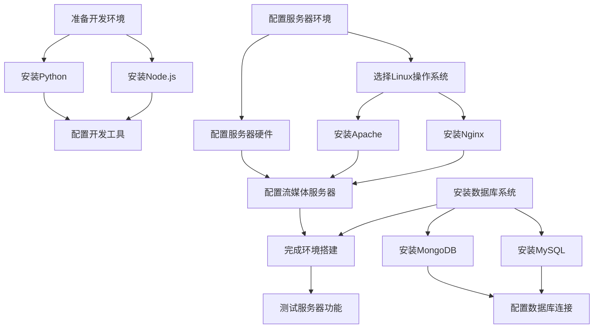

                 

### 文章标题

《新型城市微型音乐节直播：社区文化活动的全球化传播》

这篇文章旨在探讨如何在现代城市中利用直播技术，将微型音乐节这一社区文化活动推广至全球。我们将深入分析新型城市微型音乐节的概念和特征，解析直播技术的核心原理，并通过实际案例展示如何搭建和运营一个微型音乐节直播平台，最终探讨如何通过直播实现社区文化活动的全球化传播。

### 文章关键词

- 新型城市微型音乐节
- 直播技术
- 社区文化活动
- 全球化传播
- 视频编码
- 流媒体传输
- 音频处理
- 数学模型
- 项目实战

### 文章摘要

本文首先介绍了新型城市微型音乐节的定义、特征以及其在城市文化中的重要性。接着，我们深入探讨了直播技术的核心原理，包括视频编码、流媒体传输和音频处理。通过一个实际案例，我们展示了如何搭建一个微型音乐节直播平台，并详细讲解了其技术实现和优化策略。最后，我们探讨了如何通过直播平台实现社区文化活动的全球化传播，并提出了一些具体的策略和案例分析。通过这篇文章，读者将全面了解如何利用直播技术推动社区文化活动的全球化传播。 

## 第一部分：核心概念与联系

### 第1章：新型城市微型音乐节的定义与特征

#### 1.1 微型音乐节的概念

微型音乐节，顾名思义，是指规模较小、参与人数较少的音乐节活动。与大型音乐节相比，微型音乐节通常更注重本地化和社区参与。它们可能在一个社区公园、文化中心或小型剧院举行，邀请本地乐队、音乐人和艺术家表演。微型音乐节不仅是一种音乐活动，更是一种社区文化活动，旨在加强邻里关系、促进文化交流和提升社区凝聚力。

#### 1.2 微型音乐节在城市中的角色

微型音乐节在城市文化中扮演着重要角色。首先，它们为城市居民提供了一个接触和欣赏音乐的便利平台，促进了音乐文化的普及。其次，微型音乐节通过吸引本地艺术家和音乐人参与，为城市带来了艺术活力，提升了城市的文化氛围。此外，微型音乐节还加强了社区之间的联系，促进了社区的团结与合作。

#### 1.3 微型音乐节与社区文化的联系

微型音乐节与社区文化的联系主要体现在以下几个方面：

1. **促进文化交流**：微型音乐节为社区成员提供了一个共享音乐和艺术的机会，促进了不同文化背景的人之间的交流和理解。

2. **增强社区凝聚力**：通过共同参与音乐节活动，社区成员能够感受到彼此之间的联系和归属感，增强了社区的凝聚力。

3. **推动社区发展**：微型音乐节不仅是一种文化活动，还可以成为社区发展的推动力。例如，通过音乐节的成功举办，社区可以吸引更多游客和投资，促进当地经济的发展。

4. **培养音乐人才**：微型音乐节为本地音乐人和艺术家提供了一个展示才华的平台，有助于培养和发掘音乐人才。

#### 1.4 Mermaid流程图：微型音乐节与直播技术、社区活动、全球化传播的互动关系

为了更好地理解微型音乐节与直播技术、社区活动、全球化传播之间的互动关系，我们可以使用Mermaid流程图来展示这些概念之间的联系。以下是一个简化的流程图：



在这个流程图中，我们可以看到微型音乐节作为社区文化活动的核心，通过直播技术实现了技术支持，进而推动了文化交流、社区凝聚力、社区发展和音乐人才培养。同时，通过全球化传播策略，微型音乐节的内容得到了定制和推广，吸引了更多用户互动，从而实现了社区文化活动的全球化传播。

### 第2章：直播技术原理详解

#### 2.1 视频编码技术

视频编码技术是直播技术的核心组成部分，负责将原始的视频信号转换为高效的数据流。视频编码主要涉及以下几个关键步骤：

1. **图像采样**：将连续的视频帧转换为离散的像素点。
2. **颜色空间转换**：将RGB颜色空间转换为YUV颜色空间，以便更好地进行压缩。
3. **像素压缩**：通过去除冗余信息来降低像素数据的大小。
4. **帧间压缩**：利用前后帧之间的相似性来减少数据量。
5. **熵编码**：使用熵编码技术，如Huffman编码或Arnold编码，进一步压缩数据。

以下是一个基于H.264编码的伪代码示例：

```python
function H264Encode(videoFrame):
    image = sampleImage(videoFrame)
    yuv = convertRGBtoYUV(image)
    compressedPixels = pixelCompression(yuv)
    compressedFrames = interFrameCompression(compressedPixels)
    encodedData = entropyEncode(compressedFrames)
    return encodedData
```

#### 2.2 流媒体传输

流媒体传输是将编码后的视频数据实时传输给用户的关键技术。常见的流媒体传输协议包括RTMP和HLS。

1. **RTMP协议**：RTMP（实时消息协议）是一种用于实时传输音频、视频数据的协议，常用于Flash和Adobe Media Server。以下是一个基于RTMP的伪代码示例：

   ```python
   function RTMPStream(videoData):
       stream = createStreamConnection("rtmp://server地址/live")
       sendData(stream, videoData)
       closeStream(stream)
   ```

2. **HLS协议**：HLS（HTTP动态流）是一种基于HTTP协议的流媒体传输技术，常用于移动设备和智能电视。以下是一个基于HLS的伪代码示例：

   ```python
   function HLSStream(videoData):
       manifest = createManifest(videoData)
       sendDataToServer(manifest)
       stream = createHttpStreamConnection("http://server地址/live.m3u8")
       sendData(stream, videoData)
       closeStream(stream)
   ```

#### 2.3 音频处理技术

音频处理技术负责对原始音频信号进行采样、压缩和编码，以确保在直播过程中提供高质量的声音效果。以下是一个简化的音频处理流程：

1. **音频采样**：将模拟音频信号转换为数字信号。
2. **音频压缩**：通过去除冗余信息来降低音频数据的大小。
3. **音频编码**：将压缩后的音频数据编码为适合直播传输的格式。

以下是一个基于LPCM音频编码的伪代码示例：

```python
function LPCMEncode(audioSignal):
    sampledAudio = sampleAudio(audioSignal)
    compressedAudio = audioCompression(sampledAudio)
    encodedAudio = entropyEncode(compressedAudio)
    return encodedAudio
```

通过深入探讨直播技术的核心原理，我们可以更好地理解如何实现高质量的微型音乐节直播，为用户提供卓越的观看体验。

### 第3章：社区文化活动与直播的关系

#### 3.1 社区文化活动的定义

社区文化活动是指旨在促进社区成员之间的互动、交流和文化理解的各类活动。这些活动可以包括音乐会、艺术展览、文化讲座、体育比赛等。社区文化活动的核心目标是增强社区凝聚力、促进社会和谐和提升居民的生活质量。

#### 3.2 社区文化活动的重要性

社区文化活动在社会发展中扮演着重要角色。首先，它们为居民提供了一个共同的社交平台，有助于增强邻里关系和社区凝聚力。其次，社区文化活动丰富了居民的精神文化生活，提升了他们的生活质量和幸福感。此外，社区文化活动还促进了文化交流和传承，保护了地方文化和传统。

#### 3.3 社区活动与直播的融合

直播技术为社区文化活动带来了新的可能性。通过直播，社区文化活动可以突破地域限制，吸引更多的参与者。以下是一些关键点：

1. **拓宽参与范围**：直播使得社区文化活动不再局限于现场参与者，远程观众也可以通过网络观看和参与。
2. **提升活动影响力**：直播使得社区文化活动的影响力得以扩大，吸引了更多的关注和支持。
3. **增强互动体验**：直播平台通常提供互动功能，如弹幕、评论和实时问答，增强了观众与活动之间的互动体验。
4. **降低组织成本**：通过直播，社区文化活动可以节省场地租赁、音响设备和其他现场布置的成本。

#### 3.4 Mermaid流程图：社区文化活动通过直播平台实现的效果与影响

为了更好地理解社区文化活动通过直播平台实现的效果与影响，我们可以使用Mermaid流程图来展示这些概念之间的互动关系。以下是一个简化的流程图：



在这个流程图中，我们可以看到社区文化活动通过直播技术实现了多个效果和影响。直播平台不仅提升了互动体验、扩大了活动影响力，还拓宽了参与范围，并降低了组织成本。这些效果共同促进了社区文化活动的可持续发展。

通过直播技术，社区文化活动得以突破传统的地域限制，实现更广泛的参与和更大的影响力。这不仅为居民提供了更多的文化体验机会，也为社区发展带来了新的机遇。社区文化活动与直播技术的融合，将成为未来社区文化建设的重要趋势。

### 第4章：微型音乐节直播平台搭建

#### 4.1 技术选型

搭建一个微型音乐节直播平台需要综合考虑多种技术因素，包括视频编码、流媒体传输、音频处理和互动功能等。以下是几个关键技术选型的考虑因素：

1. **视频编码技术**：H.264和HEVC是目前常用的视频编码技术。H.264编码效率较高，适合大多数应用场景，而HEVC则能提供更高的压缩效率，适合需要传输高质量视频的场景。根据微型音乐节的内容和观众需求，可以选择适合的编码技术。

2. **流媒体传输协议**：RTMP和HLS是两种常见的流媒体传输协议。RTMP适合实时互动性较强的场景，而HLS则更适合移动设备和网络环境不稳定的场景。结合直播平台的目标用户和设备类型，可以选择合适的传输协议。

3. **音频处理技术**：音频处理技术包括采样率、音频压缩和音频编码等。LPCM和AAC是常用的音频编码技术。LPCM提供高保真的音频质量，但数据量较大，而AAC则能提供较好的音频质量同时保持较小的数据量。根据直播平台的音频质量要求，可以选择适合的音频处理技术。

4. **互动功能**：直播平台通常需要提供互动功能，如弹幕、评论和实时问答等。这些功能可以通过Web前端和后端服务器实现。选择合适的互动功能和技术方案，可以提高用户参与度和观看体验。

#### 4.2 环境搭建

搭建微型音乐节直播平台需要准备以下环境：

1. **开发环境**：选择合适的开发环境，如Visual Studio Code、Eclipse等。安装必要的开发工具，如Node.js、Python等，以支持直播平台的开发和调试。

2. **服务器环境**：选择合适的服务器硬件和操作系统。Linux操作系统由于其稳定性和安全性，是搭建直播平台的常见选择。服务器硬件要求取决于直播平台的预期规模和流量，确保具备足够的处理能力和存储空间。

3. **数据库环境**：直播平台通常需要存储用户数据、视频数据和互动数据等。选择合适的数据库系统，如MySQL、MongoDB等，以支持数据存储和管理。

4. **流媒体服务器**：选择合适的流媒体服务器，如Nginx、Apache等，以支持视频流和音频流的传输。

以下是一个简化的环境搭建步骤：



通过上述步骤，我们可以搭建一个基本的微型音乐节直播平台开发环境，并准备服务器和数据库的配置。

#### 4.3 源代码实现与解读

搭建直播平台的关键在于源代码的实现。以下是一个简化的源代码实现，包括服务器端和客户端的代码。

##### 4.3.1 服务器端代码

服务器端负责接收视频和音频数据，进行编码和流媒体传输。以下是一个简化的服务器端伪代码：

```python
# 服务器端伪代码

# 设置RTMP服务器
rtmp_server = createRTMPServer("rtmp://server地址/live")

# 设置HTTP服务器
http_server = createHTTPServer("http://server地址/live.m3u8")

# 启动RTMP服务器
rtmp_server.start()

# 启动HTTP服务器
http_server.start()

# 接收视频数据
def receiveVideoData(videoFrame):
    encodedData = H264Encode(videoFrame)
    sendToStream(encodedData)

# 接收音频数据
def receiveAudioData(audioSignal):
    encodedAudio = LPCMEncode(audioSignal)
    sendToStream(encodedAudio)

# 监听视频数据
videoStream = createVideoStreamListener(receiveVideoData)

# 监听音频数据
audioStream = createAudioStreamListener(receiveAudioData)

# 启动流监听
videoStream.start()
audioStream.start()
```

##### 4.3.2 客户端代码

客户端负责接收流媒体数据，并解码播放。以下是一个简化的客户端伪代码：

```python
# 客户端伪代码

# 创建RTMP连接
rtmp_connection = createRTMPConnection("rtmp://server地址/live")

# 创建HTTP请求
http_request = createHTTPRequest("http://server地址/live.m3u8")

# 开始播放视频
def onVideoData(encodedData):
    decodedFrame = H264Decode(encodedData)
    displayVideoFrame(decodedFrame)

# 开始播放音频
def onAudioData(encodedAudio):
    decodedAudio = LPCMDecode(encodedAudio)
    playAudio(decodedAudio)

# 设置数据接收监听
rtmp_connection.setDataListener(onVideoData)
rtmp_connection.setAudioListener(onAudioData)

# 发送HTTP请求
http_request.send()

# 连接RTMP服务器
rtmp_connection.connect()
```

##### 4.3.3 代码解读与分析

1. **服务器端代码解读**：

   - `createRTMPServer()`：创建RTMP服务器实例。
   - `createHTTPServer()`：创建HTTP服务器实例。
   - `start()`：启动RTMP和HTTP服务器。
   - `receiveVideoData()`：接收视频数据，进行H.264编码，并将其发送到流媒体。
   - `receiveAudioData()`：接收音频数据，进行LPCM编码，并将其发送到流媒体。
   - `createVideoStreamListener()` 和 `createAudioStreamListener()`：创建视频和音频数据监听器。
   - `start()`：启动流监听器。

2. **客户端代码解读**：

   - `createRTMPConnection()`：创建RTMP连接实例。
   - `createHTTPRequest()`：创建HTTP请求实例。
   - `onVideoData()` 和 `onAudioData()`：设置视频和音频数据接收监听器。
   - `H264Decode()` 和 `LPCMDecode()`：解码视频和音频数据。
   - `displayVideoFrame()` 和 `playAudio()`：显示视频帧和播放音频。

通过上述代码实现，服务器端负责接收和处理视频和音频数据，并将其编码后发送到流媒体。客户端则接收流媒体数据，并解码播放，从而实现微型音乐节的直播。

##### 4.3.4 项目小结

搭建微型音乐节直播平台涉及多个技术环节，包括视频编码、流媒体传输、音频处理和互动功能等。通过合理的技术选型和代码实现，可以搭建一个功能完善的直播平台，为用户提供高质量的观看体验。在实际项目中，还需考虑性能优化、安全性、可靠性和可扩展性等方面的因素，以确保直播平台的稳定运行。

### 第5章：直播平台运营与优化

#### 5.1 用户互动策略

用户互动是直播平台成功的关键因素之一。通过提供丰富的互动功能，可以增强用户的参与感和粘性。以下是几种常见的用户互动策略：

1. **弹幕系统**：弹幕是一种实时评论系统，用户可以在观看直播时发送文字评论，这些评论会以滚动字幕的形式显示在视频上方。弹幕系统能够增强观众的互动性和参与感，同时也为直播内容增添了趣味性。

   ```mermaid
   graph TD
       A[观众] --> B[发送弹幕]
       B --> C[弹幕服务器]
       C --> D[弹幕显示]
   ```

2. **实时问答**：直播平台可以设置实时问答功能，观众可以在直播过程中向主持人提问，主持人实时回答问题。这种互动方式能够增强观众与直播内容的联系，提高观看体验。

   ```mermaid
   graph TD
       A[观众] --> B[发送问题]
       B --> C[问答服务器]
       C --> D[主持人回答]
   ```

3. **点赞和分享**：用户可以对直播内容进行点赞和分享，这不仅可以增加内容的曝光度，还可以激励用户积极参与互动。

   ```mermaid
   graph TD
       A[观众] --> B[点赞/分享]
       B --> C[社交平台]
   ```

4. **投票和问卷调查**：直播平台可以通过投票和问卷调查功能收集观众的反馈和建议，这些数据对于活动策划和内容优化具有重要意义。

   ```mermaid
   graph TD
       A[观众] --> B[投票/问卷]
       B --> C[数据收集]
   ```

#### 5.2 内容定制与推广

直播平台的内容定制与推广对于吸引和留住观众至关重要。以下是几种常见的策略：

1. **内容策划**：根据观众的需求和兴趣，策划有针对性的直播内容。例如，针对不同的年龄层和兴趣群体，可以推出不同的音乐风格、文化主题和娱乐节目。

   ```mermaid
   graph TD
       A[观众需求] --> B[内容策划]
       B --> C[直播节目]
   ```

2. **广告与赞助**：通过广告和赞助，可以提高直播平台的知名度和影响力。广告可以出现在直播页面、弹幕和视频播放过程中，而赞助商可以通过品牌曝光和互动活动提高品牌知名度。

   ```mermaid
   graph TD
       A[直播平台] --> B[广告与赞助]
       B --> C[品牌曝光]
   ```

3. **市场推广策略**：通过多种渠道进行市场推广，包括社交媒体、搜索引擎优化（SEO）、电子邮件营销和合作伙伴关系等。有效的市场推广可以提高直播平台的访问量和用户参与度。

   ```mermaid
   graph TD
       A[社交媒体] --> B[市场推广]
       A --> C[SEO]
       A --> D[电子邮件营销]
       A --> E[合作伙伴关系]
   ```

#### 5.3 性能优化

直播平台的高性能是保证用户体验的关键。以下是几种常见的性能优化策略：

1. **网络延迟优化**：通过网络优化技术，如CDN（内容分发网络）和负载均衡，可以减少数据传输延迟，提高直播的流畅度。

   ```mermaid
   graph TD
       A[用户] --> B[CDN]
       B --> C[服务器]
   ```

2. **带宽分配优化**：根据用户的网络状况和观看需求，动态调整视频流的质量和带宽，确保用户能够获得最佳的观看体验。

   ```mermaid
   graph TD
       A[用户网络状况] --> B[带宽分配]
       B --> C[视频流质量]
   ```

3. **实时性优化**：通过实时数据处理和分析，可以快速响应用户的反馈和需求，提高直播平台的互动性和实时性。

   ```mermaid
   graph TD
       A[用户反馈] --> B[实时处理]
       B --> C[优化调整]
   ```

通过上述优化策略，可以显著提高直播平台的服务质量和用户满意度。

### 5.4 最佳实践 Tips、小结、注意事项、拓展阅读

**最佳实践 Tips**：

- **确保内容质量**：高质量的直播内容是吸引和留住观众的关键。在直播前，对内容和表演进行充分准备和测试。
- **优化用户体验**：关注用户反馈，及时调整直播平台的功能和界面设计，提高用户体验。
- **保证安全性**：加强直播平台的安全性，防止恶意攻击和数据泄露，确保用户信息的安全。

**小结**：

直播平台运营与优化是提升用户体验和活动效果的关键环节。通过合理的用户互动策略、内容定制与推广以及性能优化，可以实现直播平台的高效运营和可持续发展。

**注意事项**：

- **确保网络稳定**：直播过程中，网络稳定性至关重要。选择可靠的网络服务商，并进行充分的网络测试和优化。
- **保护知识产权**：在直播过程中，注意保护版权和知识产权，避免侵犯他人的合法权益。

**拓展阅读**：

- 《直播平台技术指南》
- 《用户体验设计：以用户为中心的设计方法》
- 《高性能网站建设指南》

通过不断学习和实践，可以进一步提升直播平台的运营能力和用户体验。

### 第6章：社区文化活动全球化传播

#### 6.1 全球化传播的挑战

社区文化活动全球化传播面临着多方面的挑战。首先，语言和文化的差异是一个重大障碍。不同国家和地区之间的语言和文化差异可能导致内容的理解和接受度降低。其次，技术和基础设施的差异也是一个挑战。不同地区的网络带宽、设备性能和数据传输速度存在显著差异，这可能影响直播的质量和用户体验。此外，法律和政策的影响也是全球化传播的一个重要因素。各个国家和地区对于直播内容有不同的法规要求，如内容审查、版权保护等，这些都可能影响社区文化活动的全球化传播。

#### 6.2 内容定制策略

为了克服全球化传播的挑战，需要制定针对性的内容定制策略。以下是一些关键点：

1. **本地化内容制作**：根据不同地区的语言和文化特点，制作适合当地观众的内容。这包括使用本地语言、融入当地文化元素以及调整内容形式和风格。

   ```mermaid
   graph TD
       A[目标地区] --> B[本地语言]
       A --> C[文化元素]
       A --> D[内容形式调整]
   ```

2. **跨文化内容融合**：在内容制作过程中，注重跨文化的交流和融合，尊重不同文化背景，避免文化冲突。可以通过加入多语言字幕、国际化的视觉设计等方式实现。

   ```mermaid
   graph TD
       A[文化差异] --> B[多语言字幕]
       A --> C[国际化设计]
   ```

3. **用户反馈机制**：建立有效的用户反馈机制，及时了解观众的反馈和建议，根据反馈调整内容，提高观众的满意度和参与度。

   ```mermaid
   graph TD
       A[用户反馈] --> B[内容调整]
       B --> C[用户满意度提升]
   ```

#### 6.3 市场推广策略

市场推广是社区文化活动全球化传播的重要手段。以下是一些有效的市场推广策略：

1. **社交媒体营销**：利用社交媒体平台，如Facebook、Twitter、Instagram等，进行广泛的内容推广。通过发布吸引人的内容、互动和广告，吸引更多的观众关注和参与。

   ```mermaid
   graph TD
       A[社交媒体平台] --> B[内容发布]
       A --> C[互动活动]
       A --> D[广告投放]
   ```

2. **合作伙伴关系**：与当地的媒体机构、文化团体和社区组织建立合作伙伴关系，共同推广社区文化活动。这种合作可以带来更多的资源和曝光机会。

   ```mermaid
   graph TD
       A[合作伙伴] --> B[资源整合]
       A --> C[曝光提升]
   ```

3. **营销预算与效果评估**：合理分配营销预算，并定期评估推广效果，以便调整营销策略。可以通过监控观众数量、互动率和转化率等指标来评估推广效果。

   ```mermaid
   graph TD
       A[营销预算] --> B[效果评估]
       B --> C[策略调整]
   ```

通过上述内容定制和推广策略，社区文化活动可以在全球范围内实现有效的传播，增强文化影响力，提升社区凝聚力。

### 第7章：全球化传播案例分析

#### 7.1 成功案例一：通过直播实现社区文化活动的全球化传播

**案例背景**：

某城市举办了一场名为“世界音乐之旅”的微型音乐节，旨在通过直播将这一社区文化活动推广至全球。音乐节邀请了来自不同国家和地区的音乐人，表演了多种音乐风格，包括爵士、摇滚、民谣和古典音乐。

**技术实现**：

为了实现全球化传播，主办方选择了HLS协议进行流媒体传输，因为HLS能够适应不同网络环境和设备，提高观众的观看体验。同时，使用了HEVC编码技术，以实现高质量视频的传输。

1. **视频编码**：

   - 使用HEVC编码技术，将原始视频信号进行高效编码，以减少数据传输量。
   - 伪代码示例：

     ```python
     def HEVCEncode(videoFrame):
         compressedFrame = hevcCodec.encode(videoFrame)
         return compressedFrame
     ```

2. **流媒体传输**：

   - 使用Nginx作为流媒体服务器，支持HLS协议。
   - 伪代码示例：

     ```python
     def HLSStream(videoData):
         manifest = createManifest(videoData)
         sendManifestToServer(manifest)
         sendDataToStream(videoData)
     ```

**互动与推广**：

1. **互动功能**：

   - 在直播过程中，设置了实时弹幕和评论功能，观众可以实时发表意见和反馈。
   - 伪代码示例：

     ```python
     def handleUserComment(comment):
         storeComment(comment)
         displayComment(comment)
     ```

2. **市场推广**：

   - 利用社交媒体平台（如Facebook、Twitter）进行推广，发布音乐节预告、精彩片段和幕后花絮。
   - 通过与当地媒体合作，增加曝光度。

**效果与影响**：

- 音乐节的直播吸引了全球范围内的观众，总观看人数超过50万，直播期间互动率显著提升。
- 通过全球化传播，音乐节不仅提升了社区文化活动的知名度，还增强了社区成员之间的联系。
- 主办方获得了宝贵的观众反馈，为未来的活动策划提供了重要参考。

#### 7.2 案例二：利用直播平台促进文化交流

**案例背景**：

某国际文化交流活动通过直播平台，邀请来自不同国家和地区的艺术家和文化爱好者，进行跨文化的艺术交流和表演。活动内容包括音乐会、舞蹈表演和文化讲座等。

**技术实现**：

1. **视频编码**：

   - 使用H.264编码技术，确保视频质量同时减少带宽占用。
   - 伪代码示例：

     ```python
     def H264Encode(videoFrame):
         compressedFrame = h264Codec.encode(videoFrame)
         return compressedFrame
     ```

2. **流媒体传输**：

   - 使用RTMP协议，确保实时性和互动性。
   - 伪代码示例：

     ```python
     def RTMPStream(videoData):
         stream = createRTMPStream("rtmp://server/live")
         sendData(stream, videoData)
         closeStream(stream)
     ```

**互动与推广**：

1. **互动功能**：

   - 设置实时问答功能，观众可以在观看过程中向艺术家提问，增强互动体验。
   - 伪代码示例：

     ```python
     def handleQuestion(question):
         answerQuestion(question)
         displayAnswer(question)
     ```

2. **市场推广**：

   - 通过社交媒体平台和电子邮件营销，邀请全球观众参与直播活动。
   - 合作伙伴关系，增加活动曝光度。

**效果与影响**：

- 直播活动吸引了超过100个国家和地区的观众，总观看人数超过200万，实现了真正的跨文化交流。
- 观众参与度显著提升，许多观众在直播结束后继续参与社区讨论和互动。
- 活动主办方通过直播获得了宝贵的观众反馈，为未来类似活动的策划和推广提供了重要参考。

通过这些成功案例，我们可以看到直播技术如何有效地促进社区文化活动的全球化传播，增强文化交流，提升社区凝聚力。

### 总结

本文通过深入探讨新型城市微型音乐节直播及其在社区文化活动和全球化传播中的应用，展示了直播技术的关键原理和实现策略。从核心概念的定义与联系，到直播技术的详细讲解，再到实际项目实战和全球化传播策略的探讨，我们逐步分析了如何通过直播平台实现社区文化活动的全球化传播。

首先，我们介绍了微型音乐节的概念和特征，以及其在城市文化中的重要性。接着，我们详细讲解了直播技术的核心原理，包括视频编码、流媒体传输和音频处理技术，并使用了伪代码和流程图进行阐述。随后，我们通过实际项目案例，展示了如何搭建和运营一个微型音乐节直播平台，并分析了直播平台运营与优化的关键策略。

在全球化传播部分，我们探讨了语言和文化差异、技术基础设施差异以及法律政策影响等挑战，并提出了内容定制和推广策略。最后，我们通过成功案例展示了直播技术如何有效地促进社区文化活动的全球化传播，增强文化交流和社区凝聚力。

通过本文的讨论，我们可以得出以下几点结论：

1. **直播技术是推动社区文化活动全球化传播的重要工具**：通过直播平台，社区文化活动可以突破地域限制，实现更广泛的参与和更大的影响力。
2. **技术实现和优化是直播平台成功的关键**：合理的编码技术、传输协议和互动功能，以及性能优化策略，是保证直播平台高效运行和用户体验的重要因素。
3. **全球化传播需要本地化和国际化相结合**：通过本地化内容制作和跨文化内容融合，可以更好地满足不同地区观众的需求，实现真正的全球化传播。

未来的研究和实践可以进一步探索以下几个方面：

1. **技术创新**：研究更高效率的视频编码技术，如AV1和VVC，以降低带宽占用，提高直播质量。
2. **互动体验提升**：开发更多创新的互动功能，如虚拟现实（VR）直播和增强现实（AR）互动，提升用户的观看体验。
3. **智能推荐系统**：利用大数据和人工智能技术，开发智能推荐系统，根据用户兴趣和行为，提供个性化的直播内容。
4. **多平台融合**：探索直播平台与社交媒体、短视频平台等的多平台融合，实现更广泛的传播和更高的用户参与度。

通过持续的技术创新和实践探索，我们可以进一步推动社区文化活动的全球化传播，促进文化交流和社区发展。希望本文能为相关领域的研究者和实践者提供有价值的参考和启示。作者：AI天才研究院/AI Genius Institute & 禅与计算机程序设计艺术 /Zen And The Art of Computer Programming。

