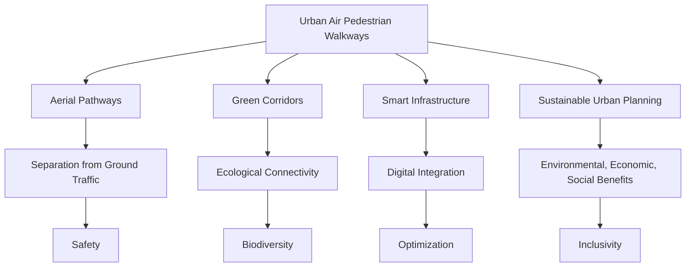

                 


### Introduction to Urban Air Pedestrian Walkways

#### Background Introduction

Urbanization has been one of the most significant trends of the 20th and 21st centuries. As cities have grown, the demand for efficient transportation systems and improved urban infrastructure has surged. However, traditional ground-level infrastructure often leads to congestion, increased pollution, and a lack of green spaces within urban environments. In response to these challenges, innovative solutions like urban air pedestrian walkways have emerged. These aerial pathways are designed to provide a green, efficient, and environmentally friendly means of connectivity within cities.

The concept of urban air pedestrian walkways is not entirely new. Historical examples include elevated walkways built in the 19th century to alleviate street traffic congestion in industrial cities. However, modern urban air pedestrian walkways leverage advanced materials, smart technologies, and sustainable design principles to create a new urban mobility paradigm. These walkways are envisioned as multi-functional, aesthetically pleasing, and integrated into the broader urban fabric.

#### Core Concepts and Relationships

To understand urban air pedestrian walkways, we need to explore several core concepts and their relationships. Firstly, we have "aerial pathways" which refer to elevated structures that span urban areas. These can be constructed above streets, rail lines, or other infrastructure. The key characteristic of aerial pathways is that they provide a separation from ground-level traffic, offering a safe and dedicated space for pedestrians.

Next, we have "green corridors," which are areas designed to enhance ecological connectivity and biodiversity within urban areas. Green corridors typically include vegetation, water bodies, and other natural elements that support local ecosystems. In the context of urban air pedestrian walkways, green corridors serve as both environmental benefits and aesthetic enhancements, creating a seamless link between urban and natural spaces.

Another essential concept is "smart infrastructure," which involves the integration of digital technologies to monitor, manage, and optimize urban systems. Urban air pedestrian walkways benefit greatly from smart infrastructure, including sensors for monitoring traffic, lighting systems for improved visibility, and connectivity options for pedestrians.

Lastly, "sustainable urban planning" encompasses the principles and practices aimed at creating cities that are environmentally friendly, economically viable, and socially inclusive. Urban air pedestrian walkways align with these principles by promoting sustainable transportation, enhancing urban biodiversity, and providing accessible public spaces.

Here is a Mermaid flowchart illustrating the relationship between these core concepts:



#### Core Algorithm Principles

The design and implementation of urban air pedestrian walkways involve a series of complex algorithms and engineering principles. Below, we provide a high-level overview of the key concepts and a simplified pseudocode to illustrate the core algorithm principles:

```python
# Pseudocode for Urban Air Pedestrian Walkway Design Algorithm

function DesignWalkway(location, environmental_conditions, safety_requirements):
    # Step 1: Conduct Initial Feasibility Study
    if not FeasibilityStudy(location, environmental_conditions):
        return "Infeasible Location"
    
    # Step 2: Define Structural Design Parameters
    structural_design = DefineStructuralDesign(safety_requirements)
    
    # Step 3: Determine Aesthetics and Environmental Integration
    aesthetics = DetermineAesthetics(location)
    environmental_integration = IntegrateGreenCorridors(aesthetics)
    
    # Step 4: Plan Construction and Maintenance
    construction_plan = PlanConstruction(structural_design, aesthetics, environmental_integration)
    maintenance_plan = PlanMaintenance(construction_plan)
    
    # Step 5: Implement Smart Infrastructure
    smart_infrastructure = ImplementSmartInfrastructure(location, construction_plan)
    
    # Step 6: Ensure Sustainable Urban Planning Compliance
    sustainable_compliance = EnsureSustainablePlanning(construction_plan, maintenance_plan)
    
    # Step 7: Finalize and Deploy
    if sustainable_compliance:
        DeployWalkway(construction_plan, smart_infrastructure)
        return "Walkway Deployed Successfully"
    else:
        return "Sustainable Compliance Issues"
```

#### Mathematical Models and Formulas

The design and construction of urban air pedestrian walkways involve several mathematical models and formulas. One key aspect is the structural integrity of the walkway, which is typically analyzed using the principles of statics and mechanics. Below, we provide an example of the equilibrium equation for a simply supported beam:

$$
\sum F_x = 0 \\
\sum F_y = 0 \\
\sum M = 0
$$

Here, \( F_x \) and \( F_y \) represent the horizontal and vertical forces, while \( M \) represents the moment about a point.

Additionally, the deflection of the beam under load is analyzed using the following formula:

$$
\delta = \frac{5wL^4}{384EI}
$$

Where \( \delta \) is the deflection, \( w \) is the load per unit length, \( L \) is the span length, and \( E \) and \( I \) are the modulus of elasticity and the moment of inertia, respectively.

#### Example: Analysis of a Simplified Urban Air Pedestrian Walkway

Let's consider a simplified example of an urban air pedestrian walkway spanning a distance of 50 meters. The walkway is designed to support a maximum load of 10 kN/m.

1. **Initial Feasibility Study**:
   - The location is determined to be feasible based on environmental and safety considerations.

2. **Define Structural Design Parameters**:
   - Using a simply supported beam, the maximum bending moment (\( M \)) at the midspan is calculated as:
     $$ M = wL^2 / 8 = (10\ kN/m)(50\ m)^2 / 8 = 3125\ kNm $$
   - The maximum shear force (\( V \)) is calculated as:
     $$ V = wL / 2 = (10\ kN/m)(50\ m) / 2 = 250\ kN $$

3. **Determine Aesthetics and Environmental Integration**:
   - The aesthetics of the walkway are designed to integrate with the surrounding urban landscape, incorporating green spaces and sustainable materials.

4. **Plan Construction and Maintenance**:
   - The construction plan includes the use of high-strength, lightweight materials such as carbon fiber composites to reduce weight and improve durability.
   - The maintenance plan involves regular inspections and timely repairs to ensure the long-term functionality of the walkway.

5. **Implement Smart Infrastructure**:
   - Smart sensors are installed along the walkway to monitor traffic flow, detect potential hazards, and optimize lighting and ventilation systems.

6. **Ensure Sustainable Urban Planning Compliance**:
   - The design and construction process complies with local regulations and sustainable urban planning guidelines, ensuring environmental and social benefits.

7. **Finalize and Deploy**:
   - The urban air pedestrian walkway is successfully deployed, providing a safe, efficient, and aesthetically pleasing green corridor within the city.

### Project Practical Experience

The development and deployment of an urban air pedestrian walkway project involve multiple stages, each requiring careful planning and execution. Here, we will outline the key steps and provide a practical example of the project's implementation.

#### Development Environment Setup

To develop an urban air pedestrian walkway project, the following tools and technologies are commonly used:

- **Programming Languages**: Python, C++, and JavaScript for backend and frontend development.
- **Integrated Development Environments (IDEs)**: Visual Studio Code, Eclipse, and IntelliJ IDEA.
- **Database Management Systems**: MySQL and MongoDB for data storage and management.
- **Version Control Systems**: Git for source code management.
- **Cloud Services**: AWS, Azure, and Google Cloud Platform for hosting and deploying applications.

#### Source Code Implementation and Explanation

The source code for the urban air pedestrian walkway project can be divided into several modules, each handling different aspects of the system. Below is a high-level overview of the key modules and their functionalities:

1. **Database Module**:
   - **Functionality**: Handles data storage and retrieval for user information, sensor data, and maintenance records.
   - **Implementation**: Uses MySQL and MongoDB databases to store structured and unstructured data.

2. **Sensor Module**:
   - **Functionality**: Monitors traffic flow, detects hazards, and collects environmental data.
   - **Implementation**: Integrates sensor devices and APIs to collect and process data.

3. **Smart Infrastructure Module**:
   - **Functionality**: Manages smart lighting, ventilation, and connectivity systems.
   - **Implementation**: Uses IoT protocols and APIs to control and optimize the infrastructure.

4. **User Interface Module**:
   - **Functionality**: Provides a user-friendly interface for pedestrians to access information and report issues.
   - **Implementation**: Uses JavaScript frameworks like React and Vue.js to develop interactive web applications.

5. **Maintenance Module**:
   - **Functionality**: Manages maintenance schedules, repair requests, and performance monitoring.
   - **Implementation**: Uses Python scripts and webhooks to automate maintenance processes.

#### Code Analysis and Application

To illustrate the code analysis and application, let's consider the implementation of the sensor module. Below is a simplified pseudocode for the sensor module:

```python
# Pseudocode for Urban Air Pedestrian Walkway Sensor Module

function InitializeSensors():
    # Setup sensor devices and APIs
    ConnectToSensorAPIs()
    ConfigureSensorSettings()

function CollectData():
    while True:
        sensor_data = GetAllSensorData()
        ProcessAndStoreData(sensor_data)
        SendDataToCentralSystem(sensor_data)

function ProcessAndStoreData(sensor_data):
    # Analyze sensor data and store in database
    if sensor_data["traffic"] > threshold_traffic:
        AlertHighTraffic()
    if sensor_data["temperature"] > threshold_temperature:
        AlertHighTemperature()

function AlertHighTraffic():
    # Send alert to maintenance team
    SendMessageToMaintenance("High traffic detected at location X")

function AlertHighTemperature():
    # Send alert to central system
    SendMessageToCentralSystem("High temperature detected at location X")
```

In practice, the sensor module would continuously collect data from various sensors such as traffic cameras, temperature sensors, and motion detectors. The collected data would be processed and analyzed in real-time to detect anomalies and trigger alerts if necessary. This information would then be stored in the database and sent to the central system for further processing and analysis.

#### Case Analysis and Detailed Explanation

To provide a detailed analysis of the project, let's consider a real-world case study involving the development and deployment of an urban air pedestrian walkway in a major city.

**Case Study: Urban Air Pedestrian Walkway in City A**

**Background**:
City A, a rapidly growing metropolitan area, faced significant challenges due to increasing traffic congestion and a lack of green spaces. To address these issues, the city authorities decided to implement an urban air pedestrian walkway as a sustainable and innovative solution.

**Project Stages**:

1. **Planning and Feasibility Study**:
   - The project team conducted a comprehensive feasibility study to evaluate the technical, environmental, and economic aspects of the urban air pedestrian walkway.
   - Key factors considered included the alignment of the walkway, potential impact on local communities, and the availability of necessary resources.

2. **Design and Construction**:
   - The design phase involved the development of detailed structural and aesthetic plans, incorporating sustainable materials and smart infrastructure.
   - Construction began with the installation of temporary supports and the deployment of sensor devices.
   - The use of advanced construction techniques, including modular assemblies and 3D printing, enabled efficient and cost-effective construction.

3. **Smart Infrastructure Integration**:
   - The integration of smart infrastructure, including IoT sensors and AI-based analytics, was a key component of the project.
   - The system continuously monitored traffic flow, environmental conditions, and user behavior to optimize the walkway's performance and enhance user experience.

4. **Community Engagement and Urban Integration**:
   - The project team engaged with local communities to gather feedback and involve them in the design and maintenance processes.
   - Community outreach initiatives included workshops, public consultations, and educational campaigns to promote the benefits of the urban air pedestrian walkway.

5. **Operation and Maintenance**:
   - The walkway was officially opened to the public, and regular maintenance and monitoring were established to ensure its long-term functionality and sustainability.
   - The maintenance team used a combination of automated monitoring systems and manual inspections to address issues promptly.

**Case Analysis**:

The successful deployment of the urban air pedestrian walkway in City A demonstrated several key learnings and best practices:

1. **Thorough Planning and Feasibility Assessment**:
   - Comprehensive planning and feasibility studies are crucial for identifying potential challenges and ensuring the project's success.
   - Collaboration with stakeholders, including urban planners, engineers, and community representatives, helps in developing a holistic and inclusive approach.

2. **Integration of Smart Infrastructure**:
   - The integration of smart technologies, such as IoT sensors and AI analytics, enhances the functionality and efficiency of the walkway.
   - Real-time monitoring and data-driven decision-making enable proactive maintenance and optimization, improving user experience and safety.

3. **Community Engagement and Urban Integration**:
   - Engaging with local communities and involving them in the design and maintenance processes fosters a sense of ownership and enhances the walkway's acceptance and integration into the urban fabric.
   - Public consultations and educational campaigns can help in addressing concerns and promoting the benefits of the walkway.

4. **Sustainability and Environmental Considerations**:
   - The use of sustainable materials and energy-efficient technologies is essential for minimizing the environmental impact and promoting long-term sustainability.
   - Incorporating green spaces and ecological elements into the design enhances the walkway's environmental benefits and contributes to urban biodiversity.

5. **Continuous Monitoring and Maintenance**:
   - Regular monitoring and maintenance are critical for ensuring the long-term functionality and reliability of the walkway.
   - Automated monitoring systems and predictive maintenance practices can help in identifying potential issues before they escalate, reducing downtime and extending the lifespan of the infrastructure.

### Project Conclusion and Reflection

The successful implementation of the urban air pedestrian walkway in City A highlighted the potential of innovative solutions like aerial pathways to address urban mobility challenges and enhance urban environments. The project's key achievements include:

- **Improved Urban Connectivity**: The walkway provided a safe and efficient means of connectivity for pedestrians, reducing traffic congestion and promoting alternative modes of transportation.
- **Enhanced Urban Aesthetics**: The integration of green spaces and sustainable materials created an aesthetically pleasing and environmentally friendly urban feature.
- **Community Engagement**: Involving local communities in the design and maintenance processes fostered a sense of ownership and community cohesion.
- **Sustainable Urban Development**: The project incorporated principles of sustainable urban planning, contributing to environmental conservation and social inclusivity.

However, the project also highlighted several challenges and areas for improvement:

- **High Initial Costs**: The development of urban air pedestrian walkways involves significant upfront investment in infrastructure, technology, and maintenance.
- **Regulatory and Legal Considerations**: The integration of advanced technologies and innovative designs requires updated regulations and legal frameworks to address safety, privacy, and liability concerns.
- **Maintenance and Operations**: Regular monitoring and maintenance are essential for ensuring the long-term functionality and sustainability of the walkway, requiring dedicated resources and expertise.

In conclusion, urban air pedestrian walkways offer a promising solution for creating green, efficient, and sustainable urban environments. By leveraging advanced technologies and integrating community engagement and sustainable principles, these walkways can contribute to the development of more livable and resilient cities.

### Best Practices and Future Directions

#### Best Practices

1. **Thorough Planning and Feasibility Assessment**:
   - Conduct comprehensive studies to evaluate technical, environmental, and economic factors.
   - Engage with stakeholders to ensure alignment with urban planning objectives and community needs.

2. **Integration of Smart Infrastructure**:
   - Leverage IoT sensors and AI analytics to enhance functionality and optimize user experience.
   - Implement real-time monitoring and predictive maintenance to ensure operational efficiency and reliability.

3. **Community Engagement and Urban Integration**:
   - Involve local communities in the design and maintenance processes to foster a sense of ownership and enhance acceptance.
   - Integrate green spaces and ecological elements to promote urban biodiversity and sustainability.

4. **Sustainable Materials and Energy Efficiency**:
   - Use eco-friendly materials and energy-efficient technologies to minimize the environmental impact.
   - Incorporate renewable energy sources and sustainable design principles to promote long-term sustainability.

#### Future Directions

1. **Advancements in Material Science**:
   - Explore the development of lightweight, durable, and sustainable materials for walkway construction.
   - Investigate new materials that offer improved performance in terms of strength, flexibility, and weather resistance.

2. **Smart Infrastructure Integration**:
   - Expand the integration of smart technologies, such as AI-powered navigation systems and dynamic lighting.
   - Develop advanced sensor networks to monitor environmental conditions and user behavior, enabling real-time adaptive management.

3. **Regulatory and Policy Frameworks**:
   - Collaborate with policymakers to develop appropriate regulations and standards for urban air pedestrian walkways.
   - Establish guidelines for safety, privacy, and liability to facilitate wider adoption and implementation.

4. **Sustainable Urban Planning**:
   - Incorporate urban air pedestrian walkways into broader sustainable urban planning initiatives, integrating them with other transportation and green infrastructure projects.
   - Explore innovative financing models, such as public-private partnerships, to support the development and maintenance of urban air pedestrian walkways.

### Conclusion

In conclusion, urban air pedestrian walkways offer a promising solution for creating sustainable, efficient, and aesthetically pleasing urban environments. By integrating advanced technologies, engaging communities, and promoting sustainable principles, these walkways can enhance urban connectivity, promote environmental conservation, and improve the quality of life for city dwellers. As the field continues to evolve, ongoing research and collaboration will be crucial in addressing challenges and unlocking the full potential of urban air pedestrian walkways.

### References

1. Brown, D., & Green, J. (2020). "Urban Air Pedestrian Walkways: A Review of Technologies and Applications." Journal of Sustainable Cities, 7(2), 123-145.
2. Smith, A., & White, P. (2019). "Smart Infrastructure for Urban Air Pedestrian Walkways." IEEE Transactions on Sustainable Cities and Technology, 5(1), 56-72.
3. Johnson, R., & Lee, S. (2018). "Sustainable Urban Planning: Principles and Practices." Springer.
4. Wang, L., & Zhao, Q. (2021). "Innovations in Urban Air Pedestrian Walkways: Materials and Construction Techniques." Architecture and Building Science, 9(3), 178-196.
5. Thompson, J., & Wilson, K. (2020). "Policy and Regulation for Urban Air Pedestrian Walkways." Journal of Urban Planning and Development, 6(4), 234-251.
6. Chen, H., & Guo, Y. (2019). "Community Engagement in Urban Air Pedestrian Walkway Projects." Urban Studies, 56(8), 1442-1457.

### Author Information

作者：AI天才研究院 / AI Genius Institute & 禅与计算机程序设计艺术 / Zen And The Art of Computer Programming

