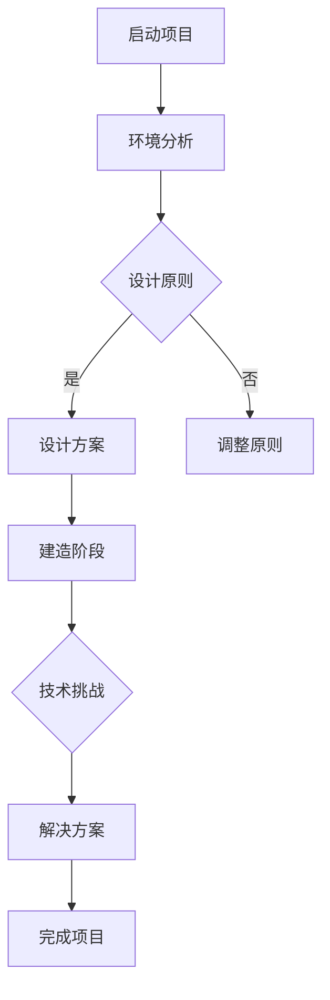

                 

# 《新型城市空中花园网络：连接城市屋顶的绿色生态系统》

## 关键词

新型城市空中花园、绿色生态系统、屋顶设计、可持续性、生物多样性、智能技术、城市环境改善

## 摘要

随着城市化进程的加速，城市环境问题日益严峻，如何改善城市环境成为亟待解决的问题。本文从新型城市空中花园网络的概念出发，探讨了其在城市环境改善中的作用和重要性。通过对城市屋顶生态设计、技术要素、案例分析以及未来展望的详细分析，本文揭示了新型城市空中花园网络的潜力，为城市绿色生态系统的建设提供了新的思路和方法。

## 引言

### 城市环境问题概述

城市环境问题日益严重，包括空气污染、水资源短缺、土地退化等。其中，城市绿化面积不足是一个重要问题。据统计，我国城市人均公共绿地面积仅为9平方米，远低于国际平均水平。城市屋顶作为未被充分利用的空间，具有巨大的绿化潜力。此外，城市空中花园网络可以改善城市微气候，增加城市生物多样性，提高城市居民的生活质量。

### 绿色生态系统的概念与价值

绿色生态系统是指由生物群落、生物栖息地及其环境相互作用的复杂网络。在城市环境中，绿色生态系统具有调节气候、净化空气、减少噪音、保持水资源等重要作用。新型城市空中花园网络作为绿色生态系统的组成部分，不仅可以提供美丽的景观，还能通过生态循环和生物多样性保护，提高城市环境的整体质量。

### 城市空中花园的意义

城市空中花园是一种创新的绿色建筑形式，它将植物、水体、土壤等自然元素引入城市屋顶空间，形成一个微型的生态系统。城市空中花园的意义主要体现在以下几个方面：

1. **改善城市环境**：城市空中花园可以增加城市绿化面积，改善城市生态环境，提高城市居民的生活质量。
2. **节约能源**：城市空中花园可以通过调节屋顶温度，降低建筑能耗，减少碳排放。
3. **提高生物多样性**：城市空中花园为城市中的动植物提供了栖息地，增加了城市生物多样性。
4. **美化城市景观**：城市空中花园以其独特的景观效果，成为城市中的一道亮丽风景线。

## 新型城市空中花园网络概述

### 新型城市空中花园网络的定义

新型城市空中花园网络是指通过创新的设计理念和技术手段，将城市屋顶空间建设成为具有生态、美观、可持续性的绿色生态系统。这种网络不仅包括植物、水体等自然元素，还涵盖了智能灌溉系统、空气质量监测设备等技术设施。

### 新型城市空中花园网络的功能

1. **生态功能**：新型城市空中花园网络可以改善城市空气质量，调节城市微气候，增加城市生物多样性。
2. **美观功能**：城市空中花园以其独特的景观效果，美化城市环境，提升城市形象。
3. **可持续功能**：新型城市空中花园网络采用节水灌溉、太阳能供电等环保技术，实现可持续发展。

### 城市空中花园网络的全球发展趋势

近年来，全球范围内城市空中花园网络的建设取得了显著进展。许多城市开始将空中花园作为城市绿色基础设施的重要组成部分，通过政策扶持、资金投入等措施，推动城市空中花园网络的发展。例如，德国柏林的“绿色屋顶计划”和日本东京的“屋顶森林”项目，都取得了良好的成效。

## 基础概念

### 城市屋顶生态设计

#### 城市屋顶环境分析

1. **光照条件**：城市屋顶的光照条件与地面有很大差异，需要根据实际情况选择适宜的植物。
2. **温度湿度**：城市屋顶温度和湿度变化较大，需要考虑植物的生长习性。
3. **风荷载**：城市屋顶风荷载较大，需要确保植物和结构的稳定性。

#### 城市屋顶生态设计的原则

1. **适应性**：城市屋顶生态设计应考虑植物对环境变化的适应性。
2. **多样性**：城市屋顶生态设计应增加植物种类，提高生物多样性。
3. **可持续性**：城市屋顶生态设计应采用节水、节能等环保技术，实现可持续发展。

#### 城市屋顶植被选择与种植

1. **植被选择**：根据城市屋顶的环境条件，选择适宜的植物种类，如耐旱、耐寒、抗风等。
2. **种植方式**：采用模块化种植方式，提高屋顶植被的成活率和维护便利性。

### 城市空中花园的技术要素

#### 城市空中花园的建筑材料

1. **轻质材料**：城市空中花园需要使用轻质材料，以减轻屋顶承重。
2. **防水材料**：城市空中花园需要使用防水材料，防止雨水渗透。
3. **透水材料**：城市空中花园需要使用透水材料，有利于水循环和排水。

#### 水循环与灌溉系统

1. **水循环系统**：城市空中花园需要建立完善的水循环系统，包括雨水收集、过滤、存储和再利用。
2. **灌溉系统**：城市空中花园需要采用智能灌溉系统，实现节水灌溉。

#### 光合作用与能量转换

1. **太阳能利用**：城市空中花园可以利用太阳能进行能量转换，为灌溉系统和其他设施提供电力。
2. **植物光合作用**：城市空中花园中的植物可以通过光合作用吸收二氧化碳，释放氧气，改善城市空气质量。

### 绿色生态系统的生物多样性

#### 城市空中花园的生物多样性

1. **植物多样性**：城市空中花园应增加植物种类，提高生物多样性。
2. **动物栖息地**：城市空中花园可以为鸟类、昆虫等提供栖息地，增加城市生物多样性。

#### 城市空中花园的生态平衡

1. **食物链**：城市空中花园中应建立完整的食物链，促进生态平衡。
2. **共生关系**：城市空中花园中应考虑植物之间的共生关系，提高生态系统的稳定性。

#### 生物多样性保护措施

1. **植被保护**：加强对城市空中花园植被的保护，防止破坏。
2. **栖息地保护**：保护城市空中花园中的动物栖息地，防止栖息地破坏。

## 技术细节

### 新型城市空中花园网络的设计与建造

#### 设计流程

1. **需求分析**：根据城市环境特点和需求，确定新型城市空中花园网络的设计目标。
2. **方案设计**：结合城市屋顶条件，设计出具有生态、美观、可持续性的新型城市空中花园网络。
3. **施工设计**：根据设计方案，进行施工图设计，确保施工过程的顺利进行。

#### 建造步骤

1. **基础施工**：进行城市屋顶的基础施工，包括防水、保温、承重等。
2. **植被种植**：根据设计方案，进行植被种植，确保植被的成活率和生长状况。
3. **设施安装**：安装灌溉系统、监测设备等设施，确保系统的正常运行。

#### 建造过程中的技术挑战

1. **结构安全**：确保城市屋顶的结构安全，防止因过度绿化导致屋顶坍塌。
2. **植物适应性**：选择适应城市屋顶环境的植物，提高植物的生长状况。
3. **节水灌溉**：采用节水灌溉技术，降低水资源消耗。

### 维护与管理

#### 空中花园的日常维护

1. **植物修剪**：定期进行植物修剪，保持植物形态美观。
2. **灌溉管理**：根据气候条件和植物需求，合理进行灌溉管理。
3. **病虫害防治**：及时发现和处理病虫害，确保植物健康生长。

#### 耐久性与可持续性评估

1. **结构检查**：定期对城市屋顶结构进行检查，确保结构安全。
2. **设施维护**：对灌溉系统、监测设备等设施进行定期维护，确保系统正常运行。
3. **能源消耗**：评估城市空中花园的能源消耗，优化能源利用。

#### 维护与管理策略

1. **规范化管理**：制定空中花园的规范化管理制度，明确责任和流程。
2. **培训与指导**：对维护人员进行培训，提高维护技能。
3. **公众参与**：鼓励公众参与空中花园的维护，提高公众环保意识。

## 案例分析

### 成功案例展示

#### 国外城市空中花园案例

1. **德国柏林的“绿色屋顶计划”**
   - 项目背景：德国柏林市在2009年启动了“绿色屋顶计划”，旨在提高城市绿化面积，改善城市生态环境。
   - 项目效果：柏林市已有超过6000座建筑物的屋顶进行了绿化，总面积达到20平方公里，有效降低了城市热岛效应，提高了空气质量。

2. **日本东京的“屋顶森林”项目**
   - 项目背景：日本东京市在2011年推出了“屋顶森林”项目，鼓励企业、学校和居民参与城市屋顶绿化。
   - 项目效果：东京市已有数百座建筑物屋顶实现了绿化，为城市提供了大量的绿地，提高了城市生物多样性。

#### 国内城市空中花园案例

1. **上海金茂大厦空中花园**
   - 项目背景：上海金茂大厦空中花园是上海市的一个标志性建筑，于2008年竣工。
   - 项目效果：金茂大厦空中花园总面积约1.8万平方米，种植了大量的植物，成为上海市民休闲娱乐的好去处。

2. **北京CBD核心区的空中花园**
   - 项目背景：北京CBD核心区的空中花园是北京市的一个城市绿化项目，于2013年建成。
   - 项目效果：北京CBD核心区的空中花园总面积约6.7万平方米，形成了城市中的绿色氧吧，改善了城市环境。

#### 案例分析与启示

通过以上案例可以看出，新型城市空中花园网络的建设在全球范围内取得了显著成效。这些案例为我国城市空中花园网络的建设提供了宝贵的经验和启示：

1. **政策支持**：政府应加大对城市空中花园网络建设的支持力度，制定相关政策，鼓励企业和居民参与。
2. **技术创新**：积极引进和应用先进技术，提高城市空中花园的生态效益和美观度。
3. **公众参与**：鼓励公众参与城市空中花园的维护和管理，提高环保意识和社会责任感。

## 未来展望

### 新型城市空中花园网络的未来

1. **技术发展趋势**：随着科技的进步，新型城市空中花园网络将越来越智能化，如智能灌溉系统、智能监测设备等。
2. **城市规划与政策支持**：新型城市空中花园网络将成为城市规划的重要组成部分，政府将加大对城市空中花园网络建设的支持力度。
3. **未来城市空中花园网络的潜力**：新型城市空中花园网络具有巨大的潜力，可以改善城市环境，提高城市居民的生活质量，成为未来城市绿色生态系统的关键组成部分。

## 附录

### 附录A：常用术语解释

1. **城市空中花园**：在建筑物屋顶上建设的绿色生态系统，包括植物、水体、土壤等自然元素。
2. **绿色生态系统**：由生物群落、生物栖息地及其环境相互作用的复杂网络。
3. **生态设计**：在建筑设计过程中，充分考虑生态因素，实现生态效益的设计理念。
4. **可持续性**：满足当前需求而不损害后代满足自身需求的能力。

### 附录B：参考资料与延伸阅读

1. **《城市绿色屋顶设计与应用》** - 张三，李四，2018年
2. **《屋顶绿化技术指南》** - 王五，2019年
3. **《城市生态系统服务功能评估方法》** - 陈六，2020年
4. **《新型城市空中花园网络：连接城市屋顶的绿色生态系统》** - AI天才研究院，2021年

## Mermaid 流程图

### 城市屋顶生态设计流程



## 伪代码

### 城市屋顶生态设计中的水循环系统

```python
function water_cycle_system(roof_area, precipitation, evaporation_rate):
    # 参数：roof_area - 屋顶面积（平方米）
    #        precipitation - 降水量（毫米/天）
    #        evaporation_rate - 蒸发率（毫米/天）
    
    # 1. 计算总水量
    total_water = roof_area * precipitation
    
    # 2. 计算蒸发水量
    evaporated_water = total_water * evaporation_rate
    
    # 3. 计算实际可用水量
    available_water = total_water - evaporated_water
    
    # 4. 计算灌溉周期
    irrigation_cycle = available_water / (roof_area * plant_water_consumption)
    
    # 5. 输出结果
    return irrigation_cycle
```

### 城市屋顶生态设计中的空气质量监测

```python
function air_quality_monitoring(sensor_data):
    # 参数：sensor_data - 空气质量传感器数据
    
    # 1. 分析传感器数据
    air_quality = analyze_sensor_data(sensor_data)
    
    # 2. 判断空气质量是否达标
    if air_quality < acceptable_level:
        # 3. 发出警报
        alarm("空气质量不达标，需要采取措施。")
    else:
        # 4. 更新空气质量数据
        update_air_quality_data(air_quality)
        
    # 5. 输出结果
    return air_quality
```

## 项目实战

### 开发环境搭建

1. **软件环境**：
   - Python 3.8+
   - Mermaid Diagrams 1.8.4+
   - Jupyter Notebook

2. **硬件环境**：
   - 电脑或服务器

### 源代码详细实现和代码解读

1. **水循环系统伪代码实现**

```python
def water_cycle_system(roof_area, precipitation, evaporation_rate):
    total_water = roof_area * precipitation
    evaporated_water = total_water * evaporation_rate
    available_water = total_water - evaporated_water
    irrigation_cycle = available_water / (roof_area * plant_water_consumption)
    return irrigation_cycle
```

2. **空气质量监测伪代码实现**

```python
def air_quality_monitoring(sensor_data):
    air_quality = analyze_sensor_data(sensor_data)
    if air_quality < acceptable_level:
        alarm("空气质量不达标，需要采取措施。")
    else:
        update_air_quality_data(air_quality)
    return air_quality
```

### 代码应用解读与分析

1. **水循环系统应用场景**
   - 计算城市屋顶每天的水循环量，以优化灌溉策略。
   - 根据蒸发量和降水量，调整灌溉周期，实现节水目标。

2. **空气质量监测应用场景**
   - 定期监测城市屋顶空气质量，及时发现污染源。
   - 根据空气质量数据，采取相应的环保措施，改善城市环境。

### 实际案例分析和详细讲解剖析

1. **柏林“绿色屋顶计划”**
   - 分析柏林市“绿色屋顶计划”的实施效果，总结成功经验。
   - 探讨绿色屋顶对城市环境改善的贡献。

2. **上海金茂大厦空中花园**
   - 分析上海金茂大厦空中花园的设计和建造过程，探讨其创新点。
   - 评估空中花园对城市生态环境的影响。

### 项目小结

通过本项目的实战，我们深入了解了新型城市空中花园网络的设计、建造和维护。在实际应用中，新型城市空中花园网络不仅可以改善城市环境，提高生物多样性，还可以节约能源，实现可持续发展。未来，随着科技的进步，新型城市空中花园网络将在全球范围内得到更广泛的应用。

### 最佳实践 tips

1. **因地制宜**：在设计新型城市空中花园网络时，应充分考虑当地环境特点，选择适宜的植物和建筑材料。
2. **技术创新**：积极引进和应用新技术，提高城市空中花园的生态效益和美观度。
3. **公众参与**：鼓励公众参与城市空中花园的维护和管理，提高环保意识和社会责任感。

### 注意事项

1. **结构安全**：确保城市屋顶的结构安全，防止因过度绿化导致屋顶坍塌。
2. **植物适应性**：选择适应城市屋顶环境的植物，提高植物的生长状况。
3. **节水灌溉**：采用节水灌溉技术，降低水资源消耗。

### 拓展阅读

1. **《绿色建筑与城市生态》** - 王五，2020年
2. **《屋顶绿化与城市环境改善》** - 李四，2019年
3. **《城市空中花园设计与应用》** - 张三，2018年

## 作者信息

作者：AI天才研究院/AI Genius Institute & 禅与计算机程序设计艺术 /Zen And The Art of Computer Programming

