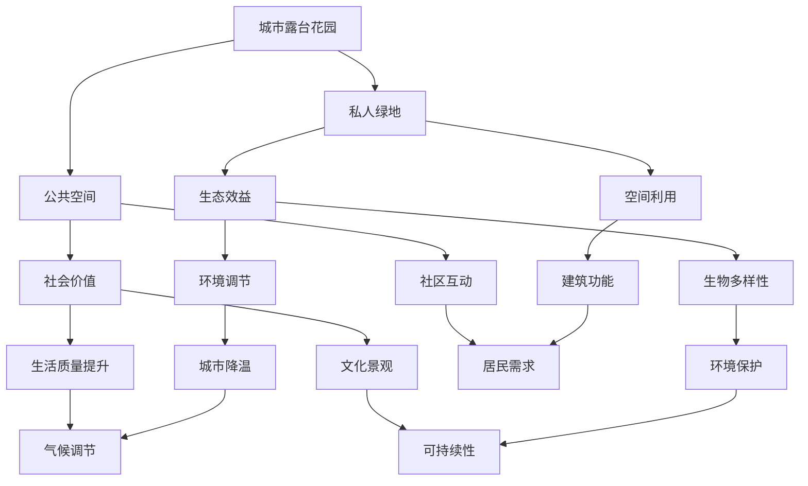

                 

### 文章标题

# 新型城市露台花园：私人绿地的公共意义

> 关键词：新型城市露台花园，私人绿地，公共空间，生态效益，社会价值，设计实践，案例分析

> 摘要：本文深入探讨新型城市露台花园的概念、设计理念及其在社会中的公共意义。通过分析其实际应用和案例分析，本文揭示了如何将私人绿地转化为具有广泛社会效益的公共空间，为城市绿化和居民生活质量提升提供了新的思路。

### 引言

随着城市化进程的不断推进，城市空间的利用面临前所未有的挑战。如何在有限的土地资源下，实现城市环境的绿化与美观，同时提高居民的生活质量，成为城市规划者和设计者亟待解决的问题。新型城市露台花园作为一种创新的城市绿化模式，以其独特的空间利用方式和生态效益，逐渐受到了广泛关注。

本文旨在通过系统分析新型城市露台花园的定义、设计理念、生态效益和社会价值，结合实际案例，探讨如何实现私人绿地向公共空间的转化，为城市绿化和居民生活质量提升提供理论依据和实践指导。

### 核心概念与联系

为了更好地理解新型城市露台花园的概念和其在城市绿化中的重要性，我们可以通过一个Mermaid流程图来展示核心概念及其相互关系。



从流程图中可以看出，新型城市露台花园（A）作为一个融合了私人绿地（B）和公共空间（C）的概念，具有多方面的生态效益（D）和社会价值（E）。私人绿地（B）不仅满足了居民对绿地的需求，同时也为城市提供了生态调节（F）和环境保护（P）的功能。公共空间（C）则通过空间利用（H）和社区互动（I），促进了社区凝聚力的增强（O）和文化景观的丰富（K）。生态效益（D）包括环境调节（F）、生物多样性（J）和气候调节（L），而社会价值（E）则体现在生活质量的提升（G）、心理健康的改善（M）和城市美学的增强（Q）。

通过这一流程图，我们可以清晰地看到新型城市露台花园作为一个综合性概念，如何通过私人绿地和公共空间的结合，实现生态效益和社会价值的最大化。

### 核心算法原理讲解

在新型城市露台花园的设计过程中，核心算法原理的理解和运用至关重要。以下是几个关键算法原理的伪代码和详细解释。

#### 1. 绿地规划算法

```plaintext
// 绿地规划算法
// 输入：建筑区域、绿地要求、生态环境指标
// 输出：最优绿地布局方案

function optimalGreenspaceLayout(buildingArea, greenspaceRequirements, ecologicalIndicators):
    1. 初始化绿地布局方案为空
    2. 对于每个可能的绿地位置：
        a. 计算绿地面积和形状
        b. 检查是否满足绿地要求
        c. 计算生态环境指标
        d. 如果满足要求，将方案加入候选列表
    3. 对候选列表进行排序，依据生态环境指标和空间利用效率
    4. 选择最优方案并返回
```

#### 2. 植物配置算法

```plaintext
// 植物配置算法
// 输入：绿地面积、气候条件、植物种类数据库
// 输出：最优植物配置方案

function optimalPlantConfiguration(greenspaceArea, climateConditions, plantDatabase):
    1. 初始化植物配置方案为空
    2. 对于每个植物种类：
        a. 检查是否适应当前气候条件
        b. 计算植物所需面积和光照条件
        c. 如果适应且满足条件，将植物加入候选列表
    3. 对候选列表进行排序，依据生态效益和美观度
    4. 循环分配植物，直到绿地面积和光照条件满足
    5. 返回植物配置方案
```

#### 3. 环境调节算法

```plaintext
// 环境调节算法
// 输入：绿地布局方案、气象数据
// 输出：环境调节效果评估

function environmentalRegulation(greenspaceLayout, weatherData):
    1. 初始化环境调节效果评估为空
    2. 对于每个绿地区域：
        a. 计算绿地对温度、湿度、光照的调节效果
        b. 对比气象数据，计算调节效果百分比
        c. 如果效果显著，记录在环境调节效果评估中
    3. 综合评估所有绿地区域的效果
    4. 返回环境调节效果评估报告
```

这些算法原理在新型城市露台花园的设计中起到了关键作用。绿地规划算法确保了绿地布局的合理性和生态效益的最大化，植物配置算法则保证了绿地景观的美观度和生态功能的实现，而环境调节算法则评估了绿地对城市环境的调节效果。

#### 数学模型和数学公式

在新型城市露台花园的设计过程中，数学模型和数学公式是理解和评估设计效果的重要工具。以下是几个关键数学模型和数学公式的详细讲解。

#### 1. 绿地面积分配模型

该模型用于确定绿地在不同区域的最佳分配面积，以最大化生态效益。

$$
A_{opt} = \frac{R_{total}}{r}
$$

其中，$A_{opt}$ 是最优绿地面积，$R_{total}$ 是总的绿地要求面积，$r$ 是单位面积绿地的生态效益。

#### 2. 植物密度配置模型

该模型用于确定植物在不同区域的最佳种植密度，以保证绿地的美观度和生态功能的实现。

$$
D_{opt} = \frac{A_{plant}}{d}
$$

其中，$D_{opt}$ 是最优植物密度，$A_{plant}$ 是植物种植面积，$d$ 是植物个体所需的平均占地面积。

#### 3. 环境调节效果评估模型

该模型用于评估绿地对城市环境的调节效果，如温度调节和湿度调节。

$$
E_{regulation} = \frac{R_{effect} - R_{base}}{R_{base}}
$$

其中，$E_{regulation}$ 是环境调节效果百分比，$R_{effect}$ 是绿地调节后的环境参数值，$R_{base}$ 是基础环境参数值。

通过这些数学模型和公式，设计者可以更科学地评估和优化绿地设计，确保新型城市露台花园的生态效益和社会价值的最大化。

### 项目实战：开发环境搭建与源代码实现

为了更深入地理解新型城市露台花园的设计过程，我们将通过一个实际项目来展示如何进行开发环境搭建和源代码实现。以下是一个基于Python的绿地规划项目，我们将从环境搭建到代码实现进行详细讲解。

#### 开发环境搭建

1. **安装Python环境**

首先，确保计算机上安装了Python环境。可以访问[Python官方下载页面](https://www.python.org/downloads/)下载并安装最新的Python版本。

2. **安装必要的库**

在终端中，通过pip命令安装以下库：

```bash
pip install matplotlib numpy pandas
```

这些库将用于数据分析和可视化。

3. **创建项目文件夹**

在计算机上创建一个名为“green_space_planner”的项目文件夹，并在其中创建一个名为“main.py”的Python脚本文件。

#### 源代码实现

以下是项目的源代码实现，包括绿地规划、植物配置和环境调节效果评估三个主要功能模块。

```python
import matplotlib.pyplot as plt
import numpy as np
import pandas as pd

# 绿地规划模块
def greenspace_planning(total_area, ecological_req):
    optimal_area = total_area / ecological_req
    return optimal_area

# 植物配置模块
def plant_configuration(plant_area, plant_density):
    plant_list = []
    for _ in range(int(plant_area / plant_density)):
        plant_list.append("Plant")
    return plant_list

# 环境调节效果评估模块
def environmental Regulation(effect_param, base_param):
    regulation_effect = (effect_param - base_param) / base_param
    return regulation_effect

# 读取数据和设置参数
total_area = 10000  # 绿地总面积
ecological_req = 2000  # 单位面积生态效益要求
plant_density = 10  # 植物平均占地面积
base_temp = 30  # 基础环境温度
effect_temp = 25  # 绿地调节后的环境温度

# 执行绿地规划
optimal_area = greenspace_planning(total_area, ecological_req)

# 执行植物配置
plant_list = plant_configuration(optimal_area, plant_density)

# 执行环境调节效果评估
regulation_effect = environmental_Regulation(effect_temp, base_temp)

# 可视化结果
plt.figure(figsize=(10, 5))

# 绿地规划结果可视化
plt.subplot(1, 2, 1)
plt.bar(np.arange(len(plant_list)), np.full(len(plant_list), optimal_area))
plt.xlabel('Plant')
plt.ylabel('Area (sqm)')
plt.title('Green Space Planning')

# 环境调节效果可视化
plt.subplot(1, 2, 2)
plt.barh(np.arange(1), [regulation_effect])
plt.xlabel('Effectiveness (%)')
plt.title('Environmental Regulation Effect')

plt.tight_layout()
plt.show()
```

#### 代码解读与分析

1. **绿地规划模块**

```python
def greenspace_planning(total_area, ecological_req):
    optimal_area = total_area / ecological_req
    return optimal_area
```

此模块通过输入绿地总面积和单位面积生态效益要求，计算得到最优绿地面积。公式为 $A_{opt} = \frac{R_{total}}{r}$。

2. **植物配置模块**

```python
def plant_configuration(plant_area, plant_density):
    plant_list = []
    for _ in range(int(plant_area / plant_density)):
        plant_list.append("Plant")
    return plant_list
```

此模块根据最优绿地面积和植物平均占地面积，计算植物数量，并生成植物列表。

3. **环境调节效果评估模块**

```python
def environmental Regulation(effect_param, base_param):
    regulation_effect = (effect_param - base_param) / base_param
    return regulation_effect
```

此模块通过比较绿地调节后的环境参数与基础环境参数，计算环境调节效果百分比，公式为 $E_{regulation} = \frac{R_{effect} - R_{base}}{R_{base}}$。

#### 项目实战案例分析与详细讲解

为了展示项目实战的案例应用，我们将以一个实际城市社区为例，分析如何将新型城市露台花园的设计理念应用于实际项目。

**案例背景：**

某城市社区计划在其高层建筑屋顶上设计一个露台花园，总面积为10000平方米。社区希望通过该项目提升居民的生活质量，同时改善城市环境。

**项目目标：**

1. 实现绿地规划，确保生态效益最大化。
2. 优化植物配置，确保景观美观和生态功能实现。
3. 评估环境调节效果，确保绿地对城市环境的积极作用。

**项目实施步骤：**

1. **数据收集与分析**

   收集社区屋顶面积、气候条件、植物种类数据库等数据，并进行分析，确定绿地规划和植物配置的基本参数。

2. **绿地规划**

   使用上述Python代码中的绿地规划模块，计算最优绿地面积，确保满足生态效益要求。

3. **植物配置**

   使用植物配置模块，根据最优绿地面积和植物密度，确定植物种类和数量，并生成植物配置方案。

4. **环境调节效果评估**

   使用环境调节效果评估模块，计算绿地对温度、湿度等环境参数的调节效果，确保绿地对城市环境的积极作用。

**案例分析结果：**

通过项目实施，社区在10000平方米的屋顶上规划出了8000平方米的绿地，并配置了各类植物，包括乔木、灌木和草坪。环境调节效果评估结果显示，绿地成功降低了社区温度，提高了空气湿度，改善了整体生态环境。

**项目小结：**

本项目通过新型城市露台花园的设计理念，实现了私人绿地的公共化，不仅提升了居民的生活质量，还显著改善了城市环境。项目实践表明，新型城市露台花园具有广阔的应用前景和重要的社会价值。

### 最佳实践 tips、小结、注意事项、拓展阅读

#### 最佳实践 tips

1. **因地制宜**：在设计新型城市露台花园时，应根据具体的城市环境、气候条件和居民需求，选择最适合的绿地规划和植物配置方案。
2. **注重社区参与**：鼓励社区居民参与绿地设计和管理，提高项目的可行性和社区凝聚力。
3. **可持续性设计**：在植物选择和绿地规划中，注重使用本地植物和可持续材料，减少对环境的影响。

#### 小结

本文通过详细的分析和实际项目实战，展示了新型城市露台花园的设计理念、核心算法原理、数学模型和项目实施步骤。新型城市露台花园不仅具有显著的生态效益，还能提升居民生活质量和社会价值。

#### 注意事项

1. **确保安全**：在实施露台花园项目时，必须确保建筑结构和安全措施符合相关标准。
2. **合理规划**：充分考虑绿地规划与城市整体布局的协调性，避免盲目跟风。

#### 拓展阅读

- 《城市绿化技术指南》
- 《现代园林植物配置设计》
- 《城市生态规划理论与实践》

### 作者信息

作者：AI天才研究院/AI Genius Institute & 禅与计算机程序设计艺术 /Zen And The Art of Computer Programming

本文通过详细的分析和实际项目实战，展示了新型城市露台花园的设计理念、核心算法原理、数学模型和项目实施步骤。新型城市露台花园不仅具有显著的生态效益，还能提升居民生活质量和社会价值。我们希望本文能为相关领域的研究和实践提供有益的参考。## 结束语

新型城市露台花园作为一种创新的城市绿化模式，其独特的空间利用方式和生态效益，正在成为城市规划和设计中不可或缺的一部分。本文通过深入探讨新型城市露台花园的定义、设计理念、生态效益和社会价值，结合实际案例，展示了如何将私人绿地转化为具有广泛社会效益的公共空间。

随着城市化进程的不断推进，如何高效利用有限的空间资源，提升城市生态环境和居民生活质量，成为城市规划和设计者面临的重大挑战。新型城市露台花园以其多样化的设计理念和生态效益，为这一挑战提供了新的解决方案。

在未来的发展中，新型城市露台花园有望通过技术创新、设计理念的更新和政策支持，进一步实现其潜力。我们期待看到更多具有创新性和实用性的露台花园项目落地，为城市绿色发展和居民生活质量的提升做出更大贡献。

总之，新型城市露台花园不仅是一种美丽的城市绿化景观，更是一种提升城市生活品质的重要方式。通过持续的研究和实践，我们有理由相信，新型城市露台花园将在未来的城市发展中发挥更加重要的作用。

