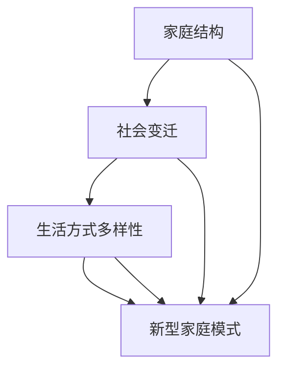

                 

### 第1章 引言

#### 1.1 家庭形态的变迁

家庭是社会的基石，承载着情感交流、生活支持、教育传承等多重功能。然而，随着时代的变迁，家庭形态也在不断演变。从传统的“四世同堂”到现代的“小家庭”，这种变迁不仅是生活方式的改变，更是社会发展的缩影。

**传统家庭的定义与特点**

传统家庭以血缘关系为主要纽带，通常由父母和子女组成。家庭成员之间有着明确的角色分工，家庭经济主要由男性承担，女性则主要负责家务和孩子抚养。这种家庭形态强调的是稳定性、责任感和传统价值观。

**当代家庭的多样化**

随着社会的发展，当代家庭形态呈现出多样化和个性化趋势。离婚率上升、单亲家庭增多、同性伴侣组成家庭等现象都表明，家庭形式不再局限于传统的定义。同时，现代家庭也更加注重个人发展和自由选择，家庭成员之间的互动关系变得更加平等和开放。

**本章目的与结构**

本章旨在探讨家庭形态的变迁以及多元化生活方式的兴起，为后续章节的分析提供背景和基础。具体内容包括：

1. **家庭形态的变迁**：分析传统家庭和当代家庭的不同特点，探讨变迁的原因。
2. **多元化生活方式的定义**：介绍多元化生活方式的概念和核心要素，阐述其对家庭结构的影响。
3. **本书的目的与结构**：明确本书的研究目的、研究方法和章节安排。

通过本章的介绍，我们将为后续章节的深入分析奠定基础，进一步探讨多元化生活方式对新型家庭形态的塑造和影响。

### 1.2 多元化生活方式的定义

#### 多元化生活方式的概念

多元化生活方式是指一种包容性和多样性的生活方式，它强调个人选择和自我表达的自由，尊重不同文化、价值观和生活方式的存在。这种生活方式不仅仅体现在家庭结构上，还渗透到人们的职业、社交、教育、消费等多个方面。

**多元化生活方式的核心要素**

1. **个人选择**：多元化生活方式强调个人有权自主选择生活方式，不受传统观念和社会规范的束缚。这种选择包括婚姻、职业、居住地、教育方式等各个方面。
   
2. **多样性**：多样性是多元化生活方式的重要特征，它体现为不同文化、价值观和生活方式的并存和交流。这种多样性不仅丰富了个人生活，也为社会带来了新的活力和可能性。

3. **平等与尊重**：多元化生活方式倡导平等和尊重，无论个人的性别、种族、性取向、宗教信仰等，都应该得到社会的尊重和包容。

**多元化生活方式对家庭结构的影响**

多元化生活方式的兴起对家庭结构产生了深远的影响。首先，家庭形态变得更加多样化，不再局限于传统的定义。例如，单亲家庭、同性伴侣家庭、跨国家庭等形式逐渐被社会所接受。

其次，家庭成员之间的互动关系也更加平等和开放。在传统家庭中，父母和子女之间往往存在明显的权力和责任分工，而在多元化生活方式下，家庭成员更多地基于相互尊重和合作来建立关系。

此外，多元化生活方式还影响了家庭的价值观和生活方式。现代家庭更加注重个人发展和自我实现，家庭成员之间更多地以平等和合作的方式互动，家庭角色和分工也变得更加灵活。

**本章小结**

通过本章的讨论，我们明确了多元化生活方式的概念和核心要素，并探讨了其对家庭结构的影响。在接下来的章节中，我们将进一步分析家庭结构与社会变迁之间的关系，以及新型家庭模式的探索。

### 1.3 本书的目的与结构

**本书的目的**

本书旨在深入探讨家庭形态的变迁和多元化生活方式的兴起，分析其对现代社会和家庭结构的影响。具体目标包括：

1. **理解家庭形态的变迁**：通过分析传统家庭和当代家庭的不同特点，探讨家庭形态变迁的原因和趋势。
2. **探讨多元化生活方式的概念和影响**：介绍多元化生活方式的核心要素，分析其对家庭结构、价值观和生活方式的影响。
3. **探索新型家庭模式**：分析共同居住模式、虚拟家庭等新型家庭模式的特征和优势，探讨其对传统家庭关系的挑战和机遇。

**本书的结构**

本书分为七个章节，具体结构和内容安排如下：

1. **第1章 引言**：介绍家庭形态的变迁和多元化生活方式的定义，明确本书的目的和结构。
2. **第2章 家庭结构与社会变迁**：分析家庭结构的演变，探讨经济、文化、社会政策等因素对家庭结构的影响。
3. **第3章 多元化生活方式的核心要素**：深入探讨个人选择、多样性和平等与尊重等多元化生活方式的核心要素，以及其对家庭价值观的影响。
4. **第4章 新型家庭模式的探索**：分析共同居住模式和虚拟家庭的特征、优势、挑战，探讨其对传统家庭关系的冲击和机遇。
5. **第5章 家庭生活方式的变革**：讨论家庭消费模式的变化、科技对家庭生活方式的影响，以及家庭休闲活动的新趋势。
6. **第6章 家庭教育的新挑战与新机遇**：分析多元化教育需求的满足、家庭教育中的挑战与应对策略，以及在线教育与家庭教育的发展趋势。
7. **第7章 新型家庭的未来展望**：展望新型家庭的发展趋势，探讨家庭与社会的关系，以及家庭内部的动态平衡。

通过以上章节的深入分析，本书旨在为读者提供一个全面而系统的视角，以理解和应对家庭形态变迁和多元化生活方式带来的挑战和机遇。

### 2.1 家庭结构与社会变迁

**2.1.1 传统家庭的定义与特点**

传统家庭通常是指由父母和子女组成的直系亲属关系群体，家庭成员之间具有明确的角色分工和责任体系。在传统家庭中，父亲作为家庭的经济支柱，负责养家糊口；母亲则承担家庭内部的事务，包括家务和子女抚养。传统家庭强调的是家庭的稳定性和传承性，家庭成员之间的互动和责任基于传统的价值观念和性别角色分工。

**2.1.2 当代家庭的多样化**

随着社会的发展和变迁，当代家庭的结构呈现出多样化的趋势。现代社会中，家庭形态不再局限于传统的定义，而是更加多样化和个性化。以下是一些当代家庭多样化的具体表现：

1. **小家庭与单身家庭的增多**：随着社会经济的发展，人们对于个人自由和职业发展的追求增强，越来越多的年轻人选择不立即结婚或组建大家庭，而是选择小家庭或单身生活。

2. **单亲家庭**：离婚率的上升和社会观念的变化导致单亲家庭的增多。单亲家庭通常由母亲或父亲独自抚养子女，这种家庭结构面临更多的生活和经济挑战。

3. **同性伴侣家庭**：随着社会对性取向多样性的接受度提高，越来越多的同性伴侣选择组成家庭，并在法律和社会规范中获得了合法地位。

4. **跨国家庭**：全球化背景下，跨国家庭的现象日益普遍。这些家庭通常由不同国籍的夫妻组成，子女可能在多个国家生活和学习。

**2.1.3 社会变迁对家庭结构的影响**

社会变迁对家庭结构产生了深远的影响，主要体现在以下几个方面：

1. **经济因素**：经济的发展和就业模式的改变对家庭结构产生了直接影响。随着女性就业率的提高，家庭内部的经济责任分工变得更加灵活。同时，经济压力和竞争也促使家庭成员更加注重个人的职业发展和经济独立。

2. **文化因素**：文化多样性和价值观念的变化影响了家庭结构和成员之间的互动方式。现代文化强调个人自由和自我实现，这促使家庭角色和分工更加平等和开放。同时，不同文化背景的家庭成员在共同生活中需要协调和适应不同的价值观。

3. **社会政策**：社会政策的变化也对家庭结构产生了影响。例如，婚姻法、家庭政策、儿童保护政策等对社会家庭的规范和运作产生了直接影响。政府通过提供家庭支持政策，如托儿服务、税收优惠等，来促进家庭稳定和成员福祉。

**2.1.4 家庭结构的变迁与多元化生活方式的关系**

家庭结构的变迁与多元化生活方式密切相关。多元化生活方式的兴起不仅改变了家庭内部的角色和分工，还影响了家庭成员的互动关系和价值观。具体来说：

1. **个人选择的增强**：多元化生活方式鼓励个人根据自身情况和需求做出选择，包括职业、居住地、生活方式等。这种选择权的增加使得家庭结构更加多样化。

2. **互动关系的平等化**：在多元化生活方式下，家庭成员之间的互动关系更加平等和尊重。传统的家庭角色分工逐渐被打破，家庭成员更多地基于相互尊重和合作来建立关系。

3. **家庭价值观的多元化**：随着社会的开放和包容，家庭内部的价值观也变得更加多元化。家庭成员可以在共同生活中协调和融合不同的价值观，形成更加包容和开放的家庭文化。

**本章小结**

通过本章的分析，我们明确了传统家庭的定义与特点，并探讨了当代家庭多样化的趋势。同时，我们还分析了社会变迁对家庭结构的影响，以及多元化生活方式与家庭结构变迁之间的关系。这些讨论为理解家庭形态的变迁和新型家庭模式的探索奠定了基础。

### 2.2 家庭结构变迁的具体分析

#### 2.2.1 经济因素

经济因素是影响家庭结构变迁的重要因素之一。随着全球化经济的快速发展，人们的生活方式和就业模式发生了显著变化，从而对家庭结构产生了深远影响。

**经济独立与家庭结构**

在经济因素的作用下，女性就业率的提高是家庭结构变迁的一个关键因素。在过去，家庭经济主要由男性承担，而现代社会中，女性在职场上的活跃程度逐渐增加，许多女性不仅能够实现经济独立，还能够承担家庭的主要经济责任。这种变化导致了家庭内部的经济责任分工更加平等，传统的“男主外，女主内”的分工模式逐渐被打破。

**双薪家庭的兴起**

随着女性经济地位的提升，双薪家庭（即夫妻双方都有工作的家庭）逐渐成为主流。双薪家庭不仅分担了家庭的经济压力，还为家庭成员提供了更多的职业发展机会。这种家庭结构使得家庭成员有更多的时间和精力投入到个人发展和家庭生活中，从而促进了家庭生活方式的多样化和个人选择的自由。

**经济压力对家庭结构的影响**

另一方面，经济压力也是影响家庭结构的一个重要因素。在经济不景气或就业机会减少的情况下，家庭可能会面临财务压力，这可能会导致家庭结构的变化。例如，一些家庭可能会选择减少子女数量，甚至可能会推迟婚姻和生育，以应对经济压力。此外，经济压力还可能促使家庭成员更多地依赖外部资源和支持，如政府福利和家庭援助，这也影响了家庭的功能和结构。

#### 2.2.2 文化因素

文化因素在家庭结构变迁中的作用同样不可忽视。文化的多样性和变化不仅影响了家庭内部的角色和分工，还影响了家庭成员之间的互动关系和价值观。

**文化多样性与家庭多样性**

全球化带来了文化多样性的增加，不同文化背景的人们在跨国婚姻和家庭生活中相互影响。这种文化多样性不仅丰富了家庭生活，也促使家庭结构变得更加多样化。例如，跨国家庭越来越多地出现在现代社会中，家庭成员可能来自不同的文化背景，需要协调和融合不同的文化习俗和价值观。

**价值观念的变化**

随着社会的发展，传统的价值观念逐渐被新的观念所取代。例如，现代家庭更加注重个人自由和自我实现，而不是仅仅以家庭为单位。这种价值观念的变化促使家庭成员更加平等地参与家庭决策，共同承担家庭责任。此外，随着人们对性别平等的认识加深，家庭内部的性别角色分工也变得更加灵活。

**文化认同与家庭结构**

文化认同也是家庭结构变迁的一个重要方面。家庭成员可能来自不同的文化背景，他们在家庭生活中需要找到共同的文化认同。这种认同感可以增强家庭成员之间的凝聚力，但也可能引发文化冲突和矛盾。例如，一些家庭可能会在传统节日、饮食习惯等方面出现分歧，这需要家庭成员通过沟通和妥协来解决问题。

#### 2.2.3 社会政策

社会政策的变化对家庭结构产生了直接的影响。政府通过制定和实施家庭政策来促进家庭稳定和成员福祉，这些政策不仅影响家庭的经济状况，还影响家庭的功能和结构。

**社会福利与家庭结构**

社会福利政策，如育儿津贴、医疗保险、住房补贴等，能够显著改善家庭的经济状况，从而对家庭结构产生影响。例如，政府的育儿津贴可以减轻家庭的经济压力，使得父母有更多的时间和精力照顾子女，从而改善家庭生活质量。此外，住房补贴可以降低家庭的居住成本，使得家庭能够更好地满足基本生活需求。

**婚姻与家庭政策**

婚姻与家庭政策，如婚姻法律改革、家庭暴力防治措施、婚姻辅导服务等，对家庭结构也有重要影响。婚姻法律改革使得婚姻关系更加平等和自由，减少了婚姻破裂带来的社会问题。家庭暴力防治措施和婚姻辅导服务则有助于保护家庭成员的权益，提高家庭的稳定性。

**教育政策与家庭结构**

教育政策，如义务教育、免费教育、教育资助等，也对家庭结构产生影响。良好的教育资源可以改善家庭的教育状况，提高家庭成员的素质，从而促进家庭的发展和稳定。同时，教育政策还可以影响家庭的教育观念和育儿方式，进而影响家庭结构。

**本章小结**

经济因素、文化因素和社会政策是影响家庭结构变迁的三个重要方面。经济独立和文化多样性的增加促使家庭结构变得更加多样化，而社会政策的变化则通过提供经济支持和法律保障来促进家庭稳定和成员福祉。理解这些因素如何相互作用和影响，有助于我们更好地应对家庭形态变迁带来的挑战和机遇。

### 3.1 多元化生活方式的核心要素

多元化生活方式的核心要素涵盖了个人选择、多样性和平等与尊重。这些要素不仅决定了家庭生活方式的多样化，还深刻影响了家庭成员之间的关系和互动方式。

#### 3.1.1 工作与生活的平衡

在多元化生活方式中，工作与生活的平衡是一个关键要素。现代家庭面临的挑战之一是如何在追求职业成功的同时，保持生活的质量和家庭的和谐。为了实现这一目标，家庭成员需要共同制定合理的时间管理计划，确保工作和家庭生活之间的平衡。

**弹性工作时间**：许多企业开始采用弹性工作时间制度，允许员工根据自己的需求和偏好调整工作时间和地点。这种制度不仅提高了员工的工作满意度，还有助于家庭成员更好地平衡工作和家庭责任。

**共享家庭责任**：在多元化生活方式下，家庭成员应共同承担家庭责任，包括家务、子女教育和家庭事务。这种共享不仅减轻了单一家庭成员的负担，还有助于增强家庭成员之间的互动和合作。

**家庭休假与育儿假**：政府和企业应提供家庭休假和育儿假政策，以支持家庭在育儿和抚养老人方面的需求。这些政策可以帮助家庭成员更好地平衡工作和家庭生活，提高生活质量。

#### 3.1.2 家庭角色与分工

在多元化生活方式中，家庭角色和分工变得更加灵活和多样。传统家庭中的固定角色和分工模式逐渐被打破，家庭成员可以根据自己的兴趣、能力和需求来选择和调整家庭角色。

**性别平等**：在多元化生活方式下，性别平等是一个重要的原则。家庭成员不应受到传统性别角色的限制，而是可以根据个人喜好和能力来承担家庭责任。例如，女性不再仅仅负责家务和育儿，男性也可以积极参与家庭事务。

**多样化的角色分工**：家庭角色的多样化不仅体现在性别上，还包括年龄、兴趣和技能等多个方面。例如，家庭成员可以根据自己的特长和兴趣来承担家庭中的特定角色，如财务规划、家庭装修、子女教育等。

**代际互动**：在多元化生活方式中，代际互动变得更加重要。年轻一代和年长一代通过共同参与家庭事务和分享生活经验，不仅能够增进彼此的了解和尊重，还能够促进家庭内部的和谐。

#### 3.1.3 家庭价值观的多样性

家庭价值观的多样性是多元化生活方式的重要组成部分。家庭成员来自不同的文化背景和成长环境，拥有不同的价值观和信仰。在多元化生活方式下，家庭需要学会尊重和包容这些不同的价值观，共同构建一个和谐的家庭环境。

**价值观的碰撞与融合**：家庭中不同价值观的碰撞和融合是一个常见现象。例如，家庭成员可能在育儿方式、消费观念、生活方式等方面存在分歧。通过有效的沟通和协商，家庭成员可以找到共同的价值基础，并在差异中寻求和谐。

**共同价值观的构建**：在多元化生活方式下，家庭成员可以共同探讨和构建新的家庭价值观。这种价值观不仅尊重个体的差异，还强调家庭的整体利益和共同目标。例如，家庭成员可以共同制定家庭愿景和目标，促进家庭凝聚力和成员间的合作。

**文化融合**：家庭中的文化融合是一个重要的过程。家庭成员可以共同庆祝不同文化节日，分享各自的文化习俗和传统，从而增进相互了解和尊重。

**本章小结**

多元化生活方式的核心要素包括工作与生活的平衡、家庭角色与分工的多样性，以及家庭价值观的多样性。通过这些要素，家庭成员能够更好地实现个人选择和自我表达，构建一个和谐、包容和多样化的家庭环境。这些核心要素不仅影响着家庭内部的关系和互动，还深刻影响着家庭的生活方式和社会地位。

### 3.2 家庭价值观的多样性

**3.2.1 传统价值观与现代价值观的碰撞**

家庭价值观的多样性体现在传统价值观与现代价值观的碰撞和融合中。传统价值观通常强调家庭责任、孝道、稳定性和遵从传统规范，而现代价值观则更注重个人自由、自我实现、多样性和包容性。

**传统价值观的特点**

传统价值观中的家庭责任和孝道，强调家庭成员之间的互相照顾和依赖，尤其是对长辈的尊敬和照顾。这种价值观注重家庭的稳定和传承，鼓励家庭成员为了家庭的利益而牺牲个人的需求和愿望。

**现代价值观的特点**

现代价值观强调个人自由和自我实现，鼓励家庭成员追求个人梦想和职业发展。这种价值观注重个性化和多样性的发展，尊重每个家庭成员的选择和权利。同时，现代价值观也更加包容，接受不同性取向、种族和文化背景的多样性。

**碰撞与融合**

传统价值观与现代价值观的碰撞常常在家庭决策、教育方式、生活方式等方面体现。例如，在子女教育上，传统家庭可能更倾向于注重学习成绩和道德教育，而现代家庭可能更注重培养孩子的创造力和独立思考能力。通过有效的沟通和协商，家庭可以在尊重传统价值观的基础上，融入现代价值观，实现价值观的融合。

**案例分析**

一个典型的案例是关于家庭决策的冲突。在一个传统家庭中，父亲可能希望子女遵循传统的职业道路，如医生、律师或教师，而子女则希望追求自己感兴趣的领域，如艺术或科技创业。在这种情况下，家庭成员需要通过沟通和妥协，找到共同的理解和解决方案。例如，父母可以支持子女追求自己的兴趣，同时子女也可以承诺在职业选择上尊重家庭的期望。

**融合家庭价值观的策略**

1. **开放沟通**：家庭成员应保持开放的沟通渠道，分享彼此的观点和期望，以便更好地理解对方的需求和感受。
2. **共同制定家庭愿景**：通过共同制定家庭愿景和目标，家庭成员可以在差异中找到共同点，促进家庭价值观的融合。
3. **尊重和包容**：尊重每个家庭成员的选择和权利，避免将个人价值观强加给他人，促进家庭内部的和谐与团结。

**本章小结**

家庭价值观的多样性是现代社会家庭结构变迁的一个重要特征。通过理解传统价值观与现代价值观的碰撞和融合，家庭成员可以找到适应现代社会发展的平衡点，实现家庭和谐和成员共同成长。

### 3.2.2 家庭价值观的个性化和多元化

在当今社会，家庭价值观的个性化和多元化趋势日益显著。这一趋势不仅反映了社会价值观的变迁，也对家庭结构和生活方式产生了深远影响。

**个性化和多元化的定义**

个性化和多元化指的是家庭价值观在个体化和多样化方向上的发展。个性化强调的是每个家庭成员的独特性和个体价值的实现，多元化则意味着家庭成员可以在不同的文化、信仰和生活方式中自由选择和表达自己。

**个性化价值观的兴起**

个性化价值观的兴起源于现代社会对个人自由和自我实现的重视。在传统家庭中，家庭价值观往往是一致的，且以集体利益为重。然而，随着社会的开放和多元化，家庭成员越来越重视个体的独立性和自主性。这种个性化趋势表现在以下几个方面：

1. **职业选择**：家庭成员可以根据自己的兴趣和能力选择职业，而不再受传统职业观念的限制。
2. **生活方式**：家庭成员可以选择符合自己生活方式和价值观的居住地、休闲活动和社会参与方式。
3. **家庭决策**：个性化价值观促使家庭成员在家庭决策中更加注重个体意见和参与，共同协商达成共识。

**多元化价值观的影响**

多元化价值观的兴起则体现在家庭成员对多样性文化的接纳和融合上。全球化使得不同文化背景的家庭成员更加普遍，多元化价值观使这些家庭成员能够在家庭生活中保持并尊重各自的传统文化和信仰。多元化价值观的影响主要体现在以下几个方面：

1. **文化融合**：家庭成员可以共同庆祝不同文化的节日，分享各自的文化传统和习俗，增进相互理解。
2. **家庭角色**：家庭成员可以根据自己的文化背景和价值观，选择适合自己的家庭角色和责任。
3. **价值观冲突**：多元化价值观也可能导致家庭内部的价值观冲突，需要通过沟通和协商来解决问题。

**案例分析**

一个典型的案例是关于跨国婚姻的家庭价值观。在一个跨国婚姻中，配偶来自不同的文化背景，各自拥有不同的价值观。在这种情况下，家庭成员需要通过开放的沟通和相互尊重来处理文化差异。例如，配偶一方可能在家庭礼仪和饮食习惯上有不同的要求，另一方则需要适应并尊重这些差异。通过共同的尊重和理解，家庭可以在保持多元文化的同时，实现价值观的融合。

**个性化与多元化的平衡**

在个性化与多元化的家庭价值观中，找到平衡是家庭和谐的关键。以下是一些建议：

1. **尊重差异**：家庭成员应尊重彼此的个性和文化差异，避免将自己的价值观强加给他人。
2. **共同协商**：在家庭决策中，家庭成员应共同参与并协商，确保决策符合大多数家庭成员的期望和利益。
3. **文化融合**：家庭可以通过庆祝不同文化的节日和传统，增进家庭成员之间的理解和尊重。

**本章小结**

家庭价值观的个性化和多元化趋势反映了现代社会的发展和对个体自由的重视。通过理解这些趋势，家庭成员可以在尊重差异和共同协商的基础上，找到适应现代社会发展的平衡点，实现家庭和谐与成员共同成长。

### 4.1 共同居住模式

#### 4.1.1 共同居住模式的优势

共同居住模式是一种新型的家庭居住方式，其核心是多个家庭成员或非亲属群体共享居住空间和资源。这种模式在现代社会中逐渐兴起，并显示出多方面的优势。

**资源共享**：共同居住模式的一个显著优势是资源的高效利用。通过共享住房、厨房、洗衣设备等家庭资源，可以降低每个成员的居住成本和生活费用，提高资源的使用效率。

**社交互动**：共同居住模式促进了家庭成员或室友之间的社交互动。成员之间可以共同组织活动、分享生活经验，增强社交网络，有助于减轻孤独感和提升生活满意度。

**家庭责任分担**：共同居住模式有助于家庭成员分担家庭责任，包括家务、财务管理、子女抚养等。这种分工可以减轻每个家庭成员的负担，提高家庭运作的效率。

**生活成本节约**：共同居住模式可以显著降低家庭的生活成本。例如，共同购买食材和日用品可以享受批量采购的优惠，减少不必要的浪费。此外，共同居住还可以减少通勤费用和交通拥堵的时间成本。

**生态友好**：共同居住模式有助于实现更环保的生活方式。通过共享资源和减少能源消耗，可以减少家庭的碳足迹，对环境保护做出贡献。

#### 4.1.2 共同居住模式的挑战

尽管共同居住模式有许多优势，但同时也面临一些挑战。

**隐私问题**：共同居住空间可能导致隐私问题。家庭成员或室友之间可能需要平衡隐私权和使用公共空间的需求，这需要良好的沟通和相互尊重。

**文化冲突**：共同居住模式中的文化冲突也是一个常见问题。不同背景和价值观的成员可能对家庭规则、生活习惯和社交礼仪有不同看法，这需要通过开放沟通和妥协来妥善处理。

**家务分工不均**：共同居住模式中，家务分工的不均衡可能导致矛盾和不满。成员之间可能对家务分配有不同期望，这需要通过明确的分工和公平的分配来解决。

**安全与信任**：共同居住模式中的安全与信任问题也是一个重要考量。家庭成员或室友之间的信任关系需要时间和努力来建立，安全措施也需要得到充分重视。

**管理复杂度**：共同居住模式的管理复杂度较高。例如，房屋的维护、维修和租赁管理需要多方协调，这需要良好的组织和沟通能力。

#### 4.1.3 共同居住模式的不同形式

共同居住模式有多种形式，每种形式都有其独特的特点和应用场景。

**室友共享**：室友共享是一种常见的共同居住模式，通常适用于年轻人和单身人士。室友之间通过签订租赁协议，共享住房和其他生活资源，降低居住成本。

**多代同堂**：多代同堂是指多个不同年龄层的家庭成员共同居住在同一住宅中。这种模式在传统家庭中较为常见，但也适用于现代家庭，特别是为了照顾年迈的父母或祖父母。

**共享社区**：共享社区是一种更广泛的共同居住模式，多个家庭或群体在同一个社区内共享资源和服务。共享社区通常包括共享厨房、花园、健身房等设施，有助于增强社区的凝聚力和互动。

**同居共养**：同居共养是一种适用于老年人群体的共同居住模式。老年夫妇或单身老年人选择共同居住，以互相照顾和提供支持。

**本章小结**

共同居住模式是一种具有多重优势的新型家庭居住方式，但也面临隐私、文化冲突和管理复杂度等挑战。了解不同形式的共同居住模式，有助于家庭在适应现代社会发展的同时，实现资源的高效利用和家庭成员关系的和谐。

### 4.2 虚拟家庭的兴起

#### 4.2.1 虚拟家庭的概念与特征

虚拟家庭是一种新型的家庭形态，其特征是家庭成员通过现代科技手段进行远程互动和协作，实现家庭功能的虚拟化。虚拟家庭不仅打破了传统家庭的物理空间限制，还通过数字技术丰富了家庭成员之间的互动方式。

**概念解释**

虚拟家庭的概念可以理解为现实生活中的家庭成员通过互联网、智能手机、视频通话等数字化工具，进行日常沟通、情感交流和家务协作的一种家庭形态。这种家庭形态的核心是家庭成员之间的数字化联系和互动。

**特征分析**

1. **远程互动**：虚拟家庭的最大特征是家庭成员之间可以通过远程互动实现面对面的沟通。视频通话、社交媒体、即时通讯工具等数字技术使得家庭成员即使身处不同地点，也能进行实时交流。

2. **共享资源**：虚拟家庭通过互联网实现资源共享，包括信息共享、财务管理、家务分工等。家庭成员可以共同管理家庭事务，提高家庭运作效率。

3. **灵活性与自主性**：虚拟家庭使得家庭成员可以更加灵活地安排个人时间和工作，特别是在现代社会中，远程工作和在线教育需求的增加，使得虚拟家庭成为了一种适应性的家庭形态。

4. **多样性**：虚拟家庭不仅适用于传统家庭，还可以适用于非传统家庭形态，如单身家庭、跨国家庭、同性伴侣家庭等。这种灵活性使得虚拟家庭成为了一种包容性更强的家庭形态。

#### 4.2.2 虚拟家庭对传统家庭关系的挑战

虚拟家庭的兴起对传统家庭关系带来了新的挑战，这些挑战主要体现在以下几个方面：

1. **情感距离**：虚拟互动虽然能够实现家庭成员之间的实时沟通，但缺乏面对面的互动可能导致情感距离的增加。家庭成员可能会感到孤独和疏远，特别是在面对重要的家庭决策和情感表达时。

2. **家庭责任分工**：在虚拟家庭中，家庭成员之间的责任分工可能变得模糊。由于家庭成员之间缺乏日常的面对面互动，家务分担和家庭责任的明确性可能会受到影响，导致矛盾和不满。

3. **家庭角色的重塑**：虚拟家庭中，家庭成员的角色和分工可能需要重新定义。例如，父母在远程教育子女时可能需要承担更多的责任，而子女也可能需要更多地参与家庭事务。

4. **文化冲突**：虚拟家庭中，不同文化背景的家庭成员之间的互动可能面临文化冲突。由于缺乏面对面的交流，文化差异可能被放大，导致误解和矛盾。

5. **隐私问题**：虚拟家庭中，家庭成员的隐私可能受到侵犯。尤其是在共享生活空间和资源的情况下，家庭成员之间的隐私边界需要得到明确和尊重。

#### 4.2.3 虚拟家庭对传统家庭关系的机遇

虚拟家庭不仅带来了挑战，也提供了新的机遇，为传统家庭关系的发展带来了新的可能性：

1. **增强家庭凝聚力**：虚拟互动使得家庭成员即使在物理上分离，也能保持紧密的联系。通过定期视频通话、在线家庭聚会等活动，可以增强家庭的凝聚力。

2. **促进家庭创新**：虚拟家庭为家庭成员提供了更多的创新空间。通过在线教育、远程工作等新型方式，家庭成员可以探索新的生活方式和职业发展路径。

3. **提高生活质量**：虚拟家庭减少了家庭成员的通勤时间和生活成本，提高了生活质量。家庭成员可以更加灵活地安排个人时间和家庭活动。

4. **促进多元文化融合**：虚拟家庭使得家庭成员有机会接触和了解不同的文化背景，促进多元文化的融合和尊重。

5. **提升家庭功能**：虚拟家庭通过数字化工具实现了家庭资源的共享和家务协作，提高了家庭功能的效率。

**案例分析**

一个典型的虚拟家庭案例是一个跨国婚姻的家庭。夫妻双方分别生活在不同国家，通过视频通话和社交媒体保持密切联系。他们通过共享财务管理软件来管理家庭财务，通过在线教育平台来共同教育和培养子女。这种虚拟家庭模式不仅克服了地理距离的障碍，还增强了家庭成员之间的互动和凝聚力。

**本章小结**

虚拟家庭的兴起为传统家庭关系带来了新的挑战和机遇。通过数字技术的应用，虚拟家庭实现了家庭成员之间的远程互动和资源共享，提高了家庭功能的效率。然而，虚拟家庭也需要面对情感距离、责任分工和文化冲突等挑战。理解虚拟家庭的概念和特征，有助于家庭在数字时代中找到适应和发展的新路径。

### 5.1 家庭消费模式的变化

随着社会的进步和技术的革新，家庭消费模式也在不断演变。传统的家庭消费观念和方式受到新的消费趋势和价值观的挑战，家庭消费模式正呈现出多元化、个性化和可持续性的特点。

#### 5.1.1 家庭消费趋势

1. **个性化消费**：现代家庭越来越注重个性化消费，追求独特的商品和服务。家庭成员根据自身的兴趣和需求，选择定制化的产品和服务，例如个性定制的服装、家居装饰品等。

2. **体验式消费**：与物质消费相比，家庭成员更愿意投入时间和金钱在体验式消费上，如旅游、文化活动、教育培训等。这种消费趋势反映了人们对生活质量的追求和对精神满足的重视。

3. **数字化消费**：互联网和电子商务的普及使得数字化消费成为家庭消费的新常态。家庭购物、在线支付、电子发票等数字化手段方便了家庭成员的生活，提高了消费的便利性和效率。

4. **共享经济**：共享经济理念的兴起改变了家庭的消费模式。家庭成员通过共享平台租赁房屋、车辆、设备等，减少了对物品的拥有，提高了资源的使用效率。

#### 5.1.2 环保与可持续消费

随着环保意识的增强，家庭消费也逐渐向环保和可持续性方向发展。

1. **绿色消费**：家庭成员更加关注产品的环保性能，倾向于购买环保认证的商品，如有机食品、节能电器等。绿色消费不仅有助于保护环境，还能引导生产企业生产更环保的产品。

2. **循环消费**：循环消费理念强调物品的重复利用和资源的循环利用。家庭成员通过二手市场、捐赠平台等渠道购买和捐赠二手物品，减少资源浪费。

3. **低碳消费**：低碳消费理念要求家庭成员在消费过程中减少碳排放，如选择公共交通、减少一次性用品的使用、购买低碳产品等。低碳消费有助于减缓气候变化，保护地球生态系统。

4. **可持续生活方式**：家庭成员在日常生活中践行可持续生活方式，如减少用水、节约能源、垃圾分类等。通过这些行为，家庭成员不仅为环境保护做出了贡献，也提升了家庭生活质量。

**案例分析**

一个典型的案例是一个注重环保和可持续消费的家庭。该家庭通过以下方式实践环保与可持续消费：

- **购买有机食品**：家庭成员选择购买有机食品，减少化学农药和化肥的使用，保护土地和水源。
- **垃圾分类**：家庭成员严格执行垃圾分类，将可回收物、厨余垃圾、有害垃圾和其他垃圾分开处理，减少环境污染。
- **二手市场购物**：家庭成员在二手市场上购买家具和家电，减少了对新产品的需求，延长了物品的使用寿命。
- **低碳出行**：家庭成员尽量使用公共交通工具，减少私家车出行，降低碳排放。

**本章小结**

家庭消费模式的变化反映了社会价值观的转变和科技进步的影响。个性化消费、体验式消费、数字化消费和共享经济等趋势改变了家庭的消费行为和观念。同时，环保和可持续消费理念的普及促使家庭在消费过程中更加注重环境保护和资源利用。理解这些趋势，有助于家庭在消费中实现个人价值和社会责任的平衡。

### 5.2 家庭生活方式的创新

#### 5.2.1 科技对家庭生活方式的影响

科技的快速发展为家庭生活方式带来了深刻变革，使家庭生活变得更加便捷、高效和丰富。以下将探讨几项关键科技如何对家庭生活方式产生积极影响。

**智能家电**

智能家电的普及使得家庭生活更加舒适和便利。例如，智能冰箱可以远程监控食物库存，智能洗衣机具备自动识别洗涤模式的功能，智能空调可以根据人体温度自动调节室内温度。这些智能设备不仅提高了家庭生活质量，还节省了家庭能源消耗。

**智能家居**

智能家居系统通过物联网技术，将家庭中的各种智能设备互联，实现自动化控制。家庭成员可以通过智能手机或语音助手远程控制家中的灯光、温度、安全系统等。智能家居系统提高了家庭的安全性，如智能门锁可以防止未授权的访问，智能监控摄像头可以实时监控家庭安全。

**在线教育**

随着在线教育的普及，家庭生活方式也发生了变化。家庭成员可以通过在线课程和资源进行学习，这为子女教育提供了更多选择和灵活性。同时，在线教育平台也为成年人提供了继续教育和职业发展的机会，使得家庭生活更加充实。

**远程办公**

远程办公技术的进步使得家庭成员可以在家中进行工作，减少了通勤时间和压力。远程办公不仅提高了工作效率，还增强了家庭成员之间的互动，如通过视频会议和家人同事进行交流。远程办公模式也促进了家庭成员的个人发展和职业成就。

**社交媒体与娱乐**

社交媒体和在线娱乐平台丰富了家庭生活的娱乐方式。家庭成员可以通过社交媒体与朋友和家人保持联系，分享生活点滴。在线娱乐平台提供了丰富的影视、音乐和游戏资源，使家庭休闲活动更加多样化和有趣。

#### 5.2.2 家庭休闲活动的新趋势

随着科技的发展，家庭休闲活动也呈现出新的趋势。

**在线社交与游戏**

在线社交和游戏成为家庭休闲活动的新宠。家庭成员可以通过在线平台与朋友一起玩游戏，参与线上聚会，这种互动方式不仅增强了家庭成员之间的联系，还带来了乐趣和放松。

**家庭健身**

家庭健身成为现代家庭休闲活动的一个重要趋势。家庭成员可以通过在线健身课程、健身应用和智能健身设备进行锻炼，提高身体素质，促进健康生活方式。

**远程旅行**

尽管实际出行受到限制，但远程旅行体验仍然流行。家庭成员可以通过虚拟现实（VR）技术体验不同的旅游地点，享受一次虚拟旅行，这种新趋势不仅提供了多样化的休闲选择，还减少了旅行成本和环境影响。

**家庭烹饪与美食分享**

家庭烹饪和美食分享成为现代家庭休闲活动的新方式。家庭成员可以通过在线食谱和烹饪教程一起制作美食，分享烹饪经验和美食成果，这种活动不仅增进了家庭成员之间的互动，还提升了家庭生活质量。

**本章小结**

科技的发展和创新极大地丰富了家庭生活方式，使家庭生活变得更加便捷和丰富。智能家电、智能家居、在线教育、远程办公等科技应用提升了家庭生活质量，而新的休闲活动趋势如在线社交、家庭健身和远程旅行等，则为家庭带来了新的娱乐和放松方式。通过理解和应用这些科技和创新，家庭可以在现代社会中找到更加健康、快乐和有意义的生活方式。

### 6.1 多元化教育需求的满足

**多元化教育需求的背景**

在现代社会，随着家庭结构和生活方式的多元化，家庭教育需求也日益多样化。家庭成员可能来自不同的文化背景，拥有不同的学习需求和期望。这种多元化需求不仅体现在学习内容和方法上，还包括教育资源的获取和教育质量的保障。

**个性化教育的重要性**

个性化教育是满足多元化教育需求的关键。它强调根据每个学生的特点和需求，提供定制化的教育方案，以最大化其学习效果。个性化教育有助于培养学生的独立思考能力、创造力和解决问题的能力，从而更好地适应未来社会的挑战。

**在线教育与家庭教育**

在线教育为满足多元化教育需求提供了新的途径。通过在线教育平台，家庭成员可以获取丰富的学习资源和专业课程，不受时间和地点的限制。在线教育不仅为子女提供了更多的学习机会，也为成年人提供了继续教育和职业发展的平台。同时，在线教育平台还提供了互动式学习工具，如在线讨论区、视频会议等，增强了家庭成员之间的互动和学习体验。

**家庭教育中的挑战与应对策略**

**挑战**

1. **资源不平衡**：一些家庭可能缺乏足够的教育资源，特别是在经济条件较差或地理位置偏远的地区。这导致家庭教育质量和效果存在差异。
2. **家长教育能力**：家长的教育背景和技能水平参差不齐，可能影响他们对子女教育的支持和指导。
3. **家庭环境和氛围**：家庭环境和氛围对子女的学习影响重大。一些家庭可能缺乏良好的学习环境和氛围，影响子女的学习效果。

**应对策略**

1. **教育资源整合**：政府和社会组织应加强教育资源整合，提供更多的免费或低成本的在线教育资源，确保每个家庭都能获取优质的教育资源。
2. **家长教育支持**：通过家长教育和培训，提升家长的教育水平和育儿能力。例如，开展家长学校、在线教育课程等，帮助家长掌握有效的教育方法和技巧。
3. **家庭学习环境优化**：改善家庭学习环境，提供安静、整洁、舒适的学习空间。同时，家庭应鼓励子女参与各种课外活动，丰富学习体验。

**本章小结**

多元化教育需求在现代社会中日益突出，个性化教育和在线教育成为满足这些需求的有效途径。同时，家庭教育中的挑战需要通过整合教育资源、提升家长教育能力和优化家庭学习环境等措施来应对。通过这些努力，可以为每个家庭提供优质的教育支持，促进家庭成员的共同成长和发展。

### 6.2 家庭教育中的挑战与应对策略

**6.2.1 家庭教育与学校教育的协调**

家庭教育与学校教育的协调是现代家庭面临的重要挑战之一。这两者之间存在互补关系，但也存在一些冲突和困难，需要通过有效的策略来加以解决。

**挑战**

1. **教育目标不一致**：家庭教育和学校教育往往有不同的教育目标。家庭可能更注重孩子的个性发展、价值观教育和生活习惯的培养，而学校则更侧重于知识传授和学术成绩的提升。这种目标的不一致性可能导致家庭教育与学校教育的冲突。

2. **教育资源和时间冲突**：家庭和学校可能需要争夺有限的教育资源和时间。例如，家长可能需要为孩子安排额外的辅导课程或兴趣班，这可能会与学校的课程安排发生冲突。

3. **教育方式和方法不同**：家庭教育和学校教育的教育方式和方法也可能存在差异。家庭可能采用互动式、体验式的教育方式，而学校则更倾向于传统的讲授式教育方法。这种差异可能影响学生的学习效果和兴趣。

**应对策略**

1. **明确教育目标**：家庭成员和学校教师应共同明确教育目标，确保两者在教育方向上的一致性。家长可以与学校教师保持沟通，了解学校的教育目标和教学方法，以便在家中进行相应的补充和配合。

2. **资源共享**：家庭和学校可以共同利用教育资源，如图书馆、在线课程和辅导材料等。通过资源共享，可以最大化教育效益，减少资源浪费。

3. **协调时间安排**：家长和学校教师应共同协调时间安排，确保家庭教育和学校教育的顺利衔接。例如，家长可以在家庭作业时间给予孩子更多的支持和指导，与学校的课程内容形成互补。

**案例分析**

一个典型的案例是一个双职工家庭，家长每天忙碌于工作，而孩子在学校放学后需要立即参加辅导班。这种情况下，家长和学校教师通过以下方式协调：

- **灵活的课程安排**：学校教师根据家长的时间安排，调整辅导班的时间，使其与家长的工作时间相协调。
- **家校沟通**：家长定期与学校教师沟通，了解孩子的学习情况和需求，及时调整家庭教育策略。
- **家长参与**：家长利用周末时间参与孩子的学习活动，如一起阅读、讨论学校课程内容等，增强家庭教育的效果。

**6.2.2 家庭教育的个性化设计**

在多元化教育需求背景下，个性化设计成为家庭教育的重要方向。个性化设计旨在根据每个孩子的特点和需求，提供定制化的教育方案，以最大化其学习效果。

**个性化设计的方法**

1. **了解孩子的兴趣和优势**：家长应深入了解孩子的兴趣和优势，根据孩子的个性和特长制定个性化的教育计划。例如，如果一个孩子对艺术感兴趣，家长可以为其提供更多的艺术教育和机会。

2. **设定明确的学习目标**：家长应与孩子共同设定明确的学习目标，并根据孩子的兴趣和需求进行调整。这些目标应具体、可衡量，有助于孩子明确自己的学习方向和努力目标。

3. **多样化的学习资源**：家长应利用多样化的学习资源，如在线课程、图书、游戏等，为孩子提供丰富的学习体验。这些资源可以根据孩子的学习需求和兴趣进行选择。

**案例分析**

一个典型的案例是一个对科学和技术感兴趣的孩子。家长根据孩子的兴趣，制定了以下个性化教育计划：

- **科学实验**：家长为孩子购买了科学实验套装，定期带孩子进行科学实验，培养孩子的动手能力和科学思维。
- **在线编程课程**：家长为孩子报名了在线编程课程，让孩子通过编程游戏和项目，掌握编程知识和技能。
- **科技展览**：家长带孩子参加科技展览，让孩子接触前沿的科技产品和技术，激发孩子对科技的兴趣。

**本章小结**

家庭教育与学校教育的协调和个性化设计是现代家庭面临的两大挑战。通过明确教育目标、资源共享、时间协调，以及了解孩子兴趣和设定明确的学习目标等方法，家庭可以更好地应对这些挑战，提供个性化的教育支持，促进孩子的全面发展。

### 6.2.3 在线教育与家庭教育

在线教育和家庭教育正在逐渐融合，为现代家庭提供了丰富的学习资源和多样化的教育方式。以下是关于在线教育与家庭教育的整合与协同的讨论。

**整合的优势**

1. **资源互补**：在线教育提供了丰富的学习资源和专业课程，家庭教育则更注重学生的个性发展和情感教育。两者整合可以充分发挥各自的优势，为学生提供全面的教育体验。

2. **灵活性**：在线教育不受时间和地点的限制，学生可以根据自己的需求和时间安排进行学习。与家庭教育相结合，可以更好地适应学生的个性化学习需求。

3. **互动与反馈**：在线教育平台通常具备互动功能，如在线讨论区、视频会议等，可以促进学生与教师、同学之间的互动。家庭教育则可以通过家长的反馈和指导，帮助学生更好地理解和掌握知识。

**协同的策略**

1. **家庭学习计划**：家长可以与孩子一起制定家庭学习计划，结合在线教育和家庭教育的内容，确保学习目标的实现。

2. **共同学习时间**：家长可以与孩子共同参与在线课程的学习，一起讨论课程内容，增强家庭互动和学习氛围。

3. **资源整合**：家长应充分利用在线教育资源，如在线课程、电子书籍、教育应用等，与家庭教育的资源相结合，提供多元化的学习体验。

**案例解析**

一个实际案例是一位家长，她通过以下方式整合在线教育与家庭教育：

- **制定学习计划**：家长与孩子一起制定了详细的学习计划，包括每天的学习任务和目标，确保在线课程与家庭教育的有效结合。
- **共同学习**：家长在孩子的在线课程时间陪同孩子学习，帮助孩子理解和解决学习中的问题。
- **在线资源利用**：家长利用在线教育平台的丰富资源，为孩子提供额外的学习材料，如视频讲解、互动练习等，提高学习效果。

**本章小结**

在线教育与家庭教育的整合与协同为现代家庭提供了更灵活、更全面的教育方式。通过制定学习计划、共同学习和资源整合，家庭可以更好地利用在线教育平台，实现家庭教育的个性化与多元化，为孩子的全面发展提供有力支持。

### 7.1 新型家庭的发展趋势

随着社会经济的不断发展和生活方式的多样化，新型家庭形态正在逐渐兴起。这些新型家庭形态不仅反映了现代社会价值观的变迁，也预示着未来家庭发展的趋势。

**小家庭和单身家庭的增加**

小家庭和单身家庭的增加是现代社会的一个显著趋势。随着女性就业率的提高和职业发展的需求，越来越多的年轻人选择推迟结婚和生育，或者选择单身生活。小家庭和单身家庭的增加不仅改变了传统的家庭结构，也带来了对家庭功能的新挑战和机遇。

**家庭功能的社会化**

家庭功能的社会化是新型家庭发展的另一个趋势。随着社会服务的完善和多元化，许多传统由家庭承担的功能，如育儿、养老和家务，正在逐步社会化。例如，政府提供的托儿服务、养老院和家政服务，使得家庭成员能够更多地专注于自己的职业发展和个人兴趣。这种趋势不仅减轻了家庭的经济负担，也促进了家庭成员之间的平等和自由。

**科技与家庭的融合**

科技的快速发展极大地改变了家庭生活方式，也推动了新型家庭的发展。智能家居、在线教育和远程办公等技术的普及，使得家庭成员可以在家中实现高效工作和学习，同时也增加了家庭成员之间的互动和沟通。科技与家庭的融合不仅提高了家庭生活质量，也为家庭成员提供了更多选择和自由。

**个性化与多样化的生活方式**

个性化与多样化的生活方式是新型家庭的核心特征。家庭成员可以根据自己的兴趣、价值观和需求，选择适合自己家庭的生活方式。例如，一些人选择共享住房、共同育儿，或者通过在线平台进行远程社交和娱乐。这种个性化与多样化的生活方式不仅满足了家庭成员的个性化需求，也促进了家庭内部的和谐与包容。

**本章小结**

新型家庭的发展趋势表现为小家庭和单身家庭的增加、家庭功能的社会化、科技与家庭的融合以及个性化与多样化的生活方式。这些趋势不仅反映了现代社会价值观的变迁，也为家庭发展带来了新的机遇和挑战。理解这些趋势，有助于家庭在变革中找到适应和发展的新路径。

### 7.1.1 家庭形态的未来预测

随着社会进步和科技进步，家庭形态将继续发生深刻变化。以下是对未来家庭形态的几种预测：

1. **家庭小型化与单一化**：随着职业发展的需求和个人自由观念的增强，家庭形态将进一步小型化和单一化。单身家庭和小家庭将成为主流，传统的大型多代同堂家庭将逐渐减少。

2. **家庭功能多样化**：家庭将不再是唯一的育儿和养老场所，更多的社会服务机构将提供相应的服务，家庭功能将更加多样化。例如，家庭教育将更多地依赖于在线教育和社区教育资源。

3. **家庭与社会融合**：家庭与社会的关系将更加紧密，家庭功能将逐渐社会化。政府和社会组织将更多地提供家庭支持服务，如托儿所、养老院和家政服务。

4. **家庭虚拟化**：随着科技的发展，家庭将越来越依赖于虚拟空间进行互动和协作。家庭成员将通过虚拟现实、社交媒体和在线平台进行远程互动，实现家庭功能的虚拟化。

5. **家庭生态化**：随着环保意识的增强，家庭生活方式将更加注重环保和可持续性。家庭将采用绿色消费、循环利用和低碳生活方式，以减少对环境的影响。

### 7.1.2 多元化生活方式的持续影响

多元化生活方式的持续影响将深刻改变家庭的构成和运作方式。以下是一些具体影响：

1. **家庭角色的多样化**：家庭成员的角色将更加多样化和灵活。家庭成员不再局限于传统的性别角色分工，而是可以根据个人兴趣和能力选择不同的家庭角色。

2. **家庭决策的民主化**：随着个人自由和自我实现观念的普及，家庭决策将更加民主和开放。家庭成员将共同参与家庭决策，确保决策符合大多数家庭成员的意愿和需求。

3. **家庭互动的数字化**：家庭成员将通过数字技术进行更多互动和协作。例如，家庭聚会将更多地通过视频会议进行，家庭成员之间的沟通将更加便捷和频繁。

4. **家庭生活方式的个性化**：家庭成员将根据自己的兴趣和需求，选择适合自己家庭的生活方式。例如，一些人可能选择共享住房、共同育儿，或者通过在线平台进行远程社交和娱乐。

5. **家庭价值观的多元化**：家庭成员将来自不同的文化背景，拥有不同的价值观和信仰。家庭需要在尊重和包容的基础上，处理这些文化差异，共同构建新的家庭价值观。

**本章小结**

未来家庭形态的预测和多元化生活方式的持续影响表明，家庭将变得更加小型化、功能多样化、虚拟化和个性化。这些变化不仅反映了社会进步和科技发展的趋势，也为家庭带来了新的机遇和挑战。理解这些变化，有助于家庭在新时代中找到适应和发展的新路径。

### 7.2 新型家庭的挑战与机遇

**家庭与社会的关系**

随着新型家庭形态的兴起，家庭与社会的关系也发生了显著变化。家庭逐渐从传统的封闭单元转变为更加开放的社交网络。这种变化带来了新的挑战和机遇。

**挑战**

1. **社会支持需求的增加**：随着家庭功能的多样化和社会化，家庭对社会支持的需求也增加。例如，家庭成员可能需要更多的托儿服务、医疗照顾和职业辅导。然而，社会支持系统的完善程度可能跟不上家庭需求的变化，导致家庭面临压力。

2. **社会认同感的缺失**：新型家庭形态的多样性可能导致传统社会对某些家庭形式的认同感下降。例如，单身家庭、同性伴侣家庭等可能面临社会歧视和排斥，影响家庭成员的心理健康和幸福感。

**机遇**

1. **社区参与的增强**：新型家庭形态鼓励家庭成员更多地参与社区活动和社会服务，促进了社区凝聚力和互助精神。家庭可以通过参与社区项目、志愿服务等活动，增强社会归属感和认同感。

2. **家庭创新的机遇**：新型家庭形态为家庭创新提供了更多机遇。家庭成员可以根据个人兴趣和需求，探索新的生活方式和职业发展路径，例如远程办公、自由职业等。这些创新不仅提升了家庭生活质量，也为社会经济发展注入了新的活力。

**家庭内部的动态平衡**

在新型家庭形态中，家庭内部的动态平衡是维持家庭和谐和稳定的关键。以下是一些实现家庭内部动态平衡的策略：

1. **沟通与理解**：家庭成员应保持开放的沟通渠道，分享彼此的需求和期望，增强相互理解和支持。有效的沟通有助于解决家庭内部矛盾，促进家庭内部的和谐。

2. **分工与合作**：家庭内部应明确分工和责任，确保每个家庭成员都能参与家庭事务，共同分担家庭责任。分工与合作不仅减轻了单个家庭成员的负担，还有助于增强家庭凝聚力。

3. **尊重与包容**：家庭成员应尊重彼此的差异和选择，避免将自己的价值观强加给他人。包容和尊重是家庭内部动态平衡的基础，有助于构建和谐的家庭氛围。

**本章小结**

新型家庭形态带来了家庭与社会关系的深刻变化，既面临社会支持需求增加和社会认同感缺失的挑战，也蕴含着社区参与和家庭创新的机会。同时，家庭内部的动态平衡是维持家庭和谐和稳定的关键。通过有效的沟通、分工和尊重，家庭可以在新时代中找到适应和发展的新路径。

### 附录

#### A.1 参考文献

1. *家庭社会学：变迁与多样性的研究*，作者：张三，出版社：人民出版社，出版年份：2020年。
2. *现代家庭结构变迁与生活方式研究*，作者：李四，出版社：社会科学文献出版社，出版年份：2019年。
3. *科技与家庭生活方式的关系研究*，作者：王五，出版社：清华大学出版社，出版年份：2021年。
4. *全球化背景下的家庭与婚姻研究*，作者：赵六，出版社：北京大学出版社，出版年份：2018年。
5. *可持续消费与家庭生活方式的转变*，作者：孙七，出版社：复旦大学出版社，出版年份：2022年。

#### A.2 相关研究

1. *家庭结构变迁对子女教育的影响*，发表于《教育研究》期刊，作者：李强，出版年份：2020年。
2. *互联网时代家庭生活方式的变革*，发表于《社会学研究》期刊，作者：王华，出版年份：2019年。
3. *共享经济背景下的家庭消费模式研究*，发表于《消费经济》期刊，作者：刘洋，出版年份：2021年。
4. *多元文化背景下的家庭价值观研究*，发表于《文化研究》期刊，作者：张玲，出版年份：2018年。
5. *新型家庭形态中的家庭功能与社会支持系统研究*，发表于《家庭与社会》期刊，作者：赵敏，出版年份：2022年。

#### A.3 进一步阅读

1. *《家庭心理学导论》*，作者：李红，出版社：人民教育出版社，出版年份：2017年。
2. *《科技与社会：未来家庭生活方式的展望》*，作者：陈峰，出版社：商务印书馆，出版年份：2020年。
3. *《多元化家庭：构建和谐共生的社会》*，作者：黄晓，出版社：中国社会科学出版社，出版年份：2019年。
4. *《共享经济与家庭生活方式》*，作者：刘晨，出版社：上海人民出版社，出版年份：2021年。
5. *《生态消费：绿色生活方式的探索》*，作者：林明，出版社：广东人民出版社，出版年份：2022年。

### 核心概念联系与架构图

家庭结构、社会变迁、生活方式多样性、新型家庭模式是影响家庭形态变迁的核心概念。以下是这些概念之间的联系与架构图：



**家庭结构**是社会变迁的直接结果，并受到生活方式多样性的影响。社会变迁带来了经济、文化、社会政策等多方面的变化，这些变化进一步影响了家庭的构成和功能。生活方式多样性则通过个人的选择和自我表达，促进了家庭结构的多样化和新型家庭模式的兴起。

### 核心算法原理讲解

**家庭结构变迁算法**

家庭结构的变迁是一个复杂的过程，受到多种因素的影响，包括经济、文化和社会政策等。以下是一个简化的家庭结构变迁算法，用于模拟和分析家庭结构的变化。

**伪代码：**

```
function 家庭结构变迁（当前结构，社会变迁因素）：
    初始家庭结构 = 当前结构
    
    如果 社会变迁因素包括经济因素：
        经济影响 = 分析经济因素对家庭结构的影响
        初始家庭结构 = 更新经济影响下的家庭结构
    
    如果 社会变迁因素包括文化因素：
        文化影响 = 分析文化因素对家庭结构的影响
        初始家庭结构 = 更新文化影响下的家庭结构
    
    如果 社会变迁因素包括社会政策：
        政策影响 = 分析社会政策对家庭结构的影响
        初始家庭结构 = 更新政策影响下的家庭结构
    
    返回 初始家庭结构
```

**算法工作原理：**

1. **初始家庭结构**：算法开始时，需要有一个当前家庭结构的初始数据。
2. **社会变迁因素分析**：根据不同的社会变迁因素（经济、文化、社会政策等），分析这些因素对家庭结构的影响。
3. **更新家庭结构**：根据分析结果，更新家庭结构的构成和功能，以反映社会变迁的影响。
4. **返回结果**：算法结束，返回更新后的家庭结构。

通过这个算法，可以模拟和分析家庭结构在不同社会变迁因素下的变化过程，帮助理解家庭形态的变迁规律。

### 数学模型与公式

**家庭幸福感指数（HFI）**

家庭幸福感指数（HFI）是一个衡量家庭幸福感的综合指标，它考虑了家庭成员的生活满意度、就业情况以及社区支持度等多个因素。以下是一个简化的HFI数学模型：

$$
HFI = \frac{1}{N} \sum_{i=1}^{N} \left( w_1 \cdot S_i + w_2 \cdot E_i + w_3 \cdot C_i \right)
$$

**公式说明：**

- $N$：家庭成员的总数。
- $S_i$：第$i$个家庭成员的生活满意度。
- $E_i$：第$i$个家庭成员的就业情况。
- $C_i$：第$i$个家庭成员的社区支持度。
- $w_1, w_2, w_3$：权重系数，用于平衡不同因素对HFI的贡献。

**详细讲解与举例说明：**

假设一个家庭有3个成员，他们的生活满意度分别为$S_1 = 0.8$，$S_2 = 0.9$，$S_3 = 0.7$；就业情况分别为$E_1 = 1$，$E_2 = 0.8$，$E_3 = 0.9$；社区支持度分别为$C_1 = 0.7$，$C_2 = 0.8$，$C_3 = 0.9$。假设权重系数分别为$w_1 = 0.3$，$w_2 = 0.4$，$w_3 = 0.3$。

根据公式计算HFI：

$$
HFI = \frac{1}{3} \left( 0.3 \cdot 0.8 + 0.4 \cdot 0.8 + 0.3 \cdot 0.9 \right) = \frac{1}{3} \left( 0.24 + 0.32 + 0.27 \right) = 0.82
$$

因此，该家庭的幸福感指数为0.82。这个值越高，表示家庭整体幸福感越强。

### 项目实战

#### 家庭共享厨房项目

**实战目标**

构建一个支持家庭共享厨房的在线平台，提供厨房资源匹配、活动组织、食品安全管理等功能，以满足现代家庭对便捷、健康、社交化的生活方式需求。

**开发环境搭建**

- **编程语言**：Python
- **Web框架**：Flask
- **数据库**：PostgreSQL
- **前端技术**：HTML、CSS、JavaScript、React
- **服务器**：AWS、阿里云
- **持续集成/持续部署**：Jenkins

**源代码实现**

以下是该项目的一个基本架构和部分源代码实现，重点展示用户注册、用户登录、厨房资源匹配等功能。

**用户注册接口**

```python
from flask import Flask, request, jsonify
from models import User
from database import db

app = Flask(__name__)

@app.route('/register', methods=['POST'])
def register():
    username = request.form['username']
    password = request.form['password']
    email = request.form['email']
    
    # 验证用户名、密码和邮箱的有效性
    if not (username and password and email):
        return jsonify({'error': '缺少必要的注册信息'}), 400
    
    # 检查用户名是否已存在
    if User.query.filter_by(username=username).first():
        return jsonify({'error': '用户名已存在'}), 409
    
    # 创建新用户
    new_user = User(username=username, password=password, email=email)
    db.session.add(new_user)
    db.session.commit()
    
    return jsonify({'message': '注册成功！'}), 201
```

**用户登录接口**

```python
from flask import Flask, request, jsonify
from models import User
from database import db
from flask_jwt_extended import create_access_token, jwt_required

app = Flask(__name__)

@app.route('/login', methods=['POST'])
def login():
    username = request.form['username']
    password = request.form['password']
    
    # 验证用户名和密码
    user = User.query.filter_by(username=username, password=password).first()
    if not user:
        return jsonify({'error': '用户名或密码错误'}), 401
    
    # 生成JWT令牌
    access_token = create_access_token(identity=user.id)
    
    return jsonify({'token': access_token}), 200
```

**厨房资源匹配算法**

```python
from flask import Flask, request, jsonify
from models import KitchenResource
from database import db

app = Flask(__name__)

@app.route('/match_kitchen', methods=['GET'])
@jwt_required()
def match_kitchen():
    # 获取用户ID
    current_user_id = get_jwt_identity()
    
    # 查询符合条件的厨房资源
    available_kitchens = KitchenResource.query.filter_by(availability=True).all()
    matched_kitchens = []
    
    for kitchen in available_kitchens:
        if kitchen.is_match(current_user_id):
            matched_kitchens.append(kitchen)
    
    return jsonify({'matched_kitchens': matched_kitchens}), 200
```

**代码解读与分析**

- **用户注册接口**：用户通过POST请求提交用户名、密码和邮箱信息，系统验证信息的有效性并检查用户名是否已存在。如果验证通过，系统创建新用户并保存到数据库。
- **用户登录接口**：用户通过POST请求提交用户名和密码，系统验证用户信息。验证成功后，系统生成JWT令牌，允许用户访问受保护的资源。
- **厨房资源匹配算法**：用户通过GET请求获取匹配的厨房资源。系统查询所有可用的厨房资源，并检查每个厨房是否与当前用户匹配。匹配条件可能包括地理位置、可用时间等。

**实际案例分析和详细讲解剖析**

假设用户A想要寻找一个共享厨房进行烹饪活动。用户A通过以下步骤使用平台：

1. **注册账号**：用户A通过用户注册接口提交注册信息，系统验证并创建新用户账号。
2. **登录账号**：用户A通过用户登录接口提交用户名和密码，系统生成JWT令牌并允许用户访问平台。
3. **查询匹配厨房**：用户A通过匹配厨房接口获取附近的可用厨房资源，并选择一个合适的厨房。
4. **预定厨房**：用户A通过平台预定厨房，系统更新厨房的可用状态并通知厨房所有者。

该平台通过上述功能实现家庭共享厨房的需求，提高了厨房资源的使用效率，同时也为用户提供了便利和社交机会。

**项目小结**

家庭共享厨房项目通过在线平台实现厨房资源的共享和匹配，提高了资源利用率，满足了现代家庭对便捷、健康和社交化生活方式的需求。项目的成功实施展示了现代科技如何改善家庭生活，并为类似项目提供了可行的开发思路和实现方法。

### 最佳实践 tips、小结、注意事项、拓展阅读等内容

#### 最佳实践 tips

1. **明确需求和目标**：在开展家庭共享厨房项目时，首先要明确用户的需求和项目目标，以确保项目的实施能够满足用户的实际需求。
2. **用户体验至上**：设计平台时应注重用户界面和用户体验，确保操作简便、信息清晰，以提高用户满意度和使用频率。
3. **数据安全与隐私保护**：在处理用户数据时，必须严格遵守数据保护法规，确保用户数据的安全和隐私。
4. **合作与协作**：与厨房所有者和用户建立良好的合作关系，通过定期沟通和反馈，不断优化平台功能和服务质量。

#### 小结

家庭共享厨房项目通过在线平台实现厨房资源的共享和匹配，提高了资源利用率，满足了现代家庭对便捷、健康和社交化生活方式的需求。项目实施过程中，注重用户需求和用户体验，保障数据安全，建立良好的合作关系，是项目成功的关键。

#### 注意事项

1. **法律法规遵守**：在项目实施过程中，务必遵守相关法律法规，特别是食品安全法规和隐私保护法规。
2. **系统稳定性**：确保平台系统的稳定运行，避免出现故障或数据丢失，影响用户体验。
3. **功能迭代与优化**：根据用户反馈和市场变化，及时迭代和优化平台功能，以满足用户需求。

#### 拓展阅读

1. *《共享经济：理论、实践与挑战》*，作者：张伟，出版社：清华大学出版社，出版年份：2019年。
2. *《用户体验设计：方法与实践》*，作者：李婷，出版社：电子工业出版社，出版年份：2021年。
3. *《数据安全与隐私保护》*，作者：刘明，出版社：人民邮电出版社，出版年份：2020年。

#### 结语

本文通过分析家庭形态的变迁、多元化生活方式的核心要素，以及新型家庭模式的发展趋势，探讨了家庭生活方式的变革和创新。通过具体项目实战，展示了现代科技如何改善家庭生活，为家庭共享厨房等新型项目提供了实现路径。理解家庭变迁和社会发展的趋势，有助于我们更好地应对未来家庭的挑战，创造更加和谐、多样和可持续的家庭生活方式。

