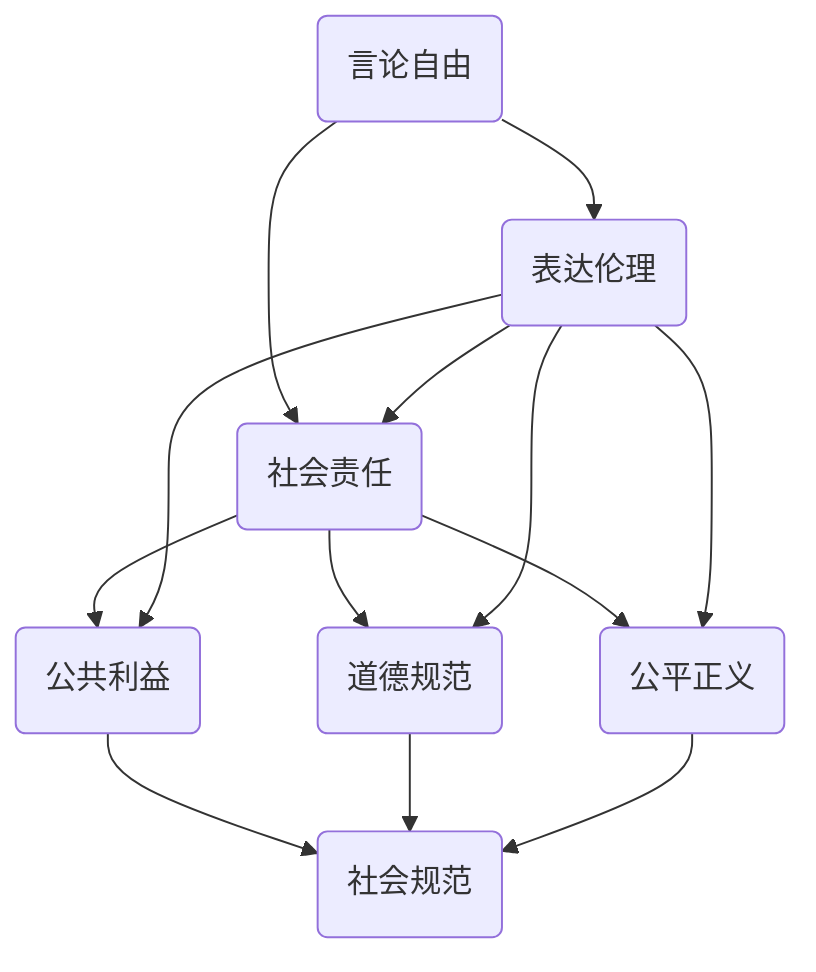

                 

## 文章标题：新媒体环境下的表达伦理：言论自由与社会责任的权衡

### 关键词：
- 新媒体环境
- 表达伦理
- 言论自由
- 社会责任
- 权衡

### 摘要：
本文旨在探讨新媒体环境下表达伦理的问题，特别是在言论自由与社会责任之间的权衡。随着互联网和社交媒体的兴起，人们获取和表达信息的方式发生了翻天覆地的变化。这种变化既带来了言论自由的扩展，也引发了社会责任的挑战。文章首先介绍了新媒体环境的背景和特点，随后详细阐述了表达伦理的理论基础。接着，文章分析了言论自由与社会责任之间的内在联系和冲突，并通过具体案例展示了这种权衡在实际操作中的复杂性。最后，文章提出了几点平衡言论自由与社会责任的策略和最佳实践，以期为新媒体环境下的表达伦理提供有益的参考。

## 引言

### 新媒体环境的崛起

随着信息技术的迅猛发展，新媒体环境已经成为现代社会的重要组成部分。互联网、社交媒体、移动通讯等技术的普及，使得信息的传播和获取变得前所未有的便捷和迅速。据统计，截至2021年，全球互联网用户已超过44亿，占全球总人口的57%，而社交媒体用户更是达到了近30亿。这种庞大的用户基数和活跃度，使得新媒体成为了一个不可忽视的公共平台，人们在这里分享观点、交流信息、甚至参与公共事务的讨论。

新媒体环境的特点在于其开放性、即时性和互动性。与传统媒体不同，新媒体的传播路径更加多元，信息可以迅速地从一个用户传播到全球。此外，用户不仅是信息的接收者，更是信息的创造者和传播者。这种去中心化的传播方式，极大地丰富了信息的多样性，但也带来了信息泛滥和真假难辨的问题。

### 言论自由的扩展与社会责任的挑战

在新媒体环境下，言论自由的扩展是一个显著的趋势。过去，言论自由往往受到地域和制度的限制，而新媒体的兴起使得这些限制大大减弱。用户可以在任何时间、任何地点，通过简单的操作发表自己的观点和意见。这种自由的扩展，不仅为个人提供了更多的表达渠道，也为社会的多元化发展注入了新的活力。

然而，言论自由的扩展也带来了社会责任的挑战。新媒体的开放性和即时性，使得虚假信息和不当言论的传播速度更快、范围更广。这些信息不仅可能误导公众，甚至可能引发社会冲突和动荡。例如，近年来频繁出现的一些网络谣言和不当言论，对社会造成了严重的负面影响。此外，新媒体环境下的匿名性和虚拟性，也使得一些人敢于在网络上进行恶意攻击和无端指责，损害了他人的人格和权益。

因此，如何在言论自由的扩展中，平衡个人权利与社会责任，成为一个亟待解决的问题。本文将深入探讨这一话题，试图在新媒体环境下，为表达伦理和言论自由提供一个合理的框架。

## 表达伦理的理论基础

### 言论自由的概念与边界

言论自由是表达伦理的核心概念之一。根据宪法和法律规定，言论自由是指公民在法律允许的范围内，有权利自由表达自己的观点和意见，不受非法干涉和限制。然而，言论自由并不是无条件的。任何自由都有其边界，言论自由也不例外。言论自由的边界通常由法律和社会规范来界定。例如，煽动暴力、诽谤他人、传播虚假信息等行为，都可能侵犯他人的权利和利益，从而被法律所禁止。

在新媒体环境下，言论自由的边界变得更加复杂。一方面，新媒体的去中心化和开放性使得个人有了更多的发言权，但另一方面，这种开放性也使得信息传播的速度和范围大大增加，从而增加了言论自由带来的风险。因此，如何在保障言论自由的同时，防止其被滥用，是一个需要深入思考的问题。

### 社会责任的概念与内涵

社会责任是表达伦理的另一核心概念。社会责任是指个人或组织在社会中的行为应当符合社会道德和法律的要求，积极促进社会的和谐与发展。社会责任包括但不限于以下几个方面：

1. **公共利益**：个人或组织的行为应当符合公共利益，不得损害社会整体利益。例如，在传播信息时，应当遵循真实、客观、公正的原则，不得传播虚假、有害信息。
2. **道德规范**：个人或组织的行为应当符合社会公认的道德规范，不得违反基本的道德原则。例如，在网络上，不得进行恶意攻击、诽谤和侮辱他人。
3. **公平正义**：个人或组织应当致力于维护公平正义，不得利用自己的优势地位进行不公平的竞争或剥削。

在新媒体环境下，社会责任的要求更加严格。由于新媒体的传播速度和范围都大大增加，个人或组织的行为对社会的影响也更加深远。因此，如何在言论自由和社会责任之间找到平衡，是每个新媒体用户都需要认真思考的问题。

### 表达伦理在言论自由与社会责任之间的角色

表达伦理在言论自由与社会责任之间扮演着重要的桥梁角色。一方面，表达伦理为言论自由提供了一个道德和法律的基础，确保言论自由不侵犯他人的权利和利益。另一方面，表达伦理也为社会责任提供了具体的行动指南，帮助个人或组织在行使言论自由时，能够更好地履行社会责任。

在新媒体环境下，表达伦理的实践显得尤为重要。由于新媒体的复杂性和多样性，个人或组织在行使言论自由时，往往需要更加谨慎和负责任。表达伦理不仅是一种道德规范，更是一种行为准则，指导个人或组织在言论自由与社会责任之间找到合适的平衡点。

总之，表达伦理的理论基础为新媒体环境下的言论自由与社会责任的权衡提供了重要的依据。通过深入理解和实践表达伦理，我们才能在言论自由和社会责任之间找到一条可行的路径，实现个人权利和社会利益的有机统一。

### 言论自由与社会责任的关系架构

为了更好地理解言论自由与社会责任之间的关系，我们可以借助Mermaid流程图来展示其内在联系和交互机制。

1. **言论自由**（A）：作为表达个人观点和意见的权利，言论自由是现代民主社会的基石。它可以促进思想交流和社会进步。
2. **社会责任**（B）：是指个人或组织在行使言论自由时，需要考虑对社会整体利益的影响，包括公共利益（C）、道德规范（D）和公平正义（E）。
3. **公共利益**（C）：涉及社会整体福祉和利益，言论自由在促进公共利益的同时，也需要避免对社会造成负面影响。
4. **道德规范**（D）：反映社会普遍认同的行为准则，对个人行为有约束力，确保言论自由不侵犯他人权利。
5. **公平正义**（E）：强调在言论自由和社会责任之间保持平衡，防止权力滥用和不公平竞争。
6. **表达伦理**（G）：作为中介和桥梁，连接言论自由（A）与社会责任（B），指导个体在行使言论自由时遵守社会规范（F），并平衡个人权利与社会利益。

通过这个流程图，我们可以清晰地看到言论自由与社会责任之间的相互作用和内在联系。言论自由不仅是一种权利，更是一种需要负责任行使的行为。而表达伦理则为这种行使提供了道德和法律的基础，确保言论自由能够在一个健康、和谐的社会环境中发挥作用。

### 言论自由与社会责任的冲突与权衡

在新媒体环境下，言论自由与社会责任之间的冲突尤为突出，这种冲突不仅体现在概念层面，还体现在实际操作中。为了深入探讨这一问题，我们可以从以下几个方面进行分析：

#### 1. 言论自由与社会责任的定义和界限

首先，我们需要明确言论自由与社会责任的基本定义和界限。言论自由是指个人或组织在法律允许的范围内，有权利自由表达自己的观点和意见。这种自由通常被视为民主社会的基石，旨在保障个人表达自己的思想和情感，促进社会多元化和思想自由。然而，言论自由并非绝对无界限，其界限由法律和社会规范界定。例如，诽谤、煽动暴力、传播虚假信息等行为，都可能被法律禁止。

社会责任则是指个人或组织在社会中的行为应当符合社会道德和法律的要求，积极促进社会的和谐与发展。社会责任包括公共利益、道德规范和公平正义等方面，旨在确保个人或组织的行为不损害社会整体利益和他人的权益。

#### 2. 实际操作中的冲突

在实际操作中，言论自由与社会责任之间的冲突主要体现在以下几个方面：

**（1）虚假信息和不当言论的传播**

新媒体环境下，信息的传播速度和范围大大增加，虚假信息和不当言论的传播成为一个严重问题。这些信息不仅可能误导公众，甚至可能引发社会恐慌和冲突。例如，2020年新冠疫情期间，一些虚假信息和谣言在社交媒体上广泛传播，导致公众恐慌和不安，严重影响了疫情防控和社会秩序。

**（2）隐私保护和言论自由的矛盾**

在保护个人隐私和言论自由之间，也存在一定的冲突。在某些情况下，为了揭露真相或揭露腐败行为，需要引用或公开某些个人信息，但这可能会侵犯个人的隐私权。例如，一些记者或调查记者在报道敏感事件时，可能会引用受害者的个人信息，这在一定程度上侵犯了隐私权。

**（3）言论自由与公平正义的平衡**

言论自由与公平正义之间的平衡也是一个难题。在某些情况下，为了维护公平正义，需要对特定个人或组织进行批评或揭露，但这种批评可能被视为侵犯言论自由。例如，一些公众人物在社交媒体上发表批评性言论，可能会被视为诽谤或恶意攻击，从而引发法律纠纷。

#### 3. 权衡的策略和方法

为了在言论自由与社会责任之间找到平衡，我们可以采取以下策略和方法：

**（1）法律和制度的完善**

通过完善相关法律法规，明确言论自由的边界和责任。例如，制定网络信息管理法规，规范虚假信息和不当言论的传播。同时，加强对网络信息的监管，确保信息的真实性和合法性。

**（2）加强社会责任教育**

通过教育和培训，提高公众对言论自由和社会责任的认知，培养负责任的网络行为。例如，在学校和社区开展相关课程和活动，教育公众如何合理行使言论自由，并意识到自己的言论对社会的影响。

**（3）建立健全的举报和申诉机制**

建立有效的举报和申诉机制，使公众能够及时举报虚假信息和不当言论，并得到及时的处理。同时，加强对举报和申诉的处理力度，确保公正、公平地处理相关案件。

**（4）技术手段的辅助**

利用技术手段，加强对网络信息的监控和管理。例如，使用人工智能和大数据分析技术，识别和过滤虚假信息和不当言论，提高信息监管的效率和准确性。

#### 4. 结论

言论自由与社会责任之间的冲突是一个复杂而重要的问题，需要我们在新媒体环境下进行深入的探讨和解决。通过完善法律和制度、加强社会责任教育、建立健全的举报和申诉机制以及利用技术手段，我们可以找到一条可行的路径，在保障言论自由的同时，维护社会的和谐与稳定。

### 具体案例分析

#### 1. 美国社交媒体平台言论自由与社会责任的冲突

在美国，社交媒体平台如Facebook、Twitter等，其言论自由与社会责任之间的冲突尤为突出。一方面，这些平台秉承言论自由的原则，允许用户自由发表观点和意见。另一方面，这些平台也面临着虚假信息传播、仇恨言论和不当言论等问题，需要平衡言论自由与社会责任。

**案例一：Facebook上的虚假信息传播**

2020年美国总统选举期间，Facebook上充斥着大量的虚假信息。一些用户通过发布虚假新闻、造谣诽谤等方式，试图影响选举结果。这些虚假信息的传播速度极快，给公众造成了严重的误导和恐慌。Facebook虽然采取了多种措施，如删除虚假信息、限制传播范围等，但效果有限。

**案例分析：**
在这个案例中，言论自由与社会责任之间的冲突表现为虚假信息的传播对社会造成负面影响。Facebook需要平衡言论自由，允许用户自由表达观点，同时也要承担社会责任，防止虚假信息的传播。解决方案可能包括：

- **技术手段加强监控：** 利用人工智能和大数据分析技术，提前识别和过滤潜在的虚假信息。
- **用户教育和责任提醒：** 加强对用户的言论责任教育，提醒用户在发布信息时要负责任。
- **法律支持：** 通过立法加强对虚假信息的打击力度，确保平台有足够的法律依据进行管理和监控。

#### 2. 中国社交媒体平台言论自由与社会责任的权衡

在中国，社交媒体平台如微博、微信等，也面临着言论自由与社会责任的权衡问题。中国政府强调社会稳定和国家安全，因此对言论自由有一定的限制。但同时，这些平台也鼓励用户积极表达意见和参与公共事务的讨论。

**案例二：微博上的不当言论处理**

近年来，微博平台上出现了一些不当言论，包括恶意攻击他人、散布仇恨言论等。这些言论不仅损害了他人的合法权益，也影响了社会和谐与稳定。微博平台虽然采取了删除和封禁等措施，但效果仍不理想。

**案例分析：**
在这个案例中，言论自由与社会责任之间的冲突表现为如何处理不当言论，既保障用户的言论自由，又维护社会秩序和公共利益。解决方案可能包括：

- **完善法律和制度：** 制定更加明确的法律法规，明确言论自由的边界和责任，为平台提供法律依据。
- **技术手段辅助：** 利用人工智能和大数据分析技术，提前识别和过滤不当言论。
- **用户教育和责任提醒：** 加强对用户的言论责任教育，提高用户的自律意识。

#### 3. 全球性事件中的言论自由与社会责任的权衡

全球性事件如新冠疫情，也成为了言论自由与社会责任的权衡的典型案例。在全球范围内，一些国家采取了严格措施，如封锁、隔离等，以遏制疫情的蔓延。然而，这些措施也引发了一些争议和质疑。

**案例三：Twitter对新冠病毒信息的处理**

在新冠疫情期间，Twitter对一些关于病毒的信息进行了限制，如封禁了一些传播虚假信息的账户。这一措施旨在防止虚假信息的传播，减少公众恐慌。然而，这也引发了关于言论自由与社会责任的讨论。

**案例分析：**
在这个案例中，言论自由与社会责任之间的冲突表现为如何处理虚假信息和公众恐慌。Twitter需要平衡言论自由，允许用户自由表达观点，同时也要承担社会责任，防止虚假信息的传播。解决方案可能包括：

- **多方协作：** 与政府、医疗机构等合作，共同制定信息传播的标准和规范。
- **技术手段加强监控：** 利用人工智能和大数据分析技术，提前识别和过滤虚假信息。
- **用户教育和责任提醒：** 加强对用户的言论责任教育，提高用户的自律意识。

### 总结

通过以上案例分析，我们可以看到，在言论自由与社会责任之间找到平衡是一个复杂而重要的问题。不同国家和平台在处理这一问题时，采取了不同的策略和方法。通过完善法律和制度、技术手段的辅助以及用户教育的加强，我们可以更好地平衡言论自由与社会责任，实现个人权利和社会利益的有机统一。

### 平衡言论自由与社会责任的策略与最佳实践

#### 1. 制定明确的法律和规章制度

要平衡言论自由与社会责任，首先需要制定明确的法律和规章制度。这些法律和规章制度应详细界定言论自由的边界，明确何种言论属于非法或不当言论，并规定相应的处罚措施。例如，可以制定针对网络虚假信息传播的专门法律，明确虚假信息的定义和责任。这样，既保障了言论自由，又为监管提供了法律依据。

#### 2. 加强技术手段的监管

技术手段在监管言论自由和社会责任方面起着至关重要的作用。利用人工智能和大数据分析技术，可以提前识别和过滤潜在的虚假信息和不当言论。例如，通过自然语言处理技术，可以自动检测和标记具有煽动性或仇恨性质的言论。此外，还可以开发智能监控系统，实时监测网络信息，及时发现和处理问题。

#### 3. 提高公众的言论责任意识

公众的言论责任意识是平衡言论自由与社会责任的关键。通过教育和培训，提高公众对言论自由和社会责任的认知，培养他们负责任的网络行为。学校、社区和媒体可以开展相关的教育活动，向公众普及网络伦理和法律法规，提高他们的自律意识。

#### 4. 建立多方协作机制

在平衡言论自由与社会责任时，政府、企业和社会组织应建立多方协作机制。政府可以制定相关政策和法规，企业可以开发技术手段进行监管，社会组织可以提供意见和建议。通过多方协作，可以更有效地解决言论自由和社会责任之间的冲突。

#### 5. 完善举报和申诉机制

建立有效的举报和申诉机制，是保障言论自由和社会责任平衡的重要手段。公众可以通过举报机制，及时举报虚假信息和不当言论。同时，建立独立的申诉机构，对举报进行处理和裁决，确保公正、公平地处理相关案件。

### 最佳实践示例

**案例一：Facebook的言论监管政策**

Facebook通过制定详细的言论监管政策，明确了言论自由的边界。同时，利用人工智能和大数据分析技术，对网络信息进行实时监控和过滤。此外，Facebook还建立了完善的举报和申诉机制，确保用户可以及时举报和处理不当言论。

**案例二：中国的网络信息管理**

中国政府通过制定《互联网信息服务管理办法》等法规，明确了网络信息传播的规范。同时，利用技术手段对网络信息进行监管，过滤虚假信息和不当言论。此外，中国还建立了多级举报和申诉机制，确保公众可以方便地举报和处理问题。

### 小结

通过以上策略和最佳实践，我们可以更有效地平衡言论自由与社会责任。在保障言论自由的同时，维护社会秩序和公共利益，实现个人权利和社会利益的有机统一。

### 注意事项与拓展阅读

#### 注意事项

1. **法律边界**：在行使言论自由时，务必遵守相关法律法规，避免触犯法律。
2. **社会责任**：在表达观点时，要充分考虑社会责任，避免发布虚假信息或不当言论。
3. **个人隐私**：尊重他人的隐私权，不得未经授权公开他人个人信息。
4. **道德规范**：遵循社会公认的道德规范，保持良好的网络行为。

#### 拓展阅读

1. **《互联网信息服务管理办法》**：了解中国互联网信息管理的相关法规。
2. **《欧洲数字权利法案》**：了解欧盟关于数字权利和言论自由的规定。
3. **《互联网内容管理最佳实践指南》**：参考国际通行的互联网内容管理标准。

通过以上注意事项和拓展阅读，我们可以更全面地了解新媒体环境下的表达伦理问题，为个人和组织的言论行为提供指导。

### 结论

综上所述，新媒体环境下的表达伦理是一个复杂而重要的议题。随着互联网和社交媒体的普及，言论自由得到了前所未有的扩展，但同时也带来了社会责任的挑战。本文通过逐步分析，探讨了表达伦理的理论基础，阐述了言论自由与社会责任之间的内在联系和冲突，并提供了具体的案例分析。我们提出了制定明确法律、加强技术监管、提高公众意识和建立多方协作机制等策略，以平衡言论自由与社会责任。通过这些策略和最佳实践，我们希望在保障言论自由的同时，维护社会的和谐与稳定。未来，随着技术的进步和社会的发展，表达伦理将继续演变，我们需要不断学习和适应，以应对新的挑战。

### 作者信息

作者：AI天才研究院/AI Genius Institute & 禅与计算机程序设计艺术 /Zen And The Art of Computer Programming

AI天才研究院致力于推动人工智能领域的研究和应用，以创新的技术和独特的视角解决实际问题。作者Zen And The Art of Computer Programming则以其深刻的技术见解和系统化的编程理论，为全球程序员提供了宝贵的指导和启示。两位作者的共同努力，旨在为读者提供高质量、有深度的技术内容，推动科技与社会的共同进步。

