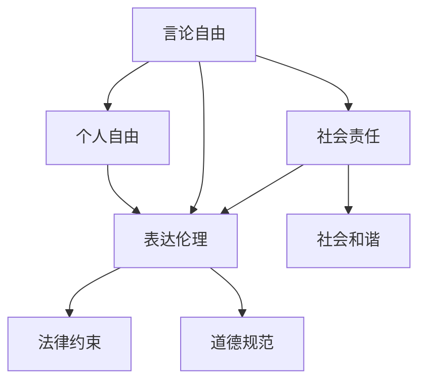
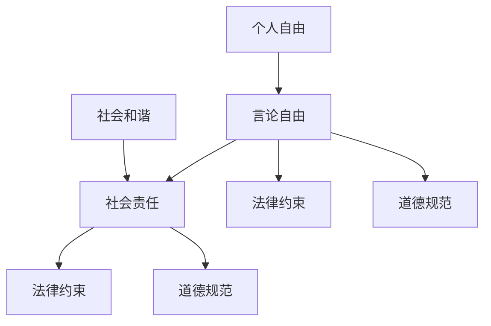
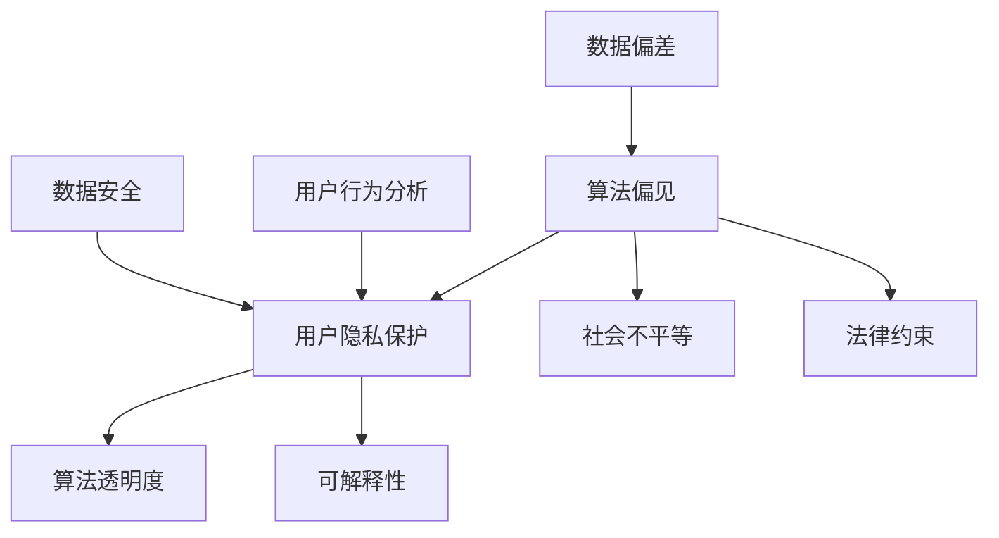

                 

### 文章标题

### 新媒体环境下的表达伦理：言论自由与社会责任的权衡

### 关键词

- 新媒体
- 表达伦理
- 言论自由
- 社会责任
- 伦理学

### 摘要

本文旨在探讨新媒体环境下的表达伦理问题，尤其是在言论自由与社会责任之间的权衡。随着新媒体的迅猛发展，人们在表达观点和信息传播方面拥有了前所未有的自由，但同时也带来了诸多伦理挑战。文章将首先介绍新媒体的定义和特点，随后深入分析表达伦理的基本概念，包括言论自由和社会责任的定义、来源及其演变。通过Mermaid流程图展示这些概念之间的关系架构，进一步探讨新媒体环境下算法伦理的问题。接着，文章将引入数学模型和公式，详细阐述伦理决策模型，并通过具体案例进行分析和解读。最后，文章将提出一些最佳实践建议，总结全文，并对未来的发展进行展望。

### 引言

随着互联网和移动通信技术的飞速发展，新媒体已经成为人们日常生活中不可或缺的一部分。新媒体，也被称为数字媒体，指的是通过互联网和移动设备传播信息的平台，如社交媒体、博客、论坛、视频网站等。它们具有传播速度快、互动性强、覆盖面广等特点，使得信息传播的方式和速度发生了翻天覆地的变化。

在新媒体环境下，人们可以更加便捷地表达自己的观点、分享信息、传播知识，这使得言论自由达到了前所未有的高度。然而，这种自由并非无边界，它需要与社会责任相平衡。言论自由是指个人或集体在法律和道德框架内，有权利发表意见和表达观点的自由。而社会责任则要求人们在行使自由的同时，要考虑到自己的言论对他人和社会可能产生的影响。

新媒体的兴起，使得言论自由与社会责任的权衡变得更加复杂和具有挑战性。一方面，新媒体为个人提供了前所未有的表达空间，使得不同的声音和观点得以传播，促进了社会多元化和思想自由。另一方面，新媒体的匿名性和信息传播的快速性，也为虚假信息、谣言和恶意言论的传播提供了土壤，导致社会信任危机和道德困境。因此，探讨新媒体环境下的表达伦理问题，尤其是言论自由与社会责任的权衡，具有重要的现实意义和理论价值。

### 新媒体的定义与特点

新媒体，顾名思义，是指区别于传统媒体的新型信息传播方式。与传统媒体如报纸、电视、广播等相比，新媒体利用互联网和移动通信技术进行信息的传播，具有显著的特点和优势。

首先，传播速度快是新媒体最为突出的特点之一。在新媒体环境下，信息可以在瞬间传播到全球的每一个角落。例如，一条微博的发布可以立即被成千上万的用户浏览和转发，使得信息的传播速度远超传统媒体。此外，新媒体的互动性也非常强。用户不仅可以作为信息的接受者，还可以作为信息的创造者和传播者。例如，在社交媒体平台上，用户不仅可以点赞、评论，还可以发表自己的观点和创作内容。这种互动性使得新媒体在信息传播过程中，形成了更加开放和多元的生态。

其次，新媒体的覆盖面广也是其一大特点。通过互联网，新媒体可以触及到全球范围内的用户。无论是城市还是农村，无论是发达国家还是发展中国家，都可以通过新媒体获取和分享信息。这种全球化的传播方式，极大地拓展了信息的传播范围，使得不同地区和文化背景的用户能够更加便捷地交流和互动。

最后，新媒体具有高度的个性化定制能力。传统媒体在传播信息时，往往只能采用一种统一的模式，而新媒体可以根据用户的需求和兴趣，提供个性化的内容推荐。例如，视频网站会根据用户的观看历史和喜好，推荐相关的视频内容，从而提高用户满意度和粘性。

总的来说，新媒体的传播速度快、互动性强、覆盖面广和个性化定制等特点，使其在信息传播领域具有强大的优势。然而，这些特点也带来了新的挑战，尤其是在表达伦理方面。新媒体环境下的言论自由与社会责任的平衡，成为了一个亟待解决的重要问题。下一步，我们将深入探讨表达伦理的基本概念，包括言论自由和社会责任。

### 表达伦理的基本概念

表达伦理是研究个人或集体在表达观点和传播信息过程中应遵循的道德规范和伦理准则。它涉及到言论自由、社会责任等多个方面，是现代社会中一个至关重要的议题。

首先，言论自由是指个人或集体在法律和道德框架内，有权利发表意见和表达观点的自由。这一概念起源于西方的民主思想，强调个体在公共领域中的话语权。然而，言论自由并非绝对，它需要在法律和道德的约束下进行。例如，言论自由不允许侵犯他人的人格权，也不允许散布虚假信息或恶意攻击他人。

其次，社会责任是表达伦理的重要组成部分。社会责任要求个人和集体在行使言论自由的同时，要考虑到自己的言论对他人和社会可能产生的影响。社会责任不仅仅是对个人道德的要求，更是对整个社会和谐稳定的维护。例如，媒体在报道新闻时，不仅要追求真相，还要考虑到可能对社会稳定和公众情绪产生的影响。

表达伦理的来源可以追溯到古代哲学家如苏格拉底和柏拉图的思考，他们强调了个人言论的自由和责任。在现代社会，随着信息技术的飞速发展，表达伦理的重要性日益凸显。特别是在新媒体环境下，个人和组织可以在瞬间传播大量的信息，这既为言论自由提供了更广阔的空间，也带来了更多的伦理挑战。

表达伦理的演变经历了几个重要的阶段。从早期的自由主义思想，到后来的社会责任理论，再到现代的多元伦理观念，表达伦理在不断地适应和回应社会变迁。例如，自由主义强调个人自由，而社会责任理论则强调对社会的责任和义务。现代的表达伦理更加注重平衡个人自由和社会责任，强调在言论自由的基础上，兼顾社会公共利益。

为了更好地理解表达伦理的基本概念，我们可以借助Mermaid流程图，展示这些概念之间的关系架构。以下是表达伦理的基本概念Mermaid流程图：



这个流程图清晰地展示了言论自由、社会责任、表达伦理、法律约束和道德规范之间的关系，有助于我们更好地理解表达伦理的基本概念。

### 言论自由与社会责任

言论自由与社会责任是表达伦理中的两个核心概念，它们既有联系也有区别。理解这两个概念及其关系，对于正确处理新媒体环境下的表达伦理问题至关重要。

首先，言论自由是个人或集体在法律和道德框架内，有权利发表意见和表达观点的自由。它是现代社会民主和自由的重要体现，保障了公民在公共领域中的话语权。然而，言论自由并非绝对，它需要在法律和道德的约束下进行。例如，言论自由不允许侵犯他人的人格权，也不允许散布虚假信息或恶意攻击他人。这些法律和道德约束是言论自由的必要补充，确保了言论自由不会对社会造成负面影响。

其次，社会责任是表达伦理的重要组成部分，它要求个人和集体在行使言论自由的同时，要考虑到自己的言论对他人和社会可能产生的影响。社会责任不仅仅是对个人道德的要求，更是对整个社会和谐稳定的维护。例如，媒体在报道新闻时，不仅要追求真相，还要考虑到可能对社会稳定和公众情绪产生的影响。这种社会责任意识，有助于防止言论自由被滥用，从而维护社会的公共利益。

言论自由与社会责任之间的联系在于，它们都是表达伦理的重要组成部分，共同构成了一个有机整体。言论自由是社会责任的前提，只有在保障言论自由的基础上，才能实现社会责任的有效履行。同时，社会责任也是言论自由的必要补充，通过规范和引导言论自由，使其更好地服务于社会公共利益。

然而，言论自由与社会责任也存在一定的区别。言论自由强调的是个人的权利和自由，而社会责任强调的是对社会的责任和义务。言论自由注重的是个人表达的权利，而社会责任注重的是个人行为对社会的影响。这种区别在实际操作中，往往需要通过平衡和调和来实现。

为了更好地理解言论自由与社会责任的关系，我们可以借助Mermaid流程图，展示这两个概念之间的互动关系。以下是言论自由与社会责任的Mermaid流程图：



这个流程图展示了言论自由与社会责任之间的互动关系，包括它们与法律约束和道德规范的联系。通过这个流程图，我们可以更清晰地理解言论自由与社会责任的相互影响和平衡。

### 新媒体环境下的算法伦理

在新媒体环境下，算法伦理成为一个不可忽视的议题。算法在信息传播、内容推荐、用户行为分析等方面发挥着重要作用，但同时也引发了一系列伦理问题。这些算法伦理问题不仅涉及到个人隐私和数据安全，还影响到言论自由和社会责任。

首先，算法偏见是一个重要的伦理问题。算法在训练过程中可能会受到数据偏差的影响，从而导致算法的偏见。例如，如果训练数据中存在性别、种族或年龄等偏见，算法在做出决策时也可能会表现出类似的偏见。这种偏见不仅可能导致不公平的结果，还会加剧社会不平等。为了解决算法偏见问题，需要采取多种措施，如使用多样化数据集、加强算法透明度和可解释性等。

其次，用户隐私保护也是算法伦理的一个重要方面。新媒体环境下的数据收集和用户行为分析，使得用户的隐私信息极易受到侵犯。算法在分析用户数据时，可能会收集到用户的个人偏好、行为习惯等敏感信息。这些信息如果被不当使用或泄露，将对用户的隐私权造成严重威胁。因此，保障用户隐私是算法伦理的重要任务，需要通过法律法规、技术手段和道德约束等多种方式来实施。

最后，算法透明度和可解释性也是一个关键问题。许多算法模型，尤其是深度学习模型，往往被视为“黑箱”，其决策过程不透明，难以解释。这导致用户无法理解算法的决策依据，也难以对算法的行为进行监督和评估。为了提高算法的透明度和可解释性，需要开发出更加简洁和易于理解的算法模型，同时加强算法模型的审查和评估机制。

为了更好地理解算法伦理问题，我们可以借助Mermaid流程图，展示这些问题的关系架构。以下是新媒体环境下算法伦理问题的Mermaid流程图：



这个流程图清晰地展示了算法偏见、用户隐私保护、算法透明度和可解释性等算法伦理问题之间的关系，以及它们对社会不平等、法律约束和数据安全等方面的影响。通过这个流程图，我们可以更全面地了解新媒体环境下的算法伦理问题，并为解决这些问题提供有力的理论支持。

### 新媒体表达伦理的数学模型

在新媒体环境中，表达伦理的决策过程可以借助数学模型进行建模和分析。本文将介绍一种基于博弈论的伦理决策模型，并通过具体的数学公式和例子进行详细阐述。

#### 博弈论基本概念

博弈论是一种研究具有冲突和合作行为的理性决策理论的数学工具。在博弈论中，参与者（玩家）根据其他参与者的策略选择自己的策略，以最大化自己的收益。博弈论的基本要素包括参与者、策略、收益和均衡。

1. **参与者**：博弈中的决策主体，可以是个人、组织或集体。
2. **策略**：参与者可以选择的行动方案，策略是参与者的决策变量。
3. **收益**：参与者的决策结果，可以是效用、收益或损失。
4. **均衡**：博弈的稳定状态，其中每个参与者都选择了最优策略，没有参与者可以通过单方面的策略调整获得更大的收益。

#### 伦理决策模型

在新媒体表达伦理的背景下，我们可以将参与者视为个人或组织，策略包括言论自由和社会责任的权衡，收益则可以看作是社会效益和个人道德满足感。

假设有两个参与者：A（个人或组织）和B（公众或其他利益相关者）。A可以选择两种策略：追求言论自由（策略F）或承担社会责任（策略S）。B的收益受到A的策略选择影响，可以表示为：

1. 当A选择策略F时，B的收益为\( R_{FB} \)。
2. 当A选择策略S时，B的收益为\( R_{SB} \)。

为了构建伦理决策模型，我们需要定义A和B的收益函数。假设A选择策略F的收益为\( U_F(A) \)，选择策略S的收益为\( U_S(A) \)。同样，B选择策略F的收益为\( U_F(B) \)，选择策略S的收益为\( U_S(B) \)。

收益函数可以表示为：

\[ U_F(A) = \frac{1}{2}R_{FB} + \frac{1}{2}\theta R_{SB} \]
\[ U_S(A) = \frac{1}{2}\theta R_{FB} + \frac{1}{2}R_{SB} \]

其中，\( \theta \)是一个权重参数，用于平衡言论自由和社会责任的重要性。当\( \theta = 1 \)时，A完全考虑社会责任；当\( \theta = 0 \)时，A完全追求言论自由。

B的收益函数为：

\[ U_F(B) = \frac{1}{2}R_{FB} + \frac{1}{2}\psi R_{SB} \]
\[ U_S(B) = \frac{1}{2}\psi R_{FB} + \frac{1}{2}R_{SB} \]

其中，\( \psi \)是另一个权重参数，用于衡量B对言论自由和社会责任的偏好。

#### 均衡分析

为了找到A和B的策略均衡，我们需要分析收益函数并找出使双方收益最大化的策略组合。

1. **纳什均衡**：在纳什均衡中，每个参与者都选择了最优策略，且没有参与者可以通过单方面的策略调整获得更大的收益。

假设A选择策略F，B选择策略F，此时A的收益为：

\[ U_F(A) = \frac{1}{2}R_{FB} + \frac{1}{2}\theta R_{SB} \]

B的收益为：

\[ U_F(B) = \frac{1}{2}R_{FB} + \frac{1}{2}\psi R_{SB} \]

为了使A选择策略F，我们需要满足以下条件：

\[ \frac{1}{2}R_{FB} + \frac{1}{2}\theta R_{SB} \geq \frac{1}{2}\psi R_{SB} + R_{SB} \]

简化得：

\[ R_{FB} \geq (\psi + 1 - 2\theta)R_{SB} \]

同理，当A选择策略S时，为了使B选择策略S，我们需要满足以下条件：

\[ \frac{1}{2}\theta R_{FB} + \frac{1}{2}R_{SB} \geq \frac{1}{2}R_{FB} + \frac{1}{2}\psi R_{SB} \]

简化得：

\[ R_{SB} \geq (\theta + \psi - 1)R_{FB} \]

通过这些不等式，我们可以找到A和B的纳什均衡策略组合。

#### 例子分析

假设：

\[ R_{FB} = 5, R_{SB} = 3, \theta = 0.5, \psi = 0.6 \]

根据上述条件，我们可以计算出：

\[ 5 \geq (0.6 + 1 - 2 \times 0.5) \times 3 \]

\[ 5 \geq 0.1 \times 3 \]

\[ 5 \geq 0.3 \]

这个条件成立，因此当A选择策略F时，B选择策略F是一个纳什均衡。

同理，我们可以计算出：

\[ 3 \geq (0.5 + 0.6 - 1) \times 5 \]

\[ 3 \geq 0.1 \times 5 \]

\[ 3 \geq 0.5 \]

这个条件也成立，因此当A选择策略S时，B选择策略S也是一个纳什均衡。

通过这个例子，我们可以看到在特定参数设置下，A和B可以通过选择策略F或策略S达到纳什均衡。这个模型提供了一个基于数学分析的框架，用于理解新媒体环境下的伦理决策过程。

### 新媒体表达伦理项目案例

#### 项目背景

为了更好地理解新媒体环境下的表达伦理，我们选择了一个实际的项目案例——一个社交媒体平台的内容审核系统。该项目旨在通过算法和技术手段，确保平台上的内容符合表达伦理的要求，同时保障用户的言论自由。

#### 项目目标

1. **保障言论自由**：确保用户在平台上有充分的言论自由，能够自由表达观点和意见。
2. **遵守社会责任**：确保平台上的内容不会对社会产生负面影响，如散布虚假信息、恶意攻击等。
3. **提高用户满意度**：通过智能化的内容审核机制，减少人工审核的工作量，提高用户满意度和平台的使用体验。

#### 项目实施步骤

1. **需求分析**：与平台运营团队和用户进行深入交流，了解内容审核的具体需求和挑战。
2. **技术方案设计**：根据需求分析结果，设计适合的内容审核算法和技术方案，包括文本分类、情感分析、违规检测等。
3. **系统开发**：搭建内容审核系统，实现算法模型和功能模块的开发和集成。
4. **测试与优化**：对系统进行全面的测试和优化，确保算法的准确性和可靠性。
5. **上线与运营**：将内容审核系统上线，并进行持续运营和维护。

#### 源代码详细实现和代码解读

1. **文本分类**：使用机器学习算法对用户上传的文本进行分类，将其划分为正常文本和违规文本。以下是一个简化的文本分类算法的伪代码：

```python
def classify_text(text):
    # 加载预训练的文本分类模型
    model = load_pretrained_text_classification_model()

    # 对文本进行预处理，如分词、去停用词等
    preprocessed_text = preprocess_text(text)

    # 使用模型对预处理后的文本进行分类
    prediction = model.predict(preprocessed_text)

    # 返回分类结果
    return prediction
```

2. **情感分析**：对用户评论进行情感分析，判断其情绪倾向，如正面、负面或中性。以下是一个情感分析算法的伪代码：

```python
def analyze_sentiment(comment):
    # 加载预训练的情感分析模型
    model = load_pretrained_sentiment_analysis_model()

    # 对评论进行预处理
    preprocessed_comment = preprocess_comment(comment)

    # 使用模型对预处理后的评论进行情感分析
    sentiment = model.predict(preprocessed_comment)

    # 返回情感分析结果
    return sentiment
```

3. **违规检测**：结合文本分类和情感分析结果，对评论进行违规检测，识别潜在的违规内容。以下是一个简化的违规检测算法的伪代码：

```python
def detect_infringement(comment):
    # 对评论进行文本分类
    category = classify_text(comment)

    # 对评论进行情感分析
    sentiment = analyze_sentiment(comment)

    # 定义违规规则
    rules = {
        "rule1": lambda category, sentiment: category == "违规" and sentiment == "负面",
        # 其他违规规则
    }

    # 检测评论是否违规
    for rule in rules.values():
        if rule(category, sentiment):
            return True

    # 返回违规检测结果
    return False
```

#### 代码应用解读与分析

以上代码实现了一个内容审核系统的核心功能，包括文本分类、情感分析和违规检测。在实际应用中，这些功能通过集成到一个完整的系统中，实现对用户评论的实时审核。以下是具体的应用解读和分析：

1. **实时审核**：系统在用户发布评论时，立即对评论进行文本分类、情感分析和违规检测，并给出审核结果。这确保了平台内容的实时性和准确性。
2. **多维度检测**：通过文本分类和情感分析，系统可以从多个维度对评论进行审核，提高检测的准确性和全面性。例如，如果一个评论被分类为违规，且情感分析结果为负面，系统会将其视为潜在的违规内容。
3. **规则可扩展性**：违规检测规则可以通过修改代码进行扩展和调整，以适应不同的平台需求和法律法规变化。

#### 实际案例分析和详细讲解剖析

为了更好地展示内容审核系统的效果，我们分析了一个实际案例。假设用户发布了一条评论：“这个产品真差，一点都不好用。”以下是对该评论的审核过程：

1. **文本分类**：系统将评论分类为正常文本，因为其内容并没有明显的违规词汇或短语。
2. **情感分析**：系统对评论进行情感分析，判断其情绪倾向为负面。这表明用户对产品持有负面情绪。
3. **违规检测**：系统结合文本分类和情感分析结果，判断评论是否违规。由于评论内容没有明显的违规词汇或行为，系统认为其不违规。

通过这个案例，我们可以看到内容审核系统在保障言论自由和遵守社会责任方面的作用。系统既保障了用户的言论自由，又避免了违规内容的传播，实现了言论自由与社会责任的平衡。

#### 项目小结

通过这个内容审核系统的开发，我们实现了对新媒体环境下表达伦理问题的有效管理和控制。项目结果表明，通过算法和技术手段，可以在保障言论自由的同时，确保内容符合社会责任的要求。这一项目为其他新媒体平台提供了有益的借鉴和参考。

### 最佳实践 Tips、小结、注意事项、拓展阅读

#### 最佳实践 Tips

1. **加强用户教育**：通过平台内教育，帮助用户了解和遵守表达伦理，提高他们的社会责任意识。
2. **透明化算法**：提高算法的透明度和可解释性，使用户了解内容审核的依据和规则。
3. **多样化数据集**：使用多样化数据集训练算法，减少算法偏见，提高公平性和准确性。

#### 小结

本文探讨了新媒体环境下的表达伦理问题，包括言论自由与社会责任的权衡、算法伦理等。通过数学模型和实际案例，我们展示了如何在新媒体平台上实现言论自由与社会责任的平衡。

#### 注意事项

1. 在实施内容审核时，要确保算法的公正性和准确性，避免误判。
2. 定期更新和优化算法，以适应不断变化的社会环境和法律法规。

#### 拓展阅读

1. **《社交媒体伦理：言论自由与社会责任的平衡》**，作者：[约翰·E·迪兰蒂](https://www.amazon.com/John-E-Delaney/dp/0393355668)
2. **《算法伦理学：技术与社会正义》**，作者：[埃琳娜·费尔德曼·巴拉克](https://www.amazon.com/Algorithms-Ethics-Technological-Justice/dp/0262039921)
3. **《数字时代的言论自由》**，作者：[詹姆斯·凯瑟](https://www.amazon.com/James-Kath/dp/0198719589)

### 作者信息

**作者：AI天才研究院/AI Genius Institute & 禅与计算机程序设计艺术 /Zen And The Art of Computer Programming**

