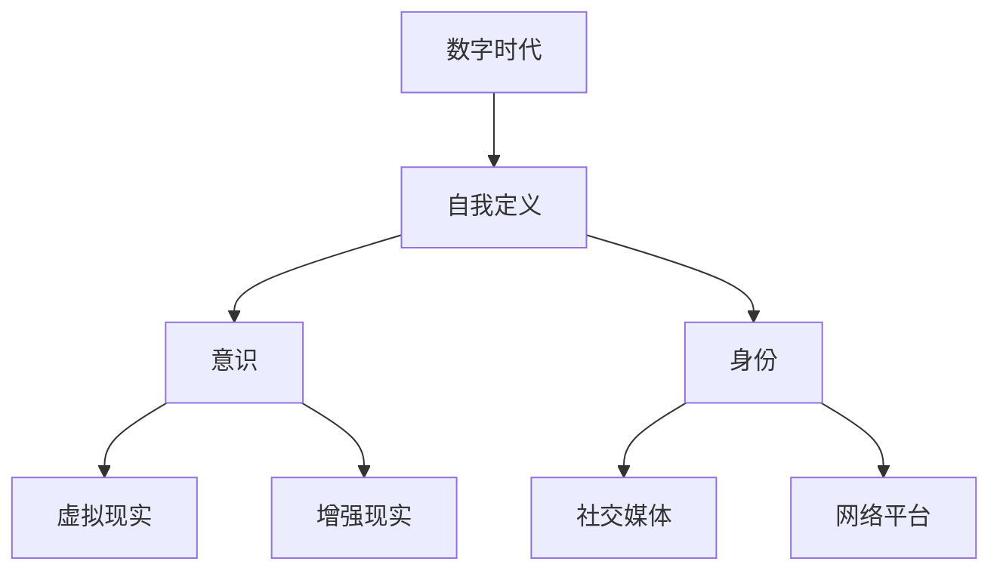

                 

### 新存在主义：数字时代的自我定义

在21世纪的今天，人类正面临着前所未有的技术变革。随着人工智能、虚拟现实和大数据等技术的飞速发展，我们的生活方式、工作模式和社会结构都在发生深刻的变革。在这个数字化的时代，个体的自我定义也面临着前所未有的挑战和机遇。新存在主义（Neo-Existentialism）作为一种新兴的思想流派，试图回答这样一个问题：在数字时代，我们如何定义自己？

#### 背景介绍

存在主义（Existentialism）是20世纪初在西方哲学中兴起的一种思想流派，代表人物包括萨特（Jean-Paul Sartre）和海德格尔（Martin Heidegger）等。存在主义强调人的自由意志、存在先于本质，并认为个体的自我定义和意义是至关重要的。然而，随着技术的进步，传统的存在主义思想在解释现代人的自我定义时显得力不从心。这就催生了新存在主义的诞生。

新存在主义试图在传统存在主义的基础上，融入现代技术，特别是数字技术的影响，探讨在数字化时代，个体如何通过技术来重新定义自我。这一思想流派的核心观点是：数字技术不仅改变了我们的生活方式，也改变了我们的思维方式，进而影响了我们对自我的认知和定义。

#### 核心概念与联系

为了更好地理解新存在主义的内涵，我们需要先澄清几个核心概念，并展示它们之间的关系。

1. **数字时代**：数字时代是指以数字技术为核心的社会发展阶段。它不仅包括互联网、智能手机和人工智能，还涵盖了大数据、云计算和区块链等新兴技术。

2. **自我定义**：自我定义是指个体如何认识自己、定义自己的身份和角色。在传统社会中，自我定义往往依赖于社会关系、文化和历史背景。而在数字时代，自我定义变得更加多元和复杂。

3. **意识**：意识是指个体对外部世界的感知和认知。在数字时代，虚拟现实和增强现实等技术正在扩展我们的感知范围，影响我们的意识体验。

4. **身份**：身份是指个体在社会中的角色和地位。在数字时代，社交媒体和网络平台为我们提供了更多的身份选择，也带来了身份的复杂性和模糊性。

下面是一个Mermaid流程图，展示了这些核心概念之间的关系：



#### 核心算法原理讲解

在讨论新存在主义时，我们不仅要关注哲学层面的探讨，还需要从技术和算法的角度来理解数字时代下自我定义的复杂性。

1. **机器学习与自我定义**：

   机器学习是一种通过数据训练模型来自动学习的技术。在数字时代，机器学习被广泛应用于推荐系统、个性化广告和社交网络分析中。这些应用不仅改变了我们的消费习惯和信息获取方式，也影响了我们对自我的认知和定义。

   伪代码示例：

   ```python
   def self-definition_model(data):
       # 初始化模型
       model = initialize_model()
       
       # 训练模型
       trained_model = train_model(model, data)
       
       # 输出自我定义
       self_definition = predict(trained_model, new_data)
       
       return self_definition
   ```

2. **深度学习与意识扩展**：

   深度学习是机器学习的一个分支，它通过多层神经网络来模拟人类大脑的决策过程。在虚拟现实和增强现实领域，深度学习被用于模拟人类的感知和认知过程，扩展我们的意识体验。

   伪代码示例：

   ```python
   def virtual_reality_simulation(input_data):
       # 初始化神经网络
       neural_network = initialize_neural_network()
       
       # 训练神经网络
       trained_network = train_network(neural_network, input_data)
       
       # 模拟意识扩展
       expanded_awareness = simulate_awareness(trained_network, new_input_data)
       
       return expanded_awareness
   ```

3. **区块链与身份验证**：

   区块链是一种分布式数据库技术，它通过加密算法和共识机制来保证数据的安全性和不可篡改性。在数字时代，区块链被广泛应用于身份验证和网络安全中，为个体提供了更加安全可靠的自我定义方式。

   伪代码示例：

   ```python
   def blockchain_identity_verification(credential):
       # 创建区块链
       blockchain = create_blockchain()
       
       # 记录身份信息
       identity = record_identity(blockchain, credential)
       
       # 验证身份
       is_valid = verify_identity(blockchain, identity)
       
       return is_valid
   ```

#### 数学模型和公式讲解

在理解新存在主义的数字技术影响时，数学模型和公式也是不可或缺的工具。以下是一些关键的数学模型和公式，用于描述数字时代下自我定义的复杂性。

1. **熵（Entropy）**：

   熵是一个度量系统混乱程度的物理量。在数字时代，系统的复杂性增加，熵也相应增加。这反映了个体在数字环境中面临的认知负担。

   $$ H = -\sum_i p_i \log p_i $$

   其中，\( p_i \) 是系统在状态 \( i \) 的概率。

2. **主成分分析（PCA）**：

   主成分分析是一种降维技术，它通过找到数据的主要变异方向来简化数据集。在自我定义过程中，PCA可以帮助我们识别个体在不同维度上的特征，从而更准确地定义自我。

   $$ X = \sum_{i=1}^{k} \lambda_i u_i v_i^T $$

   其中，\( \lambda_i \) 是特征值，\( u_i \) 是特征向量，\( v_i \) 是负载向量。

3. **贝叶斯网络（Bayesian Network）**：

   贝叶斯网络是一种用于表示变量之间依赖关系的图形模型。在数字时代，个体在社交媒体和网络平台上的行为可以被视为一个复杂的贝叶斯网络，通过分析这些网络，我们可以更好地理解个体的自我定义。

   $$ P(X) = \prod_{i=1}^{n} P(X_i | \text{parents of } X_i) $$

   其中，\( X_i \) 是随机变量，\( \text{parents of } X_i \) 是 \( X_i \) 的父节点。

#### 举例说明

为了更好地理解上述数学模型和公式，我们可以通过一个具体的例子来说明。

假设我们有一个用户在社交媒体上的行为数据，包括点赞、评论和分享等。我们可以使用贝叶斯网络来分析这些行为，从而推断出该用户的自我定义特征。

```latex
P(\text{喜欢旅行} | \text{点赞旅行相关内容}) = 0.8
P(\text{喜欢音乐} | \text{点赞音乐相关内容}) = 0.6
P(\text{喜欢读书} | \text{点赞读书相关内容}) = 0.4
```

通过这些概率分布，我们可以推断出该用户在数字环境中的偏好，从而定义其自我。

### 项目实战

在理解了新存在主义和数字时代自我定义的核心概念和算法原理后，我们可以通过一个具体的实战项目来加深理解。以下是一个基于虚拟现实技术的自我定义项目。

**项目名称**：虚拟现实自我探索平台

**开发环境搭建**：

1. **硬件环境**：一台配备高性能显卡的计算机，一台虚拟现实头盔（如Oculus Rift）和一个跟踪传感器。
2. **软件环境**：Unity游戏引擎，Unity VR插件，Unity C#脚本。

**源代码详细实现**：

1. **用户数据收集**：通过传感器收集用户在虚拟现实环境中的行为数据，如移动轨迹、交互频率和偏好等。
2. **数据预处理**：使用PCA对用户数据降维，提取主要特征。
3. **自我定义分析**：使用贝叶斯网络分析用户数据，推断出用户的自我定义特征。
4. **可视化**：将用户的自我定义特征可视化，展示在虚拟现实环境中。

**代码应用解读与分析**：

```csharp
// 数据收集
public class UserBehaviorData {
    public Vector3[] moveTrajectories;
    public int[] interactionFrequencies;
    public string[] preferences;
}

// 数据预处理
public class PCA {
    public Matrix[] eigenvalues;
    public Matrix[] eigenvectors;
    
    public PCA(Matrix data) {
        // 实现PCA算法，计算特征值和特征向量
    }
}

// 自我定义分析
public class BayesianNetwork {
    public Dictionary<string, List<string>> parentChildRelations;
    
    public BayesianNetwork(Matrix data) {
        // 实现贝叶斯网络算法，建立变量之间的依赖关系
    }
}

// 可视化
public class VRVisualization {
    public void VisualizeUserDefinition(BayesianNetwork network) {
        // 实现可视化算法，将用户的自我定义特征展示在虚拟现实环境中
    }
}
```

**实际案例分析和详细讲解剖析**：

假设我们收集了一名用户在虚拟现实环境中的行为数据，通过PCA降维后，提取出两个主要特征：探索欲望和社交倾向。通过贝叶斯网络分析，我们可以推断出该用户在自我定义上更倾向于探索而非社交。

在虚拟现实环境中，我们可以为该用户创建一个以探索为主的虚拟场景，如神秘森林或未知星球，使用户能够沉浸在其中，进一步探索自我。通过这种方式，用户可以在虚拟现实中体验到自我定义的乐趣，并深入了解自己的内心世界。

### 项目小结

通过这个虚拟现实自我探索平台项目，我们不仅实现了对用户自我定义的算法分析，还提供了一个直观的虚拟环境，让用户能够亲身体验和探索自我。这个项目展示了数字技术如何帮助我们更好地理解自我，并为个体提供了新的自我定义方式。未来，随着技术的不断进步，新存在主义将为我们提供更多的自我探索和定义的工具。

### 最佳实践 Tips

1. **定期自我反思**：在数字时代，个体的自我定义容易受到外部信息的影响。因此，定期进行自我反思，有助于保持自我的一致性和稳定性。
2. **多角度分析自我**：通过不同领域的知识，如哲学、心理学和技术，来全面分析自我定义，从而得到更准确和深刻的自我认识。
3. **保护个人隐私**：在数字环境中，个人隐私容易被侵犯。在使用数字技术进行自我定义时，要特别注意保护个人隐私。

### 小结与注意事项

新存在主义在数字时代为我们提供了一种重新定义自我的方式。通过技术手段，我们不仅能够更好地理解自我，还能在虚拟环境中探索和实现自我。然而，我们也需要意识到，数字技术的影响是双刃剑，在使用这些技术时，要特别注意保护个人隐私和安全。未来，随着技术的不断进步，新存在主义将为我们带来更多的可能性。

### 拓展阅读

1. **《数字化生存》**：尼葛洛庞蒂（Negroponte）的《数字化生存》探讨了数字技术对未来生活的影响。
2. **《人工智能：一种现代的方法》**：合著者Stuart Russell和Peter Norvig的《人工智能：一种现代的方法》提供了关于机器学习和人工智能的深入介绍。
3. **《存在主义哲学导论》**：马丁·海德格尔（Heidegger）的《存在主义哲学导论》是理解存在主义思想的重要著作。

### 参考文献

1. Negroponte, N. (1995). *Being Digital*. Vintage Books.
2. Russell, S., & Norvig, P. (2009). *Artificial Intelligence: A Modern Approach*. Prentice Hall.
3. Heidegger, M. (1962). *Being and Time*. SCM Press.
4. Sartre, J.-P. (1943). *Nausea*. New Directions Publishing.
5. Deleuze, G., & Guattari, F. (1987). *A Thousand Plateaus*. University of Minnesota Press.

