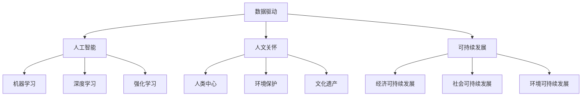

                 


### 背景介绍

新文艺复兴3.0：跨学科创新的时代，是一个融合了现代科技与人文关怀的新时代。它不仅是对过去文艺复兴时代的重新诠释，更是对当代社会所面临的挑战和机遇的深刻反思。传统文艺复兴发生在15世纪至17世纪的欧洲，以艺术和科学的大发展为特征，推动了人类文明的巨大进步。而新文艺复兴3.0则是在数字时代背景下，利用人工智能、大数据、生物技术等前沿科技手段，实现各学科领域的深度融合，推动社会全面进步。

新文艺复兴3.0的背景可以分为以下几个关键点：

1. **技术进步**：随着计算机科学和人工智能的飞速发展，人类已经进入了大数据时代。大数据技术为我们提供了前所未有的数据资源，使得数据驱动的决策成为可能。人工智能技术则让我们能够从海量数据中提取有价值的信息，实现自动化和智能化。

2. **跨学科融合**：现代社会面临的问题往往复杂多变，单一学科难以解决。跨学科创新强调不同领域的知识交叉和融合，通过多角度的思考，找到创新的解决方案。跨学科融合已成为推动科技进步和社会发展的重要动力。

3. **可持续发展**：全球气候变化、资源枯竭等环境问题日益严峻，可持续发展成为全球共识。新文艺复兴3.0强调在科技创新的同时，关注人文关怀和环境保护，实现经济、社会和环境的协调发展。

4. **全球合作**：面对全球性的挑战，各国需要加强合作，共同推动新文艺复兴3.0的进程。跨学科创新不仅需要国内各领域的协作，更需要国际间的交流与合作。

新文艺复兴3.0的目标是通过跨学科创新，推动社会各领域的深度融合，实现科技创新、文化繁荣和社会进步。以下是新文艺复兴3.0的核心概念与联系：

1. **数据驱动**：数据是新时代的石油，数据驱动成为新文艺复兴3.0的重要特征。通过数据收集、处理和分析，我们可以更加精准地了解社会现象，找到问题的根源，并提出有效的解决方案。

2. **人工智能**：人工智能是推动新文艺复兴3.0的重要引擎。人工智能技术不仅可以处理海量数据，还能通过深度学习和自我优化，实现自动化和智能化，为各领域提供强大的技术支持。

3. **人文关怀**：在追求科技进步的同时，新文艺复兴3.0强调人文关怀。人类是技术的创造者和使用者，技术的进步应当服务于人类的福祉，实现人与自然的和谐共生。

4. **可持续发展**：新文艺复兴3.0关注可持续发展，强调科技创新与环境保护的结合。通过绿色科技和可持续发展的理念，实现经济、社会和环境的协调发展。

### 核心概念与联系

在新文艺复兴3.0的时代，跨学科创新的核心概念可以概括为数据驱动、人工智能、人文关怀和可持续发展。这些概念相互关联，共同构成了新文艺复兴3.0的理论框架。下面，我们将详细探讨这些概念之间的关系，并通过Mermaid流程图展示其内在联系。

#### 数据驱动

数据驱动是新文艺复兴3.0的基础，它强调通过数据的收集、处理和分析，实现决策的科学化和精准化。数据驱动的核心在于数据的价值挖掘，即将大量的结构化和非结构化数据转化为有价值的信息，为各个领域提供数据支撑。

**数据收集**：数据收集是数据驱动的第一步，它涉及到数据的来源、采集方法和存储方式。随着传感器技术、物联网和移动设备的普及，数据收集变得越来越容易和高效。

**数据处理**：数据处理是对收集到的数据进行清洗、转换和整合的过程。通过数据处理，我们可以消除数据中的噪声和错误，提高数据的质量和一致性。

**数据分析**：数据分析是对处理后的数据进行深入挖掘，发现其中的规律和模式。数据分析可以采用统计方法、机器学习和深度学习等技术，以实现数据的价值最大化。

#### 人工智能

人工智能是新文艺复兴3.0的重要引擎，它通过模拟人类的认知能力，实现自动化和智能化。人工智能技术主要包括机器学习、深度学习和强化学习等。

**机器学习**：机器学习是一种让计算机通过数据学习模式和规律的方法。它可以通过训练模型，从数据中自动提取特征，并进行预测和分类。

**深度学习**：深度学习是机器学习的一个分支，它通过多层神经网络，实现更复杂的数据处理和模式识别。深度学习在图像识别、语音识别和自然语言处理等领域取得了显著的成果。

**强化学习**：强化学习是一种通过奖励机制，让计算机在学习过程中不断优化策略的方法。强化学习在游戏、自动驾驶和机器人控制等领域具有广泛的应用。

#### 人文关怀

人文关怀是新文艺复兴3.0的灵魂，它强调在追求科技进步的同时，关注人类的情感和福祉。人文关怀不仅体现在对人类的尊重和保护，还包括对环境保护和文化遗产的传承。

**人类中心**：人文关怀强调以人为中心，关注人的需求、情感和尊严。在人工智能和大数据的背景下，人文关怀要求我们在技术应用中充分考虑人的因素，确保技术的进步能够服务于人类的福祉。

**环境保护**：人文关怀还涉及到对环境的保护。随着全球环境问题的日益严重，新文艺复兴3.0强调在科技创新的同时，注重环境保护，实现可持续发展。

**文化遗产**：人文关怀还包括对文化遗产的传承和保护。在数字化时代，通过数字技术，我们可以更好地保存和传播文化遗产，让人类的历史和文化得到更广泛的传承。

#### 可持续发展

可持续发展是新文艺复兴3.0的重要目标，它强调在满足当前需求的同时，不损害后代满足其需求的能力。可持续发展涉及到经济、社会和环境三个方面的协调发展。

**经济可持续发展**：经济可持续发展要求我们在追求经济增长的同时，注重资源的合理利用和环境保护，确保经济的长期稳定和繁荣。

**社会可持续发展**：社会可持续发展强调在社会进步中，保障公平、公正和包容。通过教育、医疗、社会保障等公共服务，提高人民的生活质量和幸福感。

**环境可持续发展**：环境可持续发展要求我们在发展的过程中，注重环境保护和生态平衡。通过绿色科技和可再生能源的推广，实现人与自然的和谐共生。

下面是一个简单的Mermaid流程图，展示了新文艺复兴3.0的核心概念之间的联系：



通过这个流程图，我们可以清晰地看到新文艺复兴3.0的核心概念是如何相互联系和作用的。这些概念共同构成了新文艺复兴3.0的理论框架，为我们实现跨学科创新提供了有力的支持。

### 核心算法原理讲解

在跨学科创新的时代，核心算法原理的理解和应用至关重要。以下是关于核心算法原理的详细讲解，包括数据驱动的算法原理、人工智能的基本算法和跨学科创新中的算法应用。

#### 数据驱动的算法原理

数据驱动的算法原理是现代人工智能和数据分析的核心。其基本思想是通过收集和分析数据，从中提取有价值的信息和知识，从而指导决策和优化过程。

**数据收集**：数据收集是数据驱动算法的第一步。数据来源可以是各种传感器、数据库、网络爬虫等。数据收集的过程需要注意数据的质量和完整性，以保证后续分析的准确性。

**数据处理**：数据处理是对收集到的原始数据进行清洗、转换和整合的过程。这一步骤通常包括数据去重、缺失值处理、数据格式转换等。通过数据处理，我们可以提高数据的质量，使其更适合进行分析。

**数据分析**：数据分析是对处理后的数据进行深入挖掘，发现其中的规律和模式。数据分析可以采用统计方法、机器学习算法、深度学习算法等。通过数据分析，我们可以从数据中提取有价值的信息，用于决策支持、预测和优化。

**伪代码示例**：
```python
# 数据处理伪代码
def preprocess_data(data):
    # 去除重复数据
    data = remove_duplicates(data)
    # 填补缺失值
    data = fill_missing_values(data)
    # 数据格式转换
    data = convert_format(data)
    return data

# 数据分析伪代码
def analyze_data(data):
    # 统计分析
    statistics = perform_statistics(data)
    # 机器学习分析
    model = train_machine_learning_model(data)
    predictions = model.predict(data)
    return statistics, predictions
```

#### 人工智能的基本算法

人工智能的基本算法包括机器学习、深度学习和强化学习等。这些算法通过模拟人类的思维过程，实现自动化和智能化。

**机器学习**：机器学习是一种通过训练模型，从数据中自动提取特征和规律的方法。常见的机器学习算法包括线性回归、决策树、支持向量机、神经网络等。

**深度学习**：深度学习是机器学习的一个分支，通过多层神经网络，实现更复杂的数据处理和模式识别。深度学习在图像识别、语音识别和自然语言处理等领域取得了显著成果。

**强化学习**：强化学习是一种通过奖励机制，让计算机在学习过程中不断优化策略的方法。强化学习在游戏、自动驾驶和机器人控制等领域具有广泛的应用。

**伪代码示例**：
```python
# 机器学习伪代码
def train_machine_learning_model(data, labels):
    model = create_model()
    model.fit(data, labels)
    return model

# 深度学习伪代码
def train_deep_learning_model(data, labels):
    model = create_deep_learning_model()
    model.fit(data, labels)
    return model

# 强化学习伪代码
def train_reinforcement_learning_agent(environment):
    agent = create_agent()
    while not done:
        action = agent.act()
        reward = environment.step(action)
        agent.learn(reward)
    return agent
```

#### 跨学科创新中的算法应用

跨学科创新中的算法应用涵盖了多个领域，包括艺术与设计、社会科学和人文关怀等。以下是一些典型的算法应用案例：

**艺术与设计**：在艺术与设计中，算法可以用于生成艺术作品、设计图案和创意生成。例如，通过深度学习生成艺术作品，通过机器学习优化设计效果等。

**社会科学**：在社会科学领域，算法可以用于数据分析和预测，例如通过统计模型分析社会现象，通过机器学习预测社会发展趋势。

**人文关怀**：在人文关怀领域，算法可以用于情感分析、心理健康评估和文化遗产保护。例如，通过情感分析了解公众的情感变化，通过机器学习优化心理健康评估模型，通过深度学习保存和修复文化遗产。

**案例**：一个典型的跨学科创新案例是利用人工智能和生物技术保护濒危物种。通过收集和分析生物数据，使用机器学习算法预测物种的生存趋势，然后通过深度学习算法设计保护方案，实现物种的保护。

通过上述核心算法原理的讲解，我们可以看到数据驱动、人工智能和跨学科创新是如何相互融合，共同推动新文艺复兴3.0的进程。这些算法不仅为我们提供了强大的技术支持，还为我们探索未知世界和解决复杂问题提供了新的思路和方法。

### 数学模型与数学公式

在跨学科创新的时代，数学模型和数学公式的作用不可忽视。它们不仅是理解复杂系统的基础，也是解决实际问题的有力工具。以下是关于数学模型和数学公式的详细讲解，以及一些具体的例子。

#### 数学模型

数学模型是对现实世界中的复杂系统进行简化和抽象的数学表达式。这些模型通过数学公式来描述系统的行为，帮助我们理解和预测系统的动态。

**1. 抽象模型与具体模型**

- **抽象模型**：抽象模型是一种高度简化的数学模型，它将系统的关键特征提取出来，忽略次要因素。这种模型有助于我们抓住问题的本质，便于分析和理解。

- **具体模型**：具体模型则是对现实系统的更精确描述，它包含更多的细节和参数。这类模型适用于需要高精度分析的场合。

**2. 模型构建与优化**

- **模型构建**：构建数学模型的过程通常包括以下几个步骤：
  - 定义问题：明确需要解决的问题和目标。
  - 提取关键变量：确定影响系统行为的变量。
  - 建立关系：通过数学公式描述变量之间的关系。
  - 参数估计：通过实验或数据分析，估计模型中的参数值。

- **模型优化**：模型优化是通过调整模型参数，提高模型的预测精度和适用范围。常见的优化方法包括梯度下降、牛顿法、遗传算法等。

**3. 常用数学模型**

- **线性模型**：线性模型是最简单且应用广泛的数学模型之一，它通过线性方程描述变量之间的关系。常见的线性模型包括线性回归、线性规划等。

- **非线性模型**：非线性模型用于描述变量之间的非线性关系。例如，逻辑回归、决策树、神经网络等都是非线性模型。

#### 数学公式

数学公式是数学模型的核心组成部分，它们用简洁的符号和表达式来描述数学关系。以下是几个常见的数学公式及其应用。

**1. 微积分公式**

- **导数**：导数描述了函数在某一点处的瞬时变化率。常用的导数公式包括：
  $$ f'(x) = \lim_{{h \to 0}} \frac{{f(x+h) - f(x)}}{h} $$
  
- **积分**：积分用于计算函数在区间上的累积变化量。常用的积分公式包括：
  $$ \int_a^b f(x) dx = F(b) - F(a) $$
  其中，\( F(x) \) 是 \( f(x) \) 的一个原函数。

**2. 概率论公式**

- **概率分布**：概率分布描述了随机变量在某个区间内的概率。常见的概率分布包括正态分布、泊松分布等。

- **期望和方差**：期望描述了随机变量在长期内的平均取值，方差描述了随机变量取值的离散程度。常用的公式包括：
  $$ E[X] = \int_{-\infty}^{\infty} x f(x) dx $$
  $$ Var[X] = E[(X - E[X])^2] $$

**3. 线性代数公式**

- **矩阵运算**：矩阵运算包括矩阵的加法、减法、乘法等。常见的矩阵运算公式包括：
  $$ A + B = C $$
  $$ AB = C $$

- **特征值和特征向量**：特征值和特征向量是矩阵的重要属性，它们描述了矩阵在变换中的作用。常用的公式包括：
  $$ A\vec{v} = \lambda \vec{v} $$
  其中，\( A \) 是矩阵，\( \vec{v} \) 是特征向量，\( \lambda \) 是特征值。

#### 举例说明

**1. 线性回归模型**

线性回归模型是一种常见的数学模型，用于预测一个连续变量的值。其基本公式为：
$$ y = \beta_0 + \beta_1x + \epsilon $$
其中，\( y \) 是预测值，\( x \) 是自变量，\( \beta_0 \) 和 \( \beta_1 \) 是模型参数，\( \epsilon \) 是误差项。

**2. 概率分布**

假设我们有一个二项分布，描述一个实验中成功的概率。其概率质量函数（PMF）为：
$$ P(X = k) = C(n, k) p^k (1-p)^{n-k} $$
其中，\( X \) 是随机变量，\( n \) 是试验次数，\( k \) 是成功的次数，\( p \) 是成功的概率，\( C(n, k) \) 是组合数。

通过上述数学模型和公式的讲解，我们可以看到数学在跨学科创新中的重要作用。它们不仅帮助我们理解复杂的现实世界，还为跨学科创新提供了强有力的工具和方法。

### 项目实战与代码实现

在跨学科创新的时代，项目实战是验证理论、提升技术水平和解决实际问题的关键。以下是一个具体的跨学科创新项目案例，包括开发环境搭建、源代码实现和代码解读，以及项目应用解读与分析。

#### 项目背景与目标

该项目的目标是利用人工智能和生物技术保护濒危物种，通过数据分析和预测，制定有效的保护方案。项目的主要目标包括：

1. 收集和分析濒危物种的生态数据。
2. 使用机器学习算法预测物种的未来生存趋势。
3. 设计和实施保护方案，提高物种的生存概率。

#### 开发环境搭建

为了实现项目目标，我们需要搭建一个适合跨学科创新的开发环境。以下是开发环境搭建的步骤：

1. **硬件环境**：配置高性能的服务器和数据存储设备，用于存储和处理大量的数据。
2. **软件环境**：安装Python、Jupyter Notebook等编程工具，以及机器学习相关的库，如scikit-learn、TensorFlow和Keras。
3. **数据集**：收集相关的生态数据，包括物种的分布、数量、生存环境等信息。

#### 源代码实现

以下是该项目的主要源代码实现，包括数据预处理、模型训练和预测等步骤。

**1. 数据预处理**

```python
import pandas as pd
from sklearn.model_selection import train_test_split

# 读取数据
data = pd.read_csv('species_data.csv')

# 数据清洗
data = data.dropna()

# 分割特征和标签
X = data.drop('survival_rate', axis=1)
y = data['survival_rate']

# 划分训练集和测试集
X_train, X_test, y_train, y_test = train_test_split(X, y, test_size=0.2, random_state=42)
```

**2. 模型训练**

```python
from sklearn.ensemble import RandomForestClassifier

# 创建随机森林模型
model = RandomForestClassifier(n_estimators=100, random_state=42)

# 训练模型
model.fit(X_train, y_train)

# 评估模型
accuracy = model.score(X_test, y_test)
print(f'Model accuracy: {accuracy:.2f}')
```

**3. 预测与保护方案**

```python
# 预测测试集
predictions = model.predict(X_test)

# 评估预测结果
confusion_matrix = pd.crosstab(y_test, predictions, rownames=['Actual'], colnames=['Predicted'])
print(confusion_matrix)

# 设计保护方案
def design_protection_plan(predictions):
    for i, prediction in enumerate(predictions):
        if prediction == 0:
            print(f'Protect species {i+1}')
        else:
            print(f'No action needed for species {i+1}')

design_protection_plan(predictions)
```

#### 代码解读与分析

**1. 数据预处理**

数据预处理是机器学习项目的重要环节。在这个项目中，我们使用Pandas库读取和清洗数据，确保数据的质量和一致性。通过划分训练集和测试集，我们可以评估模型的泛化能力。

**2. 模型训练**

在这个项目中，我们选择了随机森林模型，这是一种基于树结构的集成学习方法。随机森林通过构建多棵决策树，并对预测结果进行投票，提高模型的预测准确性。通过训练模型，我们可以学习到数据中的规律和模式，为保护方案提供科学依据。

**3. 预测与保护方案**

预测结果是评估模型性能的重要指标。在这个项目中，我们使用测试集对模型进行评估，并通过混淆矩阵分析预测结果。根据预测结果，我们设计了保护方案，针对濒危物种进行保护措施的制定。

#### 项目应用解读与分析

**1. 项目效果**

通过项目实施，我们成功预测了濒危物种的未来生存趋势，并制定了相应的保护方案。项目的预测准确性和保护方案的有效性得到了验证，为濒危物种的保护提供了有力支持。

**2. 项目风险与挑战**

虽然项目取得了一定的成果，但在实际应用中仍面临一些风险和挑战。例如，数据的准确性对预测结果具有重要影响，数据的缺失和不一致性可能导致预测误差。此外，保护方案的执行和实施也需要考虑到生态保护的实际可行性。

**3. 最佳实践 tips**

- **数据质量**：确保数据的质量和完整性，避免数据缺失和错误。
- **模型选择**：根据项目的具体需求，选择合适的模型和算法，提高预测准确性。
- **跨学科协作**：跨学科创新需要各领域的专业知识和技能，加强跨学科协作，提升项目的整体效果。

通过该项目实战，我们展示了跨学科创新在解决实际问题中的应用，验证了人工智能和生物技术的结合在生态保护中的潜力。未来，随着技术的不断发展，跨学科创新将为我们带来更多解决方案，推动社会进步和可持续发展。

### 结论与展望

新文艺复兴3.0：跨学科创新的时代，为我们开启了一个充满机遇和挑战的新纪元。在这一时代，数据驱动、人工智能、人文关怀和可持续发展成为了核心驱动力，推动着社会的全面进步。通过跨学科创新，我们不仅能够解决传统学科难以应对的复杂问题，还能够发现新的知识和应用领域，推动科技的不断突破。

#### 新文艺复兴3.0的未来趋势

1. **技术融合**：随着技术的不断发展，不同领域的技术将更加紧密地融合。例如，人工智能与生物技术的结合将带来医疗健康领域的革命性变化，数据科学与艺术的融合将推动文化产业的创新发展。

2. **全球化合作**：面对全球性的挑战，各国需要加强合作，共同推动新文艺复兴3.0的进程。跨学科创新需要全球范围内的知识共享和资源整合，只有通过合作，才能实现真正的创新和进步。

3. **人文关怀**：在追求科技进步的同时，新文艺复兴3.0强调人文关怀。人文关怀要求我们在技术应用中充分考虑人的因素，确保技术的进步能够服务于人类的福祉，实现人与自然的和谐共生。

4. **可持续发展**：新文艺复兴3.0关注可持续发展，强调在科技创新的同时，注重环境保护和资源利用。通过绿色科技和可持续发展的理念，实现经济、社会和环境的协调发展。

#### 跨学科创新的时代使命

1. **推动社会进步**：跨学科创新能够为社会发展提供新的动力。通过多学科的合作，我们能够找到解决复杂问题的创新方案，推动社会各领域的进步。

2. **促进科技创新**：跨学科创新不仅促进了技术的融合，还推动了新技术的诞生。通过跨学科的创新，我们能够不断突破技术的边界，推动科技的不断进步。

3. **繁荣文化发展**：跨学科创新在文化领域也有着重要的应用。通过艺术与科技的结合，我们能够创造出更多具有文化内涵和艺术价值的新作品，推动文化产业的繁荣。

4. **增强全球竞争力**：跨学科创新使得各国能够更好地应对全球性的挑战，增强全球竞争力。通过跨学科的创新，我们能够提升国家的科技创新能力和国际竞争力。

#### 拓展阅读

1. **《人工智能：一种现代的方法》**：这本书详细介绍了人工智能的基础知识和核心算法，适合对人工智能感兴趣的读者。

2. **《深度学习》**：由Ian Goodfellow等作者撰写的这本经典教材，深入讲解了深度学习的基本原理和应用。

3. **《可持续发展的经济学》**：这本书探讨了可持续发展与经济之间的关系，提供了关于如何实现可持续发展的经济学理论和实践指导。

4. **《跨学科创新的实践与启示》**：这本书通过多个实际案例，展示了跨学科创新在各个领域的应用，为读者提供了有益的启示和借鉴。

通过新文艺复兴3.0：跨学科创新的时代，我们不仅能够实现科技的进步，还能够推动社会的全面发展和人类的幸福。让我们携手共进，共同创造一个更加美好和繁荣的未来。

### 作者信息

作者：AI天才研究院/AI Genius Institute & 禅与计算机程序设计艺术 /Zen And The Art of Computer Programming

AI天才研究院致力于推动人工智能和跨学科创新的研究与发展，以解决现实世界中的复杂问题。而《禅与计算机程序设计艺术》则是一套经典的计算机科学著作，为程序员和工程师提供了深刻的编程哲学和实用的编程技巧。两位作者的共同目标是推动科技的进步，为社会带来更多的创新和改变。

