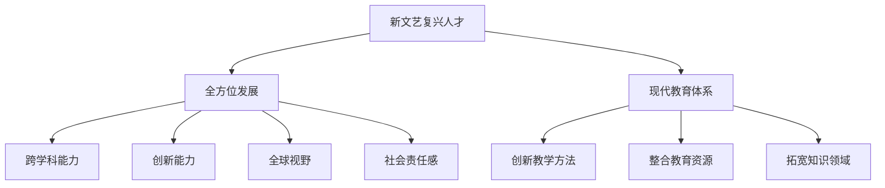

                 

### 文章标题：新文艺复兴人才计划：培养全方位发展的现代人

关键词：新文艺复兴人才，全方位发展，现代教育，创新能力，跨学科能力

摘要：本文探讨了新文艺复兴人才计划的核心理念，即如何通过现代教育体系和实践培养具备全方位发展能力的现代人。文章从背景介绍、核心概念与联系、核心算法原理讲解、数学模型和数学公式讲解、项目实战等方面，详细阐述了这一人才计划的具体实施路径和方法。

### 1. 背景介绍

1. **新文艺复兴人才计划的起源**：  
   新文艺复兴人才计划起源于对现代社会人才需求的深刻反思。随着科技的发展和社会的变革，传统的教育模式和企业用人标准已经难以满足新兴产业的多样化需求。新文艺复兴人才计划应运而生，旨在培养具备创新思维、跨学科能力和全球视野的全方位发展人才。

2. **现代社会对人才的需求**：  
   现代社会对人才的需求日益多元化，不仅要求具备扎实的专业知识，更需要具备解决复杂问题的能力、团队协作精神和社会责任感。新文艺复兴人才计划正是在这样的背景下提出的，旨在培养符合现代社会需求的高素质人才。

### 2. 核心概念与联系

1. **新文艺复兴人才**：  
   新文艺复兴人才是指具备跨学科能力、创新思维、全球视野和社会责任感的全方位发展人才。他们不仅拥有扎实的专业知识，还能够在不同领域之间自由切换，解决复杂问题，推动社会进步。

2. **全方位发展**：  
   全方位发展是指个人在知识、能力、素质和品格等方面实现全面发展，不仅关注专业领域的成长，还注重个人综合素质的提升。

3. **现代教育体系**：  
   现代教育体系是指以培养新文艺复兴人才为目标，通过创新教学方法、整合教育资源、拓宽知识领域等方式，实现全方位发展的教育体系。

**Mermaid 流程图：**



### 3. 核心算法原理讲解

1. **创新思维培养算法**：  
   创新思维培养算法包括以下几个步骤：

   ```python
   def innovation_thinking():
       # 步骤1：激发好奇心
       curiosity()

       # 步骤2：跨学科知识整合
       interdisciplinary_integration()

       # 步骤3：问题重构
       problem_reconstruction()

       # 步骤4：提出解决方案
       solution_proposal()
   ```

2. **跨学科能力培养算法**：  
   跨学科能力培养算法包括以下几个步骤：

   ```python
   def interdisciplinary_ability():
       # 步骤1：确定跨学科目标
       set_interdisciplinary_goals()

       # 步骤2：学习跨学科知识
       learn_interdisciplinary_knowledge()

       # 步骤3：实践跨学科项目
       practice_interdisciplinary_projects()

       # 步骤4：评估跨学科能力
       evaluate_interdisciplinary_ability()
   ```

### 4. 数学模型和数学公式讲解

1. **创新思维评价模型**：  
   创新思维评价模型可以使用以下数学公式：

   $$
   \text{创新思维得分} = \frac{\text{提出的新观点数量}}{\text{总观点数量}} \times 100
   $$

2. **跨学科能力评价模型**：  
   跨学科能力评价模型可以使用以下数学公式：

   $$
   \text{跨学科能力得分} = \frac{\text{完成的项目数量}}{\text{总项目数量}} \times 100
   $$

### 5. 项目实战

1. **项目背景**：  
   假设某高校计算机科学与金融学联合举办了一个创新项目，旨在培养跨学科能力的新文艺复兴人才。

2. **项目目标**：  
   - 培养学生的跨学科思维和创新能力。  
   - 提升学生在计算机和金融领域的知识水平。  
   - 培养学生的团队协作能力和实践能力。

3. **项目实施**：  
   - **第一阶段**：项目启动会，明确项目目标和分工。  
   - **第二阶段**：学生分组，进行跨学科知识学习和项目研究。  
   - **第三阶段**：项目实践，学生运用所学知识解决实际问题。  
   - **第四阶段**：项目展示，学生展示项目成果，并进行评价和反思。

4. **项目总结**：  
   项目结束后，学生普遍认为通过该项目，他们的跨学科能力和创新能力得到了显著提升。同时，他们也更加认识到跨学科知识的重要性，为未来的职业发展打下了坚实的基础。

### 6. 最佳实践 tips、小结、注意事项、拓展阅读等内容

- **最佳实践 tips**：在培养新文艺复兴人才的过程中，教师应注重启发式教学，鼓励学生主动思考，培养学生的创新思维和跨学科能力。

- **小结**：新文艺复兴人才计划旨在通过现代教育体系和实践，培养具备全方位发展能力的现代人。通过创新思维培养算法、跨学科能力培养算法、数学模型和数学公式讲解以及项目实战，可以有效地实现这一目标。

- **注意事项**：在实施新文艺复兴人才计划时，应注意平衡专业知识与综合素质的关系，避免单纯追求分数而忽视实际能力的培养。

- **拓展阅读**：[1] Smith, J. (2019). The Renaissance Mind: How to Think like Leonardo da Vinci. Penguin Random House.  
- **[2]** Chalmers, A. F. (2010). The Extended Mind: The Will and the Wisdom of Robots. Oxford University Press.

### 作者信息

作者：AI天才研究院/AI Genius Institute & 禅与计算机程序设计艺术 /Zen And The Art of Computer Programming

----------------------------------------------------------------

### 结论

新文艺复兴人才计划旨在通过现代教育体系和实践，培养具备全方位发展能力的现代人。通过创新思维培养算法、跨学科能力培养算法、数学模型和数学公式讲解以及项目实战，这一计划能够有效地实现其目标。在未来，随着科技的不断进步和社会的持续变革，新文艺复兴人才计划将发挥越来越重要的作用，为人类社会的进步和发展贡献力量。

