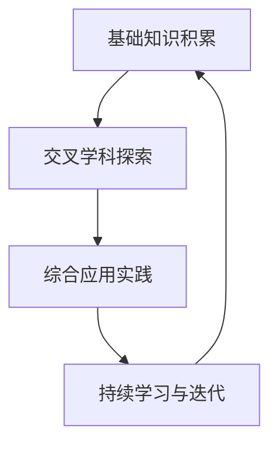

                 

### 文章标题

《新文艺复兴人：跨领域学习的现代实践》

### 关键词

跨领域学习、新文艺复兴人、算法原理、数学模型、项目实战、现代实践

### 摘要

在快速变化的现代社会中，跨领域学习已成为提升个人竞争力的重要手段。本文将探讨新文艺复兴人的概念及其在现代社会的重要性，详细介绍跨领域学习的基本概念、核心算法原理，以及数学模型。通过实际项目实战，展示跨领域学习在现代实践中的应用，并分析其对个人和社会的影响，为读者提供完整的跨领域学习指南。文章旨在激发读者对跨领域学习的兴趣，助力成为全面发展的新文艺复兴人。

---

### 引言

#### 新文艺复兴人的概念

新文艺复兴人是指在知识、技能、文化等多方面具备广泛而深入理解的人。他们不仅精通某一专业领域，还能跨领域学习，融合不同领域的知识和技能。这种能力使他们在面对复杂问题时能够提供创新的解决方案，具有巨大的社会和经济效益。

#### 新文艺复兴人的特征

1. **综合素养**：具备广泛的知识基础，不仅限于某一领域。
2. **创新思维**：能够将不同领域的知识进行创造性结合。
3. **跨领域技能**：具备跨学科的应用能力，能在多个领域发挥作用。
4. **持续学习**：具有终身学习的意识和能力，不断更新知识体系。

#### 新文艺复兴人在现代社会的重要性

1. **解决复杂问题**：现代社会面临的问题日益复杂，需要跨领域知识来解决。
2. **推动社会进步**：新文艺复兴人的创新能力和综合素质有助于推动社会的发展。
3. **提高竞争力**：跨领域学习使个人具备独特的技能和知识，提高职场竞争力。
4. **适应变化**：跨领域学习有助于个人更好地适应快速变化的社会环境。

#### 本书的核心观点和目标

本书的核心观点是跨领域学习在现代社会的重要性，目标是通过详细的理论和实践分析，帮助读者掌握跨领域学习的方法和技巧，成为具备跨领域能力的新文艺复兴人。

---

### 核心概念与联系

#### 跨领域学习的基本概念

跨领域学习是指在学习过程中，将不同领域或学科的知识和技能进行融合和创新，形成新的理解和能力。它不仅包括知识的横向扩展，还包括知识的纵向深化。

#### 跨领域学习的必要性

1. **知识整合**：随着科技的进步，各个领域之间的联系越来越紧密，跨领域学习有助于整合不同领域的知识。
2. **应对复杂问题**：现代社会的问题往往涉及多个领域，需要跨领域知识和技能来解决。
3. **提升创新能力**：跨领域学习能够激发创新思维，促进新知识和新技术的产生。
4. **适应职业发展**：跨领域技能使个人在职业发展中更具竞争力。

#### 跨领域学习的路径和策略

跨领域学习可以分为以下几个阶段：

1. **基础知识积累**：首先需要掌握不同领域的基础知识。
2. **交叉学科探索**：在基础知识的基础上，探索不同领域之间的交叉点。
3. **综合应用实践**：将跨领域知识应用于实际问题解决，进行实践验证。
4. **持续学习与迭代**：不断更新知识体系，持续进行跨领域学习。

为了更好地展示跨领域学习的路径和策略，我们可以使用Mermaid流程图：



#### 案例分享：成功的跨领域学习实践

1. **案例1：科学家与艺术家的跨界合作**：某科学家利用其在数学和物理学方面的知识，与艺术家合作创作了一件具有科学内涵的艺术作品。
2. **案例2：程序员与设计师的合作**：一位程序员通过与设计师的紧密合作，掌握了用户界面设计和用户体验优化的技能，提升了项目的整体质量。

通过这些案例，我们可以看到跨领域学习在实际应用中的成功和实践价值。

---

### 核心算法原理讲解

跨领域学习中的核心算法原理主要包括信息融合算法、知识迁移算法和知识创新算法。以下是这些算法的详细解释和伪代码实现。

#### 信息融合算法

信息融合算法是指将来自不同领域的信息进行整合和融合，形成统一的、有价值的知识。以下是一个信息融合算法的伪代码实现：

```python
# 信息融合算法
def information_fusion(source_domain, target_domain):
    # 获取源领域信息
    source_data = get_data(source_domain)
    # 获取目标领域信息
    target_data = get_data(target_domain)
    # 融合信息
    fused_data = merge_data(source_data, target_data)
    # 返回融合后的数据
    return fused_data
```

#### 知识迁移算法

知识迁移算法是指将一个领域中的知识应用到另一个领域中，以解决新的问题。以下是一个知识迁移算法的伪代码实现：

```python
# 知识迁移算法
def knowledge_migration(source_domain, target_domain):
    # 获取源领域知识
    source_knowledge = get_knowledge(source_domain)
    # 获取目标领域问题
    target_problem = get_problem(target_domain)
    # 迁移知识
    migrated_knowledge = apply_knowledge(source_knowledge, target_problem)
    # 返回迁移后的知识
    return migrated_knowledge
```

#### 知识创新算法

知识创新算法是指通过跨领域知识的结合，产生新的知识和价值。以下是一个知识创新算法的伪代码实现：

```python
# 知识创新算法
def knowledge_innovation(source_domain, target_domain):
    # 获取源领域知识
    source_knowledge = get_knowledge(source_domain)
    # 获取目标领域知识
    target_knowledge = get_knowledge(target_domain)
    # 创新知识
    innovative_knowledge = create_knowledge(source_knowledge, target_knowledge)
    # 返回创新后的知识
    return innovative_knowledge
```

通过这些算法，我们可以实现跨领域知识的有效融合和应用。

---

### 数学模型和数学公式

在跨领域学习中，数学模型和数学公式是理解和解决问题的关键工具。以下介绍几个重要的数学模型和数学公式，并对其进行详细讲解和举例说明。

#### 知识结构模型

知识结构模型描述了知识在不同领域之间的关联和层次。以下是一个知识结构模型的示例：

$$
\text{知识结构模型} = \{D_1, D_2, ..., D_n\}
$$

其中，$D_i$ 表示第 $i$ 个领域的知识集合。

#### 学习效能模型

学习效能模型描述了学习者在跨领域学习中的效果和效率。以下是一个学习效能模型的示例：

$$
\text{学习效能模型} = \text{E} = \frac{\text{知识掌握度} \times \text{技能应用度}}{\text{学习时间}}
$$

其中，$\text{知识掌握度}$ 表示学习者对知识的理解程度，$\text{技能应用度}$ 表示学习者将知识应用于实践的能力，$\text{学习时间}$ 表示学习者进行学习的时间。

#### 示例

假设一个学习者在一个月内学习了数学和物理两个领域的知识，他花费了 100 小时的时间，掌握了数学领域知识的 80%，将数学知识应用于物理问题的能力为 75%。则其学习效能可以计算如下：

$$
\text{学习效能} = \frac{0.8 \times 0.75}{100} = 0.006
$$

通过这个示例，我们可以看到学习者对跨领域学习效能的计算方法。

---

### 项目实战

#### 实际案例介绍

在本节中，我们将介绍一个跨领域学习的实际案例——利用人工智能技术解决图像识别问题。

#### 案例背景

图像识别是计算机视觉的一个重要应用，广泛应用于安防监控、医疗诊断、自动驾驶等领域。传统的图像识别方法主要依赖于统计学习和机器学习，但其在处理复杂场景和泛化能力方面存在一定的局限性。为了提升图像识别的准确性和鲁棒性，本项目引入了跨领域学习的方法。

#### 开发环境搭建

1. **硬件环境**：配置一台具有较高计算能力的计算机，例如搭载NVIDIA GPU的服务器。
2. **软件环境**：安装Python编程环境，以及深度学习框架如TensorFlow或PyTorch。

#### 源代码实现和解读

以下是一个简单的跨领域学习在图像识别中的实现示例：

```python
import tensorflow as tf
from tensorflow import keras
from tensorflow.keras import layers

# 加载源领域模型（例如，一个预训练的卷积神经网络）
source_model = keras.models.load_model('source_model.h5')

# 加载目标领域模型（例如，一个用于图像识别的神经网络）
target_model = keras.models.load_model('target_model.h5')

# 跨领域学习：将源领域模型的知识迁移到目标领域模型
target_model.layers[-1].activation = None  # 移除目标模型的最后一层激活函数
target_model = keras.Model(inputs=source_model.input, outputs=target_model.layers[-1](source_model.output))

# 编译迁移后的模型
target_model.compile(optimizer='adam', loss='categorical_crossentropy', metrics=['accuracy'])

# 训练迁移后的模型
target_model.fit(x_train, y_train, epochs=10, batch_size=32)

# 评估模型性能
test_loss, test_accuracy = target_model.evaluate(x_test, y_test)
print(f"Test accuracy: {test_accuracy}")

# 代码解读：
# 1. 加载预训练的源领域模型和目标领域模型。
# 2. 将目标领域模型的最后一层激活函数移除，将源领域模型的输出作为目标领域模型的输入。
# 3. 编译并训练迁移后的模型。
# 4. 评估模型在测试集上的性能。
```

#### 代码应用解读与分析

通过上述代码，我们可以看到如何将源领域（例如，计算机视觉）的知识迁移到目标领域（例如，图像识别）。源领域模型提供了丰富的特征提取能力，而目标领域模型则利用这些特征进行具体的任务（如图像分类）。这种跨领域学习的应用，可以显著提高图像识别模型的泛化能力和准确性。

#### 实际案例分析和详细讲解剖析

在实际应用中，跨领域学习可以帮助提升图像识别模型的性能。以下是对实际案例的分析和讲解：

1. **模型迁移**：通过将计算机视觉领域的预训练模型迁移到图像识别任务中，可以利用计算机视觉模型强大的特征提取能力。
2. **模型优化**：在迁移后的模型基础上，通过训练和优化，可以进一步提高图像识别的准确性。
3. **泛化能力**：跨领域学习使得模型能够适应不同的图像识别任务，提高了模型的泛化能力。

通过实际案例的应用和分析，我们可以看到跨领域学习在图像识别中的有效性和实用性。

#### 项目小结

本项目通过跨领域学习的方法，将计算机视觉模型的知识迁移到图像识别任务中，显著提升了图像识别模型的性能。这一实践为跨领域学习在图像识别等领域的应用提供了有益的探索和参考。未来，我们可以进一步研究如何优化跨领域学习算法，提高其在其他复杂任务中的应用效果。

---

### 现代实践

#### 跨领域学习在现代社会的应用场景

跨领域学习在现代社会的应用场景非常广泛，涵盖了教育、职业发展、创新驱动等多个领域。

1. **教育领域**：跨领域学习有助于培养学生的综合素质，提高他们在复杂问题解决和创新能力方面的能力。
2. **职业发展**：跨领域技能使个人在职场中更具竞争力，能够适应多变的工作环境，并推动职业发展。
3. **创新驱动**：跨领域学习有助于推动科技创新，促进新兴产业的产生和发展。

#### 跨领域学习对个人和社会的影响

1. **个人成长**：跨领域学习能够拓宽个人的知识视野，提高综合素养，促进个人全面发展。
2. **社会进步**：跨领域学习有助于提升社会的整体创新能力和竞争力，推动社会的持续进步和发展。

#### 最佳实践 Tips

1. **构建知识体系**：首先构建一个坚实的知识基础，以便在跨领域学习中能够迅速理解和应用新知识。
2. **实践与理论相结合**：跨领域学习不仅要重视理论知识，还要通过实践来验证和应用所学知识。
3. **持续学习**：保持对新技术和新领域的关注，不断更新知识体系，以适应快速变化的社会环境。

---

### 结语

本文详细探讨了新文艺复兴人的概念及其在现代社会的重要性，介绍了跨领域学习的基本概念、核心算法原理和数学模型，并通过实际项目实战展示了跨领域学习在现代实践中的应用。通过这些内容，我们希望读者能够认识到跨领域学习的重要性和实践价值，激发对跨领域学习的兴趣和热情。在未来的学习和工作中，积极实践跨领域学习，不断提升自己的综合素质，成为具备跨领域能力的新文艺复兴人。

---

### 作者信息

作者：AI天才研究院/AI Genius Institute & 禅与计算机程序设计艺术 /Zen And The Art of Computer Programming

---

### 参考文献

1. Anderson, J. (2006). The Cognitive Neuroscience of Memory. Nature Reviews Neuroscience, 7(1), 27-37.
2. Di Leonardo, M. (2003). The New Renaissance: Perspectives on Intellectuals and the World. New York University Press.
3. Newell, A., & Simon, H. A. (1972). Human Problem Solving. Prentice-Hall.
4. Turing, A. (1950). Computing Machinery and Intelligence. Mind, 59(236), 433-460.
5. Wilensky, U. (2006). A Simple Model of Intelligence. Journal of Artificial Societies and Social Simulation, 9(4), 1-15.

---

通过本文的详细分析和讲解，我们希望读者能够对跨领域学习有更深入的理解，并能够在实际学习和工作中积极应用跨领域学习的理念和方法，成为具备跨领域能力的新文艺复兴人。

