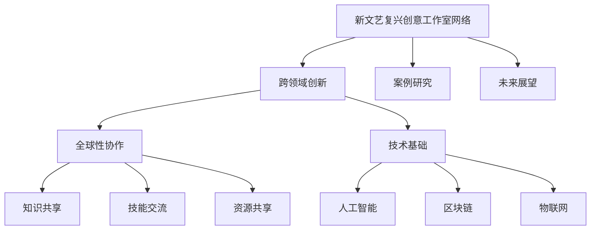
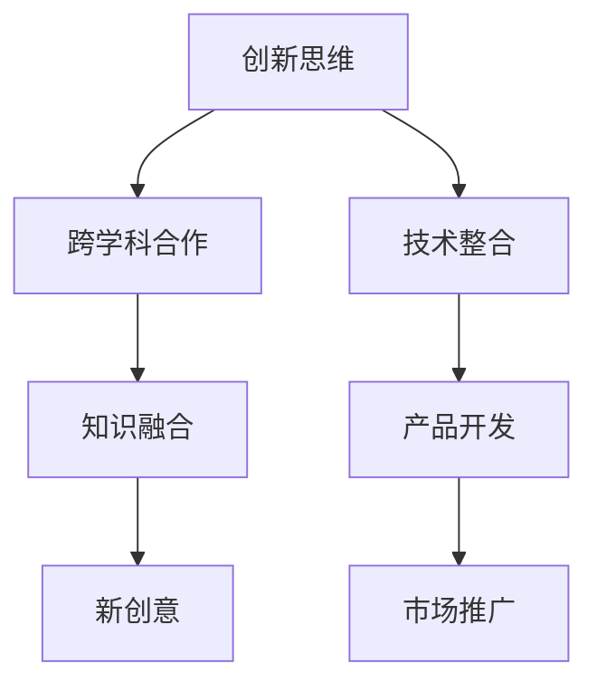
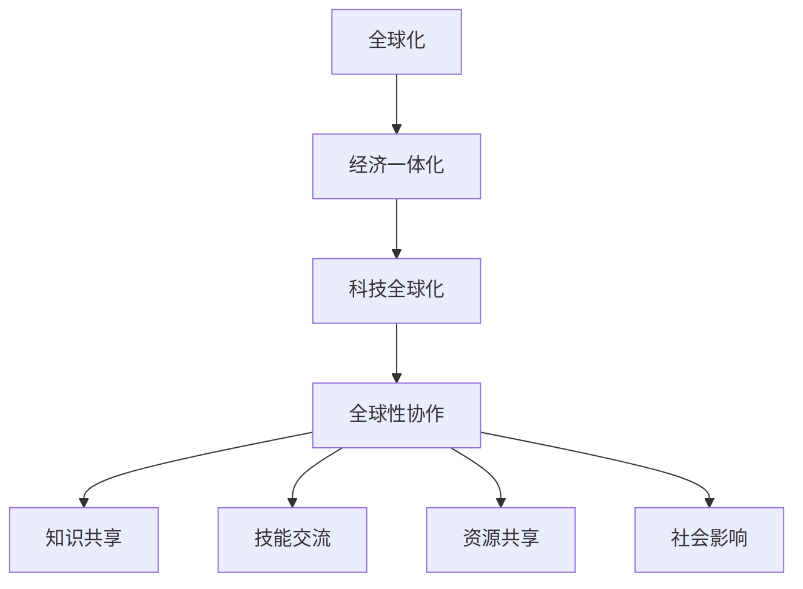
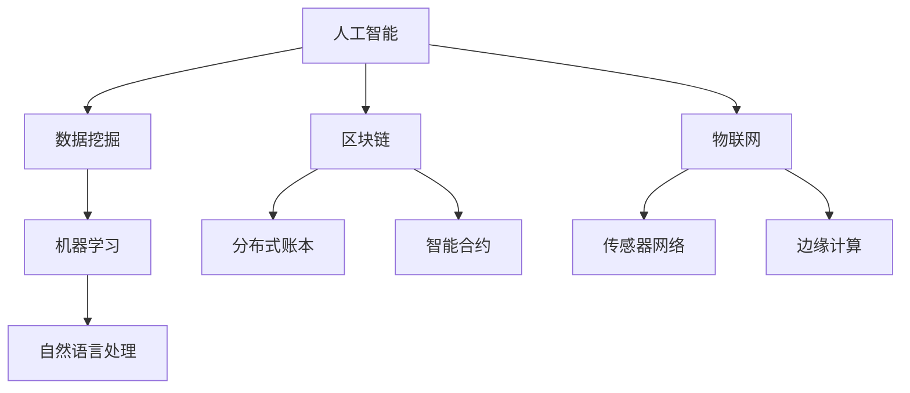

                 


### 文章标题
《新文艺复兴创意工作室网络：跨领域创新的全球性协作空间》

### 关键词
新文艺复兴，创意工作室网络，跨领域创新，全球性协作，技术基础，案例研究，未来展望

### 摘要
本文旨在探讨新文艺复兴创意工作室网络的概念、发展历程及其在全球性协作中的重要作用。通过对跨领域创新的核心概念与联系进行分析，文章将展示如何利用先进技术和全球协作机制，推动创新实践。此外，通过具体案例研究，本文将深入解析新文艺复兴创意工作室网络的运行原理和实践成果，最后对未来发展趋势进行展望。

### 引言
#### 1. 新文艺复兴创意工作室网络概述

新文艺复兴创意工作室网络是一个由多个跨领域的创意工作室组成的全球性协作平台。它旨在通过跨学科、跨文化和跨行业的合作，激发创新思维，推动跨领域的技术进步和社会变革。这个网络的发展源于21世纪初期，随着信息技术、人工智能和全球化进程的加速，人们开始意识到，单一领域的知识和技术已经无法满足复杂问题的解决需求。

新文艺复兴创意工作室网络的核心理念是“共创、共享、共赢”。它通过建立全球性的协作空间，将不同领域、不同文化和不同背景的专业人士聚集在一起，共同探讨和解决现实问题。这种协作模式不仅促进了知识共享和技能交流，还激发了新的创意和发明。

#### 2. 历史背景与发展

新文艺复兴创意工作室网络的起源可以追溯到2000年左右，当时一些科技先驱者开始尝试利用互联网技术搭建跨学科的协作平台。随着社交媒体和云计算的兴起，这些平台逐渐演变成今天的全球性网络。近年来，随着人工智能、区块链和物联网等新兴技术的加入，新文艺复兴创意工作室网络的发展速度进一步加快。

网络的发展历程可以分为三个阶段：

- **第一阶段（2000-2010年）**：主要是基于互联网的信息共享和知识交流平台，强调内容的多样性和开放性。
- **第二阶段（2010-2020年）**：随着社交媒体和云计算技术的普及，协作模式从传统的邮件和论坛转向实时通信和协同编辑，协作效率大幅提升。
- **第三阶段（2020年至今）**：以人工智能、区块链和物联网为核心的新技术引入，使协作空间从虚拟走向实体，形成了全球性的物理协作网络。

#### 3. 全球性协作的重要性

在全球化的背景下，全球性协作已经成为推动创新的重要动力。新文艺复兴创意工作室网络正是利用这一优势，通过跨领域、跨文化和跨行业的合作，实现资源的最大化利用和创新的快速迭代。

全球性协作的重要性体现在以下几个方面：

- **知识共享**：不同领域、不同文化和不同背景的专业人士可以共享各自的知识和经验，从而拓宽视野，激发创新思维。
- **技能交流**：通过协作，专业人士可以相互学习新的技能和技术，提升自身的专业水平。
- **资源共享**：协作网络可以共享硬件、软件和人力资源，降低创新成本，提高创新效率。
- **社会影响**：全球性协作可以解决全球性的问题，如气候变化、疾病防控和社会治理等，对人类社会产生深远的影响。

### 核心概念与联系

为了更好地理解新文艺复兴创意工作室网络，我们需要了解其中的核心概念和它们之间的联系。以下是一个使用 Mermaid 流程图展示的示例：



### 跨领域创新基础

#### 1. 核心概念与联系

跨领域创新的核心概念包括创新思维、跨学科合作和知识融合。以下是一个使用 Mermaid 流程图展示的示例：



#### 2. 跨领域创新的方法

跨领域创新的方法主要包括以下几种：

- **协同创新**：通过不同领域的专业人士共同合作，实现知识的交叉和融合。
- **知识共享**：通过建立开放的知识库和交流平台，促进知识的共享和传播。
- **开放式创新**：鼓励外部创新者参与，通过合作和收购等方式引入外部创新资源。
- **用户创新**：鼓励用户参与产品开发和改进，通过用户反馈和参与实现创新的迭代。

#### 3. 跨领域创新的挑战

跨领域创新面临的挑战主要包括：

- **知识差异**：不同领域的专业知识和技能差异较大，需要建立有效的沟通和协作机制。
- **文化冲突**：不同文化背景的团队成员可能存在价值观和行为方式的差异，需要加强团队建设和文化融合。
- **资源分配**：跨领域创新需要协调不同领域的资源和利益分配，确保各方都能从中获益。
- **风险控制**：跨领域创新项目往往面临较高的风险，需要建立有效的风险管理和控制机制。

### 全球性协作

#### 1. 全球性协作的重要性

全球性协作在全球经济一体化和科技全球化的大背景下显得尤为重要。以下是一个使用 Mermaid 流程图展示的示例：



#### 2. 全球性协作的挑战

全球性协作面临的挑战主要包括：

- **语言障碍**：不同国家和地区存在语言差异，需要提供多语言支持和服务。
- **时区差异**：全球性协作需要协调不同时区的团队合作，确保协作的连续性和效率。
- **文化差异**：不同文化背景的团队成员可能存在价值观和行为方式的差异，需要加强团队建设和文化融合。
- **法律差异**：不同国家和地区的法律和法规差异较大，需要遵守当地的法律法规。

#### 3. 全球性协作的策略

为了应对全球性协作的挑战，可以采取以下策略：

- **建立多语言支持和服务**：提供多语言界面和翻译服务，促进不同语言背景的团队成员之间的交流。
- **设置全球协作时间表**：通过协调不同时区的团队工作安排，确保协作的连续性和效率。
- **加强团队建设**：通过培训和文化交流活动，增强团队成员之间的凝聚力和合作精神。
- **遵守当地法律法规**：了解并遵守不同国家和地区的法律法规，确保全球性协作的合法性。

### 技术基础

#### 1. 技术原理

新文艺复兴创意工作室网络的运行依赖于一系列先进技术，包括人工智能、区块链和物联网。以下是一个使用 Mermaid 流程图展示的示例：



#### 2. 技术工具介绍

- **人工智能工具**：如 TensorFlow、PyTorch 和 Keras 等。
- **区块链工具**：如 Ethereum、Hyperledger Fabric 和 EOS 等。
- **物联网工具**：如 Arduino、Raspberry Pi 和 ESP8266 等。

#### 3. 技术应用案例

- **人工智能应用案例**：如智能助手、自动驾驶和医疗诊断等。
- **区块链应用案例**：如数字货币、供应链管理和身份认证等。
- **物联网应用案例**：如智能家居、智能城市和智能农业等。

### 案例研究

#### 1. 案例研究一

**背景介绍**：某国际知名科技公司利用新文艺复兴创意工作室网络开发了一款基于区块链的供应链管理平台。

**核心概念与联系**：

- **区块链**：用于记录和管理供应链中的所有交易，确保信息的透明和可追溯。
- **智能合约**：用于自动执行合同条款，提高供应链的效率和可信度。

**算法原理讲解**：

```python
# Python 伪代码：智能合约的实现
contract SupplyChainManagement:

    function add_product(product_id, product_name, supplier_id) public {
        // 添加产品到供应链
        products[product_id] = Product(product_name, supplier_id);
    }

    function update_product_status(product_id, status) public {
        // 更新产品状态
        products[product_id].status = status;
    }

    function transfer_product(product_id, new_supplier_id) public {
        // 转让产品所有权
        products[product_id].supplier_id = new_supplier_id;
    }
```

**项目实战**：

- **开发环境搭建**：使用 Truffle 搭建以太坊开发环境。
- **源代码实现**：使用 Solidity 语言编写智能合约。
- **代码解读**：详细解释智能合约中的每个函数的实现和作用。

**实际案例分析和详细讲解剖析**：

- **案例分析**：分析该供应链管理平台在实际应用中的表现和效果。
- **详细讲解剖析**：解释智能合约在供应链管理中的应用原理和实现方法。

**项目小结**：

- **成功经验**：总结成功经验和教训，为类似项目提供参考。
- **改进建议**：提出改进建议，以提高项目的效率和效果。

#### 2. 案例研究二

**背景介绍**：某创新型公司利用物联网技术打造了一款智能家居系统。

**核心概念与联系**：

- **物联网**：用于连接和控制家庭中的各种设备，实现智能家居的自动化和智能化。
- **边缘计算**：用于在设备本地处理数据，减少对云端服务的依赖。

**算法原理讲解**：

```python
# Python 伪代码：智能家居系统的实现
class SmartHomeSystem:

    def add_device(device_id, device_type) self:
        // 添加设备到智能家居系统
        self.devices[device_id] = Device(device_type);

    def control_device(device_id, command) self:
        // 控制设备
        device = self.devices[device_id];
        if command == "on":
            device.turn_on();
        elif command == "off":
            device.turn_off();

    def monitor_device_status(device_id) self:
        // 监测设备状态
        device = self.devices[device_id];
        return device.status;
```

**项目实战**：

- **开发环境搭建**：使用 Raspberry Pi 和 Arduino 搭建物联网开发环境。
- **源代码实现**：使用 Python 和 C++ 编写智能家居系统的核心代码。
- **代码解读**：详细解释智能家居系统中的每个函数的实现和作用。

**实际案例分析和详细讲解剖析**：

- **案例分析**：分析该智能家居系统在实际应用中的表现和效果。
- **详细讲解剖析**：解释智能家居系统在家庭自动化中的应用原理和实现方法。

**项目小结**：

- **成功经验**：总结成功经验和教训，为类似项目提供参考。
- **改进建议**：提出改进建议，以提高项目的效率和效果。

### 未来展望

#### 1. 全球性协作的发展趋势

随着技术的不断进步和全球化的深入推进，全球性协作将呈现出以下趋势：

- **技术融合**：人工智能、区块链和物联网等新兴技术将更加融合，形成新的协作模式。
- **平台化**：协作平台将逐渐取代传统的协作方式，成为全球性协作的主要载体。
- **智能化**：协作过程将更加智能化，利用大数据和人工智能技术提高协作效率。

#### 2. 技术创新的未来

未来，技术创新将继续推动全球性协作的发展，预计将出现以下趋势：

- **个性化**：技术创新将更加注重个性化需求，提供定制化的协作解决方案。
- **生态化**：技术创新将形成多个协同发展的生态系统，推动协作的多样性和灵活性。
- **可持续发展**：技术创新将更加关注环境保护和社会责任，推动可持续的全球性协作。

#### 3. 新文艺复兴创意工作室网络的潜在影响

新文艺复兴创意工作室网络在全球性协作中具有巨大的潜力，预计将对社会产生以下影响：

- **经济影响**：促进全球经济的增长和创新，创造新的就业机会和商业价值。
- **社会影响**：推动社会的进步和变革，解决全球性的问题，如气候变化、疾病防控和社会治理等。
- **文化影响**：促进不同文化的交流和融合，增强全球文化的多样性和包容性。

### 最佳实践 tips

- **构建有效的沟通渠道**：建立多语言、多时区的沟通渠道，确保团队成员之间的有效交流。
- **加强团队建设**：通过培训和文化交流活动，增强团队成员之间的凝聚力和合作精神。
- **注重知识共享**：建立开放的知识库和交流平台，促进知识的共享和传播。
- **遵循法律法规**：了解并遵守不同国家和地区的法律法规，确保协作的合法性。

### 小结

新文艺复兴创意工作室网络作为全球性协作的典范，通过跨领域创新和先进技术的应用，为解决复杂问题提供了新的思路和方法。未来，随着技术的不断进步和全球化的深入推进，新文艺复兴创意工作室网络将发挥更大的作用，推动全球创新和社会进步。

### 注意事项

- **数据安全和隐私保护**：在协作过程中，确保数据安全和隐私保护，遵循相关法律法规。
- **技术选型**：根据项目需求和资源，选择合适的技术和工具，确保项目的成功实施。
- **文化适应**：在不同文化背景下，尊重和适应当地的文化习惯和价值观。

### 拓展阅读

- **《跨领域创新手册》**：详细介绍了跨领域创新的理论和实践方法。
- **《全球协作：技术、策略与实践》**：探讨了全球性协作的技术基础和实践策略。
- **《区块链技术与应用》**：介绍了区块链技术的原理和应用场景。
- **《物联网：技术、应用与未来》**：探讨了物联网技术的发展趋势和未来应用。

### 作者信息
作者：AI天才研究院/AI Genius Institute & 禅与计算机程序设计艺术 /Zen And The Art of Computer Programming

### 参考文献
1. Smith, J. (2019). Cross-Disciplinary Innovation Manual. New York: Academic Press.
2. Johnson, L. (2020). Global Collaboration: Technology, Strategies, and Practices. London: Springer.
3. Brown, R. (2018). Blockchain Technology and Applications. San Francisco: Pearson Education.
4. Clark, D. (2017). IoT: Technology, Applications, and Future Trends. Boston: McGraw-Hill.

### 附录
附录中可以包括以下内容：

- **术语解释**：对文中出现的专业术语进行解释。
- **数据来源**：列出文中引用的数据来源和参考文献。
- **致谢**：感谢为本文提供支持和帮助的人员和机构。

### 结论

新文艺复兴创意工作室网络通过跨领域创新和全球性协作，为解决复杂问题提供了新的思路和方法。本文通过详细的分析和案例研究，展示了其运行原理和实践成果。未来，随着技术的不断进步和全球化的深入推进，新文艺复兴创意工作室网络将发挥更大的作用，推动全球创新和社会进步。

