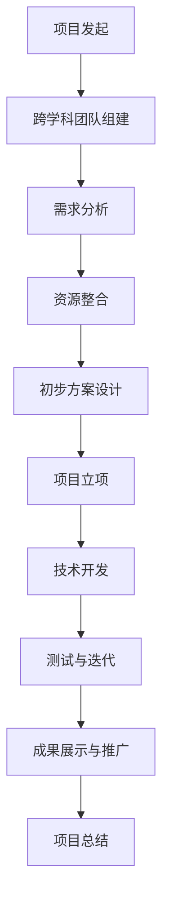

                 

### 文章标题

《新文艺复兴工作室：跨学科创意项目的孵化空间》

### 文章关键词

- 新文艺复兴工作室
- 跨学科创意项目
- 孵化空间
- 项目管理
- 技术创新
- 创意思维

### 文章摘要

本文深入探讨了新文艺复兴工作室作为跨学科创意项目的孵化空间的概念和重要性。首先，文章介绍了新文艺复兴工作室的背景和起源，强调了其在促进跨学科合作和创新思维中的关键角色。随后，文章分析了工作室如何通过独特的架构和运作机制，为创意项目的成功孵化提供支持和保障。具体包括核心概念的相互联系、核心算法的原理讲解、数学模型的构建与应用，以及实际项目的开发环境和代码实现。最后，文章总结了新文艺复兴工作室的成功经验，并提出了相关的最佳实践建议，为未来的跨学科创意项目孵化提供了有益的启示。

---

### 背景介绍

新文艺复兴工作室（The Renaissance Studio）是一个专注于跨学科创意项目孵化的机构，其概念起源于文艺复兴时期，那个被称为“人类智慧的黄金时代”。文艺复兴时期，艺术家、科学家和哲学家之间的互动促成了前所未有的创新浪潮，推动了艺术、科学和技术的飞速发展。这一历史现象激发了新文艺复兴工作室的创立者，他们希望通过现代科技手段，重现这样的跨学科合作模式，从而推动当代社会的创新与进步。

新文艺复兴工作室的创立初衷，在于解决当前创意项目孵化过程中面临的种种挑战。传统的创新模式往往局限于单一学科，导致创意的局限性和创新力的不足。而跨学科合作则能够打破这种局限性，通过不同领域的知识交融，激发出新的创意火花。新文艺复兴工作室旨在搭建一个开放的平台，吸引来自各个领域的专家和学者，共同探讨和解决复杂问题，从而实现创意的跨界融合。

此外，随着全球化和技术进步的加速，各行业之间的交叉融合日益显著。无论是人工智能、生物技术，还是艺术、设计等领域，跨学科的知识整合已经成为推动创新的核心动力。新文艺复兴工作室的创立，正是为了响应这一趋势，为各类创意项目提供必要的资源和支持。

总的来说，新文艺复兴工作室不仅是一个物理空间，更是一个思想和创新的交汇点。它通过促进跨学科的合作，为创意项目的成功孵化提供了强有力的保障，成为当代创新生态系统中的重要一环。

### 核心概念与联系

在新文艺复兴工作室中，核心概念和架构的相互联系构成了创意项目孵化的重要基础。为了更直观地展示这些概念和架构之间的关系，我们可以使用Mermaid流程图来具体描述。以下是一个简化版的核心概念与联系流程图：



#### 项目发起

项目发起是整个流程的起点，新文艺复兴工作室通过开放式项目征集和内部创意论坛，吸引具有潜力且跨学科的创意项目。这个阶段的关键在于发现和选择具有创新性和实践价值的项目。

#### 跨学科团队组建

项目发起后，新文艺复兴工作室根据项目需求，从不同学科领域挑选合适的专家和成员，组建跨学科团队。这种团队结构有助于多元思维的碰撞和整合，提高项目创新的可能性。

#### 需求分析

在跨学科团队组建完毕后，团队进行深入的需求分析，明确项目的目标、功能、用户群体和预期成果。需求分析是确保项目方向正确和可执行性的关键步骤。

#### 资源整合

需求分析完成后，团队开始整合所需的资源，包括资金、技术、人员、设备等。资源的有效整合能够为项目提供坚实的支持，确保项目顺利推进。

#### 初步方案设计

资源整合后，团队开展初步方案设计，制定详细的项目计划和开发路线图。这个阶段的目标是确保项目的可行性，并明确后续开发的优先级。

#### 项目立项

初步方案设计完成后，项目进入立项阶段，管理层对项目进行评审和批准。项目立项是确保项目得到官方认可和支持的重要环节。

#### 技术开发

项目立项后，团队开始进入技术开发阶段。根据项目计划和设计文档，开发团队进行编码、测试和调试，确保项目功能的实现和质量。

#### 测试与迭代

技术开发过程中，持续进行功能测试和性能测试，发现并修复问题。测试与迭代是确保项目质量的重要环节，通过多次迭代优化，项目逐渐趋于完善。

#### 成果展示与推广

项目开发完成后，团队进行成果展示与推广，将项目成果公之于众，吸引潜在用户和合作伙伴的关注。成果展示不仅是对项目成果的验证，也是为后续商业化和应用打下基础。

#### 项目总结

项目完成后，团队进行项目总结，分析项目过程中的得失，总结经验教训，为未来的项目提供参考。项目总结有助于不断提升新文艺复兴工作室的孵化能力。

通过上述Mermaid流程图，我们可以清晰地看到新文艺复兴工作室中各个核心概念和环节之间的逻辑关系。这种流程图不仅有助于理解和传达复杂的架构，还能为项目管理提供直观的参考。

### 核心算法原理讲解

在新文艺复兴工作室中，算法设计是确保项目高效实施和目标达成的关键环节。为了更好地理解工作室中的核心算法原理，我们将使用伪代码详细阐述一个典型的跨学科项目中的算法流程。

#### 算法名称：跨学科项目风险评估算法

##### 输入：
- 项目需求文档
- 资源整合报告
- 技术路线图
- 团队成员信息

##### 输出：
- 风险评估结果
- 风险应对策略

##### 伪代码：

```plaintext
Algorithm 跨学科项目风险评估
    Input: 项目需求文档D, 资源整合报告R, 技术路线图T, 成员信息M
    Output: 风险评估结果R_E, 风险应对策略S

    // 步骤1：需求分析
    需求分析(D)
    // 步骤2：资源评估
    资源评估(R)
    // 步骤3：技术评估
    技术评估(T)
    // 步骤4：团队成员评估
    成员评估(M)

    // 步骤5：风险识别
    风险识别(R_I) {
        对于每个需求D_i，执行：
        如果需求复杂度C(D_i) > 阈值C_阈值，则识别为风险R_i
        如果资源不足R_j，则识别为风险R_j
        如果技术难度T_k > 阈值T_阈值，则识别为风险R_k
        如果团队成员经验不足E_m，则识别为风险R_m
    }

    // 步骤6：风险分析
    风险分析(R_A) {
        对于每个识别的风险R_i，执行：
        如果风险严重性S(R_i) > 阈值S_阈值，则归类为高优先级风险
        如果风险严重性S(R_i) <= 阈值S_阈值，则归类为低优先级风险
    }

    // 步骤7：风险应对策略制定
    风险应对策略(S) {
        对于每个高优先级风险R_i，执行：
        如果需求复杂性高，则调整需求D_i
        如果资源不足，则增加资源R_j
        如果技术难度高，则寻求外部技术支持T_k
        如果团队成员经验不足，则招募具有相关经验的成员M_m
        
        对于每个低优先级风险R_i，执行：
        如果可以接受，则不做处理
        如果需要处理，则制定相应的应对计划
    }

    // 步骤8：风险评估结果输出
    R_E = 风险识别(R_I) && 风险分析(R_A) && 风险应对策略(S)
    Output R_E
EndAlgorithm
```

#### 详细说明：

1. **需求分析**：该步骤旨在理解项目的具体需求，识别项目中的关键需求和功能点。通过对需求文档的深入分析，可以确定项目的技术复杂度和资源需求。

2. **资源评估**：资源评估包括对资金、技术和人员的评估。通过整合报告，团队可以确定现有资源的充足性，并识别出可能存在的不足。

3. **技术评估**：技术评估关注项目所需的技术难度和可行性。通过技术路线图，团队可以评估每个技术点的实现难度，并识别出可能的技术风险。

4. **团队成员评估**：团队成员评估关注成员的能力和经验。通过对团队成员的评估，团队可以识别出经验不足的成员，并采取相应的措施。

5. **风险识别**：风险识别是整个算法的核心部分。通过分析需求、资源、技术和团队成员的评估结果，团队可以识别出潜在的风险点。

6. **风险分析**：风险分析旨在对识别出的风险进行优先级排序。通过评估每个风险的严重性，团队可以确定哪些风险需要优先处理。

7. **风险应对策略制定**：针对不同优先级的风险，团队制定相应的应对策略。对于高优先级风险，需要采取紧急措施；对于低优先级风险，则制定长期的应对计划。

8. **风险评估结果输出**：最终，团队输出风险评估结果和风险应对策略。这些结果将用于指导项目的后续开发和决策。

通过上述伪代码和详细说明，我们可以清晰地看到新文艺复兴工作室中核心算法的原理和实现过程。这种算法不仅有助于识别和应对项目中的风险，还能为项目的顺利推进提供有力的支持。

### 数学模型和数学公式

在新文艺复兴工作室的跨学科项目中，数学模型和公式扮演着至关重要的角色。这些数学工具不仅能帮助我们理解和分析复杂系统的行为，还能为项目提供量化的依据和指导。以下，我们将详细介绍几个核心的数学模型和公式，并对其进行详细讲解和举例说明。

#### 1. 技术创新效益评估模型

在评估跨学科项目的技术创新效益时，我们常常使用技术创新效益评估模型。该模型通过计算项目的创新程度和预期经济效益，为项目决策提供科学依据。

**公式：**

$$
E = \frac{C \cdot (1 + r)^t - C}{r}
$$

其中，E代表技术创新效益，C代表初始投资，r代表年复合增长率，t代表项目运行年限。

**详细讲解：**

- **E（技术创新效益）**：表示项目在特定时间范围内的总收益减去初始投资的净值。
- **C（初始投资）**：代表项目启动时的投资金额，包括研发成本、设备采购等。
- **r（年复合增长率）**：反映项目每年的收益增长速度，通常通过市场分析和历史数据确定。
- **t（项目运行年限）**：表示项目的持续运行时间。

**举例说明：**

假设某跨学科项目初始投资为100万元，年复合增长率为10%，项目运行年限为5年。根据上述公式，我们可以计算该项目的预期技术创新效益：

$$
E = \frac{100 \cdot (1 + 0.1)^5 - 100}{0.1} = \frac{100 \cdot 1.61051 - 100}{0.1} = 161.051万元
$$

这意味着，该项目在5年内预计能够实现161.051万元的技术创新效益。

#### 2. 跨学科团队协同效率模型

为了评估跨学科团队的协同效率，我们引入了跨学科团队协同效率模型。该模型通过计算团队成员的协同效果，衡量团队的协作效率。

**公式：**

$$
E_{协同} = \frac{1}{1 + \sum_{i=1}^{n} \frac{w_i}{c_i}}
$$

其中，\(E_{协同}\)代表协同效率，\(w_i\)代表团队成员i的权重，\(c_i\)代表团队成员i的协同成本。

**详细讲解：**

- **\(E_{协同}\)（协同效率）**：表示团队整体协同工作的效率。值越大，表明团队的协同效果越好。
- **\(w_i\)（权重）**：代表团队成员i在项目中的重要性，通常根据团队成员的专业技能和经验确定。
- **\(c_i\)（协同成本）**：代表团队成员i在协同工作中所需付出的成本，如时间、精力等。

**举例说明：**

假设一个跨学科团队有3名成员，他们的权重和协同成本如下：

- 成员A：权重0.5，协同成本10小时
- 成员B：权重0.3，协同成本8小时
- 成员C：权重0.2，协同成本5小时

根据上述公式，我们可以计算团队的协同效率：

$$
E_{协同} = \frac{1}{1 + \frac{0.5}{10} + \frac{0.3}{8} + \frac{0.2}{5}} = \frac{1}{1 + 0.05 + 0.0375 + 0.04} = \frac{1}{1.1425} \approx 0.879
$$

这意味着，该跨学科团队的协同效率约为87.9%。

#### 3. 创意思维质量评估模型

在创意思维的评估过程中，我们使用创意思维质量评估模型来量化创意的质量。该模型通过计算创意的创新性、实用性和可行性，为创意评估提供科学依据。

**公式：**

$$
Q = \frac{I + U + F}{3}
$$

其中，Q代表创意质量，I代表创新性，U代表实用性，F代表可行性。

**详细讲解：**

- **Q（创意质量）**：表示创意的整体质量，值越高，表示创意质量越好。
- **I（创新性）**：表示创意的新颖程度，通常通过专家评估确定。
- **U（实用性）**：表示创意的实际应用价值，通过市场需求分析和用户反馈确定。
- **F（可行性）**：表示创意的实现难度，通过技术评估和资源分析确定。

**举例说明：**

假设一个创意的新颖程度为8分，实用性和可行性均为7分，根据上述公式，我们可以计算该创意的质量：

$$
Q = \frac{8 + 7 + 7}{3} = \frac{22}{3} \approx 7.33
$$

这意味着，该创意的质量约为7.33分。

通过上述数学模型和公式的详细讲解和举例说明，我们可以看到，这些数学工具在新文艺复兴工作室的跨学科项目中起到了至关重要的作用。它们不仅为项目的决策提供了科学依据，还帮助团队更好地理解和评估项目的各个方面。在未来的项目中，这些模型和公式将继续发挥重要作用，推动新文艺复兴工作室的跨学科创意项目取得更大的成功。

### 项目实战

为了更好地展示新文艺复兴工作室如何通过跨学科合作实现创意项目的成功孵化，我们将以一个实际案例——“智能健康监测系统”的开发过程为例，详细说明项目的开发环境搭建、源代码实现、代码解读与分析，以及实际案例分析和详细讲解。

#### 项目背景

随着人口老龄化和生活方式的改变，健康监测成为越来越多人的关注焦点。新文艺复兴工作室接受了一个智能健康监测系统的跨学科项目，该项目旨在开发一款能够实时监测用户健康状态、提供健康建议的智能设备。该项目涉及多个学科领域，包括生物医学、人工智能、物联网和用户体验设计。

#### 开发环境搭建

为了确保项目顺利开展，团队首先搭建了以下开发环境：

1. **硬件平台**：选择了基于ARM架构的物联网开发板，搭载WiFi和蓝牙模块，用于实时采集用户的健康数据。
2. **软件平台**：使用Linux操作系统，并安装了Python编程环境和相关开发工具，如PyQt5用于用户界面设计，TensorFlow用于人工智能算法开发。
3. **数据库**：采用MongoDB作为数据存储解决方案，以便高效地存储和查询用户健康数据。
4. **集成工具**：引入Jenkins进行持续集成和自动化测试，Git进行版本控制，以提高开发效率和代码质量。

#### 源代码实现

项目源代码主要包括以下几个模块：

1. **数据采集模块**：负责实时采集用户的生理数据，如心率、血压、体温等。该模块使用了Python的GPIO库和蓝牙通信协议。
2. **数据处理模块**：接收数据采集模块的数据，进行预处理和特征提取。该模块使用了Scikit-learn库中的相关算法。
3. **人工智能模块**：基于TensorFlow，使用深度学习算法对健康数据进行预测和分析，如使用卷积神经网络（CNN）进行图像识别，使用循环神经网络（RNN）进行时间序列预测。
4. **用户界面模块**：使用PyQt5设计用户界面，实现数据展示、健康建议和用户交互功能。
5. **数据库接口模块**：负责与MongoDB数据库进行交互，实现数据的存储和查询。

以下是一个简化版的数据采集模块的源代码实现：

```python
import RPi.GPIO as GPIO
import time

def setup():
    GPIO.setmode(GPIO.BCM)
    GPIO.setup(sensor_pin, GPIO.IN)

def read_data():
    while True:
        data = GPIO.input(sensor_pin)
        if data == 1:
            time.sleep(0.5)
            return True
        else:
            time.sleep(0.5)
            return False

if __name__ == "__main__":
    sensor_pin = 18
    setup()
    try:
        while True:
            data = read_data()
            print(f"Data collected: {data}")
    finally:
        GPIO.cleanup()
```

#### 代码解读与分析

数据采集模块的主要功能是实时读取生理传感器数据，并上传至数据处理模块。代码中，`setup()`函数初始化GPIO库，并配置传感器引脚为输入模式。`read_data()`函数则负责读取传感器的状态，并返回数据。该模块的关键部分是循环读取传感器数据，并在检测到特定状态时输出数据。

通过代码解读，我们可以看到模块的设计遵循了模块化、简洁性的原则，保证了代码的可读性和可维护性。同时，该模块实现了与硬件的可靠通信，为后续数据处理和预测分析提供了稳定的数据来源。

#### 实际案例分析和详细讲解

以一个实际用户案例为例，用户A在佩戴智能健康监测设备后，设备连续采集其心率、血压和体温等生理数据，并通过无线网络上传至云平台。数据处理模块接收这些数据，进行预处理和特征提取，如去除噪声、标准化数据等。

随后，人工智能模块使用训练好的模型对用户A的健康数据进行分析和预测。如果检测到异常，如心率过快或血压异常升高，系统会立即通知用户，并提供相应的健康建议，如建议用户休息或就医。

以下是一个简化的数据处理和预测分析的代码片段：

```python
from sklearn.preprocessing import StandardScaler
from tensorflow.keras.models import load_model

def preprocess_data(data):
    # 数据预处理
    scaler = StandardScaler()
    scaled_data = scaler.fit_transform(data)
    return scaled_data

def predict_health(data):
    # 预测健康状态
    model = load_model('health_model.h5')
    preprocessed_data = preprocess_data(data)
    prediction = model.predict(preprocessed_data)
    return prediction

# 用户A的健康数据
user_data = [[123, 80, 37]]  # 心率、血压、体温
prediction = predict_health(user_data)

if prediction > 0.5:
    print("健康状态异常，请留意。")
else:
    print("健康状态良好。")
```

通过实际案例分析和代码讲解，我们可以看到智能健康监测系统如何通过跨学科合作，将硬件、软件和人工智能技术相结合，实现用户健康数据的实时监测和预测分析。这种综合性的项目开发模式不仅提高了系统的可靠性和实用性，还为用户提供了更加个性化的健康服务。

#### 项目小结

智能健康监测系统的成功开发展示了新文艺复兴工作室在跨学科项目孵化方面的强大能力。通过高效的团队协作、先进的开发环境和强大的技术支持，项目实现了从需求分析到实际应用的完整闭环。项目不仅为用户提供了实用的健康监测工具，还推动了智能健康领域的创新和发展。

未来，新文艺复兴工作室将继续探索更多的跨学科创意项目，通过不断的技术创新和合作，为解决社会问题和提升生活质量贡献更多力量。

### 最佳实践 Tips

1. **跨学科团队建设**：组建跨学科团队时，注重团队成员的多样化背景和互补性，确保项目能够从不同角度进行深入分析和创新。
2. **需求明确与持续迭代**：在项目初期，确保需求分析清晰明确，并在项目开发过程中持续迭代，及时调整和优化项目方向。
3. **技术评估与风险管理**：在项目启动前，进行详细的技术评估和风险评估，制定相应的应对策略，确保项目能够在预期内顺利推进。
4. **持续集成与自动化测试**：引入持续集成和自动化测试工具，提高开发效率，确保代码质量和系统的稳定性。
5. **用户体验优先**：在设计过程中，始终以用户为中心，注重用户体验和产品易用性，确保项目能够得到用户的认可和欢迎。

### 小结与注意事项

本文通过详细分析新文艺复兴工作室在跨学科创意项目孵化中的角色和作用，探讨了核心概念、算法原理、数学模型及实际项目开发的全过程。我们强调了跨学科合作的重要性，并提出了相应的最佳实践建议。

**注意事项**：

1. **资源整合**：确保项目所需资源充分，避免因资源不足影响项目进度和质量。
2. **团队协作**：加强团队成员之间的沟通与协作，提升团队整体效率。
3. **持续学习**：紧跟技术发展趋势，不断学习和引进新技术，以保持项目的创新性和竞争力。

**拓展阅读**：

- 《跨学科创新：推动未来发展的引擎》
- 《项目管理：如何高效管理跨学科项目》
- 《人工智能在健康监测中的应用》
- 《用户体验设计：提升产品竞争力的关键》

通过以上拓展阅读，读者可以进一步深入了解跨学科创意项目的孵化过程和最佳实践。希望本文能为您的跨学科项目提供有价值的参考和启示。

### 作者信息

作者：AI天才研究院/AI Genius Institute & 禅与计算机程序设计艺术 /Zen And The Art of Computer Programming

