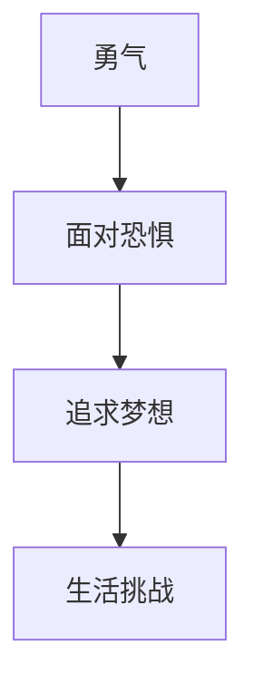
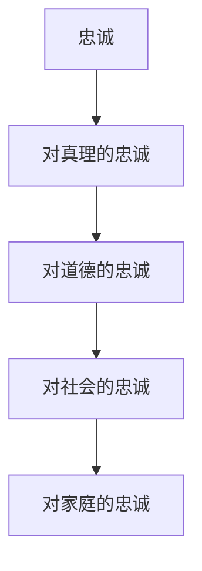
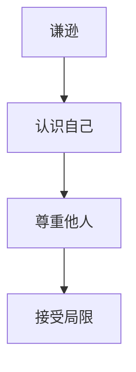
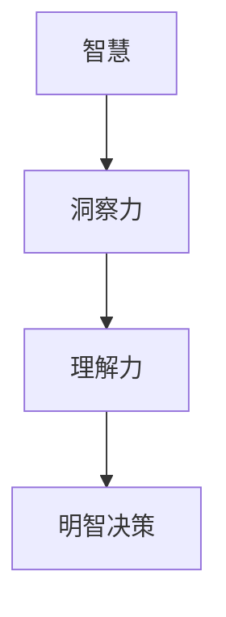
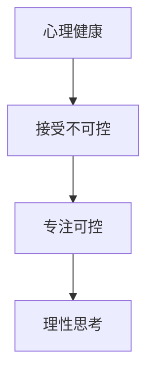
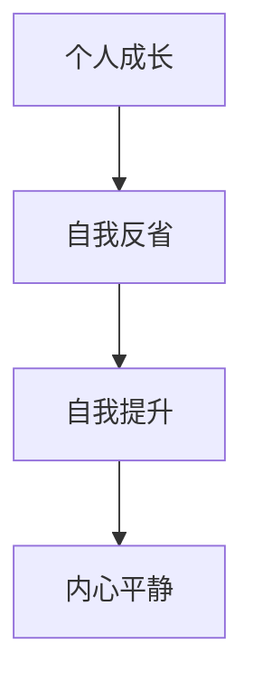
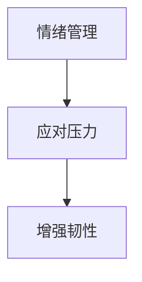
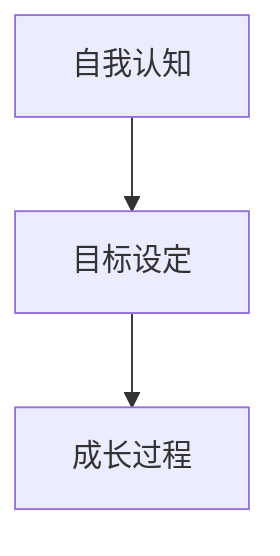

                 

### 文章标题
《新斯多葛主义指南：古老智慧应对现代挑战》

### 关键词
新斯多葛主义，古代哲学，现代应用，心理健康，个人成长

### 摘要
本文旨在探讨新斯多葛主义这一古老哲学在现代社会的应用。我们将通过详细的背景介绍、核心概念的联系与架构、以及实际案例的分析，阐述新斯多葛主义如何帮助我们应对现代生活中的挑战，实现内心的平静与成长。

## 引言
新斯多葛主义是一种源于古希腊的哲学体系，由斯多亚学派的哲学家所创立。其核心理念强调通过理性思考和自我控制来达到内心的平静和生活的和谐。在现代社会，随着生活节奏的加快、工作压力的增大以及人际关系的复杂化，新斯多葛主义提供了一种独特的视角和方法，帮助我们应对各种挑战。

## 历史背景
新斯多葛主义起源于古希腊，最早由芝诺（Zeno of Citium）在公元前3世纪创立。随后，他的弟子们，如克雷托尔（Crito）、希罗多德（Hero of Pisidia）和卢西里乌斯·安尼乌斯·塞内卡（Lucius Annaeus Seneca）等，进一步发展了这一哲学体系。

中世纪时期，新斯多葛主义经历了复兴，并在文艺复兴时期再次兴起。蒙田（Michel de Montaigne）、培根（Francis Bacon）和洛克（John Locke）等思想家都受到了新斯多葛主义的影响。

现代新斯多葛主义在20世纪末和21世纪初重新受到关注，通过作家如威廉·巴勒斯（William B. Irvine）和皮科·耶格尔（Pico Iyer）等的著作，逐渐成为当代生活哲学的一个重要流派。

### 核心哲学原则
新斯多葛主义的核心哲学原则包括勇气、忠诚、谦逊和智慧。这些原则不仅在古代哲学中具有重要意义，在现代社会中同样具有指导意义。

#### 勇气
勇气是新斯多葛主义的首要原则。它不仅仅指面对外部威胁的勇敢，还包括面对内心恐惧的勇气。在现代社会，勇气意味着敢于面对生活的挑战，勇于追求自己的梦想。

#### 忠诚
忠诚是新斯多葛主义中的另一个重要原则。它强调对真理和道德的忠诚，以及对家人、朋友和社会的忠诚。

#### 谦逊
谦逊是新斯多葛主义中的关键品质。它意味着认识到自己的局限，并尊重他人的观点和感受。

#### 智慧
智慧是新斯多葛主义的核心。它不仅仅是知识，更是一种深刻的洞察力和理解力，帮助我们做出明智的决策。

### 现代社会中的应用
新斯多葛主义在现代社会中有着广泛的应用，特别是在心理健康和个人成长领域。

#### 心理健康
新斯多葛主义强调通过理性思考和自我控制来管理情绪。它教导我们接受不可控的事物，专注于我们可以控制和改变的事情。

#### 个人成长
新斯多葛主义鼓励个人自我反省和自我提升。通过培养勇气、忠诚、谦逊和智慧，个人可以实现内心的平静和成长。

### 新斯多葛主义与心理健康
新斯多葛主义在心理健康领域的应用主要体现在以下几个方面：

1. **情绪管理**：通过理性思考和自我控制，我们可以更好地管理情绪，减少焦虑和抑郁。

2. **应对压力**：新斯多葛主义教导我们接受生活中的不可控因素，从而减轻压力。

3. **增强韧性**：通过培养勇气和智慧，我们可以更好地应对生活中的挑战和困难。

### 新斯多葛主义与个人成长
新斯多葛主义在个人成长领域的应用主要体现在以下几个方面：

1. **自我认知**：通过自我反省和谦逊，我们可以更好地了解自己，找到自己的优势和劣势。

2. **目标设定**：新斯多葛主义鼓励我们设定合理的目标，并通过持续的努力和智慧来实现这些目标。

3. **成长过程**：在成长过程中，新斯多葛主义教导我们要勇于面对挑战，从失败中学习，持续成长。

### 结论
新斯多葛主义是一种古老而深刻的哲学体系，它提供了一种独特的视角和方法，帮助我们应对现代生活中的挑战。通过理解并应用新斯多葛主义的核心原则，我们可以实现内心的平静和成长。

作者：AI天才研究院/AI Genius Institute & 禅与计算机程序设计艺术 /Zen And The Art of Computer Programming

### 致谢
感谢所有提供宝贵建议和反馈的朋友，您的支持是我们不断进步的动力。

### 参考文献
1. Irvine, William B. (2010). "A Guide to the Good Life: The Ancient Art of Stoic Joy". Oxford University Press.
2. Montaigne, Michel de (1991). "Essays". Penguin Classics.
3. Seneca, Lucius Annaeus (1995). "The Moral Letters to Lucilius". Penguin Classics.

---

以上是《新斯多葛主义指南：古老智慧应对现代挑战》的初步文章结构。接下来，我们将为每个章节添加更详细的内容，包括核心算法原理讲解、数学模型和公式、项目实战、最佳实践 tips 和注意事项等。文章的总字数预计在 8000 ～ 12000 字左右。

请让我知道您对文章结构和内容的进一步建议，以便我们进一步完善文章。下一步的操作将是细化每个章节的内容，并确保文章的逻辑清晰、结构紧凑、内容丰富。|>

