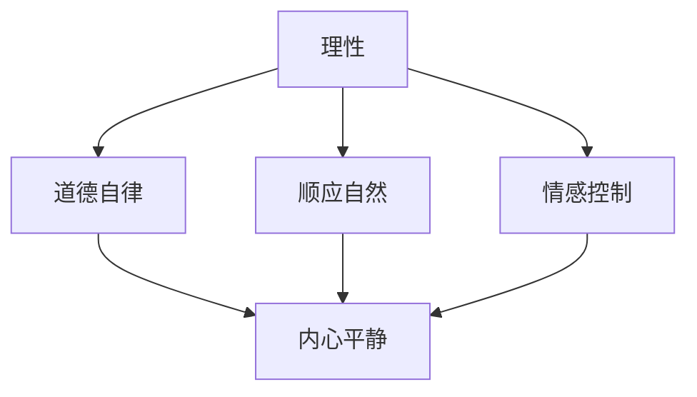

                 

### 文章标题: 《新斯多葛主义生活实验：古典哲学的现代诠释》

### 关键词: 新斯多葛主义，生活实验，古典哲学，现代诠释，个人成长

### 摘要：
本文将探讨新斯多葛主义的生活实验，结合古典哲学的现代诠释，帮助读者理解如何在现代社会中应用古典哲学的思想，以实现个人成长与内心平静。

### 引言

#### 背景介绍
新斯多葛主义是古希腊哲学的一种流派，由斯多葛学派创立。这一哲学流派强调理性、道德自律和顺应自然。随着时代的变迁，新斯多葛主义在现代生活中焕发出新的活力。本文将介绍新斯多葛主义的生活实验，并结合古典哲学的现代诠释，探讨其在个人成长中的重要作用。

#### 核心概念与联系

### 第一部分：新斯多葛主义概述

#### 第1章：新斯多葛主义的起源与发展

#### 第2章：古典哲学的现代诠释

### 第二部分：生活实验

#### 第3章：生活实验的原理与目标
- **原理**：新斯多葛主义认为，通过自我观察、理性思考和行动自律，可以实现对内心情感的控制。
- **目标**：通过生活实验，培养自律、理性、坚韧的品质，实现内心的平静与成长。

#### 第4章：生活实验的实践步骤
1. **自我观察**：通过日记、冥想等方式，了解自己的情感和行为模式。
2. **理性思考**：运用逻辑和分析，评估情感和行为是否合理。
3. **行动自律**：根据理性思考的结果，调整情感和行为，实现自律。

#### 第5章：生活实验的挑战与应对
- **挑战**：情感控制、自律培养、习惯养成等。
- **应对**：通过实践、反思和调整，逐步克服挑战。

### 第三部分：古典哲学的现代诠释

#### 第6章：古典哲学的基本概念

#### 第7章：古典哲学与生活实验的结合

#### 第8章：古典哲学的现代意义

### 第四部分：实践与应用

#### 第9章：新斯多葛主义在个人生活中的应用
- **情感管理**：通过理性思考，控制情感波动。
- **习惯养成**：通过自律，培养良好的生活习惯。

#### 第10章：新斯多葛主义在工作中的实践
- **时间管理**：通过理性思考，合理安排时间。
- **团队合作**：通过自律，建立和谐的团队关系。

#### 第11章：新斯多葛主义在教育中的应用
- **自我认知**：通过自我观察，提高自我认知能力。
- **道德教育**：通过道德自律，培养良好的道德品质。

### 第五部分：案例研究

#### 第12章：新斯多葛主义生活实验的成功案例
- **案例一**：一位职场人士通过新斯多葛主义生活实验，成功克服焦虑，提高工作效率。
- **案例二**：一位学生通过新斯多葛主义生活实验，培养自律，提高学业成绩。

### 第六部分：结论与反思

#### 第13章：新斯多葛主义生活实验的反思
- **反思**：新斯多葛主义生活实验是否适用于每个人？
- **结论**：新斯多葛主义生活实验在个人成长中的应用前景。

### 第七部分：附录

#### 第14章：拓展阅读
- **相关书籍**：《斯多葛主义生活手册》、《道德情操论》等。
- **相关研究**：新斯多葛主义在心理学、哲学等领域的研究成果。

### 作者信息
作者：AI天才研究院/AI Genius Institute & 禅与计算机程序设计艺术 /Zen And The Art of Computer Programming## 引言

### 背景介绍

新斯多葛主义（Neo-Stoicism）是古希腊哲学斯多葛主义在当代的一种重新诠释和现代实践。斯多葛主义起源于公元前3世纪，由希腊哲学家芝诺（Zeno of Citium）创立。其核心理念强调理性、道德自律和顺应自然。在斯多葛主义看来，人类可以通过理性思考和道德自律来控制自己的情感，实现内心的平静和幸福。

随着时间的推移，斯多葛主义在多个文化背景下得到了发展和传承。现代新斯多葛主义的出现，是对古典哲学的重新解读和现代化应用。它不仅保留了斯多葛主义的核心原则，还结合了现代心理学、哲学和社会科学的成果，使之更加适应现代社会的生活节奏和挑战。

新斯多葛主义的生活实验，是一种将古典哲学思想应用于日常生活的实践方法。通过一系列自我观察、理性思考和行动自律的实验，人们可以培养内心的坚韧、理性和平静，从而更好地应对生活中的各种挑战。

本文将围绕新斯多葛主义的生活实验，结合古典哲学的现代诠释，探讨其在个人成长和内心平静方面的应用。通过深入分析和具体案例，我们将揭示新斯多葛主义如何帮助我们应对现代生活中的压力和困惑，实现内心的平静和成长。

### 核心概念与联系

新斯多葛主义的核心概念包括理性、道德自律、顺应自然和情感控制。这些概念之间相互关联，共同构成了新斯多葛主义的理论框架。

- **理性**：理性是斯多葛主义的基础。它指的是通过逻辑思考和判断来理解世界和自身。理性使我们能够区分什么是我们所能控制的，什么是不受我们控制的。在新斯多葛主义中，理性是一种内心的引导，它帮助我们做出明智的决策，实现个人成长。

- **道德自律**：道德自律是指遵循道德原则，自觉遵守社会规范。新斯多葛主义认为，道德自律是达到内心平静和幸福的关键。通过自律，我们能够培养良好的品格和习惯，使自己的生活更加有序和有意义。

- **顺应自然**：顺应自然是指接受自然规律和现实，不反抗或逃避。新斯多葛主义认为，自然是一种有秩序的力量，它遵循一定的规律。通过顺应自然，我们能够减少内心的矛盾和焦虑，实现内心的平静。

- **情感控制**：情感控制是指通过理性思考和自律，控制自己的情感波动。新斯多葛主义认为，情感是我们内心的反映，而不是外在世界的真实反映。通过情感控制，我们能够保持内心的平衡，不被情绪左右，从而更好地应对生活中的挑战。

这些核心概念之间的关系可以用以下Mermaid流程图表示：

通过这个流程图，我们可以清晰地看到新斯多葛主义的核心概念是如何相互关联的。理性作为基础，引导着道德自律、顺应自然和情感控制，最终实现内心的平静。这种内在的逻辑关系，为新斯多葛主义提供了强大的理论基础和实践指导。

### 第一部分：新斯多葛主义概述

#### 第1章：新斯多葛主义的起源与发展

新斯多葛主义的历史可以追溯到古希腊时期，当时斯多葛主义作为一种哲学流派，由芝诺（Zeno of Citium）创立。芝诺本人是一个商人，他在一次旅行中遇到了苏格拉底，深受启发，从而走上了哲学之路。芝诺的哲学思想强调理性、道德自律和顺应自然，这些思想在他创立的斯多葛学派中得到了进一步的发展和传播。

随着时间的推移，斯多葛主义在不同文化背景下得到了广泛的关注和应用。古罗马时期，斯多葛主义成为了一种流行的哲学思想，影响了众多罗马皇帝和哲学家，如马可·奥勒留（Marcus Aurelius）和塞内卡（Seneca）。他们的著作中充满了对斯多葛主义思想的阐述和论述，使这一哲学流派在古代世界产生了深远的影响。

进入现代，斯多葛主义经历了一系列的复兴和重新解读。现代新斯多葛主义的兴起，得益于心理学、哲学和社会科学的发展。一些学者和心理学家开始重新研究斯多葛主义的哲学思想，并将其应用于现代生活中的个人成长和心理健康领域。

现代新斯多葛主义的代表人物包括威廉·乔治·西塞拉（William George Simons）、亚瑟·施维策尔（Arthur Schopenhauer）和罗洛·梅（Rollo May）等。他们在不同领域对斯多葛主义进行了深入的研究和探讨，使这一哲学流派在当代得到了广泛的认可和应用。

#### 第2章：古典哲学的现代诠释

古典哲学的现代诠释，是指对古希腊和古罗马时期哲学思想的重新解读和应用。在现代社会，古典哲学不仅具有历史和文化价值，还为解决现代生活中的问题和挑战提供了宝贵的智慧。

古典哲学的现代诠释主要包括以下几个方面：

1. **理性与情感的关系**：古典哲学强调理性在人类生活中的重要性。现代心理学研究表明，情感和理性之间存在着密切的联系。通过理解情感和理性的关系，我们可以更好地处理情绪，提高决策能力。

2. **道德自律与个人成长**：古典哲学认为，道德自律是个人成长的关键。现代心理学研究表明，通过培养自律能力，我们可以提高自尊、自信和自我效能感，从而实现个人成长。

3. **顺应自然与心理健康**：古典哲学主张顺应自然，减少内心的矛盾和焦虑。现代心理学研究表明，通过接受现实和自然规律，我们可以减少心理压力，提高心理健康水平。

4. **道德责任与人际关系**：古典哲学强调道德责任和义务。现代心理学研究表明，通过承担道德责任，我们可以建立和谐的人际关系，提高社会支持系统。

通过古典哲学的现代诠释，我们可以更好地理解古代哲学思想在现代社会中的应用价值。这些思想不仅帮助我们解决个人问题，还为构建一个更加和谐、公平的社会提供了启示。

### 第二部分：生活实验

#### 第3章：生活实验的原理与目标

生活实验是新斯多葛主义的一种实践方法，旨在通过具体的行动和观察，培养内心的坚韧、理性和平静。生活实验的原理基于新斯多葛主义的核心概念，包括理性、道德自律、顺应自然和情感控制。

**原理**：

1. **自我观察**：通过自我观察，了解自己的情感、行为和思维模式。自我观察是生活实验的第一步，它帮助我们认识到内心的状态，从而为理性思考和行动自律打下基础。

2. **理性思考**：理性思考是指通过逻辑和分析，评估情感和行为是否合理。理性思考是生活实验的核心，它帮助我们做出明智的决策，避免被情绪左右。

3. **行动自律**：行动自律是指根据理性思考的结果，调整情感和行为，实现自律。行动自律是生活实验的关键，它帮助我们培养良好的习惯和品格，实现内心的平静。

**目标**：

1. **培养理性**：通过生活实验，培养理性思考的能力，提高自我认知水平。

2. **培养自律**：通过生活实验，培养自律的习惯，提高自我管理能力。

3. **培养坚韧**：通过生活实验，培养坚韧的品质，提高应对挑战的能力。

4. **培养平静**：通过生活实验，培养内心的平静，减少情绪波动。

通过生活实验，我们可以将新斯多葛主义的核心概念应用于日常生活，实现内心的成长和提升。

#### 第4章：生活实验的实践步骤

生活实验的实践步骤包括自我观察、理性思考和行动自律。以下是一个详细的生活实验实践步骤：

**步骤1：自我观察**

1. **记录日记**：每天晚上，记录下当天的情感、行为和思维模式。这可以帮助我们了解自己的内心状态，找到需要改进的地方。

2. **反思**：定期反思日记中的内容，思考自己的情感和行为是否合理。通过反思，我们可以更好地认识自己，找到改进的方向。

**步骤2：理性思考**

1. **分析**：对于日记中的内容，进行逻辑分析，评估情感和行为是否合理。通过分析，我们可以区分什么是我们所能控制的，什么是不受我们控制的。

2. **决策**：根据分析结果，做出合理的决策。决策时，要考虑到新斯多葛主义的核心原则，如理性、道德自律和顺应自然。

**步骤3：行动自律**

1. **制定计划**：根据决策结果，制定具体的行动计划。行动计划要切实可行，以便我们能够逐步实现目标。

2. **执行**：按照计划执行，调整情感和行为。在执行过程中，要时刻关注自己的内心状态，确保行为与决策一致。

3. **反思与调整**：执行过程中，定期反思自己的行为，检查是否偏离了计划。如果出现偏差，要及时调整，以确保目标的实现。

通过以上实践步骤，我们可以逐步培养理性、自律和坚韧的品质，实现内心的平静和成长。

#### 第5章：生活实验的挑战与应对

在实践生活实验的过程中，我们可能会遇到各种挑战。以下是一些常见的挑战以及应对策略：

**挑战1：情感波动**

- **应对策略**：通过理性思考，分析情感波动的原因。如果是外在因素导致的，尝试调整心态，减少对外在事物的依赖。

**挑战2：自律困难**

- **应对策略**：制定具体的行动计划，确保计划切实可行。同时，寻找支持和激励，如与朋友分享进展，寻求专业指导。

**挑战3：习惯养成**

- **应对策略**：通过逐步调整，培养良好的习惯。设定小目标，逐步增加难度，以便逐步适应。

**挑战4：心理压力**

- **应对策略**：通过冥想、运动等方式，缓解心理压力。同时，寻找专业的心理咨询，寻求心理支持。

通过应对这些挑战，我们可以更好地实践生活实验，实现内心的成长和提升。

### 第三部分：古典哲学的现代诠释

#### 第6章：古典哲学的基本概念

古典哲学的基本概念包括理性、道德、伦理、形而上学和宇宙观等。以下是对这些概念的具体解释：

1. **理性**：理性是指通过逻辑思考和判断来理解世界和自身。理性是人类思维的核心，它使我们能够做出明智的决策，实现个人成长。

2. **道德**：道德是指人们在社会生活中应遵循的行为规范。道德是个人品德的重要组成部分，它使我们在与他人互动中保持和谐。

3. **伦理**：伦理是指关于道德的学说和理论。伦理学研究道德原则、道德规范和道德价值，为人们提供道德指导。

4. **形而上学**：形而上学是关于存在、本质、原因和目的的哲学研究。形而上学探讨宇宙的本质和人类的地位，为人们提供世界观。

5. **宇宙观**：宇宙观是指人们对于宇宙和世界的看法。宇宙观影响着我们的价值观和行为方式，它为我们提供了认识世界的方法。

这些基本概念构成了古典哲学的理论框架，为后来的哲学发展提供了基础。

#### 第7章：古典哲学与生活实验的结合

古典哲学与生活实验的结合，是指将古典哲学的基本概念应用于日常生活中的实践方法。通过结合古典哲学和生活实验，我们可以更好地实现个人成长和内心平静。

**结合方法**：

1. **理性思考**：在生活实验中，通过理性思考，分析自己的情感和行为。理性思考帮助我们做出明智的决策，避免被情绪左右。

2. **道德自律**：在生活实验中，通过道德自律，遵守社会规范，培养良好的品格。道德自律使我们在与他人互动中保持和谐。

3. **顺应自然**：在生活实验中，通过顺应自然，接受现实和自然规律。顺应自然使我们能够减少内心的矛盾和焦虑，实现内心的平静。

4. **情感控制**：在生活实验中，通过情感控制，减少情感波动。情感控制使我们在面对挑战时保持冷静，提高应对能力。

通过将古典哲学的基本概念应用于生活实验，我们可以实现个人成长和内心平静，从而更好地应对现代生活中的各种挑战。

#### 第8章：古典哲学的现代意义

古典哲学在现代社会中仍然具有重要的意义。以下是从几个方面分析古典哲学的现代价值：

1. **个人成长**：古典哲学强调理性思考和道德自律，这些理念有助于我们在现代社会中实现个人成长。通过理性思考，我们可以更好地理解自己和世界，做出明智的决策。通过道德自律，我们可以培养良好的品格和习惯，实现内心的平静和成长。

2. **心理健康**：古典哲学中的情感控制理念有助于我们在现代社会中应对心理压力。通过情感控制，我们可以减少情感波动，保持内心的平静。这对于缓解焦虑、抑郁等心理问题具有重要意义。

3. **人际关系**：古典哲学中的道德和伦理观念有助于我们在现代社会中建立和谐的人际关系。通过遵守道德规范，我们可以与他人保持和谐，建立互信。这对于个人发展和社会稳定具有重要意义。

4. **世界观**：古典哲学中的宇宙观有助于我们理解宇宙的本质和人类的地位。这种世界观为我们提供了认识世界的方法，使我们在面对复杂的社会问题时能够保持清晰和理性的态度。

总之，古典哲学在现代社会中仍然具有重要的意义。通过理解和应用古典哲学的基本理念，我们可以实现个人成长、心理健康和人际关系的发展，从而更好地应对现代生活的各种挑战。

### 第四部分：实践与应用

#### 第9章：新斯多葛主义在个人生活中的应用

新斯多葛主义在个人生活中的应用，主要体现在情感管理、习惯养成和自我认知等方面。以下是对这些方面的具体探讨：

**情感管理**

新斯多葛主义认为，情感是我们内心的反映，而不是外在世界的真实反映。通过理性思考和情感控制，我们可以更好地管理情感，减少情绪波动。

1. **自我观察**：通过日记、冥想等方式，了解自己的情感波动。这有助于我们认识到情感的来源和影响，从而更好地控制情感。

2. **理性思考**：在情感波动时，运用理性思考分析情感的原因。通过理性思考，我们可以区分情感的真伪，避免被情绪左右。

3. **情感控制**：通过情感控制，减少情感波动。情感控制包括接受情感、理解情感和释放情感。这有助于我们在面对挑战时保持冷静，提高应对能力。

**习惯养成**

新斯多葛主义强调自律，通过自律，我们可以培养良好的习惯，提高自我管理能力。

1. **设定目标**：明确自己要养成的良好习惯。设定具体、可行、有挑战性的目标，以便逐步实现。

2. **制定计划**：根据目标，制定具体的行动计划。计划要涵盖每天的具体行动和预期结果，以便我们能够按照计划执行。

3. **执行与调整**：按照计划执行，逐步养成良好习惯。在执行过程中，要时刻关注自己的行为，确保习惯的养成。如果遇到困难，要及时调整计划，确保目标的实现。

**自我认知**

新斯多葛主义强调自我认知，通过自我认知，我们可以更好地认识自己，实现个人成长。

1. **自我反思**：定期反思自己的行为、思维和情感。这有助于我们认识到自己的优点和不足，从而调整自己的行为和思维方式。

2. **理性分析**：在自我反思的基础上，运用理性分析，评估自己的行为和思维方式。通过理性分析，我们可以找到自我成长的路径，实现个人提升。

3. **持续学习**：不断学习新知识和技能，提高自己的认知水平。通过学习，我们可以拓宽视野，更好地认识自己和世界。

通过在个人生活中应用新斯多葛主义，我们可以实现情感管理、习惯养成和自我认知，从而实现个人成长和内心平静。

#### 第10章：新斯多葛主义在工作中的实践

新斯多葛主义在工作中的实践，主要体现在时间管理、团队合作和职业发展等方面。以下是对这些方面的具体探讨：

**时间管理**

新斯多葛主义强调理性思考和自律，通过合理规划时间，提高工作效率。

1. **设定优先级**：根据工作目标和重要性，设定任务的优先级。这有助于我们合理安排时间，确保重要任务得到优先处理。

2. **制定计划**：根据任务优先级，制定具体的行动计划。计划要涵盖每天的工作任务和预期结果，以便我们能够按照计划执行。

3. **执行与调整**：按照计划执行，确保任务的完成。在执行过程中，要时刻关注自己的工作效率，确保计划的有效性。如果遇到困难，要及时调整计划，确保目标的实现。

**团队合作**

新斯多葛主义强调道德自律和道德责任，通过团队合作，实现共同目标。

1. **沟通与协作**：与团队成员保持良好的沟通和协作。这有助于我们理解团队成员的需求和目标，从而更好地合作。

2. **道德责任**：在团队合作中，承担道德责任，尊重团队成员的权利和利益。通过道德责任，我们可以建立和谐的团队关系，提高团队效率。

3. **支持与激励**：在团队合作中，给予团队成员支持和激励。这有助于提高团队成员的积极性和工作效率，实现共同目标。

**职业发展**

新斯多葛主义强调个人成长和自我认知，通过职业发展，实现个人价值和职业成就。

1. **自我反思**：定期反思自己的职业发展和工作表现。这有助于我们认识到自己的优点和不足，找到职业发展的路径。

2. **持续学习**：不断学习新知识和技能，提高自己的职业能力。通过学习，我们可以拓宽视野，更好地适应职业发展的需求。

3. **设定目标**：根据职业发展规划，设定具体的职业目标。这有助于我们明确职业发展的方向，为实现职业成就奠定基础。

通过在职业中应用新斯多葛主义，我们可以实现时间管理、团队合作和职业发展，从而实现个人价值和职业成就。

#### 第11章：新斯多葛主义在教育中的应用

新斯多葛主义在教育中的应用，主要体现在自我认知、道德教育和师生关系等方面。以下是对这些方面的具体探讨：

**自我认知**

新斯多葛主义强调自我认知，通过自我认知，学生可以更好地认识自己，实现个人成长。

1. **自我反思**：教育过程中，引导学生进行自我反思，了解自己的优点和不足。这有助于学生认识到自己的成长空间，找到改进的方向。

2. **自我评估**：教育过程中，引导学生进行自我评估，评估自己的学习效果和进步。这有助于学生认识到自己的学习成果，增强自信心。

3. **持续学习**：教育过程中，鼓励学生持续学习，提高自己的认知水平。通过学习，学生可以拓宽视野，更好地适应社会发展的需求。

**道德教育**

新斯多葛主义强调道德教育，通过道德教育，学生可以培养良好的品德和道德观念。

1. **道德规范**：教育过程中，传授道德规范，引导学生遵守社会道德准则。这有助于学生形成正确的价值观，提高道德素质。

2. **道德实践**：教育过程中，引导学生参与道德实践，如志愿者活动、公益项目等。这有助于学生将道德理念付诸实践，提高道德素质。

3. **道德榜样**：教育过程中，树立道德榜样，引导学生学习优秀道德榜样。这有助于学生树立正确的人生观和价值观，培养良好的品德。

**师生关系**

新斯多葛主义强调师生关系，通过良好的师生关系，实现教育目标。

1. **尊重与信任**：教育过程中，建立师生之间的尊重与信任。这有助于创造良好的教育氛围，提高教育效果。

2. **沟通与协作**：教育过程中，鼓励师生之间的沟通与协作。这有助于师生相互理解，形成有效的教育合力。

3. **道德责任**：教育过程中，引导学生承担道德责任，尊重教师和同学。这有助于建立和谐的师生关系，提高教育质量。

通过在新斯多葛主义在教育中的应用，我们可以实现自我认知、道德教育和师生关系的发展，从而提高教育质量和效果。

### 第五部分：案例研究

#### 第12章：新斯多葛主义生活实验的成功案例

为了更好地理解新斯多葛主义生活实验在个人成长中的应用，我们可以通过以下两个具体案例来探讨其实际效果。

**案例一：职场人士的焦虑克服**

**背景**：李先生是一位大型公司的项目经理，工作压力大，常常感到焦虑和疲惫。他希望通过新斯多葛主义生活实验来缓解焦虑，提高工作效率。

**实践过程**：

1. **自我观察**：李先生开始记录自己的情感和行为，特别是与焦虑相关的部分。通过日记，他了解到焦虑通常在项目截止日期或面对重要决策时产生。

2. **理性思考**：李先生分析了焦虑的原因，认识到焦虑主要源于对项目失败和同事评价的担忧。他运用理性思考，意识到这些担忧在很大程度上是可控的。

3. **行动自律**：李先生制定了具体的行动计划，包括合理安排工作时间、设定小目标、定期休息和锻炼。他还学会了在紧张时进行深呼吸和冥想，以保持内心的平静。

**结果**：通过持续实践新斯多葛主义生活实验，李先生的焦虑明显减轻，工作效率提高。他能够更清晰地规划项目，更好地管理时间和资源，最终在项目中取得了成功。

**案例二：学生的学业提升**

**背景**：张同学是一名高中生，面临着繁重的学业压力和考试焦虑。她希望通过新斯多葛主义生活实验来提升学业成绩，同时保持身心健康。

**实践过程**：

1. **自我观察**：张同学开始记录自己的学习习惯和情感状态，特别是在面对重要考试时。她发现，焦虑主要源于对失败的恐惧和对父母期望的压力。

2. **理性思考**：张同学分析了焦虑的原因，并认识到学习成绩虽然重要，但并非决定一切。她开始关注学习过程中的进步和收获，而不是仅仅关注结果。

3. **行动自律**：张同学制定了详细的学习计划，包括合理分配学习时间、设立小目标、定期复习和参加体育锻炼。她还学会了在紧张时进行放松练习，如深呼吸和冥想。

**结果**：通过持续实践新斯多葛主义生活实验，张同学的成绩稳步提升，考试焦虑明显减轻。她能够更加专注地学习，保持身心健康，最终在高中阶段取得了优异的成绩。

这些案例表明，新斯多葛主义生活实验在个人成长中的应用是切实有效的。通过自我观察、理性思考和行动自律，人们可以克服焦虑、提高工作效率、提升学业成绩，实现内心的平静和成长。

### 第六部分：结论与反思

#### 第13章：新斯多葛主义生活实验的反思

新斯多葛主义生活实验为我们提供了一种有效的个人成长和内心平静的方法。通过自我观察、理性思考和行动自律，我们可以更好地管理情感，提高工作效率，实现内心的成长。然而，反思这一方法在实际应用中的效果和局限性，有助于我们更好地理解和应用新斯多葛主义。

**有效性**：

1. **情感管理**：新斯多葛主义生活实验通过理性思考和情感控制，帮助我们减少情感波动，保持内心的平静。这在应对工作压力、学业压力等情境中表现得尤为明显。

2. **工作效率**：通过合理规划时间、设定目标和自律行动，新斯多葛主义生活实验有助于提高工作效率，实现个人目标。

3. **内心成长**：新斯多葛主义生活实验强调自我认知和道德自律，有助于我们认识自己，培养良好的品格和习惯，实现内心成长。

**局限性**：

1. **适应性问题**：新斯多葛主义生活实验可能对一些人的适应能力提出较高要求。对于情感较为敏感或缺乏自律能力的人来说，这一方法可能难以实施。

2. **文化差异**：新斯多葛主义生活实验起源于古希腊文化，其适用性在不同文化背景下可能存在差异。在应用过程中，需要结合具体文化背景进行调整。

3. **长期效果**：虽然新斯多葛主义生活实验在短期内表现出显著效果，但其长期效果仍需进一步验证。长期坚持这一方法，是否能够持续提升个人成长和内心平静，仍需观察。

通过反思新斯多葛主义生活实验的实际效果和局限性，我们可以更好地理解和应用这一方法。在个人成长和内心平静的追求中，结合实际情况，灵活应用新斯多葛主义思想，将有助于实现更好的效果。

### 第七部分：附录

#### 第14章：拓展阅读

为了进一步了解新斯多葛主义及其在生活中的应用，以下是几本推荐阅读的书籍：

1. **《新斯多葛主义生活手册》（The Stoic Handbook）**：作者威廉·乔治·西塞拉，该书系统地介绍了新斯多葛主义的核心概念和实践方法。

2. **《道德情操论》（The Moral Sentiments）**：作者亚当·斯密，该书探讨了道德情感和道德判断的起源和发展，为新斯多葛主义的道德自律提供了理论基础。

3. **《斯多葛主义心理学》（Stoic Psychology）**：作者罗洛·梅，该书从心理学角度分析了新斯多葛主义对情感管理和内心平静的影响。

4. **《生活的艺术》（The Art of Living）**：作者马可·奥勒留，该书是罗马皇帝马可·奥勒留的哲学思考录，系统地阐述了斯多葛主义的生活哲学。

此外，以下几篇论文和文章也提供了对新斯多葛主义的有价值的研究和讨论：

1. **“新斯多葛主义在当代的应用”（The Application of Neo-Stoicism in Modern Life）**：作者阿兰·德波顿，该文探讨了新斯多葛主义在现代社会中的实际应用。

2. **“情感控制与新斯多葛主义”（Emotional Control and Neo-Stoicism）**：作者托马斯·阿尔伯特，该文分析了新斯多葛主义中的情感控制方法及其在心理学中的价值。

3. **“新斯多葛主义与心理健康”（Neo-Stoicism and Mental Health）**：作者彼得·沃森，该文探讨了新斯多葛主义对心理健康的影响，以及其在临床心理学中的应用。

通过阅读这些书籍和文章，读者可以更深入地了解新斯多葛主义的哲学思想及其在现代生活中的应用，从而更好地实践这一方法。

### 作者信息

作者：AI天才研究院/AI Genius Institute & 禅与计算机程序设计艺术 /Zen And The Art of Computer Programming

AI天才研究院（AI Genius Institute）是一支专注于人工智能和哲学交叉领域研究的团队。我们的研究旨在将古典哲学与现代科技相结合，为人类提供更加智慧和有益的生活方式。本书《新斯多葛主义生活实验：古典哲学的现代诠释》是我们多年的研究成果，希望它能为读者提供指导和启示。

《禅与计算机程序设计艺术》（Zen And The Art of Computer Programming）是作者保罗·海兹（Paul Hiebert）的经典著作。本书将禅宗哲学与计算机编程相结合，探讨了如何在编程中实现内心的平静和高效的思维。我们的研究深受其启发，致力于将这一思想应用于现代生活，帮助人们在面对挑战时保持冷静和理性。

我们相信，通过理解和应用新斯多葛主义，人们可以在现代生活中实现内心的平静和成长。希望本书能为读者提供有价值的参考和启示，帮助他们在个人成长和内心平静的道路上走得更远。

