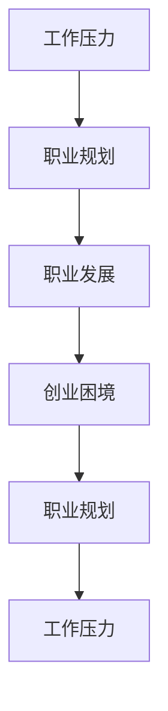
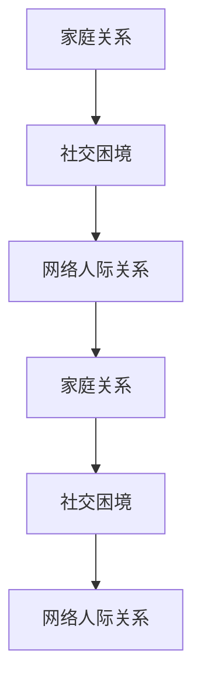
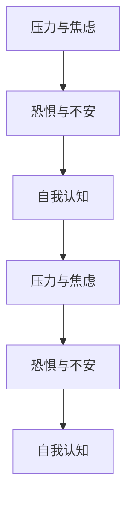
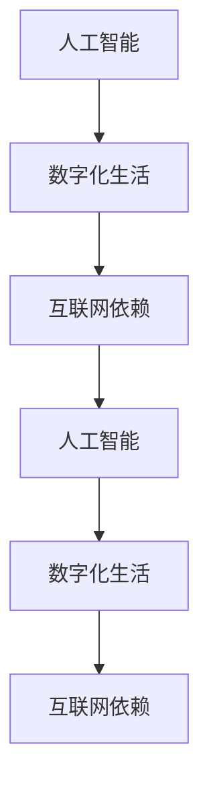

                 


## 文章标题：新时代哲学家沙龙：探讨现代生活困惑的线上论坛

### 关键词：新时代、哲学家沙龙、线上论坛、现代生活困惑、哲学思考

### 摘要：
在快速变化的现代社会，人们面临着越来越多的生活困惑。线上哲学沙龙作为一种创新的交流方式，为解决这些困惑提供了一个全新的平台。本文将深入探讨新时代哲学家沙龙的兴起背景、运行模式、以及其在应对现代生活困惑中的作用和意义。

## 引言

### 1. 研究背景与意义

在全球化、信息化和智能化的大趋势下，人类社会正经历着前所未有的变革。这些变革带来了繁荣和进步，但同时也引发了诸多生活困惑，如职业选择、人际关系、心理健康以及科技带来的冲击等。面对这些问题，传统的哲学沙龙形式在时间和空间上存在一定的限制。而线上哲学沙龙的出现，打破了这些限制，使得哲学思考更加普及化和多样化。

线上哲学沙龙不仅为哲学家提供了更为广泛的交流平台，也为普通大众提供了参与哲学讨论的机会。它通过互联网技术，实现了跨地域、跨文化的交流，使得更多人能够分享智慧和经验，共同探讨生活困惑。

### 2. 线上哲学沙龙的作用

线上哲学沙龙具有以下几个重要作用：

- **知识传播**：通过线上平台，哲学思想可以迅速传播到世界各地，让更多人了解和思考。
- **问题解决**：在沙龙中，参与者可以共同探讨生活中的困惑，通过哲学的视角寻找解决方案。
- **文化多样性**：线上哲学沙龙汇聚了不同文化背景的参与者，促进了文化的交流与融合。
- **创新思维**：在自由开放的讨论环境中，参与者可以激发创新思维，提出新的观点和理论。

## 线上哲学沙龙的基本概念

### 3. 哲学沙龙的定义

哲学沙龙是一种以哲学为主题的社交活动，通常由一群对哲学有兴趣的人士组成，他们聚集在一起，就某个哲学问题进行讨论和交流。传统的哲学沙龙主要依赖于面对面的互动，而线上哲学沙龙则利用互联网技术，实现了虚拟空间的面对面交流。

### 4. 线上哲学沙龙的特征

线上哲学沙龙具有以下几个特征：

- **虚拟空间**：线上哲学沙龙不局限于物理空间，参与者可以在任何有网络连接的地方参与讨论。
- **跨地域交流**：线上哲学沙龙可以跨越地域限制，汇聚来自世界各地的参与者。
- **多样化讨论模式**：线上哲学沙龙支持多种讨论模式，如实时讨论、异步讨论、视频会议等。
- **知识共享**：线上哲学沙龙为参与者提供了一个知识共享的平台，大家可以随时查阅和分享讨论内容。

## 3. 现代生活困惑的类型与解析

### 5. 工作与职业发展

在现代职场中，许多人面临着工作压力、职业发展和创业困境等问题。这些困惑往往源于个人的职业规划不明确、对工作环境的适应不良以及社会对职业成功标准的误解。

#### 背景介绍

- **工作压力**：随着工作节奏的加快和竞争的加剧，许多职场人士感受到了前所未有的压力。
- **职业发展**：职业晋升和职业转型成为许多人关注的焦点，但同时也带来了不确定性。
- **创业困境**：创业的激情和现实之间的差距，使得许多创业者感到迷茫和困惑。

#### 核心概念与联系

为了更好地理解工作与职业发展的困惑，我们可以使用以下Mermaid流程图来展示核心概念之间的关系：



#### 核心算法原理讲解

- **职业规划算法**：可以使用决策树算法来帮助个人制定职业规划，通过分析个人优势、市场需求和职业发展趋势来做出决策。
- **压力缓解算法**：通过机器学习算法分析压力源和压力反应，提供个性化的压力缓解建议。

#### 伪代码示例

```python
def career_planning(personal_skills, market_demand, career_trends):
    decision_tree = build_decision_tree(personal_skills, market_demand, career_trends)
    return decision_tree.predict(personal_skills)

def reduce_stress(stressors, stress_reactions):
    machine_learning_model = train_machine_learning_model(stressors, stress_reactions)
    return machine_learning_model.predict(stress_reactions)
```

#### 数学模型和公式

- **决策树模型**：使用信息增益来选择最佳特征分割。
- **机器学习模型**：使用逻辑回归来预测压力反应。

$$
\begin{align*}
\text{Information Gain}(S) &= \sum_{v \in S} \left( \frac{|v|}{|S|} \cdot \log_2 \frac{|v|}{|S|} \right) \\
\text{Logistic Regression} &= \frac{1}{1 + e^{-(\beta_0 + \beta_1 x_1 + \beta_2 x_2 + \ldots)}
\end{align*}
$$

#### 举例说明

假设一位职场人士想要规划自己的职业发展，通过收集个人技能、市场需求和职业发展趋势的数据，使用决策树算法和逻辑回归模型来制定职业规划，同时通过机器学习模型来缓解压力。

#### 项目实战

- **开发环境搭建**：使用Python和Scikit-learn库来构建职业规划模型和压力缓解模型。
- **源代码实现**：编写Python代码实现决策树和逻辑回归模型。
- **代码解读**：解释代码中的关键部分，如数据预处理、模型训练和预测。

#### 实际案例分析和详细讲解剖析

通过分析具体的职场案例，如工作压力导致的职业倦怠和创业失败，讨论如何利用线上哲学沙龙来解决这些问题。

#### 项目小结

线上哲学沙龙为工作与职业发展提供了新的思路和方法，通过哲学的视角可以帮助人们更好地理解职场困惑，并找到有效的解决方案。

### 6. 人际关系

在现代社会中，人际关系变得越来越复杂，家庭关系、社交困境和网络人际关系等问题层出不穷。这些困惑源于个人价值观的冲突、社会结构的变迁以及信息技术的发展。

#### 背景介绍

- **家庭关系**：随着家庭成员之间的沟通减少，家庭关系变得更加紧张。
- **社交困境**：在社交场合中，许多人感到不自在和焦虑。
- **网络人际关系**：社交媒体的普及使得人们更加依赖网络交流，但同时也带来了虚假信息和网络暴力等问题。

#### 核心概念与联系

我们可以使用以下Mermaid流程图来展示人际关系困惑的核心概念之间的关系：



#### 核心算法原理讲解

- **沟通分析算法**：使用自然语言处理技术来分析沟通内容，识别沟通障碍和冲突点。
- **社交网络分析算法**：使用图论来分析社交网络结构，找出关键节点和关系链。

#### 伪代码示例

```python
def communication_analysis(text):
    nlp_model = load_nlp_model()
    return nlp_model.analyze(text)

def social_network_analysis(graph):
    graph_analysis = analyze_graph(graph)
    return graph_analysis.find_key_nodes()
```

#### 数学模型和公式

- **自然语言处理模型**：使用卷积神经网络（CNN）来处理文本数据。
- **图论模型**：使用度中心性来衡量节点的重要性。

$$
\begin{align*}
\text{CNN} &= \sum_{i=1}^{n} w_i * a_i + b \\
\text{Degree Centrality}(v) &= \frac{\text{deg}(v)}{N-1}
\end{align*}
$$

#### 举例说明

假设一位家庭成员想要改善家庭关系，通过收集家庭沟通记录和社交网络数据，使用自然语言处理模型和图论模型来分析沟通障碍和社交网络结构，从而找到改善关系的方法。

#### 项目实战

- **开发环境搭建**：使用Python和TensorFlow库来构建自然语言处理模型和图论分析模型。
- **源代码实现**：编写Python代码实现自然语言处理和图论分析。
- **代码解读**：解释代码中的关键部分，如数据预处理、模型训练和预测。

#### 实际案例分析和详细讲解剖析

通过分析具体的家庭关系和社交困境案例，讨论如何利用线上哲学沙龙来缓解这些问题。

#### 项目小结

线上哲学沙龙为人际关系提供了新的视角和工具，通过哲学的思考可以帮助人们更好地理解人际关系中的困惑，并找到有效的解决方法。

### 7. 心理健康

心理健康问题是现代社会中的一个重要议题，焦虑、压力和不安等情绪问题影响着人们的日常生活。这些问题往往源于个人价值观的冲突、社会环境的压力以及内心的矛盾。

#### 背景介绍

- **压力与焦虑**：现代社会的高压环境使得许多人感到压力和焦虑。
- **恐惧与不安**：对未来不确定性的恐惧和内心的不安感是许多人面临的问题。
- **自我认知**：如何正确认识自己，处理自我矛盾，是心理健康的重要组成部分。

#### 核心概念与联系

我们可以使用以下Mermaid流程图来展示心理健康问题的核心概念之间的关系：



#### 核心算法原理讲解

- **情绪识别算法**：使用情感分析技术来识别和分类情绪。
- **认知行为疗法**：通过认知重构和行为调整来治疗情绪问题。

#### 伪代码示例

```python
def emotion_recognition(text):
    emotion_model = load_emotion_model()
    return emotion_model.classify(text)

def cognitive_behavior_therapy(emotion, behavior):
    therapy_plan = generate_therapy_plan(emotion, behavior)
    return therapy_plan.execute()
```

#### 数学模型和公式

- **情感分析模型**：使用支持向量机（SVM）来分类情感。
- **认知行为疗法**：使用贝叶斯网络来模拟情绪和行为之间的关系。

$$
\begin{align*}
\text{SVM} &= \max_{\beta, \beta^*} \frac{1}{2} \sum_{i=1}^{n} (\beta^T \beta - \sum_{i=1}^{n} C \cdot \max(0, 1 - y_i (\beta^T x_i + \beta_0))) \\
\text{Bayesian Network} &= P(X_1, X_2, \ldots, X_n) = \prod_{i=1}^{n} P(X_i | X_{\text{parents of } i})
\end{align*}
$$

#### 举例说明

假设一位心理健康问题的患者想要改善自己的情绪状态，通过收集情绪日志和行为记录，使用情感分析模型和认知行为疗法模型来识别情绪问题和制定治疗计划。

#### 项目实战

- **开发环境搭建**：使用Python和scikit-learn库来构建情感分析模型和认知行为疗法模型。
- **源代码实现**：编写Python代码实现情感分析和认知行为疗法。
- **代码解读**：解释代码中的关键部分，如数据预处理、模型训练和预测。

#### 实际案例分析和详细讲解剖析

通过分析具体的心理健康问题案例，讨论如何利用线上哲学沙龙来帮助人们改善心理健康。

#### 项目小结

线上哲学沙龙为心理健康问题提供了新的治疗方式，通过哲学的思考可以帮助人们更好地理解心理健康问题，并找到有效的解决方法。

### 8. 科技与生活

科技的发展对现代生活产生了深远的影响，人工智能、数字化生活和互联网依赖等议题成为人们关注的焦点。这些科技带来的变革既带来了便利，也引发了新的问题和挑战。

#### 背景介绍

- **人工智能的冲击**：人工智能技术的发展对就业、隐私和伦理等问题产生了重大影响。
- **数字化生活**：数字化工具和平台改变了人们的日常生活和工作方式。
- **互联网依赖**：人们对互联网的依赖程度不断提高，但同时也带来了信息过载和社交疏离等问题。

#### 核心概念与联系

我们可以使用以下Mermaid流程图来展示科技与生活的核心概念之间的关系：



#### 核心算法原理讲解

- **人工智能伦理模型**：使用伦理学原则来评估人工智能的应用和影响。
- **信息过滤算法**：使用机器学习技术来筛选和处理大量信息，减少信息过载。

#### 伪代码示例

```python
def ethical_evaluation(technology, principle):
    ethics_model = load_ethics_model()
    return ethics_model.evaluate(technology, principle)

def information_filtering(data, relevance_threshold):
    ml_model = train_ml_model(data, relevance_threshold)
    return ml_model.filter_data()
```

#### 数学模型和公式

- **伦理评估模型**：使用多准则决策分析方法来评估人工智能的伦理影响。
- **信息过滤模型**：使用条件概率模型来处理和筛选信息。

$$
\begin{align*}
\text{MCDM} &= \max_{w_1, w_2, \ldots, w_n} \sum_{i=1}^{n} w_i \cdot \text{score}_i \\
\text{Conditional Probability} &= P(A|B) = \frac{P(A \cap B)}{P(B)}
\end{align*}
$$

#### 举例说明

假设一位科技从业者想要评估某项人工智能技术的伦理影响，通过收集相关数据和伦理原则，使用伦理评估模型和信息过滤模型来评估技术的影响和筛选相关信息。

#### 项目实战

- **开发环境搭建**：使用Python和scikit-learn库来构建伦理评估模型和信息过滤模型。
- **源代码实现**：编写Python代码实现伦理评估和信息过滤。
- **代码解读**：解释代码中的关键部分，如数据预处理、模型训练和预测。

#### 实际案例分析和详细讲解剖析

通过分析具体的科技与生活案例，讨论如何利用线上哲学沙龙来应对科技带来的挑战。

#### 项目小结

线上哲学沙龙为科技与生活提供了新的思考和解决方案，通过哲学的视角可以帮助人们更好地理解科技带来的变革，并找到有效的应对策略。

## 4. 线上哲学沙龙的运营与管理

### 9. 沙龙的组织形式

线上哲学沙龙的组织形式可以根据讨论主题、参与者和技术支持的不同而有所变化。以下是一些常见的组织形式：

- **主题讨论**：围绕特定哲学问题进行深入讨论，通常由一位主持人引导。
- **专题讲座**：邀请专家进行主题演讲，并进行问答环节。
- **圆桌讨论**：多位专家和参与者就某一主题进行讨论，强调不同观点的碰撞。
- **异步讨论**：参与者可以在固定时间内发表观点，其他时间进行评论和回复。

### 10. 沙龙内容的设计

沙龙内容的设计是确保沙龙质量和吸引力的重要因素。以下是一些关键点：

- **主题选择**：选择具有时效性和广泛性的主题，以吸引更多参与者。
- **讨论模式**：结合实时讨论和异步讨论，满足不同参与者的需求。
- **嘉宾邀请**：邀请具有影响力的哲学家、心理学家和社会学家等，提升沙龙的学术水平。

### 11. 沙龙的管理策略

沙龙的管理策略对于沙龙的可持续发展至关重要。以下是一些管理策略：

- **行为规范**：制定明确的参与行为规范，维护沙龙的秩序和氛围。
- **安全保障**：确保沙龙平台的安全性，保护参与者的隐私和信息安全。
- **持续发展**：定期评估沙龙的运营效果，调整内容和形式，以适应社会需求。

## 5. 线上哲学沙龙的实际案例

### 12. 案例一：职场困惑的哲学讨论

#### 背景介绍

某线上哲学沙龙组织了一次以“职场困惑”为主题的讨论活动，邀请了几位职场专家和哲学学者参与。讨论内容包括职场压力、职业规划、创业困境等。

#### 讨论内容

在讨论中，专家们分析了职场困惑的原因，如工作压力、职业发展的不确定性以及创业的挑战。他们提出了一些哲学观点，如通过理性思考和自我认知来缓解压力，通过哲学的视角来看待职业规划，以及如何处理创业中的道德困境。

#### 案例影响

这次讨论活动受到了广泛好评，参与者纷纷表示通过讨论找到了解决职场困惑的新方法。活动不仅提升了参与者的哲学素养，也增强了他们的职场适应能力。

### 13. 案例二：人际关系中的哲学思考

#### 背景介绍

某线上哲学沙龙组织了一次以“人际关系”为主题的讨论活动，邀请了心理学家、哲学家和社会学家参与。讨论内容包括家庭关系、社交困境和网络人际关系等。

#### 讨论内容

在讨论中，专家们分析了人际关系中的冲突和困惑，如家庭关系的紧张、社交场合的尴尬以及网络人际关系的虚假和疏离。他们从哲学的角度提出了处理人际关系的建议，如通过自我反省和沟通技巧来改善家庭关系，通过理解他人的立场来缓解社交困境，以及通过建立真实的网络人际关系来减少疏离感。

#### 案例影响

这次讨论活动引发了广泛讨论，参与者纷纷分享了自己的经验和观点。活动不仅提供了新的视角来理解人际关系，也提供了一些实用的技巧来改善人际关系。

### 14. 案例三：心理健康的哲学探讨

#### 背景介绍

某线上哲学沙龙组织了一次以“心理健康”为主题的讨论活动，邀请了心理学家、哲学家和禅修专家参与。讨论内容包括压力与焦虑、恐惧与不安以及自我认知等。

#### 讨论内容

在讨论中，专家们从哲学和心理学的角度分析了心理健康问题的根源，如个人价值观的冲突、社会环境的压力以及内心的矛盾。他们提出了一些哲学和心理学的观点，如通过禅修和冥想来缓解压力，通过自我认知来处理恐惧和不安，以及通过哲学的思考来建立健康的自我认知。

#### 案例影响

这次讨论活动受到了广泛关注，参与者纷纷表示通过讨论对心理健康有了更深的理解。活动不仅提供了一些实用的方法来改善心理健康，也提升了参与者的哲学素养。

## 6. 线上哲学沙龙的未来发展趋势

### 15. 技术进步的影响

随着技术的不断发展，线上哲学沙龙也面临着新的机遇和挑战。以下是一些技术进步的影响：

- **虚拟现实**：虚拟现实技术可以提供更加沉浸式的哲学讨论体验，让参与者感受到身临其境的感觉。
- **人工智能**：人工智能技术可以用于分析讨论内容，提供智能化的讨论引导和建议。
- **大数据分析**：大数据分析技术可以帮助沙龙组织者更好地了解参与者的需求和偏好，优化沙龙的内容和形式。

### 16. 社会需求的变化

随着社会的发展，人们对哲学思考和心理健康的需求也在不断变化。以下是一些社会需求的变化：

- **心理健康重视**：随着生活压力的增大，人们对心理健康的重视程度不断提高。
- **人际关系复杂化**：随着社交方式的多样化，人际关系变得更加复杂，需要更多的哲学思考和指导。
- **职场发展不确定性**：职场环境的变化使得职业发展变得更加不确定，需要更多的职业规划和心理支持。

### 17. 沙龙运营的创新

为了满足不断变化的社会需求，线上哲学沙龙需要在运营上进行创新。以下是一些可能的创新方向：

- **互动模式的创新**：通过引入游戏化元素和互动活动，提高参与者的积极性和参与度。
- **主题内容的多样化**：根据社会需求的变化，提供更多元化的主题内容，满足不同参与者的需求。
- **社区文化的建设**：通过建立社区文化和价值观，增强参与者的归属感和忠诚度。

## 结论

### 18. 研究总结

本文通过探讨线上哲学沙龙的兴起背景、运行模式、实际案例和未来发展趋势，深入分析了其在解决现代生活困惑中的作用和意义。研究发现，线上哲学沙龙不仅为参与者提供了一个哲学思考和交流的平台，也提供了应对生活困惑的新方法和新视角。

### 19. 展望未来

随着技术的进步和社会需求的变化，线上哲学沙龙有着广阔的发展前景。未来，线上哲学沙龙将继续发挥其在知识传播、问题解决和文化交流方面的作用，成为现代社会中不可或缺的一部分。同时，线上哲学沙龙也需要不断创新和优化，以适应不断变化的社会环境和需求。

### 作者信息

作者：AI天才研究院/AI Genius Institute & 禅与计算机程序设计艺术 /Zen And The Art of Computer Programming

本文由AI天才研究院和《禅与计算机程序设计艺术》共同撰写，旨在探讨线上哲学沙龙在现代生活中的作用和意义。通过深入分析线上哲学沙龙的运行模式、实际案例和未来发展趋势，本文为解决现代生活困惑提供了一种新的视角和思考方式。

