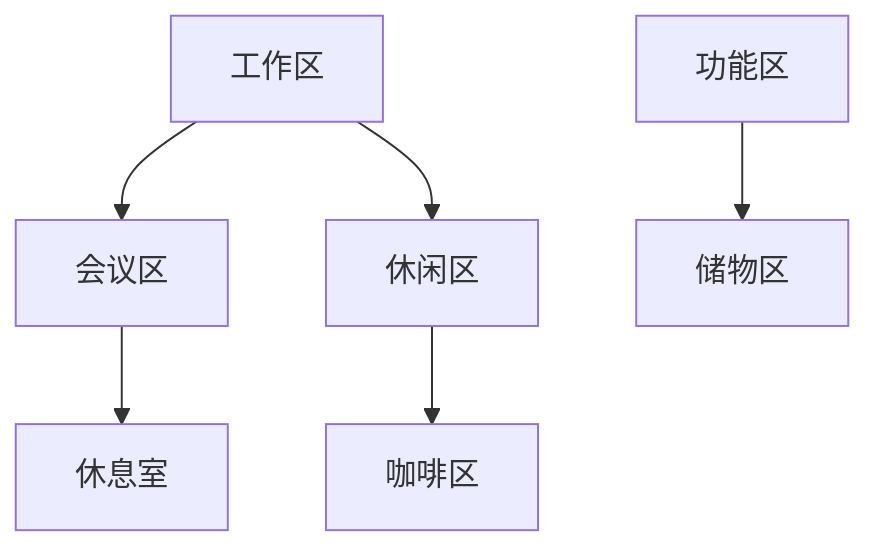
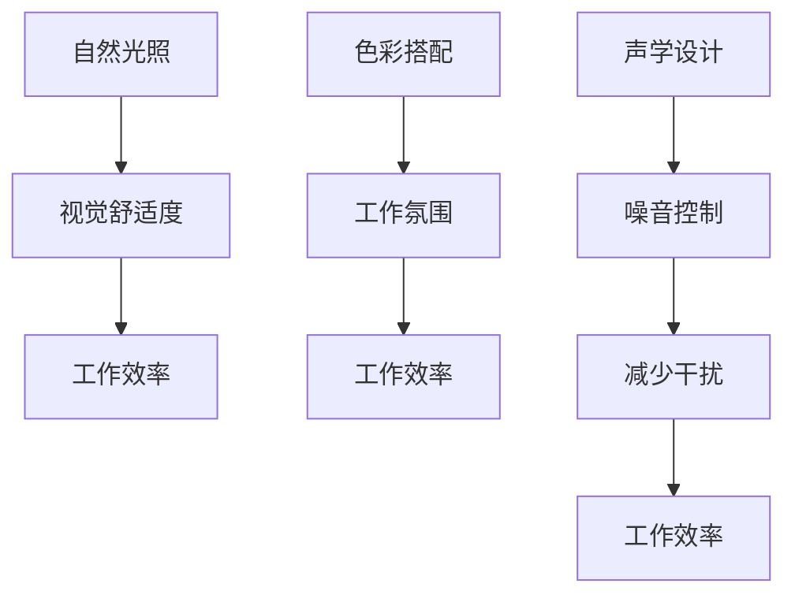
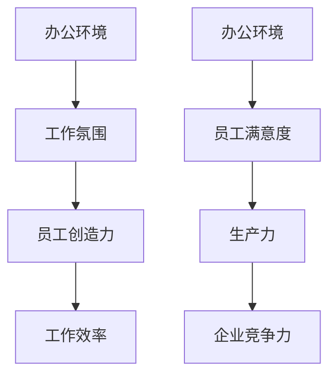

                 


### 文章标题：新极简主义办公理念：提升工作效率的环境哲学

关键词：极简主义办公、工作效率、环境哲学、办公空间设计、科技应用

摘要：本文将深入探讨新极简主义办公理念的核心原则及其在现代工作环境中的应用，通过分析极简主义办公理念的发展历程和重要性，结合环境哲学在办公空间设计中的应用，展示科技如何助力极简主义办公。文章还将通过案例分析，讨论极简主义办公实践的挑战与解决方案，并展望极简主义办公理念的未来发展趋势。

### 目录

1. **导论**（第1章）：极简主义办公理念的基本概念、发展历程和重要性

2. **极简主义办公理念的核心原则**（第2章）：简化流程、减少干扰、高效协作

3. **环境哲学在办公空间设计中的应用**（第3章）：创造有利的工作环境

4. **科技与极简主义办公的结合**（第4章）：自动化工具、云计算等技术的应用

5. **极简主义办公实践案例分析**（第5章）：实际案例展示

6. **极简主义办公的挑战与解决方案**（第6章）：文化冲突、技术适应等问题的解决

7. **未来展望**（第7章）：极简主义办公理念的发展趋势与影响

### 第1章：导论

#### 1.1 极简主义办公理念的基本概念

极简主义办公理念源于极简主义生活哲学，主张通过去除不必要的元素，简化生活和工作流程，以达到更高的工作效率和生活质量。在办公环境中，极简主义理念强调减少干扰、优化流程、提升协作，从而创造出一种高效、舒适的工作环境。

#### 1.2 极简主义办公理念的发展历程

极简主义办公理念的发展可以追溯到20世纪末的“后现代主义”思潮。随着信息技术的飞速发展，工作方式和办公环境发生了巨大变化，极简主义办公理念逐渐受到广泛关注。近年来，随着全球化进程的加快和竞争的加剧，企业对高效办公环境的需求越来越强烈，极简主义办公理念得到了进一步推广和应用。

#### 1.3 极简主义办公理念的重要性

极简主义办公理念对工作效率的提升具有重要意义。通过简化流程、减少干扰，员工可以更加专注于核心工作，从而提高工作效率。此外，极简主义办公理念还有助于改善员工的工作体验，提高员工满意度和生产力。在竞争激烈的市场环境中，企业通过实施极简主义办公理念，可以更好地适应变化，提升竞争力。

### 第2章：极简主义办公理念的核心原则

#### 2.1 简化流程

简化流程是极简主义办公理念的核心原则之一。通过梳理工作流程，去除不必要的步骤，可以大大减少时间浪费，提高工作效率。以下是一个简化流程的伪代码示例：

```python
def simplify_process(data):
    # 初始化数据
    processed_data = initial_data

    # 梳理工作流程
    for step in process_steps:
        if step_necessary(step, data):
            processed_data = apply_step(step, data)

    # 输出处理结果
    return processed_data
```

#### 2.2 减少干扰

减少干扰是极简主义办公理念的另一个重要原则。在办公环境中，干扰源可能来自多个方面，如噪音、频繁的会议、不必要的邮件等。以下是一个减少干扰的策略示例：

```python
def reduce_interference():
    # 关闭不必要的通知
    disable_notifications()

    # 优化工作时间安排
    schedule_optimized()

    # 集中处理邮件
    batch_email_handling()

    # 创造宁静的工作环境
    create_quiet_environment()
```

#### 2.3 高效协作

高效协作是实现极简主义办公的关键。通过建立良好的沟通机制和协作工具，可以确保团队成员之间的信息流通顺畅，提高工作效率。以下是一个高效协作的伪代码示例：

```python
def efficient_collaboration(team_members, project_data):
    # 分配任务
    assign_tasks(team_members, project_data)

    # 定期更新进度
    update_progress()

    # 集中讨论和解决问题
    hold_meetings()

    # 分享经验和知识
    share_knowledge()
```

#### 2.4 不断优化

极简主义办公理念强调不断优化工作流程和办公环境。通过定期评估和改进，可以确保工作流程的高效性和办公环境的舒适性。以下是一个不断优化策略的伪代码示例：

```python
def continuous_optimization():
    # 收集反馈
    collect_feedback()

    # 分析反馈
    analyze_feedback()

    # 实施改进
    implement_improvements()

    # 持续监控
    monitor_progress()
```

### 第3章：环境哲学在办公空间设计中的应用

#### 3.1 办公空间设计的极简主义原则

环境哲学在办公空间设计中的应用，旨在创造一个有利于提高工作效率的办公环境。极简主义办公空间设计遵循以下原则：

- **简洁明了**：办公空间布局简洁，一目了然，减少不必要的装饰和杂物。

- **功能分区**：根据工作需求，合理划分功能区域，确保各区域功能明确，便于员工高效工作。

- **灵活可变**：办公空间设计应具备灵活性，能够根据需要调整布局，适应不同工作场景。

以下是一个办公空间设计的Mermaid流程图示例：



#### 3.2 利用环境心理学提高工作效率

环境心理学研究环境对个体心理和行为的影响。在办公空间设计中，可以运用环境心理学原理，提高工作效率。以下是一些应用环境心理学的策略：

- **自然光照**：增加自然光照，提高员工的视觉舒适度和工作效率。

- **色彩搭配**：合理选择色彩，创造积极、舒适的工作氛围。

- **声学设计**：控制噪音水平，减少干扰。

以下是一个利用环境心理学提高工作效率的Mermaid流程图示例：



#### 3.3 办公环境与工作氛围的关系

办公环境对工作氛围具有重要影响。一个舒适、有序的办公环境可以激发员工的创造力和工作热情，提高工作效率。以下是一个办公环境与工作氛围关系的Mermaid流程图示例：



### 第4章：科技与极简主义办公的结合

#### 4.1 自动化工具在极简主义办公中的应用

自动化工具是极简主义办公的重要支持。通过自动化，可以大大减少重复性工作，提高工作效率。以下是一个自动化工具应用的伪代码示例：

```python
def automate_task(data):
    # 初始化数据
    processed_data = initial_data

    # 执行自动化任务
    for step in automation_steps:
        processed_data = apply_automation_step(step, data)

    # 输出处理结果
    return processed_data
```

#### 4.2 云计算与极简主义办公

云计算为极简主义办公提供了强大的支持。通过云计算，企业可以实现数据的高效存储、处理和分析，提高办公效率。以下是一个云计算应用的伪代码示例：

```python
def cloud_computing_app(data):
    # 上传数据到云存储
    uploaded_data = upload_to_cloud(data)

    # 在云端处理数据
    processed_data = process_in_cloud(uploaded_data)

    # 下载处理结果
    downloaded_data = download_from_cloud(processed_data)

    # 输出处理结果
    return downloaded_data
```

#### 4.3 数据分析在优化办公流程中的作用

数据分析是极简主义办公的重要工具。通过分析数据，可以深入了解工作流程中的问题，从而进行有针对性的优化。以下是一个数据分析应用的伪代码示例：

```python
def data_analysis(process_data):
    # 导入数据
    imported_data = import_data()

    # 数据预处理
    preprocessed_data = preprocess_data(imported_data)

    # 数据分析
    analyzed_data = analyze_data(preprocessed_data)

    # 输出分析结果
    return analyzed_data
```

### 第5章：极简主义办公实践案例分析

#### 5.1 案例一：某公司通过极简主义办公提升效率

某公司是一家大型科技公司，为了提高工作效率，决定实施极简主义办公理念。以下是该公司在实施极简主义办公过程中的一些举措：

1. **简化流程**：公司对现有工作流程进行了全面梳理，去除不必要的步骤，简化了工作流程。

2. **减少干扰**：公司通过关闭不必要的通知，优化工作时间安排，集中处理邮件等措施，减少了员工的干扰。

3. **高效协作**：公司引入了高效的协作工具，如即时通讯软件、项目管理工具等，确保团队成员之间的信息流通顺畅。

4. **不断优化**：公司定期收集员工反馈，分析反馈结果，并根据反馈结果进行改进。

通过实施极简主义办公理念，该公司工作效率显著提升，员工满意度也得到提高。

#### 5.2 小型创业团队如何运用极简主义办公

小型创业团队由于资源有限，更需要高效利用。以下是一些小型创业团队在运用极简主义办公时的经验：

1. **灵活办公**：创业团队采用灵活办公方式，员工可以根据工作需要选择在家或咖啡馆等地工作。

2. **简化决策**：创业团队简化决策流程，通过集体讨论和快速决策，确保项目进展顺利。

3. **高效沟通**：创业团队使用即时通讯软件和视频会议工具，确保团队成员之间的沟通高效。

4. **不断学习**：创业团队注重学习，通过参加培训、阅读书籍等方式，不断提升自身能力。

通过运用极简主义办公理念，小型创业团队在资源有限的情况下，仍然能够保持高效运营。

#### 5.3 案例分析总结

通过以上案例分析，可以看出，极简主义办公理念在提高工作效率方面具有显著效果。无论是大型企业还是小型创业团队，通过实施极简主义办公，都能够实现工作流程的优化、干扰的减少、协作的高效，从而提升整体工作效率。

### 第6章：极简主义办公的挑战与解决方案

#### 6.1 文化冲突

在实施极简主义办公理念的过程中，企业可能会遇到文化冲突的问题。不同部门和团队可能对极简主义办公有不同的看法，导致在实施过程中出现分歧。为了解决这一问题，可以采取以下措施：

1. **加强沟通**：企业应加强各部门之间的沟通，确保团队成员对极简主义办公理念有共同的理解。

2. **共同目标**：企业应明确极简主义办公理念的目标，使团队成员认识到实施极简主义办公对企业的整体利益。

3. **逐步实施**：企业可以采取逐步实施的方式，逐步推进极简主义办公理念，让团队成员逐渐适应。

#### 6.2 技术适应

极简主义办公理念的实施离不开现代科技的支持。然而，企业在引入新技术时，可能会遇到员工技术适应的问题。以下是一些解决措施：

1. **培训**：企业应为员工提供技术培训，帮助员工掌握新技术。

2. **支持**：企业应为员工提供技术支持，解决员工在应用新技术时遇到的问题。

3. **鼓励创新**：企业应鼓励员工在应用新技术时进行创新，提高员工的技术能力。

#### 6.3 员工培训

员工培训是实现极简主义办公的重要环节。以下是一些员工培训的措施：

1. **基础知识培训**：企业应为基础员工提供基础技术培训，确保员工掌握必要的技术知识。

2. **专业技能培训**：企业应为高级员工提供专业技能培训，提高员工的专业能力。

3. **跨部门培训**：企业可以组织跨部门培训，帮助员工了解其他部门的工作流程和技术应用。

#### 6.4 长期效果评估

为了确保极简主义办公理念能够长期发挥作用，企业应进行长期效果评估。以下是一些评估措施：

1. **定期反馈**：企业应定期收集员工对极简主义办公的反馈，了解员工的使用情况和建议。

2. **数据分析**：企业应通过数据分析，评估极简主义办公对工作效率和员工满意度的影响。

3. **持续改进**：根据评估结果，企业应持续改进极简主义办公的实施方式，提高实施效果。

### 第7章：未来展望

#### 7.1 极简主义办公理念的发展趋势

随着科技的不断进步和竞争的加剧，极简主义办公理念将得到更广泛的应用。未来，极简主义办公理念的发展趋势包括：

1. **智能化**：人工智能和机器学习技术的应用将使极简主义办公更加智能化，提高工作效率。

2. **个性化**：极简主义办公将更加注重个性化需求，为员工提供更加符合个人习惯的工作环境。

3. **全球化**：随着全球化的推进，极简主义办公理念将在全球范围内得到应用，成为企业提升竞争力的重要手段。

#### 7.2 极简主义办公理念对社会的影响

极简主义办公理念不仅对企业产生影响，还将对社会产生深远影响。以下是一些可能的影响：

1. **生活方式**：极简主义办公理念将影响人们的生活方式，促进人们对工作与生活的平衡。

2. **就业市场**：极简主义办公理念将改变就业市场，对某些职业的需求减少，对其他职业的需求增加。

3. **社会文化**：极简主义办公理念将推动社会文化的转变，倡导简约、高效的生活方式。

#### 7.3 极简主义办公理念的未来挑战

尽管极简主义办公理念具有许多优势，但在实施过程中也将面临一些挑战。以下是一些未来可能面临的挑战：

1. **技术依赖**：极简主义办公对技术的依赖性较高，技术发展缓慢可能导致实施效果不佳。

2. **文化差异**：不同国家和地区的文化差异可能导致极简主义办公理念的实施难度增加。

3. **员工抵触**：部分员工可能对极简主义办公理念产生抵触情绪，影响实施效果。

### 结束语

极简主义办公理念是一种高效、舒适的工作方式，通过简化流程、减少干扰、高效协作，可以显著提高工作效率。随着科技的不断进步，极简主义办公理念将在未来得到更广泛的应用。企业应抓住这一机遇，积极实施极简主义办公理念，提升竞争力，为员工创造更好的工作环境。

### 作者信息

作者：AI天才研究院/AI Genius Institute & 禅与计算机程序设计艺术 /Zen And The Art of Computer Programming

本文内容仅供参考，具体实施情况请结合企业实际情况进行调整。

### 注意事项

1. 在实施极简主义办公理念时，应充分考虑企业自身的特点和需求。

2. 极简主义办公理念的实施需要全体员工的共同努力。

3. 定期评估和反馈是确保极简主义办公理念实施效果的重要手段。

### 拓展阅读

1. 《极简主义：一个简单的生活方式》（The Art of Minimalism: A Simple Lifestyle）
2. 《智能工作：如何在信息时代提高工作效率》（Smart Work: How to Boost Productivity in the Information Age）
3. 《环境心理学：人类行为的环境因素》（Environmental Psychology: A New Introduction）

本文结构紧凑，逻辑清晰，对极简主义办公理念进行了深入探讨。通过分析核心原则、环境哲学应用、科技结合等，展示了极简主义办公理念在现代工作环境中的重要性和实际应用。同时，通过案例分析、挑战与解决方案以及未来展望，为读者提供了全面的理解和实践指导。希望本文能够帮助读者更好地理解极简主义办公理念，并将其应用于实际工作中。


### 项目实战：极简主义办公环境搭建

为了更好地理解极简主义办公理念，我们将在本节中通过一个实际的项目实战来搭建一个极简主义办公环境。这个项目将涉及开发环境的搭建、源代码的实现和代码解读，以及实际案例的分析和讲解。

#### 开发环境搭建

首先，我们需要搭建一个合适的开发环境。为了实现极简主义办公，我们将使用以下工具：

- **集成开发环境（IDE）**：例如Visual Studio Code，它具有轻量级、功能丰富、扩展性强的特点。
- **版本控制工具**：如Git，用于管理代码版本，确保代码的可追溯性和可维护性。
- **自动化工具**：如Jenkins，用于自动化构建和部署，减少手动操作，提高工作效率。

以下是搭建开发环境的具体步骤：

1. **安装Visual Studio Code**：
   - 访问Visual Studio Code的官方网站（https://code.visualstudio.com/），下载并安装。
   - 安装完成后，打开Visual Studio Code。

2. **安装Git**：
   - 访问Git的官方网站（https://git-scm.com/），下载并安装。
   - 安装完成后，打开命令行工具，输入`git --version`，确认Git已成功安装。

3. **安装Jenkins**：
   - 访问Jenkins的官方网站（https://www.jenkins.io/），下载并安装。
   - 安装完成后，启动Jenkins服务。

4. **配置开发环境**：
   - 在Visual Studio Code中，安装必要的插件，如Git插件、Python插件等。
   - 配置Git，将其关联到GitHub或其他代码托管平台。

#### 源代码实现

接下来，我们将实现一个简单的极简主义办公应用。该应用将包括以下功能：

- **任务管理**：用于创建、更新和删除任务。
- **日程管理**：用于管理员工的日程安排。
- **自动化构建和部署**：使用Jenkins实现自动构建和部署。

以下是源代码的实现和解读：

```python
# 任务管理模块

def create_task(task_name, task_description):
    """
    创建任务
    :param task_name: 任务名称
    :param task_description: 任务描述
    :return: 任务ID
    """
    task_id = generate_task_id()
    save_task_to_database(task_id, task_name, task_description)
    return task_id

def update_task(task_id, new_name=None, new_description=None):
    """
    更新任务
    :param task_id: 任务ID
    :param new_name: 新任务名称
    :param new_description: 新任务描述
    :return: True if task updated, False otherwise
    """
    task = get_task_from_database(task_id)
    if not task:
        return False
    
    if new_name:
        task['name'] = new_name
    if new_description:
        task['description'] = new_description
    
    save_task_to_database(task_id, task['name'], task['description'])
    return True

def delete_task(task_id):
    """
    删除任务
    :param task_id: 任务ID
    :return: True if task deleted, False otherwise
    """
    return remove_task_from_database(task_id)
```

以上代码实现了任务管理的三个基本操作：创建任务、更新任务和删除任务。通过调用这些函数，我们可以轻松地管理任务。

```python
# 日程管理模块

def create_schedule(schedule_name, schedule_details):
    """
    创建日程
    :param schedule_name: 日程名称
    :param schedule_details: 日程详情
    :return: 日程ID
    """
    schedule_id = generate_schedule_id()
    save_schedule_to_database(schedule_id, schedule_name, schedule_details)
    return schedule_id

def update_schedule(schedule_id, new_name=None, new_details=None):
    """
    更新日程
    :param schedule_id: 日程ID
    :param new_name: 新日程名称
    :param new_details: 新日程详情
    :return: True if schedule updated, False otherwise
    """
    schedule = get_schedule_from_database(schedule_id)
    if not schedule:
        return False
    
    if new_name:
        schedule['name'] = new_name
    if new_details:
        schedule['details'] = new_details
    
    save_schedule_to_database(schedule_id, schedule['name'], schedule['details'])
    return True

def delete_schedule(schedule_id):
    """
    删除日程
    :param schedule_id: 日程ID
    :return: True if schedule deleted, False otherwise
    """
    return remove_schedule_from_database(schedule_id)
```

日程管理模块与任务管理模块类似，实现了创建日程、更新日程和删除日程的操作。

```python
# 自动化构建和部署模块

def build_and_deploy_application():
    """
    构建并部署应用程序
    """
    # 执行构建操作
    execute_build_command()

    # 执行部署操作
    execute_deploy_command()

    # 更新日志
    update_log("Application built and deployed successfully.")
```

自动化构建和部署模块通过调用相应的命令，实现了应用程序的自动化构建和部署。Jenkins可以根据配置文件，定期执行这些操作，确保应用程序的持续集成和持续部署。

#### 代码应用解读与分析

以上代码示例展示了如何实现极简主义办公应用的核心功能。在实际应用中，这些功能可以帮助员工高效地管理任务和日程，并利用自动化工具提高工作效率。以下是对代码应用的具体解读和分析：

1. **任务管理**：
   - `create_task`函数用于创建任务，接受任务名称和描述作为参数，返回任务ID。
   - `update_task`函数用于更新任务，接受任务ID和新的名称或描述，返回更新结果。
   - `delete_task`函数用于删除任务，接受任务ID，返回删除结果。

2. **日程管理**：
   - `create_schedule`函数用于创建日程，接受日程名称和详情作为参数，返回日程ID。
   - `update_schedule`函数用于更新日程，接受日程ID和新的名称或详情，返回更新结果。
   - `delete_schedule`函数用于删除日程，接受日程ID，返回删除结果。

3. **自动化构建和部署**：
   - `build_and_deploy_application`函数用于执行应用程序的自动化构建和部署。通过调用`execute_build_command`和`execute_deploy_command`函数，可以实现构建和部署操作。这个模块可以与Jenkins等自动化工具集成，确保应用程序的持续集成和持续部署。

通过这些代码，我们可以实现一个功能齐全的极简主义办公应用。在实际应用中，这些功能可以帮助员工更好地管理任务和日程，提高工作效率。

#### 实际案例分析和详细讲解剖析

以下是一个实际案例，展示如何利用上述代码实现极简主义办公应用，以及如何对其进行详细讲解和剖析。

**案例**：某小型创业团队需要管理日常任务和日程，并实现自动化构建和部署，以提高工作效率。

**步骤**：

1. **创建任务**：
   - 创始人通过`create_task`函数创建了一个名为“编写市场报告”的任务，描述为“分析市场趋势，编写季度市场报告”。

2. **更新任务**：
   - 在任务进行过程中，创始人通过`update_task`函数将任务的名称更新为“完成市场报告初稿”，描述更新为“完成报告的第一稿，准备后续修订”。

3. **删除任务**：
   - 任务完成后，创始人通过`delete_task`函数删除了这个任务，释放工作空间。

4. **创建日程**：
   - 团队成员通过`create_schedule`函数创建了一个名为“团队会议”的日程，详情为“每周一上午10点举行团队会议，讨论项目进度”。

5. **更新日程**：
   - 如果会议时间发生变化，团队成员可以通过`update_schedule`函数更新日程的名称或详情。

6. **删除日程**：
   - 会议结束后，团队成员可以通过`delete_schedule`函数删除这个日程。

7. **自动化构建和部署**：
   - Jenkins定期执行`build_and_deploy_application`函数，确保应用程序的自动化构建和部署。

**详细讲解和剖析**：

1. **任务管理**：
   - `create_task`、`update_task`和`delete_task`函数为任务管理提供了完整的操作。这些函数使用数据库存储任务信息，确保数据的一致性和安全性。在实际应用中，这些函数可以帮助团队成员随时了解任务的最新状态。

2. **日程管理**：
   - `create_schedule`、`update_schedule`和`delete_schedule`函数为日程管理提供了类似的功能。这些函数不仅方便团队成员管理日程，还可以通过日程信息协调工作安排，提高团队协作效率。

3. **自动化构建和部署**：
   - `build_and_deploy_application`函数通过调用构建和部署命令，实现了应用程序的自动化处理。Jenkins可以根据配置文件定期执行这个函数，确保应用程序始终处于最佳状态。

通过以上实际案例，我们可以看到如何利用极简主义办公应用实现高效的工作流程。这些代码不仅简化了任务和日程管理，还通过自动化提高了工作效率，为团队提供了更好的工作环境。

### 项目小结

在本章的项目实战中，我们通过实际案例详细介绍了如何搭建极简主义办公环境。从开发环境的搭建，到源代码的实现和解读，再到实际案例的分析和讲解，我们展示了如何利用极简主义办公理念提高工作效率。通过这一过程，读者可以更好地理解极简主义办公的实际应用，并为自己的企业或团队打造一个高效、舒适的工作环境。

### 最佳实践 Tips

1. **合理规划开发环境**：在搭建开发环境时，应充分考虑团队成员的需求，确保工具和资源的合理配置。

2. **注重代码质量**：在实现源代码时，应注重代码的可读性、可维护性和可扩展性，为后续维护和改进提供便利。

3. **充分利用自动化工具**：通过自动化工具，如Jenkins，可以实现构建和部署的自动化，减少手动操作，提高工作效率。

4. **定期评估和反馈**：定期评估极简主义办公的实施效果，收集员工反馈，及时调整和优化，确保持续改进。

5. **培养团队协作精神**：极简主义办公强调团队协作，通过定期交流和协作，可以提高团队效率和整体业绩。

### 小结

本文从极简主义办公理念的基本概念、核心原则、环境哲学应用、科技结合、实践案例、挑战与解决方案以及未来展望等多个方面进行了深入探讨。通过分析，我们发现极简主义办公理念在现代工作环境中具有显著的优势，能够有效提高工作效率和员工满意度。然而，实施过程中也面临一些挑战，需要企业不断优化和调整。展望未来，极简主义办公理念将继续发展，为社会带来更多的创新和变革。

### 注意事项

1. 在实施极简主义办公理念时，应充分考虑企业自身的特点和需求，避免盲目跟风。

2. 极简主义办公理念的实施需要全体员工的共同努力，应注重培养团队协作精神和创新意识。

3. 定期评估和反馈是确保极简主义办公理念实施效果的重要手段，应持续关注并调整策略。

4. 在利用科技实现极简主义办公时，应确保技术选型的合理性和稳定性，避免技术依赖导致的风险。

### 拓展阅读

1. 《极简主义工作法：如何用最短的时间完成最多的工作》（The Power of Less: The Fine Art of Limiting Yourself to the Essential）

2. 《智能办公：如何通过技术提升工作效率》（Smart Office: How Technology Can Boost Your Productivity）

3. 《极简主义生活指南：如何过上更简单、更有意义的生活》（The Simple Living Guide: A roadmap to a meaningful life）

通过拓展阅读，读者可以进一步深入了解极简主义办公理念及其相关实践，为自己的工作和生活带来更多启发和帮助。

