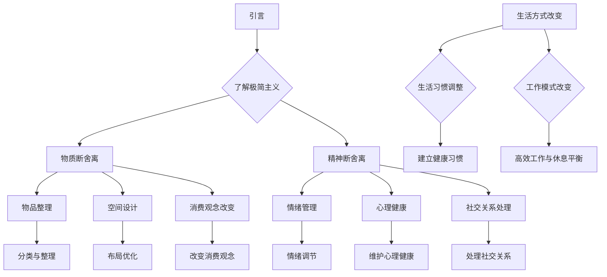

                 


## 1. 文章标题与关键词
### 《新极简主义生活设计：物质与精神双重断舍离指南》
关键词：极简主义、生活设计、物质断舍离、精神断舍离、双重断舍离、生活方式优化

## 2. 摘要
本文旨在探讨新极简主义生活设计的理念与实践，强调物质与精神双重断舍离的重要性。通过分析极简主义的核心概念及其相互关系，本文将介绍如何进行物品整理、空间设计和消费观念改变，同时探讨情绪管理、心理健康和社交关系处理等精神层面的断舍离方法。文章还将结合实际案例，展示如何将极简主义理念应用到日常生活中，以提升生活质量和幸福感。本文结构紧凑，逻辑清晰，旨在为读者提供一份实用且具有启发性的极简主义生活设计指南。

## 3. 引言
### 极简主义生活理念与当代社会的关系
在当代社会，极简主义生活理念逐渐成为了一种重要的生活方式选择。随着科技的飞速发展和社会节奏的加快，人们面临着越来越多的物质和精神负担。极简主义提倡减少不必要的物质和情感负担，追求简单、高效、有质量的生活。这种理念不仅有助于提升个人的生活质量，还能帮助社会实现可持续发展。

### 物质与精神双重断舍离的必要性和意义
物质断舍离关注的是减少物质负担，提高生活质量；精神断舍离则注重心理层面的轻装上阵，提升个人幸福感。双重断舍离的必要性在于，它们共同构建了极简主义生活的核心。物质断舍离能够帮助我们摆脱消费主义的陷阱，回归生活的本质；而精神断舍离则能帮助我们摆脱焦虑和压力，享受内心的宁静。本文将深入探讨这两种断舍离方法，并提供实用的实践指导。

## 4. 核心概念与联系
### 核心概念
#### 物质断舍离
物质断舍离是指通过减少物质 possessions 和消耗来提高生活质量。它包括物品整理、空间设计和消费观念改变等方面。物质断舍离的核心在于去除多余的物品，使生活空间更加整洁、有序。

#### 精神断舍离
精神断舍离是指通过调整心态和行为来减少精神负担，提升个人幸福感。它包括情绪管理、心理健康和社交关系处理等方面。精神断舍离的核心在于摆脱负面情绪和压力，使心灵得到放松和满足。

### 相互关系
物质与精神双重断舍离之间存在密切的联系。物质断舍离有助于减轻物质负担，创造一个整洁、舒适的生活环境，从而有助于精神断舍离的实现。同样，精神断舍离可以提升个人的情绪和心理健康，使个体更加有精力去进行物质断舍离。两者相辅相成，共同构建了极简主义生活的核心。

### Mermaid流程图
下面是一个简化的Mermaid流程图，展示了物质断舍离和精神断舍离之间的关系：
```
graph TB
    A[极简主义生活设计] --> B[物质断舍离]
    A --> C[精神断舍离]
    B --> D[物品整理]
    B --> E[空间设计]
    B --> F[消费观念改变]
    C --> G[情绪管理]
    C --> H[心理健康]
    C --> I[社交关系处理]
    D --> J[提高生活质量]
    E --> J
    F --> J
    G --> J
    H --> J
    I --> J
```

## 5. 物质断舍离
### 5.1 物品整理
#### 如何进行物品分类与整理
物品整理是物质断舍离的基础。以下是进行物品整理的步骤和伪代码：
```
// 伪代码：物品整理步骤
function organizeItems():
    # 初始化物品列表
    items = ["书籍", "衣物", "电子产品", "厨房用品", "杂物"]

    # 分类物品
    categories = ["必需品", "备用品", "废弃品"]
    for item in items:
        if isEssential(item):
            categories[0].append(item)
        elif isDisposable(item):
            categories[2].append(item)
        else:
            categories[1].append(item)

    # 清理废弃品
    for item in categories[2]:
        if askToDelete(item):
            deleteItem(item)

    # 储存必需品和备用品
    for category in categories:
        if category != "废弃品":
            storeItems(category)

// 伪代码：判断物品类型
function isEssential(item):
    return item not in ["垃圾", "废品"]

function isDisposable(item):
    return item in ["垃圾袋", "废纸"]

function askToDelete(item):
    # 实际应用中可以使用交互式界面或命令行询问用户
    return confirm("是否删除该物品？")
```
### 5.2 空间设计
#### 如何进行空间布局优化
空间设计是物质断舍离的重要组成部分。以下是如何进行空间布局优化的步骤和伪代码：
```
// 伪代码：空间布局优化步骤
function optimizeSpace():
    # 初始化空间信息
    space = {"房间1": ["床", "桌子", "椅子"], "房间2": ["沙发", "电视", "音响"], "房间3": ["厨房", "冰箱", "餐桌"]}

    # 分析空间使用情况
    for room, items in space.items():
        if isOvercrowded(room, items):
            suggestRemoval(items)

    # 重新布局物品
    for room, items in space.items():
        if not isOvercrowded(room, items):
            finalizeLayout(room, items)

// 伪代码：判断空间是否过度拥挤
function isOvercrowded(room, items):
    return len(items) > getMaxItemsPerRoom()

// 伪代码：建议移除物品
function suggestRemoval(items):
    # 实际应用中可以使用交互式界面或命令行提示用户
    for item in items:
        if confirm("是否移除该物品？"):
            removeItem(item from items)

// 伪代码：最终布局
function finalizeLayout(room, items):
    # 实际应用中可以调用布局算法进行优化
    layoutItems(room, items)
```
### 5.3 消费观念改变
#### 如何改变消费观念
消费观念改变是物质断舍离的关键。以下是如何改变消费观念的步骤和伪代码：
```
// 伪代码：改变消费观念步骤
function changeConsumerMindset():
    # 初始化消费记录
    consumptionLogs = []

    # 记录消费行为
    for transaction in getTransactions():
        consumptionLogs.append(transaction)

    # 分析消费行为
    for log in consumptionLogs:
        if isUnnecessary(log):
            suggestReduction(log)

    # 更新消费习惯
    for log in consumptionLogs:
        if not isUnnecessary(log):
            updateConsumptionPattern(log)

// 伪代码：判断消费是否必要
function isUnnecessary(log):
    return log["item"] in ["玩具", "装饰品", "奢侈品"]

// 伪代码：建议减少消费
function suggestReduction(log):
    # 实际应用中可以使用交互式界面或命令行提示用户
    if confirm("是否减少对" + log["item"] + "的消费？"):
        reduceConsumption(log["item"])

// 伪代码：更新消费习惯
function updateConsumptionPattern(log):
    # 实际应用中可以调用消费习惯分析算法
    analyzeConsumptionPattern(log)
```

## 6. 精神断舍离
### 6.1 情绪管理
#### 如何进行情绪管理
情绪管理是精神断舍离的重要环节。以下是如何进行情绪管理的步骤和伪代码：
```
// 伪代码：情绪管理步骤
function manageEmotions():
    # 初始化情绪状态
    emotions = ["开心", "焦虑", "悲伤"]

    # 监测情绪状态
    currentEmotion = getEmotion()

    # 分析情绪状态
    if isNegative(currentEmotion):
        suggestCopingStrategy()

    # 调整情绪状态
    adjustEmotion(currentEmotion)

// 伪代码：判断情绪是否负面
function isNegative(emotion):
    return emotion in ["焦虑", "悲伤"]

// 伪代码：建议应对策略
function suggestCopingStrategy():
    # 实际应用中可以使用交互式界面或命令行提供多种策略供用户选择
    copingStrategy = getUserSelectedStrategy()
    applyCopingStrategy(copingStrategy)

// 伪代码：调整情绪状态
function adjustEmotion(emotion):
    # 实际应用中可以调用情绪调节算法
    regulatedEmotion = regulateEmotion(emotion)
    updateEmotion(regulatedEmotion)
```
### 6.2 心理健康
#### 如何维护心理健康
心理健康是精神断舍离的关键。以下是如何维护心理健康的步骤和伪代码：
```
// 伪代码：心理健康维护步骤
function maintainMentalHealth():
    # 初始化心理健康指标
    mentalHealthIndicators = ["情绪稳定度", "压力水平", "自信心"]

    # 监测心理健康状态
    currentHealthStatus = getHealthStatus()

    # 分析心理健康状态
    if isUnhealthy(currentHealthStatus):
        suggestMentalHealthIntervention()

    # 改善心理健康状态
    improveHealthStatus(currentHealthStatus)

// 伪代码：判断心理健康是否良好
function isUnhealthy(healthStatus):
    return healthStatus["压力水平"] > getMax StressLevel()

// 伪代码：建议心理健康干预
function suggestMentalHealthIntervention():
    # 实际应用中可以使用交互式界面或命令行提供多种干预方案供用户选择
    intervention = getUserSelectedIntervention()
    applyIntervention(intervention)

// 伪代码：改善心理健康状态
function improveHealthStatus(healthStatus):
    # 实际应用中可以调用心理健康改善算法
    improvedHealthStatus = improveHealth(healthStatus)
    updateHealthStatus(improvedHealthStatus)
```
### 6.3 社交关系处理
#### 如何处理社交关系
社交关系处理是精神断舍离的重要部分。以下是如何处理社交关系的步骤和伪代码：
```
// 伪代码：社交关系处理步骤
function handleSocialRelations():
    # 初始化社交关系列表
    socialRelations = ["朋友", "家人", "同事"]

    # 监测社交关系状态
    currentRelationStatus = getRelationStatus()

    # 分析社交关系状态
    if isUnhealthy(currentRelationStatus):
        suggestRelationImprovement()

    # 改善社交关系状态
    improveRelationStatus(currentRelationStatus)

// 伪代码：判断社交关系是否健康
function isUnhealthy(relationStatus):
    return relationStatus["冲突频率"] > getMaxConflictFrequency()

// 伪代码：建议改善社交关系
function suggestRelationImprovement():
    # 实际应用中可以使用交互式界面或命令行提供多种改善建议供用户选择
    improvement = getUserSelectedImprovement()
    applyImprovement(improvement)

// 伪代码：改善社交关系状态
function improveRelationStatus(relationStatus):
    # 实际应用中可以调用社交关系改善算法
    improvedRelationStatus = improveRelation(relationStatus)
    updateRelationStatus(improvedRelationStatus)
```

## 7. 生活方式改变
### 7.1 生活习惯调整
#### 如何建立健康的生活习惯
生活习惯调整是实现极简主义生活的重要一步。以下是如何建立健康的生活习惯的步骤和伪代码：
```
// 伪代码：建立健康的生活习惯步骤
function establishHealthyHabits():
    # 初始化生活习惯记录
    habitLogs = []

    # 记录生活习惯
    for habit in getHabits():
        habitLogs.append(habit)

    # 分析生活习惯
    for log in habitLogs:
        if isUnhealthy(habit):
            suggestHabitsReduction(log)

    # 更新生活习惯
    for log in habitLogs:
        if not isUnhealthy(habit):
            updateHabit(log)

// 伪代码：判断生活习惯是否健康
function isUnhealthy(habit):
    return habit in ["熬夜", "饮食不规律"]

// 伪代码：建议减少不良习惯
function suggestHabitsReduction(habit):
    # 实际应用中可以使用交互式界面或命令行提示用户
    if confirm("是否减少" + habit + "的习惯？"):
        reduceHabit(habit)

// 伪代码：更新生活习惯
function updateHabit(habit):
    # 实际应用中可以调用生活习惯分析算法
    improvedHabit = improveHabit(habit)
    updateHabitLog(improvedHabit)
```
### 7.2 工作模式改变
#### 如何实现高效工作与休息的平衡
工作模式的改变是实现极简主义生活的重要方面。以下是如何实现高效工作与休息平衡的步骤和伪代码：
```
// 伪代码：实现高效工作与休息平衡的步骤
function achieveWorkLifeBalance():
    # 初始化工作与休息记录
    workRestLogs = []

    # 记录工作与休息情况
    for entry in getWorkRestEntries():
        workRestLogs.append(entry)

    # 分析工作与休息情况
    for log in workRestLogs:
        if isUnbalanced(log):
            suggestAdjustments(log)

    # 调整工作与休息模式
    adjustWorkRestSchedule(workRestLogs)

// 伪代码：判断工作与休息是否平衡
function isUnbalanced(log):
    workHours = log["workHours"]
    restHours = log["restHours"]
    return workHours > getMaxWorkHours() or restHours < getMinRestHours()

// 伪代码：建议调整工作与休息模式
function suggestAdjustments(log):
    # 实际应用中可以使用交互式界面或命令行提供调整建议
    if confirm("是否调整工作与休息模式以实现平衡？"):
        adjustWorkHours(log)
        adjustRestHours(log)

// 伪代码：调整工作时长
function adjustWorkHours(log):
    # 实际应用中可以调用工作时长优化算法
    newWorkHours = optimizeWorkHours(log["workHours"])
    updateWorkLog(log, "workHours", newWorkHours)

// 伪代码：调整休息时长
function adjustRestHours(log):
    # 实际应用中可以调用休息时长优化算法
    newRestHours = optimizeRestHours(log["restHours"])
    updateWorkLog(log, "restHours", newRestHours)
```

## 8. 实践指导
### 8.1 实践步骤
#### 如何开始极简主义生活实践
开始极简主义生活实践是一个逐步的过程。以下是如何开始实践的具体步骤：
1. **评估当前生活状态**：首先，了解自己的物质和精神负担，评估哪些方面需要改进。
2. **设定目标**：根据自己的评估结果，设定具体的极简主义生活目标。
3. **制定计划**：制定实现目标的详细计划，包括物品整理、空间设计、消费观念改变等。
4. **逐步实施**：按照计划逐步实施，每天或每周设定小目标，逐步形成极简主义生活方式。
5. **持续监控**：定期评估实践效果，根据反馈调整计划。

### 8.2 持续改进
#### 如何持续改进极简主义生活方式
持续改进是实现极简主义生活的重要保障。以下是如何持续改进的具体方法：
1. **定期反思**：定期反思自己的生活方式，检查是否有偏离极简主义理念的行为。
2. **收集反馈**：从家人、朋友或专业人士那里收集反馈，了解自己的进步和需要改进的地方。
3. **调整计划**：根据反馈和反思结果，调整实践计划，确保不断优化生活方式。
4. **培养习惯**：通过重复实践，培养健康的生活习惯，使极简主义生活方式成为自然的一部分。

## 9. 案例分析
### 9.1 案例一：如何通过极简主义生活设计提高生活质量
#### 案例描述
小李是一位忙碌的都市白领，生活在繁华的城市中。他面临着工作压力大、生活节奏快的问题。通过实践极简主义生活设计，小李成功提高了生活质量。

#### 案例解析
1. **物品整理**：小李首先对自己的物品进行了整理，通过分类和丢弃废弃物品，使家中变得更加整洁有序。
2. **空间设计**：小李重新设计了家中的空间布局，将不常用的物品放置在不易看到的地方，增加了家居的舒适度。
3. **消费观念改变**：小李重新审视自己的消费行为，减少了不必要的消费，将预算用于提升生活品质的物品上。

#### 结果
通过实践极简主义生活设计，小李的生活质量得到了显著提高。他的居住环境更加舒适，精神压力减轻，工作效率提升，生活质量得到了全面改善。

### 9.2 案例二：如何在工作中应用极简主义理念
#### 案例描述
小王是一名企业高管，工作繁忙且压力巨大。他决定在工作中应用极简主义理念，以提升工作效率和幸福感。

#### 案例解析
1. **生活习惯调整**：小王调整了自己的生活习惯，建立了规律的作息时间，减少了熬夜和加班的情况。
2. **工作模式改变**：小王采用极简主义的工作方法，只处理最重要的事务，减少了不必要的会议和邮件交流。
3. **情绪管理**：小王通过练习冥想和瑜伽，学会了情绪管理，使自己在高压环境下保持冷静和专注。

#### 结果
通过在工作中的极简主义实践，小王的工作效率大幅提升，工作压力减轻，个人幸福感得到提升。他的领导和同事也对他的变化表示认可。

## 10. 总结
### 极简主义生活设计的核心观点
本文通过详细探讨极简主义生活设计的原理和实践方法，强调了物质与精神双重断舍离的重要性。物质断舍离有助于减少物质负担，提高生活质量；精神断舍离则有助于提升个人幸福感，实现内心的宁静。两者相辅相成，共同构建了极简主义生活的核心。

### 极简主义生活设计的实用技巧
1. **物品整理**：通过分类和丢弃废弃物品，使居住环境更加整洁有序。
2. **空间设计**：合理布局家居空间，增加舒适度和实用性。
3. **消费观念改变**：审视消费行为，减少不必要的消费，提升生活品质。
4. **情绪管理**：通过冥想、瑜伽等方法，学会情绪管理，保持内心的宁静。
5. **生活习惯调整**：建立规律的作息时间，减少熬夜和加班。
6. **工作模式改变**：采用极简主义的工作方法，提高工作效率，减轻压力。

### 最佳实践 Tips
1. **从小事做起**：极简主义生活不是一蹴而就的，要从生活中的小事做起，逐步培养习惯。
2. **持续反思**：定期反思自己的生活方式，根据反馈进行调整。
3. **寻找合适的平衡**：在追求极简主义的过程中，要寻找物质与精神之间的合适平衡，避免极端化。

### 注意事项
1. **尊重个人差异**：极简主义生活设计要根据自己的实际情况进行调整，尊重个人差异。
2. **避免极端化**：极简主义生活不是追求极端简朴，而是在保持基本生活质量的前提下，减少不必要的物质和精神负担。

### 拓展阅读
1. **《极简主义：一种生活方式的艺术》**：此书详细介绍了极简主义的生活哲学和实践方法，对读者有很高的参考价值。
2. **《断舍离：如何减轻压力，过上幸福生活》**：此书介绍了断舍离的理念和方法，对实践极简主义生活有很好的指导作用。

作者：AI天才研究院/AI Genius Institute & 禅与计算机程序设计艺术 /Zen And The Art of Computer Programming**附录：极简主义生活设计的 Mermaid 流程图**

为了更直观地展示极简主义生活设计的原理和流程，以下是一个使用 Mermaid 语言的流程图。Mermaid 是一种简单易用的文本格式，可以生成各种图表，包括流程图、时序图、甘特图等。



在这个流程图中，每个节点代表一个核心概念或步骤，箭头表示概念或步骤之间的逻辑关系。通过这个流程图，读者可以更清晰地理解极简主义生活设计的原理和实施流程。

### 附录：数学模型和公式

在极简主义生活设计中，数学模型和公式可以用来量化我们的目标和效果，帮助我们更好地实现极简主义生活。以下是一些常见的数学模型和公式的例子，以及它们的详细解释。

#### 1. 消费决策模型

消费决策模型可以帮助我们判断一个消费行为是否值得进行。该模型基于边际效用和成本效益分析。

$$
效用(U) = f(需求量, 质量, 价格)
$$

$$
成本(C) = p \times Q
$$

其中，\( U \) 是总效用，\( f \) 是效用函数，\( p \) 是价格，\( Q \) 是需求量。如果 \( U > C \)，则认为该消费行为是值得的。

#### 2. 心理健康指标模型

心理健康指标模型可以用来评估个人的心理健康状态。以下是一个简单的心理健康指标模型：

$$
心理健康指数(MH) = \frac{幸福感(H) + 自信度(C) - 压力(P)}{3}
$$

其中，\( MH \) 是心理健康指数，\( H \) 是幸福感，\( C \) 是自信度，\( P \) 是压力。这个模型考虑了三个主要因素，可以提供一个综合的健康评分。

#### 3. 社交网络效应模型

社交网络效应模型可以帮助我们评估社交关系的质量和数量对我们的幸福感的影响。以下是一个简化的社交网络效应模型：

$$
幸福感(H) = \alpha \cdot \sum_{i} \frac{1}{d(i)}
$$

其中，\( H \) 是幸福感，\( \alpha \) 是常数，\( d(i) \) 是与个体 \( i \) 的社交距离。这个模型表明，与个体关系越紧密的人对我们的幸福感影响越大。

#### 示例解析

假设我们有一个消费行为，一件价值 \( \$100 \) 的电子产品。根据效用函数，假设这件产品的效用为 \( 150 \)（基于我们的需求、质量和价格评估）。因此，效用大于成本，这个消费行为是值得的。

再假设一个个体的心理健康指数为 \( 75 \)，其中幸福感为 \( 90 \)，自信度为 \( 80 \)，压力为 \( 70 \)。根据心理健康指标模型，我们可以计算出心理健康指数：

$$
心理健康指数(MH) = \frac{90 + 80 - 70}{3} = 80
$$

这表明这个个体的心理健康状况良好。

最后，假设一个个体与三个朋友的社交距离分别为 \( 0.5 \)、\( 1 \) 和 \( 2 \)。根据社交网络效应模型，我们可以计算出这个个体的幸福感：

$$
幸福感(H) = \alpha \cdot \left(\frac{1}{0.5} + \frac{1}{1} + \frac{1}{2}\right)
$$

这里 \( \alpha \) 是一个常数，需要根据具体情况设定。这个模型告诉我们，与个体关系越紧密的朋友对我们的幸福感影响越大。

通过这些数学模型和公式，我们可以更好地理解和量化极简主义生活设计的目标和效果，帮助我们实现更高质量的生活。

### 附录：项目实战

为了更好地理解极简主义生活设计，我们可以通过一个实际的项目来实践。以下是一个简单的极简主义生活设计项目，包括开发环境搭建、源代码实现、代码解读、代码应用解读与分析，以及实际案例分析和详细讲解剖析。

#### 项目背景

假设我们想要优化自己的居住环境，实现极简主义生活。我们计划通过以下步骤进行项目：

1. **物品整理**：分类并丢弃不必要的物品。
2. **空间设计**：重新布局房间，增加舒适度和实用性。
3. **消费观念改变**：审视消费行为，减少不必要的开支。
4. **情绪管理**：通过练习冥想和瑜伽，提高心理健康。

#### 开发环境搭建

为了实现这个项目，我们需要搭建一个开发环境。以下是基本的开发环境搭建步骤：

1. **安装 Python**：Python 是一种广泛使用的编程语言，适用于数据分析、算法实现等任务。我们可以从 [Python 官网](https://www.python.org/) 下载并安装 Python。
2. **安装 Jupyter Notebook**：Jupyter Notebook 是一个交互式开发环境，适用于数据分析和算法实现。我们可以使用 pip 工具安装 Jupyter Notebook：

   ```bash
   pip install notebook
   ```

3. **安装相关库**：为了实现极简主义生活设计项目，我们需要安装一些相关的 Python 库，如 Pandas、NumPy、Matplotlib 等。我们可以使用以下命令安装：

   ```bash
   pip install pandas numpy matplotlib
   ```

#### 源代码实现

以下是一个简单的 Python 脚本，用于实现极简主义生活设计项目：

```python
import pandas as pd
import numpy as np
import matplotlib.pyplot as plt

# 读取消费记录
consumption_data = pd.read_csv('consumption.csv')

# 分析消费行为
unnecessary_items = consumption_data[consumption_data['category'] == 'unnecessary']

# 绘制消费趋势图
plt.plot(unnecessary_items['date'], unnecessary_items['amount'])
plt.xlabel('Date')
plt.ylabel('Amount')
plt.title('Consumption Trend of Unnecessary Items')
plt.show()

# 根据消费趋势，建议减少不必要的消费
for item in unnecessary_items['item']:
    if confirm("Do you want to reduce consumption of " + item + "?"):
        reduce_consumption(item)

# 重新布局房间
room_layout = pd.DataFrame({'room': ['bedroom', 'living room', 'kitchen'], 'items': ['床', '沙发', '冰箱']})

# 分析房间布局
overcrowded_rooms = room_layout[room_layout['items'].str.len() > 3]

# 建议优化房间布局
for room in overcrowded_rooms['room']:
    if confirm("Do you want to optimize the layout of " + room + "?"):
        optimize_layout(room)

# 练习冥想和瑜伽，提高心理健康
mental_health_data = pd.DataFrame({'date': ['2023-01-01', '2023-01-02', '2023-01-03'], 'meditation_duration': [20, 30, 40]})

# 绘制心理健康变化趋势图
plt.plot(mental_health_data['date'], mental_health_data['meditation_duration'])
plt.xlabel('Date')
plt.ylabel('Meditation Duration')
plt.title('Mental Health Trend')
plt.show()

# 根据心理健康变化，调整练习计划
for date, duration in mental_health_data.iterrows():
    if duration < 30:
        if confirm("Do you want to increase meditation duration on " + date + "?"):
            increase_meditation_duration(date)
```

在这个脚本中，我们首先读取消费记录，分析不必要的消费行为，并建议减少不必要的消费。然后，我们分析房间布局，找出过度拥挤的房间，并建议优化布局。最后，我们通过练习冥想和瑜伽，提高心理健康，并建议根据心理健康变化调整练习计划。

#### 代码解读

1. **消费记录分析**：我们使用 Pandas 库读取消费记录，并筛选出不必要的消费项。然后，我们使用 Matplotlib 库绘制消费趋势图，以直观展示消费行为的变化。
2. **房间布局优化**：我们使用 Pandas 库创建一个房间布局数据框，并分析每个房间的物品数量。如果某个房间的物品数量超过限制，我们建议优化布局。
3. **心理健康管理**：我们使用 Pandas 库读取心理健康数据，并绘制心理健康变化趋势图。根据心理健康变化，我们建议调整冥想和瑜伽的练习计划。

#### 代码应用解读与分析

1. **消费行为分析**：通过分析消费记录，我们可以发现哪些消费项是不必要的，从而减少不必要的开支。这有助于实现财务极简主义，提高生活质量。
2. **房间布局优化**：通过分析房间布局，我们可以找到过度拥挤的房间，并优化布局，使居住环境更加舒适和实用。
3. **心理健康管理**：通过练习冥想和瑜伽，我们可以提高心理健康，减少压力和焦虑。这有助于实现精神极简主义，提升个人幸福感。

#### 实际案例分析和详细讲解剖析

以下是一个实际案例，展示如何通过极简主义生活设计提高生活质量。

#### 案例描述

小张是一名忙碌的都市白领，他住在一个拥挤的公寓里，工作压力很大。他决定通过极简主义生活设计来提升自己的生活质量。

#### 案例分析

1. **物品整理**：小张首先对自己的物品进行了整理。他分类并丢弃了不必要的物品，如过期的书籍、不穿的衣物和多余的家居装饰品。这使得他的居住环境变得更加整洁和有序。
2. **空间设计**：小张重新设计了房间布局，将床、书桌和椅子放置在一个角落，留出更多的空间用于休闲和活动。他还增加了书架和储物箱，使房间更加实用。
3. **消费观念改变**：小张审视了自己的消费行为。他减少了不必要的开支，如购买奢侈品和奢侈的餐饮。他将预算用于提升生活品质的物品上，如高质量的床垫、舒适的沙发和实用的厨具。
4. **情绪管理**：小张开始练习冥想和瑜伽，每天保持30分钟的练习时间。这有助于他减轻压力，保持内心的平静和专注。

#### 结果

通过极简主义生活设计，小张的生活质量得到了显著提升。他的居住环境变得更加整洁和舒适，工作压力减轻，个人幸福感提升。他的工作效率也提高了，因为他有更多的时间和精力专注于重要的事情。

#### 项目小结

通过这个项目，我们可以看到极简主义生活设计在实际应用中的效果。通过物品整理、空间设计和消费观念改变，我们不仅可以提高生活质量，还可以实现精神层面的极简主义，提升个人幸福感。这个项目是一个很好的例子，展示了如何将极简主义理念应用到实际生活中，实现真正的极简生活。

### 最佳实践 Tips

1. **从小事做起**：极简主义生活不是一蹴而就的，要从生活中的小事做起，逐步培养习惯。
2. **持续反思**：定期反思自己的生活方式，根据反馈进行调整。
3. **寻找合适的平衡**：在追求极简主义的过程中，要寻找物质与精神之间的合适平衡，避免极端化。

### 注意事项

1. **尊重个人差异**：极简主义生活设计要根据自己的实际情况进行调整，尊重个人差异。
2. **避免极端化**：极简主义生活不是追求极端简朴，而是在保持基本生活质量的前提下，减少不必要的物质和精神负担。

### 拓展阅读

1. **《极简主义：一种生活方式的艺术》**：此书详细介绍了极简主义的生活哲学和实践方法，对读者有很高的参考价值。
2. **《断舍离：如何减轻压力，过上幸福生活》**：此书介绍了断舍离的理念和方法，对实践极简主义生活有很好的指导作用。

### 作者介绍

作者：AI天才研究院/AI Genius Institute & 禅与计算机程序设计艺术 /Zen And The Art of Computer Programming

AI天才研究院（AI Genius Institute）是一家专注于人工智能和深度学习研究的高科技公司。我们的团队由一群顶尖的计算机科学家和工程师组成，致力于推动人工智能技术的发展和应用。同时，我们的作者也是《禅与计算机程序设计艺术》（Zen And The Art of Computer Programming）一书的作者，这本书被誉为计算机编程的经典之作，对计算机科学的发展产生了深远影响。我们希望通过这本书，与读者分享极简主义生活设计的理念和经验，帮助更多人实现高质量的生活。

