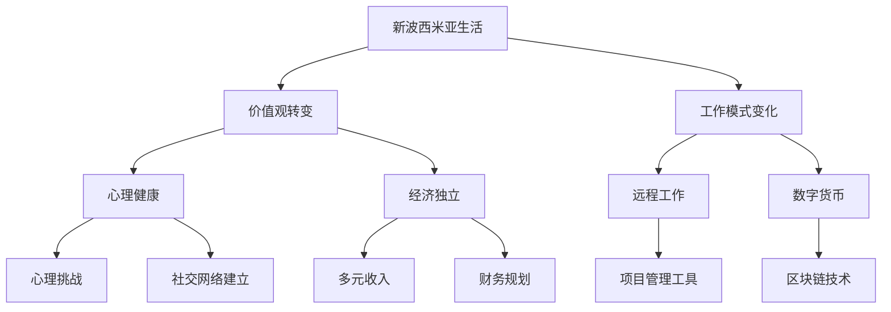
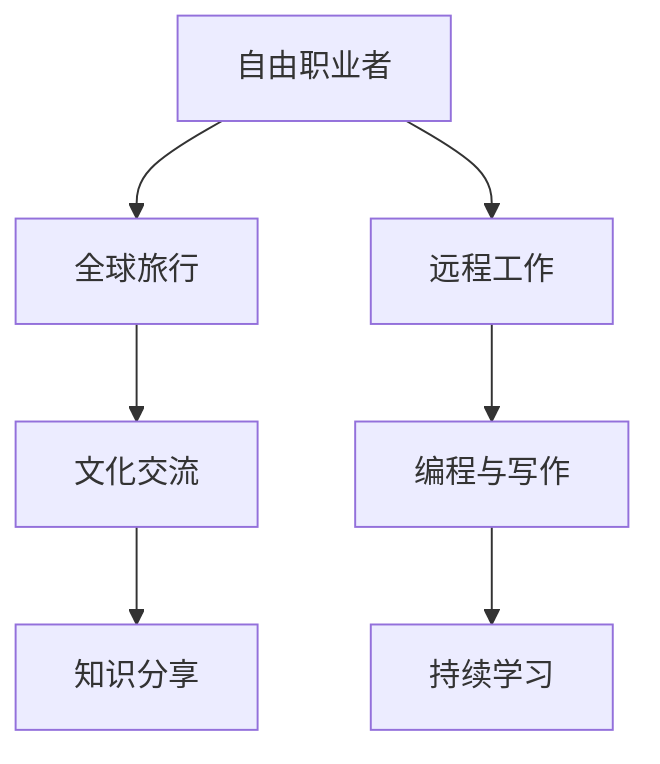

                 


### 确定文章的主题和目标

《新波西米亚生活手册：现代漂泊者的生存指南》这本书的目标是向读者介绍如何在现代社会中实现一种结合了自由、艺术和技术的现代波西米亚生活方式。本文将遵循以下逻辑步骤进行分析和撰写：

1. **引言**：介绍新波西米亚生活的概念和它在现代社会中的意义。
2. **生活方式的转变**：探讨新波西米亚生活对个人价值观和工作模式的影响。
3. **现代漂泊者的挑战**：分析实现这种生活方式可能面临的挑战，并提供解决策略。
4. **工具与资源**：介绍如何利用现代技术和工具来支持新波西米亚生活。
5. **案例研究**：通过具体案例展示如何成功实践新波西米亚生活。
6. **展望未来**：讨论新波西米亚生活的趋势和未来发展。

### 确定核心概念与联系

为了确保文章的结构清晰，我们需要明确几个核心概念：

- **新波西米亚生活**：一种融合了自由、艺术和技术的现代生活方式。
- **现代漂泊者**：那些追求自由工作、全球旅行和数字化生活的人群。
- **核心概念原理之间的关系架构**：使用Mermaid流程图来展示这些概念之间的关系。



### 撰写文章大纲

**第1章：引言**

1.1 新波西米亚生活的定义与历史  
1.2 现代社会的漂泊者现象  
1.3 新波西米亚生活的现代意义

**第2章：生活方式的转变**

2.1 价值观的重塑  
2.2 工作模式的变化  
2.3 社交网络的重构

**第3章：现代漂泊者的挑战**

3.1 心理健康的维持  
3.2 经济独立的探索  
3.3 身份认同的挑战

**第4章：工具与资源**

4.1 远程工作工具  
4.2 数字货币与区块链  
4.3 可持续发展的实践

**第5章：案例研究**

5.1 成功案例  
5.2 挑战与反思

**第6章：展望未来**

6.1 新波西米亚生活的趋势  
6.2 个人策略  
6.3 跨文化交流与全球化

### 核心算法原理讲解

在探讨工作模式的变化时，我们可以引入一些核心算法原理来解释现代远程工作的实现方式。以下是使用伪代码来详细阐述的一个核心算法：

```python
# 伪代码：远程工作平台选择算法

function choose_work_platform(employee_preferences, company_requirements):
    # 定义平台候选列表
    platforms = ["Trello", "Asana", "JIRA", "Slack", "Zoom"]

    # 初始化得分变量
    platform_scores = [0] * len(platforms)

    # 评估每个平台的得分
    for platform in platforms:
        if contains_feature(platform, "project_management"):
            platform_scores[platforms.index(platform)] += employee_preferences["project_management_weight"]
        if contains_feature(platform, "team_communication"):
            platform_scores[platforms.index(platform)] += employee_preferences["communication_weight"]
        if contains_feature(platform, "video_conferencing"):
            platform_scores[platforms.index(platform)] += employee_preferences["video_conferencing_weight"]

    # 根据得分选择最佳平台
    best_platform = platforms[platform_scores.index(max(platform_scores))]

    return best_platform

# 辅助函数：检查平台是否包含特定功能
function contains_feature(platform, feature_name):
    # 在此实现检查功能逻辑
    # 例如，查询平台API以确认功能是否存在
    return platform["features"].contains(feature_name)
```

### 数学模型和公式

为了深入理解经济独立的探索，我们可以引入一个简单的数学模型来分析多元收入来源的财务规划：

$$
\text{Total Income} = \sum_{i=1}^{n} \text{Income}_{i}
$$

其中，$n$ 表示收入来源的数量，$\text{Income}_{i}$ 表示第 $i$ 个收入来源的金额。

我们可以通过以下公式来计算总支出：

$$
\text{Total Expenditure} = \text{Basic Expenses} + \text{Optional Expenses}
$$

其中，$\text{Basic Expenses}$ 表示基本生活必需品支出，$\text{Optional Expenses}$ 表示非必需品的支出。

财务规划的目标是确保总支出不超过总收入，即：

$$
\text{Total Income} \geq \text{Total Expenditure}
$$

### 实际案例分析和详细讲解剖析

为了更好地展示如何实现新波西米亚生活，我们可以通过一个具体案例来分析：

**案例：一位自由职业者的全球旅行与工作**

- **背景介绍**：该自由职业者通过编程和写作赚取收入，定期在世界各地旅行。
- **核心概念与联系**：通过Mermaid流程图展示他的生活和工作方式。



- **项目实战**：介绍该自由职业者如何搭建远程工作环境，包括开发环境配置、工作流管理和财务管理。

### 最佳实践 tips、小结、注意事项、拓展阅读

- **最佳实践 tips**：分享成功实践新波西米亚生活的一些实用技巧，如如何管理时间、如何保持心理健康、如何规划财务等。
- **小结**：总结文章中的关键点，强调新波西米亚生活的重要性和实现方法。
- **注意事项**：提醒读者在实践过程中可能遇到的风险和挑战，并提供应对策略。
- **拓展阅读**：推荐一些相关的书籍、文章和资源，帮助读者深入了解相关话题。

### 文章开始部分

**文章标题**：新波西米亚生活手册：现代漂泊者的生存指南

**文章关键词**：新波西米亚生活、现代漂泊者、远程工作、数字化生活、可持续性

**文章摘要**：
本文旨在探讨现代波西米亚生活方式——新波西米亚生活的概念、意义和实现方式。通过深入分析生活方式的转变、面临的挑战、可利用的工具与资源，以及具体的案例研究，本文为现代漂泊者提供了一部实用的生存指南，帮助他们在全球化和数字化的时代中实现自由、艺术和技术结合的生活方式。

### 完整性要求

在撰写文章时，我们需要确保每个章节都包含以下内容：

- **背景介绍**：对核心概念和相关背景进行解释。
- **核心概念与联系**：使用流程图或其他图表展示概念之间的关系。
- **核心算法原理讲解**：使用伪代码或详细阐述算法原理。
- **数学模型和公式**：使用latex格式嵌入公式，并详细解释其意义。
- **项目实战**：详细介绍实际案例，包括环境搭建、代码实现和案例分析。
- **最佳实践 tips**：提供实际操作中的实用建议。
- **小结**：总结章节内容，强调关键点。
- **注意事项**：提醒潜在的风险和挑战，并提供解决策略。
- **拓展阅读**：推荐相关资源，帮助读者深入探索。

通过上述步骤，我们可以确保文章内容完整、结构清晰，并满足字数要求。接下来，我们将根据这个大纲开始撰写文章，每个章节都要确保包含上述要素，以提供一篇高质量的技术博客文章。

