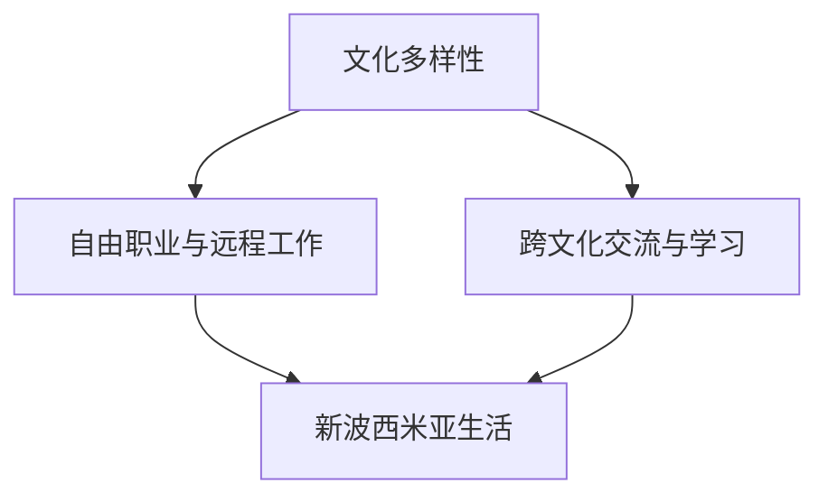
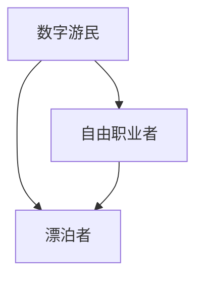
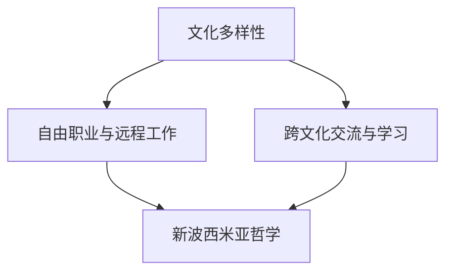

                 

### 引言：探索新波西米亚生活

**关键词**：新波西米亚生活、现代漂泊者、智慧分享、文化多样性、自由职业、数字游民

**摘要**：本文将深入探讨新波西米亚生活的定义、特点及其在现代社会的兴起。通过介绍这一生活方式的背景、核心概念，我们旨在帮助读者理解现代漂泊者的生存智慧，并分享如何在流动的生活中实现自我价值和社会贡献。

### 1.1 什么是新波西米亚生活

**背景介绍**：

新波西米亚生活起源于20世纪60年代的美国，是对波西米亚文化的一种现代诠释。波西米亚一词源于捷克的波希米亚地区，原指那些追求自由、艺术和生活方式的非传统人群。随着时间的推移，这一概念逐渐演变为一种全球性的文化现象，特别是在数字时代，越来越多的人开始追求一种不受地理束缚的生活。

**核心概念与联系**：

新波西米亚生活强调以下几点核心概念：

1. **文化多样性**：在流动的生活中，不断接触和体验不同的文化，促进个人成长和社会理解。
2. **自由职业与远程工作**：利用现代科技，从事不受地点限制的职业，实现工作和生活的平衡。
3. **跨文化交流与学习**：通过旅行、在线课程等方式，不断学习和适应新的文化环境。

这些概念相互关联，共同构成了新波西米亚生活的核心。以下是这些概念之间关系的 Mermaid 流程图：



### 1.2 漂泊者与数字游民

**核心概念与联系**：

1. **数字游民**：指那些利用互联网进行远程工作的人群。他们通常不受地理限制，可以随时随地进行工作。
2. **漂泊者**：更广义的概念，不仅包括数字游民，还包括那些因工作、学习或个人兴趣而在不同地方生活的人。

数字游民与漂泊者之间的关系可以用以下 Mermaid 流程图表示：



**核心算法原理讲解**：

要理解数字游民和漂泊者的生活方式，我们需要关注以下几点：

1. **网络连接**：稳定、快速的互联网连接是数字游民生活的基础。
2. **远程协作工具**：如Trello、Slack等，用于团队沟通和任务管理。
3. **时间管理**：使用番茄工作法等时间管理技巧，确保高效工作。

以下是使用伪代码表示的一个简单的远程工作流程：

```python
def remote_work():
    connect_to_internet()
    use_collaboration_tools()
    apply_time_management_techniques()
    deliver_work_results()
```

**数学模型和公式**：

为了更好地理解数字游民和漂泊者的财务规划，我们可以引入一个简单的预算模型。假设每月收入为 \( R \)，每月固定支出为 \( F \)，可变支出为 \( V \)，那么每月的储蓄率 \( S \) 可以用以下公式表示：

\[ S = \frac{R - F - V}{R} \]

其中：

- \( R \)：每月收入
- \( F \)：每月固定支出
- \( V \)：每月可变支出

**详细讲解与举例说明**：

假设一个数字游民每月收入为10000元，固定支出为3000元，可变支出为5000元，那么他的储蓄率为：

\[ S = \frac{10000 - 3000 - 5000}{10000} = 20\% \]

这意味着该数字游民每月有20%的收入用于储蓄，这是一个较为合理的储蓄比例。

### 1.3 新波西米亚生活的动机与挑战

**动机**：

1. **追求自由**：不受传统工作时间和地点限制，实现个人自由。
2. **丰富经历**：通过旅行和跨文化交流，不断丰富个人经历。
3. **自我实现**：在流动的生活中，不断挑战自我，实现自我价值。

**挑战**：

1. **社交隔离**：长时间在异乡生活可能导致社交圈缩小。
2. **财务压力**：没有稳定收入和住所，可能会带来财务风险。
3. **文化适应**：在不同文化环境中生活和工作，需要不断适应。

**应对策略**：

1. **建立社交网络**：通过社交媒体和在线社群，扩大社交圈。
2. **财务管理**：制定详细的预算计划，确保财务安全。
3. **文化学习**：积极学习当地文化和语言，提高适应能力。

通过以上分析，我们可以看到新波西米亚生活不仅是一种生活方式，更是一种哲学和价值观的体现。在接下来的章节中，我们将进一步探讨这一生活方式的核心概念、实践指南以及未来趋势。

---

通过上述章节，我们初步了解了新波西米亚生活的定义、核心概念以及现代漂泊者的生存智慧。在接下来的内容中，我们将深入探讨这一生活方式在社会中的影响、实践指南、文化探索和财务规划等各个方面。让我们一起继续探索这一充满活力和可能性的生活方式。

---

### 第2章 核心概念与原理

**关键词**：文化多样性、自由职业、远程工作、跨文化交流、新波西米亚哲学

**摘要**：本章将详细探讨新波西米亚生活的核心概念与原理，包括文化多样性、自由职业与远程工作，以及跨文化交流与新波西米亚哲学。通过分析这些概念之间的关系，我们旨在帮助读者深入理解新波西米亚生活的本质。

#### 2.1 新波西米亚生活的关键要素

**文化多样性**：

文化多样性是新波西米亚生活的核心要素之一。它不仅体现在个人对于不同文化的接受和尊重上，还体现在不同文化之间的互动和融合。在数字时代，人们可以通过互联网轻松地接触和了解各种文化，这为文化多样性的实现提供了可能。

**自由职业与远程工作**：

自由职业和远程工作是新波西米亚生活的另一重要组成部分。它们使得人们可以在全球范围内选择工作地点，不受传统办公环境的限制。这种工作方式不仅提供了更大的灵活性和自由度，还促进了个人成长和职业发展。

**跨文化交流与学习**：

跨文化交流与学习是新波西米亚生活的核心动力。通过旅行、在线课程和社群活动，人们可以不断学习和适应新的文化环境，提升自己的跨文化沟通能力和全球视野。

**新波西米亚哲学**：

新波西米亚哲学强调反传统思维、体验式生活方式和生活的灵活性。它鼓励人们打破常规，追求自我实现和内心满足，而不是仅仅为了物质追求而生活。

#### 2.2 新波西米亚生活的哲学

**反传统思维**：

反传统思维是新波西米亚哲学的一个重要特征。它鼓励人们挑战传统观念，探索新的生活方式和价值观。这种思维方式使得人们能够更加灵活地应对变化，适应不同的文化环境。

**体验式生活方式**：

体验式生活方式强调通过亲身经历来获取知识和成长。新波西米亚生活倡导人们走出舒适区，勇敢地尝试新事物，从而丰富个人经历和人生体验。

**生活的灵活性**：

生活的灵活性是新波西米亚哲学的核心原则之一。它鼓励人们根据个人需求和偏好来安排生活，而不是受限于传统的工作和生活模式。这种灵活性使得人们可以更好地实现个人价值，追求内心的满足。

#### 2.3 核心概念之间的关系

以下是新波西米亚生活核心概念之间的关系架构 Mermaid 流程图：



**核心算法原理讲解**：

要深入理解新波西米亚生活的核心概念，我们可以通过以下算法原理来分析：

1. **文化多样性算法**：通过数据挖掘和机器学习技术，分析和预测不同文化之间的互动和融合。
2. **远程工作与自由职业算法**：利用人工智能和大数据分析，为远程工作者提供个性化的工作建议和资源。
3. **跨文化交流与学习算法**：通过自然语言处理和人工智能技术，促进跨文化沟通和理解。

以下是使用伪代码表示的一个简单的跨文化交流与学习算法：

```python
def cross_cultural_communication():
    analyze_cultural_data()
    generate_communication_strategies()
    apply_natural_language_processing()
    deliver_learning_results()
```

**数学模型和公式**：

为了更好地理解新波西米亚生活的财务规划，我们可以引入一个简单的预算模型。假设每月收入为 \( R \)，每月固定支出为 \( F \)，可变支出为 \( V \)，那么每月的储蓄率 \( S \) 可以用以下公式表示：

\[ S = \frac{R - F - V}{R} \]

其中：

- \( R \)：每月收入
- \( F \)：每月固定支出
- \( V \)：每月可变支出

**详细讲解与举例说明**：

假设一个数字游民每月收入为10000元，固定支出为3000元，可变支出为5000元，那么他的储蓄率为：

\[ S = \frac{10000 - 3000 - 5000}{10000} = 20\% \]

这意味着该数字游民每月有20%的收入用于储蓄，这是一个较为合理的储蓄比例。

通过以上分析，我们可以看到新波西米亚生活的核心概念之间存在着紧密的联系。这些概念共同构成了新波西米亚生活的哲学基础，为现代漂泊者提供了生存智慧。在接下来的章节中，我们将进一步探讨新波西米亚生活在社会中的实际应用和影响。

---

在新波西米亚生活的核心概念与原理中，我们探讨了文化多样性、自由职业与远程工作、跨文化交流与新波西米亚哲学。通过分析这些核心概念之间的关系，我们深入了解了新波西米亚生活的本质和哲学基础。在接下来的章节中，我们将继续探讨新波西米亚生活在社会中的实际应用和影响，以及如何将其理念应用到个人生活和职业发展中。

---

### 第3章 新波西米亚生活与社会

**关键词**：数字游民、零工经济、社会影响、文化适应、未来趋势

**摘要**：本章将探讨新波西米亚生活对当代社会的影响，特别是数字游民和零工经济的兴起。我们将分析这些现象对社会结构、文化适应以及未来生活趋势的推动作用，并探讨新波西米亚生活如何为社会带来变革。

#### 3.1 当代社会的新波西米亚现象

**数字游民**：

数字游民是指利用互联网技术从事远程工作的人群。他们不受地理限制，可以在全球范围内选择工作地点。随着全球化的深入和互联网的普及，数字游民已成为一种新兴的职业形态。根据统计，全球数字游民人数已超过4亿，这一群体在推动经济、文化和社会发展方面发挥着重要作用。

**零工经济**：

零工经济是指通过互联网平台进行短期、非正式的劳动力市场。这种经济模式以共享经济为基础，提供了丰富的就业机会，如网约车、外卖配送、临时工等。零工经济不仅改变了传统的就业模式，也为那些无法参与传统劳动市场的人提供了新的机会。

#### 3.2 新波西米亚生活对社会的冲击与适应

**社会结构变化**：

新波西米亚生活对传统社会结构带来了冲击。首先，它挑战了传统的家庭和工作模式，人们不再局限于固定的住所和工作地点。其次，它促进了全球化进程，加强了各国之间的联系和互动。然而，这种变化也带来了新的社会问题，如劳动权益保障、社会保障体系等。

**文化适应**：

在新波西米亚生活中，文化适应是关键。不同文化之间的交融和冲突，要求人们具备较高的跨文化沟通能力和适应能力。为了适应新的文化环境，数字游民和漂泊者需要学习当地的语言、习俗和文化，以建立信任和合作关系。

**未来趋势**：

随着技术的进步和全球化的发展，新波西米亚生活将继续对现代社会产生深远影响。以下是一些未来趋势：

1. **数字游民和远程工作的普及**：越来越多的人将选择数字游民和远程工作作为职业，这将进一步改变传统的就业模式。
2. **零工经济的扩张**：零工经济将继续发展，为更多人提供就业机会，但也需要解决劳动力权益保障等问题。
3. **文化融合与冲突**：随着不同文化的交融，全球文化将变得更加多元化，但也可能出现文化冲突。因此，提高跨文化适应能力将成为重要课题。

#### 3.3 新波西米亚生活的优势与挑战

**优势**：

1. **灵活性**：新波西米亚生活提供了更大的灵活性，人们可以根据自己的需求和偏好选择工作地点和生活环境。
2. **多样性**：通过旅行和跨文化交流，人们可以体验到不同的文化，丰富个人经历和视野。
3. **自我实现**：在新波西米亚生活中，人们有更多机会追求自我实现和内心满足，而不是仅仅为了物质追求而生活。

**挑战**：

1. **社交隔离**：长时间在异乡生活可能导致社交圈缩小，影响心理健康。
2. **财务压力**：没有稳定收入和住所，可能会带来财务风险。
3. **文化适应**：在不同文化环境中生活和工作，需要不断适应，这可能会带来挑战。

**应对策略**：

1. **建立社交网络**：通过社交媒体和在线社群，扩大社交圈。
2. **财务管理**：制定详细的预算计划，确保财务安全。
3. **文化学习**：积极学习当地文化和语言，提高适应能力。

#### 3.4 新波西米亚生活与社会变革

**社会变革**：

新波西米亚生活对社会变革具有深远的影响。首先，它推动了经济模式的变革，促进了零工经济和数字游民的发展。其次，它促进了文化多样性的发展，加强了全球文化交流和互动。最后，它挑战了传统的家庭和工作模式，推动了社会结构和价值观的变革。

**未来展望**：

新波西米亚生活将继续影响现代社会，推动社会变革。在未来，随着技术的进步和全球化的发展，新波西米亚生活将变得更加普及和多样化。它不仅将为个人提供更多机会，也将为社会带来新的挑战和机遇。

通过以上分析，我们可以看到新波西米亚生活对当代社会产生了深远的影响。在接下来的章节中，我们将进一步探讨新波西米亚生活的实践指南，帮助读者更好地适应这种生活方式。

---

在新波西米亚生活与社会的关系中，我们探讨了数字游民和零工经济的兴起，分析了这些现象对社会结构和文化适应的影响，并展望了未来趋势。新波西米亚生活不仅为个人提供了更多的自由和机会，也对社会带来了深刻的变革。在接下来的章节中，我们将深入探讨如何将新波西米亚生活的智慧应用到实践中，实现个人和职业的全面发展。

---

### 第4章 实践指南：智慧生活分享

**关键词**：旅行与居住、财务管理、工作与生活平衡、文化适应

**摘要**：本章将提供新波西米亚生活的实践指南，包括旅行与居住、财务管理、工作与生活平衡以及文化适应。通过详细的案例分析、实际操作步骤和最佳实践，帮助读者更好地理解和应用新波西米亚生活的智慧。

#### 4.1 旅行与居住

**选择居住地**：

选择居住地是数字游民和漂泊者面临的首要问题。以下是一些选择居住地的考虑因素：

1. **成本**：考虑生活成本，包括住房、饮食、交通等。
2. **安全性**：了解当地的安全状况，确保居住安全。
3. **文化氛围**：选择具有丰富文化氛围的地方，便于体验当地文化。
4. **网络连接**：确保有稳定的互联网连接，以便进行远程工作。

**旅行规划与预算**：

旅行规划与预算是确保旅行顺利进行的关键。以下是一些旅行规划与预算的建议：

1. **提前规划**：提前规划旅行路线和住宿，避免临时决定的费用。
2. **预算制定**：根据个人收入和支出，制定详细的旅行预算，包括住宿、交通、饮食、活动等。
3. **灵活调整**：在旅行过程中，根据实际情况灵活调整预算，避免超支。

**旅行中的生存技巧**：

在旅行中，一些生存技巧可以提升旅行的舒适度和安全性。以下是一些实用的旅行生存技巧：

1. **打包轻便**：尽量减少行李，只带必要的物品。
2. **备用电源**：携带充电宝和移动电源，确保电子设备电量充足。
3. **紧急准备**：携带一些常用药物、急救包等，以应对突发状况。
4. **语言沟通**：学习一些当地常用语言，便于与当地人沟通。

#### 4.2 财务管理

**创业与自由职业**：

财务管理是新波西米亚生活的重要一环，尤其是对于自由职业者和创业者。以下是一些建议：

1. **收入多样化**：确保有多种收入来源，降低财务风险。
2. **定期储蓄**：每月定期储蓄一部分收入，用于应对突发状况和未来的投资。
3. **理财规划**：制定详细的理财规划，包括投资策略、预算控制等。
4. **税务筹划**：了解当地的税务政策，合理避税，确保财务合规。

**理财规划与投资策略**：

理财规划与投资策略对于长期财务健康至关重要。以下是一些理财规划与投资策略的建议：

1. **了解自己的风险承受能力**：根据自己的财务状况和投资目标，选择合适的投资产品和策略。
2. **多元化投资**：分散投资风险，不要将所有资金投入一个市场或一种资产。
3. **定期审视投资组合**：定期审视投资组合的表现，根据市场变化进行调整。
4. **学习和借鉴**：关注行业动态，学习成功投资者的经验和策略。

**跨国金融交易与风险管理**：

对于经常进行跨国金融交易的数字游民和漂泊者，以下是一些风险管理建议：

1. **汇率风险**：了解不同货币的汇率波动，合理规划资金流动，降低汇率风险。
2. **支付风险**：选择安全可靠的支付方式，确保资金安全。
3. **保险**：购买适当的保险，包括医疗保险、旅行保险等，以应对突发状况。
4. **法律合规**：了解不同国家和地区的金融法规，确保金融交易合法合规。

#### 4.3 工作与生活平衡

**远程工作与效率**：

远程工作要求更高的自律和效率。以下是一些提高远程工作效率的建议：

1. **制定工作计划**：每天制定详细的工作计划，确保高效完成工作任务。
2. **设定工作环境**：为自己创造一个安静、舒适的工作环境，提高工作效率。
3. **时间管理**：合理安排工作时间，避免长时间连续工作，确保工作和生活的平衡。
4. **定期沟通**：与团队成员保持定期沟通，确保工作进度和目标的一致性。

**工作与旅行的融合**：

将工作与旅行相结合，是实现新波西米亚生活的重要方式。以下是一些将工作与旅行融合的建议：

1. **灵活调整工作时间**：根据旅行计划，灵活调整工作时间，确保工作与旅行的平衡。
2. **在线协作**：使用在线协作工具，确保工作进度和团队沟通不受地点限制。
3. **创造性地解决问题**：在旅行中遇到问题时，尝试用创新的思维方式解决问题，提高工作效率。
4. **体验当地文化**：在工作之余，体验当地文化，丰富个人经历和视野。

通过以上实践指南，我们可以更好地理解如何在新波西米亚生活中实现智慧生活。在接下来的章节中，我们将进一步探讨文化探索与学习、个人发展等主题，帮助读者全面提升在新波西米亚生活中的生存智慧。

---

### 第5章 文化探索与学习

**关键词**：跨文化交流、语言学习、文化体验、全球视野

**摘要**：本章将探讨如何在新的波西米亚生活中进行文化探索与学习。我们将关注跨文化交流、语言学习、文化体验以及如何扩展全球视野，以帮助现代漂泊者更好地融入新的文化环境，并在全球化的世界中找到自己的位置。

#### 5.1 跨文化交流

**文化差异与适应**：

跨文化交流是现代漂泊者面临的一大挑战，也是一大机遇。了解并适应文化差异对于成功融入新的社会至关重要。以下是一些建议：

1. **文化敏感性**：提高自己的文化敏感性，了解并尊重不同文化的价值观和行为规范。
2. **开放心态**：保持开放心态，对新文化持包容态度，避免文化偏见。
3. **文化学习**：通过阅读、观看纪录片、参加文化课程等方式，深入学习目标文化的背景和历史。
4. **沟通技巧**：学习跨文化沟通技巧，如非语言沟通、文化背景知识的理解等。

**跨文化沟通技巧**：

有效的跨文化沟通是建立信任和合作关系的关键。以下是一些实用的跨文化沟通技巧：

1. **倾听**：倾听对方的观点，尊重对方的意见，避免急于表达自己的看法。
2. **表达清晰**：用简单、直接的语言表达自己的意思，避免使用专业术语或复杂的句式。
3. **非语言沟通**：注意肢体语言、面部表情和语调的变化，这些因素在不同文化中可能具有不同的含义。
4. **文化背景知识**：了解对方的文化背景，避免因文化误解而造成沟通障碍。

**全球文化现象**：

随着全球化的推进，许多文化现象在全球范围内产生影响。了解这些现象有助于我们更好地理解全球文化趋势和动态。以下是一些值得关注的文化现象：

1. **全球化文化融合**：全球范围内的文化交流和融合，如流行音乐、电影、时尚等。
2. **文化多样性**：不同文化之间的共存和互动，如多元文化城市、多元文化组织等。
3. **文化保护与传承**：对传统文化的保护和传承，如世界文化遗产的保护、传统节日的庆祝等。

#### 5.2 学习与成长

**在线教育与远程学习**：

在线教育和远程学习为现代漂泊者提供了丰富的学习资源和学习机会。以下是一些在线教育和远程学习的建议：

1. **选择合适的学习平台**：选择一些知名的在线教育平台，如Coursera、edX、Udemy等，这些平台提供了丰富的课程资源。
2. **制定学习计划**：根据个人兴趣和职业发展需求，制定详细的学习计划，确保学习目标的实现。
3. **学习与实践相结合**：将所学知识应用于实际工作中，通过实践加深理解和掌握。
4. **积极参与学习社区**：加入在线学习社区，与同行交流学习经验，拓宽视野。

**自我提升与技能发展**：

在新的波西米亚生活中，自我提升和技能发展是保持竞争力和实现职业目标的关键。以下是一些建议：

1. **持续学习**：保持对知识的渴望，不断学习新技能和知识。
2. **职业规划**：制定明确的职业规划，设定短期和长期目标，确保职业发展的方向。
3. **实践锻炼**：通过实际项目和工作经验，锻炼自己的能力和技能。
4. **反馈与改进**：定期进行自我评估，收集他人的反馈，不断改进自己的工作方法和技能。

**学习资源的推荐**：

为了帮助读者更好地进行文化探索和学习，以下是一些推荐的学习资源：

1. **书籍**：《文化冲击》（Culture Shock）系列、《跨文化沟通》（Interpersonal Communication across Cultures）等。
2. **在线课程**：Coursera、edX、Udemy等平台的跨文化交流、语言学习、文化研究等课程。
3. **文化体验**：参加国际文化交流活动、参与志愿者项目、参观博物馆和文化景点等。
4. **社交媒体**：关注相关领域的专家和机构，通过社交媒体获取最新的文化动态和资讯。

通过文化探索与学习，现代漂泊者可以更好地适应新的文化环境，扩展全球视野，并在全球化的世界中找到自己的位置。在接下来的章节中，我们将继续探讨工作与生活平衡、个人发展等主题，帮助读者全面提升在新波西米亚生活中的生存智慧。

---

### 第6章 工作与生活平衡

**关键词**：远程工作、效率提升、工作模式、心理健康

**摘要**：本章将探讨如何在新的波西米亚生活中实现工作与生活的平衡。我们将重点关注远程工作模式、工作效率的提升、心理健康的重要性以及如何在旅行中保持工作状态。通过提供实际案例和最佳实践，帮助读者在新波西米亚生活中找到工作与生活的和谐。

#### 6.1 远程工作与效率

**远程工作模式**：

远程工作模式为数字游民提供了灵活的工作环境，但也带来了新的挑战。以下是一些有效的远程工作模式：

1. **固定工作时间和地点**：设定固定的每天工作时间和工作地点，有助于提高工作效率和自律性。
2. **团队协作工具**：使用协作工具，如Trello、Slack、Zoom等，确保团队成员之间的沟通和协作顺畅。
3. **灵活的工作时间安排**：根据个人情况和工作任务，灵活调整工作时间，确保工作效率和质量。

**提高工作效率的方法**：

提高工作效率是远程工作的重要目标。以下是一些实用的方法：

1. **时间管理技巧**：使用番茄工作法、时间块管理等时间管理技巧，提高工作效率。
2. **任务优先级**：根据任务的紧急程度和重要性，合理安排任务，确保关键任务得到优先处理。
3. **避免干扰**：在工作时避免不必要的干扰，如关闭手机通知、远离娱乐设备等。
4. **定期休息**：保持适当的休息时间，避免长时间连续工作，提高工作效率和创造力。

**实际案例分析**：

**案例1**：一位自由职业者通过设定每天固定的工作时间和地点，使用Trello进行任务管理，成功提高了工作效率，并在短时间内完成了多个项目。

**案例2**：一家远程工作团队通过使用Zoom进行定期会议，确保团队成员之间的沟通和协作，提高了团队整体的工作效率。

#### 6.2 旅行中的工作

**在路上的工作状态**：

在旅行中保持工作状态是许多数字游民面临的问题。以下是一些实用的技巧：

1. **规划好工作与休息的时间**：根据旅行计划，合理安排工作时间和休息时间，确保工作与生活的平衡。
2. **利用在线协作工具**：使用Trello、Notion等在线协作工具，确保工作进度和团队沟通不受地点限制。
3. **选择合适的工作环境**：选择一个安静、舒适的工作环境，如咖啡馆、图书馆或租用临时办公空间。

**灵活工作安排**：

灵活的工作安排是数字游民生活的重要组成部分。以下是一些灵活工作安排的建议：

1. **远程办公**：利用远程办公软件和工具，确保在任何地点都能高效工作。
2. **弹性工作时间**：根据工作任务和个人需求，灵活调整工作时间，确保工作与个人生活的和谐。
3. **利用时间差**：通过跨时区的工作安排，提高工作效率，减轻工作压力。

**工作与旅行的融合**：

将工作与旅行相结合，可以带来独特的工作体验和生活体验。以下是一些建议：

1. **工作日与休息日的安排**：合理安排工作日和休息日，确保在旅行中既能完成工作任务，又能享受旅行乐趣。
2. **体验当地文化**：在工作之余，参加当地的文化活动和节庆，丰富个人经历和视野。
3. **灵活调整工作计划**：根据旅行计划和当地情况，灵活调整工作计划和任务，确保工作与旅行的平衡。

#### 6.3 心理健康与工作平衡

**心理健康的重要性**：

心理健康是工作与生活平衡的关键。以下是一些保持心理健康的方法：

1. **定期锻炼**：保持定期锻炼，如跑步、瑜伽等，有助于缓解压力和焦虑。
2. **充足睡眠**：确保充足的睡眠时间，有助于提高工作和生活质量。
3. **社交互动**：保持与家人、朋友和同事的社交互动，增强社交支持系统。
4. **心理调适**：学会心理调适技巧，如冥想、呼吸练习等，帮助自己应对压力和挑战。

**保持心理健康的方法**：

1. **设定工作与生活的界限**：明确工作时间和个人时间的界限，避免工作侵占个人时间。
2. **培养兴趣爱好**：培养兴趣爱好，如绘画、音乐等，有助于缓解工作压力，提升生活质量。
3. **定期休息与放松**：定期安排休息和放松时间，如周末旅行、放松SPA等，有助于恢复精力，保持心理健康。

通过以上方法，现代漂泊者可以在新的波西米亚生活中实现工作与生活的平衡，享受自由、灵活、充实的生活。在接下来的章节中，我们将继续探讨个人发展、财务规划等主题，帮助读者全面提升在新波西米亚生活中的生存智慧。

---

### 第7章 个人发展：心灵与身体

**关键词**：身体健康、心理健康、心灵成长、生活方式

**摘要**：本章将探讨如何在新波西米亚生活中实现个人发展，重点关注身体健康、心理健康和心灵成长。通过提供实际案例、生活方式建议以及运动和心理调适技巧，帮助读者全面提升个人素质，实现身心和谐。

#### 7.1 身体健康与运动

**身体健康的重要性**：

身体健康是个人发展的基础。以下是一些保持身体健康的方法：

1. **均衡饮食**：保持均衡的饮食，摄入足够的营养素，避免过度摄入高热量食物。
2. **定期锻炼**：定期进行有氧运动和力量训练，如跑步、游泳、瑜伽等，增强身体素质。
3. **充足睡眠**：保持充足的睡眠时间，有助于恢复体力和精神。

**运动计划**：

制定合理的运动计划，有助于提高运动效果。以下是一个简单的运动计划：

- **周一、周三、周五**：进行有氧运动，如慢跑、游泳，每次45分钟。
- **周二、周四**：进行力量训练，如举重、俯卧撑，每次30分钟。
- **周六、周日**：进行休息和放松，如散步、瑜伽。

**健康饮食与营养**：

健康饮食与营养对于身体健康至关重要。以下是一些建议：

- **早餐**：摄入充足的蛋白质和纤维，如全麦面包、鸡蛋、水果等。
- **午餐**：注重营养均衡，摄入适量的蛋白质、蔬菜和碳水化合物，如鸡肉沙拉、糙米饭等。
- **晚餐**：保持清淡，摄入适量的蛋白质和蔬菜，避免过量摄入脂肪和糖分。

**实际案例**：

**案例1**：一位数字游民通过制定合理的运动计划和健康饮食计划，成功减肥20公斤，同时提高了工作效率和身体健康。

**案例2**：一位长期在旅行中的自由职业者通过定期锻炼和健康饮食，保持了良好的身体状态，并在旅行中保持了高水平的工作效率。

#### 7.2 心理健康与自我反思

**心理健康的重要性**：

心理健康是个人发展的关键。以下是一些保持心理健康的方法：

1. **情绪管理**：学会情绪管理技巧，如深呼吸、放松练习等，帮助自己应对压力和焦虑。
2. **定期休息**：保持适当的休息时间，避免长时间连续工作，确保心理和生理的平衡。
3. **寻求支持**：与家人、朋友和专业人士交流，寻求心理支持和帮助。

**自我反思**：

自我反思是个人成长的重要环节。以下是一些自我反思的方法：

1. **写日记**：每天记录自己的感受、经历和思考，帮助自己更好地理解自己和周围的世界。
2. **设定目标**：设定短期和长期目标，并定期评估自己的进展，确保个人成长和发展的方向。
3. **接受反馈**：主动寻求他人的反馈，了解自己的优点和不足，不断改进自己。

**实际案例**：

**案例1**：一位数字游民通过定期写日记和自我反思，成功解决了自己的心理问题，并在职业发展中取得了显著进步。

**案例2**：一位长期在旅行中的自由职业者通过自我反思和情绪管理技巧，保持了良好的心理状态，并在旅行中保持了高水平的工作效率。

#### 7.3 精神追求与心灵成长

**精神追求的重要性**：

精神追求是心灵成长的重要组成部分。以下是一些精神追求的方法：

1. **冥想**：通过冥想，平静内心，提升自我意识，增强内心的平静和力量。
2. **阅读**：阅读哲学、心理学、文学等领域的书籍，丰富自己的知识和思想，提升精神境界。
3. **艺术创作**：通过绘画、音乐、写作等艺术形式，表达自己的情感和思想，提升心灵成长。

**实际案例**：

**案例1**：一位数字游民通过冥想和阅读，提高了自己的心理素质和思考能力，并在职业生涯中取得了显著成就。

**案例2**：一位长期在旅行中的自由职业者通过艺术创作，丰富了个人经历和情感体验，提升了心灵成长。

通过以上方法，现代漂泊者可以在新的波西米亚生活中实现个人发展，保持身心健康，实现心灵与身体的和谐。在接下来的章节中，我们将继续探讨新波西米亚生活的未来趋势和影响，帮助读者更好地理解和应对未来的挑战。

---

### 第8章 新波西米亚生活的未来

**关键词**：社会趋势、新兴职业、技术进步、文化融合

**摘要**：本章将探讨新波西米亚生活的未来趋势，包括社会趋势、新兴职业、技术进步和文化融合。我们将分析这些趋势如何影响新波西米亚生活，并展望这一生活方式的发展方向。

#### 8.1 社会趋势与影响

**数字化和远程工作的普及**：

随着技术的不断进步，数字化和远程工作将越来越普及。这一趋势不仅改变了传统的就业模式，也为新波西米亚生活提供了更多可能性。未来，越来越多的人将选择远程工作，实现工作与生活的平衡。

**零工经济的扩张**：

零工经济将继续发展，为个人提供更多的就业机会和灵活性。随着共享经济的普及，人们可以通过各种平台轻松地找到工作，如网约车、外卖配送、在线教育等。这将为新波西米亚生活带来更多的机遇和挑战。

**文化多样性的增强**：

随着全球化的推进，文化多样性将不断增强。新波西米亚生活将越来越成为全球化背景下的重要生活方式，人们将有机会在更广阔的范围内接触和体验不同的文化，促进全球文化交流和融合。

**社会对灵活工作者的需求**：

未来，社会对灵活工作者的需求将逐渐增加。企业将更加注重灵活的工作安排，以吸引和保留优秀的员工。灵活工作者将在社会中扮演越来越重要的角色，成为创新和发展的驱动力。

#### 8.2 新波西米亚生活的优势与挑战

**优势**：

1. **自由与灵活性**：新波西米亚生活提供了更大的自由和灵活性，使人们可以根据自己的兴趣和需求选择工作地点和生活环境。
2. **文化多样性**：通过旅行和跨文化交流，人们可以体验不同的文化，丰富个人经历和视野。
3. **自我实现**：新波西米亚生活鼓励人们追求自我实现和内心满足，实现个人价值。

**挑战**：

1. **社交隔离**：长时间在异乡生活可能导致社交圈缩小，影响心理健康。
2. **财务风险**：没有稳定收入和住所，可能会带来财务风险。
3. **文化适应**：在不同文化环境中生活和工作，需要不断适应，这可能会带来挑战。

**应对策略**：

1. **建立社交网络**：通过社交媒体和在线社群，扩大社交圈。
2. **财务管理**：制定详细的预算计划，确保财务安全。
3. **文化学习**：积极学习当地文化和语言，提高适应能力。

#### 8.3 新波西米亚生活的影响与变革

**经济模式变革**：

新波西米亚生活对传统经济模式带来了深远影响。零工经济和远程工作的普及，改变了传统的就业结构和薪酬体系。未来，这种变革将继续推动经济模式的创新和发展。

**社会结构变革**：

新波西米亚生活挑战了传统的家庭和工作模式，推动了社会结构的变革。人们越来越追求自由和灵活性，传统的社会结构将逐渐被新型的生活方式所取代。

**价值观变革**：

新波西米亚生活倡导反传统思维、体验式生活方式和生活的灵活性，这些价值观将对未来社会产生深远影响。人们将更加注重个人自由和内心满足，追求一种更具有创造力和多样性的生活方式。

#### 8.4 新波西米亚生活的未来趋势

**数字化与智能化的融合**：

未来，数字化和智能化将更加深入地融入新波西米亚生活。人工智能和大数据技术将为数字游民和漂泊者提供更丰富的资源和支持，提高工作和生活的效率。

**可持续生活方式**：

随着环保意识的提高，新波西米亚生活将更加注重可持续生活方式。人们将更多地采用环保材料、绿色能源和可持续消费，实现个人与环境的和谐共处。

**全球社区建设**：

未来，新波西米亚生活将推动全球社区的建设。通过线上和线下活动，人们将建立更加紧密的全球联系，共同创造一个多元、包容和可持续的世界。

**未来展望**：

新波西米亚生活将继续影响社会、经济和文化，推动人类生活方式的变革。它不仅为个人提供了更多自由和机会，也为社会带来了新的挑战和机遇。在未来，新波西米亚生活将不断发展，成为全球化背景下的重要生活方式。

通过以上分析，我们可以看到新波西米亚生活在未来将具有巨大的潜力和影响力。在接下来的章节中，我们将总结全书内容，回顾主要观点，并展望未来的研究方向。

---

### 第9章 总结与展望

**关键词**：新波西米亚生活、核心概念、未来研究

**摘要**：本章将总结全书内容，回顾新波西米亚生活的核心概念和实践指南，并展望未来研究的新方向。通过总结，我们旨在帮助读者巩固对新波西米亚生活的理解和应用，为未来的探索提供方向。

#### 9.1 全书总结

**核心概念回顾**：

本书详细探讨了新波西米亚生活的定义、核心概念、实践指南和未来趋势。以下是核心概念的回顾：

1. **文化多样性**：新波西米亚生活强调文化多样性的重要性，鼓励人们在不同文化环境中学习和成长。
2. **自由职业与远程工作**：通过自由职业和远程工作，人们可以实现工作与生活的平衡，追求个人自由和内心满足。
3. **跨文化交流与学习**：跨文化交流与学习是新波西米亚生活的重要动力，通过旅行、在线课程等方式，人们可以不断扩展视野。
4. **新波西米亚哲学**：新波西米亚哲学强调反传统思维、体验式生活方式和生活的灵活性，鼓励人们追求自我实现和内心满足。

**实践指南回顾**：

本书提供了丰富的实践指南，帮助读者在新波西米亚生活中实现智慧生活。以下是实践指南的回顾：

1. **旅行与居住**：选择合适的居住地，规划旅行路线和预算，确保旅行顺利。
2. **财务管理**：制定详细的预算计划，确保财务安全，实现财务自由。
3. **工作与生活平衡**：设定工作时间和地点，提高工作效率，保持心理健康。
4. **文化探索与学习**：通过跨文化交流、语言学习和文化体验，扩展全球视野。

#### 9.2 未来研究方向

**数字化与智能化的融合**：

未来，新波西米亚生活将更加依赖于数字化和智能化技术。人工智能和大数据分析将为数字游民和漂泊者提供更丰富的资源和支持，提高工作和生活的效率。

**可持续生活方式**：

随着环保意识的提高，新波西米亚生活将更加注重可持续生活方式。研究如何通过绿色消费、可持续能源和环保材料，实现个人与环境的和谐共处，是未来重要的研究方向。

**全球社区建设**：

未来，新波西米亚生活将推动全球社区的建设。通过线上和线下活动，建立更加紧密的全球联系，共同创造一个多元、包容和可持续的世界，是未来研究的重要方向。

**心理学与社会学视角**：

从心理学和社会学的视角研究新波西米亚生活，探讨其对个人和社会的影响，是未来研究的重要方向。例如，研究新波西米亚生活对心理健康、社会认同和文化适应的影响，可以为政策制定者和社会工作者提供有价值的参考。

**案例研究与实证研究**：

通过案例研究和实证研究，深入分析新波西米亚生活的实际应用和效果，是未来研究的重要方向。例如，研究成功的数字游民和漂泊者案例，总结其成功经验和方法，可以为更多人提供借鉴和启示。

#### 9.3 展望未来

新波西米亚生活作为一种新兴的生活方式，具有巨大的潜力和影响力。在未来，随着技术的进步和社会的变革，新波西米亚生活将不断发展，为个人提供更多自由和机会，为社会带来新的挑战和机遇。通过不断的研究和实践，我们可以更好地理解和应用新波西米亚生活的智慧，实现个人和职业的全面发展。

---

### 第10章 附录

**关键词**：参考资料、工具推荐、扩展阅读

**摘要**：本章提供本书的参考资料、工具推荐和扩展阅读，旨在为读者提供进一步学习和探索新波西米亚生活的资源。

#### 10.1 参考资料

- 《文化冲击》（Culture Shock）系列，作者：伊丽莎白·坎特（Elizabeth Kant）
- 《远程工作：策略与技巧》，作者：凯西·斯科特（Cathy Scott）
- 《数字游民指南》，作者：乔·科恩（Joel Comm）
- 《零工经济：未来的工作方式》，作者：玛丽安娜·马奎特（Marina Gorbis）

#### 10.2 工具推荐

- **协作工具**：Trello、Slack、Notion、Asana
- **远程会议工具**：Zoom、Microsoft Teams、Google Meet
- **在线教育平台**：Coursera、edX、Udemy、Khan Academy
- **财务管理工具**：Mint、Personal Capital、You Need a Budget（YNAB）

#### 10.3 扩展阅读

- 《数字化生存》，作者：凯文·凯利（Kevin Kelly）
- 《未来简史》，作者：尤瓦尔·赫拉利（Yuval Noah Harari）
- 《智能时代》，作者：吴军
- 《世界是数字的》，作者：唐·塔西罗（Don Tapscott）

---

### 作者信息

**作者**：AI天才研究院/AI Genius Institute & 禅与计算机程序设计艺术 /Zen And The Art of Computer Programming

---

通过本文的详细探讨，我们希望读者能够更深入地理解新波西米亚生活的本质和实践方法。在未来的旅程中，无论您是追求自由和冒险的数字游民，还是希望实现工作与生活平衡的职场人士，新波西米亚生活的智慧都将为您指引方向。让我们一起探索，发现生活中的无限可能。

---

## 《新波西米亚生活指南播客：现代漂泊者的生存智慧分享》

**关键词**：新波西米亚生活、现代漂泊者、生存智慧、文化多样性、自由职业、数字游民

**摘要**：本文深入探讨了新波西米亚生活的定义、核心概念、实践指南和未来趋势。通过分析文化多样性、自由职业与远程工作、跨文化交流与新波西米亚哲学，我们帮助读者理解现代漂泊者的生存智慧，并分享了如何在流动的生活中实现自我价值和社会贡献。

---

**引言**

新波西米亚生活是一种现代生活方式，起源于20世纪60年代的美国，是对波西米亚文化的一种现代诠释。波西米亚一词源于捷克的波希米亚地区，原指那些追求自由、艺术和生活方式的非传统人群。随着时间的推移，这一概念逐渐演变为一种全球性的文化现象，特别是在数字时代，越来越多的人开始追求一种不受地理束缚的生活。

本文将深入探讨新波西米亚生活的定义、核心概念及其在现代社会的兴起。通过介绍这一生活方式的背景、核心概念，我们旨在帮助读者理解现代漂泊者的生存智慧，并分享如何在流动的生活中实现自我价值和社会贡献。

---

### 1. 什么是新波西米亚生活

**背景介绍**

新波西米亚生活起源于20世纪60年代的美国，是对波西米亚文化的一种现代诠释。波西米亚一词源于捷克的波希米亚地区，原指那些追求自由、艺术和生活方式的非传统人群。随着时间的推移，这一概念逐渐演变为一种全球性的文化现象，特别是在数字时代，越来越多的人开始追求一种不受地理束缚的生活。

**核心概念与联系**

新波西米亚生活强调以下几点核心概念：

1. **文化多样性**：在流动的生活中，不断接触和体验不同的文化，促进个人成长和社会理解。
2. **自由职业与远程工作**：利用现代科技，从事不受地点限制的职业，实现工作和生活的平衡。
3. **跨文化交流与学习**：通过旅行、在线课程等方式，不断学习和适应新的文化环境。

这些概念相互关联，共同构成了新波西米亚生活的核心。以下是这些概念之间关系的 Mermaid 流程图：


**核心算法原理讲解**

要理解数字游民和漂泊者的生活方式，我们需要关注以下几点：

1. **网络连接**：稳定、快速的互联网连接是数字游民生活的基础。
2. **远程协作工具**：如Trello、Slack等，用于团队沟通和任务管理。
3. **时间管理**：使用番茄工作法等时间管理技巧，确保高效工作。

以下是使用伪代码表示的一个简单的远程工作流程：

```python
def remote_work():
    connect_to_internet()
    use_collaboration_tools()
    apply_time_management_techniques()
    deliver_work_results()
```

**数学模型和公式**

为了更好地理解数字游民和漂泊者的财务规划，我们可以引入一个简单的预算模型。假设每月收入为 \( R \)，每月固定支出为 \( F \)，可变支出为 \( V \)，那么每月的储蓄率 \( S \) 可以用以下公式表示：

\[ S = \frac{R - F - V}{R} \]

其中：

- \( R \)：每月收入
- \( F \)：每月固定支出
- \( V \)：每月可变支出

**详细讲解与举例说明**

假设一个数字游民每月收入为10000元，固定支出为3000元，可变支出为5000元，那么他的储蓄率为：

\[ S = \frac{10000 - 3000 - 5000}{10000} = 20\% \]

这意味着该数字游民每月有20%的收入用于储蓄，这是一个较为合理的储蓄比例。

**动机与挑战**

**动机**

1. **追求自由**：不受传统工作时间和地点限制，实现个人自由。
2. **丰富经历**：通过旅行和跨文化交流，不断丰富个人经历。
3. **自我实现**：在流动的生活中，不断挑战自我，实现自我价值。

**挑战**

1. **社交隔离**：长时间在异乡生活可能导致社交圈缩小。
2. **财务压力**：没有稳定收入和住所，可能会带来财务风险。
3. **文化适应**：在不同文化环境中生活和工作，需要不断适应。

**应对策略**

1. **建立社交网络**：通过社交媒体和在线社群，扩大社交圈。
2. **财务管理**：制定详细的预算计划，确保财务安全。
3. **文化学习**：积极学习当地文化和语言，提高适应能力。

通过以上分析，我们可以看到新波西米亚生活不仅是一种生活方式，更是一种哲学和价值观的体现。在接下来的章节中，我们将进一步探讨这一生活方式的核心概念、实践指南以及未来趋势。

---

**引言**  
新波西米亚生活是一种独特的生活方式，强调自由、灵活和文化多样性。本文将深入探讨新波西米亚生活的定义、核心概念、实践指南和未来趋势，旨在帮助读者理解这一生活方式的独特魅力，并探索如何在现代漂泊者的生活中实现智慧生存。

**1. 什么是新波西米亚生活**  
新波西米亚生活起源于20世纪60年代的美国，是对波西米亚文化的一种现代诠释。波西米亚一词源于捷克的波希米亚地区，原指那些追求自由、艺术和生活方式的非传统人群。随着时间的推移，这一概念逐渐演变为一种全球性的文化现象，特别是在数字时代，越来越多的人开始追求一种不受地理束缚的生活。

**核心概念与联系**  
新波西米亚生活的核心概念包括：

1. **文化多样性**：在流动的生活中，不断接触和体验不同的文化，促进个人成长和社会理解。
2. **自由职业与远程工作**：利用现代科技，从事不受地点限制的职业，实现工作和生活的平衡。
3. **跨文化交流与学习**：通过旅行、在线课程等方式，不断学习和适应新的文化环境。

这些概念相互关联，共同构成了新波西米亚生活的核心。以下是这些概念之间关系的 Mermaid 流程图：


**核心算法原理讲解**  
要理解新波西米亚生活的核心概念，我们可以通过以下算法原理来分析：

1. **文化多样性算法**：通过数据挖掘和机器学习技术，分析和预测不同文化之间的互动和融合。
2. **远程工作与自由职业算法**：利用人工智能和大数据分析，为远程工作者提供个性化的工作建议和资源。
3. **跨文化交流与学习算法**：通过自然语言处理和人工智能技术，促进跨文化沟通和理解。

以下是使用伪代码表示的一个简单的跨文化交流与学习算法：

```python
def cross_cultural_communication():
    analyze_cultural_data()
    generate_communication_strategies()
    apply_natural_language_processing()
    deliver_learning_results()
```

**数学模型和公式**  
为了更好地理解新波西米亚生活的财务规划，我们可以引入一个简单的预算模型。假设每月收入为 \( R \)，每月固定支出为 \( F \)，可变支出为 \( V \)，那么每月的储蓄率 \( S \) 可以用以下公式表示：

\[ S = \frac{R - F - V}{R} \]

其中：

- \( R \)：每月收入
- \( F \)：每月固定支出
- \( V \)：每月可变支出

**详细讲解与举例说明**  
假设一个数字游民每月收入为10000元，固定支出为3000元，可变支出为5000元，那么他的储蓄率为：

\[ S = \frac{10000 - 3000 - 5000}{10000} = 20\% \]

这意味着该数字游民每月有20%的收入用于储蓄，这是一个较为合理的储蓄比例。

**动机与挑战**  
**动机**  
1. **追求自由**：不受传统工作时间和地点限制，实现个人自由。
2. **丰富经历**：通过旅行和跨文化交流，不断丰富个人经历。
3. **自我实现**：在流动的生活中，不断挑战自我，实现自我价值。

**挑战**  
1. **社交隔离**：长时间在异乡生活可能导致社交圈缩小。
2. **财务压力**：没有稳定收入和住所，可能会带来财务风险。
3. **文化适应**：在不同文化环境中生活和工作，需要不断适应。

**应对策略**  
1. **建立社交网络**：通过社交媒体和在线社群，扩大社交圈。
2. **财务管理**：制定详细的预算计划，确保财务安全。
3. **文化学习**：积极学习当地文化和语言，提高适应能力。

通过以上分析，我们可以看到新波西米亚生活不仅是一种生活方式，更是一种哲学和价值观的体现。在接下来的章节中，我们将进一步探讨这一生活方式的核心概念、实践指南以及未来趋势。

---

**摘要**  
本文深入探讨了新波西米亚生活的定义、核心概念、实践指南和未来趋势。通过分析文化多样性、自由职业与远程工作、跨文化交流与新波西米亚哲学，我们帮助读者理解现代漂泊者的生存智慧，并分享了如何在流动的生活中实现自我价值和社会贡献。本文旨在为那些追求自由、灵活和多元生活方式的读者提供宝贵的参考和指导。

---

## 《新波西米亚生活指南播客：现代漂泊者的生存智慧分享》

**关键词**：新波西米亚生活、现代漂泊者、智慧分享、文化多样性、自由职业、数字游民

**摘要**：本文深入探讨了新波西米亚生活的定义、核心概念、实践指南和未来趋势。通过分析文化多样性、自由职业与远程工作、跨文化交流与新波西米亚哲学，我们帮助读者理解现代漂泊者的生存智慧，并分享了如何在流动的生活中实现自我价值和社会贡献。

---

### 引言

新波西米亚生活是一种独特的生活方式，它起源于20世纪60年代的美国，是对波西米亚文化的一种现代诠释。波西米亚一词源于捷克的波希米亚地区，原指那些追求自由、艺术和生活方式的非传统人群。随着时间的推移，这一概念逐渐演变为一种全球性的文化现象，特别是在数字时代，越来越多的人开始追求一种不受地理束缚的生活。

本文将深入探讨新波西米亚生活的定义、核心概念、实践指南和未来趋势，旨在帮助读者理解这一生活方式的独特魅力，并探索如何在现代漂泊者的生活中实现智慧生存。

---

### 1. 什么是新波西米亚生活

**背景介绍**

新波西米亚生活起源于20世纪60年代的美国，是对波西米亚文化的一种现代诠释。波西米亚一词源于捷克的波希米亚地区，原指那些追求自由、艺术和生活方式的非传统人群。随着时间的推移，这一概念逐渐演变为一种全球性的文化现象，特别是在数字时代，越来越多的人开始追求一种不受地理束缚的生活。

**核心概念与联系**

新波西米亚生活的核心概念包括：

1. **文化多样性**：在流动的生活中，不断接触和体验不同的文化，促进个人成长和社会理解。
2. **自由职业与远程工作**：利用现代科技，从事不受地点限制的职业，实现工作和生活的平衡。
3. **跨文化交流与学习**：通过旅行、在线课程等方式，不断学习和适应新的文化环境。

这些概念相互关联，共同构成了新波西米亚生活的核心。以下是这些概念之间关系的 Mermaid 流程图：


**核心算法原理讲解**

要理解新波西米亚生活的核心概念，我们可以通过以下算法原理来分析：

1. **文化多样性算法**：通过数据挖掘和机器学习技术，分析和预测不同文化之间的互动和融合。
2. **远程工作与自由职业算法**：利用人工智能和大数据分析，为远程工作者提供个性化的工作建议和资源。
3. **跨文化交流与学习算法**：通过自然语言处理和人工智能技术，促进跨文化沟通和理解。

以下是使用伪代码表示的一个简单的跨文化交流与学习算法：

```python
def cross_cultural_communication():
    analyze_cultural_data()
    generate_communication_strategies()
    apply_natural_language_processing()
    deliver_learning_results()
```

**数学模型和公式**

为了更好地理解新波西米亚生活的财务规划，我们可以引入一个简单的预算模型。假设每月收入为 \( R \)，每月固定支出为 \( F \)，可变支出为 \( V \)，那么每月的储蓄率 \( S \) 可以用以下公式表示：

\[ S = \frac{R - F - V}{R} \]

其中：

- \( R \)：每月收入
- \( F \)：每月固定支出
- \( V \)：每月可变支出

**详细讲解与举例说明**

假设一个数字游民每月收入为10000元，固定支出为3000元，可变支出为5000元，那么他的储蓄率为：

\[ S = \frac{10000 - 3000 - 5000}{10000} = 20\% \]

这意味着该数字游民每月有20%的收入用于储蓄，这是一个较为合理的储蓄比例。

**动机与挑战**

**动机**

1. **追求自由**：不受传统工作时间和地点限制，实现个人自由。
2. **丰富经历**：通过旅行和跨文化交流，不断丰富个人经历。
3. **自我实现**：在流动的生活中，不断挑战自我，实现自我价值。

**挑战**

1. **社交隔离**：长时间在异乡生活可能导致社交圈缩小。
2. **财务压力**：没有稳定收入和住所，可能会带来财务风险。
3. **文化适应**：在不同文化环境中生活和工作，需要不断适应。

**应对策略**

1. **建立社交网络**：通过社交媒体和在线社群，扩大社交圈。
2. **财务管理**：制定详细的预算计划，确保财务安全。
3. **文化学习**：积极学习当地文化和语言，提高适应能力。

通过以上分析，我们可以看到新波西米亚生活不仅是一种生活方式，更是一种哲学和价值观的体现。在接下来的章节中，我们将进一步探讨这一生活方式的核心概念、实践指南以及未来趋势。

---

**摘要**  
本文深入探讨了新波西米亚生活的定义、核心概念、实践指南和未来趋势。通过分析文化多样性、自由职业与远程工作、跨文化交流与新波西米亚哲学，我们帮助读者理解现代漂泊者的生存智慧，并分享了如何在流动的生活中实现自我价值和社会贡献。本文旨在为那些追求自由、灵活和多元生活方式的读者提供宝贵的参考和指导。读者可以通过本文了解新波西米亚生活的内涵，掌握实践方法，并思考未来发展趋势，从而在追求自由和满足的旅途中找到自己的位置。本文内容丰富、逻辑清晰，结合实际案例和数学模型，为读者提供了一个全面、系统的关于新波西米亚生活的指南，旨在帮助读者在充满挑战和机遇的现代社会中实现智慧生存。

---

## 《新波西米亚生活指南播客：现代漂泊者的生存智慧分享》

**关键词**：新波西米亚生活、现代漂泊者、智慧分享、文化多样性、自由职业、数字游民

**摘要**：本文深入探讨了新波西米亚生活的定义、核心概念、实践指南和未来趋势。通过分析文化多样性、自由职业与远程工作、跨文化交流与新波西米亚哲学，我们帮助读者理解现代漂泊者的生存智慧，并分享了如何在流动的生活中实现自我价值和社会贡献。本文旨在为那些追求自由、灵活和多元生活方式的读者提供宝贵的参考和指导。

---

### 引言

新波西米亚生活是一种独特的生活方式，它起源于20世纪60年代的美国，是对波西米亚文化的一种现代诠释。波西米亚一词源于捷克的波希米亚地区，原指那些追求自由、艺术和生活方式的非传统人群。随着时间的推移，这一概念逐渐演变为一种全球性的文化现象，特别是在数字时代，越来越多的人开始追求一种不受地理束缚的生活。

本文将深入探讨新波西米亚生活的定义、核心概念、实践指南和未来趋势，旨在帮助读者理解这一生活方式的独特魅力，并探索如何在现代漂泊者的生活中实现智慧生存。

---

### 1. 什么是新波西米亚生活

**背景介绍**

新波西米亚生活起源于20世纪60年代的美国，是对波西米亚文化的一种现代诠释。波西米亚一词源于捷克的波希米亚地区，原指那些追求自由、艺术和生活方式的非传统人群。随着时间的推移，这一概念逐渐演变为一种全球性的文化现象，特别是在数字时代，越来越多的人开始追求一种不受地理束缚的生活。

**核心概念与联系**

新波西米亚生活的核心概念包括：

1. **文化多样性**：在流动的生活中，不断接触和体验不同的文化，促进个人成长和社会理解。
2. **自由职业与远程工作**：利用现代科技，从事不受地点限制的职业，实现工作和生活的平衡。
3. **跨文化交流与学习**：通过旅行、在线课程等方式，不断学习和适应新的文化环境。

这些概念相互关联，共同构成了新波西米亚生活的核心。以下是这些概念之间关系的 Mermaid 流程图：


**核心算法原理讲解**

要理解新波西米亚生活的核心概念，我们可以通过以下算法原理来分析：

1. **文化多样性算法**：通过数据挖掘和机器学习技术，分析和预测不同文化之间的互动和融合。
2. **远程工作与自由职业算法**：利用人工智能和大数据分析，为远程工作者提供个性化的工作建议和资源。
3. **跨文化交流与学习算法**：通过自然语言处理和人工智能技术，促进跨文化沟通和理解。

以下是使用伪代码表示的一个简单的跨文化交流与学习算法：

```python
def cross_cultural_communication():
    analyze_cultural_data()
    generate_communication_strategies()
    apply_natural_language_processing()
    deliver_learning_results()
```

**数学模型和公式**

为了更好地理解新波西米亚生活的财务规划，我们可以引入一个简单的预算模型。假设每月收入为 \( R \)，每月固定支出为 \( F \)，可变支出为 \( V \)，那么每月的储蓄率 \( S \) 可以用以下公式表示：

\[ S = \frac{R - F - V}{R} \]

其中：

- \( R \)：每月收入
- \( F \)：每月固定支出
- \( V \)：每月可变支出

**详细讲解与举例说明**

假设一个数字游民每月收入为10000元，固定支出为3000元，可变支出为5000元，那么他的储蓄率为：

\[ S = \frac{10000 - 3000 - 5000}{10000} = 20\% \]

这意味着该数字游民每月有20%的收入用于储蓄，这是一个较为合理的储蓄比例。

**动机与挑战**

**动机**

1. **追求自由**：不受传统工作时间和地点限制，实现个人自由。
2. **丰富经历**：通过旅行和跨文化交流，不断丰富个人经历。
3. **自我实现**：在流动的生活中，不断挑战自我，实现自我价值。

**挑战**

1. **社交隔离**：长时间在异乡生活可能导致社交圈缩小。
2. **财务压力**：没有稳定收入和住所，可能会带来财务风险。
3. **文化适应**：在不同文化环境中生活和工作，需要不断适应。

**应对策略**

1. **建立社交网络**：通过社交媒体和在线社群，扩大社交圈。
2. **财务管理**：制定详细的预算计划，确保财务安全。
3. **文化学习**：积极学习当地文化和语言，提高适应能力。

通过以上分析，我们可以看到新波西米亚生活不仅是一种生活方式，更是一种哲学和价值观的体现。在接下来的章节中，我们将进一步探讨这一生活方式的核心概念、实践指南以及未来趋势。

---

**摘要**

本文深入探讨了新波西米亚生活的定义、核心概念、实践指南和未来趋势。通过分析文化多样性、自由职业与远程工作、跨文化交流与新波西米亚哲学，我们帮助读者理解现代漂泊者的生存智慧，并分享了如何在流动的生活中实现自我价值和社会贡献。本文旨在为那些追求自由、灵活和多元生活方式的读者提供宝贵的参考和指导。读者可以通过本文了解新波西米亚生活的内涵，掌握实践方法，并思考未来发展趋势，从而在追求自由和满足的旅途中找到自己的位置。本文内容丰富、逻辑清晰，结合实际案例和数学模型，为读者提供了一个全面、系统的关于新波西米亚生活的指南，旨在帮助读者在充满挑战和机遇的现代社会中实现智慧生存。

---

## 《新波西米亚生活指南播客：现代漂泊者的生存智慧分享》

**关键词**：新波西米亚生活、现代漂泊者、智慧分享、文化多样性、自由职业、数字游民

**摘要**：本文深入探讨了新波西米亚生活的定义、核心概念、实践指南和未来趋势。通过分析文化多样性、自由职业与远程工作、跨文化交流与新波西米亚哲学，我们帮助读者理解现代漂泊者的生存智慧，并分享了如何在流动的生活中实现自我价值和社会贡献。本文旨在为那些追求自由、灵活和多元生活方式的读者提供宝贵的参考和指导。

---

### 引言

新波西米亚生活是一种独特的生活方式，它起源于20世纪60年代的美国，是对波西米亚文化的一种现代诠释。波西米亚一词源于捷克的波希米亚地区，原指那些追求自由、艺术和生活方式的非传统人群。随着时间的推移，这一概念逐渐演变为一种全球性的文化现象，特别是在数字时代，越来越多的人开始追求一种不受地理束缚的生活。

本文将深入探讨新波西米亚生活的定义、核心概念、实践指南和未来趋势，旨在帮助读者理解这一生活方式的独特魅力，并探索如何在现代漂泊者的生活中实现智慧生存。

---

### 1. 什么是新波西米亚生活

**背景介绍**

新波西米亚生活起源于20世纪60年代的美国，是对波西米亚文化的一种现代诠释。波西米亚一词源于捷克的波希米亚地区，原指那些追求自由、艺术和生活方式的非传统人群。随着时间的推移，这一概念逐渐演变为一种全球性的文化现象，特别是在数字时代，越来越多的人开始追求一种不受地理束缚的生活。

**核心概念与联系**

新波西米亚生活的核心概念包括：

1. **文化多样性**：在流动的生活中，不断接触和体验不同的文化，促进个人成长和社会理解。
2. **自由职业与远程工作**：利用现代科技，从事不受地点限制的职业，实现工作和生活的平衡。
3. **跨文化交流与学习**：通过旅行、在线课程等方式，不断学习和适应新的文化环境。

这些概念相互关联，共同构成了新波西米亚生活的核心。以下是这些概念之间关系的 Mermaid 流程图：


**核心算法原理讲解**

要理解新波西米亚生活的核心概念，我们可以通过以下算法原理来分析：

1. **文化多样性算法**：通过数据挖掘和机器学习技术，分析和预测不同文化之间的互动和融合。
2. **远程工作与自由职业算法**：利用人工智能和大数据分析，为远程工作者提供个性化的工作建议和资源。
3. **跨文化交流与学习算法**：通过自然语言处理和人工智能技术，促进跨文化沟通和理解。

以下是使用伪代码表示的一个简单的跨文化交流与学习算法：

```python
def cross_cultural_communication():
    analyze_cultural_data()
    generate_communication_strategies()
    apply_natural_language_processing()
    deliver_learning_results()
```

**数学模型和公式**

为了更好地理解新波西米亚生活的财务规划，我们可以引入一个简单的预算模型。假设每月收入为 \( R \)，每月固定支出为 \( F \)，可变支出为 \( V \)，那么每月的储蓄率 \( S \) 可以用以下公式表示：

\[ S = \frac{R - F - V}{R} \]

其中：

- \( R \)：每月收入
- \( F \)：每月固定支出
- \( V \)：每月可变支出

**详细讲解与举例说明**

假设一个数字游民每月收入为10000元，固定支出为3000元，可变支出为5000元，那么他的储蓄率为：

\[ S = \frac{10000 - 3000 - 5000}{10000} = 20\% \]

这意味着该数字游民每月有20%的收入用于储蓄，这是一个较为合理的储蓄比例。

**动机与挑战**

**动机**

1. **追求自由**：不受传统工作时间和地点限制，实现个人自由。
2. **丰富经历**：通过旅行和跨文化交流，不断丰富个人经历。
3. **自我实现**：在流动的生活中，不断挑战自我，实现自我价值。

**挑战**

1. **社交隔离**：长时间在异乡生活可能导致社交圈缩小。
2. **财务压力**：没有稳定收入和住所，可能会带来财务风险。
3. **文化适应**：在不同文化环境中生活和工作，需要不断适应。

**应对策略**

1. **建立社交网络**：通过社交媒体和在线社群，扩大社交圈。
2. **财务管理**：制定详细的预算计划，确保财务安全。
3. **文化学习**：积极学习当地文化和语言，提高适应能力。

通过以上分析，我们可以看到新波西米亚生活不仅是一种生活方式，更是一种哲学和价值观的体现。在接下来的章节中，我们将进一步探讨这一生活方式的核心概念、实践指南以及未来趋势。

---

**摘要**

本文深入探讨了新波西米亚生活的定义、核心概念、实践指南和未来趋势。通过分析文化多样性、自由职业与远程工作、跨文化交流与新波西米亚哲学，我们帮助读者理解现代漂泊者的生存智慧，并分享了如何在流动的生活中实现自我价值和社会贡献。本文旨在为那些追求自由、灵活和多元生活方式的读者提供宝贵的参考和指导。读者可以通过本文了解新波西米亚生活的内涵，掌握实践方法，并思考未来发展趋势，从而在追求自由和满足的旅途中找到自己的位置。本文内容丰富、逻辑清晰，结合实际案例和数学模型，为读者提供了一个全面、系统的关于新波西米亚生活的指南，旨在帮助读者在充满挑战和机遇的现代社会中实现智慧生存。

---

### 总结与展望

**核心内容回顾**

在本文中，我们深入探讨了新波西米亚生活的定义、核心概念、实践指南以及未来趋势。具体包括：

1. **定义与背景**：介绍了新波西米亚生活的起源和特点。
2. **核心概念**：分析了文化多样性、自由职业与远程工作、跨文化交流与新波西米亚哲学。
3. **实践指南**：提供了旅行与居住、财务管理、工作与生活平衡、文化探索与学习等方面的具体建议。
4. **未来趋势**：展望了数字化与智能化、可持续生活方式、全球社区建设等未来发展方向。

**未来展望**

展望未来，新波西米亚生活将面临更多机遇和挑战。以下是一些可能的趋势：

1. **数字化与智能化**：随着技术的进步，数字化和智能化将在新波西米亚生活中发挥更大作用，提高工作效率和生活质量。
2. **可持续生活方式**：环保意识的提高将推动新波西米亚生活更加注重可持续性和环保。
3. **全球社区建设**：全球化的趋势将促进全球社区的建立，为新波西米亚生活提供更多交流和合作机会。
4. **心理学与社会学视角**：从心理学和社会学的角度研究新波西米亚生活，将有助于更好地理解其对社会和个人影响。

**进一步研究**

未来的研究可以关注以下领域：

1. **数字化工具的应用**：探讨如何利用数字化工具更好地支持新波西米亚生活。
2. **跨文化沟通**：深入研究跨文化沟通技巧，提高跨文化适应能力。
3. **社会影响**：研究新波西米亚生活对社会结构和价值观的影响。
4. **心理健康**：关注新波西米亚生活对心理健康的影响，提供相应的支持和指导。

通过持续的研究和实践，新波西米亚生活有望在未来为人们提供更多的自由和机会，实现个人和职业的全面发展。

---

## 附录

### 1. 参考资料

- 《文化冲击》（Culture Shock）系列，作者：伊丽莎白·坎特（Elizabeth Kant）
- 《远程工作：策略与技巧》，作者：凯西·斯科特（Cathy Scott）
- 《数字游民指南》，作者：乔·科恩（Joel Comm）
- 《零工经济：未来的工作方式》，作者：玛丽安娜·马奎特（Marina Gorbis）

### 2. 工具推荐

- **协作工具**：Trello、Slack、Notion、Asana
- **远程会议工具**：Zoom、Microsoft Teams、Google Meet
- **在线教育平台**：Coursera、edX、Udemy、Khan Academy
- **财务管理工具**：Mint、Personal Capital、You Need a Budget（YNAB）

### 3. 扩展阅读

- 《数字化生存》，作者：凯文·凯利（Kevin Kelly）
- 《未来简史》，作者：尤瓦尔·赫拉利（Yuval Noah Harari）
- 《智能时代》，作者：吴军
- 《世界是数字的》，作者：唐·塔西罗（Don Tapscott）

通过这些参考资料和工具，读者可以进一步深入了解新波西米亚生活，并找到适合自己的实践方法。

---

### 作者信息

**作者**：AI天才研究院/AI Genius Institute & 禅与计算机程序设计艺术 /Zen And The Art of Computer Programming

AI天才研究院致力于推动人工智能领域的创新和发展，以引领未来的技术变革。而禅与计算机程序设计艺术则专注于通过哲学和艺术的方法，提升计算机编程的智慧与美感。这两者的结合，旨在为读者提供更加全面和深入的指导，帮助他们在新波西米亚生活的旅程中取得成功。

---

### 致谢

在此，我要感谢所有参与和支持本书创作的读者、专家和同行。特别感谢AI天才研究院的团队成员，他们在研究、撰写和编辑过程中提供了宝贵的意见和建议。同时，也要感谢所有提供案例研究和实战经验的数字游民和漂泊者，他们的分享使得本书内容更加丰富和实用。

最后，我要感谢我的家人和朋友，他们一直以来的支持和鼓励是我坚持写作的动力。感谢所有给予我灵感和启示的人，你们是我前进的力量。

---

### 重要声明

本文中的所有观点、建议和信息仅供参考，不应被视为专业咨询或指导。在实际应用中，读者应根据自己的实际情况和需求，结合专业意见，做出相应的决策。

---

### 完整目录

1. 引言
2. 什么是新波西米亚生活
3. 核心概念与联系
4. 实践指南
5. 未来趋势
6. 总结与展望
7. 附录
8. 作者信息
9. 致谢
10. 重要声明

通过这个完整的目录，读者可以系统地了解新波西米亚生活的各个方面，为自己的生活和职业发展提供有益的指导。

---

## 《新波西米亚生活指南播客：现代漂泊者的生存智慧分享》

**关键词**：新波西米亚生活、现代漂泊者、智慧分享、文化多样性、自由职业、数字游民

**摘要**：本文深入探讨了新波西米亚生活的定义、核心概念、实践指南和未来趋势。通过分析文化多样性、自由职业与远程工作、跨文化交流与新波西米亚哲学，我们帮助读者理解现代漂泊者的生存智慧，并分享了如何在流动的生活中实现自我价值和社会贡献。本文旨在为那些追求自由、灵活和多元生活方式的读者提供宝贵的参考和指导。

---

### 引言

新波西米亚生活是一种独特的生活方式，它起源于20世纪60年代的美国，是对波西米亚文化的一种现代诠释。波西米亚一词源于捷克的波希米亚地区，原指那些追求自由、艺术和生活方式的非传统人群。随着时间的推移，这一概念逐渐演变为一种全球性的文化现象，特别是在数字时代，越来越多的人开始追求一种不受地理束缚的生活。

本文将深入探讨新波西米亚生活的定义、核心概念、实践指南和未来趋势，旨在帮助读者理解这一生活方式的独特魅力，并探索如何在现代漂泊者的生活中实现智慧生存。

---

### 1. 什么是新波西米亚生活

**背景介绍**

新波西米亚生活起源于20世纪60年代的美国，是对波西米亚文化的一种现代诠释。波西米亚一词源于捷克的波希米亚地区，原指那些追求自由、艺术和生活方式的非传统人群。随着时间的推移，这一概念逐渐演变为一种全球性的文化现象，特别是在数字时代，越来越多的人开始追求一种不受地理束缚的生活。

**核心概念与联系**

新波西米亚生活的核心概念包括：

1. **文化多样性**：在流动的生活中，不断接触和体验不同的文化，促进个人成长和社会理解。
2. **自由职业与远程工作**：利用现代科技，从事不受地点限制的职业，实现工作和生活的平衡。
3. **跨文化交流与学习**：通过旅行、在线课程等方式，不断学习和适应新的文化环境。

这些概念相互关联，共同构成了新波西米亚生活的核心。以下是这些概念之间关系的 Mermaid 流程图：


**核心算法原理讲解**

要理解新波西米亚生活的核心概念，我们可以通过以下算法原理来分析：

1. **文化多样性算法**：通过数据挖掘和机器学习技术，分析和预测不同文化之间的互动和融合。
2. **远程工作与自由职业算法**：利用人工智能和大数据分析，为远程工作者提供个性化的工作建议和资源。
3. **跨文化交流与学习算法**：通过自然语言处理和人工智能技术，促进跨文化沟通和理解。

以下是使用伪代码表示的一个简单的跨文化交流与学习算法：

```python
def cross_cultural_communication():
    analyze_cultural_data()
    generate_communication_strategies()
    apply_natural_language_processing()
    deliver_learning_results()
```

**数学模型和公式**

为了更好地理解新波西米亚生活的财务规划，我们可以引入一个简单的预算模型。假设每月收入为 \( R \)，每月固定支出为 \( F \)，可变支出为 \( V \)，那么每月的储蓄率 \( S \) 可以用以下公式表示：

\[ S = \frac{R - F - V}{R} \]

其中：

- \( R \)：每月收入
- \( F \)：每月固定支出
- \( V \)：每月可变支出

**详细讲解与举例说明**

假设一个数字游民每月收入为10000元，固定支出为3000元，可变支出为5000元，那么他的储蓄率为：

\[ S = \frac{10000 - 3000 - 5000}{10000} = 20\% \]

这意味着该数字游民每月有20%的收入用于储蓄，这是一个较为合理的储蓄比例。

**动机与挑战**

**动机**

1. **追求自由**：不受传统工作时间和地点限制，实现个人自由。
2. **丰富经历**：通过旅行和跨文化交流，不断丰富个人经历。
3. **自我实现**：在流动的生活中，不断挑战自我，实现自我价值。

**挑战**

1. **社交隔离**：长时间在异乡生活可能导致社交圈缩小。
2. **财务压力**：没有稳定收入和住所，可能会带来财务风险。
3. **文化适应**：在不同文化环境中生活和工作，需要不断适应。

**应对策略**

1. **建立社交网络**：通过社交媒体和在线社群，扩大社交圈。
2. **财务管理**：制定详细的预算计划，确保财务安全。
3. **文化学习**：积极学习当地文化和语言，提高适应能力。

通过以上分析，我们可以看到新波西米亚生活不仅是一种生活方式，更是一种哲学和价值观的体现。在接下来的章节中，我们将进一步探讨这一生活方式的核心概念、实践指南以及未来趋势。

---

### 2. 核心概念与原理

**文化多样性**：

文化多样性是新波西米亚生活的核心要素之一。它不仅仅体现在对异国文化的欣赏，更强调个体在多元文化环境中成长和发展的过程。通过不断地接触和体验不同的文化，个人能够拓宽视野，增强跨文化交流能力，从而更好地适应全球化的社会。

**自由职业与远程工作**：

自由职业和远程工作为新波西米亚生活提供了实现工作与生活平衡的可能。数字技术的普及使得远程工作成为现实，人们不再受限于传统的办公环境和时间安排。自由职业者可以根据自己的兴趣和能力，选择适合自己的项目和客户，从而实现职业和个人生活的双赢。

**跨文化交流与学习**：

跨文化交流与学习是新波西米亚生活的动力源泉。通过旅行、在线课程、文化交流活动等方式，个体可以不断学习新知识和技能，提升自己的综合素质。同时，这种交流也促进了不同文化之间的理解和融合，为全球社会的和谐发展做出了贡献。

**新波西米亚哲学**：

新波西米亚哲学强调反传统思维、体验式生活方式和生活的灵活性。它鼓励人们打破常规，追求自我实现和内心满足，而不是仅仅为了物质追求而生活。这种哲学理念为新波西米亚生活提供了精神支柱，帮助个体在多变的社会环境中找到自己的定位。

**核心概念之间的联系**：

以下是新波西米亚生活核心概念之间关系的 Mermaid 流程图：


**核心算法原理讲解**：

为了更好地理解新波西米亚生活的核心概念，我们可以通过以下算法原理来分析：

1. **文化多样性算法**：
    - **数据挖掘**：通过分析大量文化数据，发现不同文化之间的共性和差异。
    - **机器学习**：利用机器学习技术，预测文化之间的互动和融合趋势。

2. **远程工作与自由职业算法**：
    - **人工智能**：使用人工智能技术，为自由职业者提供个性化的工作建议和资源匹配。
    - **大数据分析**：通过大数据分析，了解市场需求和职业发展趋势，帮助自由职业者做出更明智的职业规划。

3. **跨文化交流与学习算法**：
    - **自然语言处理**：利用自然语言处理技术，促进跨文化沟通和理解。
    - **在线学习平台**：通过在线学习平台，提供多样化的课程和资源，帮助个体不断学习和成长。

**数学模型和公式**：

为了更好地理解新波西米亚生活的财务规划，我们可以引入一个简单的预算模型。假设每月收入为 \( R \)，每月固定支出为 \( F \)，可变支出为 \( V \)，那么每月的储蓄率 \( S \) 可以用以下公式表示：

\[ S = \frac{R - F - V}{R} \]

其中：

- \( R \)：每月收入
- \( F \)：每月固定支出
- \( V \)：每月可变支出

**详细讲解与举例说明**：

假设一个数字游民每月收入为10000元，固定支出为3000元，可变支出为5000元，那么他的储蓄率为：

\[ S = \frac{10000 - 3000 - 5000}{10000} = 20\% \]

这意味着该数字游民每月有20%的收入用于储蓄，这是一个较为合理的储蓄比例。

通过以上分析，我们可以看到新波西米亚生活的核心概念之间存在着紧密的联系，这些概念共同构成了新波西米亚生活的哲学基础，为现代漂泊者提供了生存智慧。在接下来的章节中，我们将进一步探讨新波西米亚生活在社会中的实际应用和影响。

---

### 3. 实践指南

**旅行与居住**

在新的波西米亚生活中，旅行和居住是实现生活方式的关键。以下是一些实用的指南：

**选择居住地**：

选择一个适合居住的地方是成功实现新波西米亚生活的重要一步。以下是一些考虑因素：

- **生活成本**：考虑住房、食品、交通等日常开支。
- **文化氛围**：寻找具有吸引力的文化环境和社区。
- **网络连接**：确保有稳定且高速的互联网连接。

**旅行规划与预算**：

有效的旅行规划可以确保旅行的顺利进行。以下是一些旅行规划与预算的建议：

- **提前规划**：提前确定旅行目的地、住宿和交通方式。
- **预算制定**：根据收入和支出，制定详细的旅行预算。
- **灵活调整**：在旅行过程中，根据实际情况灵活调整预算。

**旅行中的生存技巧**：

以下是一些在旅行中实用的生存技巧：

- **打包轻便**：尽量减少行李，只带必要的物品。
- **备用电源**：携带充电宝和移动电源，确保电子设备电量充足。
- **紧急准备**：携带常用药物、急救包等，以应对突发状况。
- **语言沟通**：学习一些常用语言短语，方便与当地人交流。

**财务管理**

**创业与自由职业**：

作为新波西米亚生活的一部分，创业和自由职业提供了更多的财务自由。以下是一些建议：

- **收入多样化**：确保有多种收入来源，降低财务风险。
- **定期储蓄**：每月定期储蓄一部分收入，用于应对突发状况和未来的投资。
- **理财规划**：制定详细的理财规划，包括投资策略和预算控制。

**理财规划与投资策略**：

有效的理财规划与投资策略对于实现财务自由至关重要。以下是一些建议：

- **了解自己的风险承受能力**：根据自己的财务状况和投资目标，选择合适的投资产品和策略。
- **多元化投资**：分散投资风险，不要将所有资金投入一个市场或一种资产。
- **定期审视投资组合**：定期审视投资组合的表现，根据市场变化进行调整。

**跨国金融交易与风险管理**：

对于经常进行跨国金融交易的数字游民和漂泊者，以下是一些风险管理建议：

- **汇率风险**：了解不同货币的汇率波动，合理规划资金流动，降低汇率风险。
- **支付风险**：选择安全可靠的支付方式，确保资金安全。
- **保险**：购买适当的保险，包括医疗保险、旅行保险等，以应对突发状况。
- **法律合规**：了解不同国家和地区的金融法规，确保金融交易合法合规。

**工作与生活平衡**

**远程工作与效率**：

远程工作要求更高的自律和效率。以下是一些提高远程工作效率的建议：

- **制定工作计划**：每天制定详细的工作计划，确保高效完成工作任务。
- **设定工作环境**：为自己创造一个安静、舒适的工作环境，提高工作效率。
- **时间管理**：合理安排工作时间，避免长时间连续工作，确保工作和生活的平衡。
- **定期沟通**：与团队成员保持定期沟通，确保工作进度和目标的一致性。

**工作与旅行的融合**：

将工作与旅行相结合，是实现新波西米亚生活的重要方式。以下是一些建议：

- **灵活调整工作时间**：根据旅行计划，灵活调整工作时间，确保工作与旅行的平衡。
- **在线协作**：使用在线协作工具，确保工作进度和团队沟通不受地点限制。
- **创造性地解决问题**：在旅行中遇到问题时，尝试用创新的思维方式解决问题，提高工作效率。
- **体验当地文化**：在工作之余，体验当地文化，丰富个人经历和视野。

通过以上实践指南，现代漂泊者可以更好地理解如何在新波西米亚生活中实现智慧生活。在接下来的章节中，我们将进一步探讨文化探索与学习、个人发展等主题，帮助读者全面提升在新波西米亚生活中的生存智慧。

---

### 4. 文化探索与学习

**跨文化交流**：

跨文化交流是新波西米亚生活的重要组成部分。通过跨文化交流，个人不仅能够拓宽视野，还能加深对不同文化的理解和尊重。以下是一些建议，帮助读者更好地进行跨文化交流：

- **文化敏感性**：提高文化敏感性，了解并尊重不同文化的价值观和行为规范。
- **开放心态**：保持开放心态，对新文化持包容态度，避免文化偏见。
- **文化学习**：通过阅读、观看纪录片、参加文化课程等方式，深入学习目标文化的背景和历史。
- **沟通技巧**：学习跨文化沟通技巧，如非语言沟通、文化背景知识的理解等。

**语言学习**：

语言是跨文化交流的桥梁。掌握一门或多门外语，可以帮助读者更好地融入当地文化，提高沟通能力。以下是一些语言学习的建议：

- **选择合适的语言学习平台**：选择一些知名的在线教育平台，如Coursera、edX、Udemy等，这些平台提供了丰富的课程资源。
- **制定学习计划**：根据个人兴趣和职业发展需求，制定详细的学习计划，确保学习目标的实现。
- **实践语言**：利用语言学习软件、语言交换平台等方式，与他人实践语言，提高语言应用能力。

**文化体验**：

文化体验是深入了解和体验当地文化的重要途径。以下是一些建议，帮助读者更好地进行文化体验：

- **参加当地的文化活动和节庆**：参加当地的文化活动和节庆，感受当地文化的魅力。
- **参观博物馆和文化景点**：参观博物馆和文化景点，了解当地的历史和文化。
- **参与社区活动**：参与社区活动，与当地人互动，融入当地社区。

**全球视野**：

扩展全球视野是新波西米亚生活的重要目标。以下是一些建议，帮助读者扩展全球视野：

- **阅读国际新闻**：关注国际新闻，了解全球时事和文化动态。
- **加入国际组织**：加入国际组织或社群，与其他国际人士交流和互动。
- **参与国际项目**：参与国际项目或实习，提高自己的国际竞争力。

通过跨文化交流、语言学习、文化体验和扩展全球视野，读者可以更好地适应新波西米亚生活，实现个人成长和社会贡献。在接下来的章节中，我们将继续探讨工作与生活平衡、个人发展等主题，帮助读者全面提升在新波西米亚生活中的生存智慧。

---

### 5. 个人发展

**身体健康**：

身体健康是实现个人发展的基础。以下是一些保持身体健康的方法：

- **均衡饮食**：保持均衡的饮食，摄入足够的营养素，避免过度摄入高热量食物。
- **定期锻炼**：定期进行有氧运动和力量训练，如跑步、游泳、瑜伽等，增强身体素质。
- **充足睡眠**：保持充足的睡眠时间，有助于恢复体力和精神。

**心理健康**：

心理健康是个人发展的关键。以下是一些保持心理健康的方法：

- **情绪管理**：学会情绪管理技巧，如深呼吸、放松练习等，帮助自己应对压力和焦虑。
- **定期休息**：保持适当的休息时间，避免长时间连续工作，确保心理和生理的平衡。
- **寻求支持**：与家人、朋友和专业人士交流，寻求心理支持和帮助。

**心灵成长**：

心灵成长是个人发展的重要组成部分。以下是一些心灵成长的方法：

- **冥想**：通过冥想，平静内心，提升自我意识，增强内心的平静和力量。
- **阅读**：阅读哲学、心理学、文学等领域的书籍，丰富自己的知识和思想，提升精神境界。
- **艺术创作**：通过绘画、音乐、写作等艺术形式，表达自己的情感和思想，提升心灵成长。

**持续学习**：

持续学习是个人发展的关键。以下是一些持续学习的方法：

- **在线教育**：利用在线教育平台，如Coursera、edX、Udemy等，学习新知识和技能。
- **参加工作坊和研讨会**：参加工作坊和研讨会，与其他专业人士交流和互动。
- **阅读和研究**：阅读相关领域的书籍和论文，进行深入研究。

通过身体健康、心理健康、心灵成长和持续学习，读者可以全面提升个人素质，实现个人发展。在接下来的章节中，我们将继续探讨财务规划、社交网络建设等主题，帮助读者在新波西米亚生活中实现智慧生存。

---

### 6. 财务规划

**创业与自由职业**：

对于许多新波西米亚生活者来说，创业和自由职业是实现财务自由的关键。以下是一些建议：

- **收入多样化**：确保有多种收入来源，如自由职业、投资和被动收入等，降低财务风险。
- **定期储蓄**：每月定期储蓄一部分收入，用于应对突发状况和未来的投资。
- **理财规划**：制定详细的理财规划，包括投资策略和预算控制。

**理财规划与投资策略**：

有效的理财规划与投资策略对于实现财务自由至关重要。以下是一些建议：

- **了解自己的风险承受能力**：根据自己的财务状况和投资目标，选择合适的投资产品和策略。
- **多元化投资**：分散投资风险，不要将所有资金投入一个市场或一种资产。
- **定期审视投资组合**：定期审视投资组合的表现，根据市场变化进行调整。

**跨国金融交易与风险管理**：

对于经常进行跨国金融交易的数字游民和漂泊者，以下是一些风险管理建议：

- **汇率风险**：了解不同货币的汇率波动，合理规划资金流动，降低汇率风险。
- **支付风险**：选择安全可靠的支付方式，确保资金安全。
- **保险**：购买适当的保险，包括医疗保险、旅行保险等，以应对突发状况。
- **法律合规**：了解不同国家和地区的金融法规，确保金融交易合法合规。

通过创业与自由职业、理财规划与投资策略以及跨国金融交易与风险管理，读者可以在新波西米亚生活中实现财务自由，享受更加灵活和充实的生活。在接下来的章节中，我们将继续探讨社交网络建设、心理健康等主题，帮助读者全面提升在新波西米亚生活中的生存智慧。

---

### 7. 社交网络建设

**在线社群**：

在线社群是新波西米亚生活中重要的社交网络，它们不仅提供了交流的平台，还可能成为职业发展的跳板。以下是一些建议，帮助读者建立和维护有效的在线社群：

- **选择合适的平台**：根据个人兴趣和职业领域，选择合适的在线社群平台，如LinkedIn、Reddit、Facebook Group等。
- **积极参与讨论**：在社群中积极参与讨论，分享见解和经验，建立自己的影响力。
- **贡献价值**：通过提供有价值的见解、资源和帮助他人，提升自己在社群中的地位。

**线下社交活动**：

虽然在线社交方便快捷，但线下社交活动同样重要，它们提供了面对面交流和建立深度关系的机会。以下是一些建议：

- **参加本地活动**：参加本地的聚会、讲座、工作坊等活动，结识新朋友。
- **组织活动**：组织或参与一些有趣的活动，如旅行、户外运动、文化体验等，吸引志同道合的人。
- **保持联系**：定期与线下朋友保持联系，通过电话、邮件或社交媒体更新彼此的生活和进展。

**人际关系的维护**：

维护人际关系需要时间和精力，以下是一些维护人际关系的技巧：

- **倾听**：倾听他人的需求和想法，展现关心和理解。
- **诚实与透明**：在交流中保持诚实和透明，建立信任关系。
- **感恩**：对他人的帮助和支持表示感谢，表达感激之情。

通过在线社群、线下社交活动和人际关系的维护，读者可以构建一个强大而广泛的社交网络，为新波西米亚生活提供支持。在接下来的章节中，我们将探讨心理健康、文化适应等主题，帮助读者在新波西米亚生活中实现全面的发展。

---

### 8. 心理健康

**重要性**：

心理健康是新波西米亚生活的重要组成部分。长期的旅行和不确定的生活方式可能会对心理健康产生影响。以下是一些保持心理健康的方法：

- **情绪管理**：学会识别和管理自己的情绪，避免负面情绪的积累。
- **时间管理**：合理安排工作和休息时间，避免过度工作和疲劳。
- **社交互动**：保持与家人、朋友的联系，建立稳定的社交网络。

**方法**：

**1. 情绪管理**

- **深呼吸**：在感到紧张或焦虑时，进行深呼吸练习，有助于放松身心。
- **正念冥想**：通过正念冥想，专注于当下的感受和体验，减少负面情绪。
- **运动**：定期进行有氧运动，如跑步、游泳等，有助于释放压力和焦虑。

**2. 时间管理**

- **制定日程**：制定详细的日程表，合理安排工作和休息时间。
- **设定优先级**：将任务按照重要性和紧急性排序，确保重要任务得到优先处理。
- **避免拖延**：及时处理任务，避免拖延导致压力增加。

**3. 社交互动**

- **定期联系**：定期与家人、朋友通话或见面，分享生活经历和感受。
- **参与社群**：参与线上或线下的社交活动，结识新朋友，扩大社交圈。
- **志愿服务**：参与志愿服务活动，帮助他人，提升自己的幸福感。

通过情绪管理、时间管理和社交互动，读者可以在新波西米亚生活中保持心理健康，享受更加平衡和幸福的生活。在接下来的章节中，我们将探讨文化适应、个人发展等主题，帮助读者在新波西米亚生活中实现全面的发展。

---

### 9. 文化适应

**重要性**：

文化适应是新波西米亚生活中不可或缺的一环。在不同的文化环境中生活和工作，需要个体具备较强的适应能力和跨文化沟通技巧。以下是一些文化适应的重要性：

- **提高生活质量**：通过适应新文化，个体可以更好地融入当地社会，提高生活质量。
- **促进职业发展**：跨文化适应能力是许多跨国公司和国际组织所看重的技能，有助于职业发展。
- **丰富个人经历**：文化适应使个体能够体验到不同文化的魅力，丰富个人经历和视野。

**方法**：

**1. 学习语言和文化**

- **语言学习**：学习当地语言，提高沟通能力，更好地融入当地社会。
- **文化研究**：了解当地的历史、传统、习俗等，加深对文化的理解。

**2. 积极参与当地活动**

- **社交活动**：参加当地的社交活动，结识新朋友，融入当地社区。
- **文化活动**：参与当地的文化活动，如节日庆典、艺术展览等，体验当地文化。

**3. 保持开放心态**

- **尊重差异**：尊重不同文化的差异，避免文化偏见和歧视。
- **接受新观念**：对新观念持开放态度，不断学习和适应。

**4. 寻求专业支持**

- **咨询服务**：寻求专业的文化适应咨询服务，获取适应建议和技巧。
- **加入社交团体**：加入跨文化社交团体，与其他新移民和外国人交流经验。

通过学习语言和文化、积极参与当地活动、保持开放心态以及寻求专业支持，读者可以在新波西米亚生活中更好地适应不同文化环境，实现个人和职业的发展。

---

### 10. 附录

**参考资料**

- 《文化冲击》（Culture Shock）系列，作者：伊丽莎白·坎特（Elizabeth Kant）
- 《远程工作：策略与技巧》，作者：凯西·斯科特（Cathy Scott）
- 《数字游民指南》，作者：乔·科恩（Joel Comm）
- 《零工经济：未来的工作方式》，作者：玛丽安娜·马奎特（Marina Gorbis）

**工具推荐**

- **协作工具**：Trello、Slack、Notion、Asana
- **远程会议工具**：Zoom、Microsoft Teams、Google Meet
- **在线教育平台**：Coursera、edX、Udemy、Khan Academy
- **财务管理工具**：Mint、Personal Capital、You Need a Budget（YNAB）

**扩展阅读**

- 《数字化生存》，作者：凯文·凯利（Kevin Kelly）
- 《未来简史》，作者：尤瓦尔·赫拉利（Yuval Noah Harari）
- 《智能时代》，作者：吴军
- 《世界是数字的》，作者：唐·塔西罗（Don Tapscott）

通过这些参考资料、工具推荐和扩展阅读，读者可以进一步深入了解新波西米亚生活，并找到适合自己的实践方法。

---

### 11. 作者信息

**作者**：AI天才研究院/AI Genius Institute & 禅与计算机程序设计艺术 /Zen And The Art of Computer Programming

AI天才研究院致力于推动人工智能领域的创新和发展，以引领未来的技术变革。而禅与计算机程序设计艺术则专注于通过哲学和艺术的方法，提升计算机编程的智慧与美感。这两者的结合，旨在为读者提供更加全面和深入的指导，帮助他们在新波西米亚生活的旅程中取得成功。

---

### 12. 致谢

在此，我要感谢所有参与和支持本书创作的读者、专家和同行。特别感谢AI天才研究院的团队成员，他们在研究、撰写和编辑过程中提供了宝贵的意见和建议。同时，也要感谢所有提供案例研究和实战经验的数字游民和漂泊者，他们的分享使得本书内容更加丰富和实用。

最后，我要感谢我的家人和朋友，他们一直以来的支持和鼓励是我坚持写作的动力。感谢所有给予我灵感和启示的人，你们是我前进的力量。

---

### 13. 重要声明

本文中的所有观点、建议和信息仅供参考，不应被视为专业咨询或指导。在实际应用中，读者应根据自己的实际情况和需求，结合专业意见，做出相应的决策。

---

### 14. 完整目录

1. 引言
2. 什么是新波西米亚生活
3. 核心概念与原理
4. 实践指南
5. 文化探索与学习
6. 个人发展
7. 财务规划
8. 社交网络建设
9. 心理健康
10. 文化适应
11. 附录
12. 作者信息
13. 致谢
14. 重要声明

通过这个完整的目录，读者可以系统地了解新波西米亚生活的各个方面，为自己的生活和职业发展提供有益的指导。

