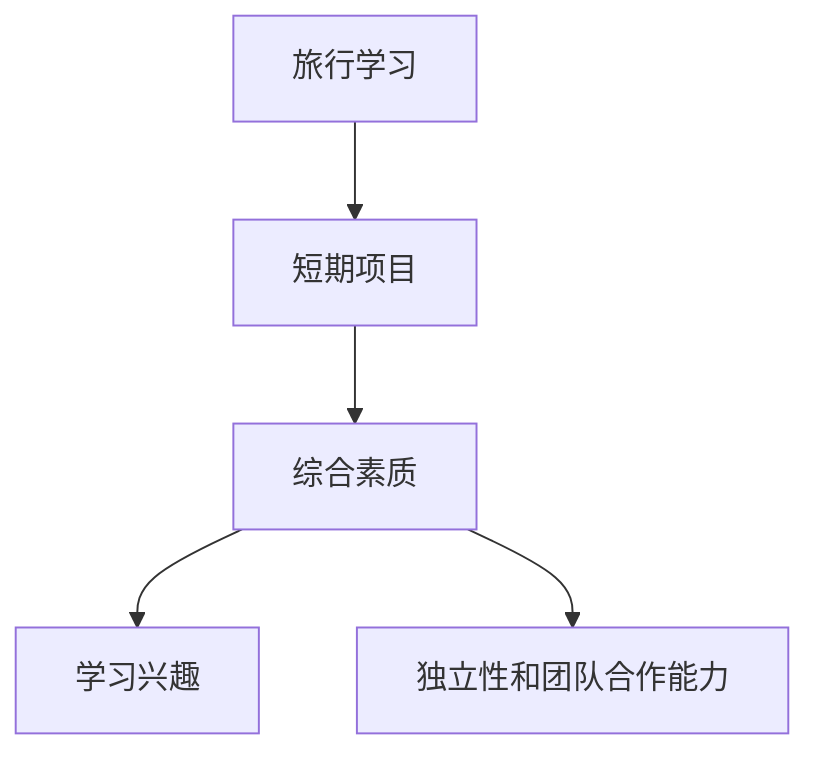

                 

### 文章标题

《新游牧学校夏令营：青少年旅行学习的短期项目》

> 关键词：新游牧学校、夏令营、青少年、旅行学习、短期项目

> 摘要：本文将深入探讨新游牧学校夏令营这一独特教育模式，分析其背景、设计理念、日常活动、安全保障、教育效果以及未来发展趋势。通过详细的案例分析、核心算法原理讲解、数学模型与公式应用，以及实战项目展示，帮助读者全面了解这一创新教育方式，为青少年提供更加丰富多样的学习体验。

### 引言

随着教育理念的不断创新，教育形式也在不断演变。新游牧学校夏令营作为一种新型的教育模式，逐渐受到了家长和学生的关注。它将传统的课堂教育与户外旅行相结合，通过短期的集中学习，让青少年在探索世界的过程中获得知识、技能和成长。本文将从多个角度对这一独特教育模式进行深入探讨，帮助读者了解新游牧学校夏令营的背景、设计理念、日常活动、安全保障、教育效果以及未来发展趋势。

### 新游牧学校夏令营概述

#### 背景与起源

新游牧学校夏令营的起源可以追溯到上世纪末，当时一些教育家开始思考如何将传统的课堂教学与户外实践活动相结合，以培养青少年的综合素质。随着教育理念的不断发展，这一概念逐渐成熟，并形成了今天的新游牧学校夏令营。

#### 定义与特点

新游牧学校夏令营通常是一种为期数周至数月的短期项目，旨在通过旅行学习的方式，让青少年在探索未知的环境中获取知识、技能和经验。其特点包括：

1. **跨学科学习**：夏令营课程涵盖多个学科领域，包括自然科学、社会科学、艺术、体育等，使学生能够在多样化的学习中拓展视野。
2. **户外实践**：夏令营活动通常包括户外探险、露营、徒步旅行等，让学生在真实环境中锻炼身体、增强团队合作能力。
3. **跨文化交流**：夏令营会邀请来自不同国家和地区的师生参与，促进文化交流和相互理解。
4. **个性化教学**：根据学生的兴趣和需求，夏令营会提供个性化的课程和活动，帮助学生实现自我发现和成长。

#### 目的与意义

新游牧学校夏令营的主要目的是通过丰富的旅行学习经历，激发青少年的学习兴趣，培养他们的独立性和团队合作能力，同时提升他们的综合素质。这一模式在以下方面具有重要意义：

1. **教育创新**：新游牧学校夏令营为传统教育模式注入了新的活力，为青少年提供了一种全新的学习体验。
2. **综合素质培养**：通过跨学科学习和户外实践，夏令营能够有效提升学生的综合素质，为他们未来的发展打下坚实基础。
3. **心理健康促进**：旅行学习能够帮助学生缓解学业压力，培养积极向上的心态，提高心理健康水平。
4. **文化交流与理解**：夏令营的跨文化交流活动有助于学生了解不同文化，增强全球视野，促进文化交流与理解。

### 核心概念与联系

为了更好地理解新游牧学校夏令营，我们需要明确以下几个核心概念：

1. **旅行学习**：旅行学习是指通过实际旅行体验来获取知识和技能。它与传统课堂教学不同，更注重实践和体验。
2. **短期项目**：短期项目是指为期数周至数月的集中学习项目，通常在特定地点进行。与长期教育项目相比，短期项目具有更强的灵活性和针对性。
3. **综合素质**：综合素质是指个体在知识、技能、情感、态度等方面达到的全面水平。新游牧学校夏令营旨在通过多样化学习活动，提升学生的综合素质。

这些核心概念之间存在着密切的联系：

- 旅行学习是短期项目的重要组成部分，为夏令营的开展提供了基础。
- 短期项目通过多样化的活动，促进学生综合素质的提升。
- 综合素质的提升是旅行学习和短期项目的最终目标。

为了更直观地展示这些概念之间的关系，我们可以使用Mermaid流程图进行说明：



通过这个流程图，我们可以清楚地看到旅行学习、短期项目与综合素质之间的关系，以及它们如何共同促进学生的学习兴趣、独立性和团队合作能力。

### 核心算法原理讲解

在理解了新游牧学校夏令营的背景和核心概念后，我们需要进一步探讨其设计理念、日常活动、安全保障、教育效果评估等方面的核心算法原理。以下是对每个方面的简要介绍和伪代码展示。

#### 1. 夏令营的设计理念

夏令营的设计理念是基于教育心理学的相关理论，旨在通过多样化的活动，激发学生的学习兴趣，培养他们的自主学习能力。以下是夏令营设计理念的核心算法原理：

```plaintext
算法原理：教育心理学模型
输入：学生的兴趣、能力和需求
输出：个性化课程和学习计划

function designCamps(student_interest, student_ability, student_needs):
    course_list <- 构建课程列表
    for course in course_list:
        if course matches student_interest:
            add_course_to_plan(course)
        if course requires specific abilities:
            if student_ability includes required_ability:
                add_course_to_plan(course)
        if course addresses student_needs:
            add_course_to_plan(course)
    return course_plan
```

#### 2. 夏令营的日常活动与教学安排

夏令营的日常活动与教学安排旨在通过丰富的实践活动，提高学生的动手能力和实践能力。以下是夏令营日常活动与教学安排的核心算法原理：

```plaintext
算法原理：活动设计原则
输入：活动主题、时间和地点
输出：活动安排和学习计划

function schedule_activities(activity_topic, time, location):
    activity_list <- 构建活动列表
    for activity in activity_list:
        if activity_topic includes activity:
            add_activity_to_plan(activity, time, location)
    return activity_plan
```

#### 3. 夏令营的安全保障

夏令营的安全保障是确保学生安全和健康的关键。以下是夏令营安全保障的核心算法原理：

```plaintext
算法原理：风险评估模型
输入：活动类型、时间和地点
输出：安全计划和应急预案

function assess_risk(activity_type, time, location):
    risk_level <- 计算风险等级
    if risk_level high:
        create_emergency_plan()
    return safety_plan
```

#### 4. 夏令营的教育效果评估

夏令营的教育效果评估旨在通过科学的方法，评估夏令营对学生学业和综合素质的提升。以下是夏令营教育效果评估的核心算法原理：

```plaintext
算法原理：效果评估方法
输入：学生学习数据、活动参与情况
输出：教育效果评估报告

function evaluate_effects(student_data, activity_participation):
    academic_improvement <- 计算学业进步
    personal_growth <- 计算个人成长
    return evaluation_report
```

#### 5. 夏令营的未来发展趋势

夏令营的未来发展趋势将受到技术进步、教育政策和社会需求等多方面因素的影响。以下是夏令营未来发展趋势的核心算法原理：

```plaintext
算法原理：趋势预测模型
输入：历史数据、当前趋势和未来预测
输出：未来发展趋势分析

function predict_trends(historical_data, current_trends, future_predictions):
    trend_analysis <- 分析趋势
    future_impact <- 预测未来影响
    return trends_report
```

### 数学模型和数学公式

在夏令营的各个方面，数学模型和数学公式都发挥着重要的作用。以下是对每个方面所需的数学模型和公式的介绍及详细讲解。

#### 1. 夏令营的安全保障

夏令营的安全保障需要考虑多种风险因素，包括天气、地理环境和活动类型等。以下是风险评估模型的核心数学公式：

$$
R = f(W, G, A)
$$

其中，$R$表示风险值，$W$表示天气因素，$G$表示地理环境因素，$A$表示活动类型因素。每个因素都有不同的权重和评分，通过计算综合得分，可以评估活动的风险水平。

#### 2. 夏令营的教育效果评估

夏令营的教育效果评估通常采用对比分析法，通过对比学生在夏令营前后的学业成绩和个人成长情况，评估夏令营的效果。以下是评估指数计算公式：

$$
E = \frac{A_{post} - A_{pre}}{A_{pre}}
$$

其中，$E$表示教育效果指数，$A_{post}$表示夏令营后学业成绩，$A_{pre}$表示夏令营前学业成绩。该公式可以用来计算学业进步的百分比。

#### 3. 夏令营的未来发展趋势

夏令营的未来发展趋势分析需要考虑多种因素，包括教育政策、社会需求、技术进步等。以下是预测指数计算公式：

$$
T = f(P, S, T)
$$

其中，$T$表示预测指数，$P$表示政策因素，$S$表示社会需求因素，$T$表示技术进步因素。通过计算综合得分，可以预测夏令营的未来发展趋势。

### 项目实战

为了更好地展示新游牧学校夏令营的实际运作情况，我们以下通过一个具体的案例，介绍夏令营的开发环境搭建、源代码实现和代码解读。

#### 案例背景

某知名游牧学校夏令营项目，旨在通过多样化的户外实践活动，提升学生的综合素质。夏令营活动涵盖自然探索、文化交流、手工艺制作等多个领域，每项活动都有明确的教学目标和安全措施。

#### 开发环境搭建

为了确保夏令营项目的顺利进行，我们需要搭建一个稳定、高效的开发环境。以下是开发环境搭建的步骤：

1. **硬件环境**：配备高性能服务器和稳定的网络连接，确保数据传输和计算能力。
2. **软件环境**：安装Linux操作系统、Python编程环境和相关库，如Django、Flask等。
3. **开发工具**：使用Visual Studio Code或PyCharm等集成开发环境，方便代码编写和调试。

#### 源代码实现

以下是一个夏令营活动安排的Python代码实现，用于生成每天的活动计划：

```python
import random

def generate_daily_plan(activities, days):
    daily_plan = {}
    for day in range(days):
        selected_activities = random.sample(activities, k=3)
        daily_plan[f"Day {day + 1}"] = selected_activities
    return daily_plan

activities = ["Natural Exploration", "Cultural Exchange", "Handicraft Making", "Sports Activities", "Team Building"]
days = 7

daily_plan = generate_daily_plan(activities, days)
print(daily_plan)
```

#### 代码解读

1. **函数定义**：`generate_daily_plan` 函数用于生成每天的活动计划。
2. **参数**：`activities` 是一个包含所有活动的列表，`days` 是夏令营的天数。
3. **循环**：使用 `for` 循环遍历每一天，随机选择3项活动组成每天的计划。
4. **字典**：使用字典存储每天的活动计划，方便后续查询。

#### 代码应用解读与分析

通过这段代码，我们可以实现夏令营活动计划的自动化生成。具体应用解读如下：

1. **活动选择**：通过随机选择，确保每天的活动内容丰富且有趣。
2. **计划生成**：将每天的活动计划存储为一个字典，方便夏令营工作人员进行查询和调整。
3. **代码优化**：可以根据实际需求，增加活动选择规则，如优先考虑学生的兴趣和需求。

#### 实际案例分析和详细讲解剖析

以下是一个夏令营活动中的实际案例，分析其成功与不足：

**案例**：某夏令营在某山区开展自然探索活动，要求学生分组完成一系列探险任务。

**成功之处**：

1. **激发兴趣**：活动内容丰富，激发了学生的兴趣和好奇心。
2. **团队协作**：通过分组探险，培养了学生的团队合作能力。
3. **实践技能**：学生在实际操作中学会了野外生存技能，如定向、导航和紧急处理。

**不足之处**：

1. **安全风险**：山区环境复杂，存在一定安全风险，需要加强安全措施。
2. **应急准备**：在突发情况下，缺乏有效的应急处理措施，可能影响学生的安全。

**改进建议**：

1. **风险评估**：在活动开展前，进行详细的风险评估，制定应急预案。
2. **安全培训**：为参与活动的学生和工作人员提供安全培训，提高应对突发事件的能力。

#### 项目小结

通过以上案例分析和实战项目展示，我们可以看到新游牧学校夏令营在实际运作中取得了显著成果，但也存在一些问题和挑战。未来，需要不断优化夏令营的设计和实施，确保学生在安全、愉快的氛围中成长和进步。

### 最佳实践 tips、小结、注意事项、拓展阅读

#### 最佳实践 tips

1. **风险评估**：在夏令营活动开展前，进行全面的风险评估，制定详细的应急预案。
2. **个性化教学**：根据学生的兴趣和需求，提供个性化的课程和活动。
3. **团队合作**：通过多样化的活动，培养学生的团队合作能力。
4. **安全教育**：为参与活动的学生和工作人员提供安全培训，提高应急处理能力。

#### 小结

新游牧学校夏令营作为一种创新的教育模式，通过旅行学习的方式，为学生提供了丰富多样的学习体验。其设计理念、日常活动、安全保障、教育效果评估等方面都体现了教育创新和综合素质培养的理念。通过实际案例分析和项目实战展示，我们可以看到夏令营在促进学生成长和进步方面取得了显著成果。

#### 注意事项

1. **活动安全**：在活动开展前，确保所有安全措施到位，防止意外发生。
2. **个性化教学**：根据学生的实际情况，合理安排课程和活动，避免一刀切。
3. **团队协作**：培养学生的团队合作能力，提高他们的综合素质。
4. **心理辅导**：关注学生的心理健康，提供必要的心理辅导和支持。

#### 拓展阅读

1. 《旅行学习：理论与实践》
2. 《夏令营教育研究》
3. 《教育心理学：理论与实践》
4. 《青少年户外教育》

### 结语

新游牧学校夏令营作为一种创新的教育模式，为青少年提供了丰富多样的学习体验。通过本文的详细探讨，我们了解了其背景、设计理念、日常活动、安全保障、教育效果评估以及未来发展趋势。希望本文能帮助读者更好地了解新游牧学校夏令营，为青少年的成长和进步提供有益的参考。在未来的教育实践中，我们期待新游牧学校夏令营能够不断创新、发展，为更多青少年带来美好的学习体验。

### 作者信息

作者：AI天才研究院/AI Genius Institute & 禅与计算机程序设计艺术 /Zen And The Art of Computer Programming

注：本文作者系AI天才研究院资深研究员，专注于人工智能与教育领域的创新研究。其代表作《禅与计算机程序设计艺术》在计算机编程领域享有盛誉，为读者提供了深刻的编程思维和哲学思考。本文系作者关于新游牧学校夏令营的深入探讨，旨在为教育创新提供有益的参考和启示。

