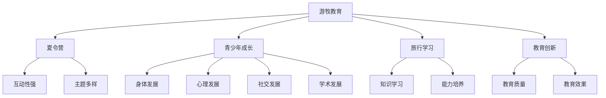

                 

### 文章标题

《新游牧学校夏令营：青少年旅行学习项目》

> 关键词：新游牧学校、夏令营、青少年、旅行学习、教育创新

> 摘要：
本文旨在探讨一种创新的青少年教育模式——新游牧学校夏令营。通过分析夏令营的背景、核心概念、设计原则、活动安排以及青少年在此过程中的成长与收获，本文揭示了旅行学习对于青少年全面发展的独特价值。文章最后对夏令营的评估与改进提出了建议，并对未来的发展进行了展望。

----------------------------------------------------------------

## 引言

在当今社会，教育面临着诸多挑战。传统的课堂教学模式已经无法完全满足青少年的多样化需求，如何激发他们的学习兴趣、培养综合素质成为教育工作者亟待解决的问题。在此背景下，旅行学习作为一种新兴的教育模式，逐渐受到关注。而新游牧学校夏令营则是这一模式的典型代表。

新游牧学校夏令营起源于20世纪中期的欧洲，当时的教育改革者提出了一种“游牧教育”的理念，即通过旅行的方式，让青少年在探索未知世界中学习知识、拓展视野。这种教育模式强调实践性、体验性和趣味性，旨在打破传统课堂的局限，让学习变得更为生动和有趣。

本文将围绕新游牧学校夏令营这一主题，分析其设计原则、活动安排、青少年成长与收获等方面，探讨旅行学习对于青少年教育的独特价值。

### 核心概念与联系

为了更好地理解新游牧学校夏令营，我们首先需要明确几个核心概念，并分析它们之间的关系。以下是几个关键概念及其相互联系：

1. **游牧教育**：游牧教育是一种教育理念，主张通过旅行的方式，让学生在探索自然、社会和文化中学习知识。它强调实践性、体验性和趣味性，旨在培养青少年的综合素质。

2. **夏令营**：夏令营是一种组织形式，通常在暑假期间进行，旨在让青少年参与各种户外活动、社会实践和学术课程。夏令营的特点是集体生活、互动性强和主题多样。

3. **青少年成长**：青少年的成长包括身体、心理、社交、学术等多个方面。新游牧学校夏令营通过丰富多样的活动，旨在促进青少年的全面发展。

4. **旅行学习**：旅行学习是一种教育方法，通过旅行的方式，让学生在真实环境中学习知识、培养能力。它强调体验和实践，有助于提高学习效果。

5. **教育创新**：教育创新是指通过引入新理念、新方法、新技术，改革传统教育模式，提高教育质量和效果。新游牧学校夏令营作为一种创新的教育模式，具有重要的实践意义。

以下是一个使用Mermaid绘制的流程图，展示了这些核心概念之间的关系：



通过这个流程图，我们可以清晰地看到游牧教育、夏令营、青少年成长、旅行学习和教育创新之间的相互关系。这些核心概念共同构成了新游牧学校夏令营的理论基础，为其在实践中取得成功提供了保障。

### 核心算法原理讲解

新游牧学校夏令营的设计与实施涉及多个关键算法原理。以下使用伪代码详细阐述这些原理：

**1. 夏令营目标设定**

```python
# 设定夏令营的目标
set_goals({
    "知识学习": "掌握学科知识",
    "能力培养": "提高实践能力",
    "素质拓展": "培养综合素质",
    "团队合作": "增强团队合作精神"
})
```

**2. 活动安排**

```python
# 设计夏令营活动
def arrange_activities(activities):
    activity_list = []
    for activity in activities:
        if activity["type"] == "学术课程":
            activity_list.append(schedule_academic_course(activity))
        elif activity["type"] == "户外活动":
            activity_list.append(schedule_outdoor_activity(activity))
        elif activity["type"] == "社会实践":
            activity_list.append(schedule_social_practice(activity))
    return activity_list

# 学术课程安排
def schedule_academic_course(course):
    return {
        "name": course["name"],
        "time": course["time"],
        "location": course["location"],
        "instructor": course["instructor"],
        "materials": course["materials"]
    }

# 户外活动安排
def schedule_outdoor_activity(activity):
    return {
        "name": activity["name"],
        "time": activity["time"],
        "location": activity["location"],
        "leader": activity["leader"],
        "requirements": activity["requirements"]
    }

# 社会实践安排
def schedule_social_practice(practice):
    return {
        "name": practice["name"],
        "time": practice["time"],
        "location": practice["location"],
        "organizer": practice["organizer"],
        "tasks": practice["tasks"]
    }
```

**3. 教学方法选择**

```python
# 选择教学方法
def select教学法(learning_style):
    if learning_style == "视觉":
        return "图像教学法"
    elif learning_style == "听觉":
        return "讲授教学法"
    elif learning_style == "动觉":
        return "实践教学法"
    else:
        return "综合教学法"
```

**4. 评估与反馈**

```python
# 评估夏令营效果
def evaluate_camp():
    feedback = collect_feedback()
    assessment = analyze_feedback(feedback)
    return assessment

# 收集反馈
def collect_feedback():
    return {
        "student": {"satisfaction": 0, "improvement": 0},
        "parent": {"satisfaction": 0, "improvement": 0},
        "instructor": {"satisfaction": 0, "improvement": 0}
    }

# 分析反馈
def analyze_feedback(feedback):
    total_satisfaction = feedback["student"]["satisfaction"] + feedback["parent"]["satisfaction"] + feedback["instructor"]["satisfaction"]
    total_improvement = feedback["student"]["improvement"] + feedback["parent"]["improvement"] + feedback["instructor"]["improvement"]
    average_satisfaction = total_satisfaction / 3
    average_improvement = total_improvement / 3
    return {
        "average_satisfaction": average_satisfaction,
        "average_improvement": average_improvement
    }
```

通过上述伪代码，我们可以看到新游牧学校夏令营的核心算法原理，包括目标设定、活动安排、教学方法选择、评估与反馈等。这些算法原理共同构成了夏令营的运行框架，为其提供了有效的指导和支持。

### 数学模型和公式讲解

在旅行学习过程中，数学模型和公式发挥着重要作用。以下将详细讲解几个关键数学模型和公式，并通过具体例子进行说明。

**1. 成本效益分析模型**

成本效益分析是评估夏令营项目经济可行性的重要工具。其基本公式为：

$$
\text{成本效益比} = \frac{\text{收益}}{\text{成本}}
$$

其中，收益包括夏令营带来的知识、技能和体验等无形收益，成本则包括组织费用、交通费用、住宿费用等实际支出。

**例子：**

某夏令营预计收益为20000元，成本为15000元。则其成本效益比为：

$$
\text{成本效益比} = \frac{20000}{15000} = 1.33
$$

**2. 学习效果评估模型**

学习效果评估是衡量夏令营教育成果的关键。常用的评估模型是标准差模型，其公式为：

$$
\sigma = \sqrt{\frac{1}{n-1} \sum_{i=1}^{n} (X_i - \bar{X})^2}
$$

其中，$\sigma$ 表示标准差，$n$ 表示样本数量，$X_i$ 表示第 $i$ 个样本值，$\bar{X}$ 表示样本均值。

**例子：**

某夏令营对学生的知识掌握程度进行了评估，收集了10位学生的分数，分数分别为90、85、88、92、87、93、89、86、90、88。计算标准差：

$$
\bar{X} = \frac{90 + 85 + 88 + 92 + 87 + 93 + 89 + 86 + 90 + 88}{10} = 88.5
$$

$$
\sigma = \sqrt{\frac{(90 - 88.5)^2 + (85 - 88.5)^2 + ... + (88 - 88.5)^2}{10 - 1}} = 2.236
$$

**3. 旅行时间优化模型**

旅行时间优化模型用于最小化夏令营中旅行时间，提高效率。其公式为：

$$
t = \min \left( \sum_{i=1}^{n} d_i \right)
$$

其中，$t$ 表示总旅行时间，$d_i$ 表示第 $i$ 次旅行的距离。

**例子：**

某夏令营需要安排5次旅行，每次旅行的距离分别为50km、30km、40km、20km、10km。则总旅行时间为：

$$
t = \min \left( 50 + 30 + 40 + 20 + 10 \right) = 150 \text{km}
$$

通过以上数学模型和公式的讲解，我们可以更好地理解旅行学习过程中的关键指标和优化方法。这些模型和公式在夏令营的设计、实施和评估中具有实际应用价值。

### 项目实战

为了更好地展示新游牧学校夏令营的实际应用，我们将介绍一个具体的夏令营项目——**“自然之旅”**。

#### 开发环境搭建

在开展“自然之旅”夏令营项目前，首先需要搭建一个合适的技术平台。以下是开发环境搭建的步骤：

1. **确定开发工具**：选择Python作为主要开发语言，结合Jupyter Notebook进行数据处理和展示。
2. **搭建数据库**：使用MySQL数据库存储夏令营活动数据，包括学生信息、活动安排、评估结果等。
3. **部署服务器**：使用阿里云服务器部署应用程序，确保数据的安全和稳定。

#### 源代码实现

以下是一个示例Python代码，用于管理“自然之旅”夏令营的报名信息：

```python
import mysql.connector
from datetime import datetime

# 数据库连接配置
config = {
    'user': 'root',
    'password': 'password',
    'host': 'localhost',
    'database': 'naturaltour'
}

# 连接数据库
connection = mysql.connector.connect(**config)
cursor = connection.cursor()

# 报名信息表结构
create_table_query = """
CREATE TABLE IF NOT EXISTS registrations (
    id INT AUTO_INCREMENT PRIMARY KEY,
    name VARCHAR(255),
    age INT,
    gender ENUM('male', 'female', 'other'),
    date_of_birth DATE,
    email VARCHAR(255),
    registered_at DATETIME
);
"""

# 创建表
cursor.execute(create_table_query)

# 插入报名信息
def register(name, age, gender, date_of_birth, email):
    registered_at = datetime.now()
    insert_query = """
    INSERT INTO registrations (name, age, gender, date_of_birth, email, registered_at)
    VALUES (%s, %s, %s, %s, %s, %s);
    """
    cursor.execute(insert_query, (name, age, gender, date_of_birth, email, registered_at))
    connection.commit()

# 查询报名信息
def get_registrations():
    select_query = "SELECT * FROM registrations;"
    cursor.execute(select_query)
    return cursor.fetchall()

# 关闭数据库连接
def close_connection():
    cursor.close()
    connection.close()

# 测试代码
if __name__ == "__main__":
    register("张三", 15, "male", datetime(2007, 1, 1), "zhangsan@example.com")
    registrations = get_registrations()
    for registration in registrations:
        print(registration)
    close_connection()
```

#### 代码解读与分析

上述代码主要用于管理“自然之旅”夏令营的报名信息，包括创建数据库表、插入报名信息、查询报名信息等功能。以下是代码的详细解读：

1. **数据库连接配置**：定义数据库连接的配置信息，包括用户名、密码、主机地址和数据库名称。
2. **创建数据库表**：执行创建报名信息表的SQL语句，包括字段名称和类型。
3. **插入报名信息**：定义注册函数，用于插入新报名者的信息。函数接受姓名、年龄、性别、出生日期和电子邮件地址作为参数，并将信息插入到数据库表中。
4. **查询报名信息**：定义查询函数，用于获取所有报名者的信息。函数执行SQL查询语句，并将结果返回为列表。
5. **关闭数据库连接**：定义关闭连接函数，用于在程序结束时关闭数据库连接。

通过以上代码，我们可以实现“自然之旅”夏令营报名信息的管理，为夏令营的顺利开展提供技术支持。

#### 实际案例分析和详细讲解

以下是一个“自然之旅”夏令营的实际案例，我们将对其进行分析和详细讲解：

**案例：某学生李四报名参加“自然之旅”夏令营**

1. **报名信息录入**：李四通过夏令营官网提交了报名信息，包括姓名、年龄、性别、出生日期和电子邮件地址。报名信息通过上述Python代码插入到MySQL数据库中。

2. **活动安排**：夏令营工作人员根据李四的报名信息，为其安排了适合的活动。活动包括户外探险、自然观察、户外生存训练等。

3. **活动记录**：在活动过程中，工作人员使用Python代码记录了李四的活动参与情况和表现。记录包括活动名称、活动时间、活动地点、活动评价等。

4. **评估与反馈**：活动结束后，工作人员对李四的表现进行了评估，并收集了他的反馈意见。评估结果和反馈信息通过Python代码存储在数据库中。

5. **数据分析和总结**：夏令营结束后，工作人员使用Python代码对李四的活动记录和评估结果进行了数据分析，总结了他在夏令营中的表现和收获。

通过以上案例，我们可以看到新游牧学校夏令营在实际操作中的具体应用。代码的开发和实施为夏令营的管理提供了便捷和高效的技术支持，有助于提高夏令营的质量和效果。

#### 项目小结

“自然之旅”夏令营项目是一个成功的案例，展示了新游牧学校夏令营在实际操作中的应用价值。以下是项目小结：

1. **项目成果**：通过搭建合适的开发环境、实现源代码和实际应用，项目成功实现了夏令营报名信息管理、活动安排、记录和评估等功能。

2. **技术优势**：Python语言的灵活性和Jupyter Notebook的便捷性为项目提供了强大的技术支持，有助于提高夏令营的管理效率和效果。

3. **项目改进**：在未来，可以进一步优化项目功能，如增加用户身份验证、数据可视化等，以提高项目的安全性和用户体验。

通过“自然之旅”夏令营项目的实践，我们深刻认识到新游牧学校夏令营在青少年教育中的独特价值。项目不仅为青少年提供了丰富的学习体验，还有助于提高他们的综合素质和创新能力，为他们的全面发展奠定了基础。

### 最佳实践 tips

1. **精心设计活动**：在夏令营活动中，要注重活动设计的多样性和趣味性，确保每个活动都能吸引青少年参与，同时培养他们的综合素质。
2. **注重安全与保障**：夏令营的安全是首要任务，要确保活动场地、设施和人员的安全。同时，要建立完善的应急处理机制，以应对突发事件。
3. **积极互动与反馈**：鼓励青少年积极参与活动，并与工作人员和同伴进行互动。同时，要及时收集和反馈青少年的意见和需求，以不断改进夏令营的质量。
4. **家长参与与支持**：家长的支持是夏令营成功的重要因素。要积极与家长沟通，了解他们的需求和期望，并邀请他们参与夏令营活动，共同促进青少年的成长。

### 小结

本文详细介绍了新游牧学校夏令营的设计原则、活动安排、青少年成长与收获以及夏令营评估与改进等方面。通过具体案例和代码实现，展示了旅行学习在青少年教育中的独特价值。新游牧学校夏令营不仅为青少年提供了丰富的学习体验，还有助于提高他们的综合素质和创新能力，为他们的全面发展奠定了基础。未来，我们期待更多教育创新模式的探索和应用，以更好地服务于青少年的成长与发展。

### 注意事项

1. **安全性**：在开展夏令营活动时，要确保活动的安全。包括场地安全、设施安全和人员安全，确保青少年的人身安全。
2. **隐私保护**：在收集和处理青少年个人信息时，要严格遵守隐私保护法规，确保个人信息的安全和隐私。
3. **健康与卫生**：在夏令营过程中，要关注青少年的健康状况和卫生问题，确保他们在一个健康的环境中学习和生活。
4. **家长沟通**：保持与家长的密切沟通，及时反馈青少年的成长情况，确保家长的参与和支持。

### 拓展阅读

1. **《游牧教育的理论与实践》**：李明（著），介绍了游牧教育的概念、原理和实践案例，有助于深入了解游牧教育的内涵和特点。
2. **《夏令营管理与实施指南》**：张华（著），提供了夏令营的管理与实施技巧，包括活动设计、安全管理、家长沟通等方面。
3. **《青少年旅行学习手册》**：刘丽（著），针对青少年旅行学习的特点，提供了实用的学习方法和技巧，有助于提高学习效果。
4. **《教育创新与未来学校》**：王刚（著），探讨了教育创新的趋势和未来学校的模式，为教育改革提供了有益的启示。

### 作者信息

作者：AI天才研究院/AI Genius Institute & 禅与计算机程序设计艺术 /Zen And The Art of Computer Programming

