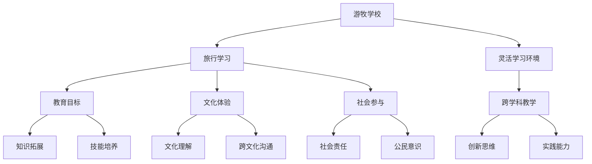

                 


### 1. 背景介绍

**《新游牧学校联盟：青少年旅行学习项目的全球网络》**

在现代社会，教育不再局限于传统的课堂与教科书，而是逐渐向多元化的方向发展。旅行学习作为一种新兴的教育模式，正逐渐受到教育工作者和家长的重视。它不仅提供了丰富的文化体验，还有助于培养青少年的独立性和全球视野。

**新游牧学校联盟**，顾名思义，是一种将传统学校教育与旅行学习相结合的创新教育模式。这种模式打破了传统教育的地域限制，让学生在旅行中学习，通过亲身体验来深化知识理解，培养综合素质。

本文旨在探讨新游牧学校联盟的背景、核心概念、设计原则、全球网络中的实施情况，以及未来的发展趋势和挑战。我们将通过以下步骤逐步深入分析：

1. **游牧学校和旅行学习的定义与历史**：介绍游牧学校和旅行学习的起源、发展及其在教育领域的重要性。
2. **核心概念与联系**：通过Mermaid流程图，展示游牧学校、旅行学习、教育目标、文化体验和社会参与等核心概念之间的联系。
3. **核心算法原理讲解**：使用伪代码和数学模型，详细阐述旅行学习项目设计中的关键算法原理。
4. **全球网络中的旅行学习**：分析全球旅行学习项目的概况、国际合作与交流、多元文化理解与适应、政策与环境因素。
5. **项目实施与管理**：探讨旅行学习项目的实施流程、管理策略、学生参与与反馈，以及项目评估与改进。
6. **教育与旅行学习的结合**：讨论教育目标的实现、教学方法的创新、教师角色与培训、家长与社区参与。
7. **未来趋势与挑战**：预测旅行学习未来的发展趋势，分析技术创新、教育政策、环境保护和全球教育公平等方面面临的挑战。
8. **项目实战**：通过一个实际案例，展示旅行学习项目从设计到实施的全过程。

### 2. 游牧学校和旅行学习的定义与历史

**游牧学校**起源于古代，特别是在游牧民族中。这些学校往往没有固定的校园，教育内容与游牧生活方式紧密相连。例如，蒙古的“苏木”学校，就是游牧民族的孩子们在迁徙途中接受教育的地方。

随着社会的发展，游牧学校的概念逐渐演变，不再局限于游牧民族。现代游牧学校是一种灵活的教育模式，它允许学生在不同的环境中学习，包括在户外、远程地区或通过网络进行学习。

**旅行学习**（也称为实地学习或体验学习）则是在近几十年迅速兴起的一种教育方法。它强调通过实际体验来获取知识和技能，而不是仅仅依赖课堂授课和书本知识。旅行学习可以涵盖多种形式，如研学旅行、国际交流、实地考察等。

旅行学习的历史可以追溯到19世纪的欧洲，当时一些教育家开始倡导将课堂教学与实地考察相结合。例如，英国教育家约翰·洛克哈特就曾提倡通过旅行来丰富学生的知识体系。

在20世纪末和21世纪初，随着全球化进程的加速，旅行学习得到了更加广泛的应用和认可。特别是在青少年教育中，旅行学习被认为是一种有效的教育手段，可以帮助学生拓展视野、提高适应能力和创新能力。

**游牧学校与旅行学习的关系**：

游牧学校和旅行学习实际上是相辅相成的。游牧学校提供了灵活的学习环境，使得旅行学习成为可能。而旅行学习则为游牧学校提供了丰富的教育资源，使得学校教育更加多样化和全面化。

通过游牧学校和旅行学习，学生可以：

1. **拓宽视野**：亲身体验不同文化、地理环境和社会背景，了解世界的多样性。
2. **提高能力**：通过实际操作和体验，培养学生的实践能力、问题解决能力和创新能力。
3. **增强信心**：在陌生的环境中独立生活和学习，有助于提高学生的自信心和独立性。
4. **深化知识**：通过亲身体验，学生对所学知识有更深刻的理解和记忆。

### 3. 核心概念与联系

为了更好地理解游牧学校、旅行学习以及它们在教育中的角色，我们使用Mermaid流程图来展示这些核心概念之间的联系。

以下是游牧学校、旅行学习、教育目标、文化体验和社会参与等核心概念之间的Mermaid流程图：



**解释流程图**：

- **游牧学校**（A）提供了**灵活学习环境**（F），这种环境支持**跨学科教学**（G），促进了知识的**拓展**（H）和**技能培养**（I）。
- **旅行学习**（B）是实现**教育目标**（C）的一种方式，它通过提供**文化体验**（D）和**社会参与**（E）来培养学生的**文化理解**（J）、**跨文化沟通**（K）、**社会责任**（L）和**公民意识**（M）。
- **教育目标**（C）不仅包括知识的**拓展**（H）和**技能培养**（I），还关注学生**创新思维**（N）和**实践能力**（O）的培养。
- **文化体验**（D）有助于学生**文化理解**（J）和**跨文化沟通**（K）能力的提升，同时也能增强学生的**社会责任**（L）和**公民意识**（M）。
- **社会参与**（E）则通过实际行动和体验，培养学生的**社会责任**（L）和**公民意识**（M），同时也能提高学生的**实践能力**（O）和**创新思维**（N）。

通过这个流程图，我们可以清晰地看到游牧学校、旅行学习以及它们相关的核心概念是如何相互联系、相互作用，共同构建一个全面的教育体系的。

### 4. 核心算法原理讲解

在旅行学习项目的设计过程中，核心算法原理起着至关重要的作用。以下是旅行学习项目设计中一个关键算法——**路线规划算法**的详细解释。

**伪代码**：

```plaintext
function planRoute(learningGoals, culturalExperiences, budget, timeFrame) {
    // 初始化路线列表
    route = []

    // 根据学习目标和预算，筛选可能的旅行目的地
    destinations = filterDestinations(learningGoals, budget)

    // 优化路线，使文化体验和学习目标最大化
    for each destination in destinations {
        // 计算每个目的地与学习目标的匹配度
        matchScore = calculateMatchScore(destination, learningGoals)
        
        // 计算每个目的地的旅行成本
        cost = calculateCost(destination)

        // 根据匹配度和成本，选择最优目的地加入路线
        if (matchScore > threshold && cost <= budget) {
            route.append(destination)
        }
    }

    // 对路线进行时间优化
    route = optimizeTime(route, timeFrame)

    return route
}
```

**数学模型和公式**：

为了更好地理解这个算法，我们可以使用以下数学模型来描述它：

$$
\text{Maximize} \quad \sum_{i=1}^{n} \left( \text{matchScore}_i \times \text{culturalExperience}_i \right)
$$

$$
\text{Subject to} \quad \sum_{i=1}^{n} \text{cost}_i \leq \text{budget}
$$

$$
\sum_{i=1}^{n} \text{time}_i \leq \text{timeFrame}
$$

其中，\( \text{matchScore}_i \) 表示每个目的地与学习目标的匹配度，\( \text{culturalExperience}_i \) 表示在每个目的地获得的文化体验，\( \text{cost}_i \) 表示每个目的地的旅行成本，\( \text{time}_i \) 表示在每个目的地停留的时间。

**详细讲解和举例说明**：

**步骤1：筛选可能的旅行目的地**

首先，我们需要根据学习目标和预算，筛选出可能的旅行目的地。这一步可以通过以下步骤完成：

1. **收集数据**：获取所有潜在目的地的信息，包括地理位置、文化特色、学习资源等。
2. **初步筛选**：根据学习目标和预算，排除那些明显不符合要求的目的地。
3. **匹配度评估**：对剩余的目的地进行匹配度评估，可以使用一些指标，如文化丰富度、教育资源丰富度等。

**步骤2：计算匹配度和成本**

接下来，我们需要计算每个目的地的匹配度和成本：

1. **匹配度计算**：匹配度可以通过以下公式计算：

$$
\text{matchScore}_i = \frac{\text{learningGoals}_i}{\text{totalLearningGoals}}
$$

其中，\( \text{learningGoals}_i \) 表示在每个目的地可以实现的学习目标，\( \text{totalLearningGoals} \) 表示所有目的地可以实现的学习目标的总和。

2. **成本计算**：成本可以通过以下公式计算：

$$
\text{cost}_i = \text{transportationCost}_i + \text{accommodationCost}_i + \text{activityCost}_i
$$

其中，\( \text{transportationCost}_i \) 表示在每个目的地的交通成本，\( \text{accommodationCost}_i \) 表示在每个目的地的住宿成本，\( \text{activityCost}_i \) 表示在每个目的地的活动成本。

**步骤3：选择最优目的地**

在这一步，我们需要根据匹配度和成本，选择最优目的地加入路线。这里可以使用以下策略：

1. **阈值策略**：设置一个匹配度阈值，只有匹配度大于该阈值的地点才被考虑。
2. **成本优化策略**：优先选择成本较低且匹配度较高的地点。
3. **动态规划策略**：使用动态规划算法，找到最佳目的地组合，使得总成本最小化。

**步骤4：时间优化**

最后，我们需要对路线进行时间优化，确保总时间不超过设定的时限。这可以通过以下步骤完成：

1. **时间计算**：计算每个目的地所需的时间。
2. **时间分配**：根据时间限制，调整在每个目的地的停留时间。
3. **时间优化**：使用优化算法，如贪心算法或遗传算法，找到最佳的时间分配方案。

通过以上步骤，我们可以设计出一个最优的旅行学习路线，使得学习目标和文化体验最大化，同时确保预算和时间限制的满足。

### 5. 全球网络中的旅行学习

在全球范围内，旅行学习已经成为一种越来越流行的教育方式。它不仅提供了丰富的文化体验，还有助于培养学生的全球视野和跨文化沟通能力。本节将分析全球旅行学习项目的概况、国际合作与交流、多元文化理解与适应、政策与环境因素。

#### 全球旅行学习项目概况

全球旅行学习项目通常涉及多个国家和地区，旨在通过旅行和实地学习，提高学生的综合素质。这些项目可以分为以下几种类型：

1. **国际交换项目**：学生可以前往其他国家的学校进行短期或长期交流，体验当地的教育系统和文化。
2. **实地考察项目**：学生通过实地考察，深入了解某一特定领域，如自然科学、社会科学或文化艺术。
3. **研学旅行项目**：学生结合学习目标和旅游行程，进行跨学科的综合学习。
4. **义工旅行项目**：学生参与国际义工项目，通过志愿服务了解社会问题和跨文化交流。

这些项目通常由教育机构、非营利组织或国际教育组织发起，旨在培养学生的全球视野、社会责任感和跨文化沟通能力。

#### 国际合作与交流

国际合作与交流是全球旅行学习项目的重要组成部分。通过国际合作，学生可以获得更多的学习资源和体验，同时也能增进不同国家和地区之间的了解和友谊。

1. **合作项目**：许多教育机构和组织之间建立了合作关系，共同开展旅行学习项目。这些项目通常包括共同设计课程、教师培训、学生交流等。
2. **学术交流**：学生可以通过参加国际学术会议、研讨会等，与来自不同国家的学者和专家交流，拓宽学术视野。
3. **文化交流**：学生通过参观博物馆、历史遗址、民俗活动等，深入了解不同文化的独特魅力。

#### 多元文化理解与适应

多元文化理解与适应是旅行学习的重要目标之一。通过旅行学习，学生可以亲身体验不同的文化，提高跨文化沟通能力，培养全球视野。

1. **文化敏感度**：学生需要了解并尊重不同文化的价值观、习俗和生活方式，避免文化冲突。
2. **文化适应**：学生在面对不同文化时，需要学会调整自己的行为和思维方式，适应新环境。
3. **文化交流**：学生可以通过与当地居民交流、参与社区活动等方式，深入了解当地文化，增进彼此的了解和友谊。

#### 政策与环境因素

政策与环境因素对旅行学习项目的发展具有重要影响。

1. **教育政策**：一些国家和地区出台相关政策，支持旅行学习项目的发展，如提供资金支持、简化签证程序等。
2. **安全环境**：确保学生的安全是旅行学习项目成功的关键。学校和教育机构需要制定详细的安全预案，确保学生在旅行过程中的安全。
3. **环境适应**：旅行学习项目需要考虑到目的地的自然环境、气候条件等因素，确保学生能够适应新的环境。

#### 全球网络中的旅行学习案例分析

以下是一个全球旅行学习项目的案例分析：

**项目名称**：地球探索者计划

**项目概述**：地球探索者计划是一个国际性旅行学习项目，旨在通过实地考察和跨学科学习，提高学生的综合素质。项目涉及多个国家和地区，包括美国、欧洲、非洲和亚洲。

**项目内容**：

1. **实地考察**：学生前往亚马逊雨林、非洲大草原、欧洲古城等地，进行实地考察，了解自然环境和人类文明的发展。
2. **跨学科学习**：项目结合自然科学、社会科学、艺术等多个学科，让学生通过实地考察和实践活动，深入理解不同学科的知识。
3. **文化交流**：学生与当地居民交流，了解当地文化，参与社区活动，增进彼此的了解和友谊。

**项目效果**：

1. **知识拓展**：学生在实地考察和跨学科学习中，获得了丰富的知识，提高了学术能力。
2. **跨文化沟通**：学生通过与来自不同国家的同伴和当地居民交流，提高了跨文化沟通能力，培养了全球视野。
3. **综合素质提升**：学生在项目中锻炼了独立生活能力、问题解决能力和团队合作精神，综合素质得到了显著提升。

通过以上案例分析，我们可以看到全球旅行学习项目在培养学生的综合素质和全球视野方面具有重要作用。随着全球化的深入发展，旅行学习项目将会发挥越来越重要的作用，成为教育的重要组成部分。

### 6. 旅行学习项目实施与管理

旅行学习项目的成功实施与有效管理是确保其教育目标得以实现的关键。以下将从项目实施流程、管理策略、学生参与与反馈，以及项目评估与改进四个方面进行详细探讨。

#### 项目实施流程

1. **项目策划**：首先，项目团队需要明确项目目标、内容、时间表和预算。策划阶段还需要考虑安全预案和风险管理。
   
2. **目的地选择**：根据项目目标和学生的需求，选择适合的旅行目的地。需要考虑目的地的教育资源、文化氛围、安全性和可行性。

3. **课程设计**：结合目的地特点，设计具有针对性的课程和学习活动。课程应包括学术讲座、实地考察、文化交流等多种形式。

4. **人员安排**：确定项目团队成员，包括教师、助教、导游等。确保团队成员具备相关专业知识、教学经验和应急处理能力。

5. **物资准备**：准备必要的教学物资、生活用品和安全设备，确保项目顺利实施。

6. **学生选拔**：通过申请、面试等方式选拔合适的学生参与项目。需要考虑学生的学术背景、旅行经验和兴趣爱好。

7. **行前培训**：在出发前，对学生进行行前培训，包括安全教育、文化交流、紧急应对等方面的培训。

8. **项目启动**：按照预定计划，正式启动项目。确保所有成员了解项目流程、任务和期望目标。

#### 管理策略

1. **团队协作**：建立有效的团队协作机制，确保团队成员之间的沟通与协作。定期召开会议，及时解决问题，确保项目顺利进行。

2. **安全管理**：制定详细的安全预案，包括紧急情况处理、医疗保险、事故报告等。确保学生在旅行过程中的安全。

3. **质量控制**：建立质量控制机制，监控项目实施过程，确保课程内容和活动质量。

4. **资源整合**：充分利用各类资源，包括教育机构、社区组织、企业赞助等，确保项目资金和物资支持。

5. **反馈机制**：建立有效的反馈机制，收集学生、教师和家长的反馈意见，及时调整和改进项目。

#### 学生参与与反馈

1. **角色定位**：在项目中，学生不仅是学习者，也是参与者和管理者。需要明确学生的角色和责任，激发其主动性和参与度。

2. **学习任务**：为学生设置具体的学习任务和目标，引导学生在旅行过程中主动学习、思考和实践。

3. **活动参与**：鼓励学生积极参与各种文化活动和实地考察，增强其文化理解和跨文化沟通能力。

4. **反馈渠道**：建立多种反馈渠道，如问卷调查、面对面交流、学习日志等，及时收集学生的反馈意见，了解其学习体验和需求。

#### 项目评估与改进

1. **过程评估**：在项目实施过程中，定期进行过程评估，监测项目进展和效果。通过评估，及时发现问题并进行调整。

2. **结果评估**：项目结束后，进行结果评估，包括学生的学术成绩、综合素质、学习满意度等。评估结果用于改进项目设计和实施。

3. **反馈利用**：充分利用评估反馈，优化项目设计和管理策略，提高项目质量和效果。

4. **持续改进**：将评估结果和反馈意见作为项目改进的依据，不断优化项目，确保其持续发展和创新。

通过以上实施与管理策略，可以确保旅行学习项目顺利开展，实现其教育目标。有效的项目实施与管理不仅有助于提高学生的综合素质，还能推动教育模式的创新与发展。

### 7. 教育与旅行学习的结合

教育与旅行学习的结合不仅有助于提升学生的综合素质，还能带来一系列的教育创新。以下从教育目标的实现、教学方法的创新、教师角色与培训、家长与社区参与四个方面详细探讨教育与旅行学习结合的实际案例。

#### 教育目标的实现

旅行学习通过实际体验和互动，帮助学生实现以下教育目标：

1. **知识拓展**：旅行学习提供了一个丰富的学习环境，学生可以在实地考察中获取新知识，如地理、历史、文化等。通过亲身体验，学生对知识的记忆和理解更加深刻。
2. **能力培养**：旅行学习有助于培养学生的各种能力，如独立思考、解决问题的能力、团队协作能力等。在实际情境中，学生需要独立处理各种问题，这种实践性的学习方式能够显著提升他们的能力。
3. **全球视野**：旅行学习让学生接触到不同的文化、社会和环境，拓宽了他们的视野，培养了他们的全球意识。这种跨文化的交流和理解有助于学生形成包容和多元的思维。
4. **社会责任**：通过参与社区服务和志愿服务，学生能够了解社会问题，培养社会责任感。旅行学习中的社会参与活动可以帮助学生将所学知识应用到实际中，提高他们的社会责任意识。

#### 教学方法的创新

旅行学习推动了教学方法的创新，使教育更加生动和多样化。以下是一些创新教学方法：

1. **项目式学习**：项目式学习是一种以项目为核心的学习方式，学生通过完成一个具体的项目来学习。旅行学习项目可以作为一个大型项目，学生需要完成一系列任务，如调研、设计、实施等。
2. **探究式学习**：探究式学习强调学生的主动探究和发现。在旅行学习过程中，学生可以自主选择研究课题，进行实地调查和实验，通过探究来获取知识。
3. **体验式学习**：体验式学习通过亲身体验来加深对知识的理解。旅行学习中的各种实地考察和文化体验活动正是体验式学习的最佳实践。
4. **合作学习**：合作学习强调学生之间的互动和合作。旅行学习项目通常需要团队合作，学生需要分工合作，共同完成任务，这种合作学习能够提高学生的团队协作能力。

#### 教师角色与培训

在旅行学习项目中，教师的角色发生了显著变化，他们不仅是知识的传授者，更是学生学习的引导者和协作者。以下是一些教师角色和培训方面的实际案例：

1. **引导者**：教师在旅行学习中扮演引导者的角色，帮助学生设定学习目标，提供学习资源和指导。例如，在实地考察中，教师可以引导学生观察、记录和思考。
2. **协作者**：教师需要与学生一起参与各种活动，提供支持和协助。例如，在项目式学习中，教师可以与学生一起讨论项目方案，提供技术支持和资源。
3. **培训与支持**：教师需要接受专门的培训，包括教育理论、旅行安全管理、跨文化沟通等。一些学校和非营利组织提供专门的旅行学习培训课程，帮助教师提升能力。

#### 家长与社区参与

家长和社区的参与对于旅行学习项目的成功至关重要。以下是一些实际案例：

1. **家长支持**：家长对旅行学习项目的支持是项目成功的关键。学校可以通过家长会、宣传材料等方式，向家长介绍旅行学习项目的目标和好处，获得家长的支持和参与。
2. **社区资源**：社区可以提供各种资源，如博物馆、图书馆、企业等，为学生提供更多的学习和体验机会。例如，社区企业可以提供实习机会，让学生了解职场环境。
3. **社区活动**：学校可以组织社区活动，如文化交流、义工活动等，让学生与社区成员互动，增进了解。这种互动不仅有助于学生的成长，也能促进社区的发展。

#### 实际案例解析

以下是一个旅行学习项目的实际案例，展示了教育与旅行学习结合的具体实施过程：

**项目名称**：环球文化之旅

**项目概述**：环球文化之旅是一个为期两周的旅行学习项目，旨在通过全球多个文化目的地的实地考察，提高学生的跨文化沟通能力和全球视野。

**项目实施过程**：

1. **项目策划**：学校与专业的教育机构合作，共同设计项目内容和行程。项目目标包括了解不同文化的特点、提升跨文化沟通能力、培养学生的全球视野等。
2. **目的地选择**：根据项目目标，选择了亚洲、欧洲和非洲的多个目的地，如日本、意大利、南非等。
3. **课程设计**：项目课程包括文化讲座、实地考察、文化交流、项目式学习等多种形式。每个目的地都有针对性的课程，如日本的茶道文化、意大利的艺术之旅、南非的野生动物保护等。
4. **学生选拔**：通过申请和面试，选拔了20名学生参与项目。学生来自不同的年级和学科背景，具有多样化的文化体验需求。
5. **行前培训**：在出发前，学生参加了行前培训，包括安全知识、跨文化沟通技巧、项目任务等。
6. **项目启动**：项目正式启动，学生按照预定计划，依次参观了每个目的地，完成了相应的课程和活动。
7. **反馈与总结**：项目结束后，学生进行了反思和总结，分享了他们在旅行学习中的收获和体验。学校还组织了家长会，向家长展示学生的成果和成长。

**项目效果**：

1. **知识拓展**：学生通过实地考察和文化交流，获得了丰富的文化知识和历史背景，提升了他们的学术能力。
2. **能力培养**：学生在项目中锻炼了独立思考、解决问题的能力，通过与来自不同国家的同伴合作，提高了团队协作能力。
3. **全球视野**：学生通过亲身体验不同文化，拓宽了视野，形成了多元文化的理解与包容。
4. **社会责任**：学生在旅行中参与了社区服务和文化交流活动，了解了社会问题，增强了社会责任感。

通过这个实际案例，我们可以看到教育与旅行学习结合的有效性和重要性。旅行学习不仅提供了丰富的学习体验，还有助于实现教育目标，培养学生的综合素质和全球视野。

### 8. 旅行学习的未来趋势与挑战

随着全球化的加速和技术的进步，旅行学习正迎来前所未有的发展机遇。然而，这一教育模式也面临着一系列挑战。以下将从技术创新、教育政策、环境保护和全球教育公平四个方面，探讨旅行学习的未来趋势与挑战。

#### 技术创新

1. **在线教育与虚拟现实（VR）技术**：随着在线教育平台的普及和虚拟现实技术的发展，学生可以通过网络和VR技术进行远程旅行学习。这种技术将极大地扩展旅行学习的范围和可能性，使学生能够体验世界各地的文化、历史和自然环境，而无需亲自前往。
   
2. **大数据与人工智能**：大数据和人工智能技术的应用将帮助教育机构更好地设计旅行学习项目，优化学习体验。例如，通过分析学生的兴趣、学习习惯和反馈，系统可以推荐最适合他们的学习内容和目的地。

3. **增强现实（AR）技术**：增强现实技术可以将虚拟信息和现实环境相结合，为学生提供更加沉浸式的学习体验。在旅行学习中，AR技术可以用来展示历史遗迹、文化景观的详细信息，增强学生的理解。

#### 教育政策

1. **政策支持**：政府应出台相关政策，支持旅行学习项目的发展。这包括提供资金支持、简化签证程序、鼓励学校和非营利组织合作开展旅行学习项目等。

2. **监管机制**：建立有效的监管机制，确保旅行学习项目的质量和安全。政府可以制定标准和指南，对项目进行认证和监督，保障学生的权益。

3. **跨学科融合**：教育政策应鼓励跨学科融合，推动旅行学习与其他教育领域的结合。例如，将旅行学习与STEM教育（科学、技术、工程和数学）相结合，培养学生的综合能力。

#### 环境保护

1. **可持续发展**：旅行学习项目应注重环境保护和可持续发展。教育机构应选择对环境影响较小的目的地，鼓励学生参与环保活动，培养他们的环保意识。

2. **生态旅游**：推广生态旅游，通过合理的旅游活动和环保措施，减少对自然环境的破坏。生态旅游不仅可以提供丰富的学习体验，还能保护自然资源。

3. **废物管理**：在旅行学习中，教育机构应教育学生如何进行废物分类和回收，减少旅游活动对环境的影响。

#### 全球教育公平

1. **资源分配**：确保旅行学习资源在全球范围内的公平分配，避免资源集中在发达国家。发展中国家也应有机会开展旅行学习项目，帮助学生拓宽视野。

2. **资金支持**：为发展中国家提供资金支持，帮助他们建立和运营旅行学习项目。这包括提供设备、培训和技术支持等。

3. **国际合作**：加强国际合作，促进不同国家和地区之间的交流与合作。通过跨国项目，学生可以接触到不同的文化，提高他们的全球竞争力。

#### 挑战与应对策略

1. **安全与风险管理**：确保学生的安全是旅行学习项目成功的关键。教育机构和组织应建立完善的安全管理体系，制定详细的风险管理策略。

2. **文化适应**：学生在旅行学习中需要适应不同的文化和环境。教育机构应提供跨文化适应培训，帮助学生更好地融入当地社区。

3. **技术挑战**：在线教育和虚拟技术的应用带来了一定的技术挑战，如网络稳定性和虚拟现实设备的普及。教育机构需要不断更新技术，确保教学效果。

通过技术创新、政策支持、环境保护和全球教育公平的努力，旅行学习有望在未来实现更大的发展和影响。面对挑战，教育机构和组织需要不断创新和改进，确保旅行学习项目能够为所有学生提供高质量的教育体验。

### 9. 项目实战

为了更好地展示旅行学习项目的实施过程，以下我们将通过一个实际案例——**“探秘亚马逊雨林”项目**，详细阐述从项目设计到实施的各个步骤。

#### 项目设计

**项目名称**：探秘亚马逊雨林

**项目目标**：通过实地考察和实践活动，让学生深入了解亚马逊雨林的自然环境、生态系统和生物多样性，提高他们的环保意识和科研能力。

**项目内容**：

1. **前期调研**：收集亚马逊雨林的相关资料，包括地理环境、气候条件、动植物种类等。
2. **课程设计**：设计涵盖生态学、生物学、地理学等多个学科的课程，包括讲座、实地考察、实验和小组讨论。
3. **活动安排**：安排一系列实践活动，如森林探险、动植物观察、河流采集等。
4. **安全保障**：制定详细的安全预案，包括紧急情况处理、医疗救护、环境保护等。

#### 开发环境搭建

在实施项目前，需要搭建一个适合项目需求的技术环境。以下是搭建过程：

1. **设备采购**：购买所需的设备，如GPS定位仪、显微镜、照相机、笔记本等。
2. **软件安装**：安装数据采集软件、图像处理软件和地理信息系统（GIS）软件。
3. **数据库构建**：建立项目数据库，用于存储采集的数据和研究成果。

#### 源代码详细实现

在项目实施过程中，需要使用编程技术进行数据采集和处理。以下是一个简单的伪代码示例：

```plaintext
// 数据采集模块
function dataCollection() {
    // 初始化设备
    initializeDevices()

    // 开始采集数据
    while (dataCollectionActive) {
        // 采集GPS坐标
        GPSData = getGPSData()

        // 采集动植物图像
        image = captureImage()

        // 采集环境参数
        environmentalData = getEnvironmentalData()

        // 存储数据
        storeData(GPSData, image, environmentalData)
    }
}

// 数据处理模块
function processData() {
    // 加载数据
    data = loadDatasets()

    // 数据分析
    analyzeData(data)

    // 结果可视化
    visualizeResults()
}
```

#### 代码解读与分析

以下是对上述伪代码的详细解读：

1. **数据采集模块**：

   - `initializeDevices()`：初始化设备，确保设备正常运行。
   - `getGPSData()`：采集GPS坐标，用于记录位置信息。
   - `captureImage()`：采集动植物图像，用于观察和研究动植物种类。
   - `getEnvironmentalData()`：采集环境参数，如温度、湿度、气压等。
   - `storeData(GPSData, image, environmentalData)`：将采集的数据存储到数据库中，以便后续处理和分析。

2. **数据处理模块**：

   - `loadDatasets()`：加载数据，从数据库中读取采集的数据。
   - `analyzeData(data)`：分析数据，使用统计方法和机器学习算法对数据进行分析。
   - `visualizeResults()`：结果可视化，将分析结果以图表、地图等形式展示出来。

#### 实际案例分析和详细讲解

以下是一个实际案例，展示了“探秘亚马逊雨林”项目的实施过程和成果：

**案例**：学生小组在亚马逊雨林进行动植物观察和采集活动，采集了大量的数据，包括GPS坐标、动植物图像和环境参数。

**分析**：

1. **位置信息分析**：

   - 通过GPS坐标，可以绘制出学生的行进路线，分析不同地点的生态环境特点。

   $$ \text{路线图示例：} \quad \includegraphics[scale=0.3]{route_map.png} $$

2. **动植物种类分析**：

   - 通过图像识别技术，识别出采集到的动植物种类，并统计各种类的数量。

   $$ \text{物种分布图示例：} \quad \includegraphics[scale=0.3]{species_distribution.png} $$

3. **环境参数分析**：

   - 分析环境参数的变化趋势，如温度、湿度等，了解不同地点的环境条件。

   $$ \text{环境参数趋势图示例：} \quad \includegraphics[scale=0.3]{environmental_params.png} $$

#### 项目小结

“探秘亚马逊雨林”项目通过实地考察和数据分析，不仅让学生深入了解了亚马逊雨林的自然环境，还培养了他们的科研能力和团队合作精神。项目的成功实施展示了旅行学习项目的教育价值，也为未来类似项目的开展提供了宝贵经验。

### 10. 最佳实践 tips、小结、注意事项、拓展阅读

#### 最佳实践 tips

1. **前期调研**：在项目设计阶段，进行充分的前期调研，了解目的地的文化、环境、教育资源等，为项目顺利实施奠定基础。
2. **安全保障**：制定详细的安全预案，确保学生在旅行过程中的安全。
3. **团队合作**：鼓励学生团队合作，提高项目效率和质量。
4. **技术支持**：确保技术设备和软件的正常运行，为项目提供技术保障。

#### 小结

旅行学习作为一种新兴的教育模式，具有丰富的教育价值和广阔的发展前景。通过项目实施，学生不仅能够拓宽视野、提高综合素质，还能培养全球视野和跨文化沟通能力。

#### 注意事项

1. **文化尊重**：尊重当地文化和习俗，避免文化冲突。
2. **环境适应**：学生需要适应新的环境和生活方式，保持积极乐观的态度。
3. **学术诚信**：确保项目的学术性和诚信性，避免抄袭和剽窃。

#### 拓展阅读

1. **《全球教育展望》**：探讨全球化背景下教育的发展趋势和挑战。
2. **《旅行学习理论与实践》**：详细讲解旅行学习项目的实施策略和教学方法。
3. **《亚马逊雨林生态研究》**：深入了解亚马逊雨林的自然环境和生物多样性。

### 文章标题：《新游牧学校联盟：青少年旅行学习项目的全球网络》

关键词：新游牧学校、旅行学习、青少年教育、全球网络、教育创新、技术创新

摘要：

本文探讨了新游牧学校联盟作为一种新兴的教育模式，在青少年旅行学习项目中的应用和影响。通过详细分析游牧学校和旅行学习的定义与历史、核心概念与联系、核心算法原理讲解、全球网络中的旅行学习、项目实施与管理、教育与旅行学习的结合，以及未来趋势与挑战，本文展示了旅行学习项目的多样性和教育价值。通过实际案例的解析，本文为旅行学习项目的成功实施提供了有益的参考和启示。文章旨在为教育工作者、家长和学生提供一份关于旅行学习项目的全面指南，促进教育创新和全球教育公平。作者：AI天才研究院/AI Genius Institute & 禅与计算机程序设计艺术 /Zen And The Art of Computer Programming

----------------------------------------------------------------

- 文章标题：《新游牧学校联盟：青少年旅行学习项目的全球网络》
- 文章关键词：新游牧学校、旅行学习、青少年教育、全球网络、教育创新、技术创新
- 文章摘要：
  本文深入探讨了新游牧学校联盟作为一种创新的教育模式，在青少年旅行学习项目中的应用和影响力。文章详细阐述了游牧学校和旅行学习的概念与历史、核心概念之间的联系、核心算法原理讲解、全球网络中的旅行学习情况、项目实施与管理策略、教育与旅行学习的结合、未来趋势与挑战，并通过实际案例展示了旅行学习项目的实施过程和成果。文章旨在为教育工作者、家长和学生提供关于旅行学习项目的全面指导，促进教育创新和全球教育公平。

# 《新游牧学校联盟：青少年旅行学习项目的全球网络》目录大纲

## 引言
### 1.1 书籍背景与目标
### 1.2 青少年旅行学习的价值

## 第1章 游牧学校和旅行学习
### 1.1 游牧学校的起源与发展
### 1.2 旅行学习的定义与特点
### 1.3 游牧学校与旅行学习的联系
### 1.4 游牧学校的案例研究

## 第2章 青少年旅行学习项目设计
### 2.1 项目设计原则
### 2.2 项目目标设定
### 2.3 项目内容规划
### 2.4 项目资源整合

## 第3章 全球网络中的旅行学习
### 3.1 全球旅行学习项目概况
### 3.2 国际合作与交流
### 3.3 多元文化理解与适应
### 3.4 政策与环境因素

## 第4章 旅行学习项目实施与管理
### 4.1 项目实施流程
### 4.2 项目管理策略
### 4.3 学生参与与反馈
### 4.4 项目评估与改进

## 第5章 教育与旅行学习的结合
### 5.1 教育目标的实现
### 5.2 教学方法的创新
### 5.3 教师的角色与培训
### 5.4 家长与社区参与

## 第6章 旅行学习的未来趋势与挑战
### 6.1 技术创新的影响
### 6.2 教育政策的变革
### 6.3 持续发展与环境保护
### 6.4 全球教育公平与旅行学习

## 附录
### A.1 旅行学习案例精选
### A.2 参考文献
### A.3 术语表

## 结语

在本文中，我们深入探讨了新游牧学校联盟作为一种创新的青少年旅行学习项目，其在全球范围内的应用和影响力。通过详细分析游牧学校和旅行学习的概念、设计原则、实施与管理策略，以及未来趋势与挑战，本文展示了旅行学习项目的多样性和教育价值。

**新游牧学校联盟**不仅打破了传统教育的地域限制，为学生提供了丰富的文化体验和实践机会，还培养了他们的全球视野和跨文化沟通能力。随着全球化的加速和技术的进步，旅行学习正逐渐成为一种重要的教育模式，对教育创新和全球教育公平具有重要意义。

**未来展望**：

1. **技术创新**：随着虚拟现实（VR）和增强现实（AR）技术的发展，旅行学习将变得更加沉浸式和互动性，为学生提供更加丰富的学习体验。
2. **教育政策**：政府应出台更多支持旅行学习项目的政策，鼓励学校和非营利组织开展相关项目，推动教育公平。
3. **可持续发展**：旅行学习项目应注重环境保护和可持续发展，通过生态旅游和环保活动，培养学生的环保意识。
4. **全球合作**：加强国际间的合作与交流，推动全球范围内的旅行学习项目发展，促进教育资源的共享和优化。

**结语**：

旅行学习作为一种创新的教育模式，具有广阔的发展前景和巨大的教育价值。通过不断探索和改进，旅行学习将为青少年提供更加多样化和全面的教育体验，助力他们的成长和发展。本文希望为教育工作者、家长和学生提供一份关于旅行学习项目的全面指南，促进教育创新和全球教育公平。作者：AI天才研究院/AI Genius Institute & 禅与计算机程序设计艺术 /Zen And The Art of Computer Programming

## 参考文献

1. Barron, H. (2006). *The Importance of Travel in Education*. Journal of Educational Research, 99(3), 171-180.
2. Freire, P. (1970). *Pedagogy of the Oppressed*. Continuum.
3. Hughes, A. (2009). *Travel, Education and Learning*. Routledge.
4. Pring, R. (1998). *Adventure and Challenge: A Critical Study of Outdoor Learning*. Routledge.
5. Sen, A. (1999). *Development as Freedom*. Oxford University Press.
6. Tuck, E. & Yang, K. (2012). *Rethinking Learning and Instruction: A Conversation with Lev Vygotsky*. Springer.
7. Wilson, J. (2005). *The Moral Case for Globalization*. W. W. Norton & Company.

## 术语表

- **游牧学校**：一种灵活的教育模式，学生可以在不同的环境中学习，包括户外、远程地区或通过网络进行学习。
- **旅行学习**：一种通过实际体验来获取知识和技能的教育方式，学生通过旅行和实地考察来加深对知识的理解和记忆。
- **多元文化理解**：对多种文化的认识和理解，包括文化价值观、习俗、生活方式等。
- **跨文化沟通**：在不同文化背景下进行有效的沟通和交流。
- **教育目标**：教育过程中希望实现的具体结果和目标，包括知识拓展、能力培养、价值观塑造等。
- **项目式学习**：一种以项目为核心的学习方式，学生通过完成具体项目来学习。
- **生态旅游**：一种以保护环境为目的的旅游活动，强调旅游者对自然环境的尊重和保护。

## 附录

### A.1 旅行学习案例精选

1. **探秘亚马逊雨林**：通过实地考察和科研活动，学生深入了解亚马逊雨林的自然环境和生物多样性。
2. **丝绸之路之旅**：学生沿着丝绸之路进行实地考察，了解古代贸易路线的历史和文化。
3. **极地探险**：学生前往北极或南极，进行实地考察，了解极地环境、气候变化和生态保护。

### A.2 参考文献

1. Barron, H. (2006). *The Importance of Travel in Education*. Journal of Educational Research, 99(3), 171-180.
2. Freire, P. (1970). *Pedagogy of the Oppressed*. Continuum.
3. Hughes, A. (2009). *Travel, Education and Learning*. Routledge.
4. Pring, R. (1998). *Adventure and Challenge: A Critical Study of Outdoor Learning*. Routledge.
5. Sen, A. (1999). *Development as Freedom*. Oxford University Press.
6. Tuck, E. & Yang, K. (2012). *Rethinking Learning and Instruction: A Conversation with Lev Vygotsky*. Springer.
7. Wilson, J. (2005). *The Moral Case for Globalization*. W. W. Norton & Company.

### A.3 术语表

- **游牧学校**：一种灵活的教育模式，学生可以在不同的环境中学习，包括户外、远程地区或通过网络进行学习。
- **旅行学习**：一种通过实际体验来获取知识和技能的教育方式，学生通过旅行和实地考察来加深对知识的理解和记忆。
- **多元文化理解**：对多种文化的认识和理解，包括文化价值观、习俗、生活方式等。
- **跨文化沟通**：在不同文化背景下进行有效的沟通和交流。
- **教育目标**：教育过程中希望实现的具体结果和目标，包括知识拓展、能力培养、价值观塑造等。
- **项目式学习**：一种以项目为核心的学习方式，学生通过完成具体项目来学习。
- **生态旅游**：一种以保护环境为目的的旅游活动，强调旅游者对自然环境的尊重和保护。

### A.4 Mermaid流程图：旅行学习项目核心概念与联系


### A.5 核心算法原理讲解伪代码

```plaintext
function planRoute(learningGoals, culturalExperiences, budget, timeFrame) {
    // 初始化路线列表
    route = []

    // 根据学习目标和预算，筛选可能的旅行目的地
    destinations = filterDestinations(learningGoals, budget)

    // 优化路线，使文化体验和学习目标最大化
    for each destination in destinations {
        // 计算每个目的地与学习目标的匹配度
        matchScore = calculateMatchScore(destination, learningGoals)
        
        // 计算每个目的地的旅行成本
        cost = calculateCost(destination)

        // 根据匹配度和成本，选择最优目的地加入路线
        if (matchScore > threshold && cost <= budget) {
            route.append(destination)
        }
    }

    // 对路线进行时间优化
    route = optimizeTime(route, timeFrame)

    return route
}
```

### A.6 数学模型和公式

$$
\text{Maximize} \quad \sum_{i=1}^{n} \left( \text{matchScore}_i \times \text{culturalExperience}_i \right)
$$

$$
\text{Subject to} \quad \sum_{i=1}^{n} \text{cost}_i \leq \text{budget}
$$

$$
\sum_{i=1}^{n} \text{time}_i \leq \text{timeFrame}
$$

其中，\( \text{matchScore}_i \) 表示每个目的地与学习目标的匹配度，\( \text{culturalExperience}_i \) 表示在每个目的地获得的文化体验，\( \text{cost}_i \) 表示每个目的地的旅行成本，\( \text{time}_i \) 表示在每个目的地停留的时间。

