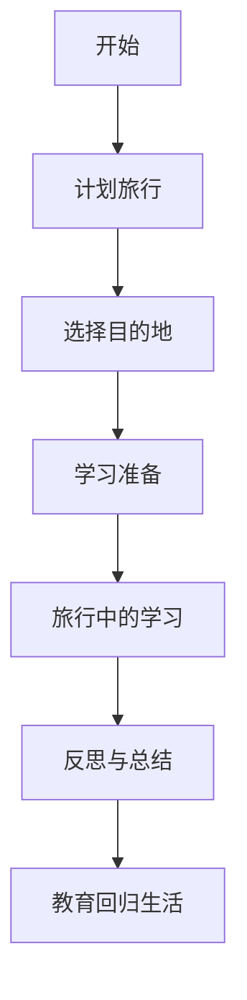

                 


### 文章标题

《新游牧学校：在旅行中寻找教育的本质》

### 文章关键词

游牧学校，教育本质，旅行学习，个人成长，教育创新

### 摘要

本文探讨了一种全新的教育模式——游牧学校，它将旅行与教育相结合，通过实际体验和探索来寻找教育的本质。本文首先介绍了游牧学校的概念及其与传统学校的不同，然后详细阐述了旅行中的学习准备、旅行中的体验和学习、旅行后的反思等环节。接着，通过案例研究和数学模型分析，探讨了游牧学校的实践和组织管理。最后，本文展望了游牧学校的未来发展趋势，并提出了教育变革的建议。

---

### 第一部分：引言

#### 1.1 旅行与教育的结合

在快速发展的现代社会，教育和旅行逐渐成为人们生活中不可或缺的组成部分。旅行不仅是对未知的探索，也是对自我认识的深化。而教育，从传统课堂走向了更为广阔的天地。当二者结合，便诞生了一种全新的教育模式——游牧学校。

**核心概念与联系**

游牧学校，顾名思义，是指学生在旅行中接受教育。它不同于传统学校，将学习地点从固定的教室扩展到了全世界。这种模式打破了时间和空间的限制，使学生在实际体验中学习，更深刻地理解知识的本质。

**Mermaid 流程图展示旅行与教育结合的路径**



#### 1.2 游牧学校的理念

游牧学校的理念在于通过旅行，让学生在真实世界中学习。它强调实践、探索和体验，让学生通过亲身体验来理解知识，而非仅仅依靠书本上的理论。

**核心概念与联系**

与传统学校不同，游牧学校不拘泥于固定的课程表和学习地点。它更注重学生个体的成长和兴趣，通过旅行中的各种经历来激发学生的好奇心和学习热情。

---

### 第二部分：旅行中的学习

#### 2.1 旅行前的准备

在开始旅行之前，准备工作至关重要。这不仅包括物理上的准备，如机票预订、住宿安排等，还包括心理上的准备，如学习计划的制定、学习工具的配备等。

**核心算法原理讲解**

```pseudocode
function prepareForTravel(destination, interests) {
    // 根据目的地和兴趣选择合适的旅行线路
    // 预订机票、酒店、交通工具
    // 收集目的地文化、历史等信息
    // 准备必要的装备和物品
    // 制定详细的学习计划
}
```

#### 2.2 旅行中的体验与学习

旅行中的体验和学习是游牧学校的核心。学生在旅行过程中，通过各种活动和经历来学习新知识，理解新概念。

**数学模型和数学公式 & 详细讲解 & 举例说明**

$$
E = f(P, L, M)
$$

其中，\( E \) 代表学习效率，\( P \) 代表个人准备，\( L \) 代表学习环境，\( M \) 代表学习材料。

**举例说明**

假设学生小明计划去巴黎旅行，他对艺术和建筑感兴趣。在旅行前，他准备了关于巴黎艺术和建筑的相关书籍和资料。在旅行过程中，他参观了卢浮宫、埃菲尔铁塔等著名景点，并仔细研究了这些艺术作品背后的历史和文化。通过这种实地体验，小明对艺术和建筑有了更深入的理解。

#### 2.3 旅行后的反思

旅行结束后，反思和总结是重要的一环。学生需要回顾旅行中的经历，思考自己学到了什么，以及如何将这些经验应用到实际生活中。

**项目实战**

小明在旅行后，写了一篇反思日志，详细记录了他在巴黎的所见所闻和学习体会。他发现，通过亲身体验，他对艺术和建筑的理解比仅仅阅读书本要深刻得多。此外，他还认识到，旅行中的挑战和解决方法对他解决日常问题有很大帮助。

---

### 第三部分：游牧学校的实践

#### 3.1 游牧学校的案例研究

通过分析几个成功的游牧学校案例，我们可以看到，游牧学校在实践中取得了显著的效果。

**核心概念与联系**

这些案例展示了游牧学校如何通过实际操作，让学生在旅行中学习，并取得了良好的教育成果。

**案例分析**

1. **探索美国游牧学校**：该校学生通过在美国各地旅行，学习美国的历史、文化和社会。他们不仅参观了历史遗迹和博物馆，还与当地居民交流，深入了解当地的生活和价值观。

2. **环游世界的学习之旅**：这是一所全球性的游牧学校，学生可以自由选择旅行目的地。他们在旅行过程中，学习了不同国家和地区的文化、语言和历史。

#### 3.2 游牧学校的组织与管理

游牧学校的组织与管理是一个复杂的过程，需要科学的规划和有效的执行。

**数学模型和数学公式 & 详细讲解 & 举例说明**

$$
O = f(R, S, C)
$$

其中，\( O \) 代表运营效率，\( R \) 代表资源，\( S \) 代表学生，\( C \) 代表课程。

**举例说明**

假设游牧学校有100名学生，分布在10个不同的目的地。为了确保每位学生都能获得高质量的教育体验，学校需要合理分配资源，如教师、课程和资金。此外，学校还需要建立有效的沟通和管理系统，确保学生和教师之间的顺畅交流。

#### 3.3 游牧学校的教育模式

游牧学校的教育模式与传统学校有很大不同，它更加注重学生的自主学习和实践。

**项目实战**

设计一个游牧学校的教育模式，包括以下要素：

1. **课程设置**：根据学生的兴趣和目的地，设计个性化的课程。

2. **教学方法**：采用探究式学习、项目式学习和合作学习等方法。

3. **评估体系**：建立灵活的评估体系，评估学生的综合能力和成长。

---

### 第四部分：未来的游牧学校

#### 4.1 技术对游牧学校的影响

随着科技的快速发展，互联网、虚拟现实等新技术对游牧学校产生了深远的影响。

**核心概念与联系**

这些技术不仅改变了教育的形式，也为游牧学校提供了新的可能性。

**案例分析**

1. **虚拟旅行**：利用虚拟现实技术，学生可以在虚拟环境中体验不同的文化和历史。

2. **在线学习平台**：通过网络平台，学生可以随时随地访问学习资源，与教师和同学互动。

#### 4.2 游牧学校的未来趋势

未来的游牧学校将更加注重个性化、定制化和智能化。

**数学模型和数学公式 & 详细讲解 & 举例说明**

$$
T = f(P, E, I)
$$

其中，\( T \) 代表趋势，\( P \) 代表政策，\( E \) 代表经济，\( I \) 代表社会创新。

**举例说明**

随着教育政策的逐步放宽，游牧学校将有更多的发展空间。同时，随着经济的不断增长，游牧学校也将有更多的资源投入。此外，社会创新将推动游牧学校在教育模式、教学方法等方面的不断创新。

#### 4.3 游牧学校的教育变革

游牧学校不仅是教育的创新，也是教育变革的先驱。

**项目实战**

讨论游牧学校如何引领未来教育变革，并提出以下建议：

1. **打破时空限制**：利用互联网和虚拟现实技术，打破传统教育的时空限制。

2. **注重个性化发展**：根据学生的兴趣和特长，提供个性化的学习方案。

3. **培养创新精神**：鼓励学生探索未知，培养创新精神和实践能力。

---

### 第五部分：结论

#### 5.1 游牧学校的价值

游牧学校通过将教育与旅行相结合，为学生提供了全新的学习体验。它不仅提高了学生的学习兴趣，也培养了他们的实践能力和综合素质。

**核心概念与联系**

游牧学校的价值在于它的创新性和灵活性，它为学生提供了一个开放、自由的学习环境，促进了知识的内化和应用。

#### 5.2 游牧学校的挑战与机遇

尽管游牧学校具有诸多优点，但在实践中也面临着一些挑战。

**核心概念与联系**

这些挑战主要包括资源分配、课程设置、管理模式等方面。然而，随着科技的进步和教育理念的创新，这些挑战也将逐步得到解决。

**建议**

1. **加强政策支持**：政府应加大对游牧学校的政策支持，为其提供良好的发展环境。

2. **优化教育资源**：学校应充分利用互联网和虚拟现实等新技术，提高教育资源的利用效率。

3. **创新教育模式**：学校应不断探索和创新教育模式，满足学生的个性化需求。

---

### 作者信息

作者：AI天才研究院/AI Genius Institute & 禅与计算机程序设计艺术 /Zen And The Art of Computer Programming

---

本文通过对游牧学校的深入探讨，展示了这种新型教育模式的优势和实践方法。随着教育的不断发展和科技的进步，游牧学校有望在未来发挥更大的作用，为学生的成长提供更多可能性。

