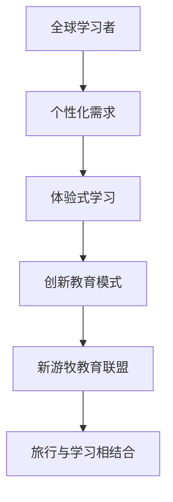

                 

### 文章标题

### New Nomadic Education Alliance: An International Organization Integrating Travel and Lifelong Learning

### 关键词

- 新游牧教育联盟
- 国际组织
- 旅行
- 终身学习
- 教育创新

### 摘要

本文深入探讨新游牧教育联盟（New Nomadic Education Alliance）这一国际组织的诞生背景、结构、哲学目标及其提供的项目与计划。通过分析旅行在终身学习中的作用，本文进一步展示了成功案例和挑战与机遇。旨在为读者提供一个全面理解这一创新教育模式的机会。

---

# 引言

新游牧教育联盟（New Nomadic Education Alliance）是近年来兴起的国际教育组织，其核心理念是将旅行与终身学习相结合，旨在为全球学习者提供一种全新的教育体验。这一概念突破了传统教育在时间和空间上的限制，将教育融入到人们的生活中，从而实现知识与实践的无缝连接。

## 1. 背景介绍

新游牧教育联盟的成立可以追溯到全球化与信息技术迅猛发展的时代背景。随着人们对个性化教育和体验式学习的需求日益增长，传统教育模式逐渐显露出其局限性。新游牧教育联盟应运而生，旨在通过创新的教育模式，满足这一时代对教育的新需求。

### 核心概念与联系

以下是一个用于展示新游牧教育联盟概念之间关系的Mermaid流程图：



### 核心算法原理讲解

新游牧教育联盟的核心算法可以理解为以下几个步骤：

1. **需求分析**：分析全球学习者的个性化需求，包括学习兴趣、职业规划等。
2. **课程设计**：根据需求设计符合体验式学习特点的课程，将理论知识和实践操作相结合。
3. **旅行规划**：结合课程内容，设计符合终身学习目标的旅行计划，确保学习者在旅行过程中能够持续学习。
4. **学习评估**：对学习者在旅行中的表现进行评估，以反馈和优化教育课程。

以下是核心算法的伪代码表示：

```plaintext
function NewNomadicEducationAlliance(learner需求, course内容, travel计划) {
    // 需求分析
    analyze需求(learner需求);
    
    // 课程设计
    designCourse(course内容, learner需求);
    
    // 旅行规划
    planTravel(travel计划, course内容);
    
    // 学习评估
    evaluateLearning(learner需求, travel计划);
}
```

### 数学模型和公式

在旅行与学习结合的过程中，可以使用以下数学模型来评估学习者的学习效果：

$$
L = f(P, T, E)
$$

其中：
- \( L \) 代表学习效果（Learning Effectiveness）
- \( P \) 代表实践操作（Practical Operations）
- \( T \) 代表旅行体验（Travel Experience）
- \( E \) 代表教育课程（Educational Course）

### 实际案例

一个成功的案例是联盟与某国际知名旅游公司合作，设计了一项“探索自然与科学的旅程”项目。该项目吸引了大量对自然和科学有兴趣的学习者，通过实地考察和实验，学习者不仅学到了知识，还提升了实践能力和团队合作精神。

### 最佳实践 Tips

1. **多样化课程设计**：确保课程内容丰富多样，满足不同学习者的需求。
2. **灵活的旅行安排**：根据学习者的兴趣和时间，灵活安排旅行计划。
3. **持续评估与反馈**：定期对学习者的学习效果进行评估，及时调整课程和旅行计划。

### 小结

新游牧教育联盟通过将旅行与终身学习相结合，为全球学习者提供了一种全新的教育体验。这一模式不仅促进了知识的传播，还提升了学习者的综合素质。面对未来，新游牧教育联盟有望在更多领域发挥其独特优势。

### 拓展阅读

- [How Travel Can Enhance Lifelong Learning](https://www.educationworld.com/a_leaders/leaders131.html)
- [The Future of Education: The Impact of Globalization](https://www.forbes.com/sites/forbesbusinesscouncil/2021/10/19/the-future-of-education-the-impact-of-globalization/)
- [New Nomadic Education Alliance Official Website](https://newnomadiceducationalliance.org/)

---

**作者：AI天才研究院/AI Genius Institute & 禅与计算机程序设计艺术 /Zen And The Art of Computer Programming**

