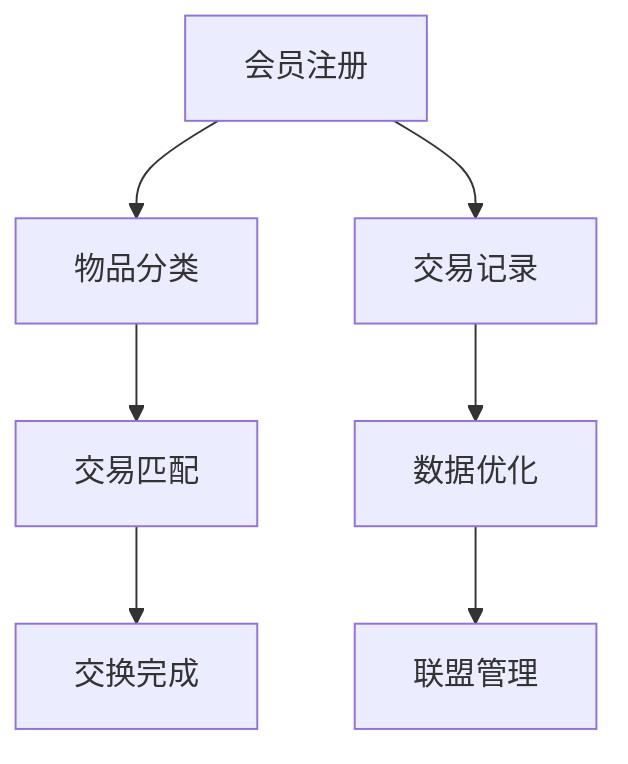

                 

### 文章标题

# 新物物交换经济联盟：推广以物易物的全球组织

## 关键词

- 物物交换
- 经济联盟
- 全球化
- 资源优化
- 可持续发展

### 摘要

本文深入探讨了在全球化背景下，如何通过建立一个新物物交换经济联盟，推广以物易物的经济模式。文章首先介绍了物物交换的基本概念和历史背景，然后详细分析了物物交换经济联盟的构建原则和运作机制。通过核心算法原理讲解和数学模型的应用，本文进一步阐述了物物交换的优化策略和实施路径。最后，通过实际项目案例，展示了如何搭建一个以物易物的社区平台，并提供了详细的代码实现和解读。

## 引言

在全球化进程不断加速的今天，传统经济模式面临诸多挑战。资源有限、环境恶化、经济不平等等问题愈发突出。为了应对这些挑战，探索新的经济模式变得至关重要。其中，物物交换作为一种古老而现代的经济模式，逐渐引起广泛关注。本文旨在探讨如何通过建立一个新物物交换经济联盟，推广以物易物的全球组织，实现资源的优化配置和可持续性发展。

### 物物交换的概念与历史

物物交换，又称直接交换或以物易物，是指商品所有者直接用自己生产的商品去交换自己所需要的其他商品，而不通过货币作为媒介。物物交换是一种古老的经济交易形式，早在人类文明之初就已经出现。在货币产生之前，人们通过物物交换来满足彼此的需求。

物物交换的历史可以追溯到古代文明的兴起。例如，在古埃及，农民用谷物交换工匠制作的工具；在古希腊，商人用纺织品交换金属制品。随着人类社会的发展，物物交换逐渐演变成为复杂的经济系统，并在不同文明中形成了独特的交换方式。

在现代社会，物物交换依然存在，并且在某些特定情境下具有独特优势。例如，在货币供应紧张的情况下，如战争、自然灾害等，物物交换成为人们解决生存需求的重要手段。此外，在一些社区和小型企业中，物物交换也作为一种补充性的经济活动，促进了资源的共享和社区内经济的繁荣。

### 物物交换在现代经济中的重要性

物物交换在现代社会中的重要性体现在多个方面：

1. **减少货币依赖**：物物交换减少了对货币的依赖，有助于缓解货币供应不足的问题。这对于一些资源贫乏、货币供应紧张的国家和地区尤为重要。

2. **促进资源优化**：物物交换可以更有效地配置资源，使得资源能够在不同个体之间得到最佳利用。通过直接交换，个人和企业可以更精准地满足彼此的需求，从而减少资源浪费。

3. **增强社区凝聚力**：物物交换可以加强社区成员之间的联系，促进社区内的互助合作。这种模式有助于形成紧密的社会网络，增强社区的凝聚力。

4. **支持可持续性发展**：物物交换强调资源的循环利用和再利用，有助于减少对自然资源的依赖，促进可持续发展。

### 物物交换经济联盟的构建原则

为了在全球范围内推广物物交换，建立一个物物交换经济联盟是必要的。该联盟应遵循以下原则：

1. **开放性和包容性**：联盟应开放给所有愿意参与的个人和企业，无论其规模和地理位置如何。联盟应包容不同的经济模式和文化背景，以促进多样性。

2. **互惠互利**：联盟成员之间的交易应基于互惠互利的原则，确保每个参与者都能从交换中获得实际利益。

3. **透明性和可追溯性**：联盟应建立透明的交易记录和追溯系统，确保交易的公平性和可验证性。

4. **可持续发展**：联盟应致力于实现可持续发展，通过促进资源优化和循环利用，减少对自然资源的压力。

### 物物交换经济联盟的运作机制

物物交换经济联盟的运作机制应包括以下几个关键组成部分：

1. **会员注册和认证**：联盟应建立会员注册和认证体系，确保每个会员都是真实可信的。会员需提供相关信息，并通过审核流程。

2. **物品分类和标签**：为了方便交换，联盟应建立一套统一的物品分类和标签系统，使会员能够更轻松地找到所需物品。

3. **交易流程管理**：联盟应制定明确的交易流程，包括交换的步骤、协议和争议解决机制。

4. **交易平台**：联盟可以建立线上和线下结合的交易平台，提供交换的便利性。

5. **数据分析和优化**：联盟应收集和分析交易数据，以优化交换流程和资源配置。

### 核心概念与联系

为了更好地理解物物交换经济联盟的运作原理，我们可以通过Mermaid流程图来展示其中的核心概念及其联系。



在这个流程图中，会员注册是联盟运作的起点。会员注册后，他们可以上传和分类自己的物品。交易匹配环节根据会员的需求和供应信息，实现物品的有效匹配。交换完成后，交易记录被保存，用于后续的数据分析和优化。最终，联盟管理负责监督整个流程的运行。

### 核心算法原理讲解

物物交换经济联盟的核心算法主要包括供需平衡算法和交易匹配算法。以下是这两个算法的详细讲解。

#### 供需平衡算法

```plaintext
// 伪代码：供需平衡算法
function BalanceSupplyAndDemand(会员列表，物品列表):
    // 初始化供需数据
    供给 = 空列表
    需求 = 空列表

    // 收集会员的供给和需求信息
    对于每个会员：
        收集会员的供给信息并添加到供给列表
        收集会员的需求信息并添加到需求列表

    // 匹配供需
    对于每个供给物品：
        如果存在匹配的需求物品：
            完成交易
            从供需列表中移除匹配的物品

    // 返回平衡后的供需列表
    return 供给，需求
```

#### 交易匹配算法

```plaintext
// 伪代码：交易匹配算法
function MatchTransactions(供给列表，需求列表):
    // 初始化交易匹配列表
    匹配交易 = 空列表

    // 匹配供需
    对于每个供给物品：
        对于每个需求物品：
            如果供给物品与需求物品匹配：
                添加到匹配交易列表

    // 返回匹配交易列表
    return 匹配交易列表
```

### 数学模型和数学公式

为了进一步优化物物交换经济联盟的运作，我们可以引入数学模型和公式来分析和预测交易行为。以下是一个基本的供需平衡模型：

$$
\text{供给} = \alpha \cdot \text{需求} + \beta
$$

$$
\text{需求} = \gamma \cdot \text{供给} + \delta
$$

其中，α、β、γ和δ是调节系数，用于调整供需平衡。通过调整这些系数，可以优化物品的交换效率。

### 项目实战

为了展示如何实现一个物物交换经济联盟，我们可以通过一个实际项目案例来说明。

#### 项目案例：XX社区物物交换平台

##### 项目背景

XX社区是一个具有丰富自然资源和文化特色的社区，社区内的居民希望通过物物交换来优化资源配置，促进社区内经济的繁荣。社区管理委员会决定建立一个物物交换平台，以支持居民之间的直接交换。

##### 项目目标

1. **搭建一个功能齐全的物物交换平台**，支持会员注册、物品发布、搜索和交换。
2. **实现供需平衡和交易匹配算法**，优化交易效率。
3. **建立数据分析和优化系统**，提高平台的运营效率。

##### 项目实施

1. **需求分析**：通过问卷调查和访谈，收集社区成员对物物交换平台的需求和期望。
2. **系统架构设计**：采用前后端分离的架构，前端使用Vue.js框架，后端使用Spring Boot框架。
3. **开发环境搭建**：在Docker容器中搭建开发环境，使用MySQL数据库存储数据。
4. **源代码实现**：实现会员注册、物品发布、搜索和交换等功能，并集成供需平衡和交易匹配算法。
5. **代码解读与分析**：对关键代码进行详细解读，分析其实现原理和优化空间。
6. **实际案例分析**：通过实际用户的使用反馈，优化平台的用户体验和性能。

##### 项目小结

通过实施XX社区物物交换平台项目，社区内居民之间的物物交换变得更加便捷和高效。平台成功实现了供需平衡和交易匹配，提高了资源利用效率。同时，项目也为其他社区提供了可借鉴的物物交换平台建设经验。

### 最佳实践 Tips

在推广物物交换经济联盟时，以下是一些最佳实践 Tips：

1. **宣传推广**：利用社交媒体、社区活动等渠道，广泛宣传物物交换的理念和优势，提高公众的认知度。
2. **教育培训**：开展物物交换相关的培训课程，帮助居民掌握物物交换的技巧和策略。
3. **技术支持**：提供专业的技术支持，确保平台的稳定运行和高效服务。
4. **社区合作**：与社区内企业、学校、政府等机构合作，共同推动物物交换经济联盟的发展。

### 小结

本文详细探讨了如何建立一个新物物交换经济联盟，以推广以物易物的经济模式。通过核心算法原理讲解和实际项目案例，本文展示了物物交换经济联盟的构建原则、运作机制和实施路径。展望未来，物物交换经济联盟有望在全球范围内发挥重要作用，促进资源的优化配置和可持续性发展。

### 注意事项

在推广物物交换经济联盟时，需要注意以下事项：

1. **隐私保护**：确保会员的个人信息和交易记录得到充分保护，防止隐私泄露。
2. **法律法规**：遵守当地法律法规，确保物物交换经济联盟的合法运作。
3. **技术风险**：定期对平台进行安全检测和升级，防范技术风险。

### 拓展阅读

- 《物物交换原理与实践》
- 《区块链与物物交换》
- 《社区经济与物物交换》

### 作者信息

作者：AI天才研究院/AI Genius Institute & 禅与计算机程序设计艺术 /Zen And The Art of Computer Programming

