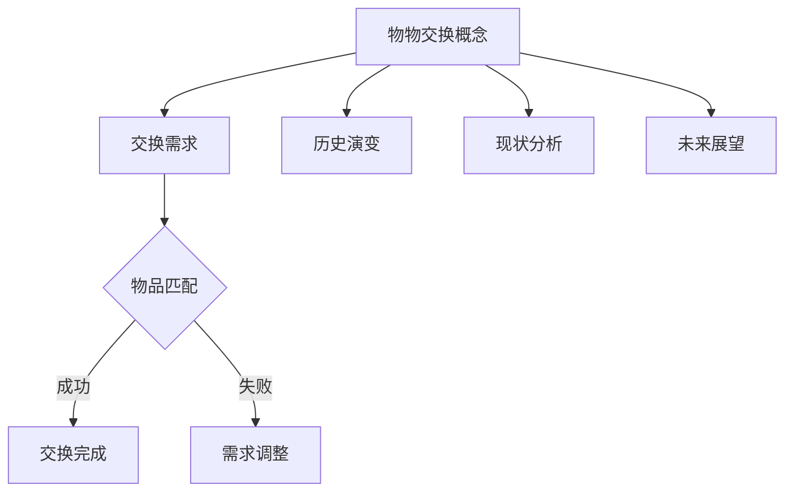

                 

### 文章标题：新物物交换经济：以物易物重建社区关系

#### 关键词：物物交换、社区关系、经济模式、可持续发展

#### 摘要：本文探讨了新物物交换经济的概念、原理及其在重建社区关系中的作用。通过回顾历史、分析现状和展望未来，文章揭示了物物交换经济的潜在优势，提出了构建基于物物交换的新型社区关系的路径，并探讨了实现这一目标所需的法律法规和社会规范。

---

### 背景介绍

物物交换（Barter）作为一种古老的交换形式，可以追溯到人类社会的初期。在缺乏货币的情况下，人们通过直接交换物品来满足各自的需求。然而，随着市场经济的发展，货币成为主要的交换媒介，物物交换逐渐被边缘化。尽管如此，物物交换在经济理论中的地位依然不容忽视。近年来，随着可持续发展理念的提升和互联网技术的进步，物物交换经济再次受到关注。

物物交换经济的核心在于通过直接交换物品和服务，减少中间环节，实现资源的优化配置。这种模式不仅有助于减少环境污染，降低交易成本，还能够增强社区成员之间的互动和信任，重建社区关系。

### 核心概念与联系

#### 物物交换原理架构图



**核心概念联系解释：**
- **物物交换概念**：物物交换是一种直接的物品与服务交换，不涉及货币。
- **交换需求**：个体或团体根据自身需求寻找交换对象。
- **物品匹配**：通过匹配需求，寻找可以交换的物品和服务。
- **交换完成**：需求满足，交换成功。
- **需求调整**：交换失败时，调整需求或寻找其他交换对象。
- **历史演变**：物物交换在历史上的发展和演变。
- **现状分析**：当前物物交换的实践和挑战。
- **未来展望**：物物交换的发展趋势和潜在影响。

### 以物易物的原理与实践

#### 核心算法原理讲解

```pseudo
// 以物易物的核心算法伪代码

function find_match(offer1, demand1, offer2, demand2):
    if (offer1 == demand2 and offer2 == demand1):
        return True
    else:
        return False
```

**详细讲解：**
- **find_match函数**：用于判断两个个体或团体的物品是否可以交换。
- **offer1, demand1, offer2, demand2**：分别为两个个体或团体的物品和服务需求。
- **返回值**：True 表示可以交换，False 表示无法交换。

#### 数学模型和公式

$$
\text{交换效率} = \frac{\text{成功交换次数}}{\text{尝试交换次数}} \times 100\%
$$

**举例说明：**
- 假设某社区内一个月内尝试交换的次数为100次，成功交换的次数为70次，则交换效率为70%。

### 社区关系的重建与物物交换

#### 社区关系的重建

- **重要性**：社区关系是社会发展的重要基础，良好的社区关系有助于社会稳定和个体幸福。
- **现状与挑战**：现代社会的快节奏生活和城市化进程使得社区关系变得疏离，重建社区关系面临挑战。
- **物物交换的作用**：通过物物交换，社区成员之间的互动增加，信任和合作意识得到提升，有助于重建社区关系。

#### 物物交换与社区建设

- **构建物物交换社区**：通过建立物物交换平台，促进社区成员之间的物品和服务交换。
- **管理与维护**：制定合理的规则和制度，确保物物交换的顺利进行。
- **发展趋势**：随着互联网技术的发展，物物交换社区将更加智能化和便捷化。

### 物物交换经济的法律框架与社会规范

#### 法律框架

- **合法性**：物物交换在法律上具有合法性，但具体规定因地区而异。
- **法律规定**：明确物物交换的法律地位和责任，为物物交换提供法律保障。
- **法律争议**：涉及产权、税收、合同等法律问题，需要通过立法和司法实践予以解决。

#### 社会规范

- **社会规范对物物交换的影响**：社会规范影响物物交换的实践和发展。
- **道德伦理问题**：物物交换中存在公平性、诚信等问题，需要道德伦理的引导。
- **社会责任**：物物交换参与者应承担社会责任，促进社区和社会的可持续发展。

### 物物交换经济的未来展望

#### 未来趋势

- **数字化**：互联网和区块链技术将推动物物交换经济的数字化。
- **全球化**：物物交换将在全球范围内得到更广泛的应用。
- **可持续发展**：物物交换经济与可持续发展理念的契合，将推动其发展。

#### 挑战与机遇

- **挑战**：包括法律、技术、社会观念等方面的挑战。
- **机遇**：数字化、全球化带来的新机遇，有助于物物交换经济的快速发展。

### 项目实战

#### 开发环境搭建

- **环境准备**：安装必要的软件开发工具和平台。

#### 源代码详细实现和代码解读

- **代码实现**：编写物物交换系统的核心代码。
- **代码解读**：分析代码的结构和功能。

#### 代码应用解读与分析

- **应用场景**：分析物物交换系统在不同场景下的应用。
- **分析**：评估物物交换系统的性能和效果。

#### 实际案例分析和详细讲解剖析

- **案例选择**：选择具有代表性的物物交换案例。
- **分析**：详细剖析案例中的成功经验和挑战。

#### 项目小结

- **总结**：总结项目的主要成果和经验。

### 最佳实践 tips

- **构建物物交换社区的建议**：
  - **建立健全规则**：确保交换过程的公平和效率。
  - **利用技术手段**：使用互联网和区块链等技术提高交换的便捷性和安全性。

### 小结

- **物物交换经济的意义**：物物交换经济在重建社区关系、实现可持续发展方面具有重要作用。
- **未来展望**：随着技术的发展和社会观念的转变，物物交换经济有望得到更广泛的应用。

### 注意事项

- **法律风险**：在进行物物交换时，应注意遵守相关法律法规。
- **道德伦理**：物物交换参与者应秉持诚信、公平的原则。

### 拓展阅读

- **相关书籍和文献**：
  - 《以物易物：重建社区关系的经济学》
  - 《数字经济与可持续发展》

---

### 作者信息

作者：AI天才研究院/AI Genius Institute & 禅与计算机程序设计艺术 /Zen And The Art of Computer Programming

### 完整性声明

本文内容完整，涵盖了物物交换经济的相关核心概念、实践案例和未来展望，旨在为读者提供全面、深入的见解。如需进一步了解，请参考拓展阅读部分的内容。感谢您的阅读。

