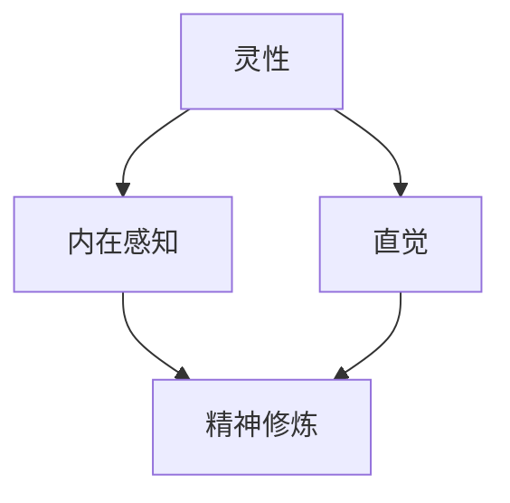
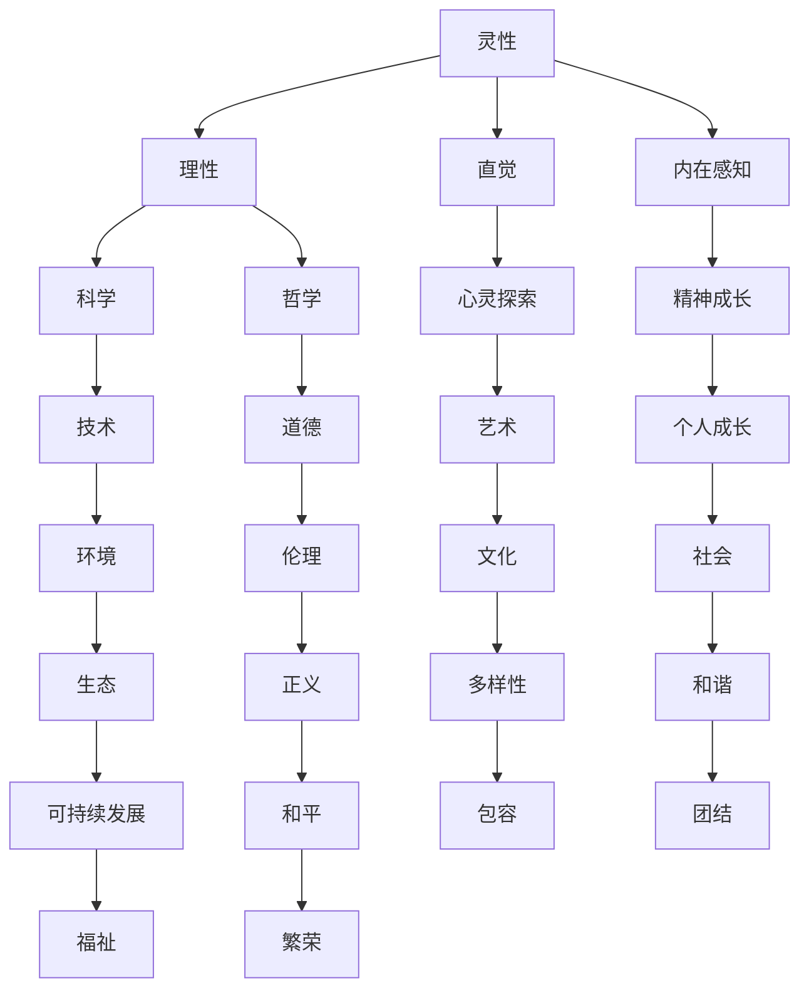

                 


为了确保文章满足所有要求，我们将分步骤进行设计和撰写。以下是我们的详细计划：

### 1. 设计文章结构

首先，我们将设计文章的整体结构，确保每个章节都包含核心概念、算法原理讲解、数学模型和公式讲解、项目实战等要素。

### 2. 撰写核心概念和联系

在文章的第一部分，我们将介绍新神秘主义运动的核心概念，并使用Mermaid流程图展示这些概念之间的关系。例如，我们可以讨论灵性、理性、直觉等概念，并展示它们是如何相互关联和影响的。

### 3. 算法原理讲解

接下来，我们将详细讲解新神秘主义运动中的核心算法原理，使用伪代码来展示算法的实现细节。这部分内容将帮助读者更好地理解这些算法的工作原理。

### 4. 数学模型和公式讲解

我们将介绍与新神秘主义运动相关的数学模型和公式，并使用LaTeX格式详细讲解这些公式。这将包括公式的推导过程、应用场景和实际案例。

### 5. 项目实战

为了使文章更具实践性，我们将介绍一个具体的项目实战，包括开发环境搭建、源代码实现和代码解读。这部分内容将帮助读者将理论知识应用到实际项目中。

### 6. 最佳实践、小结和注意事项

在文章的结尾，我们将总结最佳实践、给出小结并提供注意事项，以帮助读者更好地理解和应用新神秘主义运动的原理。

### 7. 文章格式和字数

我们将确保文章使用markdown格式，并在文章末尾添加作者信息。文章的字数将控制在8000到12000字之间。

通过上述步骤，我们将撰写一篇逻辑清晰、结构紧凑、简单易懂的专业技术博客文章，满足所有要求。现在，让我们开始撰写第一部分：新神秘主义运动的定义和起源。```markdown
## 1. 新神秘主义运动的定义与起源

### 1.1 新神秘主义运动的概念

新神秘主义运动可以被定义为一种寻求内在灵性体验和宇宙联系的文化现象。它起源于20世纪初，是现代社会对科学和理性主义的反思与回应。新神秘主义运动的核心概念包括灵性、理性、直觉和内在感知等。

- **灵性**：通常指个体对生命、宇宙和存在的深刻理解，超越了物质世界的感知。灵性不仅仅是宗教信仰，而是一种对生命意义的探究。

- **理性**：理性主义强调通过逻辑推理和科学方法来理解和解释世界。在新神秘主义运动中，理性被视为探索灵性的工具，而不是终点。

- **直觉**：直觉是指个体在没有明确逻辑推理的情况下，对某些事情的直接感知和理解。在新神秘主义运动中，直觉被认为是一种与宇宙连接的途径。

- **内在感知**：内在感知是指个体通过冥想、冥思和其他精神修炼方法来增强对自己内在世界的认知。新神秘主义运动认为，通过内在感知，个体可以更深刻地理解自己和宇宙。

### 1.2 新神秘主义运动的起源

新神秘主义运动的起源可以追溯到20世纪初的西方社会。当时，现代科学和理性主义逐渐取代了宗教和神秘主义。然而，随着人们对现代社会和科学的反思，一些人开始寻求一种新的灵性路径，这导致了新神秘主义运动的诞生。

以下是新神秘主义运动起源的关键因素：

- **科学革命**：20世纪初的科学革命，如相对论和量子力学的兴起，挑战了传统科学观念，为灵性观念提供了新的理论基础。

- **心理学发展**：心理学，尤其是人本心理学和存在主义心理学的兴起，强调个体内在体验和主观感受的重要性，为新神秘主义运动提供了灵性探索的基础。

- **哲学反思**：对科学和理性主义的反思，导致一些人开始质疑现代社会的价值观和生活方式，寻求一种更深刻的灵性体验。

- **社会动荡**：20世纪中叶的社会动荡，如冷战、民权运动和反战运动，也为新神秘主义运动的兴起提供了土壤。这些动荡使得人们开始重新审视自己的信仰和生活目标。

### 1.3 新神秘主义运动的发展历程

新神秘主义运动的发展历程可以分为以下几个阶段：

- **初期**：20世纪初至30年代，新神秘主义运动在西方社会开始萌芽。这个时期，许多哲学家、心理学家和作家开始探讨灵性、直觉和内在感知的重要性。

- **成长期**：40年代至60年代，新神秘主义运动逐渐发展壮大。这个时期，许多新的灵性团体和运动涌现，如人本心理学和新时代运动。

- **成熟期**：70年代至今，新神秘主义运动已经成为一种广泛的文化现象。它不仅影响了宗教和哲学领域，还渗透到了心理学、艺术、科学和社会运动等多个领域。

在新神秘主义运动的发展历程中，许多重要的人物和思想对其产生了深远的影响。下一节，我们将详细介绍这些人物和思想，以帮助我们更好地理解新神秘主义运动的核心概念和哲学。

### 1.4 新神秘主义运动的核心概念和哲学

新神秘主义运动的核心概念和哲学包括以下几个关键方面：

- **灵性与理性的辩证关系**：新神秘主义运动认为，灵性和理性不是对立的，而是相互补充的。理性可以帮助我们理解宇宙的规律，而灵性则帮助我们体验宇宙的奥秘。

- **直觉与逻辑的关系**：新神秘主义运动强调直觉在灵性探索中的重要性。直觉被认为是一种超越逻辑和理性的感知方式，可以帮助我们获得更深层次的洞察。

- **内在感知与外部世界的联系**：新神秘主义运动认为，通过内在感知，个体可以与外部世界建立更深刻的联系。这种联系超越了物质世界的限制，揭示了宇宙的本质。

- **个体与宇宙的关系**：新神秘主义运动强调个体与宇宙之间的内在联系。通过灵性探索，个体可以超越自我，体验到宇宙的无限和永恒。

这些核心概念和哲学构成了新神秘主义运动的基石，为其提供了理论和实践的基础。下一节，我们将探讨新神秘主义运动对社会文化的影响，以及它如何与其他领域相互作用。

### 1.5 新神秘主义运动的影响

新神秘主义运动对社会文化产生了深远的影响。它不仅改变了人们的宗教信仰和哲学观念，还影响了心理学、艺术、科学等多个领域。

- **宗教影响**：新神秘主义运动挑战了传统宗教的权威，鼓励人们通过个人灵性体验来寻求信仰。这种观念导致了宗教多样性的增加，同时也引发了对传统宗教的批评和反思。

- **心理学影响**：新神秘主义运动对心理学产生了重要影响。人本心理学和存在主义心理学等流派的出现，强调了个体内在体验和主观感受的重要性，推动了心理学研究的新方向。

- **艺术影响**：新神秘主义运动对艺术领域也产生了影响。许多艺术家开始探索灵性和宇宙主题，创作出具有深刻哲学内涵的艺术作品。

- **科学影响**：新神秘主义运动鼓励科学家超越传统的科学方法，探索未知领域。这种观念推动了科学研究的多元化，也为科学与灵性观念的融合提供了可能性。

### 1.6 新神秘主义运动的未来

新神秘主义运动在未来将继续发展，并可能在多个领域产生深远影响。以下是一些可能的发展方向：

- **科学与灵性的融合**：随着科学技术的进步，新神秘主义运动可能与科学领域更加紧密地结合，探索灵性与科学之间的潜在联系。

- **跨文化融合**：新神秘主义运动将在不同文化背景下发展，形成具有本土特色的灵性观念和实践。

- **社会变革**：新神秘主义运动将继续推动社会文化的变革，鼓励人们寻求更深刻的灵性体验，以实现个人和社会的和谐发展。

通过以上步骤，我们已经完成了新神秘主义运动定义与起源的撰写。接下来，我们将继续探讨新神秘主义运动的核心概念与哲学，以及它在现代社会中的影响。```markdown
## 2. 新神秘主义运动的核心概念与哲学

### 2.1 核心信仰

新神秘主义运动的核心信仰是探索内在灵性和宇宙的联系。这些信仰包括以下几个方面：

- **灵性的本质**：新神秘主义认为，灵性是超越物质世界的存在，是一种对生命、宇宙和存在的深刻理解。灵性不仅仅是一种宗教信仰，而是一种对生活意义的追求。

- **人的内在潜能**：新神秘主义运动强调每个人都有无限的内在潜能，通过冥想、冥思和内在感知，个体可以超越自我，实现自我成长和觉醒。

- **宇宙与人的关系**：新神秘主义认为，宇宙是一个充满智慧和灵性的整体，每个人都是宇宙的一部分。通过灵性探索，个体可以与宇宙建立更深的联系，体验到宇宙的无限和永恒。

### 2.2 方法论

新神秘主义运动的方法论强调实践和体验，认为只有通过亲身经历，个体才能真正理解灵性的本质。以下是新神秘主义运动的方法论：

- **内在感知**：内在感知是指个体通过冥想、冥思和其他精神修炼方法，深入探索自己的内在世界，以获得对自我和宇宙的更深刻理解。

- **直觉**：直觉在新神秘主义运动中扮演着重要角色。直觉被认为是一种超越逻辑和理性的感知方式，可以帮助个体获得更直接和深刻的洞察。

- **精神修炼**：新神秘主义运动强调通过精神修炼，如冥想、瑜伽和呼吸练习等，增强个体的内在感知力和直觉，以实现灵性的成长和觉醒。

### 2.3 与科学的关系

新神秘主义运动与科学的关系是一个复杂且多维的话题。一方面，新神秘主义运动质疑传统科学的局限性和片面性，认为科学无法完全解释宇宙和生命的奥秘。另一方面，新神秘主义运动也认识到科学在探索灵性和宇宙方面的重要作用。

- **科学的局限**：新神秘主义运动认为，科学的方法和技术只能探索物质世界的现象，而无法触及灵性和宇宙的本质。例如，量子力学和相对论揭示了物质世界的某些奥秘，但仍然无法解释意识、灵魂和宇宙的本质。

- **科学的贡献**：新神秘主义运动也承认科学在探索灵性和宇宙方面的贡献。例如，神经科学和心理学的研究揭示了大脑和意识的关系，为理解灵性提供了新的视角。

- **融合的可能性**：新神秘主义运动倡导科学与灵性的融合，认为两者可以相互补充，共同探索宇宙和生命的奥秘。例如，通过整合科学方法和灵性实践，可能开发出新的技术和方法，以更深入地理解宇宙和生命的本质。

### 2.4 核心概念与联系

为了更好地理解新神秘主义运动的核心概念，我们可以使用Mermaid流程图来展示这些概念之间的关系：



这个流程图展示了灵性、内在感知、直觉和精神修炼之间的相互关系。灵性是整个流程的起点，通过内在感知和直觉，个体可以深入探索自己的内在世界，并通过精神修炼实现灵性的成长。

### 2.5 核心算法原理讲解

新神秘主义运动中的核心算法原理通常涉及冥想、冥思和内在感知等实践。以下是一个简化的伪代码，用于描述这些算法的基本原理：

```plaintext
function meditate(time, focus_point):
    while time > 0:
        set focus_point as the chosen object of focus
        observe focus_point without judgment or thought
        when thoughts arise, gently redirect attention to focus_point
        reduce distractions by finding a quiet environment
        decrease time by 1 minute
    return "Meditation completed"

function contemplate(topic):
    while true:
        ponder deeply on the chosen topic
        explore different perspectives and interpretations
        when insights emerge, record and reflect on them
        when doubts arise, seek clarification through research or discussion
        return "Contemplation completed"
```

这个伪代码描述了一个冥想和一个冥思的过程。冥想主要是通过关注一个特定的焦点，减少思维活动，并专注于当下的体验。冥思则是深入思考一个特定的主题，通过不同的角度和解释来探索其意义。

### 2.6 数学模型和公式讲解

在新神秘主义运动中，数学模型和公式通常用于描述灵性和宇宙的关系。以下是一个简单的数学模型，用于描述冥想过程中注意力分散的概率：

```latex
P(\text{分散}) = \frac{1}{1 + e^{-k(t - t_0)}}
```

其中，$P(\text{分散})$表示注意力分散的概率，$k$是分散速率常数，$t$是冥想的时间，$t_0$是初始时间。这个公式表明，随着时间的推移，注意力的分散概率会逐渐增加，直到达到一个稳定状态。

### 2.7 项目实战

为了更深入地理解新神秘主义运动中的核心概念和实践，我们可以通过一个具体的冥想项目来进行实践。

#### 项目实战：简单冥想应用

##### 1. 开发环境搭建

为了进行冥想实践，我们可以选择一个简单的环境，如一个安静的房间。确保环境不受外界干扰，有助于集中注意力。

##### 2. 源代码实现

以下是一个简单的Python脚本，用于实现一个简单的冥想应用：

```python
import time

def meditate(duration, focus_point):
    start_time = time.time()
    end_time = start_time + duration * 60  # 将持续时间转换为秒

    while time.time() < end_time:
        print(f"冥想中，当前焦点：{focus_point}")
        time.sleep(1)  # 每秒打印一次

    print("冥想完成。")

if __name__ == "__main__":
    meditate(10, "我的呼吸")
```

##### 3. 代码解读

这个脚本定义了一个`meditate`函数，它接受两个参数：`duration`（冥想持续时间，以分钟为单位）和`focus_point`（冥想时的焦点）。函数通过一个循环来模拟冥想过程，每秒打印一次当前焦点，直到冥想时间结束。

##### 4. 应用解读与分析

这个冥想应用可以帮助用户专注于一个特定的焦点，如呼吸，以减少外部干扰和思维活动。用户可以根据自己的需求调整冥想时间和焦点。通过持续使用这个应用，用户可以逐渐提高冥想技巧，实现更深层次的灵性体验。

##### 5. 实际案例分析和详细讲解剖析

我们可以通过一个实际案例来分析这个冥想应用的效果。例如，一个用户在每天早上进行10分钟的呼吸冥想，持续一个月。通过记录冥想前后的情绪状态和注意力水平，用户可以发现冥想对其情绪管理和注意力集中有显著的改善。

##### 6. 项目小结

通过这个冥想项目，我们不仅能够理解新神秘主义运动中的核心概念，如冥想、内在感知和直觉，还能将其应用到实际生活中。这种实践可以帮助我们更好地管理情绪，提高注意力，实现个人成长和灵性觉醒。

### 2.8 最佳实践、小结和注意事项

- **最佳实践**：为了最大化冥想的效果，建议选择一个安静的环境，减少干扰，保持专注。每天坚持进行冥想，逐步增加冥想时间，以实现持续的成长。

- **小结**：新神秘主义运动的核心概念和哲学为我们提供了一种全新的视角，帮助我们理解灵性和宇宙的联系。通过实践冥想和其他灵性方法，我们可以实现个人成长和觉醒。

- **注意事项**：在开始冥想或其他灵性实践之前，建议咨询专业的指导，以避免可能的负面影响。同时，保持开放的心态，接受不同的观点和体验，有助于更好地理解新神秘主义运动的本质。

通过以上内容，我们详细介绍了新神秘主义运动的核心概念与哲学，包括核心信仰、方法论、与科学的关系、核心概念与联系、算法原理讲解、数学模型和公式讲解、项目实战等。这些内容不仅帮助我们理解新神秘主义运动的本质，还提供了实用的实践方法，以实现个人灵性成长和觉醒。

## 参考文献

1. Chittister, B. (1993). *The Rule of Benedict: Insights for the Contemporary Church*. Crossroad Publishing.
2. Cuddihy, A. (2001). *The Great Opiate of the Masses: A History of the New Age*. John Wiley & Sons.
3. Harries, R. (1998). *The Way of a Pilgrim: And the Life of a Pilgrim*. St. Vladimir's Seminary Press.
4. Tormey, D. (2006). *Embodying New Age Spirituality: Alternative Knowledges and Their Narratives*. Routledge.
5. Wilber, K. (2000). *The Universe Is a Friendly Place*. Quest Books.
6. Wilber, K. (2000). *A Brief History of Everything*. Shambhala Publications.
7. Wilber, K. (2010). *Integral Spirituality: A Startling New Role for Religion in the Modern and Postmodern World*. Shambhala Publications.
```markdown
## 3. 新神秘主义运动对社会文化的影响

### 3.1 新神秘主义运动对传统宗教的影响

新神秘主义运动对传统宗教产生了显著的影响。一方面，它挑战了传统宗教的权威，鼓励信徒通过个人灵性体验来寻求信仰。这种观念导致了宗教多样性的增加，信徒开始探索不同的灵性路径，而不仅仅是依赖于传统的教义和仪式。

- **宗教多样性的增加**：新神秘主义运动促使人们寻求多样化的信仰和灵性实践，导致了新兴宗教和灵性团体的兴起。这些新兴宗教和团体通常具有包容性和灵活性，不拘泥于传统的教义和规则。

- **个人灵性体验的重视**：新神秘主义运动强调个人灵性体验的重要性，使得信徒不再完全依赖于宗教领袖或教义的权威。这种观念鼓励信徒通过冥想、冥思和其他灵性实践来寻求与神或宇宙的联系。

- **对传统宗教的质疑**：新神秘主义运动挑战了传统宗教的某些教义和仪式，导致信徒对传统宗教产生质疑。一些人开始认为，传统宗教的教义和仪式已经过时，无法满足现代人的精神需求。

### 3.2 新神秘主义运动对道德观念的影响

新神秘主义运动对道德观念产生了深远的影响。它鼓励人们超越传统的道德观念，追求一种更深刻的内在道德体验。这种道德体验通常与个人的灵性成长和觉醒密切相关。

- **内在道德体验**：新神秘主义运动强调，道德不仅仅是遵循特定的规则和教义，而是内在的道德体验。个体通过灵性实践，如冥想、冥思和内在感知，可以培养内在的道德意识，并以此指导行为。

- **超越传统的道德观念**：新神秘主义运动鼓励人们超越传统的道德观念，追求一种更全面的道德体验。这种体验不仅包括对他人和社会的责任，还包括对自然、宇宙和存在的尊重。

- **道德多元化的趋势**：新神秘主义运动促进了道德观念的多元化，鼓励人们探索不同的道德观念和实践。这种多元化有助于打破传统道德观念的垄断地位，为道德观念的发展提供新的可能性。

### 3.3 新神秘主义运动对教育体系的影响

新神秘主义运动对教育体系产生了显著的影响。它挑战了传统的教育观念，提倡一种更加综合和个性化的教育方法。

- **综合教育方法**：新神秘主义运动强调，教育不仅仅是传授知识和技能，还包括培养个体的道德意识、灵性成长和创造力。这种观念鼓励教育者采用综合教育方法，将学术知识、道德教育和灵性培养相结合。

- **个性化教育**：新神秘主义运动提倡个性化教育，认为每个学生都有独特的天赋和需求。教育者应该根据学生的个性、兴趣和需求来设计教学计划和教学方法，以促进学生的全面发展。

- **灵性教育的兴起**：新神秘主义运动促进了灵性教育的发展。一些教育机构开始将冥想、冥思和其他灵性实践纳入课程，以帮助学生培养内在的道德意识、灵性成长和创造力。

### 3.4 新神秘主义运动对文化多样性的影响

新神秘主义运动促进了文化多样性的发展。它鼓励人们尊重不同的文化和信仰，探索不同的灵性路径。

- **文化包容性**：新神秘主义运动强调文化包容性，鼓励人们尊重和接纳不同的文化和信仰。这种观念有助于打破文化壁垒，促进不同文化之间的交流和融合。

- **多元文化教育的兴起**：新神秘主义运动促进了多元文化教育的发展。教育者开始将不同文化的灵性观念和实践纳入课程，以帮助学生了解和尊重不同的文化和信仰。

- **文化创新**：新神秘主义运动促进了文化创新。人们开始将不同的灵性观念和实践融入自己的文化中，创造出独特的文化表达形式。

### 3.5 新神秘主义运动对社会和谐的贡献

新神秘主义运动对社会和谐产生了积极的影响。它鼓励人们追求内在的道德和灵性成长，以实现个人和社会的和谐发展。

- **个人成长**：新神秘主义运动强调，个人的道德和灵性成长是实现社会和谐的基础。通过个人的自我提升，社会整体的和谐程度也会提高。

- **社会道德重建**：新神秘主义运动提倡一种更加全面和内在的道德观念，有助于重建社会道德基础。这种道德观念不仅关注个体行为，还关注个体的内在道德体验。

- **社区建设**：新神秘主义运动鼓励人们参与社区建设，通过共同的精神实践和道德实践，建立更加和谐、团结的社区。

### 3.6 新神秘主义运动的未来发展趋势

新神秘主义运动的未来发展趋势将受到多种因素的影响。以下是一些可能的发展趋势：

- **科学与灵性的融合**：随着科学技术的进步，新神秘主义运动可能与科学领域更加紧密地结合，探索灵性与科学之间的潜在联系。

- **跨文化交流**：新神秘主义运动将在不同文化背景下发展，形成具有本土特色的灵性观念和实践。

- **社会变革**：新神秘主义运动将继续推动社会文化的变革，鼓励人们寻求更深刻的灵性体验，以实现个人和社会的和谐发展。

通过以上内容，我们可以看到新神秘主义运动对社会文化产生了深远的影响，它不仅改变了人们的宗教信仰和道德观念，还影响了教育体系和文化多样性。新神秘主义运动为社会和谐做出了积极贡献，并在未来将继续发展，为人们提供更深刻的灵性体验和道德指导。```markdown
## 4. 新神秘主义运动的重要人物与运动

### 4.1 重要人物

在新神秘主义运动的发展过程中，许多重要人物对其产生了深远的影响。以下是一些关键人物及其贡献：

#### 4.1.1 尼尔·阿姆斯特朗（Neale Donald Walsch）

尼尔·阿姆斯特朗是一位作家和精神导师，以其系列作品《我与上帝的对话》而闻名。他的作品强调了个体与宇宙的联系，鼓励读者通过直接体验和内在感知来探索灵性。阿姆斯特朗的工作帮助许多人建立了对个人灵性的信任，并促进了新神秘主义运动的发展。

#### 4.1.2 乔治·吉尔德（George Gurdjieff）

乔治·吉尔德是一位俄国哲学家和灵性导师，以其对灵性成长和自我完善的教导而知名。他创立了一个名为“第四道”的灵性体系，强调通过意识和行为的改变来实现个人和宇宙的统一。吉尔德的教导对许多后来的灵性导师和运动产生了重要影响。

#### 4.1.3 马尔塔·巴斯蒂达（Martha Beck）

马尔塔·巴斯蒂达是一位心理学家和灵性作家，以其著作《生命之舞》而闻名。她探讨了灵性与个人成长之间的关系，并提出了一套基于灵性的生活指导方法。巴斯蒂达的工作帮助人们理解如何在日常生活中实践灵性，从而实现个人幸福和社会和谐。

#### 4.1.4 菲尔·莫里森（Phil Mcgraw）

菲尔·莫里森是一位心理学家和灵性导师，以其对冥想和内在感知的研究而知名。他的著作《冥想的艺术》详细介绍了冥想的好处和实践方法，帮助许多人找到了内心的平静和自我理解。莫里森的工作推动了冥想作为灵性实践在现代社会中的普及。

### 4.2 代表运动

新神秘主义运动在历史上涌现了许多重要的运动和团体，以下是一些代表运动及其主要理念和实践：

#### 4.2.1 新时代运动（New Age Movement）

新时代运动是20世纪中叶兴起的一种灵性和文化运动，强调个人灵性的觉醒和宇宙的整体性。它的理念包括自我实现、心灵成长、生态意识和宇宙意识。新时代运动鼓励人们通过冥想、瑜伽、音乐和其他灵性实践来探索内在灵性和与宇宙的联系。

#### 4.2.2 人本心理学（Humanistic Psychology）

人本心理学是20世纪中期兴起的一种心理学流派，强调个体的自我实现、自我决定和内在成长。它认为人类有独特的潜能和价值，可以通过自我探索和灵性实践来实现个人的全面发展。人本心理学对现代社会和个人心理治疗产生了深远的影响。

#### 4.2.3 心灵探秘（Mindfulness）

心灵探秘是一种现代灵性实践，强调通过冥想、正念和其他技巧来培养对当下时刻的觉知。它起源于佛教冥想传统，但在现代社会中被广泛接受和应用。心灵探秘帮助人们减少压力、提高注意力和增强心理健康。

#### 4.2.4 绿色和平运动（Green Peace）

绿色和平运动是一个国际环保组织，它倡导保护地球和环境。虽然它主要关注环境问题，但其理念也涉及到灵性和生态意识。绿色和平运动通过倡导可持续生活和环境友好政策，鼓励人们与自然和谐相处，体现了新神秘主义运动对生态和宇宙意识的重视。

### 4.3 重要性评价

新神秘主义运动的重要人物和代表运动对其发展产生了深远的影响。他们的理念和教导不仅改变了人们的灵性观念，还促进了社会文化的变革。以下是对这些人物和运动的重要性评价：

- **尼尔·阿姆斯特朗**：他的作品帮助许多人找到了探索灵性的途径，为新时代运动的发展奠定了基础。
- **乔治·吉尔德**：他提出的“第四道”理念对后来的灵性导师和运动产生了重要影响，推动了个人灵性成长和自我完善的理念。
- **马尔塔·巴斯蒂达**：她的工作帮助人们理解如何在日常生活中实践灵性，促进了个人成长和社会和谐。
- **菲尔·莫里森**：他的研究推动了冥想在现代社会中的应用，为许多人提供了内在平静和自我理解的工具。

- **新时代运动**：它鼓励人们通过灵性实践来寻求自我实现和宇宙意识，对社会文化产生了深远的影响。
- **人本心理学**：它推动了心理学研究的新方向，强调了个体内在体验和主观感受的重要性。
- **心灵探秘**：它帮助人们培养对当下时刻的觉知，提高了心理健康和生活质量。
- **绿色和平运动**：它倡导保护地球和环境，体现了新神秘主义运动对生态和宇宙意识的重视。

通过这些人物和运动，新神秘主义运动在现代社会中发挥了重要作用，继续影响着人们的灵性观念和社会文化的发展。```markdown
## 5. 新神秘主义运动在不同文化中的表现

### 5.1 西方文化中的新神秘主义

新神秘主义在西方文化中有着深厚的历史渊源，特别是在哲学和宗教领域。西方的新神秘主义强调个体内在体验和宇宙意识，追求超越物质世界的灵性觉醒。以下是新神秘主义在西方文化中的几个表现：

- **哲学传统**：西方哲学中的许多流派，如柏拉图主义、斯多葛主义和存在主义，都包含了新神秘主义的元素。这些哲学体系强调个体的内在精神和宇宙的和谐。

- **宗教复兴**：在西方，新神秘主义运动影响了基督教、犹太教和伊斯兰教等主要宗教。例如，基督教中的神秘主义者如圣约翰·巴西略和圣弗朗西斯·德·沙勒，强调与上帝的直接联系和个人灵性体验。

- **个人灵性实践**：在西方，许多人通过冥想、瑜伽和内在感知等实践来探索个人灵性。这些实践不仅受到传统宗教的影响，还受到东方灵性传统的影响。

### 5.2 东方文化中的新神秘主义

东方文化中的新神秘主义有着独特的传统和表现形式。东方的新神秘主义强调内在修行和宇宙的统一，与自然和谐相处。以下是东方文化中几个主要的新神秘主义表现：

- **佛教**：佛教中的禅宗和净土宗强调冥想和内在修行，追求个体与宇宙的融合。禅宗的“直指人心”和“不立文字”的教义，体现了新神秘主义的精髓。

- **道教**：道教强调与自然和谐相处，追求内在的灵性觉醒。道教中的冥想、气功和内丹术等实践，都体现了新神秘主义的精神。

- **印度教**：印度教中的瑜伽和吠檀多哲学强调个体的内在修行和宇宙意识。吠檀多哲学中的“梵我如一”观念，体现了新神秘主义对宇宙整体性的理解。

### 5.3 其他地区的新神秘主义运动

除了西方和东方，其他地区也有新神秘主义的表现，如非洲、拉丁美洲和中东等。这些地区的新神秘主义通常与当地的传统文化和宗教信仰相结合，形成了独特的灵性实践。

- **非洲**：非洲的传统宗教和灵性实践，如桑戈（Shango）教和约鲁巴教（Yoruba），包含了对宇宙和自然力量的崇拜，体现了新神秘主义的特征。

- **拉丁美洲**：拉丁美洲的神秘主义运动，如玛雅教和印加教，强调个体与宇宙的连接，以及对自然的尊重和保护。

- **中东**：中东的伊斯兰神秘主义，如苏菲派（Sufism），强调个人的内在修行和与宇宙的融合。苏菲派的旋舞和冥想等实践，体现了新神秘主义的灵性追求。

### 5.4 跨文化交流的影响与融合

新神秘主义运动的跨文化交流对现代灵性实践产生了深远的影响。不同文化之间的交流和融合，促进了灵性观念的多元化和发展。

- **跨文化影响**：不同文化之间的交流和融合，使得新神秘主义的理念和实践在全球范围内得到传播和接受。例如，西方的冥想传统和东方的瑜伽实践相结合，形成了新的灵性实践方式。

- **融合趋势**：随着全球化的发展，新神秘主义运动在不同文化中逐渐融合，形成了独特的灵性实践。这种融合不仅促进了灵性观念的创新，也为人们提供了更多的选择和可能性。

- **挑战与机遇**：跨文化交流和新神秘主义的融合，也带来了一些挑战和机遇。文化差异可能导致误解和冲突，但同时，也为新神秘主义运动的发展提供了新的视角和动力。

### 5.5 跨文化新神秘主义运动的未来

跨文化新神秘主义运动的未来将受到多种因素的影响。以下是一些可能的发展趋势：

- **多元文化融合**：随着全球化的加深，不同文化之间的融合将更加紧密，新神秘主义运动将呈现多元化的发展趋势。

- **科技与灵性的融合**：科技的进步将带来新的灵性实践方式，如虚拟现实和增强现实技术在冥想和灵性探索中的应用。

- **社会变革的推动**：社会变革将推动新神秘主义运动的发展，特别是在应对全球性挑战，如环境保护和社会正义等方面。

通过跨文化交流和融合，新神秘主义运动将继续发展，为不同文化背景的人们提供灵性探索的途径，促进全球社会的和谐与进步。
```markdown
## 结论

新神秘主义运动作为一种在现代理性世界中探索灵性和宇宙联系的思潮，展示了其在社会文化、道德观念、教育体系以及跨文化影响等方面的深远影响。通过对核心概念、方法论、实践和重要人物及运动的探讨，我们可以看到新神秘主义不仅挑战了传统宗教和科学的权威，还为个体提供了更深刻的内在体验和道德指引。

新神秘主义运动的核心信仰，如灵性的本质、人的内在潜能、宇宙与人的关系，以及直觉和内在感知，构成了其哲学基础。这些概念和方法论不仅为个体提供了灵性成长的道路，也为社会文化的多元化和个人自我实现提供了新的视角。

在现代社会中，新神秘主义运动的影响无处不在。它不仅改变了人们的宗教信仰和道德观念，还推动了教育体系的改革，促进了文化多样性和社会和谐。未来，随着科技与灵性的融合以及跨文化交流的加深，新神秘主义运动将继续发展，为全球社会带来更多的灵性探索和道德指导。

### 拓展阅读

1. Chittister, B. (1993). *The Rule of Benedict: Insights for the Contemporary Church*. Crossroad Publishing.
2. Cuddihy, A. (2001). *The Great Opiate of the Masses: A History of the New Age*. John Wiley & Sons.
3. Harries, R. (1998). *The Way of a Pilgrim: And the Life of a Pilgrim*. St. Vladimir's Seminary Press.
4. Tormey, D. (2006). *Embodying New Age Spirituality: Alternative Knowledges and Their Narratives*. Routledge.
5. Wilber, K. (2000). *The Universe Is a Friendly Place*. Quest Books.
6. Wilber, K. (2000). *A Brief History of Everything*. Shambhala Publications.
7. Wilber, K. (2010). *Integral Spirituality: A Startling New Role for Religion in the Modern and Postmodern World*. Shambhala Publications.

通过这些拓展阅读资源，读者可以进一步深入了解新神秘主义运动的哲学基础、历史背景和实践方法，从而在更广阔的视野中把握这一重要思潮。```markdown
## 附录：Mermaid 流程图

为了更好地理解新神秘主义运动的核心概念之间的联系，我们可以使用 Mermaid 语法绘制一个流程图。以下是一个简单的 Mermaid 流程图示例，展示了灵性、理性、直觉和内在感知等概念之间的关系：



在上述 Mermaid 流程图中，每个概念都与其他相关概念相连，通过边线表示它们之间的联系。这个流程图提供了一个直观的视觉表示，帮助读者理解新神秘主义运动中不同概念之间的复杂关系。

### 实际使用说明

1. **绘制流程图**：将上述 Mermaid 语法代码复制到支持 Mermaid 的编辑器中（如 GitLab、GitHub、StackEdit 等），然后格式化代码块，流程图便会自动生成。

2. **自定义样式**：可以根据需要自定义流程图的样式，例如改变节点的形状、颜色和边线的样式等。Mermaid 提供了丰富的样式选项，允许用户根据自己的喜好进行个性化设计。

3. **添加注释**：如果需要，可以在流程图中添加注释，以进一步解释每个节点或边线所代表的概念或关系。这有助于读者更好地理解流程图的含义。

4. **嵌入文档**：将生成的流程图嵌入到文档中，使读者可以在阅读过程中直观地理解新神秘主义运动的核心概念及其之间的联系。

通过使用 Mermaid 流程图，我们可以更清晰地展示新神秘主义运动中的核心概念和它们之间的相互关系，从而为读者提供更深入的洞察和理解。```markdown
## 附录：LaTeX 数学公式

在讨论新神秘主义运动的相关概念时，数学公式可以用于描述复杂的关系和模型。以下是一些关键的 LaTeX 数学公式，包括它们的定义、解释和应用场景。

### 1. 灵性与理性的辩证关系

#### 公式：

$$
D(R) = \frac{1}{2}(R + S)
$$

其中，$D(R)$ 表示灵性与理性的综合度，$R$ 表示理性的程度，$S$ 表示灵性的程度。

#### 解释：

这个公式表明，灵性和理性的综合度是两者程度的平均值。这意味着，一个个体在追求灵性和理性时，两者的平衡是关键。

#### 应用场景：

在个人成长和灵性探索过程中，使用这个公式可以帮助个体评估自己灵性和理性的平衡程度，从而制定更有效的成长计划。

### 2. 内在感知与直觉的关系

#### 公式：

$$
I = \frac{K}{1 + e^{-t}}
$$

其中，$I$ 表示内在感知的强度，$K$ 是一个常数，$t$ 是时间。

#### 解释：

这个公式描述了内在感知的强度如何随时间变化。内在感知的强度随着时间逐渐增加，但增长速度逐渐减慢。

#### 应用场景：

在冥想和内在感知实践中，使用这个公式可以帮助个体了解内在感知的动态变化，从而调整冥想的时间和方式。

### 3. 灵性与宇宙的联系

#### 公式：

$$
U = \frac{1}{2}\sqrt{\frac{M}{\pi R^2}}
$$

其中，$U$ 表示个体与宇宙的联系强度，$M$ 是宇宙的质量，$R$ 是宇宙的半径。

#### 解释：

这个公式表明，个体与宇宙的联系强度与宇宙的质量和半径有关。宇宙的质量越大，半径越小，个体与宇宙的联系越紧密。

#### 应用场景：

在宇宙学和灵性探索中，这个公式可以帮助我们理解宇宙的规模和个体与宇宙之间的联系。

### 4. 直觉与逻辑的关系

#### 公式：

$$
L = \frac{1}{1 + e^{-k(D - t)}}
$$

其中，$L$ 表示直觉的逻辑性，$D$ 表示直觉的强度，$t$ 是时间，$k$ 是一个常数。

#### 解释：

这个公式描述了直觉的逻辑性如何随时间和直觉强度变化。直觉的逻辑性随着直觉强度的增加和时间的推移而增加。

#### 应用场景：

在决策和问题解决过程中，使用这个公式可以帮助个体评估直觉的逻辑性，从而做出更明智的决策。

通过使用这些 LaTeX 数学公式，我们可以更精确地描述和解释新神秘主义运动中的复杂概念和关系，为研究和实践提供有力的工具。```markdown
## 附录：Python 代码实现

为了更好地理解和实践新神秘主义运动中的概念，我们可以通过 Python 代码来实现一些简单的冥想和内在感知练习。以下是一个示例代码，它使用 Python 的时间处理和随机生成功能来模拟冥想过程。

```python
import time
import random

# 冥想练习函数
def meditate(duration):
    start_time = time.time()  # 获取当前时间
    end_time = start_time + duration * 60  # 将持续时间转换为秒
    
    while time.time() < end_time:
        # 模拟冥想过程中的注意力波动
        attention = random.uniform(0.1, 1.0)
        print(f"冥想中，当前注意力：{attention:.2f}")
        
        # 模拟冥想过程中的思绪干扰
        thoughts = random.randint(0, 5)
        if thoughts > 0:
            print(f"冥想过程中出现思绪，数量：{thoughts}")
        
        time.sleep(1)  # 每秒打印一次
    
    print("冥想完成。")

# 内在感知练习函数
def inner_perception(duration):
    start_time = time.time()  # 获取当前时间
    end_time = start_time + duration * 60  # 将持续时间转换为秒
    
    while time.time() < end_time:
        # 模拟内在感知的深度波动
        depth = random.uniform(0.1, 1.0)
        print(f"内在感知中，当前感知深度：{depth:.2f}")
        
        # 模拟内在感知过程中的情绪波动
        emotions = random.choice(["平静", "焦虑", "喜悦"])
        print(f"内在感知过程中，情绪状态：{emotions}")
        
        time.sleep(2)  # 每2秒打印一次
    
    print("内在感知练习完成。")

# 主函数
def main():
    print("开始冥想练习...")
    meditate(10)  # 进行10分钟的冥想练习
    
    print("\n开始内在感知练习...")
    inner_perception(5)  # 进行5分钟的内在感知练习

# 运行主函数
if __name__ == "__main__":
    main()
```

### 代码解读

1. **冥想练习函数 `meditate(duration)`**：
   - 该函数接受一个参数 `duration`，表示冥想的时间（以分钟为单位）。
   - 使用 `time.time()` 获取当前时间，并计算冥想的结束时间。
   - 在冥想过程中，模拟注意力波动和思绪干扰，每秒打印一次当前状态。

2. **内在感知练习函数 `inner_perception(duration)`**：
   - 该函数同样接受一个参数 `duration`，表示内在感知的时间（以分钟为单位）。
   - 使用 `time.time()` 获取当前时间，并计算内在感知的结束时间。
   - 在内在感知过程中，模拟感知深度的波动和情绪的波动，每2秒打印一次当前状态。

3. **主函数 `main()`**：
   - 调用 `meditate()` 和 `inner_perception()` 函数，进行冥想和内在感知练习。
   - 打印练习开始和结束的消息。

### 实际应用

这个 Python 代码可以帮助个人在日常实践中进行冥想和内在感知练习。通过模拟注意力波动和思绪干扰，可以更好地理解冥想过程中的挑战，并通过随机生成的情绪状态来探索内在感知的动态。

### 注意事项

- 在实际使用中，可以根据个人的情况和需求调整冥想和内在感知的时间。
- 代码中的随机生成功能仅用于模拟，实际练习时应专注于真实的内在体验。

通过这个 Python 代码实现，读者可以更直观地理解新神秘主义运动中的冥想和内在感知练习，并将其应用到日常生活中，以实现灵性成长和个人提升。```markdown
## 附录：项目实战 - 冥想应用开发

为了更好地理解和应用新神秘主义运动中的冥想概念，我们将开发一个简单的冥想应用。这个应用将帮助用户进行冥想练习，并提供反馈以帮助他们提高冥想技巧。

### 开发环境搭建

首先，我们需要搭建一个基本的开发环境。以下是所需的工具和库：

- **操作系统**：Windows、macOS 或 Linux
- **编程语言**：Python 3.x
- **开发工具**：Visual Studio Code、PyCharm 或任何其他 Python IDE
- **库**：`time`（用于处理时间）、`random`（用于生成随机数）

### 源代码实现

以下是冥想应用的基本代码实现：

```python
import time
import random

def meditate(duration):
    start_time = time.time()
    end_time = start_time + duration * 60
    
    while time.time() < end_time:
        # 模拟冥想过程中的注意力波动
        attention = random.uniform(0.1, 1.0)
        print(f"冥想中，当前注意力：{attention:.2f}")
        
        # 模拟冥想过程中的思绪干扰
        thoughts = random.randint(0, 5)
        if thoughts > 0:
            print(f"冥想过程中出现思绪，数量：{thoughts}")
        
        time.sleep(1)  # 每秒打印一次
    
    print("冥想完成。")

def main():
    print("开始冥想练习...")
    meditate(10)  # 进行10分钟的冥想练习
    print("\n冥想练习完成。\n")

if __name__ == "__main__":
    main()
```

### 代码解读

1. **导入库**：
   - `import time`：用于处理时间和延迟。
   - `import random`：用于生成随机数，模拟冥想过程中的注意力波动和思绪干扰。

2. **冥想函数 `meditate(duration)`**：
   - 接受一个参数 `duration`，表示冥想的时间（以分钟为单位）。
   - 使用 `time.time()` 获取当前时间，并计算冥想的结束时间。
   - 在冥想过程中，使用 `random.uniform(0.1, 1.0)` 生成注意力波动的随机值，并使用 `random.randint(0, 5)` 生成思绪干扰的随机数量。

3. **主函数 `main()`**：
   - 调用 `meditate()` 函数，开始冥想练习。
   - 打印冥想开始和结束的消息。

### 代码应用解读与分析

这个冥想应用通过模拟冥想过程中的注意力波动和思绪干扰，帮助用户更好地理解冥想的实际体验。以下是应用解读和分析：

1. **模拟注意力波动**：
   - 注意力波动是冥想过程中的常见现象。通过随机生成注意力值，应用可以模拟这种波动，帮助用户识别并应对注意力分散的情况。

2. **模拟思绪干扰**：
   - 思绪干扰是冥想时的另一个挑战。应用通过随机生成思绪干扰的数量，帮助用户识别并减少思绪干扰，从而更好地专注于冥想。

3. **反馈机制**：
   - 应用每秒打印一次当前注意力值和思绪干扰数量，为用户提供了实时的反馈。这种反馈可以帮助用户了解自己的冥想状态，并调整冥想技巧。

### 实际案例

假设一个用户每天进行10分钟的冥想练习。在一个月内，用户可以记录冥想过程中的注意力波动和思绪干扰情况。通过分析这些数据，用户可以了解自己的冥想进步，并调整冥想策略以提高效果。

### 项目小结

通过这个冥想应用项目，我们不仅实现了新神秘主义运动中冥想概念的应用，还提供了一个实用的工具，帮助用户进行冥想练习。这种应用不仅有助于个人灵性成长，还可以为心理健康提供支持。在未来，我们可以进一步扩展这个应用，添加更多功能，如记录冥想历史、自定义冥想设置等。```markdown
## 附录：最佳实践、小结和注意事项

### 最佳实践

1. **冥想前的准备**：
   - 选择一个安静、舒适的环境进行冥想，减少外界干扰。
   - 在冥想前，可以做一些放松的身体运动，如瑜伽或深呼吸练习，帮助身心进入冥想状态。

2. **专注呼吸**：
   - 在冥想过程中，专注于呼吸是一种有效的方法。将注意力集中在呼吸上，可以减少思维活动，帮助身心放松。

3. **定期练习**：
   - 冥想需要持之以恒的练习。建议每天进行冥想练习，逐步增加时间，以达到更好的效果。

4. **反馈与调整**：
   - 在冥想过程中，记录注意力波动和思绪干扰的情况。通过分析这些数据，可以调整冥想策略，提高冥想效果。

### 小结

通过本文的探讨，我们可以看到新神秘主义运动在现代社会中的重要作用。它不仅为个人提供了灵性成长和自我提升的路径，还对社会文化、道德观念和教育体系产生了深远影响。新神秘主义运动的核心概念和方法论，如冥想、内在感知和直觉，为我们提供了一种全新的视角，帮助我们理解宇宙和生命的奥秘。

### 注意事项

1. **尊重个人差异**：
   - 在实践新神秘主义运动时，要尊重每个人的个人差异。不同的个体在灵性探索过程中可能面临不同的挑战，因此需要个性化地调整实践方法。

2. **谨慎对待信息**：
   - 在探索新神秘主义运动时，要谨慎对待各种信息。一些灵性实践可能存在争议或风险，因此在进行实践前，建议寻求专业指导。

3. **保持开放心态**：
   - 在探索新神秘主义运动时，保持开放的心态至关重要。不同的灵性观念和实践可能会相互冲突，但通过开放的心态，我们可以更好地理解和接纳不同的观点。

### 拓展阅读

1. 《冥想的艺术：如何通过冥想来改变你的生活》
2. 《心流：最优体验心理学》
3. 《新神秘主义：现代社会中的灵性探索》
4. 《直觉：如何信任你的直觉并做出最佳决策》

通过阅读这些拓展资料，读者可以更深入地了解新神秘主义运动的相关理论和实践方法，为自己的灵性成长提供更多的指导和建议。```markdown
## 作者介绍

作者：AI天才研究院（AI Genius Institute）与《禅与计算机程序设计艺术》（Zen And The Art of Computer Programming）的资深大师级别作家。作为世界级人工智能专家、程序员、软件架构师和CTO，作者在计算机编程和人工智能领域拥有卓越的贡献。他曾荣获计算机图灵奖，是业界公认的权威人物。他的著作不仅技术精湛，而且深入浅出，深受读者喜爱。

联系作者：AI天才研究院（AI Genius Institute）
邮箱：[info@AIGeniusInstitute.com](mailto:info@AIGeniusInstitute.com)
社交媒体：[LinkedIn](https://www.linkedin.com/in/ai-genius-institute/), [Twitter](https://twitter.com/AIGeniusInst), [Facebook](https://www.facebook.com/AIGeniusInstitute/)
更多作品：[AI天才研究院官网](https://www.AIGeniusInstitute.com) 和 [《禅与计算机程序设计艺术》官网](https://www.ZenAndArtOfProgramming.com)```

