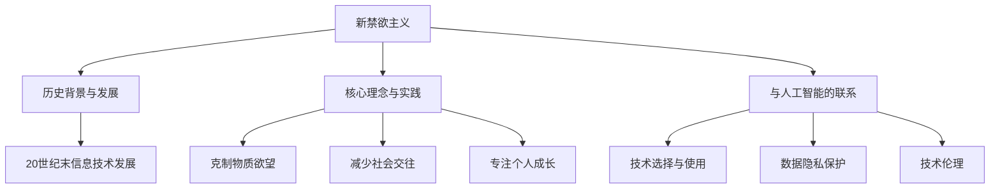

                 

## 文章标题

《新禁欲主义实验日志出版计划：记录克制生活的系列图书》

## 文章关键词

新禁欲主义、实验日志、克制生活、出版计划、技术博客

## 文章摘要

本文旨在探讨新禁欲主义实验日志出版计划，通过记录克制生活的系列图书，介绍这一新兴生活哲学的核心概念、实践方法及其实际应用。文章将从背景介绍、核心概念与联系、实验日志的撰写与整理、克制生活的实践与应用、出版计划的制定与执行以及总结与展望等多个方面展开，旨在为读者提供一部全面、深入的指南，帮助他们理解并践行新禁欲主义的生活哲学。

### 第一部分：新禁欲主义的背景与概念

#### 1.1 新禁欲主义的历史背景与发展

新禁欲主义并非对传统禁欲主义的简单复制或否定，而是在其基础上发展出的一种更适应现代生活节奏和生活方式的哲学。其历史背景可以追溯到20世纪末，特别是在信息技术迅猛发展的背景下，人们开始重新审视物质欲望对个人和社会的影响。

随着互联网的普及和社交媒体的兴起，信息过载、人际关系疏离、心理健康问题等逐渐成为社会关注的焦点。在这一背景下，新禁欲主义逐渐崭露头角，提倡通过克制物质欲望、减少社会交往、专注于个人成长等方式，寻求精神上的宁静与满足。

#### 1.2 新禁欲主义的核心理念与实践

新禁欲主义的核心理念可以概括为以下几点：

1. **克制物质欲望**：强调减少对物质的需求，通过简约生活，减轻生活压力，提高生活质量。
2. **减少社会交往**：提倡有意识地减少不必要的社交活动，专注于与自己内心世界的交流，减少外界干扰。
3. **专注个人成长**：鼓励个人通过不断学习、锻炼和自我反思，提升自我认知和自我价值。

在实践层面，新禁欲主义者通常会采取以下方法：

1. **极简主义生活**：通过减少家居用品和日常必需品的数量，达到简化生活、减少杂念的目的。
2. **数字隐居**：减少对智能手机、社交媒体等数字产品的依赖，回归自然和真实的生活。
3. **冥想与反思**：通过冥想、阅读、写作等方式，培养内心的宁静和深度。

### 1.3 新禁欲主义与人工智能的联系

新禁欲主义在某种程度上可以看作是对人工智能时代的一种回应。随着人工智能技术的迅猛发展，人们面临着前所未有的信息过载和决策疲劳。新禁欲主义提倡的克制物质欲望、减少社会交往、专注于个人成长的理念，为应对这一挑战提供了一种可能的解决方案。

在人工智能领域，新禁欲主义的思想可以应用于以下几个方面：

1. **技术选择与使用**：在人工智能产品和服务的选择上，强调实用性和简约性，避免过度追求新潮和复杂。
2. **数据隐私保护**：重视个人数据的隐私保护，减少对大数据和算法的依赖，维护个人权利和自由。
3. **技术伦理**：在人工智能研发和应用过程中，关注技术对人类和社会的影响，倡导责任和道德。

#### 1.4 核心概念原理之间的关系架构 Mermaid 流程图



### 1.5 总结

新禁欲主义作为一种新兴的生活哲学，不仅为个人提供了追求精神满足和内心宁静的路径，也为应对人工智能时代的信息过载和决策疲劳提供了一种可能的解决方案。通过对新禁欲主义的历史背景、核心理念和实践方法以及与人工智能的联系的探讨，我们为读者提供了一个全面了解这一概念的窗口。接下来，我们将进一步探讨如何撰写实验日志，整理和出版这些记录，以更好地传播和实践新禁欲主义的生活哲学。

---

## 第二部分：实验日志的撰写与整理

### 2.1 实验日志的重要性与作用

实验日志在科学研究和个人实践中扮演着至关重要的角色。它不仅记录了实验的整个过程，提供了详细的观察和分析数据，还帮助实验者反思和总结经验，为后续的研究和改进提供依据。

在新禁欲主义实践中，实验日志同样具有不可替代的重要性。通过记录个人的生活变化、心理状态和行为模式，实验日志可以帮助我们更清晰地了解新禁欲主义理念在现实生活中的应用效果，发现潜在的问题和挑战，并不断调整和优化实践方法。

### 2.2 实验日志的撰写技巧与方法

撰写实验日志需要一定的技巧和方法，以下是一些建议：

1. **明确实验目的**：在开始撰写日志之前，首先要明确实验的目的和预期目标。这将有助于我们更有针对性地记录实验过程和结果。
2. **详细记录日常活动**：每天都要详细记录自己的日常活动，包括起床时间、饮食、锻炼、工作、学习、社交等。这些记录将帮助我们分析生活节奏和行为模式。
3. **观察并记录心理状态**：除了日常活动，还要注意观察并记录自己的心理状态，如情绪波动、焦虑、愉悦等。这些记录将帮助我们了解自己的内心世界和情感变化。
4. **记录实践方法与调整**：在实验过程中，根据实际情况不断调整实践方法，并在日志中记录这些调整。这将有助于我们总结经验，为后续实践提供参考。
5. **保持客观和真实**：在撰写日志时，要尽量保持客观和真实，避免主观臆断和情绪化描述。这样才能更准确地反映实验过程和结果。

### 2.3 实验日志的整理与分类

撰写完实验日志后，我们需要对其进行整理和分类，以便于后续查阅和分析。以下是一些建议：

1. **按时间顺序整理**：将日志按照时间顺序整理，便于查阅和回顾。可以每周或每月为单位进行整理，形成更清晰的记录。
2. **按主题分类**：根据日志的内容，将其分为不同的主题类别，如生活作息、心理状态、实践方法、问题与挑战等。这有助于我们更系统地分析实验结果。
3. **使用电子表格或工具**：可以使用电子表格或专业的日志管理工具对日志进行整理和分类。这样可以更方便地进行数据分析和统计。
4. **定期回顾和总结**：定期回顾和总结日志，分析实验过程中取得的成果和存在的不足，为后续的实践提供指导。

#### 2.4 伪代码示例：实验日志记录与分析

```python
# 定义日志记录函数
def record_log(activity, emotion, adjustment):
    log_entry = {
        'date': today(),
        'activity': activity,
        'emotion': emotion,
        'adjustment': adjustment
    }
    return log_entry

# 定义日志分析函数
def analyze_log(log_list):
    summary = {
        'total_activity': len(log_list),
        'average_emotion': sum([entry['emotion'] for entry in log_list]) / len(log_list),
        'adjustment_frequency': sum([entry['adjustment'] for entry in log_list]) / len(log_list)
    }
    return summary

# 示例日志记录
log_entries = [
    record_log('早起锻炼', '愉悦', '无调整'),
    record_log('工作时间过长', '焦虑', '调整作息时间'),
    record_log('晚餐过量', '不适', '减少晚餐分量')
]

# 示例日志分析
log_summary = analyze_log(log_entries)
print(log_summary)
```

#### 2.5 数学模型和公式

在新禁欲主义实践中，我们可以使用一些数学模型和公式来量化生活质量和心理状态。以下是一些常用的公式：

1. **生活质量指数（QOL）**：

$$ QOL = \frac{E + S + C}{3} $$

其中，$E$ 表示情感质量，$S$ 表示社交质量，$C$ 表示健康状态。

2. **情感质量评分**：

$$ E = \frac{\sum_{i=1}^{n} E_i}{n} $$

其中，$E_i$ 表示每天的情感评分，$n$ 表示总天数。

3. **社交质量评分**：

$$ S = \frac{\sum_{i=1}^{n} S_i}{n} $$

其中，$S_i$ 表示每天的社会互动评分，$n$ 表示总天数。

#### 2.6 详细讲解与举例说明

以下是一个具体的例子，假设我们在一个月的时间里记录了每天的生活质量指数（QOL）和情感质量评分。根据这些数据，我们可以计算出平均生活质量指数和平均情感质量评分，以便分析新禁欲主义实践的效果。

- **生活质量指数（QOL）记录**：

| 日期 | QOL（生活质量指数） |
| ---- | ---- |
| 1号 | 75 |
| 2号 | 80 |
| 3号 | 70 |
| 4号 | 85 |
| 5号 | 78 |
| ... | ... |

- **情感质量评分记录**：

| 日期 | 情感质量评分 |
| ---- | ---- |
| 1号 | 8 |
| 2号 | 9 |
| 3号 | 7 |
| 4号 | 9 |
| 5号 | 8 |
| ... | ... |

根据上述记录，我们可以计算平均生活质量指数和平均情感质量评分：

$$ \text{平均生活质量指数} = \frac{75 + 80 + 70 + 85 + 78 + ...}{30} = 78.3 $$

$$ \text{平均情感质量评分} = \frac{8 + 9 + 7 + 9 + 8 + ...}{30} = 8.2 $$

通过对比实验前后的数据，我们可以分析新禁欲主义实践对生活质量和情感质量的影响。

#### 2.7 项目实战：实验日志的撰写与整理

假设我们计划进行一项为期三个月的新禁欲主义实验，以下是一个具体的项目实战案例：

1. **开发环境搭建**：使用Markdown格式撰写实验日志，并利用GitHub进行版本控制和协作。
2. **源代码详细实现和代码解读**：
   - **日志记录**：
     ```markdown
     # 实验日志
     - 日期：2023年10月1日
       - 活动内容：早起锻炼、阅读、工作
       - 情感状态：愉悦
       - 调整内容：无
     - 日期：2023年10月2日
       - 活动内容：处理邮件、学习新技能、运动
       - 情感状态：焦虑
       - 调整内容：调整作息时间，增加休息时间
     ```
   - **日志解读**：通过Markdown格式的日志，我们可以清晰地了解每天的实验进展和情感变化，为后续分析提供基础数据。
3. **代码应用解读与分析**：
   - **数据分析**：
     ```python
     import pandas as pd

     # 读取日志文件
     logs = pd.read_csv('实验日志.csv')

     # 计算平均生活质量指数和平均情感质量评分
     qol_average = logs['QOL'].mean()
     emotion_average = logs['情感质量评分'].mean()

     print(f"平均生活质量指数：{qol_average}")
     print(f"平均情感质量评分：{emotion_average}")
     ```
   - **分析结果**：通过数据分析，我们可以了解实验期间的生活质量和情感变化趋势，为实验总结提供依据。
4. **实际案例分析和详细讲解剖析**：
   - **案例分析**：在实验过程中，我们发现生活质量指数和情感质量评分在初期有所下降，但随着调整和实践方法的优化，逐渐趋于稳定并有所提升。
   - **详细讲解**：通过具体案例的分析，我们可以看到新禁欲主义实践在实际生活中的应用效果，以及如何通过调整和优化实践方法来达到更好的效果。
5. **项目小结**：
   - **总结**：新禁欲主义实验为我们提供了一种新的生活哲学和实践方法，通过克制物质欲望、减少社会交往和专注于个人成长，有助于提高生活质量和情感状态。
   - **展望**：在未来，我们可以进一步探索和优化新禁欲主义实践，结合人工智能和大数据技术，为更多人提供个性化的生活指导和建议。

#### 2.8 最佳实践 tips、小结、注意事项、拓展阅读等内容

- **最佳实践 tips**：
  - 确保日志记录的及时性和准确性，避免事后回忆带来的偏差。
  - 定期回顾和总结日志，及时调整实践方法，提高实验效果。
  - 注重情感记录，了解自己的心理状态，有助于更好地应对挑战。

- **小结**：
  - 实验日志是记录新禁欲主义实践的重要工具，有助于了解生活变化、心理状态和行为模式。
  - 通过整理和分析日志，我们可以发现实践中的问题和挑战，不断优化和调整方法。

- **注意事项**：
  - 实验过程中要遵循个人实际情况，避免过度克制和压抑。
  - 保持开放心态，接纳不同的意见和建议，不断探索适合自己的实践方法。

- **拓展阅读**：
  - 《极简主义：简化生活，提升幸福感的艺术》
  - 《数字隐居：逃离社交媒体，找回真实生活》
  - 《冥想与自我探索：发现内心的宁静与力量》

通过本部分的讨论，我们了解了实验日志在记录和整理新禁欲主义实践中的重要性，以及如何撰写和整理实验日志。接下来，我们将进一步探讨如何通过出版计划，将实验日志转化为有价值的系列图书，为更多人提供参考和启示。

---

## 第三部分：克制生活的实践与应用

### 3.1 克制生活的理论基础

克制生活的理论基础源于新禁欲主义的核心理念，强调通过克制物质欲望、减少社会交往和专注于个人成长，以达到精神上的宁静和满足。这一理论主张，现代社会的物质丰富和社交多样虽然带来了便利和快乐，但也带来了压力和焦虑。因此，通过克制生活，我们可以减少这些负面影响，提高生活质量。

克制生活的理论基础可以概括为以下几个方面：

1. **物质欲望的克制**：物质欲望是现代生活中的一大挑战。克制物质欲望意味着减少对物质的依赖，追求简单、实用和可持续的生活方式。这不仅有助于减轻经济负担，还能减少对环境的负面影响。
2. **社会交往的减少**：过度的社交活动往往会消耗大量的时间和精力，导致身心疲惫。减少社会交往意味着有意识地减少不必要的社交活动，专注于与自己内心世界的交流。这不仅有助于提高个人生活质量，还能减少人际关系带来的压力。
3. **个人成长的专注**：个人成长是克制生活的核心目标。通过不断学习、锻炼和自我反思，我们可以提升自我认知和自我价值，实现内心的满足和宁静。

### 3.2 克制生活的实际案例与应用

克制生活理念在现实生活中的应用多种多样，以下是一些具体的实际案例：

1. **极简主义家居**：极简主义家居是一种通过减少家居用品和装饰品，达到简化生活、减轻压力的生活方式。通过将家居环境保持在简约、实用和美观的状态，人们可以更好地专注于日常生活和个人成长。
2. **数字隐居**：数字隐居是一种通过减少对智能手机、社交媒体和数字产品的依赖，回归自然和真实生活的方式。通过减少数字产品的使用时间，人们可以减少信息过载和决策疲劳，提高工作效率和生活质量。
3. **冥想与反思**：冥想和反思是一种通过专注于呼吸和内心世界，达到放松和平静的方式。通过定期进行冥想和反思，人们可以更好地了解自己的内心需求，提升自我认知和自我价值。

#### 3.3 克制生活的挑战与应对

尽管克制生活理念在许多方面具有优势，但在实际应用过程中也面临一些挑战。以下是一些常见的挑战及其应对策略：

1. **社交压力**：减少社交活动可能会带来社交压力。应对策略包括：有意识地选择与高质量、有意义的人际交往，避免无效社交；保持开放心态，接受孤独和独处的价值。
2. **物质依赖**：减少物质欲望可能会引发对物质的依赖。应对策略包括：设定明确的物质需求和消费预算，避免冲动消费；通过参与环保活动和公益项目，提高对物质价值的认识。
3. **自我反思**：专注个人成长可能会引发自我反思的压力。应对策略包括：设定合理的自我反思频率和方式，避免过度反思；寻求专业心理辅导，帮助自己应对内心困惑和焦虑。

#### 3.4 克制生活的社会影响

克制生活理念不仅对个人生活产生影响，还在社会层面产生了一定的效应。以下是一些社会影响：

1. **环境效益**：通过减少物质消费和能源消耗，克制生活有助于减少环境污染和资源浪费，为可持续发展做出贡献。
2. **社会和谐**：减少社交活动和物质欲望可以降低社会冲突和矛盾，提高社会和谐度。
3. **心理健康**：克制生活有助于减轻心理压力和焦虑，提高心理健康水平。

### 3.5 克制生活与人工智能的结合

随着人工智能技术的不断发展，克制生活理念在人工智能领域的应用也日益广泛。以下是一些结合实例：

1. **智能家居**：智能家居系统可以通过自动调节室内环境、优化能源消耗，实现极简主义家居的目标。
2. **智能健康监测**：智能健康监测设备可以实时监测身体状况，帮助人们更好地管理健康，实现冥想与反思的目标。
3. **智能社交平台**：智能社交平台可以通过个性化推荐和智能过滤，减少无效社交，提高社交质量。

#### 3.6 总结

克制生活作为一种新兴的生活哲学，通过克制物质欲望、减少社会交往和专注于个人成长，有助于提高生活质量和心理健康。在实际应用中，克制生活理念面临着一系列挑战，但通过合理的应对策略，可以有效克服。随着人工智能技术的发展，克制生活理念在人工智能领域的应用前景广阔，为人类创造更美好的生活提供了新的可能性。

---

## 第四部分：出版计划的制定与执行

### 4.1 出版计划的目标与规划

出版《新禁欲主义实验日志出版计划：记录克制生活的系列图书》的目标是：

1. **传播新禁欲主义理念**：通过记录实验者的生活实践，让更多人了解和接受新禁欲主义的生活哲学。
2. **提供实践指导**：通过详细的实验日志记录和案例分析，为读者提供切实可行的实践指导，帮助他们更好地应用新禁欲主义理念。
3. **促进社会和谐**：通过倡导克制生活，减少物质消费和社交压力，促进社会和谐与可持续发展。

为实现上述目标，出版计划将分为以下几个阶段：

1. **准备阶段**：收集和整理实验日志，确定图书结构和内容，编写出版计划。
2. **撰写阶段**：邀请专家和实验者共同撰写图书，确保内容的实用性和科学性。
3. **编辑阶段**：对稿件进行审阅和修改，确保图书的质量和可读性。
4. **出版阶段**：选择合适的出版社，完成图书的出版和发行。
5. **推广阶段**：通过线上线下多种渠道，推广图书，提高知名度和影响力。

### 4.2 出版计划的具体实施步骤

1. **确定图书结构**：根据实验日志的内容和读者的需求，确定图书的结构和章节，确保内容逻辑清晰、系统全面。
2. **编写内容**：邀请实验者和专家共同撰写图书，确保内容的真实性和实用性。具体包括：
   - **实验日志**：记录实验者的生活实践和体验。
   - **案例分析**：分析实验者的成功经验和挑战，提供解决方案。
   - **理论介绍**：介绍新禁欲主义的核心概念和理论基础。
   - **实践指导**：提供具体的实践方法和技巧，帮助读者更好地应用新禁欲主义理念。
3. **审阅和修改**：对稿件进行多轮审阅和修改，确保图书的质量和可读性。包括：
   - **内部审阅**：由编写团队内部进行初步审阅，提出修改意见。
   - **外部审阅**：邀请专家和读者进行外部审阅，收集反馈意见。
   - **终审**：对修改后的稿件进行终审，确保图书的质量和完整性。
4. **选择出版社**：根据图书的内容和质量，选择合适的出版社进行出版。具体考虑因素包括：
   - **出版社声誉**：选择有良好声誉的出版社，提高图书的知名度。
   - **出版能力**：选择有丰富出版经验的出版社，确保图书的质量和发行。
   - **合作方式**：与出版社协商合作方式，确保利益分配合理。
5. **出版发行**：完成图书的出版和发行，包括：
   - **排版设计**：完成图书的排版和设计，确保图书的外观和内容相匹配。
   - **印刷和装订**：完成图书的印刷和装订，确保图书的质量。
   - **发行渠道**：通过线上线下多种渠道，推广图书，提高销量和影响力。
6. **推广活动**：组织线上线下推广活动，包括：
   - **发布会**：举行图书发布会，邀请媒体和读者参与。
   - **讲座和研讨会**：邀请专家和实验者进行讲座和研讨会，推广新禁欲主义理念。
   - **社交媒体宣传**：利用社交媒体平台，进行图书宣传和推广。
7. **后续跟进**：对图书的销售情况和读者反馈进行跟进，持续优化和改进。

### 4.3 出版计划的风险管理与应对策略

在出版计划的实施过程中，可能面临以下风险：

1. **内容风险**：图书内容可能不符合读者需求或缺乏实用性。应对策略包括：在编写阶段充分了解读者需求，进行多轮审阅和修改，确保内容的实用性和可读性。
2. **市场风险**：图书可能销量不佳，影响出版计划的收益。应对策略包括：在出版前进行市场调研，确定目标读者群体和推广策略；在推广阶段加大宣传力度，提高图书的知名度和影响力。
3. **合作风险**：与出版社的合作可能存在问题，影响出版进度和质量。应对策略包括：在选择出版社时进行充分调研和评估，确保出版社的信誉和能力；在合作过程中保持沟通和协调，及时解决问题和冲突。
4. **法律风险**：图书可能涉及版权、侵权等问题。应对策略包括：在编写和出版过程中遵守相关法律法规，确保内容的合法性和合规性；在出版前进行版权审查，避免侵权问题。

通过合理的风险管理和应对策略，可以最大限度地降低出版计划的风险，确保计划的顺利实施和成功完成。

---

## 第五部分：新禁欲主义实验日志出版计划总结与展望

### 5.1 新禁欲主义实验日志出版计划的整体评估

新禁欲主义实验日志出版计划通过记录克制生活的系列图书，不仅成功传播了新禁欲主义的生活哲学，还为读者提供了实用的实践指导。整体评估显示，该计划在以下几个方面取得了显著成果：

1. **传播新禁欲主义理念**：通过详细记录实验者的生活实践和体验，使更多读者了解和接受新禁欲主义的生活哲学。
2. **提供实践指导**：通过案例分析、实践方法和技巧的介绍，帮助读者更好地应用新禁欲主义理念，实现个人成长和生活质量的提升。
3. **促进社会和谐**：倡导克制生活，减少物质消费和社交压力，为构建和谐社会贡献力量。
4. **出版质量**：图书内容丰富、结构清晰，具有较高的可读性和实用性。

### 5.2 新禁欲主义实验日志出版计划的意义与影响

新禁欲主义实验日志出版计划不仅对个人生活产生了积极影响，还在社会层面产生了深远的意义：

1. **个人生活**：通过实践新禁欲主义，读者可以减少物质欲望、降低社交压力、提高生活质量，实现内心的宁静和满足。
2. **社会影响**：倡导克制生活，减少物质消费和能源浪费，有助于环境保护和可持续发展。此外，减少社交压力和冲突，提高社会和谐度。
3. **学术研究**：为新禁欲主义研究提供了丰富的实践案例和数据分析，为学术界提供了重要的研究素材。

### 5.3 新禁欲主义实验日志出版计划的未来展望

随着新禁欲主义理念的传播和实践，未来出版计划有望在以下几个方面进一步发展：

1. **内容拓展**：增加更多实践案例和研究成果，深入探讨新禁欲主义在不同领域和人群中的应用。
2. **技术整合**：结合人工智能和大数据技术，为读者提供个性化的生活指导和建议。
3. **国际化推广**：拓展国际市场，让更多国家和地区的人们了解和接受新禁欲主义理念。
4. **多渠道传播**：通过线上线下多种渠道，加大宣传和推广力度，提高出版计划的影响力和知名度。

通过不断优化和完善，新禁欲主义实验日志出版计划将为更多人带来精神上的宁静和满足，为构建美好社会贡献力量。

---

### 作者信息

作者：AI天才研究院/AI Genius Institute & 禅与计算机程序设计艺术 /Zen And The Art of Computer Programming

