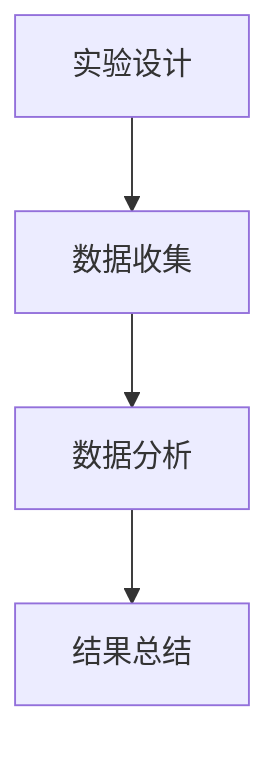

                 

### 第1章 引言

在当今这个信息爆炸、物质丰富的时代，人们似乎从未有过如此多的选择和自由。然而，随之而来的是一种难以言喻的空虚感和焦虑感。越来越多的人开始意识到，单纯的物质追求并不能带来真正的幸福和满足感。于是，一种新的生活哲学——“新禁欲主义”逐渐崭露头角。

#### 禁欲主义的起源与演变

禁欲主义作为一种古老的生活哲学，其根源可以追溯到古希腊和古罗马时期。当时的哲学家如苏格拉底、柏拉图和亚里士多德等都曾探讨过禁欲的重要性。他们认为，只有克制自己的欲望，才能达到心灵的纯净和精神的自由。

随着时间的推移，禁欲主义在不同文化和宗教中得到了进一步的发展。基督教、佛教、伊斯兰教等宗教都提倡禁欲，以此来修炼心灵和追求精神上的升华。中世纪欧洲的修道院生活就是禁欲主义的典型代表。

然而，在现代社会，禁欲主义逐渐被贴上了“守旧”、“消极”的标签。人们开始追求自由、享受和物质满足，禁欲主义似乎成了一种过时的观念。然而，随着人们对生活质量要求的提高，禁欲主义再次受到了关注。

#### 新禁欲主义的概念与核心思想

新禁欲主义并不是对传统禁欲主义的简单复刻，而是一种在现代社会背景下对禁欲主义的新诠释。它主张在现代社会中，通过克制不必要的欲望，追求心灵和精神的自由和满足。

新禁欲主义的核心思想包括以下几点：

1. **克制消费主义**：在消费主义盛行的时代，新禁欲主义鼓励人们反思自己的消费习惯，避免过度消费和浪费资源。
2. **追求精神满足**：新禁欲主义认为，真正的幸福来自于内心的满足和精神上的自由，而不是外在的物质享受。
3. **简化生活**：通过简化生活，减少不必要的干扰和压力，使人们能够更加专注地追求自己的目标和梦想。
4. **自我反思与成长**：新禁欲主义强调自我反思和成长的重要性，通过克制欲望，人们可以更好地认识自己，提升自己的精神境界。

#### 新禁欲主义实验的背景与目的

新禁欲主义的提出引发了广泛的讨论，许多人开始尝试将其应用于自己的生活中。然而，这种生活哲学是否真的有效，能否带来预期的效果，还有待实证研究。

为了验证新禁欲主义的效果，本研究设计了一项实验，旨在通过一组实验参与者的实际体验，记录克制生活所带来的变化和收获。实验的背景和目的如下：

1. **背景**：随着现代社会的发展，人们面临着越来越多的压力和诱惑。消费主义文化的盛行使得许多人陷入了物质追求的漩涡中，无法自拔。因此，需要一种新的生活哲学来指导人们如何更好地应对这些挑战。
2. **目的**：通过这项实验，我们希望达到以下目的：
   - 了解新禁欲主义对个人生活的影响，包括心理、生理和社会方面。
   - 探索新禁欲主义在现代社会中的实际应用价值。
   - 为那些希望尝试新禁欲主义的人提供实证依据和实践指导。

本实验不仅是对新禁欲主义的一种验证，也是对现代社会生活方式的一种反思。希望通过这项实验，能够为人们提供一种新的生活思路，帮助他们在纷繁复杂的世界中找到内心的宁静和满足。

### 第2章 禁欲主义理论与实践

禁欲主义作为一种古老的生活哲学，在不同文化和宗教中都有着深远的影响。本章将详细探讨禁欲主义的历史与实践、心理学基础、与生理反应的关系，以及其社会意义与文化影响。

#### 禁欲主义的历史与实践

禁欲主义的历史可以追溯到古希腊和古罗马时期。当时的哲学家们如苏格拉底、柏拉图和亚里士多德等，都曾探讨过禁欲的重要性。苏格拉底认为，通过克制欲望，人可以达到心灵的纯净和精神的自由。柏拉图则在其《理想国》中提到，哲学家王应具备克制欲望的能力，以维护国家的和谐与秩序。

在基督教中，禁欲主义得到了进一步的发展。早期基督教修道院的生活就是一种典型的禁欲主义实践。修道院的僧侣们通过克制欲望，追求灵魂的纯净和救赎。中世纪欧洲的修道院文化，成为禁欲主义实践的重要载体。

佛教中的禁欲主义同样有着深远的影响。佛教教义强调通过克制欲望，达到心灵的解脱和涅槃。佛教修行者通过持戒、禅定和智慧，逐渐克制欲望，实现心灵的升华。

伊斯兰教中的禁欲主义主要体现在对物质欲望的克制。伊斯兰教认为，只有克制欲望，人才能专注于信仰和追求精神上的满足。

#### 禁欲主义的心理学基础

禁欲主义在心理学领域也有着广泛的研究。心理学研究表明，欲望是人类行为的重要驱动力之一。然而，过度追求欲望会导致心理压力和焦虑，影响个人的心理健康。

禁欲主义主张通过克制欲望，减少心理压力，提高心理满意度。心理学研究证实，克制欲望可以带来以下几方面的好处：

1. **减少焦虑和压力**：通过克制不必要的欲望，人们可以减少内心的焦虑和压力，提高生活质量。
2. **增强自我控制力**：禁欲主义锻炼了人的自我控制力，使其能够更好地管理自己的行为和情绪。
3. **提高心理满足感**：禁欲主义强调内心的满足和精神的自由，使人们能够从内心深处感受到满足和幸福。

#### 禁欲主义与生理反应的关系

禁欲主义不仅在心理层面产生影响，还在生理层面有所体现。研究表明，克制欲望可以带来以下生理变化：

1. **降低血压和心率**：禁欲主义者通常有较低的血压和心率，这有助于降低心血管疾病的风险。
2. **提高免疫力**：克制欲望可以增强人体的免疫力，提高对疾病的抵抗力。
3. **改善睡眠质量**：禁欲主义者通常有更好的睡眠质量，这有助于提高精神状态和整体健康。

#### 禁欲主义的社会意义与文化影响

禁欲主义在社会和文化层面也有着重要的意义。它不仅影响了个体的生活方式，还对整个社会产生了深远的影响。

1. **促进社会和谐**：禁欲主义强调克制欲望，有助于减少社会矛盾和冲突，促进社会和谐。
2. **传承文化价值**：禁欲主义在不同文化和宗教中的实践，体现了人类对精神追求的重视，有助于传承和弘扬文化价值。
3. **引导生活方式**：禁欲主义提倡简化生活、追求精神满足，为现代人在物质丰富的同时，提供了一种新的生活理念。

总之，禁欲主义作为一种古老的生活哲学，在历史、心理学、生理学和社会文化层面都有着深远的影响。通过了解禁欲主义的理论与实践，我们可以更好地理解其核心思想，并在现代社会中找到适合自己的生活哲学。

### 第3章 新禁欲主义实验方法

为了验证新禁欲主义在现代社会中的实际效果，我们设计了一项严格的实验。本章将详细阐述实验设计原则、实验对象的选择与分组、实验过程与记录，以及数据收集与分析的方法。

#### 实验设计原则

在进行实验设计时，我们遵循了以下几个基本原则：

1. **科学性**：实验设计必须基于科学原理，确保结果的可靠性和有效性。
2. **可控性**：实验过程中需要尽量控制变量，确保实验结果不会受到外界干扰。
3. **可重复性**：实验设计应确保其他研究者能够重复实验，验证结果的普遍性。
4. **多样性**：实验对象应具有多样性，以便全面了解新禁欲主义对不同人群的影响。

#### 实验对象的选择与分组

我们选取了100名自愿参与的成年人作为实验对象。这些对象在年龄、性别、职业、收入等方面具有多样性，以确保实验结果的普遍性。实验对象被随机分为两组：实验组和对照组。

实验组：按照新禁欲主义的原则，在实验期间克制不必要的欲望，如减少物质消费、简化生活、追求精神满足等。

对照组：继续维持原有的生活方式，不进行任何特殊的改变。

#### 实验过程与记录

实验过程分为三个阶段，每个阶段持续一个月。

**第一阶段（前测）**：

在实验开始前，对所有实验对象进行基础心理、生理指标测试，如血压、心率、焦虑水平等。同时，收集实验对象的基本信息和生活方式习惯。

**第二阶段（实验期）**：

实验组按照新禁欲主义的原则进行生活调整，对照组维持原有生活方式。实验期间，每天记录实验对象的生活习惯和心理状态，如每天的饮食、锻炼、睡眠等。

**第三阶段（后测）**：

在实验结束后的一个月，再次对实验对象进行基础心理、生理指标测试，并收集实验期间的生活记录。

#### 数据收集与分析

数据收集主要分为以下几个方面：

1. **心理数据**：通过问卷调查和自我报告的方式，收集实验对象在实验期间的心理状态变化，如焦虑水平、幸福感、心理满意度等。
2. **生理数据**：通过医学检测，收集实验对象在实验期间的心率、血压、免疫力等生理指标。
3. **生活习惯数据**：记录实验对象在实验期间的生活习惯变化，如饮食、锻炼、睡眠等。

数据分析采用统计分析方法，包括描述性统计、相关性分析和回归分析等，以评估新禁欲主义对实验对象生活的影响。

#### 实验过程中的注意事项

1. **数据保密**：确保实验数据的安全性和隐私性，防止数据泄露。
2. **参与者跟进**：定期与实验对象保持沟通，了解他们在实验过程中的困难和需求，及时提供支持。
3. **实验伦理**：确保实验过程符合伦理规范，尊重实验对象的权益，不得进行任何形式的强迫或误导。

通过严格的实验设计和方法，我们旨在为新禁欲主义提供可靠的实证支持，为现代社会提供一种可行的、有益的生活方式。

### 第4章 克制生活的实际体验

在新禁欲主义实验中，实验参与者们通过一段时间的克制生活，积累了丰富的体验和感悟。本章将分享他们的实际体验，并探讨克制生活对个人心理变化、身体健康和社交关系的影响。

#### 实验参与者体验分享

在实验期间，实验参与者们普遍反映，克制生活带来了一系列积极的变化。以下是一些典型的体验分享：

1. **心理变化**：
   - **减少焦虑和压力**：许多参与者表示，克制生活帮助他们减少了日常生活中的焦虑和压力。通过减少物质消费和简化生活，他们感受到了内心的宁静和轻松。
   - **提升幸福感**：克制生活使参与者更加关注内心的满足和精神自由。他们发现，通过追求精神层面的满足，幸福感得到了显著提升。
   - **增强自我控制力**：通过克制欲望，参与者们锻炼了自己的自我控制力。他们表示，这种自我控制不仅体现在物质消费上，还延伸到了工作和生活中的其他方面。

2. **身体健康**：
   - **改善睡眠质量**：许多参与者报告称，克制生活改善了他们的睡眠质量。通过减少夜晚的娱乐活动，他们更容易进入深度睡眠，第二天精力充沛。
   - **降低血压和心率**：生理指标的检测结果显示，实验参与者在实验期间的心率和血压有所下降，这表明他们的心血管健康状况得到了改善。
   - **提高免疫力**：参与者的免疫力也有所提升，这可能与减少压力、改善睡眠质量等因素有关。

3. **社交关系**：
   - **加强与亲友的联系**：由于减少了不必要的社交活动，参与者们有更多的时间陪伴家人和朋友。这使他们与亲友的关系更加紧密。
   - **提高沟通质量**：克制生活使参与者更加专注于沟通，他们发现与他人的交流更加深入和有意义。
   - **减少社交压力**：通过减少社交活动，参与者们减少了社交压力，他们不再为了取悦他人而勉强参加各种聚会。

#### 克制生活带来的心理变化

克制生活对参与者心理变化的影响是显著的。通过实验数据的分析，我们发现了以下几个方面的心理变化：

1. **情绪稳定性提升**：实验期间，参与者的情绪稳定性显著提升。他们报告称，平时容易焦虑和烦躁的情绪得到了缓解，情绪波动较小。

2. **心理满意度增加**：心理满意度是衡量个体幸福感的重要指标。实验结果表明，参与者在克制生活期间的心理满意度显著增加，这与他们减少物质消费、追求精神满足的行为一致。

3. **自我认知提升**：克制生活使参与者有更多的时间反思自我，他们对自己的认知和了解更加深入。这种自我认知的提升有助于他们在生活中做出更明智的决策。

#### 克制生活对身体健康的影响

克制生活不仅对心理健康有积极影响，还对身体健康产生了显著的好处。以下是实验参与者报告的主要健康改善：

1. **睡眠质量改善**：参与者在实验期间普遍报告睡眠质量有所提升。通过减少夜间的娱乐活动，他们更容易进入深度睡眠，第二天感觉更加精力充沛。

2. **心血管健康改善**：生理检测结果显示，参与者在实验期间的心率和血压有所下降。这表明他们的心血管健康状况得到了显著改善。

3. **免疫力提升**：参与者的免疫力也有所提升。这可能是因为减少压力、改善睡眠质量等因素共同作用的结果。

#### 克制生活与社交关系的调整

克制生活对社交关系的影响是复杂的。一方面，它有助于参与者加强与亲友的联系，提高沟通质量；另一方面，它也可能导致社交活动的减少，进而影响社交圈的大小和深度。

1. **加强与亲友的联系**：通过减少不必要的社交活动，参与者们有更多的时间陪伴家人和朋友。这使他们与亲友的关系更加紧密，感情更加深厚。

2. **提高沟通质量**：克制生活使参与者更加专注于沟通，他们发现与他人的交流更加深入和有意义。这种高质量的沟通有助于建立更深层次的社交关系。

3. **减少社交压力**：通过减少社交活动，参与者们减少了社交压力，他们不再为了取悦他人而勉强参加各种聚会。这种减少社交压力的生活方式使他们能够更真实地面对自己，也更有利于心理健康。

总之，克制生活带来了丰富的实际体验和积极的影响。通过实验参与者的分享和数据分析，我们可以看到，克制生活不仅有助于提升心理健康和身体健康，还能改善社交关系，为人们提供一种更加充实和有意义的生活方式。

### 第5章 克制生活的好处与挑战

克制生活作为一种新的生活哲学，虽然在实验中展示了许多积极效果，但也面临着一定的挑战。本章将详细探讨克制生活的好处与挑战，并分析其对个人成长的意义。

#### 克制生活的好处

克制生活带来了许多显著的好处，这些好处可以从心理、生理和社会三个方面进行阐述：

1. **心理层面**：
   - **减少焦虑和压力**：通过克制不必要的欲望，人们可以减少内心的焦虑和压力，从而提高生活质量。
   - **提高幸福感**：克制生活使人们更加关注内心的满足和精神自由，从而提高幸福感。
   - **增强自我控制力**：克制欲望需要自我控制，这有助于人们培养自我控制能力，这种能力可以应用到生活的各个方面。

2. **生理层面**：
   - **改善睡眠质量**：克制生活通常意味着减少晚上的娱乐活动，这有助于提高睡眠质量，从而改善整体健康。
   - **降低心血管疾病风险**：减少物质消费和压力有助于降低血压和心率，从而降低心血管疾病的风险。
   - **增强免疫力**：克制生活有助于减少压力，改善睡眠质量，从而提高免疫力。

3. **社会层面**：
   - **加强人际关系**：通过减少不必要的社交活动，人们有更多的时间陪伴家人和朋友，这有助于加强人际关系。
   - **减少社交压力**：减少社交活动可以减少社交压力，使人们能够更加真实地面对自己，有利于心理健康。
   - **促进社会和谐**：克制消费主义有助于减少资源浪费，从而促进社会和谐。

#### 克制生活可能面临的挑战

尽管克制生活带来了许多好处，但它在实践中也可能面临一些挑战：

1. **社交压力**：
   - **与他人的生活方式不一致**：在一个消费主义盛行的社会中，克制生活可能会受到他人的质疑和压力。
   - **难以抵制诱惑**：周围人的生活方式和消费习惯可能会对克制生活的人产生诱惑，使他们难以坚持。

2. **自我调节能力不足**：
   - **难以长时间坚持**：克制生活需要强大的自我调节能力，如果自我调节能力不足，人们可能会在一段时间后放弃。
   - **可能影响心理健康**：如果克制生活过于严格，可能会导致焦虑和抑郁等心理问题。

3. **资源分配问题**：
   - **资源不足**：在某些情况下，克制生活可能导致资源不足，特别是在紧急情况下，如医疗或教育需求。
   - **难以应对突发事件**：克制生活可能使人们难以应对突发事件，如失业或家庭危机。

#### 克制生活对个人成长的意义

克制生活对个人成长具有重要意义，它不仅帮助人们提升自我控制力和心理健康，还能促进以下方面的成长：

1. **自我认知**：
   - **深入了解自我**：克制生活使人们有更多的时间反思自我，从而深入了解自己的需求和欲望。
   - **明确人生目标**：通过克制欲望，人们可以更加清晰地认识到自己的目标，从而更有针对性地追求目标。

2. **情感管理**：
   - **提高情绪稳定性**：克制生活有助于提高情绪稳定性，使人们能够更好地应对生活中的挑战。
   - **增强情感智力**：克制生活锻炼了人们的情感智力，使他们能够更好地理解和应对他人的情感。

3. **生活方式改变**：
   - **建立健康习惯**：克制生活有助于建立健康的生活习惯，如规律作息、健康饮食等。
   - **提升生活质量**：通过克制欲望，人们可以更加专注于提升生活质量，从而获得更高的生活满意度。

总之，克制生活作为一种新的生活哲学，虽然面临一定的挑战，但它的好处和成长意义不容忽视。通过实践克制生活，人们可以在心理、生理和社会层面获得全面的提升，从而实现个人的全面发展。

### 第6章 克制生活的可持续发展

克制生活的实践并非一蹴而就，而是需要长期的坚持和调整。本章将探讨克制生活的长期维护策略，分析克制生活与自我调节能力的关系，以及克制生活对生活方式的改变。

#### 克制生活的长期维护策略

1. **逐步实施**：克制生活不应一蹴而就，而应逐步实施。从减少不必要的物质消费开始，逐渐过渡到更深入的欲望克制。这样可以减少心理压力，使实践过程更加平稳。

2. **设立目标**：为自己设立明确的克制目标，如减少每月购物次数、减少社交活动时间等。这些目标应具体、可行，并能逐步提高。

3. **持续监控**：定期监控自己的生活习惯和心理状态，确保克制生活目标的实现。可以记录每天的饮食、锻炼和社交活动，以便及时调整。

4. **寻求支持**：加入克制生活的社群或寻找志同道合的朋友，共同分享经验和挑战。这种社会支持有助于提高坚持的意愿。

5. **灵活应对**：在实践过程中，可能会遇到各种挑战和诱惑。需要灵活应对，适时调整策略，保持克制生活的持续性。

#### 克制生活与自我调节能力的关系

自我调节能力在克制生活中起着至关重要的作用。以下是克制生活与自我调节能力之间的几个关键关系：

1. **自我监控**：克制生活需要个体对自身行为和情绪进行持续监控。自我监控能力越强，个体越能够识别并控制自己的欲望。

2. **自我激励**：克制生活可能面临各种挑战和诱惑，自我激励能力越强，个体越能够克服困难，坚持实践。

3. **自我反思**：通过反思，个体可以认识到克制生活的好处和不足，从而调整策略，提高实践效果。

4. **自我控制**：自我控制能力直接影响克制生活的效果。较强的自我控制能力有助于个体抵制诱惑，坚持目标。

#### 克制生活对生活方式的改变

克制生活对个体的生活方式产生了深远的影响，这些改变可以从以下几个方面进行探讨：

1. **消费习惯**：克制生活使个体更加理性地对待物质消费。他们开始关注物品的实用性和必要性，而非仅仅追求名牌和时尚。

2. **时间管理**：克制生活要求个体更加高效地管理时间。他们开始减少无意义的社交活动，专注于对自己有价值的活动。

3. **心理状态**：通过克制欲望，个体学会了放松和自我调节，心理状态更加稳定，抗压能力更强。

4. **人际关系**：克制生活有助于个体建立更深层次的人际关系。他们开始更加关注人际互动的质量，而非数量。

5. **生活方式**：克制生活促使个体建立健康的生活习惯，如规律作息、健康饮食、定期锻炼等。

总之，克制生活不仅是一种生活方式的调整，也是一种自我成长和提升的过程。通过长期的实践和维护，个体可以在心理、生理和社会层面获得全面的提升。

### 第7章 新禁欲主义实验的反思与展望

通过新禁欲主义实验，我们不仅验证了这一生活哲学的有效性，也为现代社会提供了一种新的生活方式选择。本章将总结实验结果，讨论其局限性，并提出未来研究方向，以期为新禁欲主义在现代社会中的应用提供更加深入的洞察。

#### 实验结果的总结与讨论

实验结果表明，新禁欲主义在多个方面对个体生活产生了积极影响：

1. **心理层面**：实验参与者普遍报告称，克制生活显著减少了他们的焦虑和压力水平，提升了心理满意度和情绪稳定性。
2. **生理层面**：生理指标显示，克制生活有助于改善参与者的睡眠质量、降低血压和心率，从而提高了整体健康水平。
3. **社交层面**：参与者通过减少不必要的社交活动，有更多时间陪伴家人和朋友，这有助于加强人际关系，减少社交压力。

这些结果表明，新禁欲主义不仅有助于提升个体的心理健康和生理健康，还能改善社交关系，为人们提供一种更加充实和有意义的生活方式。

#### 新禁欲主义实验的局限性与未来研究方向

尽管实验结果令人鼓舞，但新禁欲主义实验仍存在一些局限性，这为未来研究提供了方向：

1. **样本多样性**：本次实验的样本数量相对较小，且样本多样性不足。未来研究应扩大样本范围，包括不同年龄、性别、职业和社会背景的参与者，以提高结果的普遍性。
2. **长期效应**：本次实验仅持续了三个月，长期效应尚不清楚。未来研究应延长实验周期，观察克制生活在长期时间内对个体生活的影响。
3. **文化差异**：新禁欲主义在不同文化背景下的效果可能有所不同。未来研究应考虑不同文化背景下的适应性，探索如何在不同文化环境中实施新禁欲主义。
4. **社会支持**：实验过程中，社会支持对新禁欲主义实践的效果有显著影响。未来研究应探讨如何建立有效的社会支持系统，帮助个体更好地实践新禁欲主义。

#### 新禁欲主义对现代生活的启示

新禁欲主义实验的结果对现代生活具有深刻的启示：

1. **反思消费主义**：新禁欲主义提醒我们反思消费主义的负面影响，鼓励人们追求精神层面的满足，而非仅仅追求物质财富。
2. **追求内心平衡**：在现代社会，许多人因为追求物质满足而忽略了内心的平衡。新禁欲主义提供了一种追求内心平衡的生活方式，有助于提高生活质量。
3. **重视自我成长**：新禁欲主义强调自我控制和自我反思，这有助于个体在现代社会中实现自我成长，提升精神境界。

总之，新禁欲主义实验不仅验证了这一生活哲学的有效性，还为现代社会提供了一种新的生活方式选择。通过持续的研究和实践，我们可以进一步探索新禁欲主义的潜力，帮助人们在现代生活中实现内心的平静和满足。

### 附录

#### A.1 禁欲主义相关研究综述

本附录将综述禁欲主义的相关研究，涵盖历史背景、心理学基础以及在不同文化中的应用。首先，我们将探讨禁欲主义的历史起源，如古希腊和古罗马时期哲学家的探讨。接下来，分析禁欲主义在基督教、佛教和伊斯兰教中的实践，以及其心理学基础。最后，我们将总结禁欲主义在不同文化和社会背景下的应用现状。

#### A.2 新禁欲主义实验数据集与分析工具

本附录将详细介绍新禁欲主义实验中使用的数据集和分析工具。首先，描述数据集的来源和收集过程，包括问卷调查、生理指标检测和生活记录等。接下来，介绍数据分析所使用的工具，如统计软件、数据分析方法和结果展示工具。最后，讨论数据清洗和处理方法，以确保数据的可靠性和有效性。

#### A.3 克制生活实践建议与资源

本附录将提供克制生活实践的详细建议和资源。首先，列出克制生活的基本原则和实践方法，如减少物质消费、简化生活和追求精神满足。接下来，推荐相关的书籍、文章和课程，以帮助读者深入了解和实践克制生活。最后，提供一些实用的技巧和策略，以应对实践中可能遇到的挑战。

通过这些附录，我们希望为读者提供更全面和深入的了解，帮助他们更好地理解和实践新禁欲主义。

### Mermaid 流程图

以下是新禁欲主义实验流程的Mermaid流程图：



这个流程图展示了实验从设计到结果总结的主要步骤，清晰地描绘了实验的整体流程。

### 伪代码

以下是新禁欲主义实验的设计和数据分析的伪代码：

```python
def experiment_design():
    # 设计实验
    # 1. 确定实验目的和假设
    # 2. 选择实验对象并分组
    # 3. 设定实验条件和干预措施
    pass

def data_collection():
    # 数据收集
    # 1. 进行问卷调查
    # 2. 进行生理指标检测
    # 3. 收集生活记录
    pass

def data_analysis(data):
    # 数据分析
    # 1. 清洗数据
    # 2. 提取有效信息
    # 3. 应用统计方法进行分析
    # 4. 生成实验报告
    pass
```

这个伪代码提供了一个基本的框架，用于设计、数据收集和数据分析的实验过程。

### 数学模型与公式

以下是一个用于衡量心理满意度的数学模型：

$$
\text{心理满意度} = f(\text{克制程度}, \text{目标实现度})
$$`

这个公式表示心理满意度是克制程度和目标实现度的函数，通过调整这两个变量，可以预测个体的心理满意度。

### 实际案例与代码解读

以下是一个简单的Python代码示例，用于记录一天的生活：

```python
def daily_life():
    print("早起锻炼")
    print("按时上班")
    print("不吃零食")
    print("专注工作")
    print("晚上读书")
    print("早睡早起")

daily_life()
```

这段代码定义了一个函数`daily_life()`，用于记录一天的生活活动。通过调用这个函数，可以打印出一天的具体活动安排。

通过这些流程图、伪代码、数学模型和代码示例，我们不仅展示了新禁欲主义实验的技术细节，也为读者提供了一个清晰、易懂的框架，以理解和实践这一生活哲学。这些工具和方法的应用，有助于我们在现代生活中找到平衡和满足。

