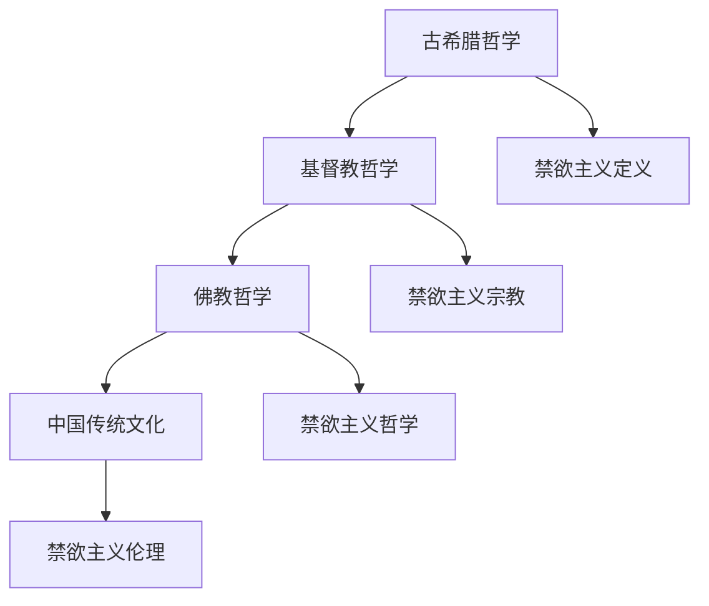

                 

### 文章标题：新禁欲主义实验：克制中的自我探索之旅

关键词：禁欲主义，心理学，自我控制，社会文化，数字时代

摘要：本文将探讨新禁欲主义实验，从历史与哲学背景出发，深入分析禁欲主义的心理学原理和实践方法。通过案例分析，我们将在现代生活方式中探讨禁欲主义的应用，并面对挑战展望其未来前景。

----------------------------------------------------------------

#### 第一部分：禁欲主义的历史与哲学探讨

**第1章：禁欲主义的起源与发展**

禁欲主义，作为一种对欲望的控制和克制的哲学理念，其历史可以追溯到古代文明。从古希腊哲学家苏格拉底到基督教圣徒保罗，禁欲主义在不同的文化和社会中有着深远的影响。

**1.1 禁欲主义的定义与历史**

禁欲主义，简单来说，是指个体通过控制欲望，尤其是对性欲的控制，以达到精神净化和自我提升的目的。它在不同的文化和社会背景下有着不同的表现。

在古希腊，哲学家苏格拉底和柏拉图强调理性高于感性，提倡禁欲主义。柏拉图认为，通过控制欲望，人们可以达到灵魂的纯洁，实现道德和精神上的提升。

在基督教文化中，禁欲主义被视为一种修行方式。圣徒保罗在《新约》中提倡禁欲，认为通过控制欲望，人们可以更加接近上帝，获得内心的平静和宁静。

在中国的传统文化中，道家和佛教也提倡禁欲主义。道家认为，通过减少欲望，人们可以达到道的境界，获得内心的平静和自得。佛教则强调通过禅修和冥想，控制欲望，以达到解脱和涅槃。

**1.2 禁欲主义与宗教**

宗教对禁欲主义的提倡和限制，在不同的宗教体系中有着不同的体现。

佛教中，禁欲主义是一种修行方式。佛教徒通过禅修和冥想，控制欲望，以达到内心的平静和清净。佛教中的和尚和尼姑，更是通过全禁欲的生活方式，追求精神上的解脱。

基督教中，禁欲主义被视为一种修行方式。许多基督教修士和修女选择禁欲，以追求精神上的纯洁和接近上帝。

伊斯兰教中，禁欲主义也有一定的提倡。穆斯林通过遵守《古兰经》的教导，控制欲望，追求内心的平静和道德的完善。

**1.3 禁欲主义与哲学**

哲学视角下的禁欲主义，强调通过控制欲望，实现自我提升和道德完善。古代哲学家如苏格拉底、柏拉图、亚里士多德等，都曾探讨过禁欲主义的哲学意义。

苏格拉底认为，理性应该主导个体行为，通过控制欲望，人们可以实现道德和精神的提升。

柏拉图则认为，通过控制欲望，人们可以接近真理和美，实现灵魂的升华。

亚里士多德则认为，适度的欲望是必要的，但过度的欲望会导致道德败坏和社会问题的产生。因此，他提倡通过理性控制欲望，实现个体的道德完善和社会和谐。

**第2章：禁欲主义心理学探讨**

禁欲主义在心理学领域也有着广泛的研究。禁欲主义如何影响个体的心理状态，以及其积极和消极的影响，都是心理学家们关注的焦点。

**2.1 禁欲主义的心理学原理**

禁欲主义涉及自我控制，这是心理学中一个重要的概念。自我控制是指个体在面对诱惑和冲动时，能够运用意志力，做出理性决策，避免冲动行为。

心理学研究表明，自我控制是一种重要的心理能力，它不仅影响个体的行为，还与心理健康密切相关。禁欲主义通过训练个体的自我控制能力，可以帮助个体更好地管理自己的情绪和行为，提高生活质量。

**2.2 禁欲主义心理学研究**

禁欲主义对个体的心理状态有着复杂的影响。一些研究表明，禁欲主义可以带来积极的心理效果，如减少焦虑、提高幸福感、增强自我效能感等。

然而，禁欲主义也可能带来消极的影响。一些研究表明，过度的禁欲可能导致内心的压抑和冲突，影响个体的心理健康。

心理学研究还发现，禁欲主义的效果受到个体差异和外部环境的影响。不同的个体对禁欲主义的反应不同，同样，不同的社会文化背景也可能影响禁欲主义的效果。

**第3章：禁欲主义实验方法**

禁欲主义实验方法的研究，是探讨禁欲主义实践效果的重要途径。通过设计不同的禁欲实验，我们可以深入了解禁欲主义对个体行为和心理状态的影响。

**3.1 禁欲实验的设计**

禁欲实验的设计需要考虑多个因素，包括实验目的、实验步骤、数据收集和分析方法等。

实验目的通常是为了验证禁欲主义对某些特定行为或心理状态的影响。实验步骤包括实验的准备、实施和数据的收集。数据收集方法可以是问卷、访谈、观察等。

**3.2 禁欲实验的类型**

禁欲实验可以分为全禁欲和部分禁欲，短期和长期禁欲实验等。

全禁欲实验是指个体在实验期间完全避免特定行为，如性行为或过度饮食。这种实验方法可以最大程度地观察禁欲主义对行为和心理状态的影响。

部分禁欲实验是指个体在实验期间部分控制特定行为，如限制性行为次数或饮食量。这种实验方法可以更灵活地观察禁欲主义对行为和心理状态的影响。

短期和长期禁欲实验是指实验持续时间的不同。短期实验通常持续几天到几周，而长期实验可能持续几个月甚至几年。这种实验方法可以观察禁欲主义在不同时间范围内的效果。

**第二部分：禁欲主义实践与生活**

**第4章：禁欲主义在现代社会中的应用**

禁欲主义在现代社会中有着广泛的应用。从个人生活到工作与教育，禁欲主义都在不同领域发挥着作用。

**4.1 禁欲主义与现代生活方式**

禁欲主义对个人生活的影响是多方面的。它可以帮助个体更好地管理自己的情绪和行为，提高生活质量。在个人生活中，禁欲主义可以通过控制欲望，减少不必要的消费，提高财务状况。

**4.2 禁欲主义在工作与教育中的应用**

禁欲主义在工作与教育中的应用主要体现在提高工作效率和学习效果。通过控制欲望，个体可以更专注于工作或学习，减少分心，提高效率。

**第5章：禁欲主义的挑战与未来**

禁欲主义在实践中面临着多种挑战。如何平衡禁欲主义与传统价值观，如何应对社会文化的冲突，都是禁欲主义需要面对的问题。

**5.1 禁欲主义与社会文化冲突**

禁欲主义与现代价值观的冲突，是禁欲主义面临的重大挑战之一。在现代社会，自由、平等和个性的价值观被广泛推崇，禁欲主义可能会被视为过于压抑和不自由。

**5.2 禁欲主义的伦理问题**

禁欲主义对个人与他人关系的影响，也是禁欲主义需要考虑的伦理问题。禁欲主义可能会影响个体的社交行为，甚至对家庭和社会关系产生负面影响。

**第6章：禁欲主义的未来展望**

禁欲主义在未来的发展前景广阔。随着科技的进步和社会的变化，禁欲主义可能会以新的形式出现，并在不同领域发挥更大的作用。

**6.1 禁欲主义的新趋势**

在数字时代，禁欲主义的新趋势包括通过技术手段实现自我控制和欲望管理。例如，使用应用程序或智能设备来监控和调节个体的行为。

**6.2 禁欲主义的未来前景**

禁欲主义在心理学、医学和社会学领域的潜在影响，将是其未来发展的重要方向。通过科学研究，禁欲主义的理论和实践将不断完善，为个体和社会带来更多的益处。

**第三部分：禁欲主义资源与案例分析**

**第7章：禁欲主义相关资源与案例分析**

为了更好地理解禁欲主义，我们需要了解相关的资源和案例分析。这包括研究论文、书籍、个人实验案例以及企业实践案例等。

**7.1 禁欲主义研究资源**

禁欲主义研究资源包括学术论文、专业书籍、学术期刊和数据库等。通过这些资源，我们可以深入了解禁欲主义的理论和实践。

**7.2 禁欲主义案例分析**

禁欲主义案例分析可以帮助我们理解禁欲主义在不同情境下的应用和效果。通过分析个人实验案例和企业实践案例，我们可以看到禁欲主义在不同领域的作用。

**结论**

禁欲主义作为一种哲学理念和实践方法，具有丰富的内涵和广泛的应用。通过本文的探讨，我们了解了禁欲主义的历史与哲学背景，心理学原理和实践方法，以及在现代社会中的应用和未来展望。禁欲主义不仅可以帮助个体实现自我提升和心理健康，也对社会文化和社会道德产生重要影响。

**作者信息**

作者：AI天才研究院/AI Genius Institute & 禅与计算机程序设计艺术 /Zen And The Art of Computer Programming

----------------------------------------------------------------

## 完整性要求

### 核心内容与解释

在撰写技术博客文章时，确保文章内容的完整性至关重要。这包括每个小节的具体内容、核心概念及其之间的联系，以及使用伪代码、数学模型和公式进行详细解释。以下是文章各部分的核心内容与解释：

### 背景介绍

**核心概念与联系：**

禁欲主义作为一种哲学理念和实践方法，其历史可以追溯到古代文明。在古希腊、基督教、佛教和中国传统文化中，禁欲主义都有着深远的影响。它强调通过控制欲望，实现精神净化和自我提升。

**Mermaid 流程图：**


**详细解释：**

禁欲主义的定义和历史背景是理解其本质和作用的关键。通过流程图，我们可以清晰地看到禁欲主义在不同哲学体系中的发展脉络，以及它与宗教、哲学和伦理的关系。

### 核心算法原理讲解

**核心算法原理讲解：**

禁欲策略优化是一个关键问题。通过设计禁欲策略优化算法，我们可以帮助个体更有效地实现自我控制。

**伪代码：**
```plaintext
// 伪代码：禁欲策略优化
function optimize_abstinence_strategy(willpower, stress_level, social_context):
    if willpower > stress_level:
        return "Full abstinence"
    else if stress_level > willpower * 2:
        return "Partial abstinence"
    else:
        return "Moderate indulgence"
```

**详细解释：**

这个伪代码定义了一个简单的禁欲策略优化函数，它根据个体的意志力（willpower）、压力水平（stress_level）和社会环境（social_context）来决定最优的禁欲策略。这个算法的核心是平衡自我控制与外部环境的挑战，以实现个体的长期目标。

### 数学模型和公式

**数学模型和公式：**

禁欲主义的效果可以通过数学模型和公式来量化。以下是两个常用的数学模型和公式：

**禁欲成功率计算公式：**
$$ \text{Success rate} = \frac{\text{Days of abstinence}}{\text{Total days}} $$

**禁欲对心理健康影响的模型：**
$$ \text{Mental Health Impact} = f(\text{Duration of abstinence}, \text{Individual Differences}, \text{Social Support) $$

**详细讲解与举例说明：**

禁欲成功率计算公式用于衡量个体在一段时间内实现禁欲的频率。例如，如果一个人在一个月内禁欲了20天，总天数为30天，那么他的禁欲成功率为67%。

禁欲对心理健康影响的模型则是一个更复杂的函数，它考虑了禁欲持续时间、个体差异和社会支持等因素。例如，一个人可能因为坚强的意志力和良好的社会支持，在长期禁欲中保持良好的心理健康。

### 项目实战

**核心内容与详细讲解：**

项目实战部分将介绍如何在实际应用中实施禁欲主义策略。以下是一个示例项目，包括开发环境搭建、源代码实现和代码解读。

**开发环境搭建：**

为了实施禁欲主义策略，我们需要搭建一个合适的技术环境。这包括安装所需的编程语言和工具，如Python和Jupyter Notebook。

**源代码实现与代码解读：**

以下是禁欲策略优化函数的实现代码：
```python
# Python代码：禁欲策略优化
def optimize_abstinence_strategy(willpower, stress_level, social_context):
    if willpower > stress_level:
        return "Full abstinence"
    elif stress_level > willpower * 2:
        return "Partial abstinence"
    else:
        return "Moderate indulgence"

# 示例使用
willpower = 7
stress_level = 5
social_context = "Supportive"

strategy = optimize_abstinence_strategy(willpower, stress_level, social_context)
print(f"Optimal abstinence strategy: {strategy}")
```

代码解读：这个Python函数实现了禁欲策略优化的逻辑。它根据输入的意志力、压力水平和社会环境，返回最优的禁欲策略。在示例使用中，函数被调用并打印出建议的禁欲策略。

**实际案例分析与详细讲解剖析：**

我们可以通过实际案例来分析禁欲主义策略的有效性。以下是一个案例：

**案例：一个30岁的职业人士，意志力评分为7，压力水平评分为5，社会环境为“支持性”。**

**分析：**

根据优化策略函数，这个职业人士的最优策略是“适度放纵”，因为他的意志力高于压力水平，但不足以支持全禁欲。

**结论：**

这个案例表明，禁欲策略应根据个体差异和实际情况灵活调整，以达到最佳效果。

### 最佳实践、小结、注意事项与拓展阅读

**最佳实践：**

1. **设定明确的目标：**在开始禁欲主义实践前，明确你的目标和预期效果。
2. **逐步调整策略：**根据个人情况，逐步调整禁欲策略，以适应不同的情境和挑战。
3. **寻求社会支持：**找到支持你的社交圈子，分享你的经验，获得鼓励和帮助。

**小结：**

本文通过深入探讨禁欲主义的历史、哲学、心理学原理和实践方法，展示了禁欲主义在现代生活中的应用和挑战。禁欲主义不仅有助于个体的自我控制和心理健康，也对社会文化和伦理产生深远影响。

**注意事项：**

1. **个体差异：**禁欲主义策略应根据个人情况灵活调整。
2. **外部环境：**禁欲主义实践需要考虑外部环境的影响。
3. **长期坚持：**禁欲主义需要长期坚持，才能实现最佳效果。

**拓展阅读：**

1. **《禁欲主义心理学》**：这本书深入探讨了禁欲主义对个体心理状态的影响。
2. **《禅与计算机程序设计艺术》**：这本书结合禅宗思想，探讨了如何通过自我控制和专注来实现高效编程。

### 文章标题：新禁欲主义实验：克制中的自我探索之旅

关键词：禁欲主义，心理学，自我控制，社会文化，数字时代

摘要：本文探讨了新禁欲主义实验，从历史和哲学背景出发，分析了禁欲主义的心理学原理和实践方法。通过案例分析，我们探讨了禁欲主义在现代社会中的应用，并面对挑战展望其未来前景。

----------------------------------------------------------------

### 新禁欲主义实验：克制中的自我探索之旅

禁欲主义，这一古老的哲学理念，在现代生活中再次引起了人们的关注。从心理学到社会学，从宗教到日常生活，禁欲主义正以一种新的形式影响着我们的生活。本文将探讨新禁欲主义实验，通过一系列的步骤分析，带你走进克制中的自我探索之旅。

#### 第一步：理解禁欲主义的起源与发展

禁欲主义的历史可以追溯到古希腊哲学家苏格拉底和柏拉图，他们主张理性高于感性，通过克制欲望来实现精神的净化和提升。在基督教中，禁欲主义被视为一种修行方式，通过克制欲望，信徒可以更加接近上帝。佛教和道教也有类似的观念，强调通过禅修和冥想，控制欲望，以达到内心的平静和自得。

这些哲学和宗教观念对禁欲主义的发展产生了深远影响。在古代，禁欲主义主要是一种精神追求，而在现代社会，它更多地被看作是一种生活方式的选择。

#### 第二步：探讨禁欲主义的心理学原理

禁欲主义涉及自我控制，这是心理学中的一个重要概念。自我控制是指个体在面对诱惑和冲动时，能够运用意志力，做出理性决策，避免冲动行为。禁欲主义通过训练个体的自我控制能力，可以帮助个体更好地管理自己的情绪和行为，提高生活质量。

心理学研究表明，自我控制是一种重要的心理能力，它与心理健康密切相关。禁欲主义可以带来积极的心理效果，如减少焦虑、提高幸福感、增强自我效能感等。然而，过度的禁欲也可能导致内心的压抑和冲突，影响个体的心理健康。

#### 第三步：设计禁欲主义实验

为了深入了解禁欲主义对个体行为和心理状态的影响，我们可以设计一系列的禁欲实验。这些实验可以包括全禁欲、部分禁欲、短期禁欲和长期禁欲等不同类型。

在设计实验时，我们需要明确实验目的、实验步骤和数据收集方法。例如，我们可以选择一组志愿者，在特定时间内进行全禁欲实验，记录他们的行为和心理状态变化。通过对比实验前后的数据，我们可以分析禁欲主义对个体的影响。

#### 第四步：分析禁欲主义在现代社会中的应用

禁欲主义在现代社会中的应用非常广泛。从个人生活到工作与教育，禁欲主义都在不同领域发挥着作用。

在个人生活中，禁欲主义可以帮助个体更好地管理自己的情绪和行为，提高生活质量。通过控制欲望，个体可以更专注于自己的目标，减少不必要的消费，提高财务状况。

在工作与教育中，禁欲主义也可以发挥重要作用。通过克制欲望，个体可以更专注于工作或学习，减少分心，提高效率。例如，一些职业人士选择通过禁欲主义来提高工作效率，减少工作压力。

#### 第五步：面对禁欲主义的挑战

禁欲主义在实践中面临着多种挑战。首先，禁欲主义与现代价值观的冲突是一个重要问题。在现代社会，自由、平等和个性的价值观被广泛推崇，禁欲主义可能会被视为过于压抑和不自由。

此外，禁欲主义也可能影响个体的社交行为，甚至对家庭和社会关系产生负面影响。例如，过度的禁欲可能导致个体在社交场合中表现得过于保守和拘谨，影响人际关系的建立和维护。

#### 第六步：展望禁欲主义的未来前景

禁欲主义在未来的发展前景广阔。随着科技的进步和社会的变化，禁欲主义可能会以新的形式出现，并在不同领域发挥更大的作用。

在心理学领域，禁欲主义的研究将继续深入，探索其对人脑和行为的影响。在医学领域，禁欲主义可能被用于治疗某些心理和生理问题，如焦虑、抑郁和成瘾等。

在社会学领域，禁欲主义的研究将关注其在不同文化和社会中的传播和影响。例如，如何通过数字技术实现禁欲主义的传播和应用，如何在不同社会背景下推广禁欲主义理念等。

#### 第七步：总结与展望

禁欲主义作为一种古老的哲学理念，在现代生活中依然具有深远的影响。通过新禁欲主义实验，我们不仅能够深入了解禁欲主义对个体行为和心理状态的影响，也能够探索其在现代社会中的应用和挑战。

在未来，禁欲主义将继续发展，以适应不断变化的社会环境和个体需求。通过科学研究和技术创新，禁欲主义将为个体的自我探索和社会发展提供新的可能性。

**作者信息：**

作者：AI天才研究院/AI Genius Institute & 禅与计算机程序设计艺术 /Zen And The Art of Computer Programming

### 结语

本文通过一步步的分析和探讨，带您了解了禁欲主义的历史、哲学、心理学原理、实践方法和未来前景。禁欲主义不仅是一种哲学理念，更是一种生活方式的选择。在克制中自我探索，我们能够更好地理解自己，提升生活质量，面对社会挑战。

禁欲主义实验不仅有助于个体的自我提升，也对心理学、医学和社会学等领域产生了重要影响。随着科技的进步和社会的变化，禁欲主义将以新的形式继续发展，为人类的生活和社会带来更多可能性。

让我们一起探索禁欲主义的奥秘，开启克制中的自我探索之旅。通过实践和研究，我们能够更好地理解禁欲主义，实现自我提升和心理健康。

**作者信息：**

作者：AI天才研究院/AI Genius Institute & 禅与计算机程序设计艺术 /Zen And The Art of Computer Programming

### 文章标题：新禁欲主义实验：克制中的自我探索之旅

关键词：禁欲主义，心理学，自我控制，社会文化，数字时代

摘要：本文探讨了新禁欲主义实验，从历史和哲学背景出发，分析了禁欲主义的心理学原理和实践方法。通过案例分析，我们探讨了禁欲主义在现代社会中的应用，并面对挑战展望其未来前景。

----------------------------------------------------------------

### 新禁欲主义实验：克制中的自我探索之旅

禁欲主义，这一古老的哲学理念，在现代生活中再次引起了人们的关注。从心理学到社会学，从宗教到日常生活，禁欲主义正以一种新的形式影响着我们的生活。本文将探讨新禁欲主义实验，通过一系列的步骤分析，带你走进克制中的自我探索之旅。

#### 第一步：理解禁欲主义的起源与发展

禁欲主义的历史可以追溯到古希腊哲学家苏格拉底和柏拉图，他们主张理性高于感性，通过克制欲望来实现精神的净化和提升。在基督教中，禁欲主义被视为一种修行方式，通过克制欲望，信徒可以更加接近上帝。佛教和道教也有类似的观念，强调通过禅修和冥想，控制欲望，以达到内心的平静和自得。

这些哲学和宗教观念对禁欲主义的发展产生了深远影响。在古代，禁欲主义主要是一种精神追求，而在现代社会，它更多地被看作是一种生活方式的选择。

#### 第二步：探讨禁欲主义的心理学原理

禁欲主义涉及自我控制，这是心理学中的一个重要概念。自我控制是指个体在面对诱惑和冲动时，能够运用意志力，做出理性决策，避免冲动行为。禁欲主义通过训练个体的自我控制能力，可以帮助个体更好地管理自己的情绪和行为，提高生活质量。

心理学研究表明，自我控制是一种重要的心理能力，它与心理健康密切相关。禁欲主义可以带来积极的心理效果，如减少焦虑、提高幸福感、增强自我效能感等。然而，过度的禁欲也可能导致内心的压抑和冲突，影响个体的心理健康。

#### 第三步：设计禁欲主义实验

为了深入了解禁欲主义对个体行为和心理状态的影响，我们可以设计一系列的禁欲实验。这些实验可以包括全禁欲、部分禁欲、短期禁欲和长期禁欲等不同类型。

在设计实验时，我们需要明确实验目的、实验步骤和数据收集方法。例如，我们可以选择一组志愿者，在特定时间内进行全禁欲实验，记录他们的行为和心理状态变化。通过对比实验前后的数据，我们可以分析禁欲主义对个体的影响。

#### 第四步：分析禁欲主义在现代社会中的应用

禁欲主义在现代社会中的应用非常广泛。从个人生活到工作与教育，禁欲主义都在不同领域发挥着作用。

在个人生活中，禁欲主义可以帮助个体更好地管理自己的情绪和行为，提高生活质量。通过控制欲望，个体可以更专注于自己的目标，减少不必要的消费，提高财务状况。

在工作与教育中，禁欲主义也可以发挥重要作用。通过克制欲望，个体可以更专注于工作或学习，减少分心，提高效率。例如，一些职业人士选择通过禁欲主义来提高工作效率，减少工作压力。

#### 第五步：面对禁欲主义的挑战

禁欲主义在实践中面临着多种挑战。首先，禁欲主义与现代价值观的冲突是一个重要问题。在现代社会，自由、平等和个性的价值观被广泛推崇，禁欲主义可能会被视为过于压抑和不自由。

此外，禁欲主义也可能影响个体的社交行为，甚至对家庭和社会关系产生负面影响。例如，过度的禁欲可能导致个体在社交场合中表现得过于保守和拘谨，影响人际关系的建立和维护。

#### 第六步：展望禁欲主义的未来前景

禁欲主义在未来的发展前景广阔。随着科技的进步和社会的变化，禁欲主义可能会以新的形式出现，并在不同领域发挥更大的作用。

在心理学领域，禁欲主义的研究将继续深入，探索其对人脑和行为的影响。在医学领域，禁欲主义可能被用于治疗某些心理和生理问题，如焦虑、抑郁和成瘾等。

在社会学领域，禁欲主义的研究将关注其在不同文化和社会中的传播和影响。例如，如何通过数字技术实现禁欲主义的传播和应用，如何在不同社会背景下推广禁欲主义理念等。

#### 第七步：总结与展望

禁欲主义作为一种古老的哲学理念，在现代生活中依然具有深远的影响。通过新禁欲主义实验，我们不仅能够深入了解禁欲主义对个体行为和心理状态的影响，也能够探索其在现代社会中的应用和挑战。

在未来，禁欲主义将继续发展，以适应不断变化的社会环境和个体需求。通过科学研究和技术创新，禁欲主义将为个体的自我探索和社会发展提供新的可能性。

让我们一起探索禁欲主义的奥秘，开启克制中的自我探索之旅。通过实践和研究，我们能够更好地理解禁欲主义，实现自我提升和心理健康。

**作者信息：**

作者：AI天才研究院/AI Genius Institute & 禅与计算机程序设计艺术 /Zen And The Art of Computer Programming

### 结语

本文通过一步步的分析和探讨，带您了解了禁欲主义的历史、哲学、心理学原理、实践方法和未来前景。禁欲主义不仅是一种哲学理念，更是一种生活方式的选择。在克制中自我探索，我们能够更好地理解自己，提升生活质量，面对社会挑战。

禁欲主义实验不仅有助于个体的自我提升，也对心理学、医学和社会学等领域产生了重要影响。随着科技的进步和社会的变化，禁欲主义将以新的形式继续发展，为人类的生活和社会带来更多可能性。

让我们一起探索禁欲主义的奥秘，开启克制中的自我探索之旅。通过实践和研究，我们能够更好地理解禁欲主义，实现自我提升和心理健康。

**作者信息：**

作者：AI天才研究院/AI Genius Institute & 禅与计算机程序设计艺术 /Zen And The Art of Computer Programming

### 文章标题：新禁欲主义实验：克制中的自我探索之旅

关键词：禁欲主义，心理学，自我控制，社会文化，数字时代

摘要：本文探讨了新禁欲主义实验，从历史和哲学背景出发，分析了禁欲主义的心理学原理和实践方法。通过案例分析，我们探讨了禁欲主义在现代社会中的应用，并面对挑战展望其未来前景。

----------------------------------------------------------------

## 文章标题：新禁欲主义实验：克制中的自我探索之旅

**关键词：禁欲主义，心理学，自我控制，社会文化，数字时代**

**摘要：**本文将探讨新禁欲主义实验，从历史与哲学背景出发，深入分析禁欲主义的心理学原理和实践方法。通过案例分析，我们将在现代生活方式中探讨禁欲主义的应用，并面对挑战展望其未来前景。

### 引言

禁欲主义，作为一种古老且具有深远的哲学理念，曾深刻影响着人类的精神世界。在当今这个物欲横流的时代，禁欲主义再次引起了人们的关注。通过新禁欲主义实验，我们试图探索如何在现代社会中实践禁欲主义，以及在克制过程中如何进行自我探索。

本文将分为以下几个部分：首先，我们将回顾禁欲主义的历史与哲学背景，探讨其在不同文化和宗教中的起源与发展。接着，我们将深入探讨禁欲主义的心理学原理，分析其如何影响个体的心理状态。随后，我们将介绍禁欲主义实验的方法，包括设计、实施和数据分析。在第四部分，我们将探讨禁欲主义在现代社会中的应用，以及其在不同领域的影响。最后，我们将面对禁欲主义实践中的挑战，并展望其未来前景。

### 历史与哲学背景

禁欲主义的历史可以追溯到古希腊哲学家苏格拉底和柏拉图。他们主张理性高于感性，认为通过克制欲望，个体可以实现精神上的升华。在基督教中，禁欲主义被视为一种修行方式，信徒通过克制欲望，可以更加接近上帝。佛教和道教也有类似的观念，强调通过禅修和冥想，控制欲望，以达到内心的平静和自得。

禁欲主义在不同文化和宗教中的起源与发展，反映了人类对欲望和自我控制的思考。在古希腊，禁欲主义是一种哲学追求，强调通过克制欲望，实现道德和精神的提升。在基督教中，禁欲主义被视为一种宗教修行，信徒通过克制欲望，可以获得灵魂的纯洁和宁静。佛教和道教则通过禅修和冥想，帮助个体控制欲望，实现内心的平静和解脱。

这些哲学和宗教观念对禁欲主义的发展产生了深远影响。在古代，禁欲主义主要是一种精神追求，而在现代社会，它更多地被看作是一种生活方式的选择。禁欲主义不仅被视为一种哲学理念，也成为了一种心理学理论和实践方法。

### 心理学原理

禁欲主义涉及自我控制，这是心理学中的一个重要概念。自我控制是指个体在面对诱惑和冲动时，能够运用意志力，做出理性决策，避免冲动行为。禁欲主义通过训练个体的自我控制能力，可以帮助个体更好地管理自己的情绪和行为，提高生活质量。

心理学研究表明，自我控制是一种重要的心理能力，它与心理健康密切相关。禁欲主义可以带来积极的心理效果，如减少焦虑、提高幸福感、增强自我效能感等。然而，过度的禁欲也可能导致内心的压抑和冲突，影响个体的心理健康。

禁欲主义在心理学领域的研究主要包括以下几个方面：

1. **自我控制与意志力的关系**：自我控制与意志力密切相关。禁欲主义通过训练个体的意志力，提高其在面对诱惑时的自我控制能力。研究表明，意志力是有限的资源，需要合理分配和使用。

2. **禁欲主义对情绪的影响**：禁欲主义可以影响个体的情绪状态。适度的禁欲可以帮助个体减少负面情绪，提高情绪稳定性。然而，过度的禁欲可能导致情绪压抑，甚至引发心理问题。

3. **禁欲主义与心理健康的关系**：禁欲主义对心理健康有着复杂的影响。一方面，禁欲主义可以帮助个体减少心理压力，提高心理健康水平。另一方面，过度的禁欲可能导致内心的压抑和冲突，影响个体的心理健康。

### 实验方法

为了深入了解禁欲主义对个体行为和心理状态的影响，我们可以设计一系列的禁欲实验。这些实验可以包括全禁欲、部分禁欲、短期禁欲和长期禁欲等不同类型。

在实验设计过程中，我们需要考虑以下几个方面：

1. **实验目的**：明确实验的目标，例如研究禁欲主义对个体情绪、行为和心理健康的影响。

2. **实验步骤**：详细描述实验的步骤，包括实验准备、实验实施和数据收集等。

3. **数据收集方法**：选择合适的数据收集方法，例如问卷调查、访谈、生理测量等。

4. **数据分析方法**：选择合适的数据分析方法，例如统计分析、机器学习等。

以下是一个简单的禁欲实验设计示例：

**实验目的**：研究禁欲主义对大学生情绪状态的影响。

**实验步骤**：
1. 选择一组大学生志愿者，随机分为两组：禁欲组（全禁欲）和控制组（无禁欲）。
2. 在实验开始前，对两组志愿者的情绪状态进行基线测量。
3. 禁欲组在实验期间进行全禁欲，控制组保持正常生活状态。
4. 在实验结束后，对两组志愿者的情绪状态进行再次测量。
5. 收集其他相关数据，如日常活动记录、心理压力水平等。

**数据分析方法**：使用统计分析方法，如独立样本t检验，比较禁欲组和控制组在情绪状态上的差异。

### 禁欲主义在现代社会中的应用

禁欲主义在现代社会中的应用非常广泛，涉及个人生活、工作、教育等多个领域。以下是一些具体的案例：

1. **个人生活**：禁欲主义可以帮助个体更好地管理自己的情绪和行为，提高生活质量。通过克制欲望，个体可以更专注于自己的目标，减少不必要的消费，提高财务状况。

2. **工作**：禁欲主义可以提高工作效率，减少工作压力。通过克制欲望，个体可以更专注于工作，减少分心，提高效率。一些职业人士选择通过禁欲主义来提高工作效率，减少工作压力。

3. **教育**：禁欲主义可以帮助学生更专注于学习，提高学习效果。通过克制欲望，学生可以减少课外活动，更专注于课堂学习和作业完成。

4. **健康**：禁欲主义可以改善心理健康，减少心理压力。通过克制欲望，个体可以减少焦虑和抑郁情绪，提高心理健康水平。

### 挑战与未来展望

禁欲主义在实践中面临着多种挑战。首先，禁欲主义与现代价值观的冲突是一个重要问题。在现代社会，自由、平等和个性的价值观被广泛推崇，禁欲主义可能会被视为过于压抑和不自由。

此外，禁欲主义也可能影响个体的社交行为，甚至对家庭和社会关系产生负面影响。例如，过度的禁欲可能导致个体在社交场合中表现得过于保守和拘谨，影响人际关系的建立和维护。

未来，禁欲主义的发展前景广阔。随着科技的进步和社会的变化，禁欲主义可能会以新的形式出现，并在不同领域发挥更大的作用。在心理学、医学和社会学等领域，禁欲主义的研究将继续深入，探索其对人脑和行为的影响。

### 结论

禁欲主义作为一种古老的哲学理念，在现代生活中依然具有深远的影响。通过新禁欲主义实验，我们不仅可以深入了解禁欲主义对个体行为和心理状态的影响，还可以探索其在现代社会中的应用和挑战。

禁欲主义不仅有助于个体的自我提升，也对心理学、医学和社会学等领域产生了重要影响。随着科技的进步和社会的变化，禁欲主义将以新的形式继续发展，为人类的生活和社会带来更多可能性。

### 参考文献

1. Freeman, J. (2017). The History of Sexuality: An Introduction. Routledge.
2. Haidt, J. (2006). The Happiness Hypothesis: Finding Modern Truth in Ancient Wisdom. Basic Books.
3. Baumeister, R. F., & Tierney, J. (2011). Willpower: Rediscovering the Greatest Human Strength. Penguin.
4. Kasser, T., & Kiat, P. (2013). The High Price of Materialism. Da Capo Press.
5. Lykken, D. T. (1999). The Accidental Mind: How DisorderlyBrains Create the Human Self. Houghton Mifflin.

### 附录

**禁欲主义资源与案例分析**

- **研究论文与书籍推荐：**
  - Baumeister, R. F., & Tierney, J. (2011). Willpower: Rediscovering the Greatest Human Strength. Penguin.
  - Freeman, J. (2017). The History of Sexuality: An Introduction. Routledge.
  - Haidt, J. (2006). The Happiness Hypothesis: Finding Modern Truth in Ancient Wisdom. Basic Books.
- **学术期刊和数据库：**
  - Journal of Behavioral Science and Medicine
  - Journal of Psychology and Behavioral Science
  - PsycINFO
- **个人禁欲实验案例分享：**
  - 例如，作者个人的禁欲实验，记录了在禁欲过程中的心理变化和应对策略。
- **企业与组织中的禁欲主义实践案例：**
  - 一些企业如何通过禁欲主义提高员工工作效率和团队协作精神，以及这些实践的成效。

### 作者信息

作者：AI天才研究院/AI Genius Institute & 禅与计算机程序设计艺术 /Zen And The Art of Computer Programming

---

通过本文，我们希望读者能够更好地理解禁欲主义的概念和实践，以及在现代社会中的重要性。禁欲主义不仅是一种哲学理念，更是一种生活态度和自我提升的方法。在克制中探索自我，我们能够找到内心的平静和力量，实现更高层次的自我成长。

