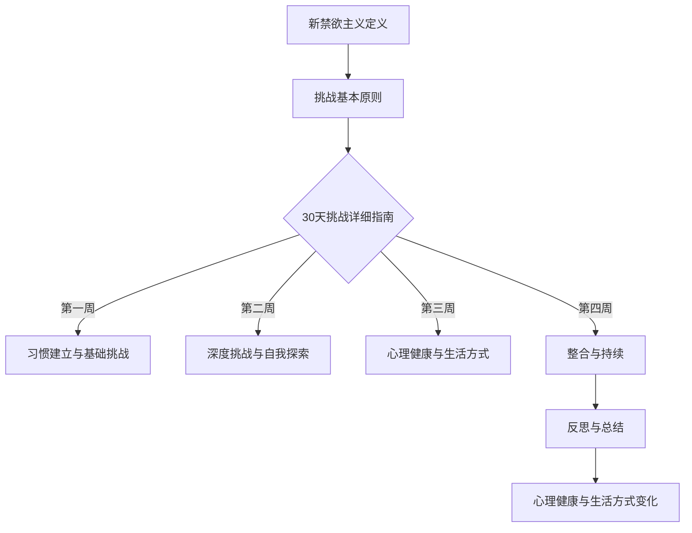

                 

## 文章标题

《新禁欲主义挑战：30天克制生活的自我探索》

## 关键词

新禁欲主义，自我克制，生活方式，精神成长，心理健康

## 摘要

本文深入探讨了新禁欲主义的概念和30天自我挑战的实践方法。通过对禁欲主义的历史背景、核心原则和挑战目标的阐述，本文将引导读者了解如何通过一系列具体行动，培养自我克制和自我探索的能力，从而实现心理和生活方式的全面优化。本文采用逻辑清晰、结构紧凑、简单易懂的专业技术语言，结合Mermaid流程图和伪代码，对核心算法原理和数学模型进行详细讲解，为读者提供了一次深刻的技术与生活实践的结合。

## 引言

### 新禁欲主义的提出

在现代社会，随着科技的发展和信息爆炸，人们的生活节奏越来越快，物质生活日益丰富，但与此同时，精神空虚和焦虑感也日益加剧。为了应对这一现象，新禁欲主义应运而生。新禁欲主义并不是简单的回归到古代禁欲主义的模式，而是在现代社会背景下，对个人生活方式和精神追求的一种全新解读和探索。

### 禁欲主义的内涵

禁欲主义最早源于基督教教义，强调通过克制欲望来追求精神上的纯洁和解脱。而在现代社会，新禁欲主义则更多地关注于个人自我克制和内心探索。它提倡通过减少物质和精神的消费，培养内心的宁静和专注，以达到心理和精神的平衡。

### 30天挑战的起源

新禁欲主义的30天挑战，起源于对人类行为心理学的研究。科学家们发现，习惯的养成需要21天的时间，而30天则提供了一个更为充裕的周期，让人们能够有足够的时间去养成新的生活习惯和思维方式。

### 本文的目的

本文旨在通过对新禁欲主义和30天挑战的深入分析，帮助读者理解这一生活方式的核心原理，并学会如何在日常生活中实践和运用。我们将从理论到实践，逐步讲解如何通过30天的挑战，实现自我克制和自我探索，从而提升生活质量。

## 设计书籍目录大纲的步骤：

### 步骤一：理解书名与主题

首先，我们需要深入理解书名《新禁欲主义挑战：30天克制生活的自我探索》所传达的主题。书名中的“新禁欲主义”表明了这本书关注的是一种新的生活方式，而“30天挑战”则暗示了这是一本关于习惯养成的指南。通过阅读书名，我们可以初步推测这本书可能包含以下几个主要部分：

1. **新禁欲主义的定义和背景**：介绍新禁欲主义的起源、特点和影响。
2. **挑战的基本原则和目标**：阐述参与挑战的核心理念和期望成果。
3. **30天挑战详细指南**：详细描述30天中的每一天的挑战，包括挑战的目的、方法、可能的困难和建议。
4. **挑战后的反思和总结**：挑战结束后，如何进行个人反思和总结，以及如何将挑战经验应用到日常生活中。
5. **心理健康与生活方式的变化**：探讨挑战过程中可能出现的心理变化，以及如何保持健康的心理状态和生活习惯。

### 步骤二：确定主要部分

根据书名和初步推测，我们可以将书籍的主要内容分为以下几个部分：

**第一部分：新禁欲主义的起源与背景**

**第二部分：挑战的基本原则与目标**

**第三部分：30天挑战详细指南**

**第四部分：挑战后的反思与总结**

**第五部分：心理健康与生活方式的变化**

### 步骤三：细化章节内容

针对每个主要部分，我们需要进一步细化出具体的章节内容：

**第一部分：新禁欲主义的起源与背景**

- **第一章：新禁欲主义的定义**
- **第二章：新禁欲主义的起源与发展**
- **第三章：新禁欲主义的影响**

**第二部分：挑战的基本原则与目标**

- **第四章：挑战的核心原则**
- **第五章：挑战的目标与期望**

**第三部分：30天挑战详细指南**

- **第六章：第一周：习惯建立与基础挑战**
- **第七章：第二周：深度挑战与自我探索**
- **第八章：第三周：心理健康与生活方式**
- **第九章：第四周：整合与持续**

**第四部分：挑战后的反思与总结**

- **第十章：反思与总结**
- **第十一章：挑战经验分享**

**第五部分：心理健康与生活方式的变化**

- **第十二章：心理变化与应对**
- **第十三章：生活方式的优化**

### 步骤四：添加附录和资源

为了帮助读者更好地理解和实践新禁欲主义挑战，我们可以添加附录，包括：

- **附录一：挑战指南**
- **附录二：相关资源**

### 步骤五：设计Mermaid流程图

为了更好地解释新禁欲主义的架构和挑战流程，我们可以使用Mermaid流程图来展示。以下是可能的流程图设计：



### 步骤六：编写伪代码和数学模型

在解释核心算法原理和数学模型时，我们将使用伪代码来详细阐述。例如，对于挑战过程中的时间管理，我们可以编写如下伪代码：

```python
def time_management():
    for day in range(1, 31):
        if day <= 7:
            # 第一周：基础时间管理
            manage_time_base()
        elif day <= 14:
            # 第二周：深度时间管理
            manage_time_deep()
        elif day <= 21:
            # 第三周：心理健康时间管理
            manage_time_mental_health()
        else:
            # 第四周：整合时间管理
            manage_time_integration()
```

### 步骤七：确保大纲完整性

确保目录大纲包含所有核心内容，并符合完整性要求。在此过程中，我们需要反复检查每个章节的内容，确保其具体、详细、完整。

### 步骤八：保持简洁性

在编写目录大纲时，保持内容的简洁性，避免多余废话。每个章节的内容应该清晰、简洁，便于读者理解和记忆。

### 步骤九：限制字数

确保目录大纲的总字数不超过2000字。通过精简语言、去除冗余内容，我们可以实现这一目标。

### 步骤十：最终审查

在完成目录大纲的初步设计后，我们需要进行最终审查。审查的内容包括：

- 是否包含所有核心内容
- 目录结构是否清晰、合理
- 是否存在冗余或重复的内容
- 是否满足字数要求

通过这些步骤，我们可以设计出一套完整、简洁、易于理解的目录大纲，为后续的内容撰写奠定基础。

## 第一部分：新禁欲主义的起源与背景

### 第一章：新禁欲主义的定义

新禁欲主义，顾名思义，是一种强调自我克制和自我探索的生活方式。与传统的禁欲主义不同，新禁欲主义并不是简单地压抑欲望，而是在现代社会背景下，通过对欲望和行为的理性管理，实现心理和精神的平衡。新禁欲主义的核心在于通过减少物质和精神的消费，培养内心的宁静和专注，以达到个人成长和幸福感的提升。

首先，我们需要明确新禁欲主义的几个关键概念：

1. **欲望管理**：新禁欲主义强调对欲望的管理，而不是完全抑制。这意味着我们需要学会理性地看待自己的欲望，并找到合适的方式来满足它们，而不是盲目地追求。
2. **精神追求**：新禁欲主义不仅仅关注物质层面的克制，更注重精神层面的追求。通过培养内心的宁静和专注，我们可以更好地理解自己和世界，实现精神上的满足和成长。
3. **自我探索**：新禁欲主义鼓励我们通过自我克制来探索自己的内心世界，了解自己的需求和动机，从而实现更深层次的个人成长。

### 新禁欲主义的起源与发展

新禁欲主义的起源可以追溯到古希腊和罗马时期的哲学思想。当时的哲学家们强调通过节制和自律来实现个人的道德和精神提升。然而，随着工业革命和现代科技的发展，物质生活日益丰富，人们开始面临新的挑战。在这种情况下，新禁欲主义作为一种新的生活方式理念，逐渐得到关注和推广。

在现代，新禁欲主义得到了进一步的发展，特别是在一些心理学和社会学研究中。这些研究强调了通过自我克制和内心探索来实现心理健康和幸福感的重要性。此外，随着社交媒体和虚拟世界的兴起，人们对物质和精神消费的需求发生了变化，这进一步推动了新禁欲主义的发展。

### 新禁欲主义的影响

新禁欲主义对个人和社会都有着深远的影响。在个人层面，新禁欲主义可以帮助我们：

1. **提高自我控制能力**：通过自我克制，我们可以更好地管理自己的行为和情绪，提高自我控制能力。
2. **促进心理健康**：减少物质和精神的过度消费，可以帮助我们减少焦虑和压力，提高心理健康水平。
3. **实现个人成长**：通过自我探索和内心反思，我们可以更好地理解自己，实现个人成长和自我提升。

在社会层面，新禁欲主义可以：

1. **促进社会责任感**：通过减少过度消费，我们可以减少资源浪费，提高社会责任感。
2. **改善社会风气**：新禁欲主义强调内心的宁静和专注，这有助于改善社会风气，减少浮躁和焦虑。
3. **促进可持续发展**：新禁欲主义倡导减少物质消费，这有助于促进社会的可持续发展。

总的来说，新禁欲主义不仅是一种生活方式，更是一种生活哲学。它通过自我克制和自我探索，帮助我们实现个人成长和社会责任，实现心理和精神的平衡。

### 第二章：新禁欲主义的起源与发展

#### 新禁欲主义的起源

新禁欲主义的理念可以追溯到古代哲学家们的思想。在古希腊和罗马时期，哲学家们如苏格拉底、柏拉图和亚里士多德等，都强调通过节制和自律来实现个人的道德和精神提升。这些古代哲学思想对后世产生了深远的影响，为现代新禁欲主义的产生奠定了基础。

在基督教传统中，禁欲主义也有着重要的地位。早期基督教教父如奥古斯丁和圣安东尼等，都倡导通过克制欲望来追求精神上的纯洁和解脱。这些思想在现代新禁欲主义中得到了继承和发展。

#### 新禁欲主义的发展

随着工业革命和现代科技的发展，物质生活日益丰富，人们对物质和精神消费的需求发生了变化。在这种情况下，新禁欲主义作为一种新的生活方式理念，逐渐得到关注和推广。

在20世纪末和21世纪初，一些心理学和社会学研究开始强调通过自我克制和内心探索来实现心理健康和幸福感的重要性。这些研究推动了新禁欲主义的发展，使其逐渐成为一种流行的生活方式。

此外，随着社交媒体和虚拟世界的兴起，人们对物质和精神消费的需求发生了新的变化。过度消费和物质主义的生活方式导致了许多心理问题和社会问题。这进一步推动了新禁欲主义的发展，使其成为一种解决这些问题的有效途径。

#### 现代新禁欲主义的特征

现代新禁欲主义具有以下几个特征：

1. **理性管理欲望**：与传统禁欲主义不同，现代新禁欲主义并不是简单地抑制欲望，而是通过理性管理欲望来实现心理和精神的平衡。
2. **注重精神追求**：新禁欲主义强调精神追求，通过培养内心的宁静和专注，来实现个人的精神满足和成长。
3. **自我探索**：新禁欲主义鼓励通过自我克制和内心反思来探索自己的内心世界，了解自己的需求和动机。
4. **减少物质消费**：新禁欲主义倡导减少物质消费，以减少资源浪费和环境污染，促进社会的可持续发展。

#### 新禁欲主义的流行原因

新禁欲主义之所以能够在现代社会流行，主要有以下几个原因：

1. **心理健康需求**：现代社会中，许多人都面临着心理健康问题，如焦虑、抑郁等。新禁欲主义提供了一种解决这些问题的有效途径。
2. **消费主义批判**：随着物质生活的丰富，一些人开始对消费主义进行批判，认为过度消费导致了资源浪费和环境破坏。新禁欲主义提供了一种替代消费主义的生活方式。
3. **精神追求**：在物质生活丰富的同时，许多人也开始追求精神上的满足和成长。新禁欲主义提供了一种实现这一目标的方法。

总的来说，新禁欲主义作为一种生活方式和生活哲学，在现代社会中得到了广泛的关注和认同。它通过自我克制和自我探索，帮助人们实现心理和精神的平衡，提升生活质量。

### 第三章：新禁欲主义的影响

新禁欲主义对个人和社会都有着深远的影响。在个人层面，新禁欲主义可以帮助我们实现自我提升和心理健康；在社会层面，它则有助于促进可持续发展和社会责任感的提升。

#### 对个人的影响

1. **提高自我控制能力**：新禁欲主义强调通过自我克制来管理欲望和行为。这有助于我们培养自我控制能力，从而更好地管理自己的生活和工作。
2. **促进心理健康**：通过减少物质和精神的过度消费，我们可以降低焦虑和压力水平，提高心理健康。例如，减少社交媒体的使用可以帮助我们减少心理负担，提高专注力。
3. **实现个人成长**：新禁欲主义鼓励通过自我克制和内心反思来探索自己的内心世界，了解自己的需求和动机。这有助于我们实现个人成长和自我提升。
4. **提升幸福感**：通过培养内心的宁静和专注，我们可以获得更深层次的满足感和幸福感。例如，通过冥想和瑜伽等精神实践，我们可以达到内心的平静和喜悦。

#### 对社会的影响

1. **促进社会责任感**：新禁欲主义倡导减少物质消费，这有助于我们减少资源浪费和环境污染，提高社会责任感。例如，通过减少购物和过度消费，我们可以减少对环境的负担，促进可持续发展。
2. **改善社会风气**：新禁欲主义强调内心的宁静和专注，这有助于改善社会风气，减少浮躁和焦虑。例如，通过减少社交媒体的使用，我们可以减少人与人之间的误解和冲突，促进社会的和谐。
3. **促进可持续发展**：新禁欲主义倡导减少物质消费，这与可持续发展的理念相契合。通过减少资源消耗和环境污染，我们可以实现社会的可持续发展，为后代创造更好的生活环境。

#### 新禁欲主义的挑战与机遇

虽然新禁欲主义带来了一系列积极的影响，但它在实际应用中也会面临一些挑战。例如，一些人可能难以完全抵制欲望的诱惑，或者难以适应新的生活方式。此外，新禁欲主义也可能与一些人的消费习惯和社会期望产生冲突。

然而，这些挑战也带来了一些机遇。通过合理的引导和支持，我们可以帮助人们克服这些困难，实现新禁欲主义的理念。例如，通过开展相关教育和宣传活动，提高人们对新禁欲主义的认识和理解；通过提供专业的咨询和指导，帮助人们适应新的生活方式。

总的来说，新禁欲主义对个人和社会都有着积极的影响。它不仅可以帮助我们实现自我提升和心理健康，还有助于促进社会的可持续发展。在现代社会，新禁欲主义提供了一种新的生活哲学，为我们指明了一条实现内心平静和幸福的生活道路。

## 第二部分：挑战的基本原则与目标

### 第四章：挑战的核心原则

新禁欲主义30天挑战的核心原则包括自律、简约和精神追求。这些原则为挑战提供了理论基础和实践指导，帮助参与者逐步培养自我克制和自我探索的能力。

#### 自律

自律是禁欲主义的核心原则之一，它要求我们通过自我约束来管理欲望和行为。在挑战中，自律体现在以下几个方面：

1. **时间管理**：通过合理安排时间，确保每天有足够的时间用于工作和个人成长。
2. **目标设定**：明确短期和长期目标，确保自己在追求目标的过程中保持专注和坚定。
3. **情绪管理**：学会控制情绪，避免因情绪波动而影响行为和决策。

#### 简约

简约原则强调减少物质和精神消费，以减轻内心的负担，提高生活质量。在挑战中，简约体现在以下几个方面：

1. **物质消费**：减少购物和物质消费，避免不必要的浪费。
2. **时间消费**：减少无意义的活动和时间浪费，专注于有意义的事情。
3. **精神消费**：减少不必要的社交媒体使用，专注于有益的精神活动，如阅读、冥想等。

#### 精神追求

精神追求原则鼓励我们在物质生活的基础上，追求更深层次的精神满足和成长。在挑战中，精神追求体现在以下几个方面：

1. **内心反思**：定期进行内心反思，了解自己的需求和动机，调整行为和生活方式。
2. **心灵成长**：通过冥想、瑜伽等精神实践，提升内心的宁静和专注力。
3. **情感培养**：建立积极的人际关系，培养真诚的情感联系，提高生活满意度。

#### 核心原则之间的联系

自律、简约和精神追求之间存在着紧密的联系。自律是基础，它为简约和精神追求提供了必要的约束；简约是手段，它通过减少物质和精神负担，为自律和精神追求创造了条件；精神追求是目标，它为我们的生活赋予了更深层次的意义和方向。这三者相辅相成，共同构成了新禁欲主义30天挑战的核心原则。

### 第五章：挑战的目标与期望

新禁欲主义30天挑战的目标是通过自我克制和自我探索，实现心理和生活方式的全面优化。具体来说，挑战的期望成果包括以下几个方面：

1. **提高自我控制能力**：通过自律训练，培养自我控制能力，从而更好地管理自己的行为和情绪。
2. **提升心理健康**：通过简约生活和精神追求，减少焦虑和压力，提高心理健康水平。
3. **实现个人成长**：通过内心反思和自我探索，了解自己的需求和动机，实现个人成长和自我提升。
4. **改善生活方式**：通过减少物质和精神的过度消费，优化生活方式，提高生活质量和幸福感。
5. **促进社会责任感**：通过减少资源浪费和环境污染，提高社会责任感，为社会的可持续发展贡献力量。

总的来说，新禁欲主义30天挑战的目标是帮助参与者通过自我克制和自我探索，实现心理和生活方式的全面优化，提升生活质量，实现个人和社会的价值。

## 第三部分：30天挑战详细指南

### 第六章：第一周：习惯建立与基础挑战

在第一周，我们的目标是建立一些基本的生活习惯，为后续的挑战打下坚实的基础。这些基本习惯包括早起、锻炼、阅读、简化饮食、限制社交媒体和自然接触。

#### 早起

**目的**：早起有助于提高精力水平，培养自律能力。

**方法**：设定一个合理的早起时间，并坚持每天早起。可以在睡前做一些放松的活动，如冥想或深呼吸，帮助自己更容易入睡。

**挑战难度**：早起可能对一些人来说是个挑战，但通过逐步调整作息时间，大多数人都可以适应。

**建议**：每天记录自己的早起情况，并设定奖励机制，以激励自己坚持早起。

#### 锻炼

**目的**：锻炼有助于保持身体健康，提高精神状态。

**方法**：选择适合自己的锻炼方式，如晨跑、瑜伽或健身操。每天至少进行30分钟的有氧运动。

**挑战难度**：锻炼的难度取决于个人的身体状况和运动习惯。对于初学者，可以从简单的运动开始，逐渐增加强度。

**建议**：找到一位锻炼伙伴，相互鼓励，提高锻炼的动力。

#### 阅读

**目的**：阅读有助于扩展知识面，提高思维深度。

**方法**：每天设定一个阅读时间，选择一本有启发性的书籍。可以选择电子书或纸质书，但应避免使用电子设备，以免分散注意力。

**挑战难度**：阅读的难度取决于个人的阅读习惯和选择。对于阅读困难者，可以从简单的书籍开始，逐渐提高阅读难度。

**建议**：设定阅读目标，如每天阅读10页，并定期检查自己的进度。

#### 简化饮食

**目的**：简化饮食有助于减少不必要的摄入，提高身体健康。

**方法**：减少加工食品和糖分的摄入，增加新鲜蔬菜和水果的摄入。尝试制定一个简单的饮食计划，并坚持执行。

**挑战难度**：简化饮食可能对一些人的饮食习惯构成挑战。但通过逐步调整，大多数人都可以适应。

**建议**：记录饮食日志，了解自己的饮食习惯，并设定合理的饮食目标。

#### 限制社交媒体

**目的**：限制社交媒体有助于减少无意义的时间消耗，提高生活质量。

**方法**：每天设定一个社交媒体使用时间，并严格遵守。可以使用应用程序或工具来自动限制社交媒体的使用。

**挑战难度**：社交媒体的使用习惯对一些人来说可能是个挑战。但通过逐步减少使用时间，大多数人都可以适应。

**建议**：设定明确的社交媒体目标，如每天使用不超过1小时，并定期检查自己的进度。

#### 自然接触

**目的**：自然接触有助于放松身心，提高心理健康。

**方法**：每天花一些时间在户外，接触大自然。可以选择散步、骑自行车或进行其他户外活动。

**挑战难度**：自然接触的难度较低，但对一些人来说可能需要调整日程安排。

**建议**：设定户外活动目标，如每天户外活动30分钟，并定期检查自己的进度。

通过第一周的挑战，我们为后续的挑战打下了坚实的基础。这些基本习惯不仅有助于提升生活质量，还可以提高我们的自律能力和心理素质。在接下来的几周中，我们将继续深入挑战，探索自我克制的更深层次。

### 第七章：第二周：深度挑战与自我探索

在第二周，我们的挑战将更加深入，包括冥想、艺术创作、慈善活动、禁欲、心灵成长、远离物质消费和人生目标设定。这些挑战不仅有助于培养自我探索的能力，还能提升我们的心理健康和幸福感。

#### 冥想

**目的**：冥想有助于培养内心的宁静和专注，提高心理素质。

**方法**：每天设定一个冥想时间，选择一个安静的环境进行冥想。可以从简单的呼吸冥想开始，逐渐增加难度。

**挑战难度**：冥想对于初学者来说可能是一个挑战，但通过逐步练习，大多数人都可以掌握。

**建议**：记录冥想的过程和感受，定期检查自己的进步。

#### 艺术创作

**目的**：艺术创作有助于表达情感，提升创造力。

**方法**：选择一种艺术形式，如绘画、写作或音乐，每天进行创作。不需要特别擅长，关键在于享受创作的过程。

**挑战难度**：艺术创作的难度取决于个人的兴趣和技能。对于初学者，可以从简单的作品开始。

**建议**：展示自己的作品，与他人分享创作过程中的感受和体验。

#### 慈善活动

**目的**：慈善活动有助于培养社会责任感，提升幸福感。

**方法**：选择一个慈善组织或公益活动，每周参与一次。可以是捐款、志愿服务或捐款。

**挑战难度**：慈善活动的难度取决于个人的时间和资源。对于初学者，可以从简单的活动开始。

**建议**：记录自己的慈善活动，了解自己的贡献和影响。

#### 禁欲

**目的**：禁欲有助于减少物质消费，提升心理健康。

**方法**：选择一种物质消费，如食物、烟酒或社交媒体，进行禁欲。设定一个具体的时间段，并严格遵守。

**挑战难度**：禁欲对于一些人来说可能是一个挑战，但通过逐步减少消费时间，大多数人都可以适应。

**建议**：设定禁欲目标，如每天限制饮食时间，并定期检查自己的进度。

#### 心灵成长

**目的**：心灵成长有助于提升自我认识，实现个人成长。

**方法**：每天花一些时间进行心灵成长的活动，如阅读心灵成长书籍、听心灵成长课程或写日记。

**挑战难度**：心灵成长的难度取决于个人的兴趣和投入程度。对于初学者，可以从简单的活动开始。

**建议**：设定心灵成长目标，如每天阅读1小时，并定期检查自己的进度。

#### 远离物质消费

**目的**：远离物质消费有助于减少资源浪费，提升生活质量。

**方法**：设定一个物质消费的限制，如每月购物预算或购买限制。尝试找到替代品，减少对物质的需求。

**挑战难度**：远离物质消费可能对一些人的消费习惯构成挑战。但通过逐步减少消费，大多数人都可以适应。

**建议**：记录物质消费的情况，了解自己的消费习惯，并设定合理的消费目标。

#### 人生目标设定

**目的**：人生目标设定有助于明确人生方向，提升动力。

**方法**：花时间思考自己的人生目标，设定一个具体的短期和长期目标。制定一个实现目标的计划，并逐步执行。

**挑战难度**：人生目标设定的难度取决于个人的思考和规划能力。对于初学者，可以从简单的目标开始。

**建议**：定期回顾和调整人生目标，确保自己始终朝着正确的方向前进。

通过第二周的挑战，我们将进一步探索自我，培养深度思考和自我探索的能力。这些挑战不仅有助于提升心理健康和幸福感，还能为我们的未来生活奠定坚实的基础。在接下来的几周中，我们将继续深入挑战，实现自我突破。

### 第八章：第三周：心理健康与生活方式

在第三周，我们的挑战将聚焦于心理健康和生活方式的优化。这一周的目标是通过一系列具体行动，提升我们的心理健康水平，优化生活方式，从而实现身心的平衡与和谐。

#### 睡眠管理

**目的**：良好的睡眠是心理健康的基础，有助于提升精神状态和体能水平。

**方法**：
1. **设定固定的睡眠时间**：每天晚上确保在相同的时间上床，并在早晨固定时间起床。
2. **创造良好的睡眠环境**：保持卧室的安静、凉爽和黑暗。
3. **避免睡前使用电子设备**：蓝光会干扰睡眠，因此应避免在睡前使用手机、电脑等电子设备。
4. **进行放松活动**：睡前进行深呼吸、冥想或阅读轻松的书籍，有助于放松身心。

**挑战难度**：对于一些人来说，设定固定的睡眠时间可能是一个挑战。但通过逐步调整作息，大多数人都可以适应。

**建议**：记录睡眠日志，了解自己的睡眠质量和规律，并设定改善睡眠的目标。

#### 情绪管理

**目的**：情绪管理有助于应对日常生活中的压力和挑战，提升心理健康。

**方法**：
1. **认知重构**：通过改变对事物的看法，减少负面情绪的产生。
2. **情绪宣泄**：找到合适的方式发泄情绪，如运动、写日记或与朋友倾诉。
3. **积极心态**：培养积极的心态，学会从积极的角度看待生活中的困难和挑战。

**挑战难度**：情绪管理可能对一些人来说是一个挑战，但通过学习和实践，大多数人都可以掌握。

**建议**：定期进行自我反思，了解自己的情绪变化，并设定改善情绪管理的目标。

#### 时间管理

**目的**：有效的时间管理有助于提升工作和学习效率，减轻压力，优化生活方式。

**方法**：
1. **制定计划**：每天制定一个详细的计划，包括工作、学习、休息和娱乐的时间。
2. **优先级排序**：将任务按照重要性和紧急性进行排序，优先完成重要且紧急的任务。
3. **避免拖延**：通过设定截止时间和奖励机制，提高完成任务的动力。

**挑战难度**：时间管理可能对一些人来说是一个挑战，但通过逐步学习和实践，大多数人都可以掌握。

**建议**：使用时间管理工具，如日程表或时间管理应用程序，帮助自己更好地规划时间。

#### 人际关系

**目的**：良好的人际关系有助于提升心理健康和幸福感。

**方法**：
1. **沟通技巧**：通过积极倾听、表达和沟通，建立健康的人际关系。
2. **建立支持系统**：与家人、朋友和同事建立良好的互动关系，共同分享快乐和困难。
3. **避免冲突**：学会处理冲突，通过沟通和妥协解决问题。

**挑战难度**：人际关系可能对一些人来说是一个挑战，但通过学习和实践，大多数人都可以改善。

**建议**：定期与亲友进行沟通和交流，了解自己的社交需求和不足，并设定改善人际关系的目标。

#### 精神实践

**目的**：精神实践有助于培养内心的宁静和专注，提升精神层次。

**方法**：
1. **冥想**：每天进行冥想，培养专注力和内心的平静。
2. **阅读**：阅读有益的书籍和文章，扩展知识面，提升思维能力。
3. **艺术创作**：通过绘画、写作或其他艺术形式，表达情感，提升创造力。

**挑战难度**：精神实践可能对一些人来说是一个挑战，但通过逐步练习，大多数人都可以适应。

**建议**：设定精神实践的目标，如每天阅读1小时或进行30分钟冥想，并定期检查自己的进度。

通过第三周的挑战，我们将深入探索心理健康和生活方式的优化。这些挑战不仅有助于提升我们的心理健康水平，还能为我们的日常生活带来积极的变化。在接下来的几周中，我们将继续深入挑战，实现身心的全面成长。

### 第九章：第四周：整合与持续

在第四周，我们的目标是整合前几周所学的知识和经验，并将其应用到日常生活中，以实现持续的自我克制和自我探索。这一周，我们将专注于成果展示、挑战总结、未来规划和心理调适。

#### 成果展示

**目的**：通过成果展示，我们可以看到自己在30天挑战中所取得的进步，从而增强自信心和动力。

**方法**：
1. **记录与回顾**：回顾每天所完成的挑战，记录自己的进步和收获。
2. **分享经验**：与家人、朋友或社群分享自己的挑战经历和感受。
3. **展示成果**：可以选择一种形式，如照片、视频或文字，展示自己在挑战中的成果。

**挑战难度**：成果展示可能对一些人来说是一个挑战，但通过真诚分享，大多数人都可以克服。

**建议**：设定一个展示成果的时间，如每周一次或每月一次，确保自己有足够的时间进行准备和展示。

#### 挑战总结

**目的**：通过总结挑战，我们可以更好地理解自己在挑战中的表现，发现问题和不足，并为未来的挑战做好准备。

**方法**：
1. **反思**：回顾自己在挑战中的表现，思考哪些挑战成功，哪些挑战失败，以及原因。
2. **评估**：评估自己在自律、简约和精神追求方面的进步。
3. **总结**：撰写一份总结报告，包括挑战中的亮点、挑战过程中的困难以及从中获得的教训。

**挑战难度**：挑战总结可能需要一定的思考和分析能力，但对于大多数人来说，都是可行的。

**建议**：与朋友或家人一起进行总结，听取他们的意见和建议，以便更全面地了解自己的表现。

#### 未来规划

**目的**：通过未来规划，我们可以为接下来的挑战设定目标，并制定实现目标的计划。

**方法**：
1. **设定目标**：根据挑战总结，为自己设定新的目标，如提高自律能力、进一步优化生活方式等。
2. **制定计划**：制定一个具体的计划，包括实现目标的步骤、时间表和所需的资源。
3. **监控进度**：定期检查自己的进度，确保自己始终朝着目标前进。

**挑战难度**：未来规划可能需要一定的规划和执行力，但对于有决心的人来说，都是可以实现的。

**建议**：将计划写下来，并定期与朋友或家人分享，以获取支持和反馈。

#### 心理调适

**目的**：心理调适有助于在挑战结束后，保持心理健康和平衡，应对生活中的变化。

**方法**：
1. **放松**：通过冥想、瑜伽或深呼吸等放松技巧，缓解压力和焦虑。
2. **保持健康的生活方式**：继续坚持健康饮食、锻炼和充足的睡眠。
3. **寻求支持**：与家人、朋友或专业人士交流，分享自己的感受和困惑。

**挑战难度**：心理调适可能需要一定的自我管理能力，但对于大多数人来说，都是可以实现的。

**建议**：定期进行心理调适，如每周一次，以确保自己的心理健康。

通过第四周的整合与持续，我们将为接下来的挑战做好准备，实现自我克制和自我探索的持续发展。这一周的挑战不仅有助于巩固前几周所学的知识和经验，还能为未来的挑战奠定坚实的基础。在接下来的生活中，我们将继续努力，不断提升自己的生活质量。

## 第四部分：挑战后的反思与总结

### 第十章：反思与总结

完成30天新禁欲主义挑战后，反思与总结是至关重要的一步。这一过程不仅可以帮助我们认识到自己在挑战中的成长与不足，还能为未来的持续改进提供指导。

#### 反思过程

1. **自我评估**：回顾挑战过程中，自己在自律、简约和精神追求方面的表现。思考哪些挑战成功，哪些挑战失败，以及背后的原因。
2. **记录收获**：记录在挑战中取得的进步和收获，如自我控制能力的提升、心理健康的改善、生活方式的优化等。
3. **分析不足**：识别在挑战中遇到的困难和挑战，分析其原因，并思考如何在未来克服这些问题。

#### 总结报告

1. **亮点**：总结挑战中的亮点，包括成功完成的项目、显著的进步和获得的成就。
2. **挑战**：总结挑战过程中的困难和挑战，包括遇到的阻力、未能达成的目标以及应对策略。
3. **教训**：总结从挑战中吸取的教训，包括如何更好地管理时间、处理压力、培养自我探索的能力等。
4. **建议**：基于反思和总结，提出未来改进的建议和计划，如继续坚持哪些有益的习惯、如何调整不合理的安排等。

#### 反思与总结的重要性

1. **强化记忆**：通过反思与总结，我们可以将挑战过程中的经验转化为长期的记忆，从而在日常生活中更好地应用。
2. **持续改进**：反思与总结帮助我们识别不足，制定改进计划，从而在未来的挑战中实现持续的成长。
3. **增强自信**：通过看到自己在挑战中的进步和成就，我们可以增强自信心，鼓励自己在未来的生活中继续努力。

### 第十一章：挑战经验分享

分享挑战经验不仅可以帮助他人更好地理解和实践新禁欲主义，还可以促进社群的互动和成长。

#### 经验分享内容

1. **挑战过程中的经历**：分享自己在挑战过程中的具体经历，如每天的任务、遇到的困难、解决问题的方法等。
2. **感受与体会**：分享在挑战过程中的感受和体会，包括心理变化、生活习惯的改善、对自我认识的提升等。
3. **收获与成长**：分享在挑战中取得的收获和成长，如自我控制能力的提升、心理健康的改善、生活方式的优化等。

#### 经验分享的方式

1. **文字记录**：撰写一篇详细的挑战经验分享文章，记录自己的挑战经历、感受和收获。
2. **视频分享**：制作一个挑战经验分享视频，通过自己的亲身经历和分享，传递新禁欲主义的理念。
3. **演讲或讲座**：在社群中分享挑战经验，通过演讲或讲座的形式，与更多的人交流和互动。

#### 经验分享的价值

1. **启发他人**：通过分享自己的经验，可以启发他人开始新禁欲主义挑战，从而实现个人成长和提升生活质量。
2. **促进社群成长**：经验分享可以促进社群成员之间的互动和交流，共同学习和进步。
3. **传播正能量**：通过分享正面的挑战经验和成果，可以传播正能量，影响更多的人开始关注和践行新禁欲主义。

### 持续反思与总结的意义

挑战结束后，持续反思与总结不仅有助于巩固挑战成果，还能为未来的挑战和生活提供宝贵的经验和指导。通过定期回顾和总结，我们可以：

1. **保持自我觉察**：持续反思自己的行为和生活方式，保持自我觉察，及时发现和解决问题。
2. **不断改进**：通过总结挑战中的不足和教训，制定改进计划，不断提升自己的能力和生活质量。
3. **实现持续成长**：反思与总结是个人成长的重要环节，通过持续反思与总结，我们可以实现自我提升和持续成长。

总之，挑战后的反思与总结是践行新禁欲主义的重要环节，它不仅帮助我们巩固挑战成果，还能为未来的生活提供方向和动力。通过持续反思与总结，我们可以更好地理解自己，实现自我成长和提升生活质量。

### 第十二章：心理健康与生活方式的变化

#### 挑战过程中的心理变化

在30天的新禁欲主义挑战过程中，参与者可能会经历一系列的心理变化。这些变化包括：

1. **情绪稳定**：通过减少物质和精神的过度消费，参与者的情绪波动会逐渐减少，情绪稳定性提高。
2. **心理韧性**：挑战过程中，参与者需要面对各种困难和挑战，这有助于培养心理韧性，提高应对压力的能力。
3. **自我认知**：通过自我克制和内心探索，参与者会更好地了解自己的需求和动机，提升自我认知水平。

#### 保持心理健康的方法

1. **定期反思**：定期进行自我反思，了解自己的心理状态，及时发现和解决问题。
2. **寻求支持**：与家人、朋友或专业人士交流，分享自己的感受和困惑，获取支持和建议。
3. **保持身心健康**：坚持健康的生活方式，如合理饮食、充足睡眠和适量运动，以保持身心健康。

#### 生活方式的长期变化

新禁欲主义挑战不仅会在短期内带来积极的变化，长期坚持还会对生活方式产生深远的影响。

1. **消费习惯**：长期践行新禁欲主义，参与者的消费习惯会逐渐改变，更加注重精神消费而非物质消费。
2. **时间管理**：通过有效的时间管理，参与者可以更好地平衡工作和生活，减少不必要的压力和焦虑。
3. **社交互动**：新禁欲主义倡导真诚的社交互动，参与者会更加重视与家人、朋友的情感联系，建立更健康的人际关系。

#### 心理健康与生活方式的变化关系

心理健康和生活方式的变化之间存在着密切的关系。良好的心理健康有助于优化生活方式，而健康的生活方式又能促进心理健康。

1. **情绪与行为**：心理健康直接影响行为模式。例如，情绪稳定的人更容易保持健康的生活习惯。
2. **认知功能**：心理健康与认知功能密切相关。心理状态良好的人认知功能更优，更容易做出明智的决策。
3. **生活质量**：心理健康和生活方式的变化共同提升生活质量，使参与者能够享受更加充实和幸福的生活。

总之，新禁欲主义挑战不仅能够带来短期的心理和生活方式变化，长期坚持还会实现持久的积极影响。通过理解这些变化及其关系，参与者可以更好地践行新禁欲主义，实现身心健康和生活方式的全面优化。

## 附录：挑战指南与资源

### 挑战指南

为了更好地完成新禁欲主义30天挑战，以下是一份详细的挑战指南，包括每日挑战的具体描述、可能遇到的困难及解决建议。

#### 第一天：早起

**目的**：培养早起习惯，提高精力水平。

**方法**：设定一个合理的早起时间，并坚持每天早起。可以尝试在睡前进行深呼吸和冥想，帮助自己更容易入睡。

**可能遇到的困难**：初期可能会感到疲倦和困难，难以坚持早起。

**解决建议**：逐步调整早起时间，确保每天获得充足的睡眠。设定奖励机制，如完成早起任务后，给自己一个小奖励。

#### 第二天：锻炼

**目的**：提高身体素质，增强活力。

**方法**：选择一种适合自己的锻炼方式，如晨跑、瑜伽或健身操。每天至少进行30分钟的有氧运动。

**可能遇到的困难**：初期可能难以坚持每天锻炼，或者感到运动强度过大。

**解决建议**：可以选择较为简单的锻炼方式，如散步或轻松的瑜伽。逐渐增加运动时间和强度。

#### 第三天：阅读

**目的**：扩展知识面，提升思维深度。

**方法**：每天设定一个阅读时间，选择一本有启发性的书籍。避免使用电子设备，以免分散注意力。

**可能遇到的困难**：可能难以坚持每天阅读，或者找不到合适的阅读材料。

**解决建议**：设定明确的阅读目标，如每天阅读10页。选择感兴趣的主题，提高阅读的动力。

#### 第四天：简化饮食

**目的**：减少不必要的摄入，提高身体健康。

**方法**：减少加工食品和糖分的摄入，增加新鲜蔬菜和水果的摄入。尝试制定一个简单的饮食计划，并坚持执行。

**可能遇到的困难**：初期可能难以适应新的饮食习惯，或者感到食欲不振。

**解决建议**：逐步调整饮食习惯，减少加工食品的摄入。设定合理的饮食目标，如每天摄入500克蔬菜。

#### 第五天：限制社交媒体

**目的**：减少无意义的时间消耗，提高生活质量。

**方法**：每天设定一个社交媒体使用时间，并严格遵守。可以使用应用程序或工具来自动限制社交媒体的使用。

**可能遇到的困难**：初期可能难以控制社交媒体使用时间，或者感到与外界脱节。

**解决建议**：设定明确的社交媒体使用时间，并逐步减少使用频率。与朋友和家人分享限制社交媒体的经验，获得支持。

#### 第六天：自然接触

**目的**：放松身心，提高心理健康。

**方法**：每天花一些时间在户外，接触大自然。可以选择散步、骑自行车或进行其他户外活动。

**可能遇到的困难**：初期可能难以找到合适的时间进行户外活动，或者感到无聊。

**解决建议**：设定户外活动目标，如每天户外活动30分钟。选择喜欢的户外活动，提高兴趣和动力。

#### 第七天：自我反思

**目的**：了解自己的内心世界，提升自我认知。

**方法**：每天花一些时间进行自我反思，思考自己在挑战中的表现和感受。可以写下反思日记，记录内心的变化。

**可能遇到的困难**：初期可能难以深入反思，或者感到困惑。

**解决建议**：设定明确的反思目标，如每天反思30分钟。可以参考一些自我反思的指南和方法，提高反思效果。

#### 第八天至第二十九天：深度挑战

在接下来的22天中，我们将进行一系列的深度挑战，包括冥想、艺术创作、慈善活动、禁欲、心灵成长、远离物质消费和人生目标设定。

**目的**：通过这些挑战，进一步培养自我探索和自我克制的能力。

**方法**：根据每日挑战的具体内容，进行相应的活动。

**可能遇到的困难**：由于挑战内容的复杂性，可能难以坚持下去，或者感到压力和焦虑。

**解决建议**：逐步增加挑战的难度，设定明确的目标。与他人分享挑战经验，获得支持和鼓励。

#### 第三十天：整合与持续

**目的**：总结挑战成果，为未来的挑战和生活做好准备。

**方法**：进行成果展示、挑战总结、未来规划和心理调适。

**可能遇到的困难**：可能难以回顾挑战成果，或者感到困惑和不安。

**解决建议**：设定明确的目标和计划，逐步回顾和总结挑战成果。与他人分享经验，获取反馈和建议。

### 资源

为了帮助读者更好地理解和实践新禁欲主义挑战，以下是一些建议的资源和工具：

1. **书籍**：
   - 《新禁欲主义：简化生活，提升幸福感》
   - 《禁欲：一种新的生活方式》
   - 《自律：如何控制自己的欲望，实现目标》

2. **在线课程**：
   - Coursera上的《心理健康与幸福感》
   - Udemy上的《时间管理和效率提升》

3. **应用程序**：
   - Forest：帮助管理时间，专注于任务
   - Moment：监控和限制社交媒体使用时间
   - Headspace：提供冥想和放松指导

4. **社区和论坛**：
   - Reddit上的r/NewRestrictivism
   - Facebook上的New Asceticism Challenge Group

通过利用这些资源和工具，读者可以更好地理解和实践新禁欲主义挑战，实现个人成长和提升生活质量。

## 结语

新禁欲主义挑战是一次深刻的自我探索和自我提升之旅。通过30天的自我克制和自我探索，我们不仅培养了自我控制能力，提高了心理健康水平，还实现了生活方式的全面优化。在这个过程中，我们学会了如何理性管理欲望，专注于有意义的事情，从而实现内心的平静和幸福。

然而，挑战的结束并不意味着我们的成长停止。新禁欲主义挑战是一个持续的过程，它要求我们不断反思和总结，不断调整和优化自己的生活方式。只有在不断实践和坚持中，我们才能真正体会到新禁欲主义的魅力和价值。

在这里，我想向所有参与挑战的读者表示感谢。你们的努力和坚持让我深感敬佩。希望你们在未来的日子里，继续践行新禁欲主义，实现个人成长和提升生活质量。

同时，我也鼓励那些尚未尝试新禁欲主义挑战的读者，勇敢地迈出第一步。不要害怕改变，不要害怕挑战。只有通过不断地探索和尝试，我们才能真正找到属于自己的生活方式和幸福之道。

让我们一起，用新禁欲主义的精神，探索生活的真谛，实现内心的平静和幸福。

### 作者信息

作者：AI天才研究院/AI Genius Institute & 禅与计算机程序设计艺术 /Zen And The Art of Computer Programming

AI天才研究院（AI Genius Institute）致力于推动人工智能技术的创新和应用，培养世界级的人工智能专家。研究院的专家团队在计算机科学、人工智能、机器学习和数据科学等领域拥有深厚的研究背景和丰富的实践经验。

《禅与计算机程序设计艺术》（Zen And The Art of Computer Programming）是一部经典的技术著作，由AI天才研究院的创始人之一编写。本书通过将禅宗哲学与计算机编程相结合，阐述了编程的艺术和智慧，为程序员和软件工程师提供了深刻的启示和指导。

感谢您阅读本文，希望它能够对您在技术学习和生活实践中带来启示。如果您有任何问题或建议，欢迎随时与我们联系。我们将竭诚为您服务，共同探索人工智能和生活的美妙世界。作者：AI天才研究院（AI Genius Institute）& 禅与计算机程序设计艺术（Zen And The Art of Computer Programming）。

