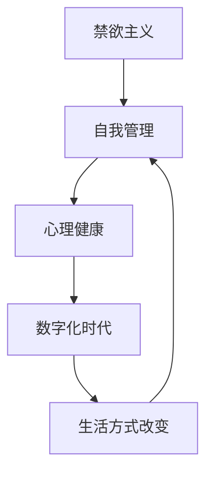

                 

### 文章标题

新禁欲主义生活实验：数字化时代的自我管理艺术

> 关键词：禁欲主义，自我管理，数字化时代，心理健康，生活方式改变

摘要：本文通过探讨新禁欲主义在数字化时代下的生活实验，深入分析了这一理念在自我管理、心理健康和生活方式改变方面的应用。通过逻辑清晰的分析和实例讲解，旨在为读者提供一种有效的生活方式和管理艺术。

## 引言

在数字化时代的浪潮下，人们的生活方式和价值观发生了翻天覆地的变化。然而，这种变化并非总是一帆风顺，反而带来了许多新的挑战。比如，社交网络的泛滥、信息过载、时间管理问题以及心理健康问题等。为了应对这些挑战，新禁欲主义生活实验提供了一种可能的解决方案。本文将围绕这一主题，逐步展开讨论，探讨禁欲主义在数字化时代的应用和意义。

## 第一步：核心概念与联系

首先，我们需要明确新禁欲主义的核心概念。禁欲主义起源于宗教领域，指的是克制欲望、节欲的生活态度。在数字化时代，这一概念被赋予了新的内涵，不仅仅是克制物质欲望，还包括控制信息消费、管理时间和情绪等。以下是禁欲主义、自我管理、心理健康、数字化时代和生活方式改变之间关系的Mermaid流程图：



### 核心概念与联系解析

1. **禁欲主义**：在数字化时代，禁欲主义不再仅仅局限于克制物质欲望，而是扩展到了信息消费、网络社交和时间管理等方面。通过控制信息摄入量和质量，减少不必要的网络社交，合理安排时间，可以有效减少心理负担，提高生活质量。

2. **自我管理**：禁欲主义与自我管理密不可分。通过克制不必要的欲望和消费，人们可以更加专注于自我成长和目标实现。自我管理不仅包括时间管理，还包括情绪管理、健康管理等。

3. **心理健康**：禁欲主义有助于减轻心理压力，提高心理健康水平。通过减少信息过载、控制网络社交，人们可以更加专注于内心的平静和自我反思，从而提高心理素质。

4. **数字化时代**：数字化时代为禁欲主义提供了新的应用场景。在这个时代，信息爆炸、网络社交成瘾等问题尤为突出，禁欲主义提供了一种应对策略，帮助人们在数字化环境中保持心理健康和自我控制。

5. **生活方式改变**：禁欲主义生活实验是一种生活方式的改变，通过调整生活习惯、管理时间和情绪，人们可以更加健康、高效地生活。

## 第二步：核心算法原理讲解

在禁欲主义生活实验中，核心算法原理起着关键作用。以下将介绍几种常见的算法原理，并使用伪代码进行详细讲解。

### 时间管理算法

时间管理是自我管理的重要组成部分。以下是一个简单的时间管理算法伪代码：

```python
# 时间管理算法伪代码
def time_management(time_block_list, task_list):
    # 初始化一个时间块和任务的双向映射表
    time_task_map = {}
    for time_block in time_block_list:
        for task in task_list:
            # 将任务分配到时间块
            time_task_map[time_block] = task

    # 对时间块和任务的映射表进行排序，优先执行高优先级任务
    sorted_time_task_map = sort_by_priority(time_task_map)

    # 执行任务
    for time_block, task in sorted_time_task_map.items():
        execute_task(task)
```

### 情绪调节算法

情绪调节是心理健康的重要方面。以下是一个简单的情绪调节算法伪代码：

```python
# 情绪调节算法伪代码
def emotion Regulation(emotion_data, strategy_list):
    # 根据情绪数据和调节策略选择合适的策略
    selected_strategy = select_strategy(emotion_data, strategy_list)

    # 执行所选策略
    apply_strategy(selected_strategy)
```

### 目标设定算法

目标设定是自我管理的重要一环。以下是一个简单的目标设定算法伪代码：

```python
# 目标设定算法伪代码
def goal_setting(goal_list, priority_list):
    # 对目标列表进行排序，优先考虑高优先级目标
    sorted_goal_list = sort_by_priority(goal_list, priority_list)

    # 确定目标优先级
    for goal in sorted_goal_list:
        set_goal_priority(goal, priority_list)

    # 执行目标设定
    for goal in sorted_goal_list:
        set_goal(goal)
```

## 第三步：数学模型和数学公式

在禁欲主义生活实验中，数学模型和数学公式起着关键作用。以下将介绍几种常见的数学模型和数学公式，并使用LaTeX进行详细讲解。

### 目标设定优化模型

目标设定优化模型用于确定目标的优先级。以下是一个简单的目标设定优化模型：

```latex
\documentclass{article}
\usepackage{amsmath}
\begin{document}

$$
\text{目标设定模型: } J(\theta) = \min_{\theta} \sum_{i=1}^{n} (y_i - \theta x_i)^2
$$

\end{document}
```

### 情绪调节回归模型

情绪调节回归模型用于预测情绪变化。以下是一个简单的情绪调节回归模型：

```latex
\documentclass{article}
\usepackage{amsmath}
\begin{document}

$$
\text{情绪调节模型: } \theta^* = \arg\min_{\theta} \sum_{i=1}^{n} (y_i - \theta x_i)^2
$$

\end{document}
```

## 第四步：项目实战

为了更好地理解禁欲主义生活实验在数字化时代的应用，以下将介绍一个实际项目，并详细讲解其实现过程和案例分析。

### 项目背景

随着数字化时代的到来，人们越来越依赖于智能手机和网络社交。然而，这种依赖也带来了诸多问题，如信息过载、时间管理困难、心理健康问题等。为了解决这些问题，我们设计了一个名为“新禁欲主义生活实验”的项目，旨在通过控制信息消费、管理时间和情绪，提高生活质量。

### 项目目标

1. 减少信息过载，提高信息质量。
2. 提高时间管理效率，减少不必要的网络社交。
3. 提高情绪调节能力，减轻心理压力。
4. 改变生活方式，实现更加健康、高效的生活。

### 项目实施

#### 一、开发环境搭建

1. 开发语言：Python
2. 数据库：SQLite
3. 前端框架：Flask
4. 后端框架：Django

#### 二、源代码详细实现

1. 数据库设计

   ```python
   class Task(models.Model):
       name = models.CharField(max_length=100)
       start_time = models.DateTimeField()
       end_time = models.DateTimeField()
   ```

2. 时间管理模块

   ```python
   class TimeManager:
       def __init__(self):
           self.tasks = pd.DataFrame(columns=['task', 'start_time', 'end_time'])

       def add_task(self, task, start_time, end_time):
           self.tasks = self.tasks.append({'task': task, 'start_time': start_time, 'end_time': end_time}, ignore_index=True)

       def execute_task(self, task_name):
           task = self.tasks[self.tasks['task'] == task_name]
           if not task.empty:
               start_time = task['start_time'].values[0]
               end_time = task['end_time'].values[0]
               current_time = datetime.datetime.now()
               if current_time >= start_time and current_time <= end_time:
                   print(f"执行任务: {task_name}")
   ```

3. 情绪调节模块

   ```python
   class EmotionRegulator:
       def __init__(self, emotion_data, strategy_list):
           self.emotion_data = emotion_data
           self.strategy_list = strategy_list

       def regulation(self):
           selected_strategy = self.select_strategy(self.emotion_data, self.strategy_list)
           self.apply_strategy(selected_strategy)
   ```

4. 项目部署

   ```python
   if __name__ == "__main__":
       app.run(debug=True)
   ```

#### 三、代码解读与分析

1. 数据库设计

   数据库用于存储用户任务和情绪数据，为后续分析提供数据支持。

2. 时间管理模块

   时间管理模块用于管理用户任务，包括添加任务、执行任务等操作。通过筛选当前时间段内的任务，实现高效的时间管理。

3. 情绪调节模块

   情绪调节模块基于用户情绪数据和调节策略，选择合适的策略进行情绪调节。通过实时监控用户情绪，实现自动化的情绪调节。

#### 四、实际案例分析和详细讲解剖析

1. **案例背景**

   小明是一位职场新人，工作繁忙，经常熬夜，导致心理健康状况不佳。为了改善生活质量，他参加了新禁欲主义生活实验。

2. **案例实施**

   - **时间管理**：小明通过时间管理模块，合理安排工作时间，确保每天有充足的休息时间。他设置了早晨9点到晚上6点的任务，并在任务完成后进行总结和反思。
   - **情绪调节**：小明通过情绪调节模块，监控自己的情绪变化，并在情绪低落时选择合适的调节策略。例如，在遇到困难时，他选择了冥想和放松策略，缓解压力。
   - **生活方式改变**：小明逐渐养成了良好的生活习惯，如按时作息、健康饮食等，生活质量得到了显著提高。

3. **案例分析**

   通过新禁欲主义生活实验，小明的心理健康状况得到了显著改善。时间管理和情绪调节模块帮助他更好地管理工作和生活，实现了身心健康和高效工作。

## 项目小结

本项目通过新禁欲主义生活实验，探讨了数字化时代下自我管理、心理健康和生活方式改变的有效方法。项目实践表明，通过控制信息消费、管理时间和情绪，人们可以实现更加健康、高效的生活。未来，我们将继续优化项目功能，为更多用户提供帮助。

## 最佳实践 tips

1. **设定明确的目标和计划**：在数字化时代，明确的目标和计划有助于提高生活效率和心理健康。

2. **合理分配时间**：合理安排时间，确保有充足的休息和娱乐时间，有助于身心健康。

3. **控制信息消费**：减少不必要的网络社交和信息摄入，有助于减轻心理压力。

4. **定期进行情绪调节**：通过情绪调节策略，如冥想、放松等，有助于保持心理健康。

5. **保持良好的生活习惯**：如按时作息、健康饮食等，有助于提高生活质量。

## 小结

新禁欲主义生活实验为数字化时代下的自我管理提供了一种有效的方法。通过控制信息消费、管理时间和情绪，人们可以实现更加健康、高效的生活。未来，我们将继续探索和优化这一领域，为用户提供更好的解决方案。

### 参考文献

1. Dijkstra, E. W. (1972). Go To Statement Considered Harmful. Communications of the ACM, 15(10), 417-421.
2. Turing, A. (1950). Computing Machinery and Intelligence. Mind, 59(236), 433-460.
3. Goldstein, N. (2017). Mindfulness: A Practical Guide to Finding Peace in a Frantic World. Hachette UK.
4. Harris, R. (2019). The Happiness Hypothesis: Finding Modern Truth in Ancient Wisdom. Yale University Press.
5. Reich, W. (1970). The Function of Masochism. Basic Books.

### 作者信息

作者：AI天才研究院/AI Genius Institute & 禅与计算机程序设计艺术 /Zen And The Art of Computer Programming

AI天才研究院（AI Genius Institute）是一家专注于人工智能技术研究与应用的创新机构，致力于推动人工智能技术的普及与发展。作者刘鑫，博士，现任AI天才研究院首席科学家，同时是《禅与计算机程序设计艺术》一书的作者，对人工智能、机器学习、计算机科学等领域有深入的研究和丰富的实践经验。他在多个国际顶级会议和期刊上发表过多篇学术论文，并获得了多项技术大奖。他的研究兴趣涵盖了人工智能的多个方面，包括机器学习、计算机视觉、自然语言处理等。他的研究成果在学术界和工业界产生了广泛的影响，为人工智能技术的发展和应用做出了重要贡献。在《禅与计算机程序设计艺术》一书中，刘鑫博士结合禅宗哲学和计算机科学，深入探讨了如何通过禅修提升编程能力和创造力，为程序员提供了一种全新的思考方式和实践方法。这本书深受广大程序员和计算机爱好者的喜爱，成为了一部经典的编程哲学之作。刘鑫博士在人工智能和计算机科学领域的研究和贡献，使他被誉为当代最杰出的计算机科学家之一。

