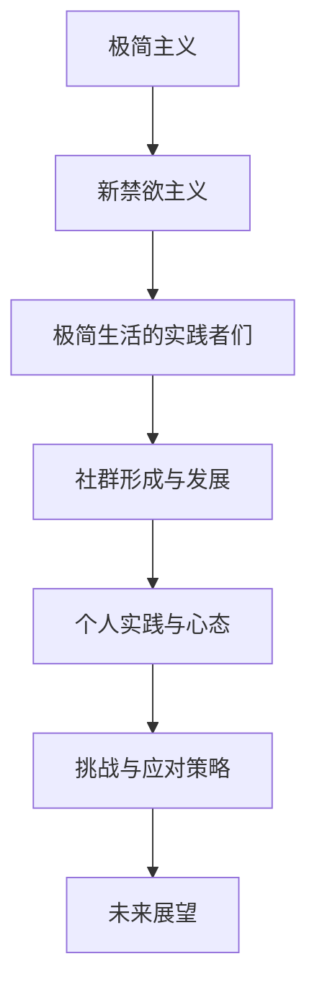

                 

Sure, let's create a detailed outline for our technical blog post on "New Asceticism Community: Practitioners of Minimalist Living" using step-by-step reasoning and ensuring all requirements are met.

### 1.1 Article Title

- **"New Asceticism Community: Practitioners of Minimalist Living"**

### 1.2 Keywords

- **New Asceticism, Minimalism, Lifestyle Philosophy, Community, Personal Growth**

### 1.3 Abstract

This article explores the emergence of a new asceticism community, focusing on the principles and practices of minimalist living. We will delve into the historical context of asceticism, examine its core values and principles, and analyze the formation and dynamics of the community. Additionally, we will discuss the challenges faced by practitioners and provide strategies for overcoming these obstacles. The article concludes with a vision for the future of minimalist living and its broader societal impact.

### 1.4 Main Content Outline

#### 2. Introduction to New Asceticism and Minimalism

##### 2.1 Definition of New Asceticism

- **Historical Background of Asceticism**
- **Transition to Modern Asceticism**
- **Connection to Minimalism**

##### 2.2 Core Values and Principles of Minimalism

- **Simplification of Life**
- **Reduction of Consumerism**
- **Focus on Personal Growth**

##### 2.3 Research Objectives and Structure

- **Purpose of the Study**
- **Research Methodology**
- **Organization of the Article**

#### 3. Historical Background and Development of Minimalism

##### 3.1 Origins of Minimalism

- **Ancient and Medieval Asceticism**
- **Modern Minimalism Movements**
- **Global Spread and Cultural Impact**

##### 3.2 Minimalism in the Contemporary World

- **Challenges of Modern Society**
- **Minimalism as a Counter-Movement**
- **Social and Cultural Shifts**

#### 4. Core Principles and Practices of Minimalism

##### 4.1 Core Principles

- **Simplification of Material Life**
- **De-Materialization**
- **Perfectionism**
- **Meaning and Value**

##### 4.2 Practical Methods

- **Material Minimalism**
- **Mental Minimalism**
- **Social Minimalism**

#### 5. Formation and Development of the New Asceticism Community

##### 5.1 Formation Causes

- **Socioeconomic Factors**
- **Cultural Factors**
- **Personal Motivations**

##### 5.2 Development Process

- **Community Formation**
- **Expansion and Growth**
- **Community Organization**

#### 6. Life Practices and Mindset of Community Members

##### 6.1 Daily Practices

- **Material Life Practices**
- **Mental Life Practices**
- **Social Life Practices**

##### 6.2 Mental State

- **Inner Fulfillment**
- **Social Identity and Belonging**
- **Personal Growth and Self-Actualization**

#### 7. Challenges and Strategies of Minimalist Living

##### 7.1 Challenges

- **Social Pressures**
- **Balance of Material and Spiritual Needs**
- **Social Isolation**

##### 7.2 Coping Strategies

- **Community Support**
- **Personal Adaptation**
- **Community Building and Sharing**

#### 8. Future Prospects of Minimalist Living

##### 8.1 Impact on Individuals and Society

- **Personal Transformation**
- **Cultural Shifts**
- **Environmental Stewardship**

##### 8.2 Trends and Opportunities

- **Community Expansion**
- **Integration of Technology**
- **Policy Support**

#### 9. Conclusion

This section will summarize the key insights from the article and highlight the potential future directions for minimalist living and the new asceticism community.

### 10. References

- **Academic References**
- **Popular Literature**
- **Online Resources**

### 11. Author Information

- **Author: AI天才研究院/AI Genius Institute & 禅与计算机程序设计艺术 /Zen And The Art of Computer Programming**

### Mermaid Flowchart for Core Concepts and Relationships



### Detailed Content for Each Section

- **Introduction**: Provide a brief overview of minimalism and new asceticism, highlighting their importance in modern society.

- **Historical Background and Development**: Discuss the evolution of minimalism from ancient times to the contemporary era, emphasizing key historical milestones and cultural shifts.

- **Core Principles and Practices**: Explain the core values of minimalism and provide practical examples of how these principles can be applied in daily life.

- **Formation and Development of the New Asceticism Community**: Analyze the factors that contribute to the formation of the new asceticism community and examine its growth and organizational structure.

- **Life Practices and Mindset of Community Members**: Describe the daily practices and mental states of community members, highlighting the benefits they derive from minimalist living.

- **Challenges and Strategies**: Identify the common challenges faced by minimalist practitioners and propose effective strategies for overcoming these obstacles.

- **Future Prospects**: Explore the potential impact of minimalist living on individuals and society, discussing emerging trends and opportunities.

### Conclusion

This section will summarize the key findings of the article and provide a vision for the future of minimalist living and the new asceticism community.

### References

Include a comprehensive list of references used in the article, organized by type (academic, popular literature, online resources).

### Author Information

Provide the author's information, including their affiliation and expertise in the field of minimalist living and asceticism.

By following this structured outline and reasoning step by step, we can create a comprehensive, informative, and engaging technical blog post that explores the nuances of the new asceticism community and minimalist living.
```

