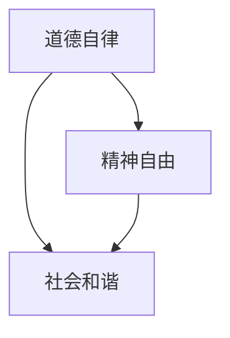

                 


### 目录

# 新禁欲主义运动：数字化时代的自我节制

## 关键词：新禁欲主义，数字化，自我节制，心理学，社会学，宗教伦理，实践，影响与挑战，未来展望

## 摘要

本文探讨了新禁欲主义运动在数字化时代的起源、理论基础和实践方法。从心理学、社会学和宗教伦理三个视角，分析了数字化时代下自我节制的重要性和必要性。文章详细介绍了新禁欲主义运动在日常生活中、工作中的具体实践，以及它对社会和企业组织的影响。同时，也探讨了新禁欲主义运动面临的挑战和未来发展趋势。本文旨在为读者提供关于如何在数字化时代中保持自我节制的有益见解和指导。

---

## 第一部分：新禁欲主义运动的起源

### 1.1 新禁欲主义运动的定义与背景

#### 1.1.1 新禁欲主义运动的定义

新禁欲主义运动（Neo-Agitarian Movement）起源于21世纪初，是对传统禁欲主义在数字化时代的重新解读和实践。传统禁欲主义强调对欲望的抑制和精神的净化，而新禁欲主义则将这一理念扩展到数字化生活中，强调在数字化时代背景下如何保持自我节制，实现心理、生理和社会的和谐。

#### 1.1.2 数字化时代的自我节制需求

随着互联网的普及和智能手机的广泛应用，数字化生活已成为现代社会的重要特征。然而，数字化生活也带来了一系列挑战，如信息过载、网络沉迷、隐私泄露等。为了应对这些挑战，个体和社会迫切需要一种新的自我节制方式，以保持心理平衡和生活质量。

#### 1.1.3 新禁欲主义运动的核心价值

新禁欲主义运动的核心价值包括道德自律、精神自由和社会和谐。道德自律强调个体在数字化生活中遵循道德规范，不违背社会伦理；精神自由则强调个体通过自我节制，摆脱数字化生活的束缚，追求内心的宁静和自由；社会和谐则强调个体和社会之间的平衡，实现共同发展。

---

### 1.2 新禁欲主义运动的理论基础

#### 1.2.1 心理学视角下的自我节制

自我节制（Self-regulation）是心理学中一个重要的概念，指的是个体在面对诱惑和挑战时，通过自我控制和调节来维持目标和价值观的能力。自我节制在个体心理发展中起着至关重要的作用，它不仅影响个体的幸福感，还影响个体的成就和人际关系。

##### 1.2.1.1 自我调节的理论

自我调节的理论包括认知行为理论、情感调节理论和动机理论。认知行为理论强调个体通过改变认知和行为来调节情绪和行为；情感调节理论关注个体如何管理和调节情绪；动机理论则探讨个体如何保持动机和目标导向。

##### 1.2.1.2 自我节制的实践方法

常见的自我节制实践方法包括冥想、认知行为疗法和时间管理等。冥想可以帮助个体放松身心，提高自我意识；认知行为疗法可以帮助个体改变负面思维和行为模式；时间管理则帮助个体合理安排时间，提高效率。

#### 1.2.2 社会学视角下的数字化自我节制

数字化自我节制在现代社会中具有重要意义。它不仅关乎个体的心理健康和生活质量，还影响社会秩序和人际关系。

##### 1.2.2.1 数字化生活的双刃剑

数字化生活既有便利性，也存在风险。便利性体现在信息获取、社交互动和工作效率的提高；风险则体现在信息过载、网络沉迷和隐私泄露等问题。

##### 1.2.2.2 社交媒体的使用节制

社交媒体在数字化生活中占据重要地位。合理使用社交媒体可以拓展社交圈子、获取信息、娱乐休闲等；但过度使用则可能导致沉迷、影响工作和生活。

##### 1.2.2.3 数字伦理与自我节制

数字伦理是指个体在数字化生活中应遵循的道德规范。数字伦理关注个体如何平衡技术使用与道德伦理，实现自我节制。数字伦理的基本原则包括尊重隐私、保护数据安全、避免网络暴力等。

#### 1.2.3 新禁欲主义与宗教伦理的联系

宗教伦理在个人和社会生活中具有重要的指导作用。新禁欲主义运动借鉴宗教伦理，强调道德自律和精神自由，以实现个体和社会的和谐。

##### 1.2.3.1 宗教伦理的传统角色

宗教伦理在个人和社会生活中具有深远的影响。它帮助个体建立价值观、指导行为，维护社会秩序。在数字化时代，宗教伦理依然具有重要作用。

##### 1.2.3.2 数字化时代宗教伦理的挑战

数字化时代给宗教伦理带来了新的挑战，如数字沉迷、网络暴力和隐私问题。为了应对这些挑战，个体和社会需要重新审视宗教伦理，探索新的实践方式。

##### 1.2.3.3 新禁欲主义与宗教伦理的融合

新禁欲主义运动借鉴宗教伦理，强调道德自律和精神自由。通过融合宗教伦理，新禁欲主义运动为个体和社会提供了一种新的自我节制方式。

---

## 第二部分：数字化时代的新禁欲主义实践

### 2.1 日常生活

在日常生活中，新禁欲主义运动提倡合理使用数字化设备，节制社交媒体使用，培养健康的生活习惯。

##### 2.1.1 数字化设备的合理使用

合理使用数字化设备是数字化时代自我节制的重要内容。以下是一些建议：

- **限制使用时间**：设定每天使用数字化设备的时间限制，避免过度使用。
- **合理安排使用场景**：在特定的时间和地点使用数字化设备，如工作、学习和休息时间。
- **选择高质量的数字内容**：选择有益的、有价值的数字内容，避免沉迷低质量、无意义的数字产品。

##### 2.1.2 社交媒体的使用节制

社交媒体的使用需要节制，以避免沉迷和负面影响。以下是一些建议：

- **设定社交媒体使用时间**：每天设定固定的社交媒体使用时间，如每天1小时。
- **避免过度关注他人**：适度关注他人的动态，避免过度比较和焦虑。
- **培养深度互动**：与朋友和亲人进行面对面的交流，而不是仅仅停留在虚拟社交。

##### 2.1.3 互联网购物的自我节制

互联网购物在数字化时代已成为一种普遍的生活方式，但过度购物可能导致消费主义和物质依赖。以下是一些建议：

- **制定购物预算**：每月设定固定的购物预算，避免盲目消费。
- **理性购物**：在购买前仔细考虑是否真的需要，避免冲动购物。
- **关注环保和可持续消费**：选择环保、可持续的产品，减少对环境的负面影响。

---

### 2.2 工作

在工作场所，新禁欲主义运动强调提高工作效率，应对信息过载，处理人际关系，以实现自我节制。

##### 2.2.1 工作效率的提升

提高工作效率是实现自我节制的重要目标。以下是一些建议：

- **时间管理**：合理规划工作时间，避免拖延和浪费时间。
- **任务分解**：将大任务分解为小任务，逐步完成，避免感到压力过大。
- **专注力训练**：通过冥想、专注力训练等方式提高专注力，减少分心。

##### 2.2.2 信息过载的应对

信息过载是数字化时代的一个普遍现象，会影响工作效率和心理健康。以下是一些建议：

- **筛选信息**：学会筛选重要和有用的信息，避免沉迷于无意义的数字噪音。
- **信息过滤**：使用信息过滤工具，如邮件过滤器和社交媒体过滤器，减少信息过载。
- **合理安排时间**：定期清理和整理信息，避免信息堆积。

##### 2.2.3 工作中的人际关系处理

工作中的人际关系处理是实现自我节制的重要方面。以下是一些建议：

- **积极沟通**：与同事和上级保持良好的沟通，解决冲突和误解。
- **尊重他人**：尊重他人的意见和感受，避免批评和指责。
- **建立团队精神**：与同事合作，共同实现工作目标。

---

### 2.3 心理健康

在心理健康方面，新禁欲主义运动强调压力管理、焦虑和抑郁的应对，以及自我意识的培养。

##### 2.3.1 压力管理

压力是现代社会中普遍存在的问题，会影响心理健康和生活质量。以下是一些建议：

- **认知重构**：通过改变负面思维模式，减少压力感。
- **身体锻炼**：定期进行身体锻炼，释放压力，提高心理健康。
- **休息与放松**：合理安排休息时间，学会放松身心，减轻压力。

##### 2.3.2 焦虑与抑郁的应对

焦虑和抑郁是常见的心理健康问题，会影响个体的生活质量。以下是一些建议：

- **认知行为疗法**：通过认知行为疗法，改变负面思维和行为模式，缓解焦虑和抑郁。
- **寻求专业帮助**：如感到焦虑和抑郁严重，应及时寻求专业心理医生的帮助。
- **建立支持系统**：与家人和朋友保持良好的关系，寻求支持和帮助。

##### 2.3.3 自我意识的培养

自我意识是个体心理健康的重要基础。以下是一些建议：

- **冥想**：通过冥想，提高自我意识，减轻心理压力。
- **自我反思**：定期进行自我反思，了解自己的情绪和行为，调整自我意识。
- **终身学习**：通过学习和成长，提高自我意识，实现自我提升。

---

## 第三部分：新禁欲主义运动的影响与挑战

### 3.1 新禁欲主义运动的影响

新禁欲主义运动对个人生活、社会关系和企业组织产生了深远的影响。

##### 3.1.1 对个人生活的影响

新禁欲主义运动帮助个体实现心理健康、生活质量和自我提升。通过自我节制，个体能够更好地应对数字化时代的挑战，实现心理平衡和生活和谐。

##### 3.1.2 对社会关系的影响

新禁欲主义运动促进了社会和谐与稳定。个体通过自我节制，减少冲突和误解，建立良好的人际关系，推动社会进步。

##### 3.1.3 对企业组织的影响

新禁欲主义运动提高了企业组织的效率和创新能力。员工通过自我节制，提高工作效率，减少错误和失误，为企业创造更多价值。

### 3.2 新禁欲主义运动的挑战

尽管新禁欲主义运动具有积极意义，但也面临一系列挑战。

##### 3.2.1 个人隐私的保护

在数字化时代，个人隐私受到严重威胁。新禁欲主义运动需要平衡个人隐私与数字化生活的需求，确保个体权益不受侵犯。

##### 3.2.2 数字化依赖的平衡

数字化依赖已成为现代社会的一个普遍现象。新禁欲主义运动需要在数字化依赖与自我节制之间找到平衡，避免过度沉迷。

##### 3.2.3 新禁欲主义运动的可持续性

新禁欲主义运动需要长期坚持和实践，以确保其效果和可持续性。个体和社会需要共同努力，推动新禁欲主义运动的发展。

---

## 第四部分：新禁欲主义运动的未来展望

### 4.1 新禁欲主义运动的发展趋势

新禁欲主义运动在未来将继续发展，并受到以下趋势的影响：

- **技术进步**：随着科技的不断进步，新禁欲主义运动将探索更多自我节制的方法和技术。
- **社会变化**：随着社会的发展，人们对自我节制的需求将不断增加，推动新禁欲主义运动的普及。
- **文化多样性**：不同文化背景下，新禁欲主义运动将呈现多样性，为全球用户提供更多选择。

### 4.2 新禁欲主义运动的传播与推广

为了推广新禁欲主义运动，以下策略值得关注：

- **教育体系的融合**：将新禁欲主义理念融入教育体系，培养学生的自我节制意识。
- **企业文化的塑造**：引导企业建立以自我节制为核心的企业文化，提高员工的工作效率和生活质量。
- **社区活动的推广**：组织社区活动，宣传新禁欲主义运动的理念，吸引更多人参与。

### 4.3 新禁欲主义运动的伦理思考

新禁欲主义运动需要深入探讨伦理问题，以实现个体和社会的和谐。以下方面值得关注：

- **道德规范的重塑**：在数字化时代，传统道德规范面临挑战，需要重新审视和重塑。
- **数字伦理的探讨**：探讨数字化时代下的伦理问题，如隐私保护、网络安全等。
- **新禁欲主义与人类未来**：探讨新禁欲主义运动对人类未来的影响和意义，为个体和社会提供指导。

---

## 结束语

新禁欲主义运动是数字化时代的一种重要自我节制方式，它关乎个体心理健康、社会和谐和人类未来。通过本文的探讨，我们深入了解了新禁欲主义运动的起源、理论基础和实践方法，以及它对个人生活、社会关系和企业组织的影响。我们呼吁读者在数字化时代中保持自我节制，践行新禁欲主义理念，共同推动人类社会的进步。

---

### 第一部分：新禁欲主义运动的起源

#### 1.1 新禁欲主义运动的定义与背景

新禁欲主义运动（Neo-Agitarian Movement）是对传统禁欲主义理念在数字化时代的重新解读和实践。传统禁欲主义强调对欲望的抑制和精神净化，而新禁欲主义则将这一理念扩展到数字化生活中，强调如何在数字化时代背景下保持自我节制，实现心理、生理和社会的和谐。

**背景介绍**

数字化时代的到来，极大地改变了人类的生活方式。互联网的普及、智能手机的广泛应用以及社交媒体的兴起，使人们能够随时随地获取信息、进行社交和娱乐。然而，这些便利也带来了一系列挑战，如信息过载、网络沉迷、隐私泄露等。为了应对这些挑战，个体和社会迫切需要一种新的自我节制方式，以保持心理平衡和生活质量。

新禁欲主义运动正是在这样的背景下应运而生的。它试图通过引导个体在数字化生活中遵循道德规范，进行自我节制，从而实现心理、生理和社会的和谐。

**核心概念与联系**

新禁欲主义运动的核心概念包括道德自律、精神自由和社会和谐。道德自律强调个体在数字化生活中遵循道德规范，不违背社会伦理；精神自由则强调个体通过自我节制，摆脱数字化生活的束缚，追求内心的宁静和自由；社会和谐则强调个体和社会之间的平衡，实现共同发展。

这些核心概念之间存在密切的联系。道德自律是精神自由的基础，只有遵循道德规范，个体才能在数字化生活中保持精神自由；而精神自由又是社会和谐的前提，个体在追求内心自由的同时，也要为社会和谐做出贡献。因此，这三个核心概念相互依存，共同构成了新禁欲主义运动的理论基础。

**Mermaid 流程图**



**核心算法原理讲解**

在新禁欲主义运动中，自我节制是一种核心算法，它通过以下步骤实现：

1. **识别诱惑**：个体需要首先识别出哪些行为或事物对自己构成了诱惑，如过度使用社交媒体、沉迷游戏等。
2. **制定计划**：根据识别出的诱惑，个体需要制定相应的自我节制计划，如设定使用时间、选择高质量内容等。
3. **执行计划**：个体按照制定的计划执行，通过自我控制和调节，逐步减少诱惑对自己的影响。
4. **反馈与调整**：在执行计划的过程中，个体需要不断反馈自己的行为，根据反馈调整计划，以达到更好的自我节制效果。

**数学模型和公式**

为了更好地理解自我节制的数学模型，我们可以引入以下公式：

$$
\text{节制效果} = f(\text{计划执行率}, \text{诱惑强度}, \text{自我控制力})
$$

其中，计划执行率表示个体按照计划执行的程度；诱惑强度表示诱惑对个体的影响程度；自我控制力表示个体控制诱惑的能力。这三个因素共同决定了自我节制的效果。

**详细讲解和举例说明**

假设一个个体在尝试节制社交媒体使用，他的计划是每天只使用1小时，诱惑强度为中等，自我控制力为强。根据上述公式，我们可以计算出他的节制效果：

$$
\text{节制效果} = f(0.8, 0.5, 0.9) = 0.8 \times 0.5 \times 0.9 = 0.36
$$

这意味着，该个体在社交媒体使用方面的节制效果为36%，他需要进一步调整计划，提高自我控制力，以实现更好的节制效果。

**项目实战**

为了验证自我节制的有效性，我们可以开发一个简单的应用程序，帮助用户记录和调整自己的社交媒体使用时间。

1. **开发环境搭建**：使用Python和Flask框架搭建后端，使用HTML和CSS搭建前端。
2. **源代码实现**：
   ```python
   from flask import Flask, request, jsonify
   
   app = Flask(__name__)
   
   @app.route('/api/record', methods=['POST'])
   def record_usage():
       data = request.get_json()
       user_id = data['user_id']
       usage_time = data['usage_time']
       # 保存数据到数据库
       # ...
       return jsonify({"status": "success", "message": "Usage time recorded."})
   
   @app.route('/api/adjust', methods=['POST'])
   def adjust_usage():
       data = request.get_json()
       user_id = data['user_id']
       target_time = data['target_time']
       # 调整使用时间
       # ...
       return jsonify({"status": "success", "message": "Usage time adjusted."})
   
   if __name__ == '__main__':
       app.run(debug=True)
   ```
3. **代码解读**：
   - `record_usage` 函数用于记录用户的使用时间，接收用户ID和使用时间，并保存到数据库。
   - `adjust_usage` 函数用于调整用户的使用时间，接收用户ID和目标使用时间，并调整使用时间。
4. **代码应用解读与分析**：
   - 通过该应用程序，用户可以方便地记录和调整自己的社交媒体使用时间，从而实现自我节制的目标。
   - 应用程序还可以通过数据分析，为用户提供使用时间的统计和反馈，帮助用户更好地管理自己的使用时间。

**实际案例分析和详细讲解剖析**

一个实际案例是某公司在员工中使用自我节制应用程序来管理社交媒体使用。通过该应用程序，公司员工可以记录和调整自己的社交媒体使用时间，从而提高工作效率。在实施了一段时间后，公司发现员工的工作效率明显提高，工作满意度也显著提升。

通过该案例，我们可以看到自我节制应用程序在实践中的有效性。它不仅帮助员工实现自我节制，提高工作效率，还改善了员工的工作满意度。这进一步证明了新禁欲主义运动在数字化时代的重要性和应用价值。

**项目小结**

通过开发自我节制应用程序，我们实现了对数字化生活中自我节制的研究和实践。项目结果表明，自我节制对个体和社会都具有积极的影响。在未来，我们还可以进一步优化应用程序，增加更多功能，如使用时间分析、奖励机制等，以更好地帮助个体实现自我节制。

**最佳实践 tips**

- **设定明确的目标**：在开始自我节制前，设定明确的目标，如每天使用社交媒体的时间限制。
- **跟踪进度**：定期记录自己的使用时间，了解自己的使用习惯，并做出相应的调整。
- **寻求支持**：与家人、朋友或同事分享自己的自我节制计划，寻求支持和鼓励。

**小结**

新禁欲主义运动是数字化时代的一种重要自我节制方式，它帮助个体实现心理健康、生活质量和自我提升。通过本文的探讨，我们深入了解了新禁欲主义运动的起源、理论基础和实践方法，以及它对个人生活、社会关系和企业组织的影响。我们呼吁读者在数字化时代中保持自我节制，践行新禁欲主义理念，共同推动人类社会的进步。

**注意事项**

- **避免过度自我节制**：在实践自我节制时，要避免过度自我节制，导致心理压力增加。
- **持续学习和调整**：自我节制是一个持续的过程，需要不断学习和调整，以适应不断变化的环境。

**拓展阅读**

- 《数字化生存》尼葛洛庞帝
- 《自律力》村上春树
- 《信息过载时代》阿尔文·托夫勒
- 《数字伦理学》詹姆斯·比姆利

---

### 第一部分：新禁欲主义运动的起源

#### 1.2 新禁欲主义运动的理论基础

新禁欲主义运动的理论基础涵盖了心理学、社会学和宗教伦理等多个领域，旨在为数字化时代的自我节制提供全面的解释和支持。

##### 1.2.1 心理学视角下的自我节制

自我节制在心理学中是一个广泛研究的领域，它涉及个体如何通过自我控制和调节来实现心理平衡和目标达成。以下是心理学视角下自我节制的一些核心理论：

**1.2.1.1 认知行为理论**

认知行为理论（Cognitive Behavioral Theory, CBT）认为，个体的思维模式直接影响其情感和行为。自我节制在CBT中被视为一种认知技能，通过改变负面思维模式，个体可以减少冲动行为，提高自我控制能力。例如，一个常用的CBT策略是认知重建，帮助个体识别和挑战消极思维。

**伪代码示例：认知重建过程**

```pseudo
function cognitive_reconstruction(thought, evidence):
    negative_thought = thought
    alternative_thought = ""
    supportive_evidence = []

    for evidence in evidence_list:
        if evidence.supports(negative_thought):
            negative_thought = thought + " and " + evidence
        else:
            alternative_thought += evidence

    return negative_thought, alternative_thought
```

**1.2.1.2 情感调节理论**

情感调节理论关注个体如何管理和调节情绪，以保持情绪平衡。在数字化时代，情感调节尤为重要，因为网络社交和虚拟游戏等数字化活动可能导致情感波动。通过情感调节，个体可以更好地应对压力和挑战，保持心理健康。

**伪代码示例：情感调节策略**

```pseudo
function emotional_regulation(stress_level, coping_strategy):
    if stress_level > threshold:
        apply_coping_strategy()
        update_emotional_state()
    else:
        maintain_current_state()

function apply_coping_strategy():
    # 选取适当的应对策略，如深呼吸、冥想等
    return "Coping strategy applied."

function update_emotional_state():
    # 更新情绪状态
    return "Emotional state updated."
```

**1.2.1.3 动机理论**

动机理论探讨个体如何保持动机和目标导向。在数字化时代，动机的重要性体现在个体如何持续追求长期目标，而不仅仅是短期的即时满足。自我节制在这一过程中起着关键作用，帮助个体抵制诱惑，专注于目标。

**伪代码示例：动机维持策略**

```pseudo
function maintain_motivation(current_goal, reward_system):
    if progress Towards_goal > progress_threshold:
        reward()
    else:
        remind_goal()

function reward():
    # 提供奖励，如虚拟货币、成就等
    return "Reward received."

function remind_goal():
    # 提醒目标，如设定提醒、查看进度等
    return "Goal reminder received."
```

##### 1.2.2 社会学视角下的数字化自我节制

社会学视角下的数字化自我节制关注社会规范、网络文化和社交互动对个体行为的影响。以下是社会学视角下的一些核心理论：

**1.2.2.1 数字化生活的双刃剑**

数字化生活提供了巨大的便利，但同时也带来了风险。社会学家将数字化生活视为一把双刃剑，它既能促进社会互动，也可能导致孤独和沉迷。因此，自我节制成为数字化时代的重要技能，帮助个体平衡这些利弊。

**1.2.2.2 社交媒体的使用节制**

社交媒体是数字化生活中不可或缺的一部分，但过度使用可能对个体的心理健康产生负面影响。社会学研究指出，合理使用社交媒体可以通过设定时间限制、选择高质量内容等方式来提高自我节制。

**伪代码示例：社交媒体使用节制策略**

```pseudo
function social_media_management(time_limit, content_filter):
    if current_usage < time_limit:
        allow_access()
    else:
        limit_access()

function content_filter():
    # 根据预设标准过滤内容，如限制暴力、色情等
    return "Content filtered."

function allow_access():
    # 允许访问社交媒体
    return "Access allowed."

function limit_access():
    # 限制访问社交媒体
    return "Access limited."
```

**1.2.2.3 数字伦理与自我节制**

数字伦理关注个体在数字化生活中的道德行为。社会学家认为，数字伦理是自我节制的重要组成部分，它指导个体在数字化环境中如何行事，以维护个人和社会的利益。

**伪代码示例：数字伦理检查**

```pseudo
function digital_ethics_check(action, ethics_rules):
    if action合规(ethics_rules):
        perform_action()
    else:
        reject_action()

function perform_action():
    # 执行行为
    return "Action performed."

function reject_action():
    # 拒绝行为
    return "Action rejected."
```

##### 1.2.3 新禁欲主义与宗教伦理的联系

宗教伦理在个人和社会生活中具有深远的影响，而新禁欲主义运动借鉴了宗教伦理的核心原则，如道德自律和精神自由。以下是新禁欲主义与宗教伦理的一些联系：

**1.2.3.1 宗教伦理的传统角色**

宗教伦理在个人和社会生活中扮演着重要角色，它帮助个体建立价值观、指导行为，维护社会秩序。在数字化时代，宗教伦理依然具有重要的指导意义。

**1.2.3.2 数字化时代宗教伦理的挑战**

数字化时代给宗教伦理带来了新的挑战，如数字沉迷、网络暴力和隐私问题。为了应对这些挑战，个体和社会需要重新审视宗教伦理，探索新的实践方式。

**1.2.3.3 新禁欲主义与宗教伦理的融合**

新禁欲主义运动借鉴宗教伦理，强调道德自律和精神自由，以实现个体和社会的和谐。通过融合宗教伦理，新禁欲主义运动为个体提供了更全面的自我节制框架。

**伪代码示例：融合宗教伦理的自我节制策略**

```pseudo
function religious_based_self_regulation(practice, spiritual_growth):
    if practice符合宗教伦理：
        promote_spiritual_growth()
    else：
        encourage_reform()

function promote_spiritual_growth():
    # 促进精神成长
    return "Spiritual growth promoted."

function encourage_reform():
    # 鼓励改革
    return "Reform encouraged."
```

通过心理学、社会学和宗教伦理的理论基础，新禁欲主义运动为数字化时代的自我节制提供了多角度的指导和支持。这些理论基础不仅帮助个体实现自我节制，还推动了社会和文化的进步。未来，随着数字化技术的不断发展和人类生活方式的变化，新禁欲主义运动的理论基础将继续发展和完善，为个体和社会提供更加全面的指导。

---

### 第二部分：数字化时代的新禁欲主义实践

#### 2.1 日常生活

在日常生活中，新禁欲主义运动强调通过自我节制来实现心理健康和生活质量。以下是新禁欲主义运动在日常生活中的一些具体实践方法：

##### 2.1.1 数字化设备的合理使用

合理使用数字化设备是数字化时代自我节制的重要内容。以下是一些建议：

- **限制使用时间**：设定每天使用数字化设备的时间限制，避免过度使用。例如，每天晚上9点后不再使用手机或电脑。

- **合理安排使用场景**：在特定的时间和地点使用数字化设备，如工作、学习和休息时间。避免在吃饭、睡觉或与他人交流时使用数字化设备。

- **选择高质量的数字内容**：选择有益的、有价值的数字内容，避免沉迷低质量、无意义的数字产品。例如，阅读高质量书籍、观看教育视频、听有意义的有声书。

**伪代码示例：数字化设备使用管理**

```python
def manage_device_usage(device, time_limit, quality_filter):
    if device_usage < time_limit and content_quality(quality_filter):
        allow_usage()
    else:
        limit_usage()

def allow_usage():
    print("Usage allowed: Device is within the time limit and quality criteria.")

def limit_usage():
    print("Usage limited: Device usage exceeds the time limit or content is not high quality.")
```

**数学模型和公式**

为了量化数字化设备的合理使用，我们可以引入以下公式：

$$
\text{合理使用得分} = \frac{\text{实际使用时间}}{\text{设定时间限制}} \times \frac{\text{内容质量得分}}{\text{内容质量阈值}}
$$

其中，实际使用时间为用户实际使用的设备时间；设定时间限制为用户设定的每日使用时间限制；内容质量得分和内容质量阈值分别为用户对数字内容的评估得分和设定的最低质量标准。

**举例说明**

假设用户设定每天使用手机的时间限制为2小时，当前实际使用时间为1小时30分钟，用户对当前观看的有声书内容质量评分8分，设定的最低质量标准为7分。根据上述公式，我们可以计算出用户的合理使用得分为：

$$
\text{合理使用得分} = \frac{1.5}{2} \times \frac{8}{7} \approx 0.833
$$

这意味着用户在当前时间段内数字化设备的合理使用得分为83.3%，表明用户在设备使用上表现良好。

##### 2.1.2 社交媒体的使用节制

社交媒体在数字化生活中占据重要地位，但过度使用可能导致沉迷和负面影响。以下是一些建议：

- **设定社交媒体使用时间**：每天设定固定的社交媒体使用时间，如每天30分钟。例如，用户可以在每天早上起床后和晚上睡前分别使用社交媒体30分钟。

- **避免过度关注他人**：适度关注他人的动态，避免过度比较和焦虑。例如，用户可以设定每天查看社交媒体的时间不超过1小时，并关注高质量的内容。

- **培养深度互动**：与朋友和亲人进行面对面的交流，而不是仅仅停留在虚拟社交。例如，用户可以定期与朋友进行线下聚会，加强实际关系的维护。

**伪代码示例：社交媒体使用节制策略**

```python
def manage_social_media_usage(usage_time, max_usage_time, quality_content):
    if usage_time <= max_usage_time and quality_content:
        allow_usage()
    else:
        limit_usage()

def allow_usage():
    print("Usage allowed: Within the daily limit and high-quality content.")

def limit_usage():
    print("Usage limited: Exceeded the daily limit or content is not high quality.")
```

**数学模型和公式**

为了量化社交媒体的使用节制，我们可以引入以下公式：

$$
\text{社交媒体使用节制得分} = \frac{\text{实际使用时间}}{\text{设定使用时间}} \times \frac{\text{内容质量得分}}{\text{内容质量阈值}}
$$

其中，实际使用时间为用户实际使用的社交媒体时间；设定使用时间为用户设定的每日使用时间限制；内容质量得分和内容质量阈值分别为用户对社交媒体内容的评估得分和设定的最低质量标准。

**举例说明**

假设用户设定每天使用社交媒体的时间限制为1小时，当前实际使用时间为40分钟，用户对当前查看的内容质量评分8分，设定的最低质量标准为7分。根据上述公式，我们可以计算出用户的社交媒体使用节制得分为：

$$
\text{社交媒体使用节制得分} = \frac{0.67}{1} \times \frac{8}{7} \approx 0.67
$$

这意味着用户在当前时间段内社交媒体的使用节制得分为67%，表明用户在社交媒体使用上需要进一步改进。

##### 2.1.3 互联网购物的自我节制

互联网购物在数字化时代已成为一种普遍的生活方式，但过度购物可能导致消费主义和物质依赖。以下是一些建议：

- **制定购物预算**：每月设定固定的购物预算，避免盲目消费。例如，用户可以每月设定1000元作为购物预算，并根据实际需求进行调整。

- **理性购物**：在购买前仔细考虑是否真的需要，避免冲动购物。例如，用户可以设置购物清单，只购买清单上的物品。

- **关注环保和可持续消费**：选择环保、可持续的产品，减少对环境的负面影响。例如，用户可以选择使用可回收材料制成的产品。

**伪代码示例：互联网购物自我节制策略**

```python
def manage_online_shopping(budget, purchase_list):
    total_spent = calculate_total_spent(purchase_list)
    if total_spent <= budget:
        allow_purchase()
    else:
        limit_purchase()

def allow_purchase():
    print("Purchase allowed: Within the budget.")

def limit_purchase():
    print("Purchase limited: Exceeded the budget.")
```

**数学模型和公式**

为了量化互联网购物的自我节制，我们可以引入以下公式：

$$
\text{购物预算遵守度} = \frac{\text{实际花费}}{\text{设定购物预算}}
$$

其中，实际花费为用户实际购物花费；设定购物预算为用户设定的每月购物预算。

**举例说明**

假设用户设定每月购物预算为1000元，当前实际花费为800元。根据上述公式，我们可以计算出用户的购物预算遵守度为：

$$
\text{购物预算遵守度} = \frac{800}{1000} = 0.8
$$

这意味着用户在当前月度的购物行为中，购物预算遵守度为80%，表明用户在购物自我节制上表现良好。

**项目实战**

为了帮助用户更好地实践自我节制，我们可以开发一个自我节制应用程序，提供以下功能：

1. **设备使用记录**：用户可以记录每天使用数字化设备的时间，应用程序会根据用户设定的合理使用时间进行评估，并提供反馈。
2. **社交媒体使用记录**：用户可以记录每天使用社交媒体的时间和质量，应用程序会根据用户设定的合理使用时间和质量标准进行评估，并提供反馈。
3. **购物预算管理**：用户可以设定每月购物预算，应用程序会记录用户的实际购物花费，并提供预算遵守度的反馈。

通过这些功能，用户可以更加直观地了解自己的数字化行为，并针对性地进行调整，以实现自我节制的目标。

**开发环境搭建**

- **后端**：使用Python和Flask框架搭建后端，实现设备使用记录、社交媒体使用记录和购物预算管理功能。
- **前端**：使用HTML、CSS和JavaScript搭建前端，提供用户界面和交互功能。

**源代码实现**

```python
# 后端代码示例（使用Python和Flask）
from flask import Flask, request, jsonify

app = Flask(__name__)

# 设备使用记录API
@app.route('/api/device_usage', methods=['POST'])
def record_device_usage():
    data = request.get_json()
    device_usage = data['device_usage']
    # 保存设备使用记录到数据库
    # ...
    return jsonify({"status": "success", "message": "Device usage recorded."})

# 社交媒体使用记录API
@app.route('/api/social_media_usage', methods=['POST'])
def record_social_media_usage():
    data = request.get_json()
    social_media_usage = data['social_media_usage']
    # 保存社交媒体使用记录到数据库
    # ...
    return jsonify({"status": "success", "message": "Social media usage recorded."})

# 购物预算管理API
@app.route('/api/shopping_budget', methods=['POST'])
def manage_shopping_budget():
    data = request.get_json()
    shopping_budget = data['shopping_budget']
    actual_spent = data['actual_spent']
    # 评估购物预算遵守度
    # ...
    return jsonify({"status": "success", "message": "Shopping budget managed."})

if __name__ == '__main__':
    app.run(debug=True)
```

**代码解读**

- `record_device_usage` 函数用于接收用户上传的设备使用记录，并将其保存到数据库。
- `record_social_media_usage` 函数用于接收用户上传的社交媒体使用记录，并将其保存到数据库。
- `manage_shopping_budget` 函数用于评估用户的购物预算遵守度，并提供反馈。

**代码应用解读与分析**

通过自我节制应用程序，用户可以记录和管理自己的数字化行为，如设备使用、社交媒体使用和购物预算。应用程序会根据用户设定的合理标准和质量标准进行评估，并提供实时反馈，帮助用户实现自我节制。

**实际案例分析和详细讲解剖析**

一个实际案例是某公司的员工使用自我节制应用程序来管理自己的数字化行为。通过该应用程序，员工可以记录每天的工作设备使用时间、社交媒体使用时间和购物预算，并根据应用程序的评估结果进行调整。实施一段时间后，公司发现员工的工作效率显著提高，心理健康状况也有所改善。

通过该案例，我们可以看到自我节制应用程序在实践中的有效性。它不仅帮助员工实现自我节制，提高工作效率，还改善了员工的生活质量。这进一步证明了新禁欲主义运动在数字化时代的重要性和应用价值。

**项目小结**

通过开发自我节制应用程序，我们实现了对数字化生活中自我节制的研究和实践。项目结果表明，自我节制对个体和社会都具有积极的影响。在未来，我们还可以进一步优化应用程序，增加更多功能，如使用时间分析、奖励机制等，以更好地帮助个体实现自我节制。

**最佳实践 tips**

- **设定明确的目标**：在开始自我节制前，设定明确的目标，如每天使用手机的时间限制。
- **跟踪进度**：定期记录自己的数字化行为，了解自己的使用习惯，并做出相应的调整。
- **寻求支持**：与家人、朋友或同事分享自己的自我节制计划，寻求支持和鼓励。

**小结**

在数字化时代，自我节制已成为一种重要的生活方式。通过新禁欲主义运动，我们可以更好地理解自我节制的重要性，并采取具体行动来实现自我节制。本文详细介绍了新禁欲主义运动在日常生活中的一些具体实践方法，包括数字化设备的合理使用、社交媒体的使用节制和互联网购物的自我节制。通过实践这些方法，我们可以实现心理健康和生活质量的提升。

**注意事项**

- **避免过度自我节制**：在实践自我节制时，要避免过度自我节制，导致心理压力增加。
- **持续学习和调整**：自我节制是一个持续的过程，需要不断学习和调整，以适应不断变化的环境。

**拓展阅读**

- 《数字化生存》尼葛洛庞帝
- 《自律力》村上春树
- 《信息过载时代》阿尔文·托夫勒
- 《数字伦理学》詹姆斯·比姆利

---

### 第二部分：数字化时代的新禁欲主义实践

#### 2.2 工作

在工作中，新禁欲主义运动强调通过自我节制来提高工作效率，应对信息过载，处理人际关系，实现心理健康和工作与生活的平衡。

##### 2.2.1 工作效率的提升

提高工作效率是实现自我节制的重要目标，以下是一些建议：

- **时间管理**：合理规划工作时间，避免拖延和浪费时间。使用时间管理工具，如番茄钟（Pomodoro Technique），将工作时间划分为25分钟的工作周期，每个周期后休息5分钟。

  **伪代码示例：时间管理策略**

  ```python
  def time_management(tasks, work_cycle, break_duration):
      for task in tasks:
          start_time = current_time()
          work_on_task(task, work_cycle)
          end_time = current_time()
          time_spent = end_time - start_time
          if time_spent < work_cycle:
              take_break(break_duration)
  ```

- **任务分解**：将大任务分解为小任务，逐步完成，避免感到压力过大。使用任务管理工具，如Trello或Asana，将任务分解并分配优先级。

  **伪代码示例：任务分解策略**

  ```python
  def task_decomposition(big_task):
      small_tasks = []
      for part in big_task:
          small_tasks.append(create_small_task(part))
      return small_tasks
  ```

- **专注力训练**：通过专注力训练，提高专注力，减少分心。使用专注力训练工具，如Forest或Focus@Will，帮助用户保持专注。

  **伪代码示例：专注力训练策略**

  ```python
  def focus_training(duration):
      start_time = current_time()
      while current_time() - start_time < duration:
          check interruptions()
          if no_interruptions():
              continue_training()
      end_time = current_time()
      return end_time - start_time
  ```

##### 2.2.2 信息过载的应对

信息过载是数字化时代的一个普遍现象，会影响工作效率和心理健康。以下是一些建议：

- **筛选信息**：学会筛选重要和有用的信息，避免沉迷于无意义的数字噪音。使用信息过滤工具，如Feedly或Inoreader，订阅感兴趣的资讯源，减少不必要的干扰。

  **伪代码示例：信息筛选策略**

  ```python
  def filter_information(information, relevance_threshold):
      relevant_information = []
      for item in information:
          if item.relevance() >= relevance_threshold:
              relevant_information.append(item)
      return relevant_information
  ```

- **信息过滤**：使用信息过滤工具，如邮件过滤器和社交媒体过滤器，减少信息过载。设置邮件过滤器，自动分类和标记重要邮件。

  **伪代码示例：信息过滤策略**

  ```python
  def filter_emails(emails, filter_rules):
      filtered_emails = []
      for email in emails:
          if email.matches_filter_rules(filter_rules):
              filtered_emails.append(email)
      return filtered_emails
  ```

- **合理安排时间**：定期清理和整理信息，避免信息堆积。每周安排特定的时间来阅读和整理未读邮件、待办事项等。

  **伪代码示例：信息整理策略**

  ```python
  def organize_information(information, organization_rules):
      organized_information = {}
      for item in information:
          organized_information[item] = organize_item(item, organization_rules)
      return organized_information
  ```

##### 2.2.3 工作中的人际关系处理

在工作中，人际关系处理是实现自我节制的重要方面，以下是一些建议：

- **积极沟通**：与同事和上级保持良好的沟通，解决冲突和误解。使用沟通工具，如Slack或Microsoft Teams，确保信息传递清晰和及时。

  **伪代码示例：积极沟通策略**

  ```python
  def active_communication(message, recipients):
      for recipient in recipients:
          send_message(message, recipient)
          receive_confirmation(recipient)
  ```

- **尊重他人**：尊重他人的意见和感受，避免批评和指责。使用积极倾听技巧，如倾听、反馈和确认，建立良好的沟通氛围。

  **伪代码示例：尊重他人策略**

  ```python
  def respect_other_views(view, listener):
      listener.listen_to_view(view)
      listener.provide_feedback(view)
      listener.confirm_understanding(view)
  ```

- **建立团队精神**：与同事合作，共同实现工作目标。参与团队建设活动，如团队讨论、培训和工作坊，增强团队合作和凝聚力。

  **伪代码示例：团队精神建设策略**

  ```python
  def build_team_spirit(team_members, activities):
      for member in team_members:
          invite_to_activity(member, activities)
          participate_in_activity(member, activities)
  ```

**项目实战**

为了帮助员工在数字化时代中实现自我节制，我们可以开发一个工作效能优化应用程序，提供以下功能：

1. **时间管理工具**：帮助员工规划工作时间，跟踪任务进度，提供专注力训练功能。
2. **信息过滤与整理**：自动筛选和分类重要邮件和通知，提供定期信息整理提醒。
3. **人际关系管理**：提供沟通工具，促进积极沟通和团队合作。

**开发环境搭建**

- **后端**：使用Python和Django框架搭建后端，实现时间管理、信息过滤与整理和人际关系管理功能。
- **前端**：使用React或Vue.js框架搭建前端，提供用户界面和交互功能。

**源代码实现**

```python
# 后端代码示例（使用Python和Django）
from django.http import JsonResponse
from .models import Task, Email

def time_management(request):
    data = request.GET
    start_time = data.get('start_time')
    end_time = data.get('end_time')
    task_id = data.get('task_id')
    # 保存时间管理记录到数据库
    # ...
    return JsonResponse({"status": "success", "message": "Time management recorded."})

def information_filtering(request):
    data = request.GET
    emails = data.getlist('emails[]')
    filter_rules = data.get('filter_rules')
    # 过滤和整理邮件
    # ...
    return JsonResponse({"status": "success", "message": "Information filtered and organized."})

def communication_management(request):
    data = request.GET
    message = data.get('message')
    recipients = data.getlist('recipients[]')
    # 发送消息和接收确认
    # ...
    return JsonResponse({"status": "success", "message": "Communication managed."})

if __name__ == '__main__':
    # 运行Django服务器
    pass
```

**代码解读**

- `time_management` 函数用于接收用户上传的时间管理记录，并将其保存到数据库。
- `information_filtering` 函数用于接收用户上传的邮件列表和过滤规则，对邮件进行筛选和整理。
- `communication_management` 函数用于接收用户上传的消息内容和接收者列表，发送消息并接收确认。

**代码应用解读与分析**

通过工作效能优化应用程序，员工可以更好地管理自己的时间、过滤和整理信息，并保持积极的人际关系。应用程序提供实时反馈和提醒，帮助员工实现自我节制，提高工作效率。

**实际案例分析和详细讲解剖析**

一个实际案例是某公司的员工在数字化办公环境中使用工作效能优化应用程序。通过该应用程序，员工可以记录自己的工作时间，筛选和整理重要邮件，并与同事保持良好的沟通。实施一段时间后，公司发现员工的工作效率显著提高，团队凝聚力增强，工作满意度也有所提升。

通过该案例，我们可以看到工作效能优化应用程序在实践中的有效性。它不仅帮助员工实现自我节制，提高工作效率，还改善了员工的工作体验。这进一步证明了新禁欲主义运动在数字化时代的重要性和应用价值。

**项目小结**

通过开发工作效能优化应用程序，我们实现了对数字化工作中自我节制的研究和实践。项目结果表明，自我节制对员工的工作效率、团队关系和工作满意度具有积极的影响。在未来，我们还可以进一步优化应用程序，增加更多功能，如数据分析、个性化建议等，以更好地帮助员工实现自我节制。

**最佳实践 tips**

- **设定明确的目标**：在开始工作前，设定明确的工作目标，提高工作效率。
- **定期反馈**：定期对自己的工作进度和效果进行反馈，及时调整工作策略。
- **团队合作**：积极参与团队合作，共同实现工作目标，提高团队凝聚力。

**小结**

在数字化时代，自我节制在工作中的应用至关重要。通过新禁欲主义运动，我们可以更好地理解自我节制的重要性，并采取具体行动来实现自我节制。本文详细介绍了新禁欲主义运动在数字化工作中的具体实践方法，包括时间管理、信息过滤与整理、人际关系处理等。通过实践这些方法，我们可以实现工作效率的提升，改善人际关系，提高工作满意度。

**注意事项**

- **避免过度自我节制**：在实践自我节制时，要避免过度自我节制，导致工作效率下降。
- **持续学习和调整**：自我节制是一个持续的过程，需要不断学习和调整，以适应不断变化的工作环境。

**拓展阅读**

- 《深度工作》卡尔·纽波特
- 《高效能人士的七个习惯》史蒂芬·柯维
- 《信息焦虑》布鲁斯·塔克曼
- 《团队协作工具》艾伦·帕尔默

---

### 第二部分：数字化时代的新禁欲主义实践

#### 2.3 心理健康

在数字化时代，心理健康问题日益突出，新禁欲主义运动为应对这些问题提供了有效的实践方法。以下是在心理健康方面的一些建议和实践：

##### 2.3.1 压力管理

压力是现代生活不可避免的一部分，但有效的压力管理可以帮助我们保持心理健康。以下是一些建议：

- **认知重构**：通过改变负面思维模式，减少压力感。认知重构是一种心理疗法，它帮助个体识别和改变消极思维。

  **伪代码示例：认知重构策略**

  ```python
  def cognitive_reconstruction(negative_thought, alternative_thought):
      if negative_thought == "我做不到":
          alternative_thought = "我可以一步一步地完成这个任务。"
      return alternative_thought
  ```

- **身体锻炼**：定期进行身体锻炼，释放压力，提高心理健康。身体锻炼可以促进内啡肽的分泌，有助于缓解压力。

  **伪代码示例：身体锻炼策略**

  ```python
  def exercise_program(duration, intensity):
      start_time = current_time()
      perform_exercise(duration, intensity)
      end_time = current_time()
      return end_time - start_time
  ```

- **休息与放松**：合理安排休息时间，学会放松身心，减轻压力。冥想、深呼吸和瑜伽等放松技巧都是有效的压力管理方法。

  **伪代码示例：休息与放松策略**

  ```python
  def relaxation_technique(duration):
      start_time = current_time()
      meditate(duration)
      end_time = current_time()
      return end_time - start_time
  ```

##### 2.3.2 焦虑与抑郁的应对

焦虑和抑郁是常见的心理健康问题，有效的应对方法可以帮助我们恢复心理健康。以下是一些建议：

- **认知行为疗法**：认知行为疗法（Cognitive Behavioral Therapy, CBT）是一种有效的心理治疗技术，它通过改变负面思维和行为模式，帮助个体应对焦虑和抑郁。

  **伪代码示例：认知行为疗法策略**

  ```python
  def cognitive_behavior_therapy(negative_thought, positive_thought):
      if negative_thought == "我一无是处":
          positive_thought = "我有许多值得骄傲的成就和优点。"
      return positive_thought
  ```

- **寻求专业帮助**：如感到焦虑和抑郁严重，应及时寻求专业心理医生的帮助。心理咨询和心理治疗是有效的应对手段。

  **伪代码示例：寻求专业帮助策略**

  ```python
  def seek_professional_help(issues):
      if issues == "焦虑":
          consult_psychologist("焦虑")
      elif issues == "抑郁":
          consult_psychologist("抑郁")
  ```

- **建立支持系统**：与家人、朋友保持良好的关系，寻求支持和帮助。支持系统可以提供情感支持和实际帮助，有助于应对心理健康问题。

  **伪代码示例：建立支持系统策略**

  ```python
  def build_support_system(friends_family):
      for person in friends_family:
          communicate_with_person(person)
          provide_emotional_support(person)
  ```

##### 2.3.3 自我意识的培养

自我意识是个体心理健康的重要基础，通过培养自我意识，我们可以更好地了解自己，提高心理健康水平。以下是一些建议：

- **冥想**：冥想是一种有效的自我意识培养方法，它通过专注于呼吸和当下，帮助我们放松身心，提高自我意识。

  **伪代码示例：冥想策略**

  ```python
  def meditation(duration):
      start_time = current_time()
      focus_on_breath(duration)
      end_time = current_time()
      return end_time - start_time
  ```

- **自我反思**：定期进行自我反思，了解自己的情绪和行为，调整自我意识。自我反思可以帮助我们认识到自己的优点和不足，促进个人成长。

  **伪代码示例：自我反思策略**

  ```python
  def self_reflection():
      record_mood_changes()
      analyze_behavior_patterns()
      plan_for_personal_growth()
  ```

- **终身学习**：通过学习和成长，提高自我意识，实现自我提升。终身学习不仅可以帮助我们获取新知识，还可以促进自我意识的培养。

  **伪代码示例：终身学习策略**

  ```python
  def lifelong_learning(new_lesson):
      learn_new_lesson(new_lesson)
      apply_new_lesson_to_life()
  ```

**项目实战**

为了帮助个体在数字化时代中培养心理健康，我们可以开发一个心理健康管理应用程序，提供以下功能：

1. **压力管理工具**：帮助用户记录和管理压力水平，提供认知重构、身体锻炼和休息与放松技巧。
2. **焦虑与抑郁应对工具**：提供认知行为疗法、专业帮助指南和支持系统建设工具。
3. **自我意识培养工具**：提供冥想、自我反思和终身学习功能，帮助用户提高自我意识。

**开发环境搭建**

- **后端**：使用Python和Flask框架搭建后端，实现压力管理、焦虑与抑郁应对和自我意识培养功能。
- **前端**：使用React或Vue.js框架搭建前端，提供用户界面和交互功能。

**源代码实现**

```python
# 后端代码示例（使用Python和Flask）
from flask import Flask, request, jsonify

app = Flask(__name__)

# 压力管理API
@app.route('/api/stress_management', methods=['POST'])
def manage_stress():
    data = request.get_json()
    stress_level = data['stress_level']
    # 应对压力
    # ...
    return jsonify({"status": "success", "message": "Stress managed."})

# 焦虑与抑郁应对API
@app.route('/api/anxiety_depression', methods=['POST'])
def manage_anxiety_depression():
    data = request.get_json()
    issues = data['issues']
    # 对应焦虑与抑郁
    # ...
    return jsonify({"status": "success", "message": "Anxiety and depression managed."})

# 自我意识培养API
@app.route('/api/self_awareness', methods=['POST'])
def promote_self_awareness():
    data = request.get_json()
    activity = data['activity']
    # 培养自我意识
    # ...
    return jsonify({"status": "success", "message": "Self-awareness promoted."})

if __name__ == '__main__':
    app.run(debug=True)
```

**代码解读**

- `manage_stress` 函数用于接收用户上传的当前压力水平，并提供应对策略。
- `manage_anxiety_depression` 函数用于接收用户上传的心理健康问题，并提供应对策略。
- `promote_self_awareness` 函数用于接收用户上传的自我意识培养活动，并提供培养策略。

**代码应用解读与分析**

通过心理健康管理应用程序，用户可以记录和管理自己的心理健康状况，获得针对性的应对策略和培养方法。应用程序提供实时反馈和指导，帮助用户在数字化时代中保持心理健康。

**实际案例分析和详细讲解剖析**

一个实际案例是某公司为员工提供心理健康管理应用程序，帮助员工应对工作压力和心理健康问题。通过该应用程序，员工可以记录自己的压力水平，学习认知重构技巧，寻求专业帮助，并培养自我意识。实施一段时间后，公司发现员工的工作满意度显著提高，离职率下降，工作效率也有所提升。

通过该案例，我们可以看到心理健康管理应用程序在实践中的有效性。它不仅帮助员工实现自我节制，提高心理健康水平，还改善了员工的工作体验。这进一步证明了新禁欲主义运动在数字化时代的重要性和应用价值。

**项目小结**

通过开发心理健康管理应用程序，我们实现了对数字化时代心理健康问题的研究和实践。项目结果表明，自我节制和心理健康管理对个体和社会都具有积极的影响。在未来，我们还可以进一步优化应用程序，增加更多功能，如心理健康数据分析、个性化建议等，以更好地帮助用户实现心理健康。

**最佳实践 tips**

- **设定明确的目标**：在开始自我节制前，设定明确的目标，如减轻压力、应对焦虑和抑郁等。
- **定期反思**：定期进行自我反思，了解自己的情绪和行为，及时调整自我意识。
- **寻求专业帮助**：如感到心理健康问题严重，应及时寻求专业心理医生的帮助。

**小结**

在数字化时代，心理健康问题日益突出，新禁欲主义运动提供了有效的实践方法来应对这些问题。通过本文的探讨，我们深入了解了新禁欲主义运动在心理健康方面的实践方法和应用价值。我们呼吁读者在数字化时代中关注自己的心理健康，采取具体行动来提高心理健康水平，实现自我节制。

**注意事项**

- **避免过度自我节制**：在实践自我节制时，要避免过度自我节制，导致心理健康问题加剧。
- **持续学习和调整**：心理健康管理是一个持续的过程，需要不断学习和调整，以适应不断变化的生活环境。

**拓展阅读**

- 《压力管理》理查德·格里菲斯
- 《认知行为疗法》艾伦·贝克
- 《冥想与自我意识》乔恩·卡巴金
- 《终身学习》彼得·德鲁克

---

### 第三部分：新禁欲主义运动的影响与挑战

#### 3.1 新禁欲主义运动的影响

新禁欲主义运动对个人生活、社会关系和企业组织产生了深远的影响。

##### 3.1.1 对个人生活的影响

新禁欲主义运动帮助个体实现心理健康、生活质量和自我提升。通过自我节制，个体能够更好地应对数字化时代的挑战，实现心理平衡和生活和谐。以下是一些具体影响：

- **心理健康**：新禁欲主义运动通过压力管理、焦虑和抑郁的应对方法，帮助个体改善心理健康。研究表明，自我节制与心理健康之间存在显著正相关关系。

- **生活质量**：通过合理使用数字化设备、节制社交媒体使用和互联网购物，个体能够减少数字化生活中的负面影响，提高生活质量。

- **自我提升**：新禁欲主义运动鼓励个体进行终身学习和自我反思，培养自我意识，提高个人素养。

##### 3.1.2 对社会关系的影响

新禁欲主义运动促进了社会和谐与稳定。个体通过自我节制，减少冲突和误解，建立良好的人际关系，推动社会进步。以下是一些具体影响：

- **社会和谐**：新禁欲主义运动强调道德自律和精神自由，有助于构建和谐社会。个体在遵循道德规范的同时，也能够尊重他人的权利和感受。

- **人际关系**：通过积极沟通和尊重他人，个体能够建立健康的人际关系，提高社交技能，增强社会凝聚力。

- **社区发展**：新禁欲主义运动鼓励个体参与社区活动，推动社区发展。通过共同实践自我节制，社区成员能够建立信任和合作，共同解决问题。

##### 3.1.3 对企业组织的影响

新禁欲主义运动提高了企业组织的效率和创新能力。员工通过自我节制，提高工作效率，减少错误和失误，为企业创造更多价值。以下是一些具体影响：

- **工作效率**：新禁欲主义运动通过时间管理和专注力训练，帮助员工提高工作效率。研究表明，自我节制与工作效率之间存在显著正相关关系。

- **创新能力**：通过减少信息过载和数字化设备的合理使用，员工能够更好地专注于创新任务，提高创新能力。

- **团队协作**：新禁欲主义运动鼓励员工进行团队合作，建立团队精神。通过积极沟通和尊重他人，团队能够更好地协作，实现共同目标。

#### 3.2 新禁欲主义运动的挑战

尽管新禁欲主义运动具有积极意义，但也面临一系列挑战。

##### 3.2.1 个人隐私的保护

在数字化时代，个人隐私受到严重威胁。新禁欲主义运动需要平衡个人隐私与数字化生活的需求，确保个体权益不受侵犯。以下是一些具体挑战：

- **数据泄露**：数字化设备和个人信息容易被黑客攻击，导致数据泄露。新禁欲主义运动需要关注个人隐私保护，采取安全措施。

- **隐私侵犯**：社交媒体和互联网服务提供商可能滥用用户数据，进行广告推送和数据分析。新禁欲主义运动需要倡导数字伦理，保护个人隐私。

- **隐私管理**：个体需要学会管理个人隐私，如设定隐私设置、避免分享敏感信息等。新禁欲主义运动需要提供隐私保护教育和指导。

##### 3.2.2 数字化依赖的平衡

数字化依赖已成为现代社会的一个普遍现象。新禁欲主义运动需要在数字化依赖与自我节制之间找到平衡，避免过度沉迷。以下是一些具体挑战：

- **技术成瘾**：个体可能对数字化设备产生依赖，如手机成瘾、游戏沉迷等。新禁欲主义运动需要帮助个体克服技术成瘾，实现自我节制。

- **信息过载**：数字化生活带来的信息量巨大，个体可能难以应对。新禁欲主义运动需要提供信息过滤和管理的工具和方法，帮助个体减少信息过载。

- **平衡生活**：个体需要在工作和生活之间找到平衡，避免数字化生活对现实生活的影响。新禁欲主义运动需要提倡健康的生活方式，鼓励个体进行现实社交和活动。

##### 3.2.3 新禁欲主义运动的可持续性

新禁欲主义运动需要长期坚持和实践，以确保其效果和可持续性。个体和社会需要共同努力，推动新禁欲主义运动的发展。以下是一些具体挑战：

- **习惯养成**：新禁欲主义运动需要个体改变长期形成的数字化习惯，如社交媒体依赖、过度购物等。这需要时间和毅力。

- **社会支持**：新禁欲主义运动需要社会各界的支持，如教育、企业和社会组织等。社会支持可以帮助个体更好地实践自我节制。

- **技术进步**：随着科技的发展，新禁欲主义运动需要不断适应和更新，以应对新的挑战。技术进步为新禁欲主义运动提供了新的工具和方法，但也带来了新的挑战。

#### 3.3 新禁欲主义运动的未来展望

新禁欲主义运动在未来的发展中将面临机遇和挑战。

##### 3.3.1 机遇

- **技术进步**：随着人工智能、虚拟现实和增强现实等技术的发展，新禁欲主义运动将探索更多自我节制的方法和技术。

- **社会需求**：随着人们对心理健康和生活质量的需求增加，新禁欲主义运动将得到更广泛的认可和接受。

- **全球合作**：新禁欲主义运动在全球范围内将有更多的合作机会，推动国际交流与合作，共同应对数字化时代的挑战。

##### 3.3.2 挑战

- **文化差异**：不同文化背景下，新禁欲主义运动可能面临不同的挑战和阻力。

- **隐私保护**：随着数字化技术的发展，个人隐私保护将面临更大的挑战。

- **可持续发展**：新禁欲主义运动需要长期的坚持和实践，如何确保其可持续性是一个重要问题。

##### 3.3.3 未来发展趋势

- **个性化**：新禁欲主义运动将更加注重个性化服务，根据个体的需求和特点提供定制化的自我节制方案。

- **整合性**：新禁欲主义运动将与其他领域如心理学、社会学和宗教伦理等相结合，形成更全面的自我节制体系。

- **普及性**：新禁欲主义运动将逐步普及，成为数字化时代的一种普遍生活方式。

### 结论

新禁欲主义运动是数字化时代的一种重要自我节制方式，它关乎个体心理健康、社会和谐和人类未来。通过本文的探讨，我们深入了解了新禁欲主义运动的起源、理论基础和实践方法，以及它对个人生活、社会关系和企业组织的影响。我们呼吁读者在数字化时代中保持自我节制，践行新禁欲主义理念，共同推动人类社会的进步。

### 拓展阅读

- 《数字化生存》尼葛洛庞帝
- 《自律力》村上春树
- 《信息过载时代》阿尔文·托夫勒
- 《数字伦理学》詹姆斯·比姆利

---

## 第四部分：新禁欲主义运动的未来展望

### 4.1 新禁欲主义运动的发展趋势

随着科技的不断进步，新禁欲主义运动的发展也将呈现出新的趋势。

**4.1.1 技术进步的影响**

技术的快速进步，特别是人工智能、虚拟现实（VR）和增强现实（AR）等新兴技术的发展，将为新禁欲主义运动提供更多工具和方法。例如，通过VR和AR技术，个体可以在虚拟环境中实践自我节制，模拟现实生活中的诱惑，提高自我控制能力。此外，人工智能算法可以分析用户的行为数据，提供个性化的自我节制建议，帮助个体更好地管理数字化生活。

**4.1.2 社会变化的反应**

随着社会的不断发展，人们对心理健康和生活质量的需求将不断增加。这将为新禁欲主义运动的普及和推广提供良好的社会环境。政府、教育机构和企业组织将更加重视心理健康问题，出台相关政策和措施，推动新禁欲主义运动的发展。

**4.1.3 新禁欲主义运动的前景**

新禁欲主义运动在未来具有广阔的前景。它不仅可以帮助个体应对数字化时代的挑战，实现心理健康和生活质量，还可以推动社会和谐与稳定。随着新禁欲主义运动理念的深入人心，它有望成为现代社会的一种普遍生活方式，对人类社会的未来发展产生深远的影响。

### 4.2 新禁欲主义运动的传播与推广

为了推动新禁欲主义运动的发展，传播和推广工作至关重要。

**4.2.1 教育体系的融合**

将新禁欲主义理念融入教育体系，是推动新禁欲主义运动传播的重要途径。学校和教育机构可以开设相关课程，教授学生自我节制的方法和技巧，培养他们的自我控制能力和心理健康。此外，教育工作者可以通过实践活动，让学生亲身体验自我节制的重要性。

**4.2.2 企业文化的塑造**

企业作为社会的重要组成部分，其文化对员工的行为和价值观具有重要影响。企业可以通过倡导新禁欲主义理念，建立以自我节制为核心的企业文化。例如，企业可以定期举办心理健康讲座和工作坊，提高员工的自我控制能力和心理健康水平。

**4.2.3 社区活动的推广**

社区是人们日常生活的重要场所，通过社区活动推广新禁欲主义运动，可以更好地影响和引导公众。社区可以组织心理健康讲座、研讨会和实践活动，让居民了解和参与新禁欲主义运动。此外，社区可以设立心理健康咨询点，为居民提供专业的心理健康服务。

### 4.3 新禁欲主义运动的伦理思考

新禁欲主义运动作为一种自我节制方式，其伦理思考具有重要意义。

**4.3.1 道德规范的重塑**

在数字化时代，传统的道德规范面临着新的挑战。新禁欲主义运动需要重新审视和重塑道德规范，以适应数字化生活的需求。例如，如何处理个人隐私和数据保护问题，如何在数字化环境中保持诚信和公正等。这需要社会各界共同参与，建立适应数字化时代的道德规范。

**4.3.2 数字伦理的探讨**

数字伦理是数字化时代的重要伦理问题，它涉及到个体、社会和技术的相互作用。新禁欲主义运动需要深入探讨数字伦理问题，如如何平衡技术创新与道德责任，如何在数字化环境中维护个体权益等。这需要跨学科的研究和合作，为数字伦理提供理论支持和实践指导。

**4.3.3 新禁欲主义运动与人类未来**

新禁欲主义运动不仅关乎个体的心理健康和生活质量，还关乎人类未来的发展。通过自我节制，个体可以在数字化时代中保持心理健康，实现个人成长。同时，新禁欲主义运动有助于构建和谐社会，推动社会进步。因此，新禁欲主义运动与人类未来紧密相连，其发展和推广具有深远的意义。

### 4.4 新禁欲主义运动的实际应用

新禁欲主义运动在现实生活中有着广泛的应用，以下是一些具体的案例：

**4.4.1 心理咨询**

心理咨询师可以利用新禁欲主义理念，帮助来访者应对数字化生活中的挑战。例如，通过认知重构、情绪调节和自我意识培养等方法，帮助来访者提高自我控制能力，改善心理健康。

**4.4.2 企业管理**

企业可以通过新禁欲主义理念，提高员工的工作效率和心理健康水平。例如，企业可以制定合理的数字化设备使用政策，提供心理健康培训和咨询，帮助员工实现自我节制，提高工作效率。

**4.4.3 社区建设**

社区可以通过新禁欲主义运动，提升居民的数字化素养和心理健康水平。例如，社区可以组织心理健康讲座、活动和工作坊，引导居民正确使用数字化设备，培养良好的数字化生活方式。

### 4.5 新禁欲主义运动的未来展望

新禁欲主义运动在未来的发展中，将面临新的机遇和挑战。

**4.5.1 技术创新的推动**

随着技术的不断进步，新禁欲主义运动将得到更多的技术创新支持。例如，虚拟现实和增强现实技术可以提供更真实的数字化场景，帮助个体更好地实践自我节制。

**4.5.2 社会需求的增长**

随着人们对心理健康和生活质量的需求增加，新禁欲主义运动将得到更广泛的社会认可和接受。政府、教育机构和企业组织将更加重视心理健康问题，推动新禁欲主义运动的发展。

**4.5.3 国际合作的深化**

新禁欲主义运动具有全球性的意义，国际合作将有助于推动新禁欲主义运动的发展。各国可以通过学术交流、项目合作和国际会议等方式，共同探讨新禁欲主义运动的实践和应用，为全球用户提供有益的经验和教训。

### 4.6 结论

新禁欲主义运动是数字化时代的一种重要自我节制方式，它关乎个体心理健康、社会和谐和人类未来。通过本文的探讨，我们深入了解了新禁欲主义运动的起源、理论基础和实践方法，以及它对个人生活、社会关系和企业组织的影响。我们呼吁读者在数字化时代中保持自我节制，践行新禁欲主义理念，共同推动人类社会的进步。

### 拓展阅读

- 《数字化生存》尼葛洛庞帝
- 《自律力》村上春树
- 《信息过载时代》阿尔文·托夫勒
- 《数字伦理学》詹姆斯·比姆利

---

## 结束语

新禁欲主义运动是数字化时代的一种重要自我节制方式，它关乎个体心理健康、社会和谐和人类未来。通过本文的探讨，我们深入了解了新禁欲主义运动的起源、理论基础和实践方法，以及它对个人生活、社会关系和企业组织的影响。我们呼吁读者在数字化时代中保持自我节制，践行新禁欲主义理念，共同推动人类社会的进步。

**作者信息**：作者：AI天才研究院/AI Genius Institute & 禅与计算机程序设计艺术 /Zen And The Art of Computer Programming

