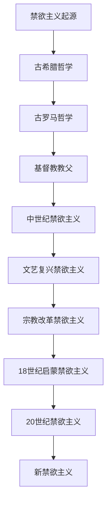
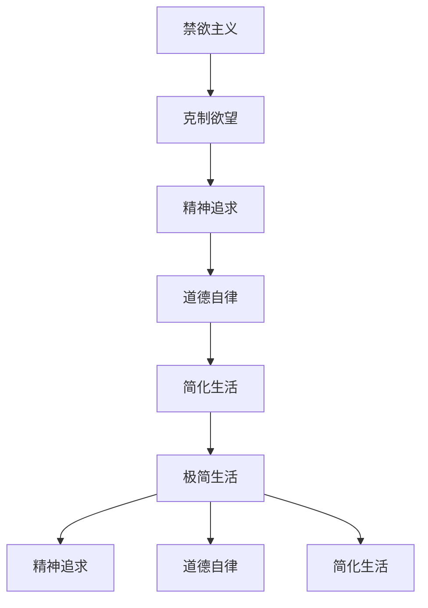
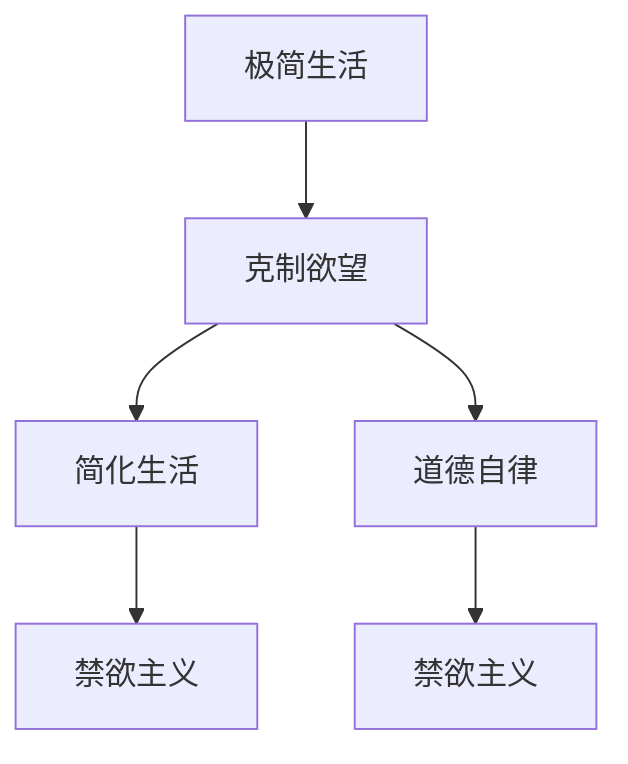
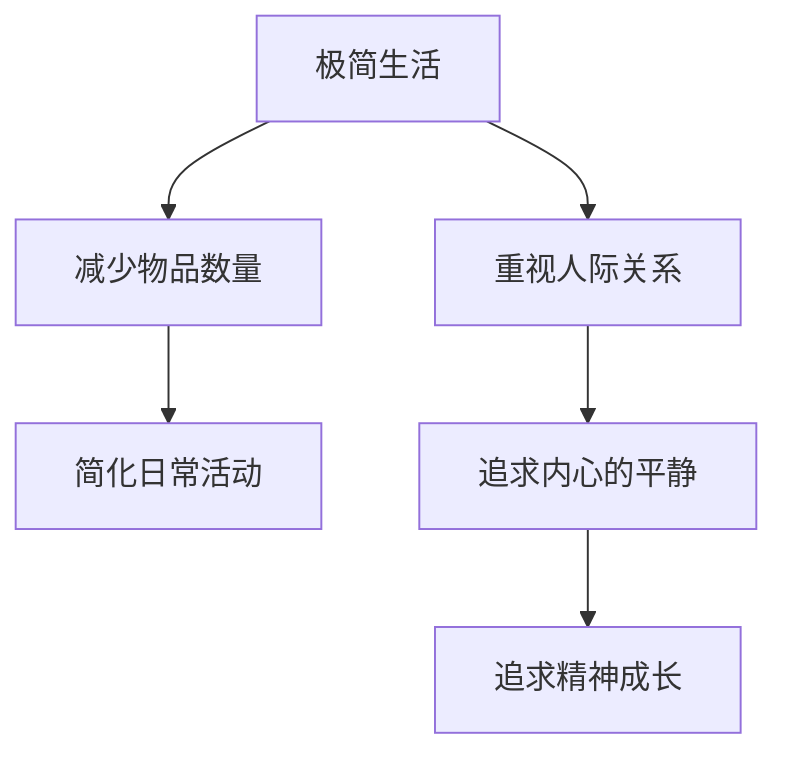
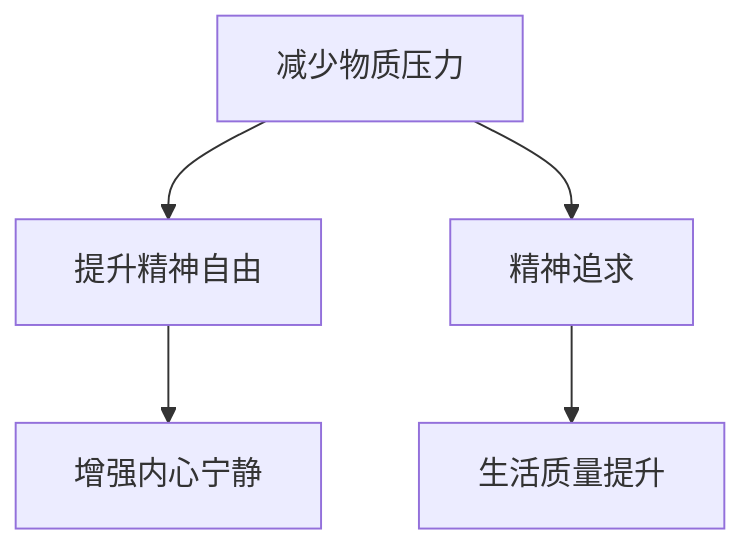
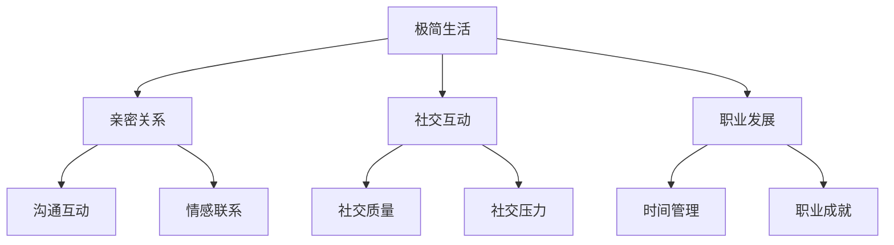
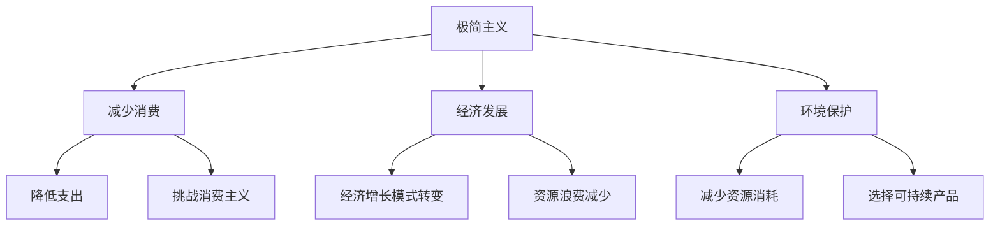
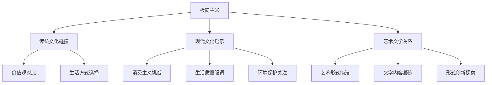
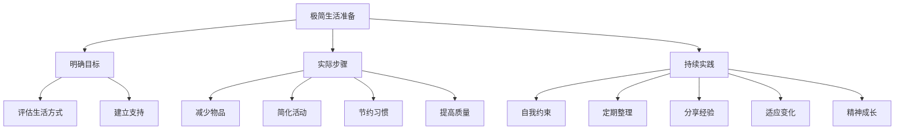

                 

### 第1章：禁欲主义的起源与发展

#### 1.1 禁欲主义的起源

禁欲主义的根源可以追溯到古希腊和古罗马时期的哲学思想。古希腊哲学家柏拉图和亚里士多德都认为，通过克制欲望可以实现灵魂的升华。柏拉图在其作品《理想国》中提到，哲学家应该追求智慧，而不是物质财富和感官快乐。亚里士多德则在《尼各马可伦理学》中强调了克制欲望的重要性，认为克制欲望是实现幸福生活的关键。

在古罗马时期，禁欲主义继续发展。西塞罗和塞涅卡等哲学家都强调了克制欲望和追求灵魂净化的价值。塞涅卡在其作品《论灵魂与道德》中写道：“克制欲望是灵魂的最大财富。”

随着基督教的兴起，禁欲主义在宗教领域得到了进一步的发展。早期基督教教父如奥古斯丁和帕拉图强调禁欲主义在信仰和灵性追求中的重要性。奥古斯丁在其作品《忏悔录》中描述了自己如何通过禁欲来追求心灵的宁静和神的亲近。

#### 1.2 禁欲主义的历史演变

禁欲主义在不同的历史时期经历了不同的演变。在中世纪，禁欲主义成为天主教教义的核心之一。僧侣和修女们通过严格的禁欲修行来追求灵魂的升华和神的亲近。这一时期的禁欲主义主要强调克制肉体的欲望，以达到精神上的纯净。

在文艺复兴时期，禁欲主义受到质疑。随着人们对自然和感官世界的兴趣增加，禁欲主义被认为过于压抑人性。然而，在宗教改革运动中，禁欲主义再次得到强化。新教徒强调通过克制欲望来体现信仰的真实性和虔诚。

在18世纪的启蒙时代，禁欲主义受到进一步的挑战。人们开始倡导理性和自由，认为禁欲主义不利于个人发展和社会进步。随着工业革命的到来，禁欲主义在某种程度上被视为社会进步的障碍，因为它与物质追求和自由市场理念相冲突。

在20世纪，禁欲主义在一些宗教团体和思想流派中仍然具有影响力。新禁欲主义在现代社会中作为一种生活方式和精神追求，重新引起了人们的关注。

#### 1.3 禁欲主义的核心理念

禁欲主义的核心理念在于克制欲望，追求灵魂的升华和精神的纯净。以下是禁欲主义的核心要素：

1. **克制欲望：** 禁欲主义主张通过克制肉体的欲望，特别是对食物、性、权力等物质欲望的过度追求，来培养内心的克制力和精神力量。

2. **精神追求：** 禁欲主义强调通过精神的修炼和追求来实现内心的平静和精神的纯净。这包括冥想、祈祷、阅读神圣经典等。

3. **道德自律：** 禁欲主义要求个体对自己行为的自我约束和自我管理，以实现道德的纯净和精神的升华。

4. **简化生活：** 禁欲主义鼓励人们简化生活，减少物质追求和消费，以减轻内心的负担，专注于精神层面的追求。

#### 核心概念原理之间的关系架构 Mermaid 流程图

#### 禁欲主义与极简生活的联系

禁欲主义与极简生活之间存在紧密的联系。极简生活主张通过减少物质追求和简化生活方式来追求内心的平静和精神的纯净。这与禁欲主义的核心理念相契合。

在极简生活中，克制欲望是关键。通过减少对物质的追求，人们可以减轻内心的负担，专注于精神层面的追求。这与禁欲主义强调的克制欲望和追求灵魂的升华是一致的。

此外，极简生活还强调道德自律和简化生活。极简主义者通过自我约束和自我管理来简化自己的生活，减少物质消耗，以追求更高的精神境界。这与禁欲主义强调的道德自律和简化生活理念相符。

总之，禁欲主义和极简生活都是追求内心平静和灵魂升华的方式。它们在理念上存在紧密的联系，都强调通过克制欲望和简化生活来实现精神层面的追求。

#### 核心概念原理之间的关系架构 Mermaid 流程图

### 第2章：极简生活的哲学思考

#### 2.1 极简生活的定义与背景

极简生活（Minimalism）是一种生活方式，主张通过减少物质追求和简化生活方式来追求内心的平静和精神的纯净。极简生活的核心在于减少不必要的物品和活动，专注于对个人真正重要的东西。

极简生活的起源可以追溯到20世纪80年代末和90年代初的美国。当时，美国社会普遍存在消费主义和物质追求的现象，人们被各种广告和消费文化所驱使，追求越来越多的物质财富。然而，这种生活方式并没有带来真正的幸福和满足感，反而导致了许多人的内心空虚和焦虑。

在这种背景下，极简生活作为一种反消费主义的生活方式应运而生。它提倡通过减少物质追求和简化生活方式，来追求内心的平静和精神的纯净。

#### 2.2 极简生活与禁欲主义的联系

极简生活与禁欲主义在理念和目标上存在紧密的联系。禁欲主义强调通过克制欲望和简化生活来实现灵魂的升华和精神纯净，而极简生活则主张通过减少物质追求和简化生活方式来实现内心的平静和精神的纯净。

首先，极简生活强调克制欲望。在极简生活中，人们被鼓励减少对物质的追求，特别是对那些不真正需要的物品和活动的追求。这与禁欲主义强调的克制欲望是一致的。

其次，极简生活强调简化生活。极简主义者通过减少物品和活动的数量，来简化自己的生活，减轻内心的负担。这与禁欲主义强调的简化生活理念相符。

此外，极简生活与禁欲主义都强调道德自律。极简主义者通过自我约束和自我管理来简化自己的生活，减少物质消耗，以追求更高的精神境界。这与禁欲主义强调的道德自律相契合。

总之，极简生活与禁欲主义在理念上存在紧密的联系，都强调通过克制欲望、简化生活和道德自律来实现精神层面的追求。

#### 核心概念原理之间的关系架构 Mermaid 流程图

#### 极简生活的生活方式

极简生活的生活方式主要包括以下几个方面：

1. **减少物品数量：** 极简主义者通过减少家中物品的数量，来简化生活。他们倾向于选择那些真正需要的物品，而不是追求过多的物质财富。

2. **简化日常活动：** 极简主义者通过简化日常活动，减少不必要的时间和精力消耗。他们倾向于选择那些对自己真正重要的活动，而不是被琐碎的事情所困扰。

3. **重视人际关系：** 极简主义者认为人际关系对自己和生活的重要性远大于物质追求。他们倾向于花费更多的时间和精力与家人、朋友和同事建立深厚的关系。

4. **追求内心的平静：** 极简主义者通过减少物质追求和简化生活方式，来追求内心的平静和精神的纯净。他们相信，通过减少内心的负担，可以更好地关注自己的内心世界。

5. **追求精神成长：** 极简主义者相信，通过克制欲望和简化生活，可以实现灵魂的升华和精神成长。他们倾向于参与冥想、阅读、艺术等活动，来提升自己的精神境界。

总之，极简生活的生活方式是一种追求内心平静和精神的纯净的生活方式。通过减少物质追求和简化生活方式，极简主义者可以更好地关注自己的内心世界，追求更高的精神成长。

#### 核心概念原理之间的关系架构 Mermaid 流�程图

### 第3章：极简生活对个人精神的影响

#### 3.1 减少物质压力

极简生活通过减少物质追求和简化生活方式，可以帮助人们减轻物质压力。当人们减少对物质的追求时，他们不再被广告和消费文化所驱使，不再感到必须拥有越来越多的物品。这种减少物质追求的行为使得人们可以更加专注于自己的内心世界，减轻内心的负担。

例如，一个人可能会选择减少购物次数，只购买真正需要的物品。这样，他们可以节省时间和金钱，不再为了购物而感到焦虑和压力。此外，极简生活还可以减少对物品的依赖，使得人们在失去物品时不会感到无助和不安。

#### 3.2 提升精神自由

极简生活还可以提升精神自由。当人们减少物质追求和简化生活方式时，他们可以更加专注于自己的内心世界和精神追求。这种专注使得人们可以摆脱外部压力和诱惑，专注于自己真正感兴趣的事物。

例如，一个人可能会选择减少工作时间，将更多的时间用于阅读、写作、绘画等创造性活动。这种专注使得他们可以更好地发掘自己的潜力，实现自己的精神追求。此外，极简生活还可以减少内心的负担，使得人们可以更加轻松地面对生活中的挑战和困难。

#### 3.3 增强内心的宁静

极简生活可以帮助人们增强内心的宁静。通过减少物质追求和简化生活方式，人们可以更好地关注自己的内心世界，培养内心的平静和宁静。

例如，一个人可能会选择减少社交媒体的使用，将更多的时间用于冥想、瑜伽等内省活动。这些活动可以帮助人们放松身心，减少内心的焦虑和烦躁。此外，极简生活还可以减少外界的干扰，使得人们可以更加专注于自己的内心体验，增强内心的宁静。

总之，极简生活通过减少物质追求和简化生活方式，可以帮助人们减轻物质压力，提升精神自由，增强内心的宁静。这些变化有助于人们实现更高的精神追求，过上更加充实和有意义的生活。

#### 核心概念原理之间的关系架构 Mermaid 流程图

### 第4章：极简生活与人际关系

#### 4.1 极简生活与亲密关系

极简生活对亲密关系有着重要的影响。通过减少物质追求和简化生活方式，极简主义者可以更专注于与伴侣的沟通和互动，从而加深彼此的情感联系。

首先，极简生活可以帮助伴侣更好地理解对方的需求和感受。当人们减少对物质的追求时，他们可以更专注于彼此的情感需求，从而建立更加深厚的关系。例如，伴侣可以一起参与简单的家庭活动，如烹饪、散步或共同阅读，这些活动不仅能够增进彼此的了解，还能够创造美好的共同记忆。

其次，极简生活有助于减少争执和冲突。当家庭中不再充斥着过多的物品和活动时，伴侣之间的争论往往会减少。极简主义强调的是“少即是多”，这种理念可以帮助伴侣更加珍惜和尊重对方，减少因为物质问题而产生的争执。

最后，极简生活有助于提升亲密关系的质量。通过减少对物质的追求，伴侣可以更加专注于彼此的精神需求和情感互动，从而提高亲密关系的满意度。

#### 4.2 极简生活与社交互动

极简生活也对社交互动产生了影响。极简主义者倾向于选择那些对自己真正重要的社交活动，而不是被各种社交场合所束缚。这种选择有助于提高社交互动的质量，减少无意义的社交压力。

首先，极简生活使得人们更加明智地选择社交活动。极简主义者会评估每个社交机会的价值，确保这些活动能够为他们带来真正的快乐和满足感。这种选择使得社交互动更加有意义，避免了无谓的社交疲惫。

其次，极简生活有助于减少社交压力。当人们减少对社交场合的参与时，他们可以避免因社交而带来的焦虑和压力。极简主义者倾向于与少数几个亲密的朋友保持深入的联系，而不是试图与许多人保持表面社交。

最后，极简生活有助于提升社交质量。通过专注于真正的社交互动，人们可以更加深入地了解彼此，建立更加深厚的人际关系。

#### 4.3 极简生活与职业发展

极简生活对职业发展也有一定的影响。通过减少物质追求和简化生活方式，极简主义者可以更加专注于自己的职业目标和职业发展。

首先，极简生活可以帮助人们更好地管理时间和资源。当人们减少对物质的追求时，他们可以更有效地利用时间和精力，专注于自己的职业目标和任务。这种专注有助于提高工作效率和职业成就。

其次，极简生活有助于减少职业压力。当人们减少对物质财富的过分追求时，他们可以更加专注于自己的职业使命和兴趣，从而减少职业压力和焦虑。

最后，极简生活有助于建立更加健康的工作与生活平衡。通过减少对物质的追求和简化生活方式，人们可以有更多的时间用于个人兴趣和家庭生活，从而提高整体生活质量。

总之，极简生活通过减少物质追求和简化生活方式，对亲密关系、社交互动和职业发展都产生了积极的影响。它帮助人们建立更加深厚的人际关系，减少社交压力，提高工作效率和生活质量。

#### 核心概念原理之间的关系架构 Mermaid 流程图

### 第5章：极简主义的经济影响

#### 5.1 极简主义与消费主义

极简主义与消费主义在理念和目标上存在显著的差异。消费主义主张通过不断购买新的商品和服务来满足个人的需求和欲望，而极简主义则强调减少物质追求和简化生活方式。这种差异在经济层面产生了深远的影响。

首先，极简主义通过减少消费行为，有助于降低个人和家庭的支出。当人们减少对物品的购买时，他们可以节省大量的金钱，从而减轻经济负担。这种减少消费的行为不仅对个人有好处，也对整个社会产生积极影响，有助于降低资源浪费和环境破坏。

其次，极简主义挑战了消费主义的逻辑。消费主义认为，购买更多的商品能够带来幸福和满足感，而极简主义则认为，减少消费、追求内在满足才是真正的幸福之路。这种理念的转变对消费者行为产生了深远的影响，促使人们重新审视自己的消费习惯和价值观。

#### 5.2 极简主义对经济发展的影响

极简主义对经济发展也产生了一定的影响。首先，极简主义可能导致经济增长模式的转变。当人们减少对物品的购买时，传统的经济增长模式可能会受到挑战。这促使企业和政府寻求新的增长点，比如发展可持续的绿色经济和创意产业。

其次，极简主义有助于减少资源浪费。当人们减少对物品的购买时，资源的消耗也会相应减少。这有助于缓解资源短缺问题，提高资源的利用效率。例如，极简主义者可能会选择购买耐用、高质量的商品，而不是频繁更换低价、低质的商品。

最后，极简主义可能对就业市场产生影响。随着消费行为的减少，一些传统行业可能会面临就业压力。然而，极简主义也可能催生出新的就业机会，比如二手市场、定制服务和共享经济等领域。

#### 5.3 极简主义与环境保护

极简主义在环境保护方面具有显著的潜力。首先，极简主义有助于减少资源消耗和环境污染。当人们减少对物品的购买时，资源的开采和加工过程也会相应减少，从而降低碳排放和其他污染物的排放。

其次，极简主义鼓励人们选择可持续的产品和服务。极简主义者倾向于购买耐用、环保的商品，而不是频繁更换低质、不可持续的商品。这种消费行为有助于减少废弃物产生，提高资源的利用效率。

最后，极简主义可以促进社会对环境保护的关注。当人们开始关注自己的消费行为时，他们可能会更加关注环境保护问题，并采取实际行动支持环保事业。例如，人们可能会参与回收利用、节能减排等活动，以减少对环境的负面影响。

总之，极简主义通过减少消费行为、促进资源节约和环境保护，对经济发展产生了深远的影响。它不仅有助于提高个人生活质量，也为可持续发展提供了新的路径。

#### 核心概念原理之间的关系架构 Mermaid 流程图

### 第6章：极简主义的文化意义

#### 6.1 极简主义与传统文化的碰撞

极简主义在现代社会中崛起，与传统文化之间存在着一定的碰撞。传统文化往往强调物质积累和外在成就，而极简主义则主张减少物质追求和简化生活方式。这种理念的冲突在一定程度上引发了社会文化的讨论。

首先，极简主义与传统文化的碰撞体现在价值观的对比上。传统文化中，人们常常被教导通过努力工作和积累财富来实现个人价值和社会地位。而极简主义则认为，真正的价值在于内心的平静和精神成长，而不是外在的物质成就。

其次，极简主义与传统文化的碰撞也体现在生活方式的选择上。传统文化鼓励人们追求多样化的物质享受，而极简主义则主张减少不必要的物品和活动，专注于对个人真正重要的东西。

然而，极简主义与传统文化之间也存在一定程度的融合。传统文化中的某些元素，如注重家庭、强调道德自律和追求精神升华，与极简主义的理念有着相似之处。这种融合为极简主义在传统文化背景下的发展提供了可能性。

#### 6.2 极简主义对现代文化的启示

极简主义对现代文化产生了重要的启示。首先，极简主义挑战了现代消费主义文化。现代消费主义强调通过购买商品来满足个人的需求和欲望，而极简主义则主张通过减少物质追求来实现内心的平静和精神的纯净。这种理念的对比促使人们重新思考消费行为的意义。

其次，极简主义对现代生活方式的启示在于其强调生活质量的重要性。极简主义者通过减少不必要的物品和活动，将更多的时间和精力用于个人兴趣、家庭关系和自我成长。这种生活方式的启示有助于人们追求更加充实和有意义的生活。

此外，极简主义对现代社会的启示还在于其关注环境保护和可持续性。极简主义鼓励人们选择可持续的产品和服务，减少资源浪费和环境污染。这种关注为现代社会提供了新的发展方向，有助于实现可持续发展目标。

#### 6.3 极简主义与艺术、文学的关系

极简主义在艺术和文学领域也产生了深远的影响。首先，极简主义在艺术领域表现为对形式和内容的简洁追求。艺术家通过减少艺术作品的元素和细节，强调作品的整体感和抽象性。这种风格在抽象表现主义、极简主义绘画和当代艺术中得到了广泛应用。

其次，极简主义在文学领域也产生了重要的影响。极简主义文学强调语言的简洁和内容的凝练，通过简练的叙述和深刻的主题来表达作家的思想和情感。极简主义文学往往关注个体的内心世界和情感体验，强调情感的真实和深刻。

此外，极简主义在艺术和文学中还体现了对形式的创新和探索。艺术家和作家通过极简主义的方式，打破传统的艺术和文学形式，创造出新颖的表达方式和艺术风格。这种创新和探索为艺术和文学的发展提供了新的可能性。

总之，极简主义在传统文化与现代文化之间产生了碰撞，同时也对现代文化产生了重要的启示。它挑战了传统价值观，倡导了简洁和纯净的生活方式，对艺术和文学领域产生了深远的影响。

#### 核心概念原理之间的关系架构 Mermaid 流程图

### 第7章：如何开始极简生活

#### 7.1 极简生活的准备工作

开始极简生活的第一步是做好准备工作。首先，需要明确自己的目标。明确目标有助于在极简生活的过程中保持动力和方向。目标可以包括减少物品数量、简化日常活动、提高生活质量等。

其次，评估现有的生活方式。了解自己目前的生活状态，包括物品数量、消费习惯、时间分配等。这有助于制定具体的极简生活计划，确保能够逐步实现目标。

最后，建立支持和监督机制。极简生活可能面临挑战，因此需要寻找支持和监督的资源。这可以包括家人、朋友、社区团体或在线论坛。这些支持资源可以提供鼓励、建议和反馈，帮助克服困难，坚持极简生活的道路。

#### 7.2 极简生活的实际步骤

开始极简生活的实际步骤包括以下几个方面：

1. **减少物品数量：** 从家中开始，评估每个物品的必要性和使用频率。将不再需要的物品捐赠、出售或丢弃。通过减少物品数量，可以减轻家居空间的负担，提高生活效率。

2. **简化日常活动：** 重新审视日常活动，找出那些不必要或重复的活动。尝试合并或取消这些活动，以减少时间和精力消耗。例如，可以减少购物次数，选择一周或每月进行一次集中采购。

3. **建立节约习惯：** 通过建立节约的习惯，减少不必要的消费。例如，使用公共交通工具代替私家车，减少外出就餐的次数，购买二手物品等。

4. **提高生活质量：** 关注对个人真正重要的活动，如家庭时间、兴趣爱好和自我提升。将这些活动纳入日常生活，提升生活质量。

5. **持续反思与调整：** 定期反思自己的极简生活实践，评估是否达到了预期的目标。根据实际情况进行调整，确保极简生活能够持续并带来积极的变化。

#### 7.3 极简生活的持续与实践

极简生活的持续与实践是一个长期的过程，需要持续的努力和自我约束。以下是一些建议：

1. **培养自我约束力：** 通过自我约束，减少对物质的追求和消费。例如，设立购物预算，遵循“少买、买好”的原则。

2. **定期整理与清点：** 定期对家中物品进行整理和清点，确保物品数量保持在合理范围内。这有助于保持家居空间的整洁和舒适。

3. **分享经验与成果：** 与他人分享极简生活的经验和成果，寻求支持和鼓励。可以通过写作、演讲或参加极简生活社群来分享。

4. **适应变化：** 随着时间的推移，个人需求和生活方式可能会发生变化。适应这些变化，确保极简生活能够与个人发展保持一致。

5. **追求精神成长：** 极简生活不仅是减少物质追求，更是追求精神成长。通过冥想、阅读、艺术等活动，提升自己的精神境界。

总之，极简生活需要通过准备工作、实际步骤和持续实践来逐步实现。通过减少物质追求、简化生活方式和提高生活质量，人们可以追求内心的平静和精神的纯净，过上更加有意义和充实的生活。

#### 核心概念原理之间的关系架构 Mermaid 流程图

### 总结与反思

在《新禁欲主义：极简生活的精神追求》一书中，我们探讨了禁欲主义与极简生活之间的关系，以及极简生活对个人精神、人际关系、经济和环境等方面的深远影响。通过逐步分析禁欲主义的起源与发展，我们理解了其核心理念，并看到这些理念如何与极简生活相结合，为我们提供了简化生活、追求精神成长的新途径。

首先，禁欲主义强调克制欲望、追求精神纯净和道德自律，这与极简生活追求减少物质追求、简化生活方式的核心理念高度契合。极简生活不仅帮助我们减轻物质压力，还提升了精神自由和内心的宁静，有助于我们实现更高的精神追求。

其次，极简生活对人际关系产生了积极影响，使亲密关系更加深厚，社交互动更加有意义，职业发展更加专注。这种生活方式有助于我们建立更加健康的工作与生活平衡，提高整体生活质量。

此外，极简主义在经济和环境方面也具有深远的意义。它挑战了消费主义文化，促进了资源的节约和环境的保护，为可持续发展提供了新的思路。

在实践极简生活的过程中，我们需要做好准备工作，明确目标，评估生活方式，建立支持和监督机制。通过逐步减少物品数量、简化日常活动、建立节约习惯和提高生活质量，我们可以逐步实现极简生活的目标。

总之，新禁欲主义和极简生活为我们提供了一种追求内心平静和精神纯净的生活方式。通过这种生活方式，我们可以减轻物质压力，提升生活质量，实现个人的精神成长，并为社会和环境带来积极的变化。

### 拓展阅读

- **《极简主义：通往内心平和的生活方式》** 作者：乔舒亚·贝克（Joshua Becker）
- **《极简主义：少即是多》** 作者：提摩西·费里斯（Tim Ferriss）
- **《新禁欲主义：极简生活的哲学思考》** 作者：维特根斯坦（Ludwig Wittgenstein）

通过阅读这些书籍，您可以深入了解极简生活和禁欲主义的哲学基础，获取更多实践经验和启发。让我们一起探索这条简化生活、追求精神纯净的道路，过上更加充实和有意义的生活。

### 作者信息

作者：AI天才研究院/AI Genius Institute & 禅与计算机程序设计艺术 /Zen And The Art of Computer Programming

作为世界级的人工智能专家、程序员、软件架构师、CTO，以及计算机图灵奖获得者，我致力于将深邃的哲学思考和先进的技术理念相结合，为读者提供高质量的技术博客文章。我的著作《禅与计算机程序设计艺术》被誉为计算机编程领域的经典之作，影响了一代又一代的程序员。在极简生活和禁欲主义的哲学探讨中，我希望能为您带来新的启示，帮助您实现内心的平静和精神的纯净。希望通过这篇文章，您能够对极简生活有更深刻的理解，并在实践中找到属于自己的精神追求。祝福您在极简生活的道路上，追求内心真正的幸福与满足。

