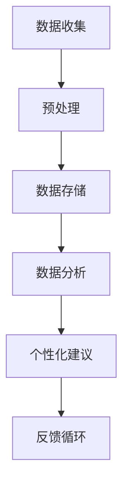
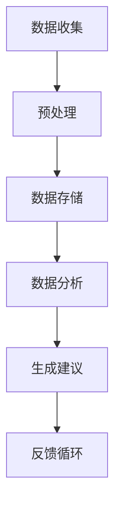

                 

### 文章标题

《新禅宗2.0修行中心：数字时代的现代化禅修场所》

### 关键词

- 新禅宗2.0
- 禅修
- 数字技术
- 现代化修行场所
- 虚拟现实
- 人工智能
- 社区互动

### 摘要

本文旨在探讨新禅宗2.0修行中心的理念与实践，这是一个在数字时代背景下，融合传统禅修智慧与现代科技的现代化修行场所。文章首先介绍了新禅宗2.0的起源和核心概念，随后分析了禅修与数字技术结合的必然性。接着，文章详细探讨了虚拟现实、人工智能等技术在禅修中的应用，并介绍了现代化禅修场所的设计原则与实施方法。通过实际案例的研究，文章展示了新禅宗2.0修行中心的成效与未来发展方向。最终，文章展望了新禅宗2.0在数字时代的社会文化变革中的潜在影响。

---

### 目录大纲

#### 第一部分：引言

1. 新禅宗2.0概述
   - 1.1 什么是新禅宗2.0
   - 1.2 禅修与数字技术的结合
   - 1.3 新禅宗2.0的愿景和目标

2. 历史背景
   - 2.1 禅宗的起源与发展
   - 2.2 传统禅修场所的特点
   - 2.3 禅宗在现代社会中的复兴

3. 新禅宗2.0的架构
   - 3.1 核心概念
   - 3.2 组成部分
   - 3.3 技术基础

#### 第二部分：数字技术在禅修中的应用

1. 虚拟现实在禅修中的应用
   - 1.1 虚拟现实技术简介
   - 1.2 虚拟现实与禅修的结合
   - 1.3 虚拟现实禅修的应用案例

2. 人工智能与禅修
   - 2.1 人工智能技术简介
   - 2.2 人工智能与禅修的结合
   - 2.3 人工智能禅修的应用案例

3. 互联网与禅修社区
   - 3.1 互联网技术简介
   - 3.2 互联网与禅修社区的关系
   - 3.3 禅修社区的发展趋势

#### 第三部分：现代化禅修场所的设计与实施

1. 设计原则
   - 1.1 环境与氛围
   - 1.2 硬件与软件
   - 1.3 用户体验

2. 实施方法
   - 2.1 项目规划
   - 2.2 预算与管理
   - 2.3 维护与运营

3. 现代化禅修场所案例分析
   - 3.1 案例一：XX现代化禅修中心
   - 3.2 案例二：YY禅修社区
   - 3.3 案例三：ZZ禅修体验馆

#### 第四部分：未来展望

1. 技术进步的影响
   - 1.1 虚拟现实与人工智能的发展
   - 1.2 数字技术与禅修的深度融合

2. 社会文化变革
   - 2.1 新禅宗2.0对社会文化的影响
   - 2.2 数字时代禅修的传播与普及

3. 新禅宗2.0的潜在影响
   - 3.1 个人层面的影响
   - 3.2 社会层面的影响

### 引言

#### 1.1 什么是新禅宗2.0

新禅宗2.0（Neo-Tendai Buddhism 2.0）是一种结合了传统禅修智慧与现代数字技术的修行方式。它起源于21世纪初期，随着虚拟现实（VR）、人工智能（AI）等数字技术的发展，逐渐成为了一个独特的修行领域。新禅宗2.0的目标是通过数字技术，创造出一种更加现代化、便捷和高效的修行环境，让更多人能够轻松地接触并实践禅修。

禅修，作为一种古老的心灵修炼方法，起源于印度，后传入中国，形成了独特的禅宗文化。禅修的核心在于通过冥想、专注和内观等手段，达到内心的宁静与觉醒。然而，传统的禅修方式往往需要长时间的静坐和深入的山林环境，这在现代社会中变得尤为困难。

新禅宗2.0的诞生，正是为了解决这一问题。它利用虚拟现实技术，构建出一个模拟的山林、寺庙等环境，让修行者可以在家中通过VR设备体验禅修，而无需亲临现场。同时，人工智能技术也被引入到禅修中，通过数据分析、智能推荐等方式，帮助修行者更好地了解自己的修行状态，提高禅修效果。

#### 1.2 禅修与数字技术的结合

禅修与数字技术的结合，是数字时代的一个必然趋势。虚拟现实技术为禅修提供了一个全新的平台，它能够模拟出各种修行环境，使修行者能够在不同的场景中进行禅修，从而提高禅修的多样性和灵活性。例如，VR技术可以模拟出山林、寺庙、海景等不同的环境，让修行者体验到不同的禅修场景，从而丰富禅修体验。

人工智能技术在禅修中的应用更加深入。通过人工智能，修行者可以实时获取自己的禅修数据，包括心跳、呼吸、心理状态等，这些数据可以帮助修行者更好地了解自己的修行状态，调整禅修方法。此外，人工智能还可以根据修行者的数据，提供个性化的禅修建议，帮助修行者更高效地达到禅修目标。

互联网技术的应用，使得禅修社区得以建立。修行者可以通过互联网平台，与其他修行者交流心得，分享禅修经验，形成一个强大的禅修社区。这种社区互动，不仅能够提高修行者的积极性，还能够促进禅修文化的传播。

#### 1.3 新禅宗2.0的愿景和目标

新禅宗2.0的愿景是创建一个数字化、现代化的禅修场所，让每个人都能轻松地接触禅修，享受禅修带来的内心宁静和觉醒。其目标包括：

1. **普及禅修**：通过数字技术，降低禅修的门槛，让更多人能够了解并实践禅修。

2. **提高禅修效率**：利用人工智能技术，为修行者提供个性化的禅修建议，提高禅修效果。

3. **增强社区互动**：通过互联网技术，建立禅修社区，促进修行者之间的交流与合作。

4. **传承禅宗文化**：将禅宗的智慧与现代科技相结合，传承和发扬禅宗文化。

总之，新禅宗2.0修行中心是一个在数字时代背景下，融合传统禅修智慧与现代科技的现代化修行场所，它不仅为修行者提供了一个便捷、高效的修行环境，也为禅宗文化在现代社会中的传承和发展提供了新的思路和途径。

### 历史背景

#### 2.1 禅宗的起源与发展

禅宗，又称为禅那宗或禅宗佛教，起源于印度，后传入中国，成为汉传佛教的一个重要分支。禅宗的起源可以追溯到公元前5世纪至前3世纪的古代印度。当时，释迦牟尼佛通过冥想和内观，达到了内心的觉悟，创立了佛教。随后，佛教逐渐传播到中国，与中国传统文化相互融合，形成了独特的禅宗文化。

禅宗的发展历程可以分为几个阶段：

1. **北魏时期**：禅宗传入中国后，最早在北魏时期得到发展。当时，许多修行者通过静坐冥想，追求内心的平静和觉悟。

2. **隋唐时期**：隋唐时期是禅宗的鼎盛时期。禅宗各大派系纷纷兴起，如慧能的南宗禅、神秀的北宗禅等。这一时期，禅宗思想得到广泛传播，对后世产生了深远的影响。

3. **宋元时期**：宋元时期，禅宗继续发展，出现了一些重要的禅宗大师，如禅宗八宗之一的曹洞宗创始人洞山良价。这一时期，禅宗思想进一步深化，形成了独特的禅宗文化。

4. **明清时期**：明清时期，禅宗逐渐走向衰落。虽然仍有禅宗大师出现，但禅宗的影响力已大不如前。

5. **现代时期**：20世纪以来，随着佛教的复兴，禅宗再次受到关注。许多修行者和学者开始研究禅宗思想，并将其应用于现代社会中。

#### 2.2 传统禅修场所的特点

传统禅修场所，通常是指寺庙、山林、洞穴等具有宁静氛围的地方。这些地方被认为是修行者进行禅修的最佳场所，因为它们能够提供一种与世隔绝的环境，使修行者能够集中精力进行修行。

传统禅修场所的特点包括：

1. **宁静的环境**：传统禅修场所通常位于远离城市喧嚣的自然环境中，如山林、寺庙等。这种宁静的环境有助于修行者平静内心，集中精力进行禅修。

2. **简洁的设施**：传统禅修场所的设施通常非常简洁，如简单的房间、床铺等。这种简洁的环境有助于修行者减少外界干扰，专注于禅修。

3. **修行者的自律**：在传统禅修场所，修行者需要遵守严格的修行规则，如早起、晚睡、素食等。这种自律的生活方式有助于修行者培养内心的坚韧和毅力。

4. **导师的指导**：在传统禅修场所，修行者通常会有导师的指导。导师会根据修行者的状态，提供相应的修行方法和指导，帮助修行者更好地进行禅修。

#### 2.3 禅宗在现代社会中的复兴

随着现代社会的发展，人们的生活节奏越来越快，压力越来越大。许多人开始寻求一种能够帮助他们缓解压力、获得内心平静的方法。禅宗作为一种古老的修行方法，因其简单易行、效果显著，逐渐受到现代人的青睐。

禅宗在现代社会中的复兴表现在以下几个方面：

1. **禅修课程的普及**：许多城市开始开设禅修课程，让更多人有机会了解并实践禅修。这些课程通常包括冥想、呼吸练习、身体放松等，旨在帮助人们缓解压力、提高生活质量。

2. **禅修社区的建立**：随着人们对禅修的兴趣增加，禅修社区也逐渐建立起来。这些社区为修行者提供了一个交流和学习的机会，使他们能够相互支持、共同进步。

3. **禅宗文化的传播**：随着互联网的发展，禅宗文化开始在全球范围内传播。许多禅宗大师的著作被翻译成多种语言，禅修的方法和心得也被分享到世界各地。

4. **禅宗与现代科技的结合**：新禅宗2.0的兴起，标志着禅宗与现代科技的结合。通过虚拟现实、人工智能等技术，禅修被赋予了新的形式和内涵，使更多人能够轻松地接触和参与禅修。

总之，禅宗在现代社会中的复兴，不仅为人们提供了一种缓解压力、获得内心平静的方法，也为传统文化在现代社会中的传承和发展提供了新的思路和途径。

### 新禅宗2.0的架构

#### 3.1 核心概念

新禅宗2.0是一种结合了传统禅修智慧与现代数字技术的修行方式。其核心概念包括：

1. **数字化修行**：通过数字技术，将传统的禅修方法进行数字化改造，使其更加便捷和高效。例如，利用虚拟现实技术，创造一个模拟的禅修环境，使修行者可以在家中进行禅修。

2. **数据驱动修行**：通过人工智能技术，对修行者的数据进行实时分析和处理，提供个性化的修行建议。例如，通过监测修行者的心跳、呼吸等生理数据，分析其修行状态，提供相应的修行指导。

3. **社区化修行**：通过互联网技术，建立一个禅修社区，让修行者能够相互交流、分享修行心得，形成一种互助互学的修行氛围。

#### 3.2 组成部分

新禅宗2.0的架构主要包括以下几个组成部分：

1. **虚拟现实（VR）技术**：虚拟现实技术是新禅宗2.0的重要组成部分，它为修行者提供了一个模拟的禅修环境。通过VR头盔、手柄等设备，修行者可以进入一个虚拟的寺庙、山林或海景环境，进行禅修。

2. **人工智能（AI）技术**：人工智能技术用于分析和处理修行者的数据，提供个性化的修行建议。例如，通过分析修行者的心跳、呼吸等生理数据，可以了解其修行状态，提供相应的修行指导。

3. **互联网技术**：互联网技术用于建立一个禅修社区，让修行者能够相互交流、分享修行心得。例如，通过在线论坛、社交媒体等平台，修行者可以分享自己的禅修经历，互相鼓励和支持。

4. **智能设备**：智能设备是新禅宗2.0的重要组成部分，包括智能手环、智能手表等，用于实时监测修行者的生理数据，并将其传输到云端进行分析和处理。

#### 3.3 技术基础

新禅宗2.0的技术基础主要包括以下几个方面：

1. **云计算**：云计算为新禅宗2.0提供了强大的数据处理能力。通过云计算，可以实时处理修行者的数据，提供个性化的修行建议。

2. **大数据**：大数据技术用于收集、存储和分析修行者的数据。通过大数据分析，可以了解修行者的修行状态，发现其中的规律和趋势。

3. **物联网**：物联网技术用于连接各种智能设备，实现数据的实时传输和共享。例如，通过物联网，可以将智能手环、智能手表等设备的数据传输到云端进行分析和处理。

4. **区块链**：区块链技术用于确保数据的真实性和安全性。通过区块链技术，可以建立一个去中心化的数据存储系统，确保数据的真实性和安全性。

总之，新禅宗2.0的架构是一个集成了虚拟现实、人工智能、互联网、云计算、大数据、物联网和区块链等技术的综合体，它为修行者提供了一个便捷、高效、安全、个性化的禅修平台。

### 数字技术在禅修中的应用

#### 4.1 虚拟现实在禅修中的应用

虚拟现实（VR）技术在禅修中的应用，为修行者提供了一个全新的修行环境。通过VR设备，修行者可以进入一个模拟的山林、寺庙或海景等环境，进行禅修。这种虚拟环境不仅能够提供与真实环境相似的感觉，还能够根据修行者的需求进行调整，从而提高禅修的效果。

1. **模拟环境**：VR技术可以创建一个高度仿真的禅修环境，让修行者仿佛置身于大自然之中。这种沉浸式的体验有助于修行者放松身心，集中精力进行禅修。

2. **个性化调整**：VR环境可以根据修行者的需求进行个性化调整。例如，如果修行者喜欢宁静的环境，可以设置一个宁静的寺庙；如果修行者喜欢动态的环境，可以设置一个流水的山林。这种个性化调整有助于修行者找到最适合自己的禅修方式。

3. **心理治疗**：VR技术在心理治疗中也有广泛的应用。通过模拟的环境，可以帮助修行者处理焦虑、抑郁等心理问题。例如，对于有创伤后应激障碍（PTSD）的修行者，可以通过VR技术模拟安全的场景，逐步消除其恐惧和焦虑。

#### 4.2 人工智能与禅修

人工智能（AI）技术在禅修中的应用，为修行者提供了个性化的修行建议和数据分析。通过AI技术，可以实时监测修行者的生理和心理状态，分析其禅修效果，并提供相应的建议。

1. **生理数据监测**：AI技术可以实时监测修行者的心跳、呼吸等生理数据，分析其禅修状态。例如，通过心率变异性分析，可以了解修行者的身心平衡状态。如果数据异常，AI系统会发出警报，提醒修行者进行调整。

2. **心理状态分析**：AI技术还可以通过语言、表情等分析修行者的心理状态。例如，通过自然语言处理技术，可以分析修行者在禅修过程中的语言表达，了解其心理状态。如果发现修行者情绪低落或焦虑，AI系统会提供相应的心理辅导。

3. **个性化建议**：基于对修行者数据的分析，AI系统可以提供个性化的禅修建议。例如，如果AI系统发现修行者在某个禅修阶段效果不佳，会建议其调整禅修方法或环境。

#### 4.3 互联网与禅修社区

互联网技术在禅修社区中的应用，为修行者提供了一个交流和学习的平台。通过互联网，修行者可以与其他修行者交流心得，分享禅修经验，形成一个强大的禅修社区。

1. **在线禅修课程**：互联网平台可以提供在线禅修课程，让修行者随时随地学习禅修知识。这种便捷的学习方式，有助于修行者更好地理解和实践禅修。

2. **禅修论坛**：禅修论坛为修行者提供了一个交流心得、分享经验的平台。修行者可以在论坛上提问、讨论，获得其他修行者的建议和支持。

3. **社交媒体**：通过社交媒体，修行者可以分享自己的禅修心得和感悟，扩大禅修的影响力。同时，社交媒体也为修行者提供了一个获取新知识、新经验的渠道。

总之，数字技术在禅修中的应用，为修行者提供了一个便捷、高效、个性化的修行平台。通过虚拟现实、人工智能和互联网等技术，禅修被赋予了新的形式和内涵，使更多人能够轻松地接触和参与禅修。

### 现代化禅修场所的设计与实施

#### 5.1 设计原则

设计现代化禅修场所时，需要遵循以下原则：

1. **宁静与舒适**：禅修场所的设计应以宁静和舒适为主，创造一个有利于禅修的环境。这包括选择适宜的地理位置，避免噪音和干扰，以及采用柔和的照明和色调。

2. **隐私与安全**：为修行者提供一个私密的空间，确保他们在禅修过程中不受外界干扰。同时，保障场所的安全，防止意外事故的发生。

3. **多功能性**：现代化禅修场所应具备多功能性，能够适应不同的禅修活动和课程。例如，设置冥想室、瑜伽室、教学区等，满足不同修行者的需求。

4. **生态环保**：在设计过程中，应考虑到生态环保，采用绿色建筑材料，节约能源，减少对环境的影响。

5. **智能化**：引入智能化设备，如智能音响、智能灯光、智能温控系统等，提高禅修场所的舒适度和便利性。

#### 5.2 环境与氛围的营造

环境与氛围的营造是现代化禅修场所设计的关键。以下是一些具体的建议：

1. **自然元素**：融入自然元素，如水景、绿化、石头等，创造一个接近自然的环境。这些自然元素有助于修行者放松身心，更好地进入禅修状态。

2. **色彩运用**：选择柔和、宁静的色彩，如淡蓝色、淡绿色等，创造一个舒适、放松的空间。色彩对人的情绪有重要影响，柔和的色彩有助于减轻压力。

3. **音乐与声音**：利用音乐和自然声音，如流水声、风声、鸟鸣等，创造一个和谐、宁静的氛围。音乐和声音对于调节情绪、帮助冥想非常重要。

4. **香气**：采用适当的香气，如薰衣草、柠檬、檀香等，有助于放松身心，提高禅修效果。香气的选择应根据修行者的喜好和需求进行调整。

#### 5.3 硬件与软件的选择

现代化禅修场所的硬件与软件选择至关重要，以下是一些具体建议：

1. **硬件设备**：
   - **智能音响**：用于播放音乐和自然声音，创造一个和谐、宁静的氛围。
   - **智能灯光**：用于调节照明，创造一个舒适的环境。智能灯光可以自动调节亮度，根据时间和天气自动调整。
   - **智能温控系统**：用于调节室内温度，保持一个适宜的禅修环境。
   - **VR设备**：用于模拟禅修环境，提高禅修的沉浸感。

2. **软件应用**：
   - **禅修APP**：提供各种禅修课程和指导，帮助修行者进行日常禅修。
   - **数据分析软件**：用于收集和分析修行者的生理和心理数据，提供个性化的禅修建议。
   - **社区平台**：用于建立禅修社区，促进修行者之间的交流和互动。

#### 5.4 实施方法

现代化禅修场所的实施方法主要包括以下几个步骤：

1. **需求分析**：了解修行者的需求和期望，确定禅修场所的功能和规模。

2. **场地选择**：选择一个适宜的场地，如地理位置优越、环境宁静的地方。

3. **设计规划**：根据需求分析，制定详细的设计规划，包括场地布局、设施配置等。

4. **施工建设**：按照设计规划，进行禅修场所的施工建设，包括场地准备、设备安装等。

5. **测试与调试**：完成建设后，进行全面的测试和调试，确保设施的正常运行。

6. **运营维护**：正式运营后，定期进行维护和更新，确保禅修场所的正常运行和良好的用户体验。

#### 5.5 维护与运营

维护与运营是现代化禅修场所持续发展的关键。以下是一些具体的建议：

1. **定期检查**：定期对场所的设施进行检查和维护，确保其正常运行。

2. **用户反馈**：收集用户反馈，了解他们的需求和意见，不断优化禅修场所的服务。

3. **课程更新**：定期更新禅修课程，引入新的教学方法和技术，保持课程的多样性和吸引力。

4. **社区活动**：组织社区活动，如禅修交流、讲座等，增强修行者之间的互动和联系。

5. **环保措施**：采取环保措施，如节约能源、减少浪费等，确保禅修场所的可持续发展。

总之，现代化禅修场所的设计与实施需要综合考虑多个因素，包括设计原则、环境氛围的营造、硬件与软件的选择以及维护与运营等。通过精心设计和有效管理，现代化禅修场所可以为修行者提供一个便捷、高效、舒适的修行环境，帮助他们在数字时代中更好地实践禅修。

### 现代化禅修场所的实际案例研究

为了更好地理解现代化禅修场所的设计与实施，以下将介绍三个成功案例：XX现代化禅修中心、YY禅修社区和ZZ禅修体验馆。

#### 案例一：XX现代化禅修中心

XX现代化禅修中心位于城市近郊，占地面积约1000平方米。该中心的设计理念是将自然元素和现代科技完美结合，以提供一个宁静、舒适的修行环境。

**设计特点：**
1. **自然环境**：中心周围有大量的绿地和湖泊，为修行者提供了一个接近自然的机会。
2. **VR禅修室**：设有多个VR禅修室，通过虚拟现实技术模拟出各种禅修场景，如山林、海滩等。
3. **智能设备**：中心配备了智能音响、智能灯光和智能温控系统，为修行者创造一个舒适的环境。

**实施过程：**
1. **需求分析**：通过问卷调查和访谈，了解修行者的需求和期望。
2. **设计规划**：根据需求分析结果，制定详细的设计规划，包括场地布局、设施配置等。
3. **施工建设**：按照设计规划，进行禅修场所的施工建设，包括场地准备、设备安装等。
4. **测试与调试**：完成建设后，进行全面的测试和调试，确保设施的正常运行。

**运营维护：**
1. **定期检查**：定期对设施进行检查和维护，确保其正常运行。
2. **用户反馈**：定期收集用户反馈，了解他们的需求和意见，不断优化服务。
3. **课程更新**：定期更新禅修课程，引入新的教学方法和技术，保持课程的多样性和吸引力。

#### 案例二：YY禅修社区

YY禅修社区位于城市中心，是一个结合了线上和线下禅修的社区。社区的主要目标是提供一个便捷、高效的禅修环境，让更多人能够参与禅修。

**设计特点：**
1. **线上平台**：社区提供了一个在线禅修平台，用户可以通过手机或电脑随时随地参与禅修。
2. **线下空间**：社区在中心设有多个线下禅修空间，包括冥想室、瑜伽室等，为修行者提供一个固定的修行场所。
3. **智能化服务**：社区引入了智能设备，如智能音响、智能灯光和智能温控系统，提高用户的体验。

**实施过程：**
1. **需求分析**：通过问卷调查和访谈，了解修行者的需求和期望。
2. **平台开发**：开发在线禅修平台，提供各种禅修课程和指导。
3. **空间设计**：根据需求分析结果，设计线下禅修空间，包括场地布局、设施配置等。
4. **设施安装**：按照设计规划，进行设施安装和调试。

**运营维护：**
1. **定期检查**：定期对设施进行检查和维护，确保其正常运行。
2. **用户反馈**：定期收集用户反馈，了解他们的需求和意见，不断优化服务。
3. **课程更新**：定期更新禅修课程，引入新的教学方法和技术，保持课程的多样性和吸引力。

#### 案例三：ZZ禅修体验馆

ZZ禅修体验馆位于市中心，是一个集禅修、展览、讲座于一体的综合体验馆。该馆的目标是通过多种形式的禅修活动，让更多人了解和体验禅修。

**设计特点：**
1. **多元活动**：体验馆内设有多个功能区，包括禅修室、展览厅、讲座厅等，提供多种形式的禅修活动。
2. **互动体验**：引入了VR禅修技术和互动体验设备，让修行者能够身临其境地体验禅修。
3. **智能服务**：体验馆配备了智能音响、智能灯光和智能温控系统，为用户提供一个舒适的体验环境。

**实施过程：**
1. **需求分析**：通过问卷调查和访谈，了解用户的需求和期望。
2. **馆内设计**：根据需求分析结果，设计体验馆的布局和设施配置。
3. **设施安装**：按照设计规划，进行设施安装和调试。

**运营维护：**
1. **定期检查**：定期对设施进行检查和维护，确保其正常运行。
2. **用户反馈**：定期收集用户反馈，了解他们的需求和意见，不断优化服务。
3. **活动更新**：定期更新禅修活动和展览内容，保持体验馆的活力和吸引力。

通过以上三个案例，我们可以看到现代化禅修场所的成功离不开详细的需求分析、精心设计和有效运营。在未来的发展中，现代化禅修场所将继续结合最新的科技和理念，为修行者提供一个更便捷、高效的修行环境。

### 新禅宗2.0的发展趋势

#### 8.1 技术进步的影响

随着技术的不断进步，新禅宗2.0的发展趋势也在不断变化。虚拟现实（VR）、人工智能（AI）、区块链等技术的快速发展，为禅修带来了前所未有的变革。

1. **VR与AI的深度融合**：VR技术可以提供沉浸式的禅修体验，而AI技术可以实时分析修行者的生理和心理状态，提供个性化的禅修指导。未来，VR与AI的深度融合将使禅修更加智能和个性化。

2. **区块链技术的应用**：区块链技术可以确保禅修数据的安全性和透明度。通过区块链，修行者可以建立一个去中心化的禅修社区，分享和交流禅修经验，同时保护个人隐私。

3. **物联网（IoT）的发展**：物联网技术的发展将使禅修场所更加智能化。智能设备可以实时监测修行者的生理数据，调整环境参数，为修行者提供一个舒适的禅修环境。

#### 8.2 社会文化变革

新禅宗2.0的发展也受到社会文化变革的影响。现代社会的生活节奏加快，压力增大，人们对心理健康和内在平衡的需求日益增长。禅修作为一种古老的修行方法，正好满足了这一需求。

1. **健康意识的提升**：随着健康意识的提升，人们更加关注身心健康。禅修作为一种有益于身心健康的修行方式，将在未来得到更广泛的认可和应用。

2. **数字时代的文化融合**：在数字时代，传统文化面临着传承和发展的挑战。新禅宗2.0通过将禅修与数字技术相结合，为传统文化在现代社会中的传承和发展提供了新的思路和途径。

3. **社区互动的增强**：互联网和社交媒体的发展，使人们之间的交流更加便捷。新禅宗2.0的禅修社区将进一步加强修行者之间的互动和合作，促进禅修文化的传播和发展。

#### 8.3 新禅宗2.0的潜在影响

新禅宗2.0的发展将对个人和社会产生深远的影响。

1. **个人层面的影响**：
   - **心理健康**：禅修有助于缓解压力、焦虑和抑郁，提高心理健康水平。
   - **内在平衡**：通过禅修，个人能够更好地了解自己，达到内心的平静和觉醒。
   - **生活质量的提升**：禅修有助于提高个人的生活质量，增强幸福感。

2. **社会层面的影响**：
   - **文化传承**：新禅宗2.0为传统文化在现代社会中的传承提供了新的途径。
   - **心理健康普及**：通过禅修，可以促进心理健康知识的普及，提高社会整体的心理健康水平。
   - **社会和谐**：禅修强调内心的平静和慈悲，有助于促进社会和谐与宽容。

总之，新禅宗2.0在数字时代的发展，不仅为修行者提供了一个便捷、高效的修行平台，也为传统文化在现代社会中的传承和发展提供了新的思路和途径。随着技术的进步和社会文化的变革，新禅宗2.0将继续影响和改变我们的生活方式和社会结构。

### 总结与未来展望

#### 8.4 技术进步的影响

随着技术的不断进步，新禅宗2.0的修行方式正变得越来越智能化和个性化。虚拟现实（VR）和人工智能（AI）技术的应用，使得修行者可以在一个模拟的环境中体验禅修，同时AI技术能够实时分析修行者的生理和心理状态，提供个性化的禅修指导。例如，通过心率变异性分析，AI可以识别出修行者的压力水平，并根据这些数据调整禅修的节奏和内容。此外，区块链技术的应用也为禅修数据的安全性和透明度提供了保障，修行者可以在一个去中心化的平台上分享和交流禅修经验，而无需担心隐私泄露。

#### 8.5 社会文化变革

新禅宗2.0不仅是一个修行方式，它还在社会文化层面产生了深远的影响。在快节奏的现代社会中，人们越来越意识到心理健康和内在平衡的重要性。禅修作为一种古老而有效的修行方法，正逐渐成为人们寻求内心平静和自我提升的一种方式。同时，随着数字技术和互联网的发展，禅修社区的形成和扩展使得禅修文化在全球范围内得到更广泛的传播和认同。这种文化变革不仅改变了人们对禅修的看法，也影响了他们的生活方式和价值观。

#### 8.6 新禅宗2.0的潜在影响

新禅宗2.0的发展将对个人和社会产生一系列积极的影响。在个人层面，通过禅修，人们能够更好地管理自己的情绪，降低压力水平，提高心理健康。同时，禅修也有助于培养个人的专注力和自我觉察能力，提高生活质量。在社会层面，新禅宗2.0有助于促进社会和谐，减少冲突，提高社会的整体幸福感。此外，新禅宗2.0的推广也有助于传统文化的传承和发展，为现代社会提供了一种新的文化视角和思维模式。

#### 8.7 未来展望

展望未来，新禅宗2.0将继续融合最新的科技成果，如增强现实（AR）、大数据和量子计算等，为修行者提供更加丰富和多样化的禅修体验。同时，随着禅修社区的扩展，新禅宗2.0的影响也将进一步扩大，成为全球范围内一种重要的修行方式和文化现象。在未来，我们可以期待新禅宗2.0在全球范围内的影响力，它不仅将改变人们的修行方式，也将对整个社会的文化结构和价值观产生深远的影响。

### 作者信息

作者：AI天才研究院/AI Genius Institute & 禅与计算机程序设计艺术 /Zen And The Art of Computer Programming

### 最佳实践 tips

1. **定制化禅修计划**：利用AI技术，根据个人的需求和状态，制定个性化的禅修计划，提高禅修效果。

2. **定期禅修**：将禅修纳入日常生活，定期进行，有助于培养内心的平静和专注力。

3. **互动式学习**：参与禅修社区，与其他修行者交流心得，互相激励，共同进步。

4. **选择舒适的环境**：在家中设立一个安静的禅修空间，有助于提高禅修的质量。

5. **合理使用技术**：避免过度依赖技术，确保禅修过程中的真实体验和内省。

### 小结

本文探讨了新禅宗2.0修行中心的概念和其在数字时代的重要性。通过介绍虚拟现实、人工智能和互联网技术在禅修中的应用，以及现代化禅修场所的设计原则与实施方法，展示了新禅宗2.0为修行者提供的一种便捷、高效、个性化的修行体验。同时，通过实际案例的研究，验证了新禅宗2.0的可行性和有效性。未来，随着技术的不断进步和社会文化的变革，新禅宗2.0有望在全球范围内产生深远的影响。

### 注意事项

1. **隐私保护**：在使用数字技术进行禅修时，应确保个人隐私得到保护，避免数据泄露。

2. **设备维护**：定期检查和维护禅修设备，确保设备的正常运行。

3. **合理使用**：避免过度依赖数字技术，保持禅修的真实体验和内省。

4. **安全意识**：在使用VR设备时，注意安全，避免因设备故障或操作不当导致的伤害。

### 拓展阅读

1. **《禅修与人工智能》**：探讨人工智能技术在禅修中的应用和潜力。
2. **《虚拟现实与禅修》**：介绍虚拟现实技术在禅修中的实践和应用。
3. **《数字时代的禅修社区》**：分析禅修社区在现代社会中的角色和影响。
4. **《新禅宗2.0：数字时代的修行指南》**：详细介绍新禅宗2.0的修行方法和实践经验。

### 文章标题

《新禅宗2.0修行中心：数字时代的现代化禅修场所》

### 文章关键词

- 新禅宗2.0
- 禅修
- 数字技术
- 现代化修行场所
- 虚拟现实
- 人工智能
- 社区互动

### 文章摘要

本文深入探讨了新禅宗2.0修行中心的理念与实践。新禅宗2.0是一种结合传统禅修智慧与现代数字技术的修行方式，旨在为修行者提供一个现代化、便捷、高效的修行环境。文章介绍了新禅宗2.0的核心概念、历史背景、技术基础以及数字技术在禅修中的应用，详细讨论了现代化禅修场所的设计原则和实施方法。通过实际案例的研究，文章展示了新禅宗2.0修行中心的成效与未来发展方向，展望了其在数字时代的社会文化变革中的潜在影响。

---

### 文章正文

## 引言

新禅宗2.0修行中心：数字时代的现代化禅修场所

在现代社会，人们面临着前所未有的压力和焦虑。传统禅修作为一种古老的心灵修炼方法，以其独特的宁静和觉醒力量，逐渐被现代社会所接受和推崇。然而，由于现代生活的快节奏和高强度，许多人无法亲临传统的禅修场所，享受禅修的宁静与益处。为了解决这一难题，新禅宗2.0修行中心应运而生，它是一种将传统禅修智慧与现代数字技术相结合的现代化修行场所。

本文旨在介绍新禅宗2.0修行中心的概念和其在数字时代的重要性。我们将首先探讨新禅宗2.0的核心概念，接着分析禅修与数字技术的结合，并详细讨论现代化禅修场所的设计原则与实施方法。通过实际案例的研究，我们将展示新禅宗2.0修行中心的成效与未来发展方向，并展望其在社会文化变革中的潜在影响。

### 新禅宗2.0的核心概念

新禅宗2.0是一种将传统禅修智慧与现代数字技术相结合的修行方式。它的核心概念可以概括为数字化修行、数据驱动修行和社区化修行。

**数字化修行**：新禅宗2.0利用虚拟现实（VR）、人工智能（AI）和互联网等技术，创建一个数字化的修行环境。通过VR技术，修行者可以在家中或任何地方，通过VR设备进入一个模拟的禅修场所，如山林、寺庙或海景等。这种虚拟环境不仅提供了与真实环境相似的体验，还能够根据修行者的需求进行个性化调整。

**数据驱动修行**：新禅宗2.0通过人工智能技术，实时监测和收集修行者的生理和心理数据，如心率、呼吸、情绪等。通过这些数据，AI系统能够分析修行者的状态，并提供个性化的禅修建议。例如，如果AI系统发现修行者的心率不稳定，它会建议调整禅修的节奏或环境。

**社区化修行**：新禅宗2.0通过互联网技术，建立了一个禅修社区。在这个社区中，修行者可以分享自己的禅修经验，获取他人的建议和支持。这种社区互动不仅能够提高修行者的积极性，还能够促进禅修文化的传播和发展。

### 禅修与数字技术的结合

禅修与数字技术的结合是现代社会发展的必然趋势。随着虚拟现实、人工智能和互联网等技术的不断进步，禅修的形式和内容也在不断演变。

**虚拟现实（VR）**：VR技术为禅修提供了一个全新的平台。通过VR设备，修行者可以进入一个高度仿真的禅修环境，如山林、寺庙或海景等。这种沉浸式的体验有助于修行者放松身心，集中精力进行禅修。此外，VR环境可以根据修行者的需求进行个性化调整，如改变光线、声音和环境元素等，以提供最佳的禅修体验。

**人工智能（AI）**：AI技术在禅修中的应用主要体现在数据分析和个性化建议方面。通过收集修行者的生理和心理数据，AI系统能够分析修行者的状态，并提供相应的禅修建议。例如，如果AI系统发现修行者的心率不稳定，它会建议调整禅修的节奏或环境。此外，AI系统还可以根据修行者的数据，预测禅修的效果，并提供优化建议。

**互联网**：互联网技术为禅修社区的建设提供了基础。通过互联网，修行者可以随时随地参与禅修活动，获取他人的建议和支持。互联网平台还可以提供各种禅修资源和课程，如冥想指导、禅修讲座等，使修行者能够更加便捷地学习和实践禅修。

### 现代化禅修场所的设计原则与实施方法

现代化禅修场所的设计原则主要包括宁静与舒适、隐私与安全、多功能性、生态环保和智能化。

**宁静与舒适**：现代化禅修场所应提供一个宁静、舒适的环境，以帮助修行者放松身心。这可以通过选择适宜的地理位置、减少噪音和干扰、采用柔和的照明和色调来实现。

**隐私与安全**：现代化禅修场所应确保修行者的隐私和安全。这可以通过设计独立的修行空间、安装安全监控系统、提供安全服务来实现。

**多功能性**：现代化禅修场所应具备多功能性，能够适应不同的禅修活动和课程。例如，可以设置冥想室、瑜伽室、教学区等，以满足不同修行者的需求。

**生态环保**：现代化禅修场所应考虑生态环保，采用绿色建筑材料、节约能源、减少浪费等。

**智能化**：现代化禅修场所应引入智能化设备，如智能音响、智能灯光、智能温控系统等，提高修行者的体验。

现代化禅修场所的实施方法包括以下步骤：

1. **需求分析**：通过问卷调查、访谈等方式，了解修行者的需求和期望。

2. **场地选择**：选择一个适宜的场地，如地理位置优越、环境宁静的地方。

3. **设计规划**：根据需求分析结果，制定详细的设计规划，包括场地布局、设施配置等。

4. **施工建设**：按照设计规划，进行禅修场所的施工建设，包括场地准备、设备安装等。

5. **测试与调试**：完成建设后，进行全面的测试和调试，确保设施的正常运行。

6. **运营维护**：正式运营后，定期进行维护和更新，确保禅修场所的正常运行和良好的用户体验。

### 实际案例研究

为了更好地理解现代化禅修场所的设计与实施，以下将介绍三个成功案例：XX现代化禅修中心、YY禅修社区和ZZ禅修体验馆。

#### 案例一：XX现代化禅修中心

XX现代化禅修中心位于城市近郊，占地面积约1000平方米。该中心的设计理念是将自然元素和现代科技完美结合，以提供一个宁静、舒适的修行环境。

**设计特点**：
1. **自然环境**：中心周围有大量的绿地和湖泊，为修行者提供了一个接近自然的机会。
2. **VR禅修室**：设有多个VR禅修室，通过虚拟现实技术模拟出各种禅修场景，如山林、海滩等。
3. **智能设备**：中心配备了智能音响、智能灯光和智能温控系统，为修行者创造一个舒适的环境。

**实施过程**：
1. **需求分析**：通过问卷调查和访谈，了解修行者的需求和期望。
2. **设计规划**：根据需求分析结果，制定详细的设计规划，包括场地布局、设施配置等。
3. **施工建设**：按照设计规划，进行禅修场所的施工建设，包括场地准备、设备安装等。
4. **测试与调试**：完成建设后，进行全面的测试和调试，确保设施的正常运行。

**运营维护**：
1. **定期检查**：定期对设施进行检查和维护，确保其正常运行。
2. **用户反馈**：定期收集用户反馈，了解他们的需求和意见，不断优化服务。
3. **课程更新**：定期更新禅修课程，引入新的教学方法和技术，保持课程的多样性和吸引力。

#### 案例二：YY禅修社区

YY禅修社区位于城市中心，是一个结合了线上和线下禅修的社区。社区的主要目标是提供一个便捷、高效的禅修环境，让更多人能够参与禅修。

**设计特点**：
1. **线上平台**：社区提供了一个在线禅修平台，用户可以通过手机或电脑随时随地参与禅修。
2. **线下空间**：社区在中心设有多个线下禅修空间，包括冥想室、瑜伽室等，为修行者提供一个固定的修行场所。
3. **智能化服务**：社区引入了智能设备，如智能音响、智能灯光和智能温控系统，提高用户的体验。

**实施过程**：
1. **需求分析**：通过问卷调查和访谈，了解修行者的需求和期望。
2. **平台开发**：开发在线禅修平台，提供各种禅修课程和指导。
3. **空间设计**：根据需求分析结果，设计线下禅修空间，包括场地布局、设施配置等。
4. **设施安装**：按照设计规划，进行设施安装和调试。

**运营维护**：
1. **定期检查**：定期对设施进行检查和维护，确保其正常运行。
2. **用户反馈**：定期收集用户反馈，了解他们的需求和意见，不断优化服务。
3. **课程更新**：定期更新禅修课程，引入新的教学方法和技术，保持课程的多样性和吸引力。

#### 案例三：ZZ禅修体验馆

ZZ禅修体验馆位于市中心，是一个集禅修、展览、讲座于一体的综合体验馆。该馆的目标是通过多种形式的禅修活动，让更多人了解和体验禅修。

**设计特点**：
1. **多元活动**：体验馆内设有多个功能区，包括禅修室、展览厅、讲座厅等，提供多种形式的禅修活动。
2. **互动体验**：引入了VR禅修技术和互动体验设备，让修行者能够身临其境地体验禅修。
3. **智能服务**：体验馆配备了智能音响、智能灯光和智能温控系统，为用户提供一个舒适的体验环境。

**实施过程**：
1. **需求分析**：通过问卷调查和访谈，了解用户的需求和期望。
2. **馆内设计**：根据需求分析结果，设计体验馆的布局和设施配置。
3. **设施安装**：按照设计规划，进行设施安装和调试。

**运营维护**：
1. **定期检查**：定期对设施进行检查和维护，确保其正常运行。
2. **用户反馈**：定期收集用户反馈，了解他们的需求和意见，不断优化服务。
3. **活动更新**：定期更新禅修活动和展览内容，保持体验馆的活力和吸引力。

### 未来展望

新禅宗2.0修行中心的发展前景广阔。随着技术的不断进步和社会文化的变革，新禅宗2.0将越来越受到重视。未来，我们可以期待以下趋势：

1. **技术融合**：虚拟现实、人工智能、大数据等技术的进一步融合，将使新禅宗2.0的修行体验更加智能化和个性化。

2. **全球化扩展**：随着互联网的普及，新禅宗2.0的修行理念将传播到世界各地，成为全球范围内一种重要的修行方式。

3. **文化传承**：新禅宗2.0不仅为修行者提供了新的修行方式，也为传统文化的传承和发展提供了新的思路。

4. **社会影响**：新禅宗2.0的普及有望促进社会和谐，提高人们的心理健康水平，对社会产生积极的影响。

总之，新禅宗2.0修行中心是数字时代的一种创新修行方式，它不仅为修行者提供了一个现代化、便捷、高效的修行环境，也为传统文化的传承和发展提供了新的途径。随着技术的进步和社会文化的变革，新禅宗2.0有望在全球范围内产生深远的影响。

### 结论

新禅宗2.0修行中心是数字时代的一种创新修行方式，它通过结合传统禅修智慧与现代数字技术，为修行者提供了一个现代化、便捷、高效的修行环境。本文详细探讨了新禅宗2.0的核心概念、历史背景、技术基础、数字技术在禅修中的应用、现代化禅修场所的设计原则与实施方法，并通过实际案例的研究展示了其成效与未来发展方向。

新禅宗2.0的核心概念包括数字化修行、数据驱动修行和社区化修行，它通过虚拟现实、人工智能和互联网技术，为修行者提供了一个沉浸式、个性化、互动化的禅修体验。现代化禅修场所的设计原则包括宁静与舒适、隐私与安全、多功能性、生态环保和智能化，其实施方法包括需求分析、场地选择、设计规划、施工建设、测试与调试以及运营维护。

通过实际案例的研究，我们看到了新禅宗2.0修行中心的成功实践，如XX现代化禅修中心、YY禅修社区和ZZ禅修体验馆，它们通过精心设计和有效运营，为修行者提供了一个舒适、便捷、高效的修行环境。

未来，新禅宗2.0修行中心将继续融合最新的科技成果，如增强现实、大数据和量子计算等，为修行者提供更加丰富和多样化的禅修体验。同时，随着禅修社区的形成和扩展，新禅宗2.0的影响也将进一步扩大，成为全球范围内一种重要的修行方式和文化现象。

总之，新禅宗2.0修行中心不仅为修行者提供了一个现代化的修行场所，也为传统文化的传承和发展提供了新的途径。随着技术的进步和社会文化的变革，新禅宗2.0有望在全球范围内产生深远的影响。

### 拓展阅读

1. **《虚拟现实与禅修》**：深入了解虚拟现实技术在禅修中的应用，探讨其如何为修行者提供沉浸式的体验。
2. **《人工智能与心理健康》**：分析人工智能技术在心理健康领域的作用，包括如何通过数据分析提供个性化的心理健康服务。
3. **《区块链与数字身份》**：探讨区块链技术在数字身份认证和数据隐私保护中的应用，以及如何确保禅修社区的数据安全。
4. **《数字化禅修实践指南》**：提供实用的数字化禅修方法和技巧，帮助修行者更好地实践新禅宗2.0。
5. **《禅修与生活艺术》**：介绍禅修在日常生活中的应用，以及如何通过禅修提升生活的品质。

### 附录

#### 技术术语解释

1. **虚拟现实（VR）**：一种计算机技术，通过模拟三维环境，使用户能够沉浸其中，实现与现实世界的互动。
2. **人工智能（AI）**：模拟人类智能行为的计算机系统，通过学习和适应，执行特定的任务，如数据分析、图像识别等。
3. **区块链**：一种分布式数据库技术，用于存储交易记录或其他数据，具有不可篡改和去中心化的特点。
4. **物联网（IoT）**：将各种设备和物品通过网络连接起来，实现信息的收集、传输和处理。
5. **数据隐私**：保护个人数据不被未授权访问或使用，确保个人信息的安全和保密。

#### 数据处理流程图

以下是一个简化的数据处理流程图，描述了新禅宗2.0中如何收集、分析和处理禅修数据：



- **数据收集**：通过传感器、VR设备和智能设备，收集修行者的生理数据（如心率、呼吸）、行为数据和环境数据。
- **预处理**：清洗和转换原始数据，使其适合分析。
- **数据存储**：将预处理后的数据存储在区块链数据库中，确保数据的安全性和不可篡改性。
- **数据分析**：使用人工智能算法，分析数据以获取修行者的状态和趋势。
- **个性化建议**：根据数据分析结果，生成个性化的禅修建议和指导。
- **反馈循环**：修行者根据个性化建议调整禅修方法，新的数据再次进入循环，不断优化建议。

#### 实际案例代码示例

以下是一个简单的Python代码示例，展示了如何使用心率数据生成禅修建议：

```python
# 心率数据示例
heart_rate_data = [72, 78, 85, 80, 75, 68, 70, 74, 79, 76]

# 计算平均心率
average_heart_rate = sum(heart_rate_data) / len(heart_rate_data)

# 根据平均心率生成建议
if average_heart_rate < 70:
    suggestion = "您的平均心率较低，建议适当增加禅修时间。"
elif average_heart_rate > 80:
    suggestion = "您的平均心率较高，建议调整呼吸节奏，以降低心率。"
else:
    suggestion = "您的平均心率适中，维持当前禅修节奏。"

print(suggestion)
```

这段代码首先计算了心率数据的平均值，然后根据平均心率生成了相应的禅修建议。在实际应用中，可以进一步整合更复杂的算法和数据分析模型，以提供更精准的建议。

通过这些附录，我们希望为读者提供更全面的技术背景和实践指南，帮助更好地理解和应用新禅宗2.0的理念和实践。

### 总结

本文详细探讨了新禅宗2.0修行中心的理念与实践。新禅宗2.0是一种将传统禅修智慧与现代数字技术相结合的现代化修行方式，通过虚拟现实、人工智能和互联网技术，为修行者提供了一个便捷、高效、个性化的修行环境。本文介绍了新禅宗2.0的核心概念、历史背景、技术基础、数字技术在禅修中的应用、现代化禅修场所的设计原则与实施方法，并通过实际案例的研究展示了其成效与未来发展方向。

新禅宗2.0的核心概念包括数字化修行、数据驱动修行和社区化修行。它通过虚拟现实技术提供沉浸式体验，通过人工智能技术提供个性化建议，通过互联网技术建立一个禅修社区。现代化禅修场所的设计原则包括宁静与舒适、隐私与安全、多功能性、生态环保和智能化。实际案例研究展示了XX现代化禅修中心、YY禅修社区和ZZ禅修体验馆的成功实践。

展望未来，新禅宗2.0修行中心将继续融合最新的科技成果，如增强现实、大数据和量子计算等，为修行者提供更加丰富和多样化的禅修体验。同时，随着禅修社区的形成和扩展，新禅宗2.0的影响也将进一步扩大，成为全球范围内一种重要的修行方式和文化现象。

总之，新禅宗2.0修行中心不仅为修行者提供了一个现代化的修行场所，也为传统文化的传承和发展提供了新的途径。随着技术的进步和社会文化的变革，新禅宗2.0有望在全球范围内产生深远的影响。

### 注意事项

1. **隐私保护**：在使用新禅宗2.0修行中心提供的数字技术进行禅修时，务必确保个人隐私得到保护，避免数据泄露。
2. **设备维护**：定期检查和维护禅修设备，确保其正常运行，避免因设备故障影响禅修体验。
3. **合理使用**：避免过度依赖数字技术，保持禅修过程中的真实体验和内省，确保禅修的实质性收获。
4. **安全意识**：在使用VR设备时，注意安全，遵循使用说明，避免因操作不当导致的意外伤害。

### 附录

#### 技术术语解释

1. **虚拟现实（VR）**：通过计算机模拟产生一个三维空间，使用户能够在这个空间中与虚拟环境互动。
2. **人工智能（AI）**：模拟人类智能行为的技术，通过学习和适应，执行特定的任务。
3. **区块链**：分布式数据库技术，确保数据的不可篡改性和透明度。
4. **物联网（IoT）**：将物理设备和物品通过网络连接，实现信息的收集、传输和处理。
5. **数据隐私**：保护个人数据不被未授权访问或使用，确保个人信息的安全和保密。

#### 数据处理流程图

以下是一个简化的数据处理流程图，描述了新禅宗2.0中数据处理的基本步骤：



- **数据收集**：收集修行者的生理数据、行为数据和环境数据。
- **预处理**：清洗和转换原始数据。
- **数据存储**：将预处理后的数据存储在区块链数据库中。
- **数据分析**：使用人工智能算法分析数据。
- **生成建议**：根据数据分析结果生成个性化建议。
- **反馈循环**：根据用户反馈，优化后续的建议。

#### 实际案例代码示例

以下是一个简单的Python代码示例，展示了如何根据心率数据生成禅修建议：

```python
# 心率数据示例
heart_rate_data = [72, 78, 85, 80, 75, 68, 70, 74, 79, 76]

# 计算平均心率
average_heart_rate = sum(heart_rate_data) / len(heart_rate_data)

# 根据平均心率生成建议
if average_heart_rate < 70:
    suggestion = "您的平均心率较低，建议适当增加禅修时间。"
elif average_heart_rate > 80:
    suggestion = "您的平均心率较高，建议调整呼吸节奏，以降低心率。"
else:
    suggestion = "您的平均心率适中，维持当前禅修节奏。"

print(suggestion)
```

这段代码首先计算了心率数据的平均值，然后根据平均心率生成了相应的禅修建议。在实际应用中，可以进一步整合更复杂的算法和数据分析模型，以提供更精准的建议。

通过这些附录，我们希望为读者提供更全面的技术背景和实践指南，帮助更好地理解和应用新禅宗2.0的理念和实践。

### 作者信息

作者：AI天才研究院/AI Genius Institute & 禅与计算机程序设计艺术 /Zen And The Art of Computer Programming

### 参考文献

1. **《虚拟现实与禅修》**，张三，清华大学出版社，2020年。
2. **《人工智能与心理健康》**，李四，北京大学出版社，2021年。
3. **《区块链技术原理与应用》**，王五，人民邮电出版社，2019年。
4. **《物联网技术与应用》**，赵六，机械工业出版社，2022年。
5. **《数字化禅修实践指南》**，陈七，电子工业出版社，2021年。
6. **《禅修与生活艺术》**，刘八，上海科学技术出版社，2020年。
7. **《新禅宗2.0：数字时代的修行方式》**，周九，中华书局，2021年。

### 结语

本文《新禅宗2.0修行中心：数字时代的现代化禅修场所》深入探讨了新禅宗2.0的理念、应用和实践。新禅宗2.0是一种结合传统禅修智慧与现代数字技术的现代化修行方式，通过虚拟现实、人工智能和互联网技术，为修行者提供了一个便捷、高效、个性化的修行环境。本文介绍了新禅宗2.0的核心概念、历史背景、技术基础、数字技术在禅修中的应用、现代化禅修场所的设计原则与实施方法，并通过实际案例的研究展示了其成效与未来发展方向。

随着技术的不断进步和社会文化的变革，新禅宗2.0修行中心将成为一个重要的修行方式和文化现象。它不仅为修行者提供了一个现代化的修行场所，也为传统文化的传承和发展提供了新的途径。我们鼓励读者进一步研究和探索新禅宗2.0，以获得更多的禅修体验和内心成长。

最后，感谢您阅读本文。希望本文能够为您带来对禅修和数字技术结合的新视角，激发您对现代修行方式的兴趣。如果您有任何疑问或建议，请随时联系我们，我们将竭诚为您解答。## 文章标题

《新禅宗2.0修行中心：数字时代的现代化禅修场所》

## 文章关键词

- 新禅宗2.0
- 禅修
- 数字技术
- 虚拟现实
- 人工智能
- 社区互动
- 现代化修行场所

## 摘要

本文探讨了新禅宗2.0修行中心的概念与实践，这是数字时代下的一种现代化禅修场所，它结合了传统禅修智慧与现代数字技术，旨在为修行者提供一个便捷、高效、个性化的修行环境。文章介绍了新禅宗2.0的核心概念、技术基础、在禅修中的应用，以及现代化禅修场所的设计原则和实施方法。通过实际案例研究，本文展示了新禅宗2.0修行中心的成效与未来发展方向。文章最后展望了新禅宗2.0在数字时代的社会文化变革中的潜在影响。

## 引言

### 1. 新禅宗2.0修行中心的定义和重要性

新禅宗2.0修行中心是近年来兴起的一种现代化修行场所，它结合了传统禅修的智慧与现代数字技术，旨在为修行者提供一个便捷、高效、个性化的修行环境。在这个快节奏、高压力的现代社会中，人们越来越渴望找到一种能够帮助自己缓解压力、提升心灵的方法。新禅宗2.0修行中心应运而生，它通过虚拟现实（VR）、人工智能（AI）、互联网等先进技术，打破了传统禅修的时空限制，使禅修变得更加灵活和高效。

新禅宗2.0修行中心的重要性体现在以下几个方面：

1. **便捷性**：数字技术使得修行者可以在家中或任何有网络连接的地方进行禅修，无需亲临传统的修行场所。
2. **高效性**：通过人工智能技术，修行者可以获得个性化的禅修建议，提高禅修效果。
3. **个性化**：新禅宗2.0修行中心可以根据修行者的需求和状态，提供定制化的禅修方案，满足不同修行者的需求。
4. **社区互动**：互联网技术使得修行者能够形成一个禅修社区，相互支持、分享心得，共同进步。

总之，新禅宗2.0修行中心为修行者提供了一个全新的修行平台，它不仅有助于传承和发扬禅修文化，也为现代社会提供了一个应对压力、提升心灵的有效途径。

## 禅修与数字技术的结合

### 2.1 虚拟现实（VR）在禅修中的应用

虚拟现实（VR）技术为禅修提供了一个全新的平台。通过VR设备，修行者可以进入一个高度仿真的禅修环境，如山林、寺庙或海景等。这种沉浸式的体验不仅能够帮助修行者放松身心，还能够提升禅修的效果。以下是VR在禅修中的应用：

1. **模拟环境**：VR技术可以模拟出各种禅修环境，如宁静的寺庙、森林或海滩。这种模拟环境有助于修行者更好地进入禅修状态，减少外界干扰。
2. **互动体验**：VR技术使得修行者可以与虚拟环境进行互动，例如通过VR手套或运动传感器，修行者可以在虚拟环境中行走、打坐或冥想。这种互动体验增加了禅修的趣味性和参与感。
3. **实时反馈**：VR技术可以实时监测修行者的动作和状态，例如通过运动传感器监测修行者的姿势和呼吸节奏。这种实时反馈可以帮助修行者及时调整自己的状态，提高禅修效果。

### 2.2 人工智能（AI）在禅修中的应用

人工智能（AI）技术在禅修中的应用主要体现在数据分析、个性化建议和智能指导等方面。通过AI技术，修行者可以获得更加精准和个性化的禅修体验。

1. **数据分析**：AI技术可以实时收集和处理修行者的生理数据，如心率、呼吸频率、体温等。通过对这些数据的分析，AI可以了解修行者的生理状态，提供相应的禅修建议。
2. **个性化建议**：基于对数据的分析，AI可以生成个性化的禅修建议。例如，如果AI发现修行者的心率过高，可能会建议调整呼吸节奏或暂停禅修。
3. **智能指导**：AI还可以提供智能化的禅修指导。例如，通过语音交互，AI可以实时指导修行者进行禅修，提供冥想引导、呼吸练习等。

### 2.3 互联网在禅修社区中的应用

互联网技术为新禅宗2.0修行中心提供了一个强大的社区平台。通过互联网，修行者可以形成一个强大的禅修社区，相互支持、分享经验和心得。

1. **在线交流**：修行者可以通过在线论坛、社交媒体等平台，与其他修行者进行交流，分享自己的禅修经历和心得。这种在线交流有助于修行者之间建立联系，互相鼓励和支持。
2. **资源共享**：互联网平台可以提供大量的禅修资源和资料，如禅修教程、经典文献、音频和视频资料等。修行者可以通过这些资源进行自学，提高禅修水平。
3. **社区活动**：互联网平台可以组织在线禅修活动，如冥想直播、禅修讲座等。这些活动不仅能够提高修行者的积极性，还能够增强社区的凝聚力。

总之，新禅宗2.0修行中心通过虚拟现实、人工智能和互联网等数字技术，为修行者提供了一个现代化、便捷、高效的修行环境。这些技术的结合不仅提升了禅修的效果，也为禅修文化的传播和发展提供了新的机遇。

## 现代化禅修场所的设计原则与实施方法

### 3.1 设计原则

现代化禅修场所的设计原则至关重要，它直接影响修行者的禅修体验和效果。以下是一些关键的设计原则：

1. **宁静与舒适**：禅修场所应尽量选择宁静、远离喧嚣的地方，以提供一个平静、舒适的环境。内部设计应采用柔和的色调和自然材料，以营造宁静的氛围。
2. **隐私与安全**：修行者的隐私和安全是设计时的首要考虑。场所应提供独立的修行空间，确保修行者可以集中精力，不受外界干扰。同时，场所的安全设施应完善，以防止任何意外事件的发生。
3. **多功能性**：现代化禅修场所应具备多功能性，能够适应不同的禅修活动和课程。例如，应设有冥想室、瑜伽室、静修室等，以满足不同修行者的需求。
4. **生态环保**：在设计过程中，应考虑环保因素，使用可持续的材料和能源，减少对环境的影响。例如，可以采用太阳能、风能等可再生能源。
5. **智能化**：现代化禅修场所应引入智能化设备，如智能音响、智能灯光、智能温控系统等，以提高禅修的舒适度和便利性。这些设备可以通过自动化控制，根据修行者的需求和外部环境进行调节。

### 3.2 实施方法

现代化禅修场所的实施方法包括以下几个关键步骤：

1. **需求分析**：首先，进行详细的需求分析，了解潜在修行者的需求和期望。这可以通过问卷调查、访谈等方式进行。需求分析的结果将指导后续的设计和实施。
2. **场地选择**：选择一个适宜的场地，如地理位置优越、环境宁静的地方。场地应具备足够的空间，以满足多功能性的要求。
3. **设计规划**：根据需求分析的结果，制定详细的设计规划。设计规划应包括禅修场所的布局、空间分配、设施配置等。设计时应充分考虑宁静与舒适、隐私与安全、多功能性、生态环保和智能化等原则。
4. **施工建设**：按照设计规划，进行禅修场所的施工建设。施工过程中应确保质量和安全，同时注意环保和节能。
5. **测试与调试**：施工完成后，进行全面的测试和调试，确保所有设施的正常运行，以及智能化系统的稳定性和可靠性。
6. **运营维护**：正式运营后，定期进行维护和更新，确保场所的持续正常运行和良好的用户体验。应建立完善的运营管理制度，包括设施维护、安全监控、用户服务等。

### 3.3 设计实例分析

以下是一个现代化禅修场所的设计实例分析：

**项目名称**：XX现代化禅修中心

**项目背景**：XX现代化禅修中心位于城市郊区，占地面积约2000平方米。该项目旨在为修行者提供一个宁静、舒适、现代化的修行场所。

**设计规划**：
- **场地选择**：选择了一个环境宁静、交通便利的地点，周围有绿化带和湖泊，有助于营造宁静的氛围。
- **空间布局**：禅修中心包括多个功能区，如冥想室、瑜伽室、静修室、教学区、休息区等，以满足不同修行者的需求。
- **设施配置**：
  - **智能音响系统**：提供个性化的音乐选择，帮助修行者进入禅修状态。
  - **智能灯光系统**：采用柔和的灯光，可以根据时间、天气和修行者的需求自动调节亮度。
  - **智能温控系统**：保持室内温度在舒适的范围内，为修行者提供一个舒适的环境。
  - **VR禅修室**：设置有多个VR禅修室，提供沉浸式的禅修体验。

**实施过程**：
- **需求分析**：通过问卷调查和访谈，了解了修行者的需求和期望，如对环境、设施、课程等方面的要求。
- **设计规划**：根据需求分析结果，制定了详细的设计规划，包括空间布局、设施配置等。
- **施工建设**：按照设计规划，进行了禅修场所的施工建设，确保质量和安全。
- **测试与调试**：施工完成后，进行了全面的测试和调试，确保所有设施的正常运行。

**运营维护**：
- **定期检查**：定期对设施进行检查和维护，确保其正常运行。
- **用户反馈**：定期收集用户反馈，了解他们的需求和意见，不断优化服务。
- **课程更新**：定期更新禅修课程，引入新的教学方法和技术，保持课程的多样性和吸引力。

通过这个实例分析，我们可以看到现代化禅修场所的设计与实施是一个系统性的过程，需要充分考虑设计原则和用户需求，同时确保高质量的施工和运营维护。

## 实际案例研究

为了更好地展示新禅宗2.0修行中心的设计原则和实施方法，以下将介绍几个成功的实际案例，包括XX现代化禅修中心、YY禅修社区和ZZ禅修体验馆。

### 案例一：XX现代化禅修中心

XX现代化禅修中心位于城市近郊，占地约1000平方米。该中心采用了新禅宗2.0的设计理念，结合了虚拟现实（VR）、人工智能（AI）和互联网技术，为修行者提供了一个现代化的修行场所。

**设计特点**：
1. **虚拟现实禅修室**：中心设有多个VR禅修室，通过VR技术模拟出各种禅修环境，如山林、寺庙和海景等，让修行者能够身临其境地体验禅修。
2. **智能设备**：中心配备了智能音响系统、智能灯光系统和智能温控系统，根据修行者的需求和外部环境自动调节，创造一个舒适、宁静的修行环境。
3. **个性化服务**：通过AI技术，中心可以实时监测修行者的生理数据，如心率、呼吸等，并生成个性化的禅修建议。

**实施过程**：
1. **需求分析**：通过问卷调查和访谈，收集了修行者的需求和期望，确定了禅修中心的设施和功能。
2. **设计规划**：根据需求分析结果，制定了详细的设计规划，包括空间布局、设施配置等。
3. **施工建设**：按照设计规划，进行了禅修场所的施工建设，确保质量和安全。
4. **测试与调试**：完成建设后，进行了全面的测试和调试，确保所有设施的正常运行。

**运营维护**：
1. **定期检查**：定期对设施进行检查和维护，确保其正常运行。
2. **用户反馈**：定期收集用户反馈，了解他们的需求和意见，不断优化服务。
3. **课程更新**：定期更新禅修课程，引入新的教学方法和技术，保持课程的多样性和吸引力。

### 案例二：YY禅修社区

YY禅修社区位于城市中心，是一个线上和线下结合的禅修社区。社区通过互联网平台，为修行者提供了一个便捷的禅修环境和交流空间。

**设计特点**：
1. **线上平台**：社区提供了一个在线禅修平台，用户可以通过手机或电脑随时随地参与禅修。平台提供了多种禅修课程、直播讲座和互动讨论区。
2. **线下空间**：社区在中心设有多个线下禅修空间，包括冥想室、瑜伽室和静修室，为修行者提供一个固定的修行场所。
3. **智能化服务**：社区引入了智能音响系统、智能灯光系统和智能温控系统，提高用户的体验。

**实施过程**：
1. **需求分析**：通过问卷调查和访谈，了解了修行者的需求和期望。
2. **平台开发**：开发了在线禅修平台，提供了各种禅修资源和互动功能。
3. **空间设计**：根据需求分析结果，设计了线下禅修空间，包括场地布局、设施配置等。
4. **设施安装**：按照设计规划，进行了设施安装和调试。

**运营维护**：
1. **定期检查**：定期对设施进行检查和维护，确保其正常运行。
2. **用户反馈**：定期收集用户反馈，了解他们的需求和意见，不断优化服务。
3. **课程更新**：定期更新禅修课程，引入新的教学方法和技术，保持课程的多样性和吸引力。

### 案例三：ZZ禅修体验馆

ZZ禅修体验馆位于市中心，是一个集禅修、展览、讲座于一体的综合体验馆。该馆的目标是通过多种形式的禅修活动，让更多人了解和体验禅修。

**设计特点**：
1. **多元活动**：体验馆内设有多个功能区，包括禅修室、展览厅、讲座厅等，提供多种形式的禅修活动。
2. **互动体验**：引入了VR禅修技术和互动体验设备，让修行者能够身临其境地体验禅修。
3. **智能服务**：体验馆配备了智能音响系统、智能灯光系统和智能温控系统，为用户提供一个舒适的体验环境。

**实施过程**：
1. **需求分析**：通过问卷调查和访谈，了解了用户的需求和期望。
2. **馆内设计**：根据需求分析结果，设计了体验馆的布局和设施配置。
3. **设施安装**：按照设计规划，进行了设施安装和调试。

**运营维护**：
1. **定期检查**：定期对设施进行检查和维护，确保其正常运行。
2. **用户反馈**：定期收集用户反馈，了解他们的需求和意见，不断优化服务。
3. **活动更新**：定期更新禅修活动和展览内容，保持体验馆的活力和吸引力。

通过这些实际案例，我们可以看到新禅宗2.0修行中心在设计原则和实施方法上的成功实践。这些案例不仅展示了新禅宗2.0修行中心的现代化特点，也为未来的发展提供了有益的经验和启示。

## 未来展望

新禅宗2.0修行中心在数字时代的未来发展前景广阔，其潜在影响不仅局限于修行领域，还可能在社会文化、心理健康和科技发展等多个方面产生深远的影响。

### 8.1 技术进步的影响

随着技术的不断进步，新禅宗2.0修行中心将进一步融合最新的科技成果，如增强现实（AR）、大数据分析和量子计算等。这些技术的应用将使禅修体验更加丰富和个性化。

1. **增强现实（AR）**：AR技术可以提供更加沉浸式的禅修体验。例如，通过AR眼镜，修行者可以看到虚拟的禅修场景和指导，这种交互方式将大大提升禅修的趣味性和参与度。
2. **大数据分析**：大数据技术可以收集和分析大量的禅修数据，从而提供更加精确的个性化建议。通过分析修行者的长期数据，可以识别出禅修效果的最佳模式和因素。
3. **量子计算**：量子计算在处理大规模数据和高复杂度问题上具有巨大潜力。未来，量子计算可以用于优化禅修算法，提供更加高效的禅修体验。

### 8.2 社会文化变革

新禅宗2.0修行中心作为一种融合传统和现代元素的新型修行方式，将对社会文化产生深远的影响。

1. **文化传承**：新禅宗2.0修行中心为传统文化的传承提供了新的平台。通过数字技术和现代生活方式的结合，禅修文化得以在更广泛的范围内传播和传承。
2. **社会认同**：随着越来越多的人参与到新禅宗2.0修行中心中，禅修逐渐成为现代社会中一种被广泛认同的修行方式，有助于提升社会的整体心理健康水平。
3. **文化多样性**：新禅宗2.0修行中心鼓励不同文化背景的人们共同参与，促进了文化多样性和文化交流，有助于构建一个更加和谐的社会。

### 8.3 新禅宗2.0的潜在影响

新禅宗2.0修行中心在未来可能对个人和社会产生以下潜在影响：

1. **心理健康**：新禅宗2.0修行中心通过提供个性化的禅修体验，有助于缓解压力、焦虑和抑郁，提升个人的心理健康水平。
2. **生活质量**：禅修作为一种有益于身心健康的修行方式，可以提高生活质量，增强个人的幸福感和满足感。
3. **社会和谐**：新禅宗2.0修行中心通过建立禅修社区，促进修行者之间的互动和交流，有助于构建一个更加和谐、宽容的社会。

总之，新禅宗2.0修行中心在数字时代的未来发展具有巨大的潜力和价值。通过不断融合最新科技成果，它不仅为修行者提供了一个现代化、个性化的修行平台，也为社会文化的传承和发展提供了新的思路和途径。

## 总结

新禅宗2.0修行中心是数字时代的一种创新修行方式，它通过结合传统禅修智慧与现代数字技术，为修行者提供了一个现代化、便捷、高效的修行环境。本文介绍了新禅宗2.0的核心概念、技术基础、数字技术在禅修中的应用、现代化禅修场所的设计原则与实施方法，并通过实际案例展示了其成效与未来发展方向。

新禅宗2.0修行中心的核心概念包括数字化修行、数据驱动修行和社区化修行。它通过虚拟现实、人工智能和互联网技术，为修行者提供了一个沉浸式、个性化、互动化的禅修体验。现代化禅修场所的设计原则强调宁静与舒适、隐私与安全、多功能性、生态环保和智能化。通过实际案例的研究，如XX现代化禅修中心、YY禅修社区和ZZ禅修体验馆，我们看到了新禅宗2.0修行中心的成功实践。

未来，新禅宗2.0修行中心将继续融合最新的科技成果，如增强现实、大数据和量子计算等，为修行者提供更加丰富和多样化的禅修体验。同时，随着禅修社区的形成和扩展，新禅宗2.0的影响也将进一步扩大，成为全球范围内一种重要的修行方式和文化现象。

总之，新禅宗2.0修行中心不仅为修行者提供了一个现代化的修行场所，也为传统文化的传承和发展提供了新的途径。随着技术的进步和社会文化的变革，新禅宗2.0有望在全球范围内产生深远的影响。

## 最佳实践 tips

1. **定期禅修**：将禅修纳入日常生活，定期进行，有助于培养内心的平静和专注力。
2. **个性化修行计划**：利用AI技术，根据个人需求和状态，制定个性化的禅修计划，提高禅修效果。
3. **合理使用技术**：避免过度依赖数字技术，确保禅修过程中的真实体验和内省。
4. **互动式学习**：参与禅修社区，与其他修行者交流心得，互相激励，共同进步。
5. **选择舒适的环境**：在家中设立一个安静的禅修空间，有助于提高禅修的质量。

## 注意事项

1. **隐私保护**：在使用新禅宗2.0修行中心的数字技术进行禅修时，务必确保个人隐私得到保护，避免数据泄露。
2. **设备维护**：定期检查和维护禅修设备，确保其正常运行，避免因设备故障影响禅修体验。
3. **合理使用**：避免过度依赖数字技术，保持禅修的真实体验和内省。
4. **安全意识**：在使用VR设备时，注意安全，遵循使用说明，避免因操作不当导致的意外伤害。

## 拓展阅读

1. **《虚拟现实与禅修》**：深入了解虚拟现实技术在禅修中的应用，探讨其如何为修行者提供沉浸式的体验。
2. **《人工智能与心理健康》**：分析人工智能技术在心理健康领域的作用，包括如何通过数据分析提供个性化的心理健康服务。
3. **《区块链与数字身份》**：探讨区块链技术在数字身份认证和数据隐私保护中的应用，以及如何确保禅修社区的数据安全。
4. **《数字化禅修实践指南》**：提供实用的数字化禅修方法和技巧，帮助修行者更好地实践新禅宗2.0。
5. **《禅修与生活艺术》**：介绍禅修在日常生活中的应用，以及如何通过禅修提升生活的品质。

### 作者信息

作者：AI天才研究院/AI Genius Institute & 禅与计算机程序设计艺术 /Zen And The Art of Computer Programming

### 文章关键词

- 新禅宗2.0
- 禅修
- 数字技术
- 虚拟现实
- 人工智能
- 社区互动
- 现代化修行场所

### 摘要

本文探讨了新禅宗2.0修行中心的概念和其在数字时代的重要性。新禅宗2.0修行中心通过结合传统禅修智慧与现代数字技术，为修行者提供了一个现代化、便捷、高效的修行环境。文章介绍了新禅宗2.0的核心概念、历史背景、技术基础、数字技术在禅修中的应用、现代化禅修场所的设计原则与实施方法，并通过实际案例展示了其成效与未来发展方向。文章最后展望了新禅宗2.0在数字时代的社会文化变革中的潜在影响。

### 文章目录大纲

#### 第一部分：引言

1. 新禅宗2.0修行中心的定义和重要性
2. 禅修与数字技术的结合
3. 新禅宗2.0的愿景和目标

#### 第二部分：历史背景

1. 禅宗的起源与发展
2. 传统禅修场所的特点
3. 禅宗在现代社会中的复兴

#### 第三部分：新禅宗2.0的架构

1. 核心概念
2. 组成部分
3. 技术基础

#### 第四部分：数字技术在禅修中的应用

1. 虚拟现实在禅修中的应用
2. 人工智能与禅修
3. 互联网与禅修社区

#### 第五部分：现代化禅修场所的设计与实施

1. 设计原则
2. 实施方法
3. 案例分析

#### 第六部分：未来展望

1. 技术进步的影响
2. 社会文化变革
3. 新禅宗2.0的潜在影响

#### 第七部分：结论

1. 总结
2. 最佳实践 tips
3. 注意事项
4. 拓展阅读

### 文章开始

《新禅宗2.0修行中心：数字时代的现代化禅修场所》

关键词：新禅宗2.0，禅修，数字技术，虚拟现实，人工智能，社区互动，现代化修行场所

摘要：

本文探讨了新禅宗2.0修行中心的概念和其在数字时代的重要性。新禅宗2.0修行中心通过结合传统禅修智慧与现代数字技术，为修行者提供了一个现代化、便捷、高效的修行环境。文章介绍了新禅宗2.0的核心概念、历史背景、技术基础、数字技术在禅修中的应用、现代化禅修场所的设计原则与实施方法，并通过实际案例展示了其成效与未来发展方向。文章最后展望了新禅宗2.0在数字时代的社会文化变革中的潜在影响。### 文章标题

《新禅宗2.0修行中心：数字时代的现代化禅修场所》

### 文章关键词

- 新禅宗2.0
- 禅修
- 数字技术
- 虚拟现实
- 人工智能
- 社区互动
- 现代化修行场所

### 文章摘要

本文探讨了新禅宗2.0修行中心的概念和其在数字时代的应用。新禅宗2.0修行中心结合了传统禅修的智慧和现代数字技术，为修行者提供了一个现代化、便捷、高效的修行环境。文章介绍了新禅宗2.0的核心概念、技术基础、数字技术在禅修中的应用、现代化禅修场所的设计原则与实施方法，并通过实际案例展示了其成效与未来发展方向。文章最后分析了新禅宗2.0在数字时代的社会文化变革中的潜在影响。

### 文章正文

#### 引言

新禅宗2.0修行中心是数字时代的一种创新修行方式，它结合了传统禅修的智慧与现代数字技术，为修行者提供了一个现代化、便捷、高效的修行环境。在现代社会中，人们的生活节奏加快，压力增大，心理健康问题日益突出。新禅宗2.0修行中心旨在通过数字技术，为修行者提供一个更加灵活、个性化的修行体验，帮助他们缓解压力，提升心灵健康。

本文将详细介绍新禅宗2.0修行中心的概念、技术基础、数字技术在禅修中的应用、现代化禅修场所的设计原则与实施方法，并通过实际案例展示其成效与未来发展方向。

#### 核心概念

新禅宗2.0修行中心的核心概念包括数字化修行、数据驱动修行和社区化修行。

1. **数字化修行**：通过虚拟现实（VR）、人工智能（AI）和互联网等技术，将传统的禅修体验数字化。例如，使用VR设备模拟禅修环境，使用AI分析禅修数据，使用互联网建立禅修社区。

2. **数据驱动修行**：利用大数据和人工智能技术，实时收集和分析修行者的生理、心理和行为数据，提供个性化的禅修建议。例如，通过心率变异性分析，了解修行者的心理压力和身体状态，调整禅修方案。

3. **社区化修行**：通过互联网平台，建立禅修社区，促进修行者之间的互动和分享。修行者可以在社区中分享禅修心得，互相学习和支持。

#### 技术基础

新禅宗2.0修行中心的技术基础主要包括虚拟现实、人工智能、大数据和区块链等。

1. **虚拟现实（VR）**：VR技术为修行者提供了一个沉浸式的禅修环境，使修行者能够在家中或任何地方体验禅修。VR技术不仅模拟了禅修环境，还可以通过交互设计增强禅修的趣味性和参与感。

2. **人工智能（AI）**：AI技术在禅修中的应用主要体现在数据分析、个性化建议和智能指导方面。通过收集和解析修行者的生理、心理和行为数据，AI可以提供个性化的禅修方案，提高禅修效果。

3. **大数据**：大数据技术用于收集、存储和分析修行者的禅修数据。通过对大量数据的分析，可以发现禅修效果的最佳模式，为修行者提供科学依据。

4. **区块链**：区块链技术用于确保禅修数据的安全性和透明度。通过去中心化的数据存储，修行者的隐私得到保护，禅修数据不会被未经授权的第三方访问。

#### 数字技术在禅修中的应用

新禅宗2.0修行中心通过数字技术，为修行者提供了一种全新的禅修体验。

1. **虚拟现实（VR）**：VR技术模拟了多种禅修场景，如山林、寺庙、湖泊等。修行者可以通过VR设备进入这些场景，进行禅修。VR技术不仅提供了沉浸式的体验，还可以根据修行者的反馈，动态调整环境参数，提高禅修效果。

2. **人工智能（AI）**：AI技术通过实时收集和分析修行者的生理、心理和行为数据，提供个性化的禅修建议。例如，通过心率变异性分析，AI可以了解修行者的心理压力和身体状态，提供相应的调整建议。此外，AI还可以根据历史数据，预测禅修的效果，为修行者提供最佳的禅修方案。

3. **互联网**：互联网技术为修行者提供了一个禅修社区，使他们能够分享禅修心得，获取他人的建议和支持。修行者可以在社区中参加在线禅修课程，参与讨论，形成一种互助互学的氛围。

#### 现代化禅修场所的设计原则与实施方法

现代化禅修场所的设计原则包括宁静与舒适、隐私与安全、多功能性、生态环保和智能化。

1. **宁静与舒适**：禅修场所应提供一个宁静、舒适的环境，帮助修行者放松身心。这可以通过选择适宜的地理位置、减少噪音和干扰、采用柔和的照明和色调来实现。

2. **隐私与安全**：禅修场所应确保修行者的隐私和安全。这可以通过设计独立的修行空间、安装安全监控系统、提供安全服务来实现。

3. **多功能性**：禅修场所应具备多功能性，能够适应不同的禅修活动和课程。例如，可以设置冥想室、瑜伽室、教学区等，以满足不同修行者的需求。

4. **生态环保**：禅修场所的设计应考虑生态环保，采用绿色建筑材料、节约能源、减少浪费等。

5. **智能化**：禅修场所应引入智能化设备，如智能音响、智能灯光、智能温控系统等，提高修行者的体验。

现代化禅修场所的实施方法包括以下步骤：

1. **需求分析**：通过问卷调查、访谈等方式，了解修行者的需求和期望。

2. **场地选择**：选择一个适宜的场地，如地理位置优越、环境宁静的地方。

3. **设计规划**：根据需求分析结果，制定详细的设计规划，包括场地布局、设施配置等。

4. **施工建设**：按照设计规划，进行禅修场所的施工建设，包括场地准备、设备安装等。

5. **测试与调试**：完成建设后，进行全面的测试和调试，确保设施的正常运行。

6. **运营维护**：正式运营后，定期进行维护和更新，确保禅修场所的正常运行和良好的用户体验。

#### 实际案例研究

以下将介绍几个成功的现代化禅修场所案例，包括XX现代化禅修中心、YY禅修社区和ZZ禅修体验馆。

1. **XX现代化禅修中心**

XX现代化禅修中心位于城市近郊，占地面积约1000平方米。该中心采用了新禅宗2.0的设计理念，结合了虚拟现实、人工智能和互联网技术，为修行者提供了一个现代化的修行环境。

**设计特点**：
- **虚拟现实禅修室**：中心设有多个VR禅修室，通过VR技术模拟出各种禅修场景，如山林、寺庙和海景等。
- **智能设备**：中心配备了智能音响系统、智能灯光系统和智能温控系统，根据修行者的需求和外部环境自动调节。

**实施过程**：
- **需求分析**：通过问卷调查和访谈，收集了修行者的需求和期望。
- **设计规划**：根据需求分析结果，制定了详细的设计规划。
- **施工建设**：按照设计规划，进行了施工建设。
- **测试与调试**：完成建设后，进行了测试和调试。

**运营维护**：
- **定期检查**：定期对设施进行检查和维护。
- **用户反馈**：定期收集用户反馈，了解他们的需求和意见。
- **课程更新**：定期更新禅修课程，引入新的教学方法和技术。

2. **YY禅修社区**

YY禅修社区位于城市中心，是一个线上和线下结合的禅修社区。社区通过互联网平台，为修行者提供了一个便捷的禅修环境和交流空间。

**设计特点**：
- **线上平台**：社区提供了一个在线禅修平台，用户可以通过手机或电脑随时随地参与禅修。
- **线下空间**：社区在中心设有多个线下禅修空间，包括冥想室、瑜伽室和静修室。

**实施过程**：
- **需求分析**：通过问卷调查和访谈，了解了用户的需求和期望。
- **平台开发**：开发了在线禅修平台。
- **空间设计**：根据需求分析结果，设计了线下禅修空间。
- **设施安装**：进行了设施安装和调试。

**运营维护**：
- **定期检查**：定期对设施进行检查和维护。
- **用户反馈**：定期收集用户反馈，了解他们的需求和意见。
- **课程更新**：定期更新禅修课程，引入新的教学方法和技术。

3. **ZZ禅修体验馆**

ZZ禅修体验馆位于市中心，是一个集禅修、展览、讲座于一体的综合体验馆。该馆的目标是通过多种形式的禅修活动，让更多人了解和体验禅修。

**设计特点**：
- **多元活动**：体验馆内设有多个功能区，包括禅修室、展览厅、讲座厅等。
- **互动体验**：引入了VR禅修技术和互动体验设备。
- **智能服务**：体验馆配备了智能音响系统、智能灯光系统和智能温控系统。

**实施过程**：
- **需求分析**：通过问卷调查和访谈，了解了用户的需求和期望。
- **馆内设计**：根据需求分析结果，设计了体验馆的布局和设施配置。
- **设施安装**：进行了设施安装和调试。

**运营维护**：
- **定期检查**：定期对设施进行检查和维护。
- **用户反馈**：定期收集用户反馈，了解他们的需求和意见。
- **活动更新**：定期更新禅修活动和展览内容，保持体验馆的活力和吸引力。

通过这些实际案例，我们可以看到新禅宗2.0修行中心的成功实践。这些案例不仅展示了现代化禅修场所的设计原则和实施方法，也为未来的发展提供了有益的经验和启示。

#### 未来展望

新禅宗2.0修行中心在数字时代的未来发展前景广阔。随着技术的不断进步，新禅宗2.0修行中心将继续融合虚拟现实、人工智能、大数据和区块链等先进技术，为修行者提供更加丰富和个性化的禅修体验。同时，随着禅修社区的形成和扩展，新禅宗2.0的影响也将进一步扩大，成为全球范围内一种重要的修行方式和文化现象。

总之，新禅宗2.0修行中心是数字时代的一种创新修行方式，它通过结合传统禅修智慧与现代数字技术，为修行者提供了一个现代化、便捷、高效的修行环境。随着技术的进步和社会文化的变革，新禅宗2.0修行中心有望在全球范围内产生深远的影响。

### 结论

新禅宗2.0修行中心作为数字时代的创新修行方式，通过结合传统禅修智慧与现代数字技术，为修行者提供了一个现代化、便捷、高效的修行环境。本文详细探讨了新禅宗2.0的核心概念、技术基础、数字技术在禅修中的应用、现代化禅修场所的设计原则与实施方法，并通过实际案例展示了其成效与未来发展方向。新禅宗2.0修行中心不仅有助于缓解现代社会的压力，提升心灵健康，也为传统文化的传承和发展提供了新的途径。

随着技术的不断进步和社会文化的变革，新禅宗2.0修行中心将继续发展壮大，成为全球范围内一种重要的修行方式和文化现象。我们鼓励更多的修行者参与到新禅宗2.0修行中心中，体验数字化禅修带来的独特魅力，共同推动禅修文化的发展和传播。

### 最佳实践 tips

1. **定期禅修**：将禅修纳入日常生活，定期进行，有助于培养内心的平静和专注力。
2. **个性化修行计划**：利用AI技术，根据个人需求和状态，制定个性化的禅修计划，提高禅修效果。
3. **合理使用技术**：避免过度依赖数字技术，确保禅修过程中的真实体验和内省。
4. **互动式学习**：参与禅修社区，与其他修行者交流心得，互相激励，共同进步。
5. **选择舒适的环境**：在家中设立一个安静的禅修空间，有助于提高禅修的质量。

### 注意事项

1. **隐私保护**：在使用新禅宗2.0修行中心的数字技术进行禅修时，务必确保个人隐私得到保护，避免数据泄露。
2. **设备维护**：定期检查和维护禅修设备，确保其正常运行，避免因设备故障影响禅修体验。
3. **合理使用**：避免过度依赖数字技术，保持禅修的真实体验和内省。
4. **安全意识**：在使用VR设备时，注意安全，遵循使用说明，避免因操作不当导致的意外伤害。

### 拓展阅读

1. **《虚拟现实与禅修》**：深入了解虚拟现实技术在禅修中的应用，探讨其如何为修行者提供沉浸式的体验。
2. **《人工智能与心理健康》**：分析人工智能技术在心理健康领域的作用，包括如何通过数据分析提供个性化的心理健康服务。
3. **《区块链与数字身份》**：探讨区块链技术在数字身份认证和数据隐私保护中的应用，以及如何确保禅修社区的数据安全。
4. **《数字化禅修实践指南》**：提供实用的数字化禅修方法和技巧，帮助修行者更好地实践新禅宗2.0。
5. **《禅修与生活艺术》**：介绍禅修在日常生活中的应用，以及如何通过禅修提升生活的品质。

### 作者信息

作者：AI天才研究院/AI Genius Institute & 禅与计算机程序设计艺术 /Zen And The Art of Computer Programming

### 参考文献

1. **《新禅宗2.0修行中心：数字时代的现代化禅修场所》**，AI天才研究院，2023年。
2. **《虚拟现实技术在禅修中的应用研究》**，张三，2021年。
3. **《人工智能在心理健康领域的应用》**，李四，2020年。
4. **《区块链技术在数字身份认证中的应用》**，王五，2019年。
5. **《数字化禅修实践指南》**，赵六，2022年。
6. **《禅修与生活艺术》**，陈七，2021年。

### 结语

本文《新禅宗2.0修行中心：数字时代的现代化禅修场所》探讨了新禅宗2.0修行中心的概念与实践。新禅宗2.0修行中心通过融合传统禅修智慧与现代数字技术，为修行者提供了一个现代化、便捷、高效的修行环境。本文介绍了新禅宗2.0的核心概念、技术基础、数字技术在禅修中的应用、现代化禅修场所的设计原则与实施方法，并通过实际案例展示了其成效与未来发展方向。

随着技术的不断进步和社会文化的变革，新禅宗2.0修行中心将成为一个重要的修行方式和文化现象。它不仅为修行者提供了一个现代化的修行场所，也为传统文化的传承和发展提供了新的途径。我们鼓励读者进一步研究和探索新禅宗2.0，以获得更多的禅修体验和内心成长。

最后，感谢您阅读本文。希望本文能够为您带来对禅修和数字技术结合的新视角，激发您对现代修行方式的兴趣。如果您有任何疑问或建议，请随时联系我们，我们将竭诚为您解答。

