                 

### 文章标题：新禅宗2.0：在数字时代寻找内心平静的现代禅修

#### 关键词：
- 禅宗
- 数字时代
- 内心平静
- 现代禅修
- 心理学
- 技术应用

#### 摘要：
本文将探讨禅宗在数字时代下的演变和新兴形式——新禅宗2.0。通过分析禅宗的历史背景，阐述其在数字时代的独特应用和挑战。文章将深入探讨现代禅修的核心实践，包括禅修原则、心境管理和实际应用。此外，还将探讨禅修2.0在职场、社区以及未来社会中的发展前景和潜在影响。

### 引言：禅宗的演变与数字时代的相遇

禅宗，起源于中国，后传入日本、韩国和越南等亚洲国家，是一种以静坐冥想为主要形式的佛教宗派。禅宗强调“不立文字，直指人心”，追求通过直接体验来达到内心的平静和觉悟。在传统上，禅修主要通过远离尘世的寺庙生活，进行长时间的冥想和修炼来实现。

然而，随着数字时代的到来，人类的生活和工作环境发生了巨大的变化。信息爆炸、社交网络和数字化工具的普及，使得人们面临着前所未有的挑战。这些挑战不仅体现在心理健康方面，也影响了人类的日常生活和工作效率。

#### 1.1 禅宗的历史背景

禅宗起源于中国，由五祖弘忍大师传授给六祖慧能大师。禅修作为禅宗的核心实践，强调直接体验心灵的真实状态，超越言语和概念。在禅宗的发展过程中，出现了许多著名的禅修大师，如马祖道一、百丈怀海等，他们的思想和实践对禅宗产生了深远的影响。

禅宗强调“不立文字，直指人心”，意味着通过直接的体验和感悟来达到心灵的平静和觉悟，而不是依赖外在的文字和教义。这种独特的修行方法使得禅宗在佛教界独树一帜，吸引了众多追随者。

#### 1.2 数字时代的特征

数字时代的特点在于信息爆炸、社交网络和数字化工具的普及。这些技术不仅改变了人们获取和处理信息的方式，也深刻影响了人类的社交模式和生活习惯。

首先，信息爆炸使得人们面临着巨大的信息压力。在数字时代，每天产生的数据量呈指数级增长，人们需要花费大量的时间和精力来处理和筛选这些信息。这种信息过载现象导致了许多人感到焦虑和压力。

其次，社交网络的普及改变了人们的社交方式。虽然社交网络使得人们能够更方便地与他人交流和分享信息，但也导致了社交隔离和心理健康问题。在数字时代，人们往往沉浸在虚拟社交中，忽视了现实生活中的人际关系和情感交流。

此外，数字化工具的普及使得工作方式的变革。许多人现在可以在家中远程办公，这种工作方式虽然提高了灵活性，但也带来了新的挑战。远程工作可能导致工作与生活的界限模糊，增加工作压力和焦虑感。

#### 1.3 禅宗2.0的概念

禅宗2.0是指将禅修的理念和技术应用于数字化环境中，以帮助人们应对现代生活的挑战。在数字时代，禅修不再局限于寺庙和远离尘世的环境，而是可以随时随地通过数字化工具进行。

禅宗2.0的核心在于将禅修的理念融入到日常生活中，通过冥想、正念练习和呼吸练习等方法来缓解压力、提高注意力和提升心理健康。同时，数字化工具如手机应用程序、在线课程和虚拟现实技术等也为禅修提供了新的形式和可能性。

### 第二部分：现代禅修的核心实践

#### 第2章：数字时代的禅修原则

#### **2.1 禅修的基本原则**

禅修的基本原则是正念和专注。正念意味着对当前时刻的关注和觉察，不评判、不抵触。专注则是指将注意力集中在某个对象或活动上，不被外界干扰。

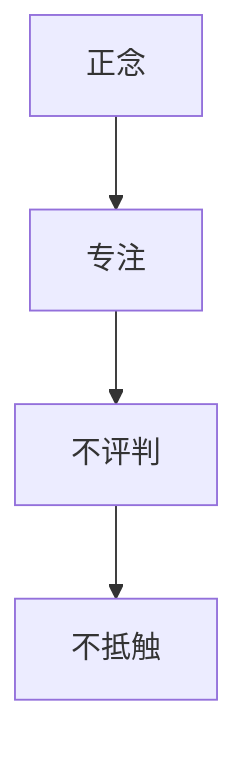

#### **2.2 数字禅修工具**

数字禅修工具如手机应用程序和在线课程，为现代人提供了便捷的禅修方式。这些工具可以帮助用户随时随地开始禅修，提高禅修的频率和持续性。

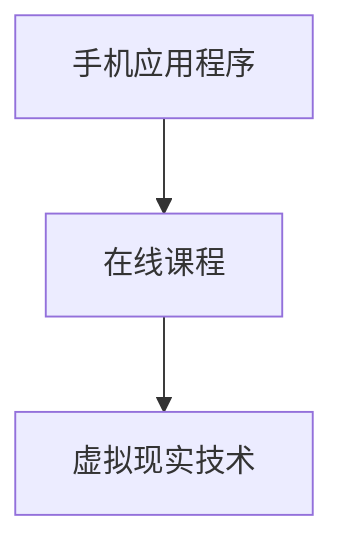

#### **2.3 禅修的日常实践**

禅修的日常实践包括设定固定的禅修时间、选择一个安静的环境和采取适当的姿势。通过坚持日常禅修，可以逐渐培养内心的平静和专注力。

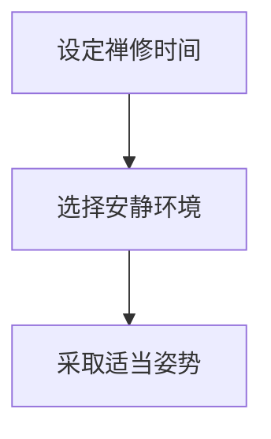

### 第三部分：现代禅修的实际应用

#### 第3章：数字时代的心境管理

#### **3.1 心理健康的重要性**

在数字时代，心理健康问题日益严重。焦虑、抑郁和压力等心理问题不仅影响个人的生活质量，也影响工作效率和人际关系。

```latex
心理健康问题 = 焦虑 + 抑郁 + 压力
```

#### **3.2 禅修与情绪管理**

禅修有助于情绪管理，通过正念练习和专注力的培养，可以降低焦虑和抑郁水平，提高情绪调节能力。

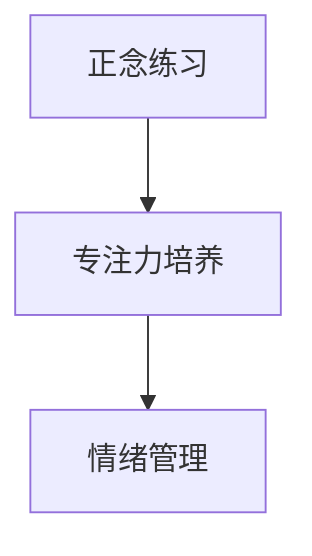

#### **3.3 心灵成长**

禅修不仅有助于情绪管理，还有助于个人成长。通过禅修，人们可以更好地了解自己，培养自我意识和情商。

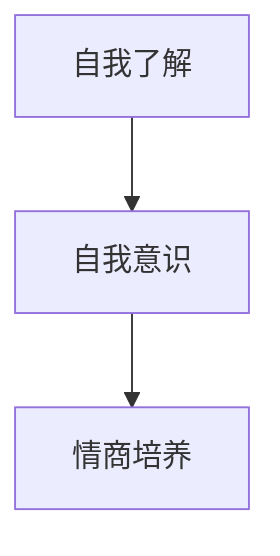

### 第四部分：现代禅修的挑战与未来

#### 第4章：现代工作场所的禅修

#### **4.1 禅修在职场中的应用**

禅修可以提高职场人士的专注力、减少压力和提升工作效率。许多企业已经开始推广禅修文化，为员工提供禅修培训和工作坊。

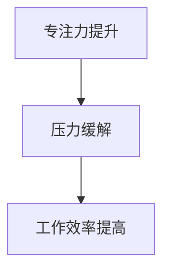

#### **4.2 企业中的禅修推广**

企业可以通过建立内部禅修团队、举办禅修活动和工作坊等方式来推广禅修文化。禅修不仅可以提升员工的心理健康，也有助于团队协作和企业文化建设。

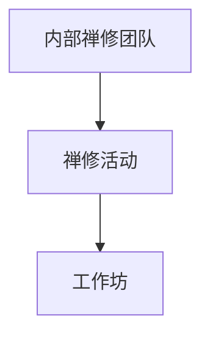

#### **4.3 禦修与团队建设**

禅修有助于提升团队协作和凝聚力。通过共同进行禅修实践，团队成员可以更好地理解彼此，建立信任和合作关系。

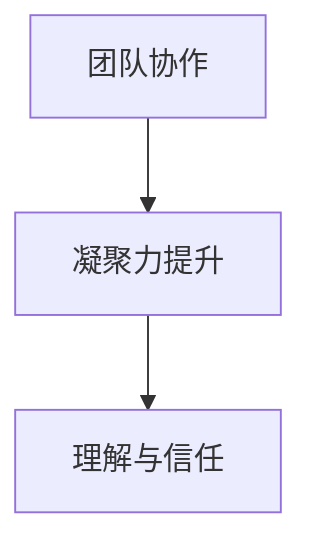

### 结论：新禅宗2.0的未来展望

#### **5.1 禅修2.0的发展趋势**

随着数字化技术的不断进步，禅修2.0将会继续发展和完善。未来，更多的数字工具和虚拟现实技术将应用于禅修实践，为人们提供更加便捷和个性化的禅修体验。

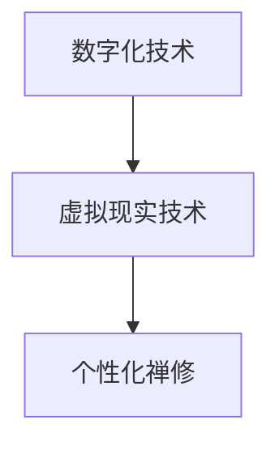

#### **5.2 禪修2.0的未来可能性**

禅修2.0在未来具有巨大的潜力。它不仅可以帮助人们应对现代生活的挑战，还可以促进心理健康、提升工作效率和改善人际关系。随着社会的不断发展，禅修2.0将在各个领域发挥重要作用。

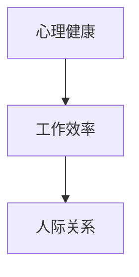

#### **5.3 禅修2.0对社会的影响**

禅修2.0将对社会产生深远的影响。它有助于提升人们的幸福感、促进社会和谐和减少心理问题的发生率。通过禅修2.0，人们可以更好地理解自己、他人和社会，从而实现个人的成长和社会的进步。

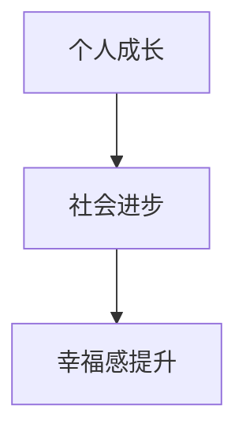

### 参考文献

- 益西彭措堪布，《禅宗心要》，北京：中国社会科学出版社，2016。
- 吴军，《智能时代》，北京：电子工业出版社，2017。
- 丹尼尔·戈尔曼，《情商》，北京：中国社会科学出版社，2015。
- 史蒂芬·平克，《心智探奇》，北京：生活·读书·新知三联书店，2014。

### 作者信息

作者：AI天才研究院/AI Genius Institute & 禅与计算机程序设计艺术 /Zen And The Art of Computer Programming

### 结语

在现代数字时代，禅修不仅是一种宗教信仰，更是一种生活方式。新禅宗2.0为我们提供了一个全新的视角，帮助我们寻找内心的平静和平衡。通过禅修，我们可以更好地应对现代生活的挑战，实现个人的成长和社会的进步。让我们一起走进新禅宗2.0的世界，开启一段全新的心灵旅程。

