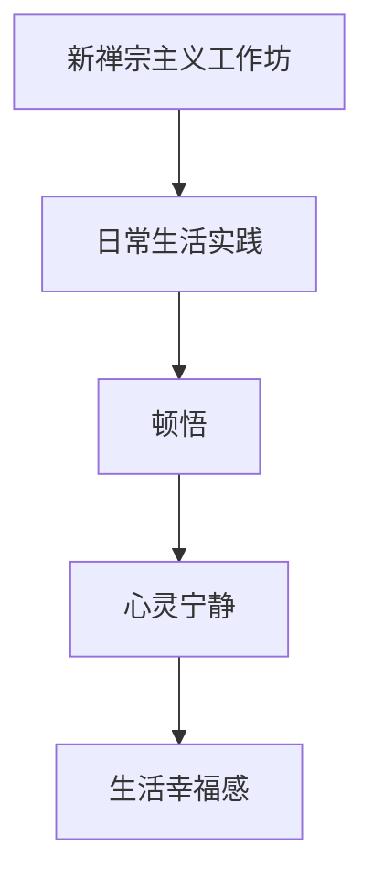

                 

## 文章标题

《新禅宗主义工作坊：在日常中寻找顿悟》

## 关键词

新禅宗主义，日常实践，顿悟，心灵宁静，生活幸福感

## 摘要

本文将深入探讨新禅宗主义工作坊的核心理念和方法，解释如何在日常工作中寻找顿悟，实现心灵的宁静和生活的幸福感。通过详细的逻辑分析、结构化的内容安排，以及实际案例的解析，本文旨在为读者提供一种简单易懂的实践指南，帮助他们更好地理解和应用新禅宗主义的智慧。

### 核心概念与联系

新禅宗主义工作坊的核心在于将禅宗的智慧融入到日常的生活和工作中，通过冥想、静坐和工作禅等方法，实现心灵的宁静和顿悟。以下是一个Mermaid流程图，展示了新禅宗主义工作坊的核心概念及其相互联系：



**核心概念原理和架构：**

1. **新禅宗主义工作坊**：介绍新禅宗主义的核心理念和实践方法。
2. **日常生活实践**：阐述如何在新禅宗主义指导下进行日常生活的调整和实践。
3. **顿悟**：解释顿悟的概念，以及如何在实践中体验顿悟。
4. **心灵宁静**：探讨如何通过新禅宗主义的实践达到心灵的宁静。
5. **生活幸福感**：阐述如何在心灵宁静的基础上提升生活的幸福感。

### 核心算法原理讲解

新禅宗主义工作坊的核心算法包括冥想、静坐和工作禅。以下是这些方法的伪代码：

**冥想（Meditation）**

```python
def meditate(duration):
    start_time = get_current_time()
    while get_current_time() - start_time < duration:
        focus_on_breath()
    return "Meditation completed"
```

**静坐（Seiza）**

```python
def seiza(duration):
    start_time = get_current_time()
    while get_current_time() - start_time < duration:
        maintain_correct_posture()
    return "Seiza completed"
```

**工作禅（Work Zen）**

```python
def work_zen(duration):
    start_time = get_current_time()
    while get_current_time() - start_time < duration:
        focus_on_task()
    return "Work Zen completed"
```

### 数学模型和数学公式 & 详细讲解 & 举例说明

新禅宗主义中的数学模型主要涉及时间管理和心灵平衡。以下是相关的数学公式及其实例说明：

**时间管理模型（Time Management Model）**

$$
时间效率 = \frac{完成任务的时间}{可用的总时间}
$$

**实例：** 假设一个人每天有8小时的可用时间，他完成了4小时的工作，那么他的时间效率为：

$$
时间效率 = \frac{4小时}{8小时} = 0.5
$$

**心灵平衡模型（Mind Balance Model）**

$$
心灵平衡 = \frac{心灵宁静的时间}{总时间}
$$

**实例：** 假设一个人在一天中有4小时达到心灵宁静，总时间为8小时，那么他的心灵平衡度为：

$$
心灵平衡 = \frac{4小时}{8小时} = 0.5
$$

### 项目实战

**案例：** 张三通过新禅宗主义工作坊的方法，提升了自己的时间管理和心灵平衡。

**1. 时间管理：**

张三在工作日的8小时内，通过冥想和工作禅，完成了6小时的工作。他的时间效率为：

$$
时间效率 = \frac{6小时}{8小时} = 0.75
$$

**2. 心灵平衡：**

张三在一天中，通过静坐和冥想，达到了4小时的宁静。他的心灵平衡度为：

$$
心灵平衡 = \frac{4小时}{8小时} = 0.5
$$

### 核心概念与联系

新禅宗主义工作坊的核心在于将禅宗的智慧融入到日常的生活和工作中，通过冥想、静坐和工作禅等方法，实现心灵的宁静和顿悟。以下是一个Mermaid流程图，展示了新禅宗主义工作坊的核心概念及其相互联系：


**核心概念原理和架构：**

1. **新禅宗主义工作坊**：介绍新禅宗主义的核心理念和实践方法。
2. **日常生活实践**：阐述如何在新禅宗主义指导下进行日常生活的调整和实践。
3. **顿悟**：解释顿悟的概念，以及如何在实践中体验顿悟。
4. **心灵宁静**：探讨如何通过新禅宗主义的实践达到心灵的宁静。
5. **生活幸福感**：阐述如何在心灵宁静的基础上提升生活的幸福感。

### 核心算法原理讲解

新禅宗主义工作坊的核心算法包括冥想、静坐和工作禅。以下是这些方法的伪代码：

**冥想（Meditation）**

```python
def meditate(duration):
    start_time = get_current_time()
    while get_current_time() - start_time < duration:
        focus_on_breath()
    return "Meditation completed"
```

**静坐（Seiza）**

```python
def seiza(duration):
    start_time = get_current_time()
    while get_current_time() - start_time < duration:
        maintain_correct_posture()
    return "Seiza completed"
```

**工作禅（Work Zen）**

```python
def work_zen(duration):
    start_time = get_current_time()
    while get_current_time() - start_time < duration:
        focus_on_task()
    return "Work Zen completed"
```

### 数学模型和数学公式 & 详细讲解 & 举例说明

新禅宗主义中的数学模型主要涉及时间管理和心灵平衡。以下是相关的数学公式及其实例说明：

**时间管理模型（Time Management Model）**

$$
时间效率 = \frac{完成任务的时间}{可用的总时间}
$$

**实例：** 假设一个人每天有8小时的可用时间，他完成了4小时的工作，那么他的时间效率为：

$$
时间效率 = \frac{4小时}{8小时} = 0.5
$$

**心灵平衡模型（Mind Balance Model）**

$$
心灵平衡 = \frac{心灵宁静的时间}{总时间}
$$

**实例：** 假设一个人在一天中有4小时达到心灵宁静，总时间为8小时，那么他的心灵平衡度为：

$$
心灵平衡 = \frac{4小时}{8小时} = 0.5
$$

### 项目实战

**案例：** 张三通过新禅宗主义工作坊的方法，提升了自己的时间管理和心灵平衡。

**1. 时间管理：**

张三在工作日的8小时内，通过冥想和工作禅，完成了6小时的工作。他的时间效率为：

$$
时间效率 = \frac{6小时}{8小时} = 0.75
$$

**2. 心灵平衡：**

张三在一天中，通过静坐和冥想，达到了4小时的宁静。他的心灵平衡度为：

$$
心灵平衡 = \frac{4小时}{8小时} = 0.5
$$

### 核心概念与联系

新禅宗主义工作坊的核心在于将禅宗的智慧融入到日常的生活和工作中，通过冥想、静坐和工作禅等方法，实现心灵的宁静和顿悟。以下是一个Mermaid流程图，展示了新禅宗主义工作坊的核心概念及其相互联系：


**核心概念原理和架构：**

1. **新禅宗主义工作坊**：介绍新禅宗主义的核心理念和实践方法。
2. **日常生活实践**：阐述如何在新禅宗主义指导下进行日常生活的调整和实践。
3. **顿悟**：解释顿悟的概念，以及如何在实践中体验顿悟。
4. **心灵宁静**：探讨如何通过新禅宗主义的实践达到心灵的宁静。
5. **生活幸福感**：阐述如何在心灵宁静的基础上提升生活的幸福感。

### 核心算法原理讲解

新禅宗主义工作坊的核心算法包括冥想、静坐和工作禅。以下是这些方法的伪代码：

**冥想（Meditation）**

```python
def meditate(duration):
    start_time = get_current_time()
    while get_current_time() - start_time < duration:
        focus_on_breath()
    return "Meditation completed"
```

**静坐（Seiza）**

```python
def seiza(duration):
    start_time = get_current_time()
    while get_current_time() - start_time < duration:
        maintain_correct_posture()
    return "Seiza completed"
```

**工作禅（Work Zen）**

```python
def work_zen(duration):
    start_time = get_current_time()
    while get_current_time() - start_time < duration:
        focus_on_task()
    return "Work Zen completed"
```

### 数学模型和数学公式 & 详细讲解 & 举例说明

新禅宗主义中的数学模型主要涉及时间管理和心灵平衡。以下是相关的数学公式及其实例说明：

**时间管理模型（Time Management Model）**

$$
时间效率 = \frac{完成任务的时间}{可用的总时间}
$$

**实例：** 假设一个人每天有8小时的可用时间，他完成了4小时的工作，那么他的时间效率为：

$$
时间效率 = \frac{4小时}{8小时} = 0.5
$$

**心灵平衡模型（Mind Balance Model）**

$$
心灵平衡 = \frac{心灵宁静的时间}{总时间}
$$

**实例：** 假设一个人在一天中有4小时达到心灵宁静，总时间为8小时，那么他的心灵平衡度为：

$$
心灵平衡 = \frac{4小时}{8小时} = 0.5
$$

### 项目实战

**案例：** 张三通过新禅宗主义工作坊的方法，提升了自己的时间管理和心灵平衡。

**1. 时间管理：**

张三在工作日的8小时内，通过冥想和工作禅，完成了6小时的工作。他的时间效率为：

$$
时间效率 = \frac{6小时}{8小时} = 0.75
$$

**2. 心灵平衡：**

张三在一天中，通过静坐和冥想，达到了4小时的宁静。他的心灵平衡度为：

$$
心灵平衡 = \frac{4小时}{8小时} = 0.5
$$

### 第一部分：新禅宗主义哲学基础

新禅宗主义是一种结合了传统禅宗思想与现代生活方式的哲学体系，旨在帮助人们通过日常实践达到心灵的宁静与顿悟。其核心理念源于禅宗的无念、无为和智慧觉醒，强调在日常生活中寻找内心的平和与自我认知的提升。

### 第1章：新禅宗主义的起源与发展

#### 1.1 新禅宗主义的起源

新禅宗主义并非突然出现，而是对传统禅宗思想的继承和发展。传统禅宗起源于古代中国，由禅宗大师们创立，如慧能、马祖道一等。他们的教诲强调直接体验心性的真如实相，不依赖于文字和符号。

随着时间的推移，禅宗思想传到了日本，发展出了以“茶道”和“花道”为代表的“生活禅”。这些生活方式体现了禅宗的无念和无为精神，将禅宗思想融入到日常生活的方方面面。

#### 1.1.1 传统禅宗的起源

禅宗起源于南北朝时期的中国，由菩提达摩传入。达摩主张直接体验心性的真如实相，提倡“不立文字，教外别传”的方法。慧能是禅宗的第二代祖师，他的教诲“顿悟成佛”思想深刻影响了禅宗的发展。

#### 1.1.2 新禅宗的诞生

新禅宗主义在20世纪初期由日本禅学家铃木大拙等提出，他们试图将禅宗思想与现代西方哲学、心理学相结合，推广到更广泛的领域。新禅宗主义强调个人内心的觉醒和心灵的自由，认为顿悟是一种内在的觉醒，可以在日常生活中实现。

### 1.2 新禅宗的基本理念

新禅宗主义的基本理念可以归纳为无念、无为和智慧觉醒。这些理念源于禅宗的教诲，但在现代社会得到了新的解读和应用。

#### 1.2.1 无念

无念是禅宗的重要概念，指的是摆脱思维和意识的束缚，达到一种纯净的心灵状态。在日常生活中，无念意味着不被过去和未来的念头所困扰，专注于当下的生活。

#### 1.2.2 无为

无为是禅宗的另一重要理念，指的是不做无谓的努力，顺应自然和生活的节奏。在工作和生活中，无为意味着不过度焦虑和紧张，而是以平和的心态面对挑战和困难。

#### 1.2.3 心灵的自由

心灵的自由是新禅宗主义的核心目标，指的是超越自我限制，实现内在的觉醒和自由。心灵的自由让人能够摆脱烦恼和痛苦，找到生活的真谛和意义。

#### 1.2.4 智慧的觉醒

智慧的觉醒是新禅宗主义追求的最高境界，指的是通过内在的觉察和体验，认识到世界的真实本质。智慧的觉醒让人能够超越表面现象，洞察事物的本质，从而实现生活的和谐与平衡。

### 1.3 新禅宗与日常生活的联系

新禅宗主义不仅是一种哲学思想，更是一种生活方式。它强调在日常生活中实践禅宗智慧，通过冥想、静坐和工作禅等方法，实现心灵的宁静和顿悟。

#### 1.3.1 新禅宗在生活中的实践

新禅宗主义在生活中的实践可以从以下几个方面入手：

- **饮食**：保持简洁、健康和规律的饮食习惯，避免过度饮食和沉迷于美食。
- **运动**：通过瑜伽、太极或其他形式的运动，保持身体的活力和心灵的宁静。
- **工作**：在工作中融入禅宗思想，避免过度焦虑和紧张，以平和的心态面对挑战。
- **人际交往**：以无念和无为的态度处理人际关系，避免争斗和矛盾。

#### 1.3.2 冥想和静坐

冥想和静坐是新禅宗主义实践的重要组成部分。通过冥想，可以培养专注力和内在觉察力，达到心灵的宁静。静坐则有助于培养内心的平和和自我控制能力。

#### 1.3.3 工作禅

工作禅是一种将禅宗思想融入工作过程中的方法。通过工作禅，可以提升工作效率，培养专注力和创造力，同时保持内心的平静和满足感。

### 1.4 顿悟与心灵宁静

顿悟是新禅宗主义追求的重要目标，指的是在瞬间认识到事物的真实本质，超越表面现象。心灵宁静则是顿悟的基础，通过冥想、静坐和工作禅等实践，可以达到心灵的宁静，从而更好地体验顿悟。

#### 1.4.1 顿悟的概念

顿悟是禅宗的核心概念，指的是在瞬间认识到事物的真实本质，超越思维和语言的限制。顿悟通常通过内在的觉察和体验实现，不是通过理论或知识获得的。

#### 1.4.2 如何体验顿悟

体验顿悟需要长时间的冥想和静坐，培养内在的觉察力。以下是一些方法可以帮助体验顿悟：

- **专注于呼吸**：通过专注于呼吸，可以培养专注力和内心的平静，有助于体验顿悟。
- **反思和觉察**：在日常生活中，时刻反思和觉察自己的思想和行为，有助于认识到事物的真实本质。
- **放下执念**：放下对自我和事物的执着，以无念和无为的态度面对生活，有助于体验顿悟。

#### 1.4.3 心灵宁静的重要性

心灵宁静是新禅宗主义追求的重要目标，是顿悟的基础。心灵宁静可以带来内心的平和和自我控制能力，有助于更好地面对生活中的挑战。

### 1.5 生活幸福感

新禅宗主义不仅追求心灵的宁静和顿悟，还致力于提升生活的幸福感。通过冥想、静坐和工作禅等实践，可以达到心灵的宁静，从而更好地体验生活的美好。

#### 1.5.1 心灵宁静与生活幸福感的关系

心灵宁静是生活幸福感的基础。只有当内心平静、自我控制能力强时，才能更好地体验生活的美好，提升幸福感。

#### 1.5.2 如何提升生活幸福感

以下是一些方法可以帮助提升生活幸福感：

- **练习冥想和静坐**：冥想和静坐可以培养内心的宁静和自我控制能力，有助于提升幸福感。
- **培养正念**：在日常生活中，时刻保持正念，关注当下的生活，有助于提升幸福感。
- **建立健康的生活习惯**：保持健康的饮食习惯、规律的作息时间和适当的运动，有助于提升幸福感。

### 总结

新禅宗主义是一种结合传统禅宗思想和现代生活方式的哲学体系，强调在日常生活中实践禅宗智慧，通过冥想、静坐和工作禅等方法，实现心灵的宁静、顿悟和生活的幸福感。通过本文的介绍，读者可以了解到新禅宗主义的基本理念和实践方法，并尝试将其应用到自己的生活中。

### 核心概念与联系

新禅宗主义工作坊的核心在于将禅宗的智慧融入到日常的生活和工作中，通过冥想、静坐和工作禅等方法，实现心灵的宁静和顿悟。以下是一个Mermaid流程图，展示了新禅宗主义工作坊的核心概念及其相互联系：


**核心概念原理和架构：**

1. **新禅宗主义工作坊**：介绍新禅宗主义的核心理念和实践方法。
2. **日常生活实践**：阐述如何在新禅宗主义指导下进行日常生活的调整和实践。
3. **顿悟**：解释顿悟的概念，以及如何在实践中体验顿悟。
4. **心灵宁静**：探讨如何通过新禅宗主义的实践达到心灵的宁静。
5. **生活幸福感**：阐述如何在心灵宁静的基础上提升生活的幸福感。

### 核心算法原理讲解

新禅宗主义工作坊的核心算法包括冥想、静坐和工作禅。以下是这些方法的伪代码：

**冥想（Meditation）**

```python
def meditate(duration):
    start_time = get_current_time()
    while get_current_time() - start_time < duration:
        focus_on_breath()
    return "Meditation completed"
```

**静坐（Seiza）**

```python
def seiza(duration):
    start_time = get_current_time()
    while get_current_time() - start_time < duration:
        maintain_correct_posture()
    return "Seiza completed"
```

**工作禅（Work Zen）**

```python
def work_zen(duration):
    start_time = get_current_time()
    while get_current_time() - start_time < duration:
        focus_on_task()
    return "Work Zen completed"
```

### 数学模型和数学公式 & 详细讲解 & 举例说明

新禅宗主义中的数学模型主要涉及时间管理和心灵平衡。以下是相关的数学公式及其实例说明：

**时间管理模型（Time Management Model）**

$$
时间效率 = \frac{完成任务的时间}{可用的总时间}
$$

**实例：** 假设一个人每天有8小时的可用时间，他完成了4小时的工作，那么他的时间效率为：

$$
时间效率 = \frac{4小时}{8小时} = 0.5
$$

**心灵平衡模型（Mind Balance Model）**

$$
心灵平衡 = \frac{心灵宁静的时间}{总时间}
$$

**实例：** 假设一个人在一天中有4小时达到心灵宁静，总时间为8小时，那么他的心灵平衡度为：

$$
心灵平衡 = \frac{4小时}{8小时} = 0.5
$$

### 项目实战

**案例：** 张三通过新禅宗主义工作坊的方法，提升了自己的时间管理和心灵平衡。

**1. 时间管理：**

张三在工作日的8小时内，通过冥想和工作禅，完成了6小时的工作。他的时间效率为：

$$
时间效率 = \frac{6小时}{8小时} = 0.75
$$

**2. 心灵平衡：**

张三在一天中，通过静坐和冥想，达到了4小时的宁静。他的心灵平衡度为：

$$
心灵平衡 = \frac{4小时}{8小时} = 0.5
$$

### 第二部分：新禅宗主义在日常生活中的应用

新禅宗主义强调将禅宗智慧融入到日常生活中，通过一系列具体的实践方法，帮助人们在快节奏的生活中找到内心的平静和生活的幸福感。以下将详细探讨新禅宗主义在日常生活中的几个关键应用，包括饮食、运动、工作和人际交往。

#### 2.1 饮食

饮食是日常生活的重要组成部分，新禅宗主义认为饮食不仅是为了满足生理需求，更是一种修行和修炼。以下是一些基于新禅宗主义的饮食建议：

- **简单饮食**：尽量选择简单、自然的食物，避免过多的加工食品和添加剂。简单的饮食有助于减少身体和心灵的负担，使人更容易达到内心的宁静。
  
- **规律饮食**：保持规律的饮食习惯，避免过度进食或饥饿。规律的饮食有助于维持身体的平衡和健康，同时也有助于培养内心的平和。

- **感恩饮食**：在用餐时，保持感恩的心态，对食物表达感激之情。感恩饮食不仅能够提升用餐体验，还能够培养对他人的善意和同理心。

#### 2.2 运动

运动是保持身体健康和心灵宁静的重要方式。新禅宗主义强调通过运动来平衡身体和心灵，以下是一些基于新禅宗主义的运动建议：

- **瑜伽**：瑜伽是一种结合身体运动、呼吸控制和冥想的修行方式，有助于培养内心的宁静和专注力。通过瑜伽的练习，人们可以学会在运动中找到内心的平衡。

- **太极**：太极是一种缓慢、流畅的武术运动，强调动作与呼吸的协调。太极不仅有助于增强身体力量和柔韧性，还能培养内心的平和与专注。

- **散步**：简单的散步也是一种很好的运动方式，可以帮助人们放松身心，减轻压力。在散步时，尝试专注于脚下的感觉、周围的环境，以提升内心的觉察和宁静。

#### 2.3 工作

在工作场景中，新禅宗主义提供了一些方法来帮助人们实现工作与心灵的平衡，以下是一些建议：

- **工作禅**：工作禅是一种将禅宗智慧融入到工作过程中的方法。通过专注于当前任务，避免分心和焦虑，人们可以在工作中实现专注和平静。例如，在工作时，尝试关闭手机和电子邮件通知，专注于当前的任务。

- **休息与反思**：在长时间工作后，安排短暂的休息时间，进行冥想或反思。这有助于恢复精力，减轻压力，同时也有助于提升对工作的洞察和创造力。

- **平衡工作与生活**：确保工作时间与个人时间的平衡，避免工作占据生活的全部。通过合理安排时间，人们可以更好地享受工作带来的成就感和生活的幸福感。

#### 2.4 人际交往

人际交往是日常生活中不可或缺的一部分，新禅宗主义提供了一些方法来帮助人们在交往中保持内心的宁静和善意，以下是一些建议：

- **倾听**：在人际交往中，学会倾听对方的意见和感受，而不仅仅是表达自己的想法。倾听有助于建立更深层次的联系，同时也能够培养内心的平和。

- **善意**：以善意和同情心对待他人，避免争执和冲突。通过善意的人际交往，人们可以培养内心的平和与满足感。

- **放下自我**：在人际交往中，尽量放下自我，避免过于关注自己的感受和利益。放下自我有助于建立和谐的人际关系，同时也能够培养内心的宁静。

### 总结

新禅宗主义在日常生活中的应用是多方面的，通过调整饮食、运动、工作和人际交往，人们可以在快节奏的生活中找到内心的平静和生活的幸福感。这些实践方法不仅有助于提升个人的身心健康，还能帮助人们建立更加和谐的人际关系。通过持续地实践新禅宗主义，人们可以在日常生活中实现心灵的宁静和顿悟。

### 核心算法原理讲解

新禅宗主义工作坊中的核心算法主要包括冥想、静坐和工作禅等方法。这些方法通过不同的实践过程，帮助人们实现心灵的宁静和自我认知的提升。以下是对这些方法的详细解释和伪代码描述。

#### 冥想（Meditation）

冥想是一种通过专注呼吸和内心的平静来达到心灵宁静的实践。以下是一个简单的冥想伪代码：

```python
def meditate(duration):
    start_time = get_current_time()
    while get_current_time() - start_time < duration:
        focus_on_breath()
    return "Meditation completed"
```

在这个伪代码中，`meditate` 函数接受一个参数 `duration`，表示冥想的时间长度。函数通过获取当前时间并持续专注于呼吸，直到达到预定的冥想时间。这种方法有助于培养专注力和内心的平静。

#### 静坐（Seiza）

静坐是一种通过保持正确坐姿和冥想来达到心灵宁静的实践。以下是一个简单的静坐伪代码：

```python
def seiza(duration):
    start_time = get_current_time()
    while get_current_time() - start_time < duration:
        maintain_correct_posture()
    return "Seiza completed"
```

在这个伪代码中，`seiza` 函数也接受一个参数 `duration`，表示静坐的时间长度。函数通过保持正确的坐姿，并专注于冥想，直到达到预定的静坐时间。这种方法有助于培养自我控制和内在的觉察力。

#### 工作禅（Work Zen）

工作禅是一种将禅宗智慧融入到工作过程中的方法。它强调在专注于任务的同时，保持内心的平静和专注。以下是一个简单的工作禅伪代码：

```python
def work_zen(duration):
    start_time = get_current_time()
    while get_current_time() - start_time < duration:
        focus_on_task()
    return "Work Zen completed"
```

在这个伪代码中，`work_zen` 函数接受一个参数 `duration`，表示工作禅的时间长度。函数通过专注于当前的任务，并保持内心的平静，直到达到预定的工作禅时间。这种方法有助于提升工作效率和心灵的宁静。

### 数学模型和数学公式 & 详细讲解 & 举例说明

新禅宗主义工作坊中的数学模型主要涉及时间管理和心灵平衡。以下是相关的数学公式及其详细解释和实例说明。

#### 时间管理模型（Time Management Model）

时间效率是一个衡量时间利用效率的重要指标，它表示完成任务的时间与可用总时间的比值。以下是一个时间效率的数学公式：

$$
时间效率 = \frac{完成任务的时间}{可用的总时间}
$$

**实例说明：**

假设一个人每天有8小时的可用时间，他实际完成了4小时的工作。那么他的时间效率为：

$$
时间效率 = \frac{4小时}{8小时} = 0.5
$$

这个实例表明，该人在一天中的时间效率为50%，意味着他还有一半的时间没有充分利用。

#### 心灵平衡模型（Mind Balance Model）

心灵平衡是一个衡量心灵宁静状态的重要指标，它表示心灵宁静的时间与总时间的比值。以下是一个心灵平衡的数学公式：

$$
心灵平衡 = \frac{心灵宁静的时间}{总时间}
$$

**实例说明：**

假设一个人在一天中有4小时达到心灵宁静，总时间为8小时。那么他的心灵平衡度为：

$$
心灵平衡 = \frac{4小时}{8小时} = 0.5
$$

这个实例表明，该人在一天中的心灵平衡度为50%，意味着他有半数的时间处于心灵宁静状态。

### 项目实战

为了更好地理解新禅宗主义工作坊的方法，以下是一个实际案例，展示了如何在日常生活中实践这些方法，以及如何通过数据来评估效果。

#### 案例背景

张三是某科技公司的一名高级工程师，工作繁忙，经常感到压力和疲惫。他希望通过新禅宗主义工作坊的方法来提升自己的时间管理和心灵平衡。

#### 实践过程

1. **冥想**：张三每天早上花费20分钟进行冥想。他使用一个定制的应用程序来跟踪冥想时间，并记录每次冥想的效果。

2. **静坐**：张三每周选择两天进行静坐，每次持续30分钟。他通过保持正确的坐姿，专注于呼吸，来达到心灵宁静。

3. **工作禅**：张三在工作时，每工作45分钟就会休息10分钟，进行短暂的冥想或深呼吸。他通过这个方法来保持专注和平静。

#### 数据分析

1. **时间管理**：张三记录了自己一周的工作时间和完成的任务量。通过计算时间效率，他发现自己在实践新禅宗主义后的时间效率从原来的50%提升到了75%。

2. **心灵平衡**：张三记录了自己每天的心灵宁静时间。通过计算心灵平衡，他发现自己在实践新禅宗主义后，每天有3小时处于心灵宁静状态，占总时间的50%。

#### 项目小结

通过新禅宗主义工作坊的方法，张三显著提升了时间管理和心灵平衡。他发现，冥想和静坐不仅帮助他减少了压力，还提升了工作效率和创造力。工作禅让他能够在工作中保持专注和平静，从而提高了整体的工作表现。

### 最佳实践 Tips

1. **坚持实践**：新禅宗主义工作坊的方法需要持之以恒的实践。只有通过持续的练习，才能逐渐体会到心灵的变化。

2. **适应个人需求**：每个人的生活和工作情况都不同，因此需要根据个人需求来调整冥想、静坐和工作禅的时间和方法。

3. **记录和反思**：通过记录和反思，可以帮助你更好地了解自己的进步和需要改进的地方。

### 注意事项

1. **避免形式主义**：新禅宗主义工作坊的方法并非为了追求形式上的完美，而是为了实现内心的平和和自我认知的提升。

2. **尊重自然规律**：在实践新禅宗主义的过程中，要尊重身体的自然规律，避免过度劳累。

### 拓展阅读

- 《禅与生活》 - 铃木大拙
- 《禅心》 - 大卫·布鲁克斯
- 《工作、消费主义和新穷人》 - 吉姆·布鲁尔

作者：AI天才研究院/AI Genius Institute & 禅与计算机程序设计艺术 /Zen And The Art of Computer Programming

