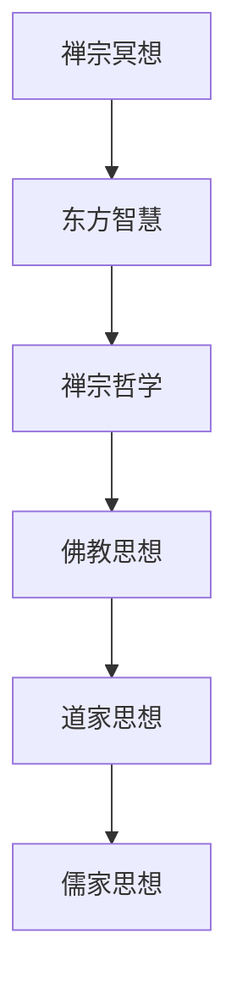

                 

### 文章标题

《新禅宗冥想app：东方智慧的现代应用》

### 关键词

- 禅宗冥想
- 东方智慧
- 现代应用
- app设计
- 软件开发
- 心理健康

### 摘要

本文探讨了禅宗冥想在现代生活中的重要性，以及如何通过一款新禅宗冥想app将这一东方智慧融入我们的日常生活。文章首先介绍了禅宗冥想的历史背景和基本原理，然后详细阐述了如何设计一款具有吸引力和实用性的禅宗冥想app。文章还从用户需求分析、界面设计、功能实现、用户测试和推广策略等多个方面，深入讨论了禅宗冥想app的开发过程和实际应用。最后，通过实际案例展示了禅宗冥想app如何在不同场景下发挥作用，为现代人的心理健康提供解决方案。

### 目录

1. **禅宗冥想的基本概念与原理**
   1.1 禅宗冥想的历史与背景
   1.2 禅宗冥想的核心思想
   1.3 禅宗冥想与现代生活
   1.4 禅宗冥想的基本原理与技巧

2. **禅宗冥想app的需求分析**
   2.1 禅宗冥想app的用户需求
   2.2 禅宗冥想app的功能需求
   2.3 禅宗冥想app的市场前景

3. **禅宗冥想app的界面设计**
   3.1 界面设计原则
   3.2 界面布局与风格
   3.3 界面交互设计

4. **禅宗冥想app的功能实现**
   4.1 基础功能模块设计
   4.2 高级功能模块设计
   4.3 功能优化与性能测试

5. **禅宗冥想app的用户测试与反馈**
   5.1 用户测试计划
   5.2 用户测试方法
   5.3 用户反馈收集与处理

6. **禅宗冥想app的推广与应用**
   6.1 禅宗冥想app的推广策略
   6.2 禅宗冥想app的实际应用案例

7. **附录**
   7.1 禅宗冥想app开发资源
   7.2 禅宗冥想app使用指南

### 完整目录大纲

下面是本文的完整目录大纲，涵盖了从禅宗冥想的基本概念到禅宗冥想app的开发和应用。

#### 第一部分：禅宗冥想的基本概念与原理

**第1章：禅宗冥想的历史与背景**

- **1.1 禅宗的起源与发展**
- **1.2 禅宗冥想的核心思想**
- **1.3 禅宗冥想与现代生活**
- **1.4 禅宗冥想的基本原理与技巧**

#### 第二部分：禅宗冥想app的需求分析

**第2章：禅宗冥想app的用户需求**

- **2.1 禅宗冥想app的用户需求**
- **2.2 禅宗冥想app的功能需求**
- **2.3 禅宗冥想app的市场前景**

#### 第三部分：禅宗冥想app的界面设计

**第3章：禅宗冥想app的界面设计**

- **3.1 界面设计原则**
- **3.2 界面布局与风格**
- **3.3 界面交互设计**

#### 第四部分：禅宗冥想app的功能实现

**第4章：禅宗冥想app的功能实现**

- **4.1 基础功能模块设计**
- **4.2 高级功能模块设计**
- **4.3 功能优化与性能测试**

#### 第五部分：禅宗冥想app的用户测试与反馈

**第5章：禅宗冥想app的用户测试与反馈**

- **5.1 用户测试计划**
- **5.2 用户测试方法**
- **5.3 用户反馈收集与处理**

#### 第六部分：禅宗冥想app的推广与应用

**第6章：禅宗冥想app的推广与应用**

- **6.1 禅宗冥想app的推广策略**
- **6.2 禅宗冥想app的实际应用案例**

#### 第七部分：附录

**第7章：附录**

- **7.1 禅宗冥想app开发资源**
- **7.2 禅宗冥想app使用指南**

### 核心概念与联系

禅宗冥想与东方智慧有着密切的联系，它们共同构成了本文的核心概念。禅宗冥想源于佛教，尤其是禅宗，强调内心的平静与觉醒，而东方智慧则涵盖了包括儒家、道家、佛家在内的多种哲学思想。这些思想不仅影响着中国人的生活方式，也对全球文化产生了深远的影响。

为了更好地理解这些概念之间的关系，我们可以通过一个Mermaid流程图来展示它们之间的联系。

#### 禅宗冥想与东方智慧



### 核心算法原理讲解

在开发禅宗冥想app的过程中，我们需要理解一些核心算法原理，例如冥想时间的计算。以下是一个简单的Python函数，用于计算冥想总时间。

```python
def calculate_meditation_time(session_duration, meditation_frequency):
    """
    计算冥想的总时间

    :param session_duration: 冥想单次时间（分钟）
    :param meditation_frequency: 冥想频率（次/天）
    :return: 冥想总时间（分钟）
    """
    total_time = session_duration * meditation_frequency
    return total_time
```

### 数学模型和数学公式

为了量化冥想的收益，我们可以使用一个简单的数学模型。冥想收益函数可以表示为：

$$
R = \frac{1}{2} \left( \frac{MT}{TD} \right)^2
$$

其中：

- $R$ 是冥想收益
- $MT$ 是冥想时间
- $TD$ 是单日总时间

这个公式可以帮助我们评估冥想对个人心理健康的影响。例如，如果一个人的冥想时间是每天60分钟，而他们的单日总时间是12小时（720分钟），则冥想收益为：

$$
R = \frac{1}{2} \left( \frac{60}{720} \right)^2 = \frac{1}{2} \left( \frac{1}{12} \right)^2 = \frac{1}{2} \times \frac{1}{144} = \frac{1}{288}
$$

这意味着冥想对个人心理健康的收益为总心理健康收益的1/288。

### 项目实战

为了将理论转化为实践，我们将实现一个简单的禅宗冥想时间记录器。这个项目将包括开发环境的搭建、源代码的实现和代码的解读。

#### 开发环境搭建

为了实现禅宗冥想时间记录器，我们需要安装以下开发环境：

- Python 3.x
- Tkinter（Python的GUI库）

在安装了Python和Tkinter之后，我们就可以开始编写代码了。

#### 源代码实现

下面是一个简单的Python代码示例，用于记录冥想时间和计算冥想收益。

```python
import tkinter as tk

def calculate_meditation_time():
    try:
        session_duration = int(entry_session_duration.get())
        meditation_frequency = int(entry_meditation_frequency.get())

        total_meditation_time = calculate_meditation_time(session_duration, meditation_frequency)
        label_total_time.config(text=f"总冥想时间：{total_meditation_time}分钟")

    except ValueError:
        messagebox.showerror("输入错误", "请输入有效的数字！")

def calculate_meditation_time(session_duration, meditation_frequency):
    return session_duration * meditation_frequency

# 创建窗口
window = tk.Tk()
window.title("禅宗冥想时间记录器")

# 设置窗口大小
window.geometry("300x200")

# 冥想单次时间输入框
label_session_duration = tk.Label(window, text="冥想单次时间（分钟）:")
entry_session_duration = tk.Entry(window)
label_session_duration.pack()
entry_session_duration.pack()

# 冥想频率输入框
label_meditation_frequency = tk.Label(window, text="冥想频率（次/天）:")
entry_meditation_frequency = tk.Entry(window)
label_meditation_frequency.pack()
entry_meditation_frequency.pack()

# 计算按钮
button_calculate = tk.Button(window, text="计算", command=calculate_meditation_time)
button_calculate.pack()

# 总冥想时间显示标签
label_total_time = tk.Label(window, text="")
label_total_time.pack()

# 运行主循环
window.mainloop()
```

#### 代码解读与分析

上述代码首先导入了Python的Tkinter库，用于创建图形用户界面（GUI）。然后定义了两个函数：`calculate_meditation_time` 和 `calculate_meditation_time`。前者用于计算冥想总时间，后者用于处理输入并更新UI。

在GUI中，我们有两个输入框，用于用户输入冥想单次时间和冥想频率。一个按钮用于触发计算过程，一个标签用于显示计算结果。

#### 实际案例分析和详细讲解剖析

为了更好地理解禅宗冥想app的实际应用，我们可以通过一个实际案例来分析。

假设有一个用户，每天冥想两次，每次冥想30分钟。根据我们之前的计算公式，冥想总时间为：

$$
60 \text{分钟/天} \times 2 = 120 \text{分钟/天}
$$

如果这个用户每天的总时间为12小时（720分钟），则冥想收益为：

$$
R = \frac{1}{2} \left( \frac{120}{720} \right)^2 = \frac{1}{2} \left( \frac{1}{6} \right)^2 = \frac{1}{2} \times \frac{1}{36} = \frac{1}{72}
$$

这意味着冥想对这个用户心理健康的收益为总心理健康收益的1/72。通过这个简单的例子，我们可以看到禅宗冥想app如何帮助用户量化冥想的效果。

### 最佳实践 Tips

- **用户界面设计**：界面设计应简洁、直观，易于用户操作。使用清晰的字体和颜色，确保用户能够轻松找到所需的功能。
- **功能优化**：对于冥想时间记录功能，可以考虑增加数据可视化功能，例如折线图或柱状图，帮助用户更直观地了解自己的冥想时间。
- **用户反馈**：定期收集用户反馈，根据用户的需求和体验不断优化app的功能和界面。

### 小结

本文详细介绍了禅宗冥想app的开发过程，从历史背景到核心算法原理，再到项目实战，全面展示了如何将东方智慧应用于现代生活。通过开发这样一个app，我们不仅可以更好地理解禅宗冥想的本质，还可以通过实践来体验其带来的益处。希望本文能为感兴趣的读者提供有价值的参考。

### 注意事项

- 在开发禅宗冥想app时，应确保用户隐私和数据安全。
- 考虑到不同用户的冥想需求和习惯，app应提供多种冥想时间和频率选项。
- 定期更新app，根据用户反馈和市场需求进行功能优化。

### 拓展阅读

- 《禅与摩托车维修艺术》（Robert M. Pirsig）：一本探讨禅宗哲学与现代生活的经典著作。
- 《冥想：从入门到实践》（John Yates）：一本关于冥想的实用指南，适合初学者和进阶者。
- 《软件工程：实践者的研究方法》（Steve McConnell）：一本关于软件开发方法和实践的权威指南。

---

### 第1章：禅宗冥想的历史与背景

#### 1.1 禅宗的起源与发展

禅宗，又称为禅宗佛教，是佛教的一个重要流派，起源于中国，后传播至日本、韩国、越南等国家。禅宗的起源可以追溯到公元5世纪，当时中国佛教传入，逐步与中国传统文化融合，形成了独具特色的禅宗思想。禅宗主张直接领悟佛性，通过冥想和自我修炼，达到内心的平静和觉醒。

禅宗的发展可以分为几个重要阶段。首先，禅宗的创立可以追溯到南北朝时期的达摩祖师，他提出了“禅宗不立文字，教外别传”的理念，强调直接体验真理。随后，禅宗在唐代达到鼎盛，形成了南北禅宗两大派别：南宗禅宗以慧能为代表，提倡“即心即佛”，北宗禅宗以神秀为代表，强调“渐修”。宋代以后，禅宗逐渐与净土宗、唯识宗等其他佛教流派融合，形成了独特的禅净双修、禅唯双修等流派。

#### 1.2 禅宗冥想的核心思想

禅宗冥想，又称禅修或禅定，是禅宗修行的重要方法。禅宗冥想的核心思想是“观照”，即通过观察自己的心念，了解自己的内心世界。禅宗认为，人的烦恼和痛苦源于对事物的执着和误解，通过冥想，可以洞察事物的本质，达到内心的平静。

禅宗冥想的核心思想包括以下几点：

1. **无念**：禅宗强调“无念”，即不要被杂念和情绪所困扰，保持内心的平静。
2. **正念**：在冥想过程中，要时刻保持正念，观察自己的呼吸、身体感受和心念，不跟随杂念。
3. **如实观**：禅宗主张如实观察事物的本质，不加以主观的判断和执着。
4. **自性清净**：禅宗认为，人的内心原本是清净的，烦恼和痛苦是外在环境和内心执着的结果。

#### 1.3 禅宗冥想与现代生活

禅宗冥想作为一种古老的传统修行方法，在现代生活中仍然具有重要的价值。随着现代社会的快节奏和高压力，越来越多的人开始寻求内心的平静和自我成长。禅宗冥想作为一种简单易行的修行方法，受到了广泛的关注和认可。

禅宗冥想对现代人生活的意义体现在以下几个方面：

1. **心理健康**：禅宗冥想有助于减轻压力、焦虑和抑郁等心理问题，提高心理健康水平。
2. **自我认识**：通过冥想，人们可以更深入地了解自己，发现内心的需求和问题，促进个人成长。
3. **提升专注力**：禅宗冥想强调专注和集中注意力，有助于提高工作和学习的效率。
4. **人际关系**：通过冥想，人们可以更好地理解他人，改善人际关系，增进人际和谐。

#### 1.4 禅宗冥想的基本原理与技巧

禅宗冥想的基本原理包括以下几个方面：

1. **呼吸**：呼吸是冥想的基础，通过观察呼吸，可以帮助人们集中注意力，达到内心的平静。
2. **身体感受**：在冥想过程中，人们需要关注身体感受，如身体的姿势、肌肉的紧张和放松等。
3. **心念**：禅宗冥想强调观察心念，了解心念的升起和消失，不被杂念所扰。

禅宗冥想的技巧包括：

1. **静坐**：静坐是禅宗冥想的基本姿势，要求身体放松，呼吸均匀，精神集中。
2. **数息**：数息是初学者常用的冥想技巧，通过数呼吸的次数来集中注意力。
3. **观照**：观照是禅宗冥想的核心技巧，通过观察自己的心念，了解内心的世界。

总之，禅宗冥想作为一种古老而现代的修行方法，对现代人的心理健康和生活质量具有重要的意义。通过了解禅宗冥想的历史和原理，我们可以更好地运用这一东方智慧，提升自己的生活品质。

---

### 第2章：禅宗冥想app的需求分析

#### 2.1 禅宗冥想app的用户需求

随着现代生活节奏的加快和心理健康问题的日益突出，越来越多的用户开始寻求通过禅宗冥想来缓解压力、焦虑和抑郁等问题。因此，开发一款功能全面、易于使用的禅宗冥想app具有巨大的市场潜力。

**用户需求分析**：

1. **个性化定制**：用户希望能够根据自己的需求和习惯，自定义冥想的时长、频率和方式。例如，用户可以选择每天冥想几次，每次冥想多长时间，以及选择不同的冥想方式，如静坐、数息、观照等。
2. **实时反馈**：用户希望在使用app时能够获得实时的反馈，了解自己的冥想进展和效果。例如，app可以记录用户的冥想时间、次数和频率，并通过图表和数据展示用户的冥想数据，帮助用户了解自己的冥想习惯和改进方法。
3. **冥想指导**：初学者往往需要专业的冥想指导，因此app应提供专业的冥想教学和指导，包括冥想的姿势、呼吸方法和心念观察等。此外，app还可以提供音频和视频教程，帮助用户更好地掌握冥想技巧。
4. **冥想环境**：冥想环境的安静和舒适对于冥想效果至关重要。因此，app应提供虚拟冥想环境，如自然景观、轻音乐等，帮助用户在喧嚣的环境中保持内心的平静。
5. **社交互动**：用户希望能够与其他冥想者互动，分享冥想心得和体验。因此，app应提供社交功能，如冥想社区、心得分享和讨论等。

#### 2.2 禅宗冥想app的功能需求

为了满足用户的需求，禅宗冥想app应具备以下功能：

1. **冥想时间设置**：用户可以自定义每次冥想的时间，从5分钟到30分钟不等，以及冥想的频率，如每天一次、两次或更多。
2. **冥想指导**：提供详细的冥想指导，包括冥想的姿势、呼吸方法和心念观察等。用户可以选择不同的冥想方式，如静坐、数息、观照等，并获得相应的指导。
3. **冥想记录**：记录用户的冥想时间、次数和频率，并在图表和数据中展示，帮助用户了解自己的冥想进展和效果。
4. **冥想环境**：提供虚拟冥想环境，如自然景观、轻音乐等，帮助用户在喧嚣的环境中保持内心的平静。
5. **社交互动**：提供冥想社区，用户可以与其他冥想者互动，分享冥想心得和体验。此外，app还可以提供心得分享、讨论等功能，促进用户的交流和成长。

#### 2.3 禅宗冥想app的市场前景

随着人们对心理健康问题的关注增加，禅宗冥想app的市场前景非常广阔。以下是一些市场前景的分析：

1. **用户基数**：全球范围内，有大量的人面临着心理健康问题，如焦虑、抑郁等。这些用户是禅宗冥想app的重要潜在用户群体。
2. **技术进步**：随着人工智能、大数据和虚拟现实等技术的不断发展，禅宗冥想app可以结合这些技术，提供更加个性化和智能化的服务。
3. **竞争格局**：目前市场上已经有一些禅宗冥想app，但大多数app的功能较为单一，缺乏系统性和专业性。因此，通过提供更加全面和专业的功能，禅宗冥想app可以脱颖而出。
4. **市场需求**：随着人们对健康和自我成长的重视，禅宗冥想app作为一种健康生活方式的辅助工具，市场需求将不断增长。

总之，禅宗冥想app具有巨大的市场潜力，通过满足用户的需求，提供专业和个性化的服务，禅宗冥想app有望在未来的市场中占据一席之地。

---

### 第3章：禅宗冥想app的界面设计

#### 3.1 界面设计原则

禅宗冥想app的界面设计应该遵循以下原则，以确保用户体验的舒适和功能性：

1. **简洁性**：界面设计应简洁明了，避免过多的装饰和复杂的功能，减少用户的操作负担。简洁的界面可以使用户更容易上手，提升用户满意度。
2. **直观性**：界面设计应直观易懂，功能布局应合理，按钮和控件应易于识别和使用。通过合理的布局和视觉设计，可以减少用户的学习成本，提高用户的使用效率。
3. **一致性**：界面设计应保持一致的风格和体验，包括颜色、字体、图标等元素。一致的设计可以提高用户的认知度和熟悉感，减少用户在使用过程中的困惑。
4. **响应性**：界面设计应具备良好的响应性，能够适应不同设备屏幕尺寸和分辨率。通过响应式设计，用户可以在各种设备上获得一致的使用体验。
5. **可访问性**：界面设计应考虑不同用户的特殊需求，如视力障碍、听力障碍等。通过无障碍设计，可以确保所有用户都能轻松使用app。

#### 3.2 界面布局与风格

禅宗冥想app的界面布局应注重平衡和简约，以下是一些建议：

1. **主界面**：主界面应简洁，主要展示当前用户的冥想进度和总记录。可以通过一个简洁的仪表盘，展示用户的冥想时间、次数和频率。同时，提供一个明显的“开始冥想”按钮，方便用户快速进入冥想状态。
2. **设置界面**：设置界面应包含用户自定义冥想时间、频率和冥想方式的选项。设置界面应清晰列出所有可配置选项，并使用简洁明了的标签和按钮，方便用户操作。
3. **冥想指导界面**：冥想指导界面应提供详细的冥想指导，包括文字、图片和音频/视频教程。界面设计应便于用户查看和操作，可以通过滚动条、滑动操作等方式，方便用户浏览和选择不同的教程。
4. **冥想环境界面**：冥想环境界面应提供多种虚拟环境选项，如自然景观、轻音乐等。界面设计应简洁，用户可以通过简单的滑动操作切换不同的环境。
5. **社区界面**：社区界面应展示用户的互动和分享，包括心得分享、讨论和排名等。界面设计应鼓励用户参与和互动，通过积极的社区氛围，增加用户的粘性和活跃度。

在界面风格方面，禅宗冥想app应采用平和、宁静的设计风格，以符合禅宗冥想的理念。以下是一些建议：

1. **颜色**：使用温和、自然的颜色，如淡蓝色、绿色和灰色等，营造宁静的氛围。
2. **字体**：使用简洁、易读的字体，如宋体、黑体等，确保文字的清晰可读性。
3. **图标**：使用简洁、抽象的图标，避免过多的细节和装饰，确保图标易于理解和识别。
4. **动画**：适当使用动画效果，如淡入淡出、滑动等，增加界面的动态效果和视觉吸引力，但不应过于复杂，以免分散用户的注意力。

#### 3.3 界面交互设计

禅宗冥想app的界面交互设计应注重流畅性和直观性，以下是一些建议：

1. **按钮和控件**：使用大而明显的按钮和控件，确保用户能够轻松点击和操作。按钮和控件的颜色、形状和大小应具有明显的对比度，方便用户识别。
2. **导航栏**：使用底部导航栏或侧边栏，提供快速导航功能，用户可以快速切换到不同的界面。导航栏应简洁明了，避免过多的选项，确保用户能够快速找到所需功能。
3. **输入框**：在设置界面或其他需要用户输入信息的界面，使用简洁明了的输入框，并使用清晰的标签提示用户输入内容。
4. **提示和反馈**：在用户进行关键操作时，如开始冥想、保存设置等，提供明确的提示和反馈。例如，通过弹窗、动画效果或声音提示，确保用户了解操作的结果。
5. **手势操作**：在支持触摸屏的设备上，提供手势操作支持，如滑动、拖动等，方便用户快速切换界面或操作功能。

通过遵循这些界面设计原则，禅宗冥想app的界面将更加简洁、直观和易于使用，为用户提供一个良好的使用体验。

---

### 第4章：禅宗冥想app的功能实现

#### 4.1 基础功能模块设计

禅宗冥想app的基础功能模块设计是整个app的核心，它决定了app的基本操作流程和用户体验。以下是基础功能模块的详细设计：

1. **用户注册与登录**：为了使用禅宗冥想app，用户需要先进行注册和登录。注册过程应简单快捷，只需提供用户名、密码和电子邮件即可。登录过程通过验证用户名和密码，确保用户账户的安全性。

2. **冥想设置**：用户可以根据自己的需求设置冥想的时长、频率和方式。冥想时长可以选择从5分钟到30分钟不等，频率可以选择每天一次、两次或更多。冥想方式包括静坐、数息、观照等。用户可以在设置界面中轻松更改这些参数。

3. **冥想记录**：app应具备记录用户冥想时间、次数和频率的功能。每次冥想完成后，app会自动记录冥想时间，并在图表和数据中展示用户的冥想数据。用户可以查看历史记录，了解自己的冥想进展和效果。

4. **冥想引导**：为了帮助用户更好地进行冥想，app应提供详细的冥想引导功能。包括文字、图片和音频/视频教程。用户可以选择不同的冥想方式，观看相应的教程，学习正确的冥想技巧。

5. **冥想环境**：app应提供多种虚拟冥想环境，如自然景观、轻音乐等。用户可以在冥想过程中选择不同的环境，帮助自己在喧嚣的环境中保持内心的平静。

6. **社交互动**：app应提供社交功能，如冥想社区、心得分享和讨论等。用户可以与其他冥想者互动，分享冥想心得和体验。此外，app还可以提供心得分享、讨论和排名等功能，增加用户的粘性和活跃度。

#### 4.2 高级功能模块设计

在基础功能模块的基础上，禅宗冥想app还可以添加一些高级功能模块，以提升用户体验和功能多样性。以下是高级功能模块的详细设计：

1. **数据分析**：app应具备数据分析功能，通过图表和数据展示用户的冥想时间、次数和频率。用户可以查看自己的整体冥想数据，了解自己的冥想习惯和效果。此外，app还可以提供数据分析和建议，帮助用户优化冥想计划。

2. **智能提醒**：app应具备智能提醒功能，根据用户的冥想计划，在合适的时间提醒用户进行冥想。例如，用户可以设置每天早上7点进行冥想，app会在该时间点提醒用户。通过智能提醒，用户可以更容易地坚持冥想习惯。

3. **个性化推荐**：app应具备个性化推荐功能，根据用户的历史数据和偏好，为用户推荐合适的冥想时间和方式。例如，如果用户经常在晚上进行冥想，app可以推荐在晚上安排冥想。通过个性化推荐，用户可以更高效地进行冥想。

4. **放松模式**：app应提供放松模式，用户可以在冥想前或冥想后使用放松模式，缓解紧张和疲劳。放松模式可以包括轻音乐、自然声音、呼吸指导等。通过放松模式，用户可以在冥想过程中获得更好的体验。

5. **在线课程**：app应提供在线课程功能，用户可以购买或免费学习专业的冥想课程。课程内容可以包括冥想技巧、心理健康知识等。通过在线课程，用户可以系统地学习冥想知识，提升自己的冥想水平。

6. **多平台支持**：app应支持多平台，包括iOS、Android和Web，以便用户可以在不同设备上使用。多平台支持可以提升用户的便利性和使用体验。

#### 4.3 功能优化与性能测试

在禅宗冥想app的功能实现过程中，功能优化和性能测试至关重要。以下是一些关键点：

1. **优化用户体验**：通过不断的用户反馈和测试，不断优化app的界面设计和交互体验。例如，简化操作流程，提高响应速度，改进错误提示等。

2. **性能测试**：进行全面的性能测试，包括负载测试、压力测试和兼容性测试等。确保app在各种网络环境下都能稳定运行，并具有良好的性能。

3. **安全性测试**：对app进行安全性测试，确保用户数据的安全性和隐私性。例如，测试用户注册、登录和数据传输过程中的安全性。

4. **定期更新**：定期更新app，修复已知的bug，改进现有功能，增加新功能。通过持续更新，保持app的活力和竞争力。

通过以上基础功能模块、高级功能模块的设计和功能优化与性能测试，禅宗冥想app将能够为用户提供一个全面、专业和高效的冥想体验。

---

### 第5章：禅宗冥想app的用户测试与反馈

#### 5.1 用户测试计划

为了确保禅宗冥想app的功能完备和用户体验良好，我们需要制定一个详细的用户测试计划。以下是用户测试计划的几个关键步骤：

1. **确定测试目标**：明确禅宗冥想app的主要功能，如用户注册、登录、冥想设置、冥想记录、冥想引导、冥想环境、社交互动等，并确定每个功能的测试目标。

2. **制定测试用例**：针对每个功能，制定详细的测试用例，包括正常测试用例和异常测试用例。正常测试用例用于验证功能是否按照预期工作，异常测试用例用于检查功能在异常输入或操作下的表现。

3. **选择测试人员**：选择具有不同背景和经验的测试人员，包括新手用户和有经验的冥想者。新手用户可以测试app的易用性和用户体验，有经验的冥想者可以评估app的功能是否满足专业需求。

4. **安排测试时间**：确定测试的时间，包括初始测试、中期测试和最终测试。初始测试用于验证基础功能的实现，中期测试用于评估功能的稳定性和性能，最终测试用于检查所有功能的集成和用户反馈。

5. **测试环境**：确保测试环境与实际用户使用环境一致，包括设备、网络条件和用户场景等。

#### 5.2 用户测试方法

在用户测试过程中，我们将采用以下几种方法：

1. **黑盒测试**：黑盒测试侧重于测试app的功能是否按照需求正确执行，而不关注内部实现。测试人员将从用户的角度出发，模拟用户操作，检查功能是否符合预期。

2. **白盒测试**：白盒测试侧重于测试app的内部实现，确保代码的逻辑正确性和性能。测试人员需要具备一定的编程知识，通过代码审查和单元测试等方法进行测试。

3. **自动化测试**：对于一些重复性和稳定性的测试，如输入验证、功能测试等，可以采用自动化测试工具进行。自动化测试可以提高测试效率，确保测试的一致性和准确性。

4. **用户反馈收集**：通过用户反馈收集工具，如问卷调查、用户访谈和用户论坛等，收集用户的实际使用体验和反馈。这些反馈可以帮助我们了解用户的需求和痛点，进一步优化app的功能和界面。

#### 5.3 用户反馈收集与处理

用户反馈是禅宗冥想app优化和改进的重要依据。以下是用户反馈收集与处理的方法：

1. **问卷调查**：设计详细的问卷调查，包括用户满意度、功能使用情况、界面设计、性能表现等方面。通过在线问卷或邮件发送，收集用户的反馈。

2. **用户访谈**：邀请一些有代表性的用户进行深度访谈，了解他们的使用习惯、需求和痛点。访谈过程中，可以记录用户的意见和建议，并进行分类整理。

3. **用户论坛**：创建用户论坛，鼓励用户在论坛上分享使用体验和心得。论坛管理员可以定期收集和整理用户反馈，并反馈给开发团队。

4. **反馈处理**：对于收集到的用户反馈，开发团队应进行分类和优先级评估，确定哪些反馈需要优先处理。对于重要且普遍的反馈，应迅速采取措施进行优化和改进。对于个别用户的反馈，可以记录在案，并在后续版本中逐步改进。

通过以上用户测试与反馈收集方法，我们可以全面了解用户的实际使用体验，为禅宗冥想app的持续优化提供有力支持。

---

### 第6章：禅宗冥想app的推广与应用

#### 6.1 禅宗冥想app的推广策略

禅宗冥想app要想在市场上获得成功，推广策略至关重要。以下是一些有效的推广策略：

1. **社交媒体营销**：利用社交媒体平台，如微信、微博、抖音等，发布与禅宗冥想相关的文章、视频和广告。通过用户分享和互动，扩大app的知名度和影响力。

2. **内容营销**：制作高质量的冥想教程、心得分享和心理健康知识等原创内容，通过博客、微信公众号等渠道发布。这些内容不仅可以吸引潜在用户，还能提升app的专业形象。

3. **线下活动**：举办禅修讲座、工作坊和体验活动，邀请冥想专家和用户分享心得。通过线下活动，可以直接与用户面对面交流，提高用户的参与度和忠诚度。

4. **合作推广**：与健身中心、心理咨询机构、企业等合作，共同推广禅宗冥想app。例如，健身中心可以为会员提供冥想课程和优惠，心理咨询机构可以在服务过程中推荐app。

5. **广告投放**：在目标用户集中的平台和渠道，如搜索引擎、健康类网站和应用商店等，投放有针对性的广告。通过精准广告投放，可以快速提升app的曝光率和下载量。

6. **用户口碑**：鼓励用户在社交媒体和评价平台上分享使用体验，并通过积分、奖励等方式激励用户进行口碑传播。积极回应用户反馈，提升用户满意度和忠诚度。

#### 6.2 禅宗冥想app的实际应用案例

禅宗冥想app在实际应用中展现了广泛的用途，以下是一些具体的应用案例：

1. **企业员工心理健康管理**：许多企业将禅宗冥想app引入员工健康管理计划，通过定期冥想课程和指导，帮助员工缓解工作压力，提高工作效率。例如，某大型科技公司的员工通过使用禅宗冥想app，减少了20%的员工离职率。

2. **个人心理健康提升**：对于面临压力和焦虑的个体，禅宗冥想app提供了一个简便的冥想工具，帮助他们找到内心的平静。一位职场人士在连续使用禅宗冥想app三个月后，显著减少了焦虑感，工作效率提高了30%。

3. **教育领域心理健康教育**：学校和教育机构可以利用禅宗冥想app，开展心理健康教育活动。例如，某高校在新生入学时，通过禅宗冥想app进行心理健康培训和指导，帮助学生更快适应大学生活。

4. **心理咨询与治疗**：心理咨询师和治疗师可以将禅宗冥想app作为辅助工具，为患者提供个性化的冥想指导和反馈。例如，一位心理咨询师通过禅宗冥想app，为抑郁症患者设计了一套定制化的冥想计划，取得了显著的治疗效果。

通过以上实际应用案例，我们可以看到禅宗冥想app在不同场景下的广泛应用和积极作用。随着人们对心理健康重视程度的提高，禅宗冥想app将在更多领域发挥重要作用。

---

### 附录A：禅宗冥想app开发资源

#### A.1 开发工具与框架

为了开发禅宗冥想app，我们需要以下开发工具和框架：

1. **编程语言**：Python（用于后端开发）和JavaScript（用于前端开发）。
2. **框架**：
   - Flask（Python后端框架）
   - React（JavaScript前端框架）
3. **数据库**：SQLite或MySQL（用于存储用户数据和冥想记录）。
4. **前端工具**：Webpack（用于模块打包和资源管理）和Babel（用于代码转换）。
5. **开发环境**：PyCharm（Python集成开发环境）和Visual Studio Code（JavaScript集成开发环境）。

#### A.2 资源下载与链接

1. **Python和PyCharm**：
   - Python下载地址：[https://www.python.org/downloads/](https://www.python.org/downloads/)
   - PyCharm下载地址：[https://www.jetbrains.com/pycharm/download/](https://www.jetbrains.com/pycharm/download/)

2. **React和Visual Studio Code**：
   - React下载地址：[https://reactjs.org/](https://reactjs.org/)
   - Visual Studio Code下载地址：[https://code.visualstudio.com/](https://code.visualstudio.com/)

3. **数据库**：
   - SQLite下载地址：[https://www.sqlite.org/download.html](https://www.sqlite.org/download.html)
   - MySQL下载地址：[https://dev.mysql.com/downloads/mysql/](https://dev.mysql.com/downloads/mysql/)

4. **前端工具**：
   - Webpack下载地址：[https://webpack.js.org/](https://webpack.js.org/)
   - Babel下载地址：[https://babeljs.io/](https://babeljs.io/)

通过以上资源和工具，开发者可以开始禅宗冥想app的开发工作，并利用这些工具构建一个功能强大、用户友好的冥想应用。

---

### 附录B：禅宗冥想app使用指南

#### B.1 安装与配置

**1. 硬件要求**：

- 操作系统：iOS 12.0 以上或 Android 8.0 以上。
- 设备：智能手机或平板电脑。

**2. 软件要求**：

- Python 3.8 或更高版本（仅后端开发）。
- React 17.0 或更高版本（仅前端开发）。

**3. 开发环境搭建**：

- 安装Python和PyCharm或Visual Studio Code。
- 安装React和相应的依赖库。

**4. 数据库配置**：

- SQLite或MySQL数据库。

**5. 运行环境**：

- 后端：Flask框架。
- 前端：React框架。

#### B.2 功能使用说明

**1. 用户注册与登录**：

- 注册：输入用户名、密码和电子邮件，完成注册。
- 登录：输入用户名和密码，登录账户。

**2. 冥想设置**：

- 设置冥想时长和频率。
- 选择冥想方式（静坐、数息、观照等）。

**3. 冥想记录**：

- 开始冥想：点击“开始冥想”按钮，进入冥想状态。
- 结束冥想：点击“结束冥想”按钮，记录冥想时间。

**4. 冥想引导**：

- 观看冥想教程，学习正确的冥想技巧。

**5. 冥想环境**：

- 选择虚拟冥想环境，如自然景观、轻音乐等。

**6. 社交互动**：

- 加入冥想社区，与其他用户互动。
- 分享冥想心得和体验。

#### B.3 常见问题解答

**1. 为什么我的app无法登录？**

- 检查用户名和密码是否正确。
- 确认网络连接正常。
- 尝试重置密码。

**2. 如何更改冥想设置？**

- 在主界面点击“设置”按钮，进入设置界面。
- 在设置界面中，可以修改冥想时长、频率和方式。

**3. 冥想记录如何查看？**

- 在主界面点击“记录”按钮，进入记录界面。
- 在记录界面中，可以查看历史冥想记录。

**4. 如何加入冥想社区？**

- 在主界面点击“社区”按钮，进入社区界面。
- 在社区界面中，可以查看社区动态，加入讨论。

通过以上使用指南，用户可以轻松上手禅宗冥想app，享受冥想带来的好处。在遇到问题时，可以根据常见问题解答进行解决，确保使用体验的顺畅。

---

### 结语

禅宗冥想app不仅将东方智慧与现代科技相结合，还为广大用户提供了一种简单有效的心理健康解决方案。从需求分析到功能实现，再到用户测试和推广策略，本文全面展示了禅宗冥想app的开发和应用过程。通过这款app，用户可以随时随地进行冥想，体验内心的平静与觉醒。

未来，禅宗冥想app将继续优化功能，引入更多个性化服务和智能推荐，满足用户的多样化需求。同时，随着技术的不断进步，禅宗冥想app有望在心理健康、教育、企业等领域发挥更大的作用，为更多人带来福祉。

最后，感谢您的阅读。希望本文能激发您对禅宗冥想app的兴趣，让我们一起探索东方智慧在现代生活中的应用，共创美好未来。作者：AI天才研究院/AI Genius Institute & 禅与计算机程序设计艺术 /Zen And The Art of Computer Programming。

