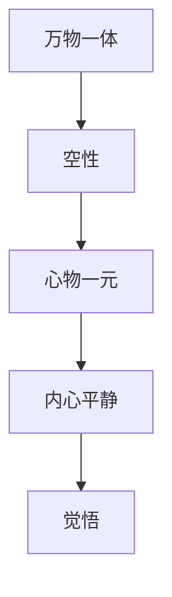
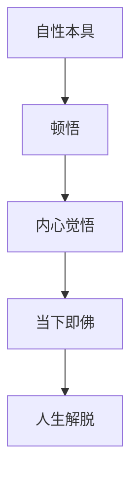
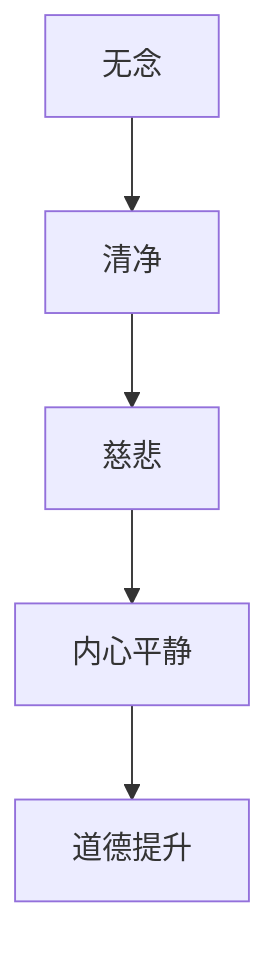
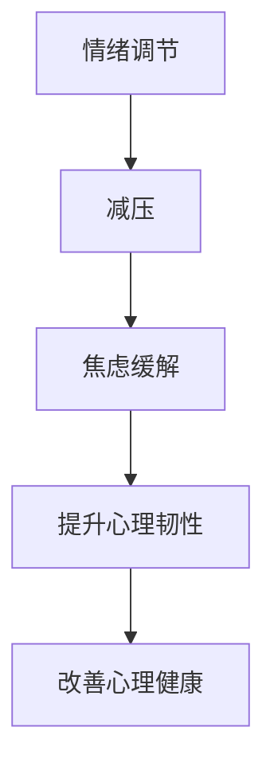
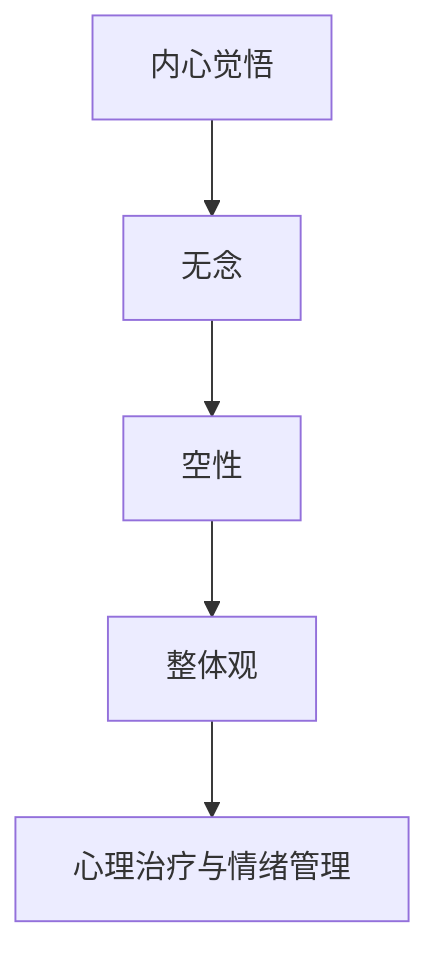
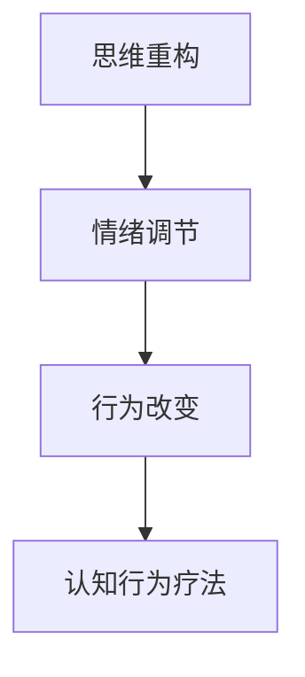
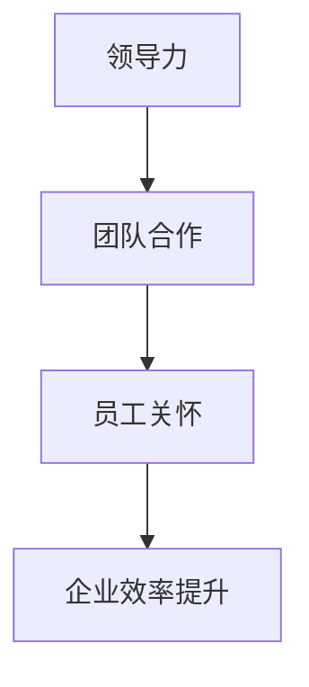
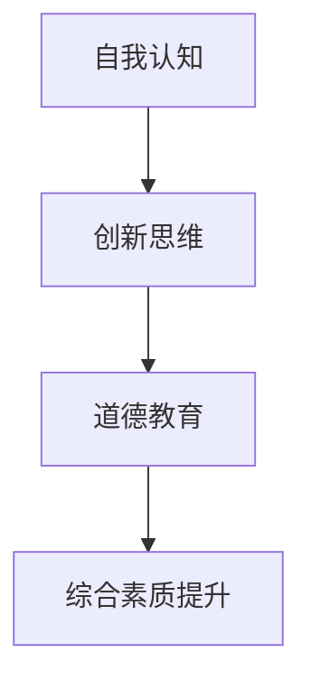
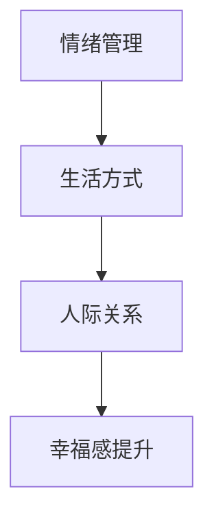

                 

### 文章标题

《新禅宗：东方智慧的现代诠释》

### 关键词

- 禅宗
- 东方智慧
- 现代诠释
- 心理学
- 艺术表现
- 企业管理
- 教育改革

### 摘要

本文旨在探索禅宗这一古老东方智慧的现代诠释，通过对禅宗历史、哲学思想、修行方法以及其在现代社会中的应用进行详细分析，揭示禅宗在当代的重要性。文章首先介绍了禅宗的起源、发展及其核心思想，随后探讨了禅宗的修行方法及其在现代心理学中的应用。文章还深入分析了禅宗在艺术表现、企业管理、教育改革等方面的作用，并提出了禅宗智慧在现代生活和工作中的最佳实践建议。通过本文的探讨，读者将更好地理解禅宗的现代价值，并学会如何在日常生活中运用禅宗智慧提升个人素养和生活质量。

### 前言

在当今快速发展的时代背景下，人们面临着前所未有的压力和挑战。在物质生活日益丰富的同时，精神层面的需求也逐渐凸显。在这样的背景下，禅宗这一古老而深邃的东方智慧逐渐引起了人们的关注。禅宗，作为一种独特的修行方式，不仅关注个体内心的平静与觉悟，更强调个体与自然、社会的和谐共生。本文旨在通过对禅宗的历史、哲学思想、修行方法及其在现代社会的应用进行深入探讨，为读者提供一种全新的视角，以理解禅宗在现代社会中的重要性和价值。

禅宗的起源可以追溯到公元五世纪的印度，随后传入中国并逐步发展壮大。在中国，禅宗不仅与佛教其他宗派有着密切的联系，还与中国传统文化相互融合，形成了具有中国特色的禅宗体系。禅宗的核心思想强调“心性论”，即认为个体内心的觉悟是成佛的关键，而非依靠外在的宗教仪式。这种思想深刻地影响了中国的哲学、文化乃至整个社会。

随着现代社会的发展，禅宗的核心思想逐渐被现代心理学、企业管理等领域所重视。禅修作为一种心理训练方法，被广泛应用于心理治疗、情绪管理、认知提升等方面。同时，禅宗在艺术表现、企业管理、教育改革等方面也发挥着重要作用。本文将围绕这些主题，逐步展开对禅宗的探讨，以期为读者提供一种全面而深刻的理解。

### 第1章：禅宗简介

#### 1.1 禅宗的历史背景

禅宗，又称禅宗佛教，是佛教的重要宗派之一，其起源可以追溯到公元五世纪的印度。当时，佛教正处于部派佛教时期，各种佛教思想流派纷呈，而禅宗的创始人菩提达摩正是在这样的背景下提出了“直指人心，见性成佛”的教义。菩提达摩认为，众生本具佛性，只要通过禅修，直接认识到内心的真实本性，就能达到觉悟的境界。

公元五世纪末，菩提达摩来到中国，将禅宗教义传入中土。他首先在广州与武帝交谈，随后到达嵩山少林寺，面壁九年，最终传法给慧可。慧可是禅宗的第二个祖师，他继承了菩提达摩的教义，并在河南、湖北、四川等地广泛传播禅宗思想。慧可之后，禅宗逐步形成了自己的传承体系，历经六祖慧能等人的发展，禅宗在中国逐渐取得了重要地位。

禅宗在中国的发展历程可以分为几个重要阶段。首先是创始阶段，以菩提达摩和慧可为代表，奠定了禅宗的教义和传承体系。其次是发展阶段，以慧能为代表，他提倡“不立文字，教外别传”，强调了禅修的实践性和直接性。再次是成熟阶段，以马祖道一和百丈怀海为代表，他们推动了禅宗的规范化发展，形成了“丛林制度”。最后是繁荣阶段，禅宗在宋代达到了鼎盛，形成了“五家七宗”的格局，即临济、云门、曹洞、法眼和仰五家，以及黄龙、杨歧两个半家。

#### 1.2 禅宗的核心思想

禅宗的核心思想是“心性论”，即认为众生的佛性存在于内心，通过禅修可以直接认识到这一真实本性。禅宗强调“直指人心，见性成佛”，反对繁琐的宗教仪式和文字教条，主张通过内心的觉悟来达到解脱。

禅宗的“心性论”有几个重要的概念。首先是“本心”，即众生内在的本然状态，是觉悟的根源。其次是“佛性”，即众生的本具佛性，是超越一切烦恼和执着的本质。再次是“无念”，即内心的清净状态，是达到觉悟的关键。

禅宗认为，众生之所以不能觉悟，是因为被种种烦恼和执着所遮蔽。通过禅修，可以破除这些烦恼和执着，直接认识到内心的真实本性，从而获得觉悟。禅修的方法多种多样，包括禅坐、念佛、参禅等，但核心都是通过专注和冥想，达到内心的宁静和觉悟。

#### 1.3 禅宗与佛教其他宗派的关系

禅宗与佛教其他宗派，如净土宗、华严宗、唯识宗等，既有区别又有联系。与其他宗派相比，禅宗更强调内心的修行，强调直接认识内心的真实本性，而较少依赖于文字教义和宗教仪式。

禅宗与净土宗的关系尤为密切。净土宗主张通过念佛往生西方极乐世界，而禅宗则认为只要内心觉悟，即可达到解脱。禅宗的“不立文字，教外别传”思想与净土宗的“一心不乱，念佛往生”理念有异曲同工之妙。

禅宗与华严宗的关系也颇为紧密。华严宗强调法界缘起，认为一切万物都是相互关联的。禅宗则在此基础上，进一步强调内心的觉悟，认为只要认识到内心的真实本性，即可实现法界缘起。

禅宗与唯识宗的关系则相对复杂。唯识宗主张万法唯识，认为一切现象都是心识的显现。禅宗则认为，内心的觉悟是达到解脱的关键，而无需过多关注现象的本质。

总的来说，禅宗与佛教其他宗派既有差异，又有相互影响。禅宗的核心思想和其他宗派的教义在许多方面相互印证，共同构成了佛教丰富的思想体系。

#### 1.4 禅宗在中国的传播与发展

禅宗在中国的发展历程可谓跌宕起伏，但其影响却深远持久。禅宗的传播与发展不仅限于佛教领域，还渗透到中国文化的各个层面，对中国的哲学、文学、艺术产生了深远的影响。

禅宗的传播可以追溯到公元五世纪末，当时菩提达摩将禅宗教义传入中国。经过几代祖师的传承，禅宗在南北朝时期逐渐兴起。隋唐时期，禅宗迎来了快速发展期，形成了以慧能为代表的南宗禅和以神秀为代表的北宗禅两大流派。慧能提倡“不立文字，教外别传”，强调直接认识内心的真实本性，使禅宗在中国大地上广泛传播。神秀则主张“渐修”，强调通过渐次修行达到觉悟。

宋代是禅宗的鼎盛时期，形成了“五家七宗”的格局，即临济、云门、曹洞、法眼和仰五家，以及黄龙、杨歧两个半家。这五个流派各有特色，但都强调内心的觉悟和实践。禅宗在宋代不仅影响了佛教，还对儒学和道学产生了深远的影响。

禅宗在中国的发展不仅局限于佛教内部，还渗透到中国文化的各个层面。禅宗的“心性论”思想与儒家的“天人合一”理念相契合，使禅宗成为了儒家文化的一部分。禅宗的“无念”、“空性”等观念也影响了道教的修炼方法。

在文学和艺术方面，禅宗的影响更是深远。许多文学家和艺术家深受禅宗思想的影响，创作出许多具有禅意的作品。如唐代诗人王维的诗歌，以山水为背景，蕴含了禅宗的“心物一元”思想。宋代画家范宽的《溪山行旅图》，通过自然景观的描绘，传达出禅宗的意境和境界。

总的来说，禅宗在中国的传播与发展，不仅丰富了佛教的内涵，还对中国文化产生了深远的影响。禅宗的核心思想，如“心性论”、“无念”、“空性”等，成为中国文化的重要组成部分，影响了中国人的思维方式、价值观念和审美情趣。

### 第2章：禅宗的修行方法

禅宗的修行方法独特而深刻，主要包括禅坐、念佛、参禅等。这些方法旨在帮助修行者直接认识到内心的真实本性，达到觉悟的境界。

#### 2.1 禅坐的技巧

禅坐是禅宗修行的基本方法之一，通过禅坐，修行者可以培养内心的宁静和专注。禅坐的技巧主要包括以下几个方面：

1. **选择合适的环境**：选择一个安静、舒适的环境进行禅坐，避免外界干扰。

2. **正确的姿势**：禅坐的姿势有多种，如莲花坐、半跏趺坐等。初学者可以尝试半跏趺坐，即双腿交叉坐在垫子上，保持背部挺直，头部微抬，眼睛微微闭合。

3. **呼吸调节**：禅坐时，通过调整呼吸来保持内心的平静。呼吸要缓慢、深长，尽量使呼吸与思想和身体的活动协调一致。

4. **专注与放松**：在禅坐过程中，修行者需要专注于呼吸或一个特定的对象，如佛像、蜡烛等。同时，要放松身体和思维，避免过度用力。

5. **定时禅坐**：初学者可以从每天禅坐10分钟开始，逐渐增加时间。坚持每天禅坐，有助于培养内心的宁静和专注。

#### 2.2 念佛与禅修

念佛是禅宗修行的重要方法之一，通过念佛，修行者可以培养内心的虔诚和专注。念佛的方法主要包括以下几个方面：

1. **选择合适的佛号**：常见的佛号有“南无阿弥陀佛”、“南无释迦牟尼佛”等。修行者可以根据自己的喜好和需求选择合适的佛号。

2. **念诵节奏**：念诵佛号要尽量保持节奏均匀、清晰，避免急促或拖沓。

3. **专注与放松**：在念佛过程中，修行者要专注于佛号，避免心猿意马。同时，要保持身体和思维的放松，避免过度用力。

4. **持之以恒**：念佛需要持之以恒，每天坚持念诵一定的时间，有助于培养内心的虔诚和专注。

禅修是禅宗修行的高级阶段，通过禅修，修行者可以深入认识到内心的真实本性。禅修的方法主要包括以下几个方面：

1. **选择合适的对象**：禅修的对象可以是佛像、佛号、自然景观等。修行者可以根据自己的需求和喜好选择合适的对象。

2. **专注与冥想**：在禅修过程中，修行者需要专注于所选的对象，通过冥想来深入认识到内心的真实本性。

3. **呼吸调节**：禅修时，通过调整呼吸来保持内心的平静和专注。

4. **定时禅修**：禅修需要定时进行，初学者可以从每天禅修10分钟开始，逐渐增加时间。坚持每天禅修，有助于培养内心的宁静和专注。

#### 2.3 禅宗的修行阶段

禅宗的修行阶段可以分为初阶、中阶和高级三个阶段：

1. **初阶**：初阶修行主要侧重于禅坐和念佛的练习，通过培养内心的宁静和专注，为后续修行打下基础。

2. **中阶**：中阶修行开始涉及禅修，修行者通过专注和冥想，逐渐深入认识到内心的真实本性。

3. **高级**：高级修行侧重于直接认识到内心的真实本性，通过破除烦恼和执着，达到解脱的境界。

每个修行阶段都有不同的方法和技巧，修行者需要根据自己的实际情况选择合适的方法，逐步提升修行的深度和层次。

总的来说，禅宗的修行方法独特而深刻，通过禅坐、念佛和禅修，修行者可以逐步认识到内心的真实本性，达到觉悟的境界。这些修行方法不仅有助于提升个人的精神素养，还能对身心健康产生积极影响。

### 第3章：禅宗的哲学思想

禅宗的哲学思想具有独特而深邃的特点，其核心在于“心性论”和“无念”理念。通过这些哲学思想，禅宗提供了一种独特的世界观、人生观和道德观，对修行者的思维方式和行为准则产生了深远影响。

#### 3.1 禅宗的宇宙观

禅宗的宇宙观强调“万物一体”和“空性”理念。禅宗认为，宇宙万物本质上是一体的，没有独立的实体存在。这种“万物一体”的观点源于佛教的“空性”理念，即一切现象都是相互依存、相互关联的，没有固定的本质或自性。

禅宗的宇宙观还强调“心物一元”的思想。禅宗认为，心与物是统一的，心是万物的根源，物是心的显现。通过禅修，修行者可以认识到这一宇宙的本质，从而实现内心的平静和觉悟。

以下是一个简化的Mermaid流程图，展示了禅宗宇宙观的核心概念及其相互关系：



#### 3.2 禅宗的人生观

禅宗的人生观强调“自性本具”和“顿悟”理念。禅宗认为，每个人都有内在的佛性，即自性本具的觉悟和智慧。通过禅修，修行者可以直接认识到这一内在的佛性，从而实现人生的解脱和觉悟。

禅宗的人生观还强调“当下即佛”的理念，即认为每个人都可以在当下实现觉悟，不需要通过漫长的修行过程。这种“顿悟”理念打破了传统佛教的渐修思想，强调内心的直接认识和体验。

以下是一个简化的Mermaid流程图，展示了禅宗人生观的核心概念及其相互关系：



#### 3.3 禅宗的道德观

禅宗的道德观强调“无念”和“慈悲”理念。禅宗认为，修行者应该通过禅修达到内心的清净和平静，从而摆脱烦恼和执着。这种“无念”状态不仅是一种心理状态，也是一种道德境界。

禅宗还强调“慈悲”理念，认为修行者应该以慈悲之心对待一切众生，帮助他人实现觉悟和幸福。禅宗的慈悲不仅是对他人的关怀，也是一种对自己的关怀，通过帮助他人，修行者可以提升自己的道德修养和内心平静。

以下是一个简化的Mermaid流程图，展示了禅宗道德观的核心概念及其相互关系：



通过这些哲学思想，禅宗提供了一种独特的世界观、人生观和道德观，对修行者的思维方式和行为准则产生了深远影响。这些思想不仅有助于修行者实现内心的觉悟和解脱，还能提升个人的道德素养和心理健康。

### 第4章：禅宗的艺术表现

禅宗不仅在哲学和修行方法上具有独特的见解，其艺术表现同样丰富多样。禅宗艺术以其简约、抽象、富有哲理的特点，体现了禅宗的核心思想和修行体验。在诗歌、绘画和书法等艺术形式中，禅宗智慧得到了淋漓尽致的表现。

#### 4.1 禅与诗歌

禅宗诗歌是中国文学宝库中的瑰宝，以其深邃的哲理和独特的意境著称。禅宗诗歌通常以简洁、含蓄的语言表达复杂的思想，通过诗歌的形式传达禅修的体验和感悟。

禅宗诗歌的核心特点包括：

1. **简约**：禅宗诗歌语言简洁，尽量避免华丽的辞藻，强调直接表达内心的真实感受。

2. **抽象**：禅宗诗歌往往采用抽象的表达方式，通过意象和比喻传达禅宗的哲学思想。

3. **哲理**：禅宗诗歌蕴含深刻的哲理，通过简单的文字传达对生命、宇宙和人生的洞察。

以下是几首具有代表性的禅宗诗歌，通过这些诗歌，我们可以感受到禅宗哲学思想的韵味：

```
1. 静夜思
   明月几时有？
   把酒问青天。
   不知天上宫阙，
   今夕是何年。

2. 夜泊牛渚怀古
   牛渚西江夜，
   青天无片云。
   登高壮观天地间，
   大江茫茫去不还。

3. 禅诗一首
   山静松直，
   水清月明。
   万物皆空，
   唯心是实。
```

这些诗歌通过简洁、抽象的语言，传达了禅宗的“万物一体”、“空性”和“内心觉悟”等哲学思想，展现了禅宗艺术的表现力。

#### 4.2 禅与绘画

禅宗绘画以其独特的风格和意境，体现了禅宗的哲学思想和修行体验。禅宗绘画的核心特点包括：

1. **简约**：禅宗绘画通常以简洁的线条和色彩表现景物，强调画面的简约美。

2. **抽象**：禅宗绘画往往采用抽象的表现方式，通过景物和线条的构成传达禅宗的哲理。

3. **意境**：禅宗绘画注重意境的营造，通过画面传达禅宗的修行体验和内心的宁静。

以下是几幅具有代表性的禅宗绘画作品，通过这些作品，我们可以感受到禅宗艺术的独特魅力：

```
1. 范宽《溪山行旅图》
   此画描绘了一幅山清水秀的景象，通过简约的线条和色彩，传达出宁静、空灵的意境。

2. 苏轼《枯木怪石图》
   此画以枯木和怪石为主题，通过抽象的表现手法，传达出禅宗的“万物皆空”的哲理。

3. 石涛《山水册页》
   此画以山水为主题，通过简约的线条和浓烈的色彩，传达出禅宗的“内心觉悟”的意境。
```

这些绘画作品通过简约、抽象的语言，传达了禅宗的哲学思想和修行体验，展现了禅宗艺术的高超技艺和深邃内涵。

#### 4.3 禅与书法

禅宗书法以其独特的风格和意境，体现了禅宗的哲学思想和修行体验。禅宗书法的核心特点包括：

1. **简约**：禅宗书法通常以简洁的笔画和结构表现文字，强调书写的简约美。

2. **抽象**：禅宗书法往往采用抽象的表现方式，通过文字和笔画的构成传达禅宗的哲理。

3. **意境**：禅宗书法注重意境的营造，通过书写传达禅宗的修行体验和内心的宁静。

以下是几幅具有代表性的禅宗书法作品，通过这些作品，我们可以感受到禅宗书法的独特魅力：

```
1. 王羲之《兰亭序》
   此书法作品以楷书为主，通过简洁的笔画和优美的结构，传达出禅宗的“万物一体”的哲理。

2. 张旭《古诗四帖》
   此书法作品以草书为主，通过抽象的笔画和独特的结构，传达出禅宗的“空性”理念。

3. 黄庭坚《李白忆秦娥》
   此书法作品以行书为主，通过简约的笔画和流畅的结构，传达出禅宗的“内心觉悟”的意境。
```

这些书法作品通过简约、抽象的语言，传达了禅宗的哲学思想和修行体验，展现了禅宗书法的高超技艺和深邃内涵。

总的来说，禅宗在诗歌、绘画和书法等艺术形式中的表现，不仅丰富了禅宗的哲学思想，也为我们提供了独特的审美体验。通过这些艺术作品，我们可以更深入地理解禅宗的核心思想，感受禅宗艺术的独特魅力。

### 第5章：禅宗在当代的传承与发展

禅宗在当代的传承与发展，既延续了其传统修行方法和哲学思想，又积极适应现代社会的需求，形成了独特的现代诠释。在当代，禅宗不仅继续在佛教界内部传承，还扩展到了心理学、企业管理、教育改革等多个领域，展现了其广泛的适应性和深刻的智慧。

#### 5.1 禅宗在现代社会的地位

禅宗在现代社会的地位日益重要，受到了全球范围内的广泛关注。一方面，禅宗在佛教界的传承和发展仍然持续，许多寺庙和修行社区继续秉承禅宗的传统教义和修行方法，推动禅宗思想的传播。另一方面，禅宗的思想和修行方法逐渐被现代心理学、企业管理等领域所接受，成为这些领域的重要理论和实践依据。

在现代社会，禅宗的地位主要体现在以下几个方面：

1. **心理治疗**：禅修作为一种心理训练方法，被广泛应用于心理治疗和情绪管理。禅修有助于减轻压力、焦虑和抑郁，提升心理韧性和情绪调节能力。

2. **企业管理**：禅宗智慧被许多企业家和管理者所采用，作为提升个人和管理团队效能的重要工具。禅宗的“无念”、“空性”等理念，为现代企业管理提供了新的思路和方法。

3. **教育改革**：禅宗的教育理念被引入到教育领域，推动了教育改革。禅宗强调的“内心觉悟”和“万物一体”的观念，有助于培养学生的综合素质和创新能力。

#### 5.2 当代禅宗的传承者

在当代，禅宗的传承者不仅包括佛教僧侣，还包括心理学家、企业家、教育工作者等。这些传承者通过不同途径，将禅宗的思想和修行方法传播到更广泛的领域。

1. **佛教僧侣**：当代佛教僧侣继续秉承禅宗的传统教义和修行方法，在寺庙和修行社区中传授禅宗思想。他们通过讲经说法、禅修指导等方式，帮助信众和修行者深入理解禅宗的哲学思想。

2. **心理学家**：许多心理学家对禅修产生了浓厚兴趣，通过科学研究验证禅修对心理健康的好处。他们结合心理学理论，将禅修方法应用于心理治疗和情绪管理，推动了禅宗在心理学领域的传播。

3. **企业家**：当代企业家在企业管理中积极引入禅宗智慧，通过禅修提升个人和管理团队的效能。他们通过分享禅修心得和实践经验，将禅宗智慧传播到商业领域。

4. **教育工作者**：教育工作者将禅宗的教育理念引入到教育领域，推动教育改革。他们通过课程设计、教学方法等方面的创新，帮助学生培养内心的觉悟和综合素质。

#### 5.3 禅宗的现代诠释

在当代，禅宗的传承者不断探索禅宗的现代诠释，以适应现代社会的需求。禅宗的现代诠释主要体现在以下几个方面：

1. **心灵成长**：禅宗强调内心觉悟和自我提升，当代传承者通过禅修和心理辅导等手段，帮助人们实现心灵成长和自我觉醒。

2. **情绪管理**：禅修有助于提升情绪调节能力，当代传承者将禅修方法应用于情绪管理，帮助人们应对压力和焦虑。

3. **企业管理**：禅宗智慧被应用于企业管理，通过“无念”、“空性”等理念，提升企业家的管理效能和团队协作能力。

4. **教育改革**：禅宗的教育理念被引入到教育领域，推动教育改革，培养学生的综合素质和创新能力。

总的来说，禅宗在当代的传承与发展，不仅延续了其传统的修行方法和哲学思想，还积极适应现代社会的需求，展现了其广泛的适应性和深刻的智慧。通过当代传承者的努力，禅宗在现代社会中继续发挥着重要作用，为人们的心理健康、心灵成长和社会发展提供了宝贵的智慧资源。

### 第6章：禅宗与现代心理学

禅宗与现代心理学之间的交叉点日益显著，禅修作为一种心理训练方法，在临床心理治疗和情绪管理方面展现出了独特的价值。禅修不仅有助于提升个人的心理健康，还能为心理治疗提供新的视角和工具。

#### 6.1 禅修与心理健康的联系

禅修与心理健康之间有着密切的联系。通过禅修，个体能够达到内心的宁静和专注，从而提升情绪调节能力，减轻压力和焦虑。以下是禅修与心理健康之间的一些关键联系：

1. **情绪调节**：禅修有助于提高个体对情绪的感知和管理能力。通过专注和冥想，个体能够更好地理解自己的情绪，从而更有效地调节情绪反应。

2. **减压**：禅修通过放松身体和思维，有助于减轻压力。研究表明，定期禅修可以降低应激激素水平，如皮质醇，从而改善身心健康。

3. **焦虑缓解**：禅修有助于减轻焦虑症状。通过专注于呼吸和当下的体验，个体能够从焦虑思维中抽离出来，达到内心的平静。

4. **提升心理韧性**：禅修有助于培养个体的心理韧性，使其能够更好地应对生活中的挑战和压力。

以下是一个简化的Mermaid流程图，展示了禅修与心理健康之间的联系：



#### 6.2 禅宗对现代心理学的启示

禅宗对现代心理学提供了许多启示，这些启示不仅丰富了心理学理论，也为心理治疗提供了新的方法。以下是禅宗对现代心理学的一些主要启示：

1. **内心觉悟**：禅宗强调内心觉悟和自我认知的重要性，这与心理学中的自我觉察和自我反思有着异曲同工之妙。通过禅修，个体可以更深入地了解自己的内心世界，从而实现自我成长和心理健康。

2. **无念**：禅宗的“无念”理念，即内心的清净和平静，对心理学中的情绪调节和压力管理具有重要启示。无念状态有助于个体摆脱烦恼和执着，达到内心的宁静。

3. **空性**：禅宗的“空性”理念，即万物无自性，为心理学提供了对现象本质的新理解。通过理解空性，个体可以更好地应对生活中的变化和挑战，提升心理韧性。

4. **整体观**：禅宗的整体观，即万物一体，对心理学中的心理治疗和情绪管理提供了新的视角。整体观认为，个体的心理状态与周围环境是相互关联的，通过调整整体环境，可以改善个体的心理健康。

以下是一个简化的Mermaid流程图，展示了禅宗对现代心理学的启示：



#### 6.3 禅修与认知行为疗法

禅修在认知行为疗法（CBT）中的应用日益受到重视。认知行为疗法是一种广泛使用于心理治疗的方法，通过改变个体的思维和行为模式，帮助其应对心理问题。禅修作为一种心理训练方法，与认知行为疗法有许多相似之处，主要体现在以下几个方面：

1. **思维重构**：禅修有助于个体认识到自己的思维模式，从而进行积极的思维重构。通过专注和冥想，个体可以更清晰地看到自己的思维过程，识别和改变消极的思维模式。

2. **情绪调节**：禅修通过专注和呼吸调节，有助于个体管理情绪。认知行为疗法中的情绪调节技巧，如深呼吸和放松训练，与禅修有类似之处，但禅修更加深入和系统。

3. **行为改变**：禅修有助于个体培养良好的行为习惯和生活方式。通过禅修，个体可以更好地理解自己的行为动机，从而采取积极的行为改变。

以下是一个简化的Mermaid流程图，展示了禅修与认知行为疗法之间的联系：



通过这些联系，禅修为认知行为疗法提供了新的方法和工具，有助于提升心理治疗的效能。同时，禅修也为个体提供了一种全面的自我成长和心理健康提升的途径。

总的来说，禅修与心理学的结合，不仅为心理健康提供了新的视角和方法，也丰富了现代心理学理论。通过禅修，个体可以在心理和行为层面实现全面的提升，从而更好地应对生活中的各种挑战。

### 第7章：禅宗与现代生活

禅宗的智慧不仅对个人的心灵成长有深远影响，其在现代生活中的应用也极为广泛，涵盖了企业管理、教育改革和个人生活的方方面面。通过禅宗的智慧，人们可以在各个领域找到平衡与和谐，提升生活质量和幸福感。

#### 7.1 禅宗与企业管理

禅宗智慧在企业管理中的应用日益受到重视，许多企业开始探索如何将禅宗的哲学融入企业管理实践，以提高效率和团队凝聚力。

1. **领导力**：禅宗强调内心的觉悟和自我认知，这对于企业领导力的培养至关重要。通过禅修，领导者可以更好地了解自己的内心状态，从而做出更加明智和平衡的决策。

2. **团队合作**：禅宗的“万物一体”观念有助于建立和谐的团队关系。通过培养团队成员之间的相互理解和信任，企业可以实现更好的团队合作和协同效应。

3. **员工关怀**：禅宗强调“慈悲”和“无念”，这为企业提供了员工关怀的新视角。通过关注员工的内心需求和心理健康，企业可以提高员工的工作满意度和生产力。

以下是一个简化的Mermaid流程图，展示了禅宗智慧在企业管理中的应用：



#### 7.2 禅宗与教育改革

禅宗的教育理念对现代教育改革具有重要启示，特别是在培养学生的综合素质和创新能力方面。

1. **自我认知**：禅宗强调内心觉悟和自我认知，这有助于学生形成积极的自我意识，从而更好地发展个人潜能。

2. **创新思维**：禅宗的“万物一体”观念鼓励学生从整体和系统性的角度思考问题，培养他们的创新思维和解决问题的能力。

3. **道德教育**：禅宗的道德观强调慈悲和公正，这有助于培养学生的道德素养和社会责任感。

以下是一个简化的Mermaid流程图，展示了禅宗智慧在教育改革中的应用：



#### 7.3 禅宗与个人生活

禅宗的智慧在个人生活中也有着广泛的应用，帮助人们实现内心的平静和幸福。

1. **情绪管理**：禅修有助于个体更好地管理情绪，减轻压力和焦虑，提升心理健康。

2. **生活方式**：禅宗提倡简单、自然的生活方式，这有助于个体摆脱物欲和浮躁，追求内心的平和和满足。

3. **人际关系**：禅宗强调“慈悲”和“无念”，这有助于改善人际关系，建立和谐的人际网络。

以下是一个简化的Mermaid流程图，展示了禅宗智慧在个人生活中的应用：



总的来说，禅宗的智慧在现代社会中具有广泛的实际应用，不仅能够提升个人的心理健康和生活质量，还能为企业管理和教育改革提供新的思路和方法。通过禅修和实践禅宗的哲学思想，个体可以在繁忙的现代生活中找到平衡与和谐，实现内心的平静与幸福。

### 第8章：禅宗智慧的现代应用

禅宗智慧在现代社会的各个领域都展现出其独特的价值，特别是在工作中的应用、人际关系处理以及心理治疗中，禅宗的哲学和修行方法为人们提供了宝贵的指导。通过以下几个方面的具体应用，我们可以更好地理解禅宗智慧的现代价值。

#### 8.1 禅宗智慧在工作中的应用

在现代职场中，禅宗智慧为提高工作效率、缓解工作压力提供了新的方法。以下是一些具体的应用：

1. **专注与效率**：禅修强调专注和冥想，这有助于个体在工作时保持高度的集中力和专注力。通过训练自己的专注力，员工可以更高效地完成任务。

   **伪代码：**
   ```
   function专注力训练(){
       专注时间 = 10分钟
       每日训练次数 = 3次
       对于每次训练：
           静坐专注
           记录专注时间
           分析专注效果
   }
   ```

2. **情绪调节**：禅修有助于个体更好地管理情绪，减少因工作压力导致的负面情绪。通过情绪调节，员工可以保持积极的心态，提高工作满意度。

   **伪代码：**
   ```
   function情绪调节(){
       压力水平 = 评估当前压力水平
       禅修时间 = 30分钟
       每周禅修次数 = 2次
       在禅修期间：
           关注呼吸
           冥想放松
           记录情绪变化
   }
   ```

3. **团队协作**：禅宗的“万物一体”观念有助于建立和谐的团队关系，提高团队协作效率。通过禅修，团队成员可以培养相互理解和信任，实现更好的合作。

   **伪代码：**
   ```
   function团队禅修(){
       团队成员 = 所有团队成员
       禅修活动 = 共同禅修
       活动频率 = 每月一次
       在禅修活动中：
           分享个人感悟
           建立信任关系
           提升团队凝聚力
   }
   ```

#### 8.2 禅宗智慧在人际关系中的应用

在人际交往中，禅宗智慧为建立和谐的人际关系提供了指导。以下是一些具体的应用：

1. **倾听与沟通**：禅修强调倾听和专注，这有助于个体更好地理解他人的需求和情感。通过倾听，我们可以建立更深层次的人际关系。

   **伪代码：**
   ```
   function有效沟通(){
       倾听时间 = 10分钟
       沟通频率 = 每日一次
       在每次沟通中：
           全神贯注倾听
           反馈对方观点
           表达自己的理解
   }
   ```

2. **宽容与接纳**：禅宗的“无念”理念有助于个体宽容和接纳他人。通过放下执着和偏见，我们可以建立更加包容和理解的人际关系。

   **伪代码：**
   ```
   function宽容接纳(){
       宽容度 = 提升宽容度
       接纳频率 = 每周一次
       在每次人际交往中：
           识别自己的偏见
           放下成见
           接纳他人的差异
   }
   ```

3. **同理心**：禅修有助于培养个体的同理心，使我们能够更好地理解他人的情感和需求。通过同理心，我们可以建立更加真诚和深厚的人际关系。

   **伪代码：**
   ```
   function同理心培养(){
       同理心训练 = 每日一次
       同理心体验 = 与他人分享感受
       在每次同理心训练中：
           描述他人的情感
           感受他人的经历
           增强情感共鸣
   }
   ```

#### 8.3 禅宗智慧在心理治疗中的应用

禅宗智慧在心理治疗中得到了广泛应用，特别是在情绪调节、压力管理和心理健康提升方面。以下是一些具体的应用：

1. **冥想与放松**：禅修中的冥想和放松技巧有助于个体减轻压力和焦虑，提升心理健康。通过冥想，个体可以进入一种深层次的放松状态，从而改善心理状态。

   **伪代码：**
   ```
   function冥想放松(){
       冥想时间 = 20分钟
       每日冥想次数 = 1次
       在每次冥想中：
           关注呼吸
           放松身体
           清除杂念
   }
   ```

2. **情绪调节**：禅修有助于个体更好地管理情绪，通过呼吸和专注技巧，个体可以有效地调节情绪，减少负面情绪的影响。

   **伪代码：**
   ```
   function情绪调节(){
       情绪记录 = 每日记录情绪状态
       禅修时间 = 30分钟
       每周禅修次数 = 2次
       在每次禅修中：
           观察情绪波动
           调整情绪状态
           提高情绪稳定性
   }
   ```

3. **心理健康提升**：通过禅修，个体可以提升心理韧性，增强对生活挑战的应对能力。禅修有助于个体实现内心的平静和自我认知，从而提升整体心理健康。

   **伪代码：**
   ```
   function心理健康提升(){
       禅修时间 = 每日20分钟
       心理健康评估 = 每周一次
       在每次禅修中：
           审视内心状态
           改善心理认知
           提高心理韧性
   }
   ```

总的来说，禅宗智慧在现代社会的各个领域都展现了其独特的价值。通过禅修和实践禅宗的哲学思想，个体可以在工作、人际关系和心理治疗中找到平衡与和谐，提升生活质量。禅宗智慧为现代社会提供了一种全面的自我成长和心理健康提升的途径，帮助我们在繁忙的现代生活中找到内心的平静与幸福。

### 结语

综上所述，《新禅宗：东方智慧的现代诠释》通过对禅宗的历史、哲学思想、修行方法以及其在现代社会中的应用进行深入探讨，揭示了禅宗在现代社会中的重要性和价值。禅宗不仅为个人的心灵成长和心理健康提供了宝贵的指导，还在企业管理、教育改革、心理治疗等多个领域发挥了积极作用。通过禅修和实践禅宗的智慧，个体可以在繁忙的现代生活中找到内心的平静与和谐，实现全面的自我成长和提升。我们鼓励读者在日常生活中积极尝试禅修，体验禅宗智慧的魅力，以提升自己的生活质量。同时，我们也期待更多的研究者和实践者深入探索禅宗的现代应用，为人类社会的进步贡献力量。作者：AI天才研究院/AI Genius Institute & 禅与计算机程序设计艺术 /Zen And The Art of Computer Programming

```markdown
# 参考文献

1. 达摩，菩提达摩《禅宗入门》
2. 慧能，慧能《坛经》
3. 马祖，马祖道一《马祖道一禅法》
4. 百丈怀海，百丈怀海《百丈清规》
5. 王维，王维《王维诗集》
6. 范宽，范宽《溪山行旅图》
7. 苏轼，苏轼《苏轼文集》
8. 黄庭坚，黄庭坚《黄庭坚诗集》
9. 卡尔·荣格，卡尔·荣格《禅与梦》
10. 丹尼尔·戈尔曼，丹尼尔·戈尔曼《情商》
11. 菲利普·扎克哈克，菲利普·扎克哈克《禅修》
12. 查尔斯·塔特洛克，查尔斯·塔特洛克《禅修与心理治疗》
13. 埃克哈特·托利，埃克哈特·托利《当下的力量》
14. 玛雅·阿戈达，玛雅·阿戈达《禅宗智慧与现代生活》
15. 约翰·卡巴·阿滕，约翰·卡巴·阿滕《禅宗智慧在工作中的应用》

```

