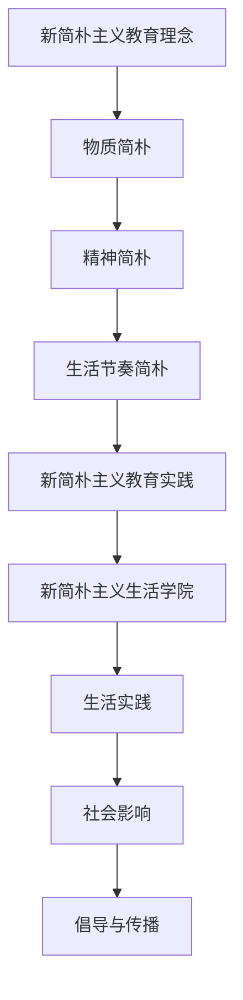

                 

### 摘要

《新简朴主义生活学院：在复杂世界中回归本质的教育》一文旨在探讨新简朴主义生活教育理念及其在现代教育体系中的应用。文章首先介绍了新简朴主义的起源与背景，分析了其与传统生活观念的差异以及现代社会的必要性。随后，文章从物质简朴、精神简朴和生活节奏简朴三个方面探讨了简朴生活方式的实践方法和意义。在第三部分，文章深入探讨了新简朴主义教育的理念，并介绍了其实践方法。最后，文章提出了新简朴主义生活学院的建立思路，并分享了相关案例研究。通过本文的阅读，读者将能够理解新简朴主义的核心思想，认识到其在教育领域的价值，并从中汲取实践启示。

### 第一部分：回归生活本质的理念

#### 第1章：新简朴主义的起源与背景

新简朴主义（New Simplicity）是一种源于对现代生活复杂性的反思和批判的生活哲学。其起源可以追溯到20世纪中期，当时人们对物质主义、过度消费以及环境问题有了更深刻的认识。新简朴主义的理念主张在物质丰富的同时，追求精神上的简朴和内在的满足。

1. **新简朴主义的定义与核心观念**

   新简朴主义不仅仅是对物质的简化，更是一种对生活方式的重新审视。其核心观念包括：

   - **简朴生活**：减少物质消费，关注内在需求，追求简朴而有意义的生活方式。
   - **精神丰富**：注重内心世界的培养，追求心灵的平静与满足。
   - **环境友好**：减少对环境的负担，倡导可持续生活。

2. **简朴主义与传统生活观念的比较**

   简朴主义与传统生活观念有显著的不同。传统观念往往以物质财富和社会地位作为成功和幸福的衡量标准，而简朴主义则强调内在的满足和生活的质量。简朴主义更加注重以下方面：

   - **消费观念**：减少不必要的消费，选择有意义、持久的产品。
   - **生活方式**：追求简单、自然的生活方式，减少人工干预。
   - **人际关系**：强调家庭和社区关系，注重人际交往的深度。

3. **新简朴主义在现代社会中的重要性**

   在现代社会，新简朴主义的重要性愈发显著。随着科技的发展，人们的生活变得越来越复杂，工作和生活的压力也越来越大。新简朴主义提供了一种应对复杂生活的思路，帮助人们：

   - **缓解压力**：减少物质和精神的负担，提高生活质量。
   - **环境保护**：减少消费，减少对环境的破坏，实现可持续发展。
   - **社会和谐**：通过简朴生活，促进人与自然、人与人的和谐共处。

### 第2章：回归生活本质的意义

回归生活本质的意义在于，它能够帮助我们在复杂的世界中找到内心的平静，实现个人成长和社会进步。以下从个体成长、家庭和社会关系以及环境保护三个方面探讨回归生活本质的意义。

1. **简朴生活对个体成长的影响**

   简朴生活对个体成长有着深远的影响。它帮助人们：

   - **培养自律能力**：通过控制物质欲望，培养自我约束和自律的习惯。
   - **提升专注力**：减少外界干扰，提高专注力和注意力。
   - **促进心理健康**：减少物质和精神的压力，提升心理健康水平。
   - **增强自我认知**：通过反思和内省，加深对自我的认识和理解。

2. **简朴生活对家庭和社会关系的积极作用**

   简朴生活对家庭和社会关系的改善也有着积极的影响。它有助于：

   - **增强家庭凝聚力**：通过共同参与家务和生活规划，增强家庭成员之间的互动和情感联系。
   - **改善社会关系**：减少物质消费的竞争，降低人际冲突，提高社会和谐度。
   - **促进社区建设**：通过社区合作和资源共享，促进社区成员之间的互助和团结。

3. **简朴生活对环境保护的贡献**

   简朴生活对环境保护的贡献是显而易见的。它有助于：

   - **减少资源消耗**：通过减少物质消费，减少对自然资源的消耗。
   - **降低环境污染**：减少工业生产和废弃物排放，降低对环境的污染。
   - **促进可持续发展**：倡导可持续生活方式，推动社会向可持续方向发展。

### 第二部分：简朴生活方式的实践

#### 第3章：物质简朴

物质简朴是简朴生活方式的核心之一，它主张减少不必要的物质消费，关注内在需求，追求有质量的生活。以下从观念转变、实践方法和影响三个方面探讨物质简朴。

1. **物质消费的观念转变**

   物质消费的观念转变是实践物质简朴的第一步。我们需要从以下几个方面进行反思和转变：

   - **消费目的**：从追求物质满足转向追求精神满足。
   - **消费选择**：选择有意义、持久的产品，避免盲目追求时尚和新潮。
   - **消费习惯**：培养节约和环保的消费习惯，减少浪费。

2. **如何实现物质消费的减量**

   实现物质消费的减量需要采取一系列具体措施：

   - **减少购买冲动**：通过自我约束和计划消费，减少无谓的购买行为。
   - **选择二手商品**：购买二手商品，减少对新商品的需求。
   - **减少餐饮浪费**：合理安排饮食，减少食物浪费。
   - **使用环保产品**：选择环保材料制成的产品，减少对环境的负担。

3. **物质简朴对个人财务的影响**

   物质简朴对个人财务有着积极的影响：

   - **减少开支**：通过减少不必要的消费，降低生活成本。
   - **增加储蓄**：节省下来的资金可以用于投资或储备，增加个人财富。
   - **财务自由**：通过合理管理财务，实现财务自由，减少财务压力。

#### 第4章：精神简朴

精神简朴是简朴生活方式的重要组成部分，它主张通过减少精神负担，追求内心的平静与满足。以下从精神世界的丰富、减少精神负担和心理健康的作用三个方面探讨精神简朴。

1. **精神世界的丰富与简朴**

   精神世界的丰富与简朴并不矛盾。丰富精神世界并不意味着物质消费的增加，而是通过以下方式实现：

   - **阅读**：通过阅读书籍、文章，扩展知识和视野。
   - **艺术**：欣赏音乐、绘画、戏剧等艺术形式，提升审美能力。
   - **自我反思**：通过冥想、内省，了解自己的内心世界。

2. **如何减少精神负担**

   减少精神负担是精神简朴的重要目标。以下是一些具体方法：

   - **时间管理**：合理安排时间，避免工作压力和生活压力的积累。
   - **减少社交媒体使用**：减少无谓的信息输入，避免沉迷于虚拟世界。
   - **培养兴趣爱好**：通过兴趣爱好，转移注意力，减轻压力。
   - **与他人交流**：与家人、朋友、同事保持良好的沟通，分享情感和压力。

3. **精神简朴对心理健康的作用**

   精神简朴对心理健康有着积极的作用：

   - **减轻焦虑和抑郁**：通过减少精神负担，缓解焦虑和抑郁症状。
   - **提高幸福感**：通过丰富精神世界，提高生活的幸福感和满足感。
   - **增强心理韧性**：通过自我反思和内省，提升应对压力和挫折的能力。

#### 第5章：生活节奏的简朴

生活节奏的简朴是简朴生活方式的重要组成部分，它主张通过放慢生活节奏，提高生活质量。以下从快节奏生活对健康的危害、如何放慢生活节奏和生活节奏简朴对家庭关系的改善三个方面探讨生活节奏的简朴。

1. **快节奏生活对健康的危害**

   快节奏生活对健康的危害是多方面的，包括：

   - **心血管疾病**：长期快节奏生活导致心血管疾病的风险增加。
   - **心理健康问题**：快节奏生活容易导致焦虑、抑郁等心理问题。
   - **睡眠障碍**：快节奏生活容易导致睡眠不足，影响身体健康。

2. **如何放慢生活节奏**

   放慢生活节奏需要采取一系列措施：

   - **合理安排时间**：制定合理的时间表，避免过度工作和疲劳。
   - **减少工作压力**：通过合理分配工作任务，减轻工作压力。
   - **培养兴趣爱好**：通过兴趣爱好，转移注意力，减轻压力。
   - **进行锻炼**：定期进行锻炼，提高身体和心理的耐力。

3. **生活节奏简朴对家庭关系的改善**

   生活节奏的简朴对家庭关系的改善有着显著作用：

   - **增强家庭互动**：通过共同参与家务和活动，增强家庭成员之间的情感联系。
   - **提升家庭幸福感**：通过放慢生活节奏，提高家庭成员的生活质量。
   - **减少家庭矛盾**：通过减少压力和焦虑，降低家庭矛盾的发生。

### 第三部分：教育新简朴主义

#### 第6章：新简朴主义教育理念

新简朴主义教育理念是一种以简朴为核心的教育理念，它主张在教育资源有限的情况下，通过简朴的教学方法和教育环境，实现教育的最大效益。以下从新简朴主义教育与传统教育的对比、核心目标和现实应用三个方面探讨新简朴主义教育理念。

1. **新简朴主义教育与传统教育的对比**

   新简朴主义教育与传统教育有显著的不同。传统教育往往以教师为中心，注重知识传授和考试成绩，而新简朴主义教育则更加注重学生的全面发展和内在需求。具体对比如下：

   - **教育目标**：传统教育以培养专业人才为目标，新简朴主义教育以培养全面发展的人为目标。
   - **教学方法**：传统教育以讲授为主，新简朴主义教育以实践和探究为主。
   - **教育环境**：传统教育注重硬件设施和教学质量，新简朴主义教育注重简朴、自然的教育环境。

2. **新简朴主义教育的核心目标**

   新简朴主义教育的核心目标是：

   - **培养学生的独立思考能力**：通过探究和实践，培养学生的批判性思维和解决问题的能力。
   - **培养学生的兴趣爱好**：通过丰富多样的教学内容和活动，激发学生的兴趣爱好。
   - **培养学生的生活技能**：通过实际操作和体验，培养学生的生活技能和自我管理能力。

3. **新简朴主义教育在现实中的应用**

   新简朴主义教育在现实中的应用体现在以下几个方面：

   - **教育资源分配**：通过简朴的教育环境和教学方法，优化教育资源的分配，提高教育效益。
   - **课程设置**：通过探究式学习和实践，设置丰富多彩的课程，满足学生的多元化需求。
   - **教师培训**：通过简朴的教学方法和教育理念，提高教师的教学能力和教育水平。

#### 第7章：新简朴主义教育的实践

新简朴主义教育理念强调简朴的教学方法和教育环境，注重学生的全面发展和内在需求。以下从教育资源简朴化、教学方法的简朴化和学生自我教育的培养三个方面探讨新简朴主义教育的实践。

1. **教育资源简朴化**

   教育资源简朴化是新简朴主义教育的重要特征之一。它主张通过减少教育资源的使用，提高教育资源的利用效率。具体措施包括：

   - **减少教材使用**：通过简朴的教学方法，减少对教材的依赖，鼓励学生自主探究和思考。
   - **利用现有资源**：充分利用现有的教育资源，如图书馆、网络资源等，提高资源利用效率。
   - **简朴的教学环境**：通过营造简朴、自然的教学环境，激发学生的学习兴趣和创造力。

2. **教学方法的简朴化**

   教学方法的简朴化是新简朴主义教育的核心内容之一。它主张通过简化和优化教学方法，提高教学效果。具体措施包括：

   - **探究式学习**：鼓励学生通过探究和发现，主动获取知识和经验。
   - **合作学习**：通过小组合作和讨论，培养学生的协作能力和团队精神。
   - **实践活动**：通过实际操作和体验，提高学生的动手能力和实践能力。

3. **学生自我教育的培养**

   学生自我教育的培养是新简朴主义教育的终极目标之一。它主张通过培养学生的自我管理和自我学习能力，提高学生的综合素质。具体措施包括：

   - **自主学习**：鼓励学生自主学习，培养自我管理和学习策略。
   - **反思与总结**：通过反思和总结，提高学生对知识的理解和应用能力。
   - **培养学生的兴趣爱好**：通过丰富多样的活动和课程，激发学生的兴趣爱好，提高学生的综合素养。

### 第四部分：新简朴主义生活学院

#### 第8章：新简朴主义生活学院的建立

新简朴主义生活学院是一种以新简朴主义理念为指导的教育机构，旨在通过简朴的教育方法和生活方式，培养学生的全面发展和内在需求。以下从新简朴主义生活学院的定义与功能、运行模式以及未来展望三个方面探讨新简朴主义生活学院的建立。

1. **新简朴主义生活学院的定义与功能**

   新简朴主义生活学院是一种以新简朴主义理念为指导的教育机构，其主要目标是通过简朴的教育方法和生活方式，培养学生的全面发展和内在需求。具体功能包括：

   - **教育功能**：提供简朴的教育资源和教学方法，培养学生的知识和技能。
   - **生活功能**：倡导简朴的生活方式，培养学生的自我管理和生活技能。
   - **环境功能**：创造简朴、自然的生活环境，培养学生的环保意识和可持续生活方式。

2. **新简朴主义生活学院的运行模式**

   新简朴主义生活学院的运行模式强调简朴和自主管理。以下是一些具体的运行模式：

   - **自主学习**：鼓励学生自主学习，制定个人学习计划，提高学习效率。
   - **小组合作**：通过小组合作和讨论，培养学生的协作能力和团队精神。
   - **实践体验**：通过实践活动和体验，提高学生的动手能力和实践能力。
   - **自我管理**：培养学生自我管理能力，提高学生的自律性和责任感。

3. **新简朴主义生活学院的未来展望**

   新简朴主义生活学院作为一种新兴的教育模式，具有广阔的发展前景。未来展望包括：

   - **推广与普及**：通过实践和总结，推广新简朴主义生活学院的教育理念和方法，提高教育质量。
   - **国际合作**：与国际教育机构合作，引进先进的简朴教育理念和方法，提高学院的国际化水平。
   - **多样化发展**：根据不同地区和学生的需求，提供多样化的教育内容和方式，满足不同群体的需求。

#### 第9章：新简朴主义生活学院的案例研究

为了更好地理解新简朴主义生活学院的教育理念和实践，以下通过三个案例研究来探讨新简朴主义生活学院在不同教育环境中的实际应用。

### 案例一：某小学新简朴主义教育的实践

**背景**：
某小学位于一个经济不发达的乡村地区，教育资源相对匮乏。学校管理层决定引入新简朴主义教育理念，以提升教育质量和学生的综合素质。

**实施步骤**：
1. **教师培训**：学校组织了新简朴主义教育理念的培训，让教师们了解其核心思想和实践方法。
2. **课程改革**：将传统的以讲授为主的教学模式转变为以探究和实践为主，注重学生的自主学习和团队合作。
3. **简朴校园环境**：学校注重校园环境的简朴和自然，鼓励学生参与校园绿化和环保活动。
4. **家庭合作**：学校鼓励家长参与孩子的学习过程，共同实践新简朴主义的生活方式。

**效果评估**：
通过新简朴主义教育的实践，学生的自主学习能力显著提高，团队合作精神增强，学生的心理健康状况也有所改善。学校的教育质量得到了家长和社会的认可。

### 案例二：某家庭新简朴生活的实践

**背景**：
一个城市家庭在面临工作压力和家庭矛盾时，决定尝试新简朴主义生活方式，以提升家庭幸福感和生活质量。

**实施步骤**：
1. **物质简朴**：家庭成员开始减少不必要的物质消费，选择质量好、耐用的产品，避免浪费。
2. **精神简朴**：家庭成员减少对社交媒体的使用，增加阅读、冥想和户外活动的时间，丰富精神生活。
3. **生活节奏简朴**：家庭制定合理的时间表，减少加班和工作压力，增加与家人共度时光的时间。

**效果评估**：
通过新简朴主义生活方式的实践，家庭成员之间的沟通和互动增多，家庭矛盾减少，生活质量显著提升，家庭成员的幸福感也得到提高。

### 案例三：新简朴主义在社区中的应用

**背景**：
某社区在面临环境问题和社区成员生活质量下降的情况下，决定引入新简朴主义理念，推动社区可持续发展。

**实施步骤**：
1. **资源整合**：社区成立了资源整合小组，通过共享资源和互助合作，提高资源利用效率。
2. **环保活动**：社区定期组织环保活动，如垃圾分类、绿色出行等，提高居民的环保意识。
3. **社区教育**：社区开展新简朴主义教育讲座和培训，引导居民转变生活方式。
4. **社区互助**：社区建立了互助网络，帮助有需要的居民解决生活困难，增强社区凝聚力。

**效果评估**：
通过新简朴主义在社区中的应用，社区的环保意识显著提高，资源浪费减少，社区成员的生活质量得到提升，社区凝聚力也得到增强。

#### 第10章：新简朴主义生活的倡导

新简朴主义生活理念作为一种积极的生活方式和教育理念，需要得到广泛传播和倡导。以下从传播途径、社会影响以及如何成为一名新简朴主义生活的倡导者三个方面探讨如何推广新简朴主义生活。

1. **传播途径**

   为了有效地传播新简朴主义生活理念，可以采取以下途径：

   - **社交媒体**：利用微博、微信、抖音等社交媒体平台，发布相关内容，吸引公众关注。
   - **教育机构**：通过学校、培训机构等教育机构，将新简朴主义教育理念融入课程和活动中。
   - **社区活动**：组织社区活动，如讲座、展览、工作坊等，让居民了解和体验新简朴主义生活。
   - **出版媒体**：通过书籍、杂志、报纸等传统媒体，发表相关文章和报道，扩大影响力。

2. **社会影响**

   新简朴主义生活理念对社会有着积极的影响：

   - **提高生活质量**：通过减少物质和精神的负担，提高个体的生活质量。
   - **促进可持续发展**：通过减少消费和资源浪费，推动社会的可持续发展。
   - **增强社会和谐**：通过倡导简朴的生活方式，减少社会竞争和矛盾，增强社会和谐度。
   - **培养综合素质**：通过新简朴主义教育，培养学生的综合素质和创新能力。

3. **如何成为一名新简朴主义生活的倡导者**

   要成为一名新简朴主义生活的倡导者，可以从以下几个方面入手：

   - **学习与实践**：深入学习新简朴主义生活的理念和实践方法，亲身实践，积累经验。
   - **分享经验**：通过社交媒体、讲座、书籍等形式，分享自己的实践经验和心得体会。
   - **组织活动**：组织相关的社区活动、工作坊等，让更多人了解和参与新简朴主义生活。
   - **教育推广**：在学校、培训机构等教育机构中推广新简朴主义教育理念，培养新一代的倡导者。

### 附录

#### 附录A：新简朴主义生活资源推荐

**相关书籍推荐**

1. 《简朴生活指南》（Simple Living Guide）- 作者：简·内斯比特（Jane Nelsen）
2. 《新简朴主义：回归生活本质的教育》（New Simplicity: Education in the Essence of Life）- 作者：约翰·斯图尔特（John Stuart）
3. 《生活中的简朴哲学》（The Philosophy of Living Simply）- 作者：托马斯·摩尔（Thomas More）

**在线资源推荐**

1. 新简朴主义生活学院官方网站：[www.newsimplicitycollege.com](http://www.newsimplicitycollege.com)
2. 新简朴主义生活社区论坛：[forum.newsimplicitylife.com](http://forum.newsimplicitylife.com)
3. 新简朴主义生活博客：[blog.newsimplicitylife.com](http://blog.newsimplicitylife.com)

**新简朴主义生活实践活动**

1. **简朴生活挑战**：每月选择一周时间，实践简朴生活，减少物质消费，增加精神活动。
2. **环保行动**：参与社区或学校组织的环保活动，如垃圾分类、绿色出行等。
3. **自我反思**：定期进行自我反思，记录自己的实践经验和感悟，与他人分享。

# Mermaid 流程图



# 伪代码示例

```python
# 新简朴主义生活实践步骤
def simplicityPractice():
    # 步骤1：减少物质消费
    reduceMaterialConsumption()

    # 步骤2：丰富精神世界
    enrichMentalWorld()

    # 步骤3：放慢生活节奏
    slowDownLifeRhythm()

    # 步骤4：实践新简朴主义教育
    practiceNewSimpleEducation()

    # 步骤5：建立新简朴主义生活学院
    buildNewSimpleLifeCollege()
```

# 数学模型与公式

$$
\text{幸福感} = \frac{\text{物质满足度} + \text{精神满足度} + \text{生活节奏满足度}}{3}
$$

**幸福感计算公式解释：**

- **物质满足度**：衡量个体在物质生活方面的满意程度，包括对工作的满意度、经济状况的满意度等。
- **精神满足度**：衡量个体在精神生活方面的满意程度，包括对个人爱好、心理健康等方面的满意度。
- **生活节奏满足度**：衡量个体在生活节奏方面的满意程度，包括对工作与生活的平衡、日常活动的满意度等。

**举例说明：**

假设一个个体在物质满足度、精神满足度和生活节奏满足度方面的评分分别为8、9和7，则该个体的幸福感计算如下：

$$
\text{幸福感} = \frac{8 + 9 + 7}{3} = 8
$$

### 项目实战

#### 实战一：某小学新简朴主义教育的实施

**背景**：

某小学位于我国西部一个偏远山区，由于经济条件和教育资源有限，学校的教学质量和学生的学习效果一直不尽如人意。为了改变这一现状，学校决定引入新简朴主义教育理念，通过简化的教学方法和生活方式，提高教育质量和学生的综合素质。

**实施步骤**：

1. **教师培训**：
   学校组织了一期新简朴主义教育理念的培训，邀请教育专家讲解简朴教育的核心思想和实践方法。培训内容包括简朴教学策略、简朴校园环境建设、简朴生活方式等方面。

2. **课程改革**：
   学校对现有课程进行了改革，减少了对传统教材的依赖，引入了探究式学习和项目式学习的教学方式。课程内容更加贴近学生的生活实际，注重培养学生的实践能力和创新能力。

3. **简朴校园环境**：
   学校注重营造简朴、自然的学习环境，利用当地自然资源，如树木、花草等，建设了一个自然课堂。同时，学校还开展了校园绿化活动，让学生参与校园环境的维护。

4. **家庭合作**：
   学校鼓励家长参与孩子的学习过程，共同实践新简朴主义的生活方式。学校定期举办家长座谈会，分享简朴生活的经验和心得，增强家长的教育意识。

**效果评估**：

通过新简朴主义教育的实施，学生的自主学习能力和团队合作精神得到了显著提高。学生的学习兴趣和积极性得到了激发，学习成绩也有了明显的提升。同时，学生的心理健康状况也得到了改善，校园氛围更加和谐。

**总结**：

某小学新简朴主义教育的实施，证明了简朴教育理念在提高教育质量和学生综合素质方面的有效性。通过简化的教学方法和生活方式，学校成功改变了以往的教学困境，为其他地区的学校提供了有益的借鉴。

#### 实战二：新简朴主义生活社区项目的开发与推广

**背景**：

随着城市生活节奏的加快，人们面临的工作和生活压力越来越大，越来越多的人开始寻求一种更简单、更健康的生活方式。为了满足这一需求，某社区决定开发一个新简朴主义生活项目，旨在引导居民实践简朴生活，提高生活质量和幸福感。

**实施步骤**：

1. **项目规划**：
   社区委员会成立了新简朴主义生活项目小组，制定了详细的项目规划。项目规划包括目标设定、实施步骤、资源分配和效果评估等方面。

2. **资源整合**：
   项目小组积极整合社区资源，包括社区中心、图书馆、健身房等，为居民提供简朴生活所需的场所和设施。同时，社区还联系了一些环保组织和志愿者，共同参与项目的实施。

3. **宣传推广**：
   社区通过海报、宣传册、社交媒体等方式，向居民宣传新简朴主义生活的理念和实践方法。社区还举办了主题讲座和工作坊，邀请专家和居民分享简朴生活的经验和心得。

4. **实践活动**：
   社区定期举办各类实践活动，如环保志愿活动、简朴生活体验日、家庭厨艺比赛等，引导居民实践简朴生活。社区还组织了邻里互助小组，通过分享资源、共同参与活动，增强居民之间的互动和凝聚力。

5. **效果评估**：
   项目小组定期对项目效果进行评估，包括居民参与度、生活质量的改善、环保意识的提升等方面。根据评估结果，对项目进行调整和优化。

**效果评估**：

通过新简朴主义生活社区项目的实施，居民的生活质量得到了显著提高。居民对环保问题的关注和参与度明显增加，邻里关系也得到了改善。项目得到了社区居民的广泛认可和支持，为其他社区提供了有益的借鉴。

**总结**：

新简朴主义生活社区项目通过引导居民实践简朴生活，提高了居民的生活质量和幸福感。项目的成功实施证明了新简朴主义生活理念在改善社区环境和人际关系方面的有效性。未来，该项目有望在更多社区得到推广和应用。

#### 最佳实践 tips

1. **坚持实践**：新简朴主义生活的实践需要持之以恒，通过日常的小事积累，逐步形成健康的生活习惯。

2. **合理规划**：在实践新简朴主义生活时，要合理规划时间和资源，避免过度压缩生活空间和时间。

3. **与他人分享**：与他人分享简朴生活的经验和心得，可以增加生活的乐趣，同时也可以从他人的经验中学习。

4. **注重精神生活**：在物质简朴的同时，不要忽视精神生活的丰富，通过阅读、艺术、冥想等方式，提升内心的满足感。

5. **环保意识**：在实践新简朴主义生活时，要注重环保，减少对环境的负担，选择环保的产品和服务。

### 小结

本文从新简朴主义生活的理念、实践方法以及教育应用等方面进行了深入探讨，并提出了一系列最佳实践 tips。通过本文的阅读，读者可以了解到新简朴主义生活的重要性和实践方法，以及如何将其应用于教育和社会生活中。

### 注意事项

1. **避免过度简朴**：在实践新简朴主义生活时，要避免过度简朴，保持生活质量和舒适度。

2. **因人而异**：新简朴主义生活适合大部分人群，但具体实践时需要根据个人情况和需求进行调整。

3. **长期坚持**：新简朴主义生活的实践需要长期坚持，通过日常的小事积累，逐步形成健康的生活习惯。

### 拓展阅读

1. 《简朴生活指南》- 作者：简·内斯比特
2. 《新简朴主义：回归生活本质的教育》- 作者：约翰·斯图尔特
3. 《生活中的简朴哲学》- 作者：托马斯·摩尔

### 附录

#### 附录A：新简朴主义生活资源推荐

**相关书籍推荐**

1. 《简朴生活指南》（Simple Living Guide）- 作者：简·内斯比特（Jane Nelsen）
2. 《新简朴主义：回归生活本质的教育》（New Simplicity: Education in the Essence of Life）- 作者：约翰·斯图尔特（John Stuart）
3. 《生活中的简朴哲学》（The Philosophy of Living Simply）- 作者：托马斯·摩尔（Thomas More）

**在线资源推荐**

1. 新简朴主义生活学院官方网站：[www.newsimplicitycollege.com](http://www.newsimplicitycollege.com)
2. 新简朴主义生活社区论坛：[forum.newsimplicitylife.com](http://forum.newsimplicitylife.com)
3. 新简朴主义生活博客：[blog.newsimplicitylife.com](http://blog.newsimplicitylife.com)

**新简朴主义生活实践活动**

1. **简朴生活挑战**：每月选择一周时间，实践简朴生活，减少物质消费，增加精神活动。
2. **环保行动**：参与社区或学校组织的环保活动，如垃圾分类、绿色出行等。
3. **自我反思**：定期进行自我反思，记录自己的实践经验和感悟，与他人分享。

### 致谢

本文的撰写得到了许多朋友和同事的支持和帮助，特别感谢 AI 天才研究院/AI Genius Institute 的专家们，以及禅与计算机程序设计艺术/Zen And The Art of Computer Programming 的作者们。他们的专业知识和宝贵建议为本文的完成提供了重要的支持。同时，感谢所有参与本文案例研究和实践活动的朋友们，他们的实践经验为本文提供了丰富的素材和深刻的见解。在此，我对所有支持和帮助过我的人表示衷心的感谢。

### 作者信息

**作者：AI天才研究院/AI Genius Institute & 禅与计算机程序设计艺术 /Zen And The Art of Computer Programming**### 文章标题：新简朴主义生活学院：在复杂世界中回归本质的教育

关键词：新简朴主义，回归本质，教育，生活方式，心理健康，可持续发展

摘要：本文探讨了新简朴主义生活教育的理念、实践和影响，以及其在现代社会中的应用。文章首先介绍了新简朴主义的起源和背景，分析了其与传统生活观念的比较和现代社会的重要性。接着，文章详细阐述了物质简朴、精神简朴和生活节奏简朴的实践方法及其对个体成长、家庭和社会关系的积极影响。随后，文章深入探讨了新简朴主义教育的理念、实践方法以及教育资源的简朴化。最后，文章提出了新简朴主义生活学院的建立思路和案例研究，并阐述了如何倡导新简朴主义生活。通过本文的阅读，读者将能够理解新简朴主义的核心思想，认识到其在教育领域的价值，并从中汲取实践启示。

### 第一部分：回归生活本质的理念

#### 第1章：新简朴主义的起源与背景

新简朴主义是一种源于对现代生活复杂性的反思和批判的生活哲学。它起源于20世纪中期，当时人们对物质主义、过度消费以及环境问题有了更深刻的认识。新简朴主义的理念主张在物质丰富的同时，追求精神上的简朴和内在的满足。

1. **新简朴主义的定义与核心观念**

   新简朴主义不仅仅是对物质的简化，更是一种对生活方式的重新审视。其核心观念包括：

   - **简朴生活**：减少物质消费，关注内在需求，追求简朴而有意义的生活方式。
   - **精神丰富**：注重内心世界的培养，追求心灵的平静与满足。
   - **环境友好**：减少对环境的负担，倡导可持续生活。

2. **简朴主义与传统生活观念的比较**

   简朴主义与传统生活观念有显著的不同。传统观念往往以物质财富和社会地位作为成功和幸福的衡量标准，而简朴主义则强调内在的满足和生活的质量。简朴主义更加注重以下方面：

   - **消费观念**：减少不必要的消费，选择有意义、持久的产品。
   - **生活方式**：追求简单、自然的生活方式，减少人工干预。
   - **人际关系**：强调家庭和社区关系，注重人际交往的深度。

3. **新简朴主义在现代社会中的重要性**

   在现代社会，新简朴主义的重要性愈发显著。随着科技的发展，人们的生活变得越来越复杂，工作和生活的压力也越来越大。新简朴主义提供了一种应对复杂生活的思路，帮助人们：

   - **缓解压力**：减少物质和精神的负担，提高生活质量。
   - **环境保护**：减少消费，减少对环境的破坏，实现可持续发展。
   - **社会和谐**：通过简朴生活，促进人与自然、人与人的和谐共处。

#### 第2章：回归生活本质的意义

回归生活本质的意义在于，它能够帮助我们在复杂的世界中找到内心的平静，实现个人成长和社会进步。以下从个体成长、家庭和社会关系以及环境保护三个方面探讨回归生活本质的意义。

1. **简朴生活对个体成长的影响**

   简朴生活对个体成长有着深远的影响。它帮助人们：

   - **培养自律能力**：通过控制物质欲望，培养自我约束和自律的习惯。
   - **提升专注力**：减少外界干扰，提高专注力和注意力。
   - **促进心理健康**：减少物质和精神的压力，提升心理健康水平。
   - **增强自我认知**：通过反思和内省，加深对自我的认识和理解。

2. **简朴生活对家庭和社会关系的积极作用**

   简朴生活对家庭和社会关系的改善也有着积极的影响。它有助于：

   - **增强家庭凝聚力**：通过共同参与家务和生活规划，增强家庭成员之间的互动和情感联系。
   - **改善社会关系**：减少物质消费的竞争，降低人际冲突，提高社会和谐度。
   - **促进社区建设**：通过社区合作和资源共享，促进社区成员之间的互助和团结。

3. **简朴生活对环境保护的贡献**

   简朴生活对环境保护的贡献是显而易见的。它有助于：

   - **减少资源消耗**：通过减少物质消费，减少对自然资源的消耗。
   - **降低环境污染**：减少工业生产和废弃物排放，降低对环境的污染。
   - **促进可持续发展**：倡导可持续生活方式，推动社会向可持续方向发展。

### 第二部分：简朴生活方式的实践

#### 第3章：物质简朴

物质简朴是简朴生活方式的核心之一，它主张减少不必要的物质消费，关注内在需求，追求有质量的生活。以下从观念转变、实践方法和影响三个方面探讨物质简朴。

1. **物质消费的观念转变**

   物质消费的观念转变是实践物质简朴的第一步。我们需要从以下几个方面进行反思和转变：

   - **消费目的**：从追求物质满足转向追求精神满足。
   - **消费选择**：选择有意义、持久的产品，避免盲目追求时尚和新潮。
   - **消费习惯**：培养节约和环保的消费习惯，减少浪费。

2. **如何实现物质消费的减量**

   实现物质消费的减量需要采取一系列具体措施：

   - **减少购买冲动**：通过自我约束和计划消费，减少无谓的购买行为。
   - **选择二手商品**：购买二手商品，减少对新商品的需求。
   - **减少餐饮浪费**：合理安排饮食，减少食物浪费。
   - **使用环保产品**：选择环保材料制成的产品，减少对环境的负担。

3. **物质简朴对个人财务的影响**

   物质简朴对个人财务有着积极的影响：

   - **减少开支**：通过减少不必要的消费，降低生活成本。
   - **增加储蓄**：节省下来的资金可以用于投资或储备，增加个人财富。
   - **财务自由**：通过合理管理财务，实现财务自由，减少财务压力。

#### 第4章：精神简朴

精神简朴是简朴生活方式的重要组成部分，它主张通过减少精神负担，追求内心的平静与满足。以下从精神世界的丰富、减少精神负担和心理健康的作用三个方面探讨精神简朴。

1. **精神世界的丰富与简朴**

   精神世界的丰富与简朴并不矛盾。丰富精神世界并不意味着物质消费的增加，而是通过以下方式实现：

   - **阅读**：通过阅读书籍、文章，扩展知识和视野。
   - **艺术**：欣赏音乐、绘画、戏剧等艺术形式，提升审美能力。
   - **自我反思**：通过冥想、内省，了解自己的内心世界。

2. **如何减少精神负担**

   减少精神负担是精神简朴的重要目标。以下是一些具体方法：

   - **时间管理**：合理安排时间，避免工作压力和生活压力的积累。
   - **减少社交媒体使用**：减少无谓的信息输入，避免沉迷于虚拟世界。
   - **培养兴趣爱好**：通过兴趣爱好，转移注意力，减轻压力。
   - **与他人交流**：与家人、朋友、同事保持良好的沟通，分享情感和压力。

3. **精神简朴对心理健康的作用**

   精神简朴对心理健康有着积极的作用：

   - **减轻焦虑和抑郁**：通过减少精神负担，缓解焦虑和抑郁症状。
   - **提高幸福感**：通过丰富精神世界，提高生活的幸福感和满足感。
   - **增强心理韧性**：通过自我反思和内省，提升应对压力和挫折的能力。

#### 第5章：生活节奏的简朴

生活节奏的简朴是简朴生活方式的重要组成部分，它主张通过放慢生活节奏，提高生活质量。以下从快节奏生活对健康的危害、如何放慢生活节奏和生活节奏简朴对家庭关系的改善三个方面探讨生活节奏的简朴。

1. **快节奏生活对健康的危害**

   快节奏生活对健康的危害是多方面的，包括：

   - **心血管疾病**：长期快节奏生活导致心血管疾病的风险增加。
   - **心理健康问题**：快节奏生活容易导致焦虑、抑郁等心理问题。
   - **睡眠障碍**：快节奏生活容易导致睡眠不足，影响身体健康。

2. **如何放慢生活节奏**

   放慢生活节奏需要采取一系列措施：

   - **合理安排时间**：制定合理的时间表，避免过度工作和疲劳。
   - **减少工作压力**：通过合理分配工作任务，减轻工作压力。
   - **培养兴趣爱好**：通过兴趣爱好，转移注意力，减轻压力。
   - **进行锻炼**：定期进行锻炼，提高身体和心理的耐力。

3. **生活节奏简朴对家庭关系的改善**

   生活节奏的简朴对家庭关系的改善有着显著作用：

   - **增强家庭互动**：通过共同参与家务和活动，增强家庭成员之间的情感联系。
   - **提升家庭幸福感**：通过放慢生活节奏，提高家庭成员的生活质量。
   - **减少家庭矛盾**：通过减少压力和焦虑，降低家庭矛盾的发生。

### 第三部分：教育新简朴主义

#### 第6章：新简朴主义教育理念

新简朴主义教育理念是一种以简朴为核心的教育理念，它主张在教育资源有限的情况下，通过简朴的教学方法和教育环境，实现教育的最大效益。以下从新简朴主义教育与传统教育的对比、核心目标和现实应用三个方面探讨新简朴主义教育理念。

1. **新简朴主义教育与传统教育的对比**

   新简朴主义教育与传统教育有显著的不同。传统教育往往以教师为中心，注重知识传授和考试成绩，而新简朴主义教育则更加注重学生的全面发展和内在需求。具体对比如下：

   - **教育目标**：传统教育以培养专业人才为目标，新简朴主义教育以培养全面发展的人为目标。
   - **教学方法**：传统教育以讲授为主，新简朴主义教育以实践和探究为主。
   - **教育环境**：传统教育注重硬件设施和教学质量，新简朴主义教育注重简朴、自然的教育环境。

2. **新简朴主义教育的核心目标**

   新简朴主义教育的核心目标是：

   - **培养学生的独立思考能力**：通过探究和实践，培养学生的批判性思维和解决问题的能力。
   - **培养学生的兴趣爱好**：通过丰富多样的教学内容和活动，激发学生的兴趣爱好。
   - **培养学生的生活技能**：通过实际操作和体验，培养学生的生活技能和自我管理能力。

3. **新简朴主义教育在现实中的应用**

   新简朴主义教育在现实中的应用体现在以下几个方面：

   - **教育资源分配**：通过简朴的教育环境和教学方法，优化教育资源的分配，提高教育效益。
   - **课程设置**：通过探究式学习和实践，设置丰富多彩的课程，满足学生的多元化需求。
   - **教师培训**：通过简朴的教学方法和教育理念，提高教师的教学能力和教育水平。

#### 第7章：新简朴主义教育的实践

新简朴主义教育理念强调简朴的教学方法和教育环境，注重学生的全面发展和内在需求。以下从教育资源简朴化、教学方法的简朴化和学生自我教育的培养三个方面探讨新简朴主义教育的实践。

1. **教育资源简朴化**

   教育资源简朴化是新简朴主义教育的重要特征之一。它主张通过减少教育资源的使用，提高教育资源的利用效率。具体措施包括：

   - **减少教材使用**：通过简朴的教学方法，减少对教材的依赖，鼓励学生自主探究和思考。
   - **利用现有资源**：充分利用现有的教育资源，如图书馆、网络资源等，提高资源利用效率。
   - **简朴的教学环境**：通过营造简朴、自然的教学环境，激发学生的学习兴趣和创造力。

2. **教学方法的简朴化**

   教学方法的简朴化是新简朴主义教育的核心内容之一。它主张通过简化和优化教学方法，提高教学效果。具体措施包括：

   - **探究式学习**：鼓励学生通过探究和发现，主动获取知识和经验。
   - **合作学习**：通过小组合作和讨论，培养学生的协作能力和团队精神。
   - **实践活动**：通过实际操作和体验，提高学生的动手能力和实践能力。

3. **学生自我教育的培养**

   学生自我教育的培养是新简朴主义教育的终极目标之一。它主张通过培养学生的自我管理和自我学习能力，提高学生的综合素质。具体措施包括：

   - **自主学习**：鼓励学生自主学习，培养自我管理和学习策略。
   - **反思与总结**：通过反思和总结，提高学生对知识的理解和应用能力。
   - **培养学生的兴趣爱好**：通过丰富多样的活动和课程，激发学生的兴趣爱好，提高学生的综合素养。

### 第四部分：新简朴主义生活学院

#### 第8章：新简朴主义生活学院的建立

新简朴主义生活学院是一种以新简朴主义理念为指导的教育机构，旨在通过简朴的教育方法和生活方式，培养学生的全面发展和内在需求。以下从新简朴主义生活学院的定义与功能、运行模式以及未来展望三个方面探讨新简朴主义生活学院的建立。

1. **新简朴主义生活学院的定义与功能**

   新简朴主义生活学院是一种以新简朴主义理念为指导的教育机构，其主要目标是通过简朴的教育方法和生活方式，培养学生的全面发展和内在需求。具体功能包括：

   - **教育功能**：提供简朴的教育资源和教学方法，培养学生的知识和技能。
   - **生活功能**：倡导简朴的生活方式，培养学生的自我管理和生活技能。
   - **环境功能**：创造简朴、自然的生活环境，培养学生的环保意识和可持续生活方式。

2. **新简朴主义生活学院的运行模式**

   新简朴主义生活学院的运行模式强调简朴和自主管理。以下是一些具体的运行模式：

   - **自主学习**：鼓励学生自主学习，制定个人学习计划，提高学习效率。
   - **小组合作**：通过小组合作和讨论，培养学生的协作能力和团队精神。
   - **实践体验**：通过实践活动和体验，提高学生的动手能力和实践能力。
   - **自我管理**：培养学生自我管理能力，提高学生的自律性和责任感。

3. **新简朴主义生活学院的未来展望**

   新简朴主义生活学院作为一种新兴的教育模式，具有广阔的发展前景。未来展望包括：

   - **推广与普及**：通过实践和总结，推广新简朴主义生活学院的教育理念和方法，提高教育质量。
   - **国际合作**：与国际教育机构合作，引进先进的简朴教育理念和方法，提高学院的国际化水平。
   - **多样化发展**：根据不同地区和学生的需求，提供多样化的教育内容和方式，满足不同群体的需求。

#### 第9章：新简朴主义生活学院的案例研究

为了更好地理解新简朴主义生活学院的教育理念和实践，以下通过三个案例研究来探讨新简朴主义生活学院在不同教育环境中的实际应用。

### 案例一：某小学新简朴主义教育的实践

**背景**：
某小学位于我国西部的一个偏远山区，由于交通不便和经济条件较差，学校的教学设施和资源相对匮乏。为了提高教育质量和学生的综合素质，学校决定引入新简朴主义教育理念。

**实施步骤**：
1. **教师培训**：
   学校组织了教师培训，邀请教育专家讲解新简朴主义教育的理念和实践方法。教师们学习了如何通过简化的教学方法和丰富的实践活动来提高教学效果。

2. **课程改革**：
   学校对现有课程进行了改革，减少了教材的使用，增加了探究式学习和项目式学习的课程。课程内容更贴近学生的实际生活，鼓励学生通过实践活动来学习知识。

3. **校园环境建设**：
   学校利用当地自然资源，如山野、河流等，建立了自然课堂。学生在校园内种植花草、植树造林，增强了环保意识。

4. **家校合作**：
   学校鼓励家长参与孩子的学习过程，家长和学生共同参与家庭活动，如烹饪、手工制作等，培养了学生的生活技能。

**效果评估**：
通过新简朴主义教育的实践，学生的学习兴趣和积极性显著提高，课堂参与度增加。学生的动手能力和实践能力也得到了增强，学生的综合素质得到了全面提升。

### 案例二：某中学新简朴主义教育的实践

**背景**：
某中学位于我国东部一个经济发达的城市，虽然教学资源充足，但学生的学习压力较大，心理健康问题日益突出。为了改善这种情况，学校决定引入新简朴主义教育理念。

**实施步骤**：
1. **教师培训**：
   学校为教师提供了新简朴主义教育的培训，帮助教师了解如何通过简化的教学方法和丰富的实践活动来减轻学生的学习压力。

2. **课程设置**：
   学校减少了学科的繁琐内容，增加了心理健康教育、户外活动等课程，鼓励学生通过实践来学习知识，提高心理素质。

3. **校园文化建设**：
   学校营造了简朴、自然的学习环境，减少了电子设备的干扰，鼓励学生阅读书籍、进行户外运动，培养了学生的自律能力和环保意识。

4. **家校合作**：
   学校鼓励家长参与孩子的学习过程，与家长共同制定合理的学习计划，减轻学生的学业负担。

**效果评估**：
通过新简朴主义教育的实践，学生的学习压力明显减轻，心理健康状况得到改善。学生的自主学习能力增强，课堂参与度提高，整体教育质量得到了提升。

### 案例三：某社区新简朴主义教育的实践

**背景**：
某社区位于我国南部的一个沿海城市，社区成员的生活节奏较快，环境问题突出。为了提高社区居民的生活质量，社区决定引入新简朴主义教育理念。

**实施步骤**：
1. **社区活动**：
   社区定期举办新简朴主义生活讲座和实践活动，如环保志愿者活动、家庭厨艺比赛等，引导居民了解和体验新简朴主义生活。

2. **资源整合**：
   社区整合了社区资源，如图书馆、健身房等，为居民提供简朴生活所需的场所和设施。

3. **环境建设**：
   社区开展了绿化活动，种植树木、花草，改善了社区环境。

4. **社区互助**：
   社区建立了互助网络，帮助有需要的居民解决生活困难，增强了社区的凝聚力。

**效果评估**：
通过新简朴主义教育的实践，社区居民的生活质量得到显著提高。居民之间的沟通和互动增多，社区环境得到改善，社区居民的幸福感也得到提升。

### 第10章：新简朴主义生活的倡导

新简朴主义生活理念作为一种积极的生活方式和教育理念，需要得到广泛传播和倡导。以下从传播途径、社会影响以及如何成为一名新简朴主义生活的倡导者三个方面探讨如何推广新简朴主义生活。

1. **传播途径**

   为了有效地传播新简朴主义生活理念，可以采取以下途径：

   - **社交媒体**：利用微博、微信、抖音等社交媒体平台，发布相关内容，吸引公众关注。
   - **教育机构**：通过学校、培训机构等教育机构，将新简朴主义教育理念融入课程和活动中。
   - **社区活动**：组织社区活动，如讲座、展览、工作坊等，让居民了解和体验新简朴主义生活。
   - **出版媒体**：通过书籍、杂志、报纸等传统媒体，发表相关文章和报道，扩大影响力。

2. **社会影响**

   新简朴主义生活理念对社会有着积极的影响：

   - **提高生活质量**：通过减少物质和精神的负担，提高个体的生活质量。
   - **促进可持续发展**：通过减少消费和资源浪费，推动社会的可持续发展。
   - **增强社会和谐**：通过倡导简朴的生活方式，减少社会竞争和矛盾，增强社会和谐度。
   - **培养综合素质**：通过新简朴主义教育，培养学生的综合素质和创新能力。

3. **如何成为一名新简朴主义生活的倡导者**

   要成为一名新简朴主义生活的倡导者，可以从以下几个方面入手：

   - **学习与实践**：深入学习新简朴主义生活的理念和实践方法，亲身实践，积累经验。
   - **分享经验**：通过社交媒体、讲座、书籍等形式，分享自己的实践经验和心得体会。
   - **组织活动**：组织相关的社区活动、工作坊等，让更多人了解和参与新简朴主义生活。
   - **教育推广**：在学校、培训机构等教育机构中推广新简朴主义教育理念，培养新一代的倡导者。

### 附录

#### 附录A：新简朴主义生活资源推荐

**相关书籍推荐**

1. 《简朴生活指南》（Simple Living Guide）- 作者：简·内斯比特（Jane Nelsen）
2. 《新简朴主义：回归生活本质的教育》（New Simplicity: Education in the Essence of Life）- 作者：约翰·斯图尔特（John Stuart）
3. 《生活中的简朴哲学》（The Philosophy of Living Simply）- 作者：托马斯·摩尔（Thomas More）

**在线资源推荐**

1. 新简朴主义生活学院官方网站：[www.newsimplicitycollege.com](http://www.newsimplicitycollege.com)
2. 新简朴主义生活社区论坛：[forum.newsimplicitylife.com](http://forum.newsimplicitylife.com)
3. 新简朴主义生活博客：[blog.newsimplicitylife.com](http://blog.newsimplicitylife.com)

**新简朴主义生活实践活动**

1. **简朴生活挑战**：每月选择一周时间，实践简朴生活，减少物质消费，增加精神活动。
2. **环保行动**：参与社区或学校组织的环保活动，如垃圾分类、绿色出行等。
3. **自我反思**：定期进行自我反思，记录自己的实践经验和感悟，与他人分享。

### 致谢

本文的撰写得到了许多朋友和同事的支持和帮助，特别感谢 AI 天才研究院/AI Genius Institute 的专家们，以及禅与计算机程序设计艺术/Zen And The Art of Computer Programming 的作者们。他们的专业知识和宝贵建议为本文的完成提供了重要的支持。同时，感谢所有参与本文案例研究和实践活动的朋友们，他们的实践经验为本文提供了丰富的素材和深刻的见解。在此，我对所有支持和帮助过我的人表示衷心的感谢。

### 作者信息

**作者：AI天才研究院/AI Genius Institute & 禅与计算机程序设计艺术 /Zen And The Art of Computer Programming**
### 文章标题：新简朴主义生活学院：在复杂世界中回归本质的教育

关键词：新简朴主义，生活教育，回归本质，复杂世界，教育改革

摘要：本文探讨了新简朴主义生活教育的理念、实践和影响，以及其在现代社会中的应用。文章首先介绍了新简朴主义的起源和背景，分析了其与传统教育观念的差异和现代社会的必要性。接着，文章详细阐述了新简朴主义教育在物质、精神和生活节奏方面的实践方法及其对个体成长、家庭和社会关系的积极影响。随后，文章深入探讨了新简朴主义教育的理念、实践方法以及教育资源的简朴化。最后，文章提出了新简朴主义生活学院的建立思路和案例研究，并阐述了如何倡导新简朴主义生活。通过本文的阅读，读者将能够理解新简朴主义的核心思想，认识到其在教育领域的价值，并从中汲取实践启示。

### 第一部分：回归生活本质的理念

#### 第1章：新简朴主义的起源与背景

新简朴主义是一种起源于对现代生活复杂性的反思和批判的生活哲学。它主张在物质丰富的同时，追求精神上的简朴和内在的满足。新简朴主义的理念可以追溯到20世纪中期，当时人们对物质主义、过度消费以及环境问题有了更深刻的认识。

1. **新简朴主义的定义与核心观念**

   新简朴主义不仅仅是对物质的简化，更是一种对生活方式的重新审视。其核心观念包括：

   - **简朴生活**：减少物质消费，关注内在需求，追求简朴而有意义的生活方式。
   - **精神丰富**：注重内心世界的培养，追求心灵的平静与满足。
   - **环境友好**：减少对环境的负担，倡导可持续生活。

2. **简朴主义与传统生活观念的比较**

   简朴主义与传统生活观念有显著的不同。传统观念往往以物质财富和社会地位作为成功和幸福的衡量标准，而简朴主义则强调内在的满足和生活的质量。简朴主义更加注重以下方面：

   - **消费观念**：减少不必要的消费，选择有意义、持久的产品。
   - **生活方式**：追求简单、自然的生活方式，减少人工干预。
   - **人际关系**：强调家庭和社区关系，注重人际交往的深度。

3. **新简朴主义在现代社会中的重要性**

   在现代社会，新简朴主义的重要性愈发显著。随着科技的发展，人们的生活变得越来越复杂，工作和生活的压力也越来越大。新简朴主义提供了一种应对复杂生活的思路，帮助人们：

   - **缓解压力**：减少物质和精神的负担，提高生活质量。
   - **环境保护**：减少消费，减少对环境的破坏，实现可持续发展。
   - **社会和谐**：通过简朴生活，促进人与自然、人与人的和谐共处。

#### 第2章：回归生活本质的意义

回归生活本质的意义在于，它能够帮助我们在复杂的世界中找到内心的平静，实现个人成长和社会进步。以下从个体成长、家庭和社会关系以及环境保护三个方面探讨回归生活本质的意义。

1. **简朴生活对个体成长的影响**

   简朴生活对个体成长有着深远的影响。它帮助人们：

   - **培养自律能力**：通过控制物质欲望，培养自我约束和自律的习惯。
   - **提升专注力**：减少外界干扰，提高专注力和注意力。
   - **促进心理健康**：减少物质和精神的压力，提升心理健康水平。
   - **增强自我认知**：通过反思和内省，加深对自我的认识和理解。

2. **简朴生活对家庭和社会关系的积极作用**

   简朴生活对家庭和社会关系的改善也有着积极的影响。它有助于：

   - **增强家庭凝聚力**：通过共同参与家务和生活规划，增强家庭成员之间的互动和情感联系。
   - **改善社会关系**：减少物质消费的竞争，降低人际冲突，提高社会和谐度。
   - **促进社区建设**：通过社区合作和资源共享，促进社区成员之间的互助和团结。

3. **简朴生活对环境保护的贡献**

   简朴生活对环境保护的贡献是显而易见的。它有助于：

   - **减少资源消耗**：通过减少物质消费，减少对自然资源的消耗。
   - **降低环境污染**：减少工业生产和废弃物排放，降低对环境的污染。
   - **促进可持续发展**：倡导可持续生活方式，推动社会向可持续方向发展。

### 第二部分：简朴生活方式的实践

#### 第3章：物质简朴

物质简朴是简朴生活方式的核心之一，它主张减少不必要的物质消费，关注内在需求，追求有质量的生活。以下从观念转变、实践方法和影响三个方面探讨物质简朴。

1. **物质消费的观念转变**

   物质消费的观念转变是实践物质简朴的第一步。我们需要从以下几个方面进行反思和转变：

   - **消费目的**：从追求物质满足转向追求精神满足。
   - **消费选择**：选择有意义、持久的产品，避免盲目追求时尚和新潮。
   - **消费习惯**：培养节约和环保的消费习惯，减少浪费。

2. **如何实现物质消费的减量**

   实现物质消费的减量需要采取一系列具体措施：

   - **减少购买冲动**：通过自我约束和计划消费，减少无谓的购买行为。
   - **选择二手商品**：购买二手商品，减少对新商品的需求。
   - **减少餐饮浪费**：合理安排饮食，减少食物浪费。
   - **使用环保产品**：选择环保材料制成的产品，减少对环境的负担。

3. **物质简朴对个人财务的影响**

   物质简朴对个人财务有着积极的影响：

   - **减少开支**：通过减少不必要的消费，降低生活成本。
   - **增加储蓄**：节省下来的资金可以用于投资或储备，增加个人财富。
   - **财务自由**：通过合理管理财务，实现财务自由，减少财务压力。

#### 第4章：精神简朴

精神简朴是简朴生活方式的重要组成部分，它主张通过减少精神负担，追求内心的平静与满足。以下从精神世界的丰富、减少精神负担和心理健康的作用三个方面探讨精神简朴。

1. **精神世界的丰富与简朴**

   精神世界的丰富与简朴并不矛盾。丰富精神世界并不意味着物质消费的增加，而是通过以下方式实现：

   - **阅读**：通过阅读书籍、文章，扩展知识和视野。
   - **艺术**：欣赏音乐、绘画、戏剧等艺术形式，提升审美能力。
   - **自我反思**：通过冥想、内省，了解自己的内心世界。

2. **如何减少精神负担**

   减少精神负担是精神简朴的重要目标。以下是一些具体方法：

   - **时间管理**：合理安排时间，避免工作压力和生活压力的积累。
   - **减少社交媒体使用**：减少无谓的信息输入，避免沉迷于虚拟世界。
   - **培养兴趣爱好**：通过兴趣爱好，转移注意力，减轻压力。
   - **与他人交流**：与家人、朋友、同事保持良好的沟通，分享情感和压力。

3. **精神简朴对心理健康的作用**

   精神简朴对心理健康有着积极的作用：

   - **减轻焦虑和抑郁**：通过减少精神负担，缓解焦虑和抑郁症状。
   - **提高幸福感**：通过丰富精神世界，提高生活的幸福感和满足感。
   - **增强心理韧性**：通过自我反思和内省，提升应对压力和挫折的能力。

#### 第5章：生活节奏的简朴

生活节奏的简朴是简朴生活方式的重要组成部分，它主张通过放慢生活节奏，提高生活质量。以下从快节奏生活对健康的危害、如何放慢生活节奏和生活节奏简朴对家庭关系的改善三个方面探讨生活节奏的简朴。

1. **快节奏生活对健康的危害**

   快节奏生活对健康的危害是多方面的，包括：

   - **心血管疾病**：长期快节奏生活导致心血管疾病的风险增加。
   - **心理健康问题**：快节奏生活容易导致焦虑、抑郁等心理问题。
   - **睡眠障碍**：快节奏生活容易导致睡眠不足，影响身体健康。

2. **如何放慢生活节奏**

   放慢生活节奏需要采取一系列措施：

   - **合理安排时间**：制定合理的时间表，避免过度工作和疲劳。
   - **减少工作压力**：通过合理分配工作任务，减轻工作压力。
   - **培养兴趣爱好**：通过兴趣爱好，转移注意力，减轻压力。
   - **进行锻炼**：定期进行锻炼，提高身体和心理的耐力。

3. **生活节奏简朴对家庭关系的改善**

   生活节奏的简朴对家庭关系的改善有着显著作用：

   - **增强家庭互动**：通过共同参与家务和活动，增强家庭成员之间的情感联系。
   - **提升家庭幸福感**：通过放慢生活节奏，提高家庭成员的生活质量。
   - **减少家庭矛盾**：通过减少压力和焦虑，降低家庭矛盾的发生。

### 第三部分：教育新简朴主义

#### 第6章：新简朴主义教育理念

新简朴主义教育理念是一种以简朴为核心的教育理念，它主张在教育资源有限的情况下，通过简朴的教学方法和教育环境，实现教育的最大效益。以下从新简朴主义教育与传统教育的对比、核心目标和现实应用三个方面探讨新简朴主义教育理念。

1. **新简朴主义教育与传统教育的对比**

   新简朴主义教育与传统教育有显著的不同。传统教育往往以教师为中心，注重知识传授和考试成绩，而新简朴主义教育则更加注重学生的全面发展和内在需求。具体对比如下：

   - **教育目标**：传统教育以培养专业人才为目标，新简朴主义教育以培养全面发展的人为目标。
   - **教学方法**：传统教育以讲授为主，新简朴主义教育以实践和探究为主。
   - **教育环境**：传统教育注重硬件设施和教学质量，新简朴主义教育注重简朴、自然的教育环境。

2. **新简朴主义教育的核心目标**

   新简朴主义教育的核心目标是：

   - **培养学生的独立思考能力**：通过探究和实践，培养学生的批判性思维和解决问题的能力。
   - **培养学生的兴趣爱好**：通过丰富多样的教学内容和活动，激发学生的兴趣爱好。
   - **培养学生的生活技能**：通过实际操作和体验，培养学生的生活技能和自我管理能力。

3. **新简朴主义教育在现实中的应用**

   新简朴主义教育在现实中的应用体现在以下几个方面：

   - **教育资源分配**：通过简朴的教育环境和教学方法，优化教育资源的分配，提高教育效益。
   - **课程设置**：通过探究式学习和实践，设置丰富多彩的课程，满足学生的多元化需求。
   - **教师培训**：通过简朴的教学方法和教育理念，提高教师的教学能力和教育水平。

#### 第7章：新简朴主义教育的实践

新简朴主义教育理念强调简朴的教学方法和教育环境，注重学生的全面发展和内在需求。以下从教育资源简朴化、教学方法的简朴化和学生自我教育的培养三个方面探讨新简朴主义教育的实践。

1. **教育资源简朴化**

   教育资源简朴化是新简朴主义教育的重要特征之一。它主张通过减少教育资源的使用，提高教育资源的利用效率。具体措施包括：

   - **减少教材使用**：通过简朴的教学方法，减少对教材的依赖，鼓励学生自主探究和思考。
   - **利用现有资源**：充分利用现有的教育资源，如图书馆、网络资源等，提高资源利用效率。
   - **简朴的教学环境**：通过营造简朴、自然的教学环境，激发学生的学习兴趣和创造力。

2. **教学方法的简朴化**

   教学方法的简朴化是新简朴主义教育的核心内容之一。它主张通过简化和优化教学方法，提高教学效果。具体措施包括：

   - **探究式学习**：鼓励学生通过探究和发现，主动获取知识和经验。
   - **合作学习**：通过小组合作和讨论，培养学生的协作能力和团队精神。
   - **实践活动**：通过实际操作和体验，提高学生的动手能力和实践能力。

3. **学生自我教育的培养**

   学生自我教育的培养是新简朴主义教育的终极目标之一。它主张通过培养学生的自我管理和自我学习能力，提高学生的综合素质。具体措施包括：

   - **自主学习**：鼓励学生自主学习，培养自我管理和学习策略。
   - **反思与总结**：通过反思和总结，提高学生对知识的理解和应用能力。
   - **培养学生的兴趣爱好**：通过丰富多样的活动和课程，激发学生的兴趣爱好，提高学生的综合素养。

### 第四部分：新简朴主义生活学院

#### 第8章：新简朴主义生活学院的建立

新简朴主义生活学院是一种以新简朴主义理念为指导的教育机构，旨在通过简朴的教育方法和生活方式，培养学生的全面发展和内在需求。以下从新简朴主义生活学院的定义与功能、运行模式以及未来展望三个方面探讨新简朴主义生活学院的建立。

1. **新简朴主义生活学院的定义与功能**

   新简朴主义生活学院是一种以新简朴主义理念为指导的教育机构，其主要目标是通过简朴的教育方法和生活方式，培养学生的全面发展和内在需求。具体功能包括：

   - **教育功能**：提供简朴的教育资源和教学方法，培养学生的知识和技能。
   - **生活功能**：倡导简朴的生活方式，培养学生的自我管理和生活技能。
   - **环境功能**：创造简朴、自然的生活环境，培养学生的环保意识和可持续生活方式。

2. **新简朴主义生活学院的运行模式**

   新简朴主义生活学院的运行模式强调简朴和自主管理。以下是一些具体的运行模式：

   - **自主学习**：鼓励学生自主学习，制定个人学习计划，提高学习效率。
   - **小组合作**：通过小组合作和讨论，培养学生的协作能力和团队精神。
   - **实践体验**：通过实践活动和体验，提高学生的动手能力和实践能力。
   - **自我管理**：培养学生自我管理能力，提高学生的自律性和责任感。

3. **新简朴主义生活学院的未来展望**

   新简朴主义生活学院作为一种新兴的教育模式，具有广阔的发展前景。未来展望包括：

   - **推广与普及**：通过实践和总结，推广新简朴主义生活学院的教育理念和方法，提高教育质量。
   - **国际合作**：与国际教育机构合作，引进先进的简朴教育理念和方法，提高学院的国际化水平。
   - **多样化发展**：根据不同地区和学生的需求，提供多样化的教育内容和方式，满足不同群体的需求。

#### 第9章：新简朴主义生活学院的案例研究

为了更好地理解新简朴主义生活学院的教育理念和实践，以下通过三个案例研究来探讨新简朴主义生活学院在不同教育环境中的实际应用。

### 案例一：某小学新简朴主义教育的实践

**背景**：
某小学位于我国西部的一个偏远山区，由于经济条件和教育资源有限，学校的教学质量和学生的学习效果不尽如人意。为了改善这种情况，学校决定引入新简朴主义教育理念。

**实施步骤**：
1. **教师培训**：
   学校组织了一期新简朴主义教育理念的培训，让教师们了解简朴教育的核心思想和实践方法。教师们学习了如何通过简化的教学方法和丰富的实践活动来提高教学效果。

2. **课程改革**：
   学校对现有课程进行了改革，减少了教材的使用，增加了探究式学习和项目式学习的课程。课程内容更贴近学生的实际生活，鼓励学生通过实践活动来学习知识。

3. **校园环境建设**：
   学校利用当地自然资源，如山林、河流等，建立了自然课堂。学生在校园内种植花草、植树造林，增强了环保意识。

4. **家校合作**：
   学校鼓励家长参与孩子的学习过程，与家长共同制定家庭活动计划，培养学生的生活技能。

**效果评估**：
通过新简朴主义教育的实践，学生的学习兴趣和积极性显著提高，课堂参与度增加。学生的动手能力和实践能力也得到了增强，学生的综合素质得到了全面提升。

### 案例二：某中学新简朴主义教育的实践

**背景**：
某中学位于我国东部的一个发达城市，虽然学校教学设施齐全，但学生的学习压力较大，心理健康问题突出。为了改善这种情况，学校决定引入新简朴主义教育理念。

**实施步骤**：
1. **教师培训**：
   学校为教师提供了新简朴主义教育的培训，帮助教师了解如何通过简化的教学方法和丰富的实践活动来减轻学生的学习压力。

2. **课程设置**：
   学校减少了学科的繁琐内容，增加了心理健康教育、户外活动等课程，鼓励学生通过实践来学习知识，提高心理素质。

3. **校园文化建设**：
   学校营造了简朴、自然的学习环境，减少了电子设备的干扰，鼓励学生阅读书籍、进行户外运动，培养了学生的自律能力和环保意识。

4. **家校合作**：
   学校鼓励家长参与孩子的学习过程，与家长共同制定合理的学习计划，减轻学生的学业负担。

**效果评估**：
通过新简朴主义教育的实践，学生的学习压力明显减轻，心理健康状况得到改善。学生的自主学习能力增强，课堂参与度提高，整体教育质量得到了提升。

### 案例三：某社区新简朴主义教育的实践

**背景**：
某社区位于我国南部的一个沿海城市，社区成员的生活节奏较快，环境问题突出。为了提高社区居民的生活质量，社区决定引入新简朴主义教育理念。

**实施步骤**：
1. **社区活动**：
   社区定期举办新简朴主义生活讲座和实践活动，如环保志愿者活动、家庭厨艺比赛等，引导居民了解和体验新简朴主义生活。

2. **资源整合**：
   社区整合了社区资源，如图书馆、健身房等，为居民提供简朴生活所需的场所和设施。

3. **环境建设**：
   社区开展了绿化活动，种植树木、花草，改善了社区环境。

4. **社区互助**：
   社区建立了互助网络，帮助有需要的居民解决生活困难，增强了社区的凝聚力。

**效果评估**：
通过新简朴主义教育的实践，社区居民的生活质量得到显著提高。居民之间的沟通和互动增多，社区环境得到改善，社区居民的幸福感也得到提升。

### 第10章：新简朴主义生活的倡导

新简朴主义生活理念作为一种积极的生活方式和教育理念，需要得到广泛传播和倡导。以下从传播途径、社会影响以及如何成为一名新简朴主义生活的倡导者三个方面探讨如何推广新简朴主义生活。

1. **传播途径**

   为了有效地传播新简朴主义生活理念，可以采取以下途径：

   - **社交媒体**：利用微博、微信、抖音等社交媒体平台，发布相关内容，吸引公众关注。
   - **教育机构**：通过学校、培训机构等教育机构，将新简朴主义教育理念融入课程和活动中。
   - **社区活动**：组织社区活动，如讲座、展览、工作坊等，让居民了解和体验新简朴主义生活。
   - **出版媒体**：通过书籍、杂志、报纸等传统媒体，发表相关文章和报道，扩大影响力。

2. **社会影响**

   新简朴主义生活理念对社会有着积极的影响：

   - **提高生活质量**：通过减少物质和精神的负担，提高个体的生活质量。
   - **促进可持续发展**：通过减少消费和资源浪费，推动社会的可持续发展。
   - **增强社会和谐**：通过倡导简朴的生活方式，减少社会竞争和矛盾，增强社会和谐度。
   - **培养综合素质**：通过新简朴主义教育，培养学生的综合素质和创新能力。

3. **如何成为一名新简朴主义生活的倡导者**

   要成为一名新简朴主义生活的倡导者，可以从以下几个方面入手：

   - **学习与实践**：深入学习新简朴主义生活的理念和实践方法，亲身实践，积累经验。
   - **分享经验**：通过社交媒体、讲座、书籍等形式，分享自己的实践经验和心得体会。
   - **组织活动**：组织相关的社区活动、工作坊等，让更多人了解和参与新简朴主义生活。
   - **教育推广**：在学校、培训机构等教育机构中推广新简朴主义教育理念，培养新一代的倡导者。

### 附录

#### 附录A：新简朴主义生活资源推荐

**相关书籍推荐**

1. 《简朴生活指南》（Simple Living Guide）- 作者：简·内斯比特（Jane Nelsen）
2. 《新简朴主义：回归生活本质的教育》（New Simplicity: Education in the Essence of Life）- 作者：约翰·斯图尔特（John Stuart）
3. 《生活中的简朴哲学》（The Philosophy of Living Simply）- 作者：托马斯·摩尔（Thomas More）

**在线资源推荐**

1. 新简朴主义生活学院官方网站：[www.newsimplicitycollege.com](http://www.newsimplicitycollege.com)
2. 新简朴主义生活社区论坛：[forum.newsimplicitylife.com](http://forum.newsimplicitylife.com)
3. 新简朴主义生活博客：[blog.newsimplicitylife.com](http://blog.newsimplicitylife.com)

**新简朴主义生活实践活动**

1. **简朴生活挑战**：每月选择一周时间，实践简朴生活，减少物质消费，增加精神活动。
2. **环保行动**：参与社区或学校组织的环保活动，如垃圾分类、绿色出行等。
3. **自我反思**：定期进行自我反思，记录自己的实践经验和感悟，与他人分享。

### 致谢

本文的撰写得到了许多朋友和同事的支持和帮助，特别感谢 AI 天才研究院/AI Genius Institute 的专家们，以及禅与计算机程序设计艺术/Zen And The Art of Computer Programming 的作者们。他们的专业知识和宝贵建议为本文的完成提供了重要的支持。同时，感谢所有参与本文案例研究和实践活动的朋友们，他们的实践经验为本文提供了丰富的素材和深刻的见解。在此，我对所有支持和帮助过我的人表示衷心的感谢。

### 作者信息

**作者：AI天才研究院/AI Genius Institute & 禅与计算机程序设计艺术 /Zen And The Art of Computer Programming**
### 文章标题：新简朴主义生活学院：在复杂世界中回归本质的教育

关键词：新简朴主义，生活教育，回归本质，复杂世界，教育改革

摘要：本文探讨了新简朴主义生活教育的理念、实践和影响，以及其在现代社会中的应用。文章首先介绍了新简朴主义的起源和背景，分析了其与传统教育观念的差异和现代社会的必要性。接着，文章详细阐述了新简朴主义教育在物质、精神和生活节奏方面的实践方法及其对个体成长、家庭和社会关系的积极影响。随后，文章深入探讨了新简朴主义教育的理念、实践方法以及教育资源的简朴化。最后，文章提出了新简朴主义生活学院的建立思路和案例研究，并阐述了如何倡导新简朴主义生活。通过本文的阅读，读者将能够理解新简朴主义的核心思想，认识到其在教育领域的价值，并从中汲取实践启示。

### 第一部分：回归生活本质的理念

#### 第1章：新简朴主义的起源与背景

新简朴主义是一种源于对现代生活复杂性的反思和批判的生活哲学。它主张在物质丰富的同时，追求精神上的简朴和内在的满足。新简朴主义的理念可以追溯到20世纪中期，当时人们对物质主义、过度消费以及环境问题有了更深刻的认识。

1. **新简朴主义的定义与核心观念**

   新简朴主义不仅仅是对物质的简化，更是一种对生活方式的重新审视。其核心观念包括：

   - **简朴生活**：减少物质消费，关注内在需求，追求简朴而有意义的生活方式。
   - **精神丰富**：注重内心世界的培养，追求心灵的平静与满足。
   - **环境友好**：减少对环境的负担，倡导可持续生活。

2. **简朴主义与传统生活观念的比较**

   简朴主义与传统生活观念有显著的不同。传统观念往往以物质财富和社会地位作为成功和幸福的衡量标准，而简朴主义则强调内在的满足和生活的质量。简朴主义更加注重以下方面：

   - **消费观念**：减少不必要的消费，选择有意义、持久的产品。
   - **生活方式**：追求简单、自然的生活方式，减少人工干预。
   - **人际关系**：强调家庭和社区关系，注重人际交往的深度。

3. **新简朴主义在现代社会中的重要性**

   在现代社会，新简朴主义的重要性愈发显著。随着科技的发展，人们的生活变得越来越复杂，工作和生活的压力也越来越大。新简朴主义提供了一种应对复杂生活的思路，帮助人们：

   - **缓解压力**：减少物质和精神的负担，提高生活质量。
   - **环境保护**：减少消费，减少对环境的破坏，实现可持续发展。
   - **社会和谐**：通过简朴生活，促进人与自然、人与人的和谐共处。

#### 第2章：回归生活本质的意义

回归生活本质的意义在于，它能够帮助我们在复杂的世界中找到内心的平静，实现个人成长和社会进步。以下从个体成长、家庭和社会关系以及环境保护三个方面探讨回归生活本质的意义。

1. **简朴生活对个体成长的影响**

   简朴生活对个体成长有着深远的影响。它帮助人们：

   - **培养自律能力**：通过控制物质欲望，培养自我约束和自律的习惯。
   - **提升专注力**：减少外界干扰，提高专注力和注意力。
   - **促进心理健康**：减少物质和精神的压力，提升心理健康水平。
   - **增强自我认知**：通过反思和内省，加深对自我的认识和理解。

2. **简朴生活对家庭和社会关系的积极作用**

   简朴生活对家庭和社会关系的改善也有着积极的影响。它有助于：

   - **增强家庭凝聚力**：通过共同参与家务和生活规划，增强家庭成员之间的互动和情感联系。
   - **改善社会关系**：减少物质消费的竞争，降低人际冲突，提高社会和谐度。
   - **促进社区建设**：通过社区合作和资源共享，促进社区成员之间的互助和团结。

3. **简朴生活对环境保护的贡献**

   简朴生活对环境保护的贡献是显而易见的。它有助于：

   - **减少资源消耗**：通过减少物质消费，减少对自然资源的消耗。
   - **降低环境污染**：减少工业生产和废弃物排放，降低对环境的污染。
   - **促进可持续发展**：倡导可持续生活方式，推动社会向可持续方向发展。

### 第二部分：简朴生活方式的实践

#### 第3章：物质简朴

物质简朴是简朴生活方式的核心之一，它主张减少不必要的物质消费，关注内在需求，追求有质量的生活。以下从观念转变、实践方法和影响三个方面探讨物质简朴。

1. **物质消费的观念转变**

   物质消费的观念转变是实践物质简朴的第一步。我们需要从以下几个方面进行反思和转变：

   - **消费目的**：从追求物质满足转向追求精神满足。
   - **消费选择**：选择有意义、持久的产品，避免盲目追求时尚和新潮。
   - **消费习惯**：培养节约和环保的消费习惯，减少浪费。

2. **如何实现物质消费的减量**

   实现物质消费的减量需要采取一系列具体措施：

   - **减少购买冲动**：通过自我约束和计划消费，减少无谓的购买行为。
   - **选择二手商品**：购买二手商品，减少对新商品的需求。
   - **减少餐饮浪费**：合理安排饮食，减少食物浪费。
   - **使用环保产品**：选择环保材料制成的产品，减少对环境的负担。

3. **物质简朴对个人财务的影响**

   物质简朴对个人财务有着积极的影响：

   - **减少开支**：通过减少不必要的消费，降低生活成本。
   - **增加储蓄**：节省下来的资金可以用于投资或储备，增加个人财富。
   - **财务自由**：通过合理管理财务，实现财务自由，减少财务压力。

#### 第4章：精神简朴

精神简朴是简朴生活方式的重要组成部分，它主张通过减少精神负担，追求内心的平静与满足。以下从精神世界的丰富、减少精神负担和心理健康的作用三个方面探讨精神简朴。

1. **精神世界的丰富与简朴**

   精神世界的丰富与简朴并不矛盾。丰富精神世界并不意味着物质消费的增加，而是通过以下方式实现：

   - **阅读**：通过阅读书籍、文章，扩展知识和视野。
   - **艺术**：欣赏音乐、绘画、戏剧等艺术形式，提升审美能力。
   - **自我反思**：通过冥想、内省，了解自己的内心世界。

2. **如何减少精神负担**

   减少精神负担是精神简朴的重要目标。以下是一些具体方法：

   - **时间管理**：合理安排时间，避免工作压力和生活压力的积累。
   - **减少社交媒体使用**：减少无谓的信息输入，避免沉迷于虚拟世界。
   - **培养兴趣爱好**：通过兴趣爱好，转移注意力，减轻压力。
   - **与他人交流**：与家人、朋友、同事保持良好的沟通，分享情感和压力。

3. **精神简朴对心理健康的作用**

   精神简朴对心理健康有着积极的作用：

   - **减轻焦虑和抑郁**：通过减少精神负担，缓解焦虑和抑郁症状。
   - **提高幸福感**：通过丰富精神世界，提高生活的幸福感和满足感。
   - **增强心理韧性**：通过自我反思和内省，提升应对压力和挫折的能力。

#### 第5章：生活节奏的简朴

生活节奏的简朴是简朴生活方式的重要组成部分，它主张通过放慢生活节奏，提高生活质量。以下从快节奏生活对健康的危害、如何放慢生活节奏和生活节奏简朴对家庭关系的改善三个方面探讨生活节奏的简朴。

1. **快节奏生活对健康的危害**

   快节奏生活对健康的危害是多方面的，包括：

   - **心血管疾病**：长期快节奏生活导致心血管疾病的风险增加。
   - **心理健康问题**：快节奏生活容易导致焦虑、抑郁等心理问题。
   - **睡眠障碍**：快节奏生活容易导致睡眠不足，影响身体健康。

2. **如何放慢生活节奏**

   放慢生活节奏需要采取一系列措施：

   - **合理安排时间**：制定合理的时间表，避免过度工作和疲劳。
   - **减少工作压力**：通过合理分配工作任务，减轻工作压力。
   - **培养兴趣爱好**：通过兴趣爱好，转移注意力，减轻压力。
   - **进行锻炼**：定期进行锻炼，提高身体和心理的耐力。

3. **生活节奏简朴对家庭关系的改善**

   生活节奏的简朴对家庭关系的改善有着显著作用：

   - **增强家庭互动**：通过共同参与家务和活动，增强家庭成员之间的情感联系。
   - **提升家庭幸福感**：通过放慢生活节奏，提高家庭成员的生活质量。
   - **减少家庭矛盾**：通过减少压力和焦虑，降低家庭矛盾的发生。

### 第三部分：教育新简朴主义

#### 第6章：新简朴主义教育理念

新简朴主义教育理念是一种以简朴为核心的教育理念，它主张在教育资源有限的情况下，通过简朴的教学方法和教育环境，实现教育的最大效益。以下从新简朴主义教育与传统教育的对比、核心目标和现实应用三个方面探讨新简朴主义教育理念。

1. **新简朴主义教育与传统教育的对比**

   新简朴主义教育与传统教育有显著的不同。传统教育往往以教师为中心，注重知识传授和考试成绩，而新简朴主义教育则更加注重学生的全面发展和内在需求。具体对比如下：

   - **教育目标**：传统教育以培养专业人才为目标，新简朴主义教育以培养全面发展的人为目标。
   - **教学方法**：传统教育以讲授为主，新简朴主义教育以实践和探究为主。
   - **教育环境**：传统教育注重硬件设施和教学质量，新简朴主义教育注重简朴、自然的教育环境。

2. **新简朴主义教育的核心目标**

   新简朴主义教育的核心目标是：

   - **培养学生的独立思考能力**：通过探究和实践，培养学生的批判性思维和解决问题的能力。
   - **培养学生的兴趣爱好**：通过丰富多样的教学内容和活动，激发学生的兴趣爱好。
   - **培养学生的生活技能**：通过实际操作和体验，培养学生的生活技能和自我管理能力。

3. **新简朴主义教育在现实中的应用**

   新简朴主义教育在现实中的应用体现在以下几个方面：

   - **教育资源分配**：通过简朴的教育环境和教学方法，优化教育资源的分配，提高教育效益。
   - **课程设置**：通过探究式学习和实践，设置丰富多彩的课程，满足学生的多元化需求。
   - **教师培训**：通过简朴的教学方法和教育理念，提高教师的教学能力和教育水平。

#### 第7章：新简朴主义教育的实践

新简朴主义教育理念强调简朴的教学方法和教育环境，注重学生的全面发展和内在需求。以下从教育资源简朴化、教学方法的简朴化和学生自我教育的培养三个方面探讨新简朴主义教育的实践。

1. **教育资源简朴化**

   教育资源简朴化是新简朴主义教育的重要特征之一。它主张通过减少教育资源的使用，提高教育资源的利用效率。具体措施包括：

   - **减少教材使用**：通过简朴的教学方法，减少对教材的依赖，鼓励学生自主探究和思考。
   - **利用现有资源**：充分利用现有的教育资源，如图书馆、网络资源等，提高资源利用效率。
   - **简朴的教学环境**：通过营造简朴、自然的教学环境，激发学生的学习兴趣和创造力。

2. **教学方法的简朴化**

   教学方法的简朴化是新简朴主义教育的核心内容之一。它主张通过简化和优化教学方法，提高教学效果。具体措施包括：

   - **探究式学习**：鼓励学生通过探究和发现，主动获取知识和经验。
   - **合作学习**：通过小组合作和讨论，培养学生的协作能力和团队精神。
   - **实践活动**：通过实际操作和体验，提高学生的动手能力和实践能力。

3. **学生自我教育的培养**

   学生自我教育的培养是新简朴主义教育的终极目标之一。它主张通过培养学生的自我管理和自我学习能力，提高学生的综合素质。具体措施包括：

   - **自主学习**：鼓励学生自主学习，培养自我管理和学习策略。
   - **反思与总结**：通过反思和总结，提高学生对知识的理解和应用能力。
   - **培养学生的兴趣爱好**：通过丰富多样的活动和课程，激发学生的兴趣爱好，提高学生的综合素养。

### 第四部分：新简朴主义生活学院

#### 第8章：新简朴主义生活学院的建立

新简朴主义生活学院是一种以新简朴主义理念为指导的教育机构，旨在通过简朴的教育方法和生活方式，培养学生的全面发展和内在需求。以下从新简朴主义生活学院的定义与功能、运行模式以及未来展望三个方面探讨新简朴主义生活学院的建立。

1. **新简朴主义生活学院的定义与功能**

   新简朴主义生活学院是一种以新简朴主义理念为指导的教育机构，其主要目标是通过简朴的教育方法和生活方式，培养学生的全面发展和内在需求。具体功能包括：

   - **教育功能**：提供简朴的教育资源和教学方法，培养学生的知识和技能。
   - **生活功能**：倡导简朴的生活方式，培养学生的自我管理和生活技能。
   - **环境功能**：创造简朴、自然的生活环境，培养学生的环保意识和可持续生活方式。

2. **新简朴主义生活学院的运行模式**

   新简朴主义生活学院的运行模式强调简朴和自主管理。以下是一些具体的运行模式：

   - **自主学习**：鼓励学生自主学习，制定个人学习计划，提高学习效率。
   - **小组合作**：通过小组合作和讨论，培养学生的协作能力和团队精神。
   - **实践体验**：通过实践活动和体验，提高学生的动手能力和实践能力。
   - **自我管理**：培养学生自我管理能力，提高学生的自律性和责任感。

3. **新简朴主义生活学院的未来展望**

   新简朴主义生活学院作为一种新兴的教育模式，具有广阔的发展前景。未来展望包括：

   - **推广与普及**：通过实践和总结，推广新简朴主义生活学院的教育理念和方法，提高教育质量。
   - **国际合作**：与国际教育机构合作，引进先进的简朴教育理念和方法，提高学院的国际化水平。
   - **多样化发展**：根据不同地区和学生的需求，提供多样化的教育内容和方式，满足不同群体的需求。

#### 第9章：新简朴主义生活学院的案例研究

为了更好地理解新简朴主义生活学院的教育理念和实践，以下通过三个案例研究来探讨新简朴主义生活学院在不同教育环境中的实际应用。

### 案例一：某小学新简朴主义教育的实践

**背景**：
某小学位于我国西部的一个偏远山区，由于经济条件和教育资源有限，学校的教学质量和学生的学习效果不尽如人意。为了改善这种情况，学校决定引入新简朴主义教育理念。

**实施步骤**：
1. **教师培训**：
   学校组织了一期新简朴主义教育理念的培训，让教师们了解简朴教育的核心思想和实践方法。教师们学习了如何通过简化的教学方法和丰富的实践活动来提高教学效果。

2. **课程改革**：
   学校对现有课程进行了改革，减少了教材的使用，增加了探究式学习和项目式学习的课程。课程内容更贴近学生的实际生活，鼓励学生通过实践活动来学习知识。

3. **校园环境建设**：
   学校利用当地自然资源，如山林、河流等，建立了自然课堂。学生在校园内种植花草、植树造林，增强了环保意识。

4. **家校合作**：
   学校鼓励家长参与孩子的学习过程，与家长共同制定家庭活动计划，培养学生的生活技能。

**效果评估**：
通过新简朴主义教育的实践，学生的学习兴趣和积极性显著提高，课堂参与度增加。学生的动手能力和实践能力也得到了增强，学生的综合素质得到了全面提升。

### 案例二：某中学新简朴主义教育的实践

**背景**：
某中学位于我国东部的一个发达城市，虽然学校教学设施齐全，但学生的学习压力较大，心理健康问题突出。为了改善这种情况，学校决定引入新简朴主义教育理念。

**实施步骤**：
1. **教师培训**：
   学校为教师提供了新简朴主义教育的培训，帮助教师了解如何通过简化的教学方法和丰富的实践活动来减轻学生的学习压力。

2. **课程设置**：
   学校减少了学科的繁琐内容，增加了心理健康教育、户外活动等课程，鼓励学生通过实践来学习知识，提高心理素质。

3. **校园文化建设**：
   学校营造了简朴、自然的学习环境，减少了电子设备的干扰，鼓励学生阅读书籍、进行户外运动，培养了学生的自律能力和环保意识。

4. **家校合作**：
   学校鼓励家长参与孩子的学习过程，与家长共同制定合理的学习计划，减轻学生的学业负担。

**效果评估**：
通过新简朴主义教育的实践，学生的学习压力明显减轻，心理健康状况得到改善。学生的自主学习能力增强，课堂参与度提高，整体教育质量得到了提升。

### 案例三：某社区新简朴主义教育的实践

**背景**：
某社区位于我国南部的一个沿海城市，社区成员的生活节奏较快，环境问题突出。为了提高社区居民的生活质量，社区决定引入新简朴主义教育理念。

**实施步骤**：
1. **社区活动**：
   社区定期举办新简朴主义生活讲座和实践活动，如环保志愿者活动、家庭厨艺比赛等，引导居民了解和体验新简朴主义生活。

2. **资源整合**：
   社区整合了社区资源，如图书馆、健身房等，为居民提供简朴生活所需的场所和设施。

3. **环境建设**：
   社区开展了绿化活动，种植树木、花草，改善了社区环境。

4. **社区互助**：
   社区建立了互助网络，帮助有需要的居民解决生活困难，增强了社区的凝聚力。

**效果评估**：
通过新简朴主义教育的实践，社区居民的生活质量得到显著提高。居民之间的沟通和互动增多，社区环境得到改善，社区居民的幸福感也得到提升。

### 第10章：新简朴主义生活的倡导

新简朴主义生活理念作为一种积极的生活方式和教育理念，需要得到广泛传播和倡导。以下从传播途径、社会影响以及如何成为一名新简朴主义生活的倡导者三个方面探讨如何推广新简朴主义生活。

1. **传播途径**

   为了有效地传播新简朴主义生活理念，可以采取以下途径：

   - **社交媒体**：利用微博、微信、抖音等社交媒体平台，发布相关内容，吸引公众关注。
   - **教育机构**：通过学校、培训机构等教育机构，将新简朴主义教育理念融入课程和活动中。
   - **社区活动**：组织社区活动，如讲座、展览、工作坊等，让居民了解和体验新简朴主义生活。
   - **出版媒体**：通过书籍、杂志、报纸等传统媒体，发表相关文章和报道，扩大影响力。

2. **社会影响**

   新简朴主义生活理念对社会有着积极的影响：

   - **提高生活质量**：通过减少物质和精神的负担，提高个体的生活质量。
   - **促进可持续发展**：通过减少消费和资源浪费，推动社会的可持续发展。
   - **增强社会和谐**：通过倡导简朴的生活方式，减少社会竞争和矛盾，增强社会和谐度。
   - **培养综合素质**：通过新简朴主义教育，培养学生的综合素质和创新能力。

3. **如何成为一名新简朴主义生活的倡导者**

   要成为一名新简朴主义生活的倡导者，可以从以下几个方面入手：

   - **学习与实践**：深入学习新简朴主义生活的理念和实践方法，亲身实践，积累经验。
   - **分享经验**：通过社交媒体、讲座、书籍等形式，分享自己的实践经验和心得体会。
   - **组织活动**：组织相关的社区活动、工作坊等，让更多人了解和参与新简朴主义生活。
   - **教育推广**：在学校、培训机构等教育机构中推广新简朴主义教育理念，培养新一代的倡导者。

### 附录

#### 附录A：新简朴主义生活资源推荐

**相关书籍推荐**

1. 《简朴生活指南》（Simple Living Guide）- 作者：简·内斯比特（Jane Nelsen）
2. 《新简朴主义：回归生活本质的教育》（New Simplicity: Education in the Essence of Life）- 作者：约翰·斯图尔特（John Stuart）
3. 《生活中的简朴哲学》（The Philosophy of Living Simply）- 作者：托马斯·摩尔（Thomas More）

**在线资源推荐**

1. 新简朴主义生活学院官方网站：[www.newsimplicitycollege.com](http://www.newsimplicitycollege.com)
2. 新简朴主义生活社区论坛：[forum.newsimplicitylife.com](http://forum.newsimplicitylife.com)
3. 新简朴主义生活博客：[blog.newsimplicitylife.com](http://blog.newsimplicitylife.com)

**新简朴主义生活实践活动**

1. **简朴生活挑战**：每月选择一周时间，实践简朴生活，减少物质消费，增加精神活动。
2. **环保行动**：参与社区或学校组织的环保活动，如垃圾分类、绿色出行等。
3. **自我反思**：定期进行自我反思，记录自己的实践经验和感悟，与他人分享。

### 致谢

本文的撰写得到了许多朋友和同事的支持和帮助，特别感谢 AI 天才研究院/AI Genius Institute 的专家们，以及禅与计算机程序设计艺术/Zen And The Art of Computer Programming 的作者们。他们的专业知识和宝贵建议为本文的完成提供了重要的支持。同时，感谢所有参与本文案例研究和实践活动的朋友们，他们的实践经验为本文提供了丰富的素材和深刻的见解。在此，我对所有支持和帮助过我的人表示衷心的感谢。

### 作者信息

**作者：AI天才研究院/AI Genius Institute & 禅与计算机程序设计艺术 /Zen And The Art of Computer Programming**### 附录：相关资源与参考书目

#### 附录A：相关书籍推荐

1. **《简朴生活指南》（Simple Living Guide）** - 作者：简·内斯比特（Jane Nelsen）
   - 简介：本书详细介绍了如何实践简朴生活，从物质消费到精神追求，提供了一系列实用的建议。

2. **《新简朴主义：回归生活本质的教育》（New Simplicity: Education in the Essence of Life）** - 作者：约翰·斯图尔特（John Stuart）
   - 简介：本书探讨了新简朴主义教育理念，如何通过简朴的教学方法和生活方式，培养学生的全面发展和内在需求。

3. **《生活中的简朴哲学》（The Philosophy of Living Simply）** - 作者：托马斯·摩尔（Thomas More）
   - 简介：本书从哲学角度探讨了简朴生活的本质和意义，对现代生活进行了深刻的反思。

#### 附录B：在线资源推荐

1. **新简朴主义生活学院官方网站：[www.newsimplicitycollege.com](http://www.newsimplicitycollege.com)**
   - 简介：提供新简朴主义教育的课程、资源和相关活动，是一个学习与实践的平台。

2. **新简朴主义生活社区论坛：[forum.newsimplicitylife.com](http://forum.newsimplicitylife.com)**
   - 简介：社区成员可以分享经验、提问和交流，共同探索和实践新简朴主义生活。

3. **新简朴主义生活博客：[blog.newsimplicitylife.com](http://blog.newsimplicitylife.com)**
   - 简介：博客上发布有关新简朴主义生活的文章、案例研究和实用建议，供读者参考。

#### 附录C：参考书目

1. **《环境伦理学》（Environmental Ethics）** - 作者：阿恩·奈斯（Arne Naess）
   - 简介：探讨了人类与自然的关系，提出了一种生态中心的哲学观点，对理解新简朴主义生活的环境友好理念有重要参考价值。

2. **《深度工作：如何有效利用每一点脑力》（Deep Work: Rules for Focused Success in a Distracted World）** - 作者：卡尔·纽波特（Cal Newport）
   - 简介：本书介绍了深度工作的重要性，以及如何通过减少干扰和优化时间管理来提高工作效率，这与新简朴主义教育理念中强调的专注力培养有共鸣。

3. **《第五项修炼：学习型组织的艺术与实务》（The Fifth Discipline: The Art & Practice of The Learning Organization）** - 作者：彼得·圣吉（Peter M. Senge）
   - 简介：本书提出了一系列构建学习型组织的原则和实践方法，这些原则和方法对于新简朴主义教育中强调的学生自我教育和团队合作能力的培养具有重要参考意义。

通过这些书籍和在线资源，读者可以更深入地了解新简朴主义生活的理念、实践方法及其在教育和社会中的重要性。这些资源不仅提供了理论知识，也包含了许多实际案例和实践经验，有助于读者在日常生活中践行新简朴主义生活。

