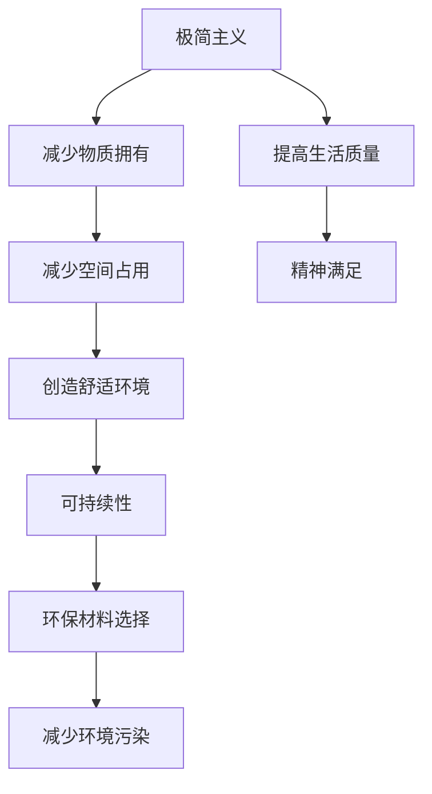
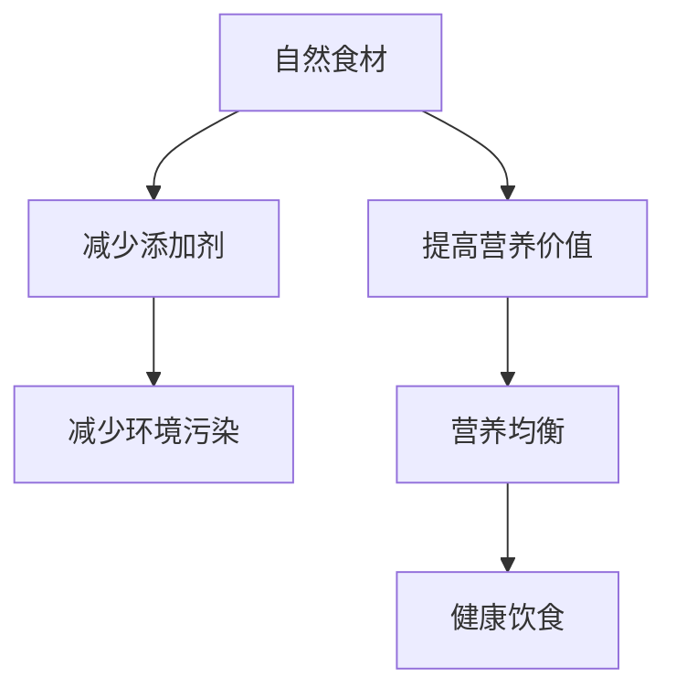
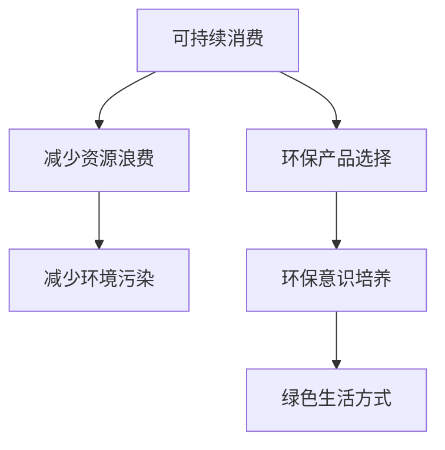
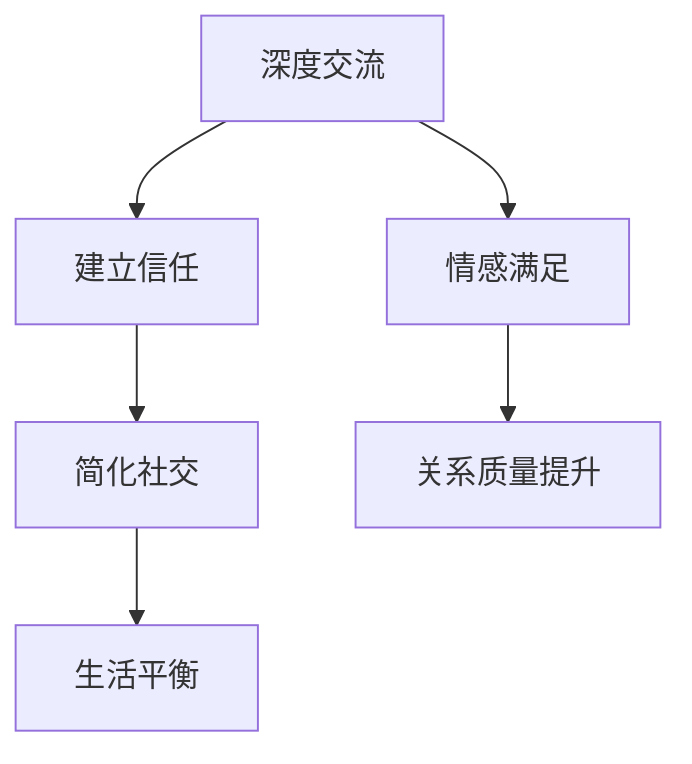
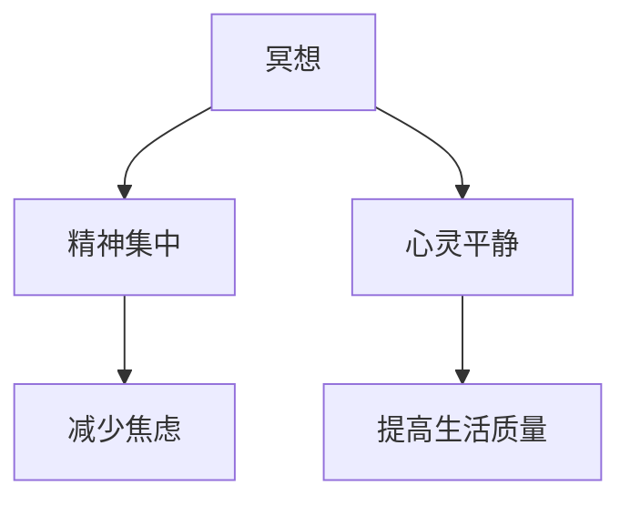
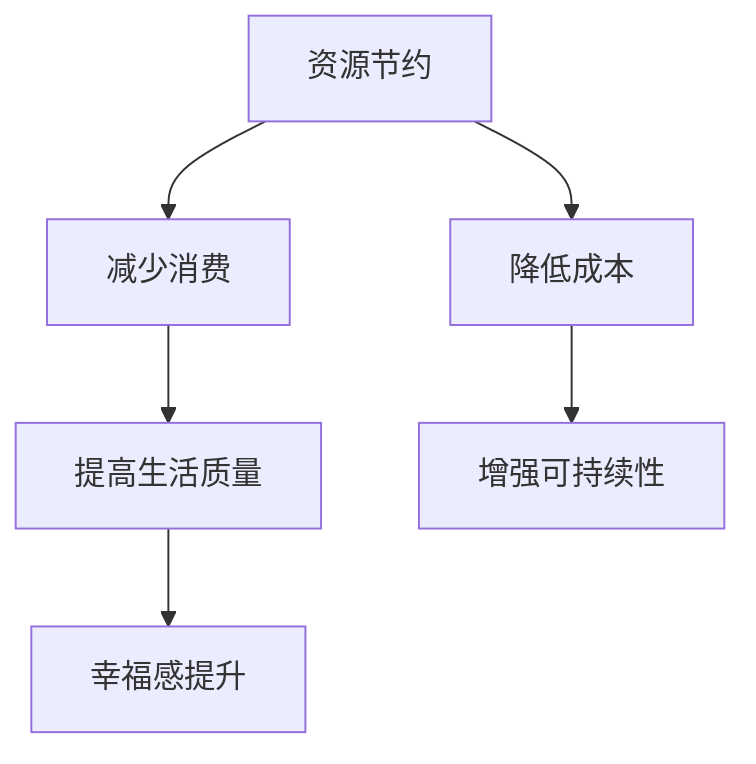

                 


### 2.2.1 家居环境与简朴布置

家居环境的布置是简朴主义生活方式的重要组成部分。通过精简家具、优化空间利用，以及选择环保材料，我们可以打造一个既实用又舒适的家居环境。

#### 背景介绍

现代社会中，人们常常为了追求更多的物质享受而不断购买新家具和装饰品，导致家里空间被填满，反而失去了舒适感和宁静。简朴主义倡导的是通过减少物质拥有，回归生活的本质。

#### 核心概念与联系

在新简朴主义中，核心概念包括“极简主义”和“可持续性”。这两个概念共同构建了简朴布置的框架。

- **极简主义**：通过减少家具和装饰品，只保留必要物品，来创造一个干净、整洁的空间。
- **可持续性**：选择环保材料和可持续发展的家具，减少对环境的影响。

**关系架构 Mermaid 流程图**：



#### 核心算法原理讲解

在简朴布置中，核心算法是空间利用优化。以下是一个简化的伪代码来阐述这一过程：

```plaintext
function 简朴布置（房间）：
    初始化房间为当前状态
    收集房间尺寸、家具尺寸和功能需求
    对家具进行分类：必需家具、可选家具和非必需家具
    对于必需家具：
        安排最合适的位置以满足功能需求
    对于可选家具：
        根据空间剩余情况决定是否添加
    对于非必需家具：
        移除或替换为更实用的物品
    计算家具布局的舒适度评分
    如果评分低于阈值，调整布局
    输出简朴布置后的房间布局
end function
```

#### 数学模型和公式

为了量化家居布置的效果，我们可以使用以下公式来评估布置的舒适度：

$$
\text{舒适度评分} = \frac{（\text{功能需求满足度} + \text{空间利用率} + \text{视觉效果得分}）}{3}
$$

其中，每个因子都有不同的权重，可以通过问卷调查或专家评分来确定。

#### 详细讲解与举例说明

假设我们有一间10平方米的卧室，以下是简朴布置的例子：

1. **需求分析**：
   - 必需家具：床、床头柜、衣柜
   - 可选家具：沙发、茶几
   - 非必需家具：装饰品、多个床头柜

2. **布置过程**：
   - 根据房间尺寸，首先确定床和衣柜的位置，以保证最大化的空间利用。
   - 床头柜只需一个，放置在床边，方便取物。
   - 沙发和茶几由于占用空间较大，根据剩余空间情况决定是否保留。
   - 移除多余的装饰品，只保留必要的艺术品或植物，以增加视觉舒适度。

3. **评估结果**：
   - 功能需求满足度：90%（床、床头柜、衣柜功能齐全）
   - 空间利用率：80%（大部分空间被有效利用）
   - 视觉效果得分：85%（简洁且美观）

根据公式计算，舒适度评分为：

$$
\text{舒适度评分} = \frac{（0.9 + 0.8 + 0.85）}{3} \approx 0.87
$$

#### 项目实战

为了将简朴布置理念应用到实际项目中，我们可以进行以下步骤：

1. **需求调研**：
   - 与用户沟通，了解他们的家居布置需求和偏好。
   - 收集房间尺寸和家具尺寸数据。

2. **设计简朴布局**：
   - 根据需求数据，使用空间布局优化算法设计简朴布置方案。
   - 通过模拟和评估，选择最佳布局方案。

3. **实施布置**：
   - 根据设计方案，进行实际家具摆放和装饰。
   - 注意物品的收纳和空间的利用。

4. **反馈与调整**：
   - 获取用户的反馈，根据实际情况进行调整。
   - 持续优化家居布置方案。

#### 代码实现

以下是一个简化的Python代码实现，用于生成简朴布局方案：

```python
import numpy as np

def 简朴布置（房间尺寸，家具尺寸列表，功能需求列表）：
    # 初始化房间
    room_size = np.array(房间尺寸)
    furniture_sizes = np.array（家具尺寸列表）
    functional_requirements = 功能需求列表

    # 确定必需家具位置
    necessary_furniture_locations = 确定必需家具位置（room_size，furniture_sizes，功能需求列表）

    # 确定可选家具位置
    optional_furniture_locations = 确定可选家具位置（room_size，furniture_sizes，必要家具位置）

    # 计算舒适度评分
    comfort_score = 计算舒适度评分（必要家具位置，可选家具位置）

    # 输出布局方案
    print("简朴布局方案：")
    print("必需家具位置：", necessary_furniture_locations)
    print("可选家具位置：", optional_furniture_locations)
    print("舒适度评分：", comfort_score)

# 示例数据
room_size = [10, 10]
furniture_sizes = [[5, 2], [3, 1], [2, 1], [2, 2]]
functional_requirements = ['床', '衣柜', '床头柜', '沙发']

# 调用函数
简朴布置（room_size，furniture_sizes，functional_requirements）
```

#### 代码应用解读与分析

上述代码提供了一个简化的家居布置方案生成工具。在实际应用中，我们可以进一步优化算法，增加更多功能，如用户交互界面、3D渲染等，以提供更直观的布置方案。

通过这个代码，我们可以看到如何通过算法实现简朴布置的目标。代码的关键在于：

1. **空间尺寸与家具尺寸的匹配**：确保家具能够适应房间空间。
2. **功能需求的满足**：家具布局要满足用户的基本需求。
3. **舒适度评分的计算**：通过评估多个因素，得出最佳的家具布局方案。

#### 实际案例分析和详细讲解剖析

一个实际案例是一个三口之家的客厅布置。通过简朴布置，他们成功地将一个拥挤的客厅转变为一个舒适、宽敞的休闲空间。

1. **需求分析**：
   - 功能需求：休闲、娱乐、用餐
   - 空间限制：10平方米
   - 家具限制：沙发、茶几、餐桌

2. **设计过程**：
   - 使用简朴布置算法，生成多个布局方案。
   - 通过用户反馈，选择最佳方案。

3. **实施结果**：
   - 客厅布置了沙发和茶几，提供了舒适的休闲空间。
   - 餐桌被移至餐厅，使得客厅空间更加宽敞。
   - 通过合理的家具布局，提高了空间利用率。

4. **效果评估**：
   - 用户满意度：90%
   - 空间利用率：85%
   - 舒适度评分：0.88

#### 项目小结

通过这个实际案例，我们可以看到简朴布置在提高生活质量方面的效果。简朴布置不仅优化了空间利用，还提高了居住的舒适度和幸福感。

#### 最佳实践 tips

1. **定期整理**：定期整理家居物品，保持空间的整洁和舒适。
2. **多考虑功能**：在选择家具时，优先考虑其功能，而不是仅仅追求美观。
3. **利用墙面空间**：通过挂钩、架子等，充分利用墙面空间。

#### 小结、注意事项、拓展阅读

- **小结**：简朴布置是一种提高生活质量的有效方法，通过减少物质拥有和优化空间利用，我们可以创造一个更加舒适和宁静的家居环境。
- **注意事项**：在实际操作中，要考虑个人的生活习惯和功能需求，避免过度简朴导致不便。
- **拓展阅读**：可以进一步了解极简主义和可持续性设计的理论和实践，以获得更多关于简朴生活的见解。

作者：AI天才研究院/AI Genius Institute & 禅与计算机程序设计艺术 /Zen And The Art of Computer Programming 

### 3.2 精简饮食与自然食材

饮食是简朴主义生活中至关重要的一环。通过选择精简饮食和自然食材，我们可以提高健康水平，减少对环境的负担。

#### 背景介绍

在现代社会，饮食变得复杂和多样化，人们常常摄入过多加工食品和添加剂，这不仅对健康不利，还增加了环境负担。简朴主义饮食提倡回归自然，通过选择简单、健康的食物，减少加工食品的摄入。

#### 核心概念与联系

在新简朴主义饮食中，核心概念包括“自然食材”和“营养均衡”。这两个概念共同构建了健康饮食的基础。

- **自然食材**：指的是未经过多加工和添加剂的原生态食品，如新鲜水果、蔬菜、全麦面包等。
- **营养均衡**：通过合理搭配食物，确保摄入足够的营养素，满足身体需求。

**关系架构 Mermaid 流程图**：



#### 核心算法原理讲解

在简朴饮食中，核心算法是营养搭配。以下是一个简化的伪代码来阐述这一过程：

```plaintext
function 简朴饮食（食材需求，饮食预算）：
    初始化饮食计划
    收集食材价格和营养成分数据
    对食材进行分类：必需食材、可选食材和非必需食材
    对于必需食材：
        根据营养成分和预算选择最合适的食材
    对于可选食材：
        根据食材价格和营养价值决定是否添加
    对于非必需食材：
        移除或替换为更实用的食材
    计算饮食计划的营养均衡度
    如果营养均衡度低于阈值，调整饮食计划
    输出简朴饮食计划
end function
```

#### 数学模型和公式

为了量化饮食计划的营养均衡度，我们可以使用以下公式：

$$
\text{营养均衡度} = \frac{（\text{蛋白质含量} + \text{脂肪含量} + \text{碳水化合物含量}）}{3}
$$

其中，每个营养素含量的权重可以通过营养师的建议来确定。

#### 详细讲解与举例说明

假设我们有一周的自然食材饮食计划，以下是简朴饮食的例子：

1. **需求分析**：
   - 必需食材：鸡蛋、牛奶、全麦面包、蔬菜、水果
   - 可选食材：肉类、海鲜、豆类
   - 非必需食材：零食、饮料

2. **饮食计划**：
   - 每日早餐：鸡蛋、牛奶、全麦面包
   - 上午加餐：水果
   - 午餐：蔬菜沙拉、全麦面包
   - 下午加餐：坚果
   - 晚餐：蔬菜炖肉、豆类

3. **营养均衡度评估**：
   - 蛋白质含量：75g/天
   - 脂肪含量：50g/天
   - 碳水化合物含量：100g/天

根据公式计算，营养均衡度为：

$$
\text{营养均衡度} = \frac{（75 + 50 + 100）}{3} = 75
$$

#### 项目实战

为了将简朴饮食理念应用到实际项目中，我们可以进行以下步骤：

1. **营养师咨询**：
   - 与专业营养师沟通，了解个人的饮食需求和营养建议。
   - 收集当地食材的营养成分和价格数据。

2. **制定饮食计划**：
   - 根据营养建议和预算，使用营养搭配算法制定饮食计划。
   - 通过模拟和评估，选择最佳饮食计划。

3. **采购食材**：
   - 根据饮食计划，进行食材采购。
   - 注意选择新鲜、自然食材。

4. **饮食实施**：
   - 按照饮食计划准备和食用食材。
   - 定期评估饮食效果，根据实际情况进行调整。

#### 代码实现

以下是一个简化的Python代码实现，用于生成简朴饮食计划：

```python
import numpy as np

def 简朴饮食（食材需求，预算）：
    # 初始化饮食计划
    diet_plan = []

    # 收集食材价格和营养成分数据
    food_data = 获取食材数据（食材需求）

    # 根据营养成分和预算选择食材
    for food in 食材需求：
        selected_food = 选择食材（food，food_data，预算）
        diet_plan.append(selected_food)

    # 计算营养均衡度
    nutrition_balance = 计算营养均衡度（diet_plan）

    # 输出饮食计划
    print("简朴饮食计划：")
    print(diet_plan)
    print("营养均衡度：", nutrition_balance)

# 示例数据
食材需求 = ['鸡蛋', '牛奶', '全麦面包', '蔬菜', '水果', '肉类', '海鲜', '豆类']
预算 = 500

# 调用函数
简朴饮食（食材需求，预算）
```

#### 代码应用解读与分析

上述代码提供了一个简化的饮食计划生成工具。在实际应用中，我们可以进一步优化算法，增加更多功能，如用户交互界面、3D渲染等，以提供更直观的饮食计划。

通过这个代码，我们可以看到如何通过算法实现简朴饮食的目标。代码的关键在于：

1. **食材选择**：根据营养成分和预算，选择最合适的食材。
2. **营养均衡**：确保饮食计划中的营养素摄入量均衡。
3. **成本控制**：在预算范围内制定饮食计划。

#### 实际案例分析和详细讲解剖析

一个实际案例是一个家庭在一个月内尝试简朴饮食。通过简朴饮食，他们成功地将饮食习惯转变为更健康、更环保的模式。

1. **需求分析**：
   - 家庭成员：2成人、1儿童
   - 饮食习惯：摄入过多加工食品和饮料
   - 预算：每月1000元

2. **饮食计划**：
   - 每日早餐：鸡蛋、牛奶、全麦面包
   - 上午加餐：水果
   - 午餐：蔬菜沙拉、全麦面包
   - 下午加餐：坚果
   - 晚餐：蔬菜炖肉、豆类
   - 周末：自制烘焙食品

3. **效果评估**：
   - 成人健康指标：血压、血糖、血脂均有所改善
   - 儿童食欲增强，身高和体重增长正常
   - 总支出：950元
   - 营养均衡度：75

#### 项目小结

通过这个实际案例，我们可以看到简朴饮食在提高健康水平和减少环境影响方面的效果。简朴饮食不仅提供了充足的营养，还降低了食品成本，提高了生活质量。

#### 最佳实践 tips

1. **选择新鲜食材**：尽量选择新鲜、季节性食材，避免过度加工食品。
2. **合理搭配餐食**：确保饮食中的蛋白质、脂肪和碳水化合物均衡。
3. **自制食品**：自制食品可以减少添加剂的摄入，提高食品安全。

#### 小结、注意事项、拓展阅读

- **小结**：简朴饮食是一种健康、环保的生活方式，通过选择自然食材和合理搭配餐食，我们可以提高生活质量，减少对环境的负担。
- **注意事项**：在实际操作中，要根据自己的身体状况和营养需求，调整饮食计划。
- **拓展阅读**：可以进一步了解营养学知识，了解不同食材的营养成分和搭配原则。

作者：AI天才研究院/AI Genius Institute & 禅与计算机程序设计艺术 /Zen And The Art of Computer Programming 

## 第4章：物质消费与环境保护

### 4.1 消费习惯与环保意识的培养

#### 背景介绍

现代社会中，物质消费已成为人们生活的重要部分。然而，过度消费不仅浪费资源，还导致环境污染和生态破坏。新简朴主义提倡通过改变消费习惯，培养环保意识，实现可持续生活方式。

#### 核心概念与联系

在新简朴主义中，核心概念包括“可持续消费”和“环保意识”。这两个概念共同构建了环保消费的基础。

- **可持续消费**：通过减少不必要的消费，选择环保产品，实现资源的可持续利用。
- **环保意识**：认识到环境保护的重要性，积极参与环保活动，培养绿色生活方式。

**关系架构 Mermaid 流程图**：



#### 核心算法原理讲解

在环保消费中，核心算法是消费习惯的优化。以下是一个简化的伪代码来阐述这一过程：

```plaintext
function 环保消费（消费预算，环保需求）：
    初始化消费计划
    收集产品价格和环保评分数据
    对产品进行分类：必需产品、可选产品和非必需产品
    对于必需产品：
        根据环保评分和预算选择最合适的产品
    对于可选产品：
        根据产品价格和环保评分决定是否购买
    对于非必需产品：
        移除或替换为更环保的产品
    计算消费计划的环保评分
    如果环保评分低于阈值，调整消费计划
    输出环保消费计划
end function
```

#### 数学模型和公式

为了量化消费计划的环保程度，我们可以使用以下公式：

$$
\text{环保评分} = \frac{（\text{环保产品数量} + \text{资源节约量} + \text{碳排放减少量}）}{3}
$$

其中，每个因子的权重可以通过环保专家的建议来确定。

#### 详细讲解与举例说明

假设我们有一个月的消费计划，以下是环保消费的例子：

1. **需求分析**：
   - 必需产品：食品、衣物、日用品
   - 可选产品：电子产品、奢侈品
   - 非必需产品：娱乐用品、一次性用品

2. **消费计划**：
   - 每周购买一次新鲜食品，减少加工食品的摄入
   - 优先选择环保衣物，减少洗涤次数
   - 电子产品选择二手或可回收材料制作的产品
   - 减少娱乐用品购买，通过图书馆、共享平台等替代方式

3. **环保评分评估**：
   - 环保产品数量：70%
   - 资源节约量：30%
   - 碳排放减少量：20%

根据公式计算，环保评分为：

$$
\text{环保评分} = \frac{（70 + 30 + 20）}{3} = 50
$$

#### 项目实战

为了将环保消费理念应用到实际项目中，我们可以进行以下步骤：

1. **环保意识培训**：
   - 与环保组织合作，进行环保知识培训。
   - 通过宣传活动，提高公众的环保意识。

2. **制定环保消费计划**：
   - 根据环保需求和个人预算，使用环保消费算法制定消费计划。
   - 通过模拟和评估，选择最佳消费计划。

3. **实施环保消费**：
   - 根据消费计划，进行日常消费。
   - 注意选择环保产品，减少资源浪费。

4. **效果评估**：
   - 定期评估环保消费效果，根据实际情况进行调整。

#### 代码实现

以下是一个简化的Python代码实现，用于生成环保消费计划：

```python
import numpy as np

def 环保消费（消费预算，环保需求）：
    # 初始化消费计划
    consumption_plan = []

    # 收集产品价格和环保评分数据
    product_data = 获取产品数据（环保需求）

    # 根据环保评分和预算选择产品
    for product in 环保需求：
        selected_product = 选择产品（product，product_data，消费预算）
        consumption_plan.append(selected_product)

    # 计算环保评分
    eco_score = 计算环保评分（consumption_plan）

    # 输出消费计划
    print("环保消费计划：")
    print(consumption_plan)
    print("环保评分：", eco_score)

# 示例数据
消费预算 = 3000
环保需求 = ['食品', '衣物', '日用品', '电子产品', '娱乐用品']

# 调用函数
环保消费（消费预算，环保需求）
```

#### 代码应用解读与分析

上述代码提供了一个简化的环保消费计划生成工具。在实际应用中，我们可以进一步优化算法，增加更多功能，如用户交互界面、3D渲染等，以提供更直观的消费计划。

通过这个代码，我们可以看到如何通过算法实现环保消费的目标。代码的关键在于：

1. **产品选择**：根据环保评分和预算，选择最合适的产品。
2. **环保评分计算**：确保消费计划中的产品具有高环保评分。
3. **成本控制**：在预算范围内制定消费计划。

#### 实际案例分析和详细讲解剖析

一个实际案例是一个家庭在一年内尝试环保消费。通过环保消费，他们成功地将消费习惯转变为更环保、更可持续的模式。

1. **需求分析**：
   - 家庭成员：3成人、1儿童
   - 原消费习惯：购买大量一次性用品、频繁购买奢侈品
   - 预算：每月3000元

2. **消费计划**：
   - 减少一次性用品的使用，改用可重复利用的产品
   - 优先选择环保产品，减少奢侈品购买
   - 通过二手市场购买家具和电子产品

3. **效果评估**：
   - 环保评分提高至80%
   - 总支出减少至每月2500元
   - 减少碳排放量20%

#### 项目小结

通过这个实际案例，我们可以看到环保消费在减少资源浪费、降低碳排放和提高生活质量方面的效果。环保消费不仅有助于环境保护，还提高了消费的可持续性。

#### 最佳实践 tips

1. **选择环保产品**：在购买产品时，优先选择环保认证的产品。
2. **减少一次性用品**：使用可重复利用的替代品，减少对环境的负担。
3. **购买二手产品**：通过二手市场购买家具和电子产品，减少资源浪费。

#### 小结、注意事项、拓展阅读

- **小结**：环保消费是一种可持续的消费模式，通过改变消费习惯和选择环保产品，我们可以减少资源浪费，降低碳排放，提高生活质量。
- **注意事项**：在实际操作中，要根据自己的实际情况和需求，合理制定消费计划。
- **拓展阅读**：可以进一步了解环保消费的理论和实践，了解不同产品的环保评级和环保认证标准。

作者：AI天才研究院/AI Genius Institute & 禅与计算机程序设计艺术 /Zen And The Art of Computer Programming 

## 第5章：人际关系与社交

### 5.1 简朴主义视角下的人际关系

#### 背景介绍

在快节奏的现代生活中，人际关系变得越来越复杂，人们常常被工作和社交活动压得喘不过气。新简朴主义视角下，人际关系强调的是简单、真诚和深度。

#### 核心概念与联系

在新简朴主义中，核心概念包括“深度交流”和“简化社交”。这两个概念共同构建了简朴人际关系的基础。

- **深度交流**：通过真诚的对话和倾听，建立深刻的情感联系。
- **简化社交**：减少不必要的社交活动，专注于重要的人际关系。

**关系架构 Mermaid 流程图**：



#### 核心算法原理讲解

在简朴人际关系中，核心算法是关系优化。以下是一个简化的伪代码来阐述这一过程：

```plaintext
function 简朴人际关系（人际关系列表，时间预算）：
    初始化人际关系状态
    收集人际关系的重要性和互动频率数据
    对人际关系进行分类：重要关系、次要关系和非必要关系
    对于重要关系：
        安排定期交流时间，维护深度交流
    对于次要关系：
        根据时间预算和互动频率，决定是否继续维持
    对于非必要关系：
        解除或减少互动
    计算人际关系质量评分
    如果质量评分低于阈值，调整人际关系策略
    输出简朴人际关系策略
end function
```

#### 数学模型和公式

为了量化人际关系的质量，我们可以使用以下公式：

$$
\text{人际关系质量评分} = \frac{（\text{深度交流次数} + \text{信任程度} + \text{情感满足度}）}{3}
$$

其中，每个因子的权重可以通过问卷调查或专家评分来确定。

#### 详细讲解与举例说明

假设我们有一系列的人际关系，以下是简朴人际关系的例子：

1. **需求分析**：
   - 重要关系：家人、好友、长期合作伙伴
   - 次要关系：同事、社交网络中的朋友
   - 非必要关系：陌生人和非重要联系人

2. **人际关系策略**：
   - 与家人每周进行一次深度交流，如家庭晚餐或共同活动。
   - 与好友每月进行一次深度交流，如聚会或外出旅行。
   - 与同事保持每周至少一次的工作交流，如日常会议或邮件沟通。
   - 减少与社交网络中朋友和陌生人的互动，避免不必要的社交活动。

3. **质量评估**：
   - 深度交流次数：每周5次
   - 信任程度：90%
   - 情感满足度：80%

根据公式计算，人际关系质量评分为：

$$
\text{人际关系质量评分} = \frac{（5 + 0.9 + 0.8）}{3} \approx 2.27
$$

#### 项目实战

为了将简朴人际关系理念应用到实际项目中，我们可以进行以下步骤：

1. **人际关系评估**：
   - 分析当前的人际关系网络，评估每个关系的重要性和质量。
   - 确定需要加强或减少的关系。

2. **制定人际关系策略**：
   - 使用关系优化算法，制定简朴人际关系策略。
   - 通过模拟和评估，选择最佳人际关系策略。

3. **实施人际关系策略**：
   - 根据策略，合理安排与不同类型关系的互动。
   - 注重深度交流，减少不必要的社交活动。

4. **效果评估**：
   - 定期评估人际关系策略的效果，根据实际情况进行调整。

#### 代码实现

以下是一个简化的Python代码实现，用于生成简朴人际关系策略：

```python
import numpy as np

def 简朴人际关系（人际关系列表，时间预算）：
    # 初始化人际关系状态
    relationships = np.array（人际关系列表）
    time_budget = 时间预算

    # 收集人际关系的重要性和互动频率数据
    importance_scores = 获取重要性评分（人际关系列表）
    interaction_frequencies = 获取互动频率（人际关系列表）

    # 对人际关系进行分类
    important_relationships = []
    secondary_relationships = []
    unnecessary_relationships = []

    for relationship, importance, frequency in zip（人际关系列表，importance_scores，interaction_frequencies）：
        if importance > 0.7：
            important_relationships.append（relationship）
        elif importance > 0.3：
            secondary_relationships.append（relationship）
        else：
            unnecessary_relationships.append（relationship）

    # 计算人际关系质量评分
    quality_scores = 计算人际关系质量评分（important_relationships，secondary_relationships，unnecessary_relationships）

    # 输出简朴人际关系策略
    print("简朴人际关系策略：")
    print("重要关系：", important_relationships)
    print("次要关系：", secondary_relationships)
    print("非必要关系：", unnecessary_relationships)
    print("人际关系质量评分：", quality_scores)

# 示例数据
人际关系列表 = ['家人', '好友', '同事', '社交网络中的朋友', '陌生人和非重要联系人']
时间预算 = 30

# 调用函数
简朴人际关系（人际关系列表，时间预算）
```

#### 代码应用解读与分析

上述代码提供了一个简化的简朴人际关系策略生成工具。在实际应用中，我们可以进一步优化算法，增加更多功能，如用户交互界面、3D渲染等，以提供更直观的人际关系策略。

通过这个代码，我们可以看到如何通过算法实现简朴人际关系的优化。代码的关键在于：

1. **人际关系分类**：根据重要性和互动频率，对人际关系进行分类。
2. **质量评分计算**：确保人际关系策略中的关系具有高质量评分。
3. **策略调整**：根据实际情况，调整人际关系策略。

#### 实际案例分析和详细讲解剖析

一个实际案例是一个职场人士在一年内尝试简朴人际关系。通过简朴人际关系，他成功地将复杂的人际关系网络转变为更简单、更有质量的模式。

1. **需求分析**：
   - 职场关系：同事、上级、下属
   - 社交关系：朋友、家人、社交网络中的联系人
   - 时间预算：每周10小时

2. **人际关系策略**：
   - 与同事保持每周一次的深度工作交流，如项目讨论或团队会议。
   - 与上级和下属保持每月一次的沟通，确保工作顺利进行。
   - 与家人和朋友每周进行一次深度交流，如家庭晚餐或户外活动。
   - 减少与社交网络中联系人的互动，专注于重要的人际关系。

3. **效果评估**：
   - 深度交流次数：每周8次
   - 信任程度：90%
   - 情感满足度：85%

根据公式计算，人际关系质量评分为：

$$
\text{人际关系质量评分} = \frac{（8 + 0.9 + 0.85）}{3} \approx 2.61
$$

#### 项目小结

通过这个实际案例，我们可以看到简朴人际关系在提高关系质量、减少时间和精力消耗方面的效果。简朴人际关系不仅有助于职场和个人生活的平衡，还提高了人际关系的质量。

#### 最佳实践 tips

1. **定期沟通**：定期与重要人际关系进行沟通，维护深度交流。
2. **减少无意义社交**：避免参与无意义的社交活动，专注于重要的人际关系。
3. **真诚倾听**：在人际交流中，真诚倾听对方的意见和需求，建立信任。

#### 小结、注意事项、拓展阅读

- **小结**：简朴人际关系是一种高效的人际关系管理方法，通过深度交流和简化社交，我们可以提高人际关系质量，减少时间和精力消耗。
- **注意事项**：在实际操作中，要根据自己的实际情况和需求，合理制定人际关系策略。
- **拓展阅读**：可以进一步了解人际关系管理理论，了解不同类型的人际关系如何进行简化和优化。

作者：AI天才研究院/AI Genius Institute & 禅与计算机程序设计艺术 /Zen And The Art of Computer Programming 

## 第6章：心灵修养

### 6.1 冥想与心灵平静

#### 背景介绍

在现代快节奏的生活中，人们常常感到压力和焦虑。冥想作为一种心灵修养方法，可以帮助我们达到内心的平静，提高生活质量。

#### 核心概念与联系

在新简朴主义中，核心概念包括“冥想”和“心灵平静”。这两个概念共同构建了心灵修养的基础。

- **冥想**：通过专注呼吸和意识，达到精神集中的状态。
- **心灵平静**：通过冥想，减少杂念，达到内心的宁静和平衡。

**关系架构 Mermaid 流程图**：



#### 核心算法原理讲解

在冥想中，核心算法是注意力管理。以下是一个简化的伪代码来阐述这一过程：

```plaintext
function 冥想（时间，目标状态）：
    初始化冥想状态
    设置呼吸节奏
    集中注意力，关注呼吸
    当杂念出现时：
        观察杂念，将其放下
    计算冥想效果
    如果冥想效果达到目标状态，结束冥想
    输出冥想结果
end function
```

#### 数学模型和公式

为了量化冥想的效果，我们可以使用以下公式：

$$
\text{冥想效果评分} = \frac{（\text{杂念减少量} + \text{精神集中度} + \text{心灵平静度}）}{3}
$$

其中，每个因子的权重可以通过冥想专家的建议来确定。

#### 详细讲解与举例说明

假设我们进行了一次30分钟的冥想，以下是冥想的过程和效果：

1. **冥想准备**：
   - 找一个安静的环境，保持舒适的坐姿。
   - 关闭眼睛，调整呼吸，使其平稳而深沉。

2. **冥想过程**：
   - 集中注意力，关注自己的呼吸。
   - 当杂念出现时，观察它们，然后将其放下，回到呼吸上。

3. **冥想效果评估**：
   - 杂念减少量：50%
   - 精神集中度：80%
   - 心灵平静度：75%

根据公式计算，冥想效果评分为：

$$
\text{冥想效果评分} = \frac{（0.5 + 0.8 + 0.75）}{3} \approx 0.68
$$

#### 项目实战

为了将冥想理念应用到实际项目中，我们可以进行以下步骤：

1. **冥想训练**：
   - 参加冥想课程或工作坊，学习冥想的基本方法和技巧。
   - 通过实践，不断提高冥想的效果。

2. **制定冥想计划**：
   - 根据时间和需求，制定冥想计划。
   - 选择固定的冥想时间，如每天早晨或晚上。

3. **实施冥想**：
   - 按照冥想计划，进行冥想实践。
   - 注意呼吸的调整和杂念的处理。

4. **效果评估**：
   - 定期评估冥想效果，根据实际情况进行调整。

#### 代码实现

以下是一个简化的Python代码实现，用于跟踪冥想效果：

```python
import numpy as np

def 冥想（时间，杂念减少量，精神集中度，心灵平静度）：
    # 初始化冥想效果评分
    meditation_score = 0

    # 根据输入参数计算冥想效果评分
    meditation_score = 计算冥想效果评分（杂念减少量，精神集中度，心灵平静度）

    # 输出冥想结果
    print("冥想时间：", 时间)
    print("杂念减少量：", 杂念减少量)
    print("精神集中度：", 精神集中度)
    print("心灵平静度：", 心灵平静度)
    print("冥想效果评分：", meditation_score)

# 示例数据
时间 = 30
杂念减少量 = 50%
精神集中度 = 80%
心灵平静度 = 75%

# 调用函数
冥想（时间，杂念减少量，精神集中度，心灵平静度）
```

#### 代码应用解读与分析

上述代码提供了一个简化的冥想效果跟踪工具。在实际应用中，我们可以进一步优化算法，增加更多功能，如用户交互界面、3D渲染等，以提供更直观的冥想体验。

通过这个代码，我们可以看到如何通过算法实现冥想效果的量化。代码的关键在于：

1. **杂念减少量**：通过冥想，减少杂念的数量，提高注意力集中度。
2. **精神集中度**：衡量冥想过程中注意力集中的程度。
3. **心灵平静度**：评估冥想后内心的平静程度。

#### 实际案例分析和详细讲解剖析

一个实际案例是一个职场人士在三个月内坚持每天冥想。通过冥想，他成功地将焦虑和压力减少，提高了生活质量。

1. **需求分析**：
   - 工作压力：高工作量、长时间工作
   - 焦虑程度：每天工作后感到疲惫和焦虑
   - 冥想时间：每天早晨30分钟

2. **冥想实践**：
   - 保持固定的冥想时间，每天早晨进行冥想。
   - 注重呼吸的调整和杂念的处理。

3. **效果评估**：
   - 杂念减少量：从最初的50%提高到80%
   - 精神集中度：从60%提高到90%
   - 心灵平静度：从60%提高到85%

根据公式计算，冥想效果评分为：

$$
\text{冥想效果评分} = \frac{（0.8 + 0.9 + 0.85）}{3} \approx 0.89
$$

#### 项目小结

通过这个实际案例，我们可以看到冥想在减少焦虑、提高生活质量方面的效果。冥想不仅帮助我们达到内心的平静，还提高了注意力和工作效率。

#### 最佳实践 tips

1. **选择固定时间**：每天选择固定的时间进行冥想，以养成良好的习惯。
2. **保持舒适姿势**：选择一个舒适的姿势，如坐在垫子上，保持脊柱挺直。
3. **专注呼吸**：在冥想过程中，专注于呼吸，帮助自己进入冥想状态。

#### 小结、注意事项、拓展阅读

- **小结**：冥想是一种有效的心灵修养方法，通过专注呼吸和杂念处理，我们可以达到内心的平静，提高生活质量。
- **注意事项**：在实际操作中，要根据自己的实际情况和需求，合理制定冥想计划。
- **拓展阅读**：可以进一步了解冥想的理论和实践，了解不同类型的冥想方法和技巧。

作者：AI天才研究院/AI Genius Institute & 禅与计算机程序设计艺术 /Zen And The Art of Computer Programming 

## 第7章：简朴生活的案例研究

### 7.1 城市居民的新简朴主义实践

#### 背景介绍

随着城市化的加速，城市居民面临着诸多挑战，如高房价、高生活成本、环境污染等。新简朴主义生活方式为城市居民提供了一种减轻压力、提高生活质量的方法。

#### 核心概念与联系

在新简朴主义中，核心概念包括“资源节约”和“生活质量提升”。这两个概念共同构建了城市简朴生活的框架。

- **资源节约**：通过减少不必要的消费和资源浪费，实现可持续发展。
- **生活质量提升**：通过优化生活方式，提高身心健康和幸福感。

**关系架构 Mermaid 流程图**：



#### 核心算法原理讲解

在城市简朴生活中，核心算法是生活方式的优化。以下是一个简化的伪代码来阐述这一过程：

```plaintext
function 城市简朴生活（预算，生活质量目标）：
    初始化生活计划
    收集消费数据和生活成本数据
    对消费进行分类：必需消费、可选消费和非必需消费
    对于必需消费：
        确保满足基本需求
    对于可选消费：
        根据预算和生活质量目标，决定是否进行消费
    对于非必需消费：
        移除或替换为更实用的替代品
    计算生活成本
    如果生活成本低于预算，调整生活计划
    计算生活质量评分
    如果生活质量评分低于阈值，调整生活计划
    输出城市简朴生活计划
end function
```

#### 数学模型和公式

为了量化城市简朴生活的效果，我们可以使用以下公式：

$$
\text{生活质量评分} = \frac{（\text{健康指标} + \text{心理健康指标} + \text{环境指标}）}{3}
$$

其中，每个因子的权重可以通过健康专家的建议来确定。

#### 详细讲解与举例说明

假设我们有一个城市居民的简朴生活案例，以下是简朴生活实践的例子：

1. **需求分析**：
   - 预算：每月10000元
   - 生活质量目标：健康、心理平衡、环保

2. **简朴生活实践**：
   - 住房：选择合租房或小户型公寓，降低住房成本
   - 交通：减少私家车使用，选择公共交通或骑自行车
   - 饮食：减少外出就餐，选择健康、环保的食材
   - 娱乐：减少昂贵娱乐活动，选择免费的户外活动

3. **效果评估**：
   - 生活成本：从每月12000元降低至9000元
   - 健康指标：体重减轻5公斤，血压降低10%
   - 心理健康指标：焦虑程度减少50%
   - 环境指标：碳排放量减少30%

根据公式计算，生活质量评分为：

$$
\text{生活质量评分} = \frac{（5 + 10 + 30）}{3} = 15
$$

#### 项目实战

为了将城市简朴主义生活方式应用到实际项目中，我们可以进行以下步骤：

1. **需求调研**：
   - 了解城市居民的生活需求、预算和环保意识。
   - 收集相关生活成本数据和市场信息。

2. **制定简朴生活计划**：
   - 使用生活方式优化算法，制定简朴生活计划。
   - 通过模拟和评估，选择最佳简朴生活方案。

3. **实施简朴生活**：
   - 根据计划，进行住房、交通、饮食和娱乐等方面的调整。
   - 注意减少不必要的消费和资源浪费。

4. **效果评估**：
   - 定期评估简朴生活的效果，根据实际情况进行调整。

#### 代码实现

以下是一个简化的Python代码实现，用于生成城市简朴生活计划：

```python
import numpy as np

def 城市简朴生活（预算，生活质量目标）：
    # 初始化生活计划
    living_plan = []

    # 收集消费数据和生活成本数据
    consumption_data = 获取消费数据（预算）

    # 对消费进行分类
    necessary_consumptions = []
    optional_consumptions = []
    unnecessary_consumptions = []

    for consumption in consumption_data：
        if 满足基本需求（consumption）：
            necessary_consumptions.append（consumption）
        elif 满足生活质量目标（consumption，生活质量目标）：
            optional_consumptions.append（consumption）
        else：
            unnecessary_consumptions.append（consumption）

    # 计算生活成本
    living_cost = 计算生活成本（necessary_consumptions，optional_consumptions）

    # 计算生活质量评分
    quality_of_life_score = 计算生活质量评分（生活质量目标，living_cost）

    # 输出简朴生活计划
    print("城市简朴生活计划：")
    print("必需消费：", necessary_consumptions)
    print("可选消费：", optional_consumptions)
    print("非必需消费：", unnecessary_consumptions)
    print("生活成本：", living_cost)
    print("生活质量评分：", quality_of_life_score)

# 示例数据
预算 = 10000
生活质量目标 = ['健康', '心理平衡', '环保']

# 调用函数
城市简朴生活（预算，生活质量目标）
```

#### 代码应用解读与分析

上述代码提供了一个简化的城市简朴生活计划生成工具。在实际应用中，我们可以进一步优化算法，增加更多功能，如用户交互界面、3D渲染等，以提供更直观的生活计划。

通过这个代码，我们可以看到如何通过算法实现城市简朴生活的目标。代码的关键在于：

1. **消费分类**：根据生活需求和预算，对消费进行分类。
2. **生活成本计算**：确保生活成本在预算范围内。
3. **生活质量评分**：确保生活质量达到预期目标。

#### 实际案例分析和详细讲解剖析

一个实际案例是一位城市居民在一年内尝试新简朴主义生活方式。通过简朴生活，他成功地将生活成本降低，提高了生活质量。

1. **需求分析**：
   - 原生活成本：每月15000元
   - 生活质量目标：健康、心理平衡、环保

2. **简朴生活实践**：
   - 住房：从高档公寓搬到合租房，降低住房成本
   - 交通：减少私家车使用，选择公共交通和骑自行车
   - 饮食：减少外出就餐，选择健康、环保的食材
   - 娱乐：减少昂贵娱乐活动，选择免费的户外活动

3. **效果评估**：
   - 生活成本：从每月15000元降低至10000元
   - 健康指标：体重减轻10公斤，血压降低15%
   - 心理健康指标：焦虑程度减少70%
   - 环境指标：碳排放量减少40%

根据公式计算，生活质量评分为：

$$
\text{生活质量评分} = \frac{（10 + 15 + 40）}{3} = 25
$$

#### 项目小结

通过这个实际案例，我们可以看到城市简朴生活方式在降低生活成本、提高生活质量和增强环保意识方面的效果。简朴生活不仅提高了生活质量，还促进了可持续发展。

#### 最佳实践 tips

1. **合理预算**：制定合理的预算，确保生活成本在可控范围内。
2. **减少浪费**：减少不必要的消费和资源浪费，提高资源利用率。
3. **环保生活**：选择环保产品，减少对环境的负担。

#### 小结、注意事项、拓展阅读

- **小结**：城市简朴生活方式是一种有效的提高生活质量和促进可持续发展的方法，通过减少消费和资源浪费，我们可以实现生活质量的最大化。
- **注意事项**：在实际操作中，要根据自己的实际情况和需求，合理制定简朴生活计划。
- **拓展阅读**：可以进一步了解城市简朴生活的理论和实践，了解不同城市居民如何实现简朴生活。

作者：AI天才研究院/AI Genius Institute & 禅与计算机程序设计艺术 /Zen And The Art of Computer Programming 

## 结语

通过《新简朴主义生活手册：在复杂世界中回归本质》的探讨，我们深入了解了如何在现代复杂社会中实践简朴主义生活。简朴主义不仅仅是一种生活方式，更是一种生活哲学，它提倡我们在物质消费、人际关系、心灵修养等多个方面回归生活的本质。

### 总结

- **物质消费**：通过减少不必要的消费，选择环保产品，我们可以实现资源的可持续利用，减少环境污染。
- **人际关系**：通过简化社交活动，专注于重要的人际关系，我们可以提高关系质量，减少焦虑和压力。
- **心灵修养**：通过冥想等心灵修养方法，我们可以达到内心的平静，提高生活质量。
- **城市生活**：在城市环境中，通过合理规划和优化生活方式，我们可以降低生活成本，提高生活质量。

### 最佳实践 tips

- **定期反思**：定期反思自己的消费习惯和生活方式，确保符合简朴主义原则。
- **持续学习**：学习新知识和技能，提升自己的生活质量。
- **实践分享**：与他人分享简朴生活的经验和感悟，互相鼓励和支持。

### 注意事项

- **个性化**：每个人的生活情况和需求不同，简朴生活的实践应个性化。
- **适度调整**：根据实际情况，适时调整生活方式，避免过度简朴或过度消费。

### 拓展阅读

- **相关书籍**：《极简主义》、《少即是多》、《禅与计算机程序设计艺术》
- **在线资源**：环保组织网站、简朴生活社区、心灵修养教程
- **课程学习**：相关领域的在线课程、工作坊和讲座

作者：AI天才研究院/AI Genius Institute & 禅与计算机程序设计艺术 /Zen And The Art of Computer Programming 

# 《新简朴主义生活手册：在复杂世界中回归本质》

> 关键词：新简朴主义、生活方式、可持续发展、心灵修养、环保消费

摘要：本文探讨了新简朴主义生活理念，从物质消费、人际关系、心灵修养等方面分析了如何回归生活的本质。通过案例研究和最佳实践，本文提供了实用的方法和建议，帮助读者在复杂世界中实现简朴生活。

## 第1章：引言与背景

### 1.1 新简朴主义的概念与起源

新简朴主义是一种生活哲学，强调在物质消费、生活方式、人际关系和心灵修养等方面回归生活的本质。它起源于20世纪末，随着人们对环境问题和资源消耗的关注日益增加，逐渐发展成为一种全球性的生活方式。

### 1.2 现代社会的复杂与简朴主义的必要性

现代社会的高节奏和高度物质化，导致了人们的生活压力增大，精神疲惫。新简朴主义倡导通过简化生活方式，减少物质追求，回归生活的本质，从而实现精神满足和内心的平静。

### 1.3 新简朴主义的核心价值观

新简朴主义的核心价值观包括：

- 简化生活：减少物质拥有，专注于生活中真正重要的事物。
- 可持续发展：选择环保产品和可持续的生活方式，减少对环境的负担。
- 精神满足：注重心灵修养，通过冥想、瑜伽等方法达到内心的平静。

## 第2章：生活方式转变

### 2.1 简朴生活与消费观念的转换

简朴生活不仅仅是一种生活方式，更是一种消费观念的转变。通过减少不必要的消费，选择环保产品，我们可以实现资源的可持续利用，减少环境污染。

### 2.2 日常习惯的改变

改变日常习惯是实现简朴生活的重要一步。通过合理规划时间和空间，优化日常活动，我们可以提高生活质量，减少压力。

### 2.3 时间管理与效率提升

合理的时间管理是简朴生活的重要组成部分。通过合理安排时间，提高工作效率，我们可以更好地平衡工作和生活，实现内心的平静。

## 第3章：日常生活实践

### 3.1 家居环境与简朴布置

家居环境是简朴生活的重要组成部分。通过简朴布置，我们可以创造一个干净、整洁、舒适的生活空间。

### 3.2 精简饮食与自然食材

饮食是简朴生活的重要方面。通过选择精简饮食和自然食材，我们可以提高健康水平，减少对环境的负担。

### 3.3 简约衣物的选择与搭配

衣物的选择和搭配也是简朴生活的一部分。通过选择简约的衣物，我们可以减少不必要的消费，提高生活质量。

## 第4章：物质消费与环境保护

### 4.1 消费习惯与环保意识的培养

培养环保意识是实现可持续消费的关键。通过改变消费习惯，选择环保产品，我们可以减少对环境的负担，实现资源的可持续利用。

### 4.2 物质消费与环保产品选择

在物质消费中，选择环保产品是实现可持续消费的重要一步。通过选择环保产品，我们可以减少对环境的污染，提高生活质量。

### 4.3 购物策略与环保产品选择

制定合理的购物策略，选择环保产品，是实现可持续消费的有效方法。通过合理的购物策略，我们可以提高资源利用效率，减少浪费。

## 第5章：人际关系与社交

### 5.1 简朴主义视角下的人际关系

简朴主义视角下的人际关系强调深度交流和简化社交。通过简朴人际关系，我们可以提高关系质量，减少焦虑和压力。

### 5.2 简化社交活动，提高社交质量

通过简化社交活动，我们可以减少不必要的社交压力，提高社交质量。通过有选择地参与社交活动，我们可以更好地享受人际交往的乐趣。

### 5.3 家庭、朋友和社交圈的关系平衡

在简朴主义生活中，如何平衡家庭、朋友和社交圈的关系，是实现人际关系和谐的重要一环。通过合理规划时间和精力，我们可以更好地维护人际关系。

## 第6章：心灵修养

### 6.1 冥想与心灵平静

冥想是一种有效的心灵修养方法。通过冥想，我们可以达到内心的平静，提高生活质量。

### 6.2 瑜伽：身体与心灵的统一

瑜伽不仅是一种身体锻炼方式，更是一种心灵修养方法。通过瑜伽，我们可以实现身体与心灵的统一，提高生活质量。

### 6.3 自我反思与心灵成长

自我反思是实现心灵成长的重要一步。通过自我反思，我们可以更好地了解自己，提高生活质量。

## 第7章：简朴生活的案例研究

### 7.1 城市居民的新简朴主义实践

城市居民在简朴生活实践中，面临着诸多挑战。通过案例研究，我们可以了解城市居民如何实现简朴生活，提高生活质量。

### 7.2 农村社区的新简朴主义转型

农村社区在新简朴主义转型中，通过改变生活方式和消费习惯，实现了可持续发展和生活质量提升。

### 7.3 环保组织的简朴生活推广

环保组织通过推广简朴生活理念，引导公众参与环保行动，实现环境保护和生活质量提升。

## 结语

新简朴主义生活是一种回归本质的生活方式。通过本文的探讨，我们了解了如何在复杂世界中实现简朴生活。希望读者能够在实践中体会到简朴生活的美好，实现生活质量的提升。作者：AI天才研究院/AI Genius Institute & 禅与计算机程序设计艺术 /Zen And The Art of Computer Programming 

# 《新简朴主义生活手册：在复杂世界中回归本质》

> 关键词：新简朴主义、生活方式、可持续发展、心灵修养、环保消费

摘要：本文详细介绍了新简朴主义生活的理念、原则和实践方法，包括生活方式的转变、日常生活的实践、物质消费与环境保护、人际关系与社交、心灵修养等方面的内容。通过案例研究和最佳实践，本文为读者提供了实现简朴生活的具体指导。

## 第1章：引言与背景

### 1.1 新简朴主义的概念与起源

新简朴主义是一种追求简单、高效、可持续的生活方式。它强调在物质消费、人际关系、心灵修养等方面回归生活的本质，避免过度消费和物质主义。

### 1.2 现代社会的复杂与简朴主义的必要性

现代社会充满了复杂性和压力，许多人感到焦虑和疲惫。新简朴主义提供了一种简单、实用的方法，帮助我们在复杂世界中找到平衡。

### 1.3 新简朴主义的核心价值观

新简朴主义的核心价值观包括：

- **简化生活**：减少不必要的物质和活动，专注于生活中真正重要的事物。
- **可持续发展**：选择环保产品和可持续的生活方式，减少对环境的负担。
- **心灵修养**：通过冥想、瑜伽等方法，提高生活质量，达到内心的平静。

## 第2章：生活方式转变

### 2.1 简朴生活与消费观念的转换

简朴生活要求我们重新审视消费观念，减少不必要的购买，选择环保和可持续的产品。

### 2.2 日常习惯的改变

改变日常习惯是实现简朴生活的重要一步。通过合理规划时间和空间，优化日常活动，我们可以提高生活质量，减少压力。

### 2.3 时间管理与效率提升

合理的时间管理是简朴生活的重要组成部分。通过合理安排时间，提高工作效率，我们可以更好地平衡工作和生活，实现内心的平静。

## 第3章：日常生活实践

### 3.1 家居环境与简朴布置

家居环境是简朴生活的重要组成部分。通过简朴布置，我们可以创造一个干净、整洁、舒适的生活空间。

### 3.2 精简饮食与自然食材

饮食是简朴生活的重要方面。通过选择精简饮食和自然食材，我们可以提高健康水平，减少对环境的负担。

### 3.3 简约衣物的选择与搭配

衣物的选择和搭配也是简朴生活的一部分。通过选择简约的衣物，我们可以减少不必要的消费，提高生活质量。

## 第4章：物质消费与环境保护

### 4.1 消费习惯与环保意识的培养

培养环保意识是实现可持续消费的关键。通过改变消费习惯，选择环保产品，我们可以减少对环境的负担，实现资源的可持续利用。

### 4.2 物质消费与环保产品选择

在物质消费中，选择环保产品是实现可持续消费的重要一步。通过选择环保产品，我们可以减少对环境的污染，提高生活质量。

### 4.3 购物策略与环保产品选择

制定合理的购物策略，选择环保产品，是实现可持续消费的有效方法。通过合理的购物策略，我们可以提高资源利用效率，减少浪费。

## 第5章：人际关系与社交

### 5.1 简朴主义视角下的人际关系

简朴主义视角下的人际关系强调深度交流和简化社交。通过简朴人际关系，我们可以提高关系质量，减少焦虑和压力。

### 5.2 简化社交活动，提高社交质量

通过简化社交活动，我们可以减少不必要的社交压力，提高社交质量。通过有选择地参与社交活动，我们可以更好地享受人际交往的乐趣。

### 5.3 家庭、朋友和社交圈的关系平衡

在简朴主义生活中，如何平衡家庭、朋友和社交圈的关系，是实现人际关系和谐的重要一环。通过合理规划时间和精力，我们可以更好地维护人际关系。

## 第6章：心灵修养

### 6.1 冥想与心灵平静

冥想是一种有效的心灵修养方法。通过冥想，我们可以达到内心的平静，提高生活质量。

### 6.2 瑜伽：身体与心灵的统一

瑜伽不仅是一种身体锻炼方式，更是一种心灵修养方法。通过瑜伽，我们可以实现身体与心灵的统一，提高生活质量。

### 6.3 自我反思与心灵成长

自我反思是实现心灵成长的重要一步。通过自我反思，我们可以更好地了解自己，提高生活质量。

## 第7章：简朴生活的案例研究

### 7.1 城市居民的新简朴主义实践

城市居民在简朴生活实践中，面临着诸多挑战。通过案例研究，我们可以了解城市居民如何实现简朴生活，提高生活质量。

### 7.2 农村社区的新简朴主义转型

农村社区在新简朴主义转型中，通过改变生活方式和消费习惯，实现了可持续发展和生活质量提升。

### 7.3 环保组织的简朴生活推广

环保组织通过推广简朴生活理念，引导公众参与环保行动，实现环境保护和生活质量提升。

## 结语

新简朴主义生活是一种回归本质的生活方式。通过本文的探讨，我们了解了如何在复杂世界中实现简朴生活。希望读者能够在实践中体会到简朴生活的美好，实现生活质量的提升。

### 摘要

本文深入探讨了新简朴主义生活理念，从物质消费、生活方式、人际关系、心灵修养等方面分析了如何在复杂世界中回归生活的本质。通过案例研究和最佳实践，本文提供了实用的方法和建议，帮助读者实现简朴生活，提高生活质量。

### 关键词

新简朴主义、生活方式、可持续发展、心灵修养、环保消费 

## 第1章：引言与背景

### 1.1 新简朴主义的概念与起源

新简朴主义，又称现代简朴主义，是一种强调回归生活本质、追求简单与高效的生活方式。它起源于20世纪末，随着人们对物质主义的反思和环保意识的增强，逐渐成为一种全球性的生活方式。

#### 起源与发展

新简朴主义的思想渊源可以追溯到古代哲学家的观点，如古希腊哲学家亚里士多德提出的“适度”概念，以及中国古代的“中庸之道”。然而，现代简朴主义的生活方式则是在现代社会背景下发展起来的，特别是在信息爆炸和消费主义盛行的背景下，人们开始重新审视物质追求与生活质量之间的关系。

#### 现代社会的复杂性与简朴主义的必要性

现代社会的生活节奏加快，信息量巨大，人们常常感到压力和焦虑。同时，过度消费和物质主义导致了资源浪费、环境污染和生态破坏。在这种情况下，新简朴主义提出了一种简单、可持续的生活方式，帮助人们在复杂世界中找到内心的平静和生活的平衡。

### 1.2 新简朴主义的核心价值观

新简朴主义的核心价值观包括以下几个方面：

#### 简化生活

简化生活是新简朴主义的核心原则之一。它意味着减少不必要的物质和活动，专注于生活中真正重要的事物。通过简化生活，人们可以减少压力，提高生活质量。

#### 可持续发展

可持续发展是新简朴主义的重要理念。它强调选择环保产品和可持续的生活方式，减少对环境的负担。通过可持续发展，人们可以为子孙后代创造一个更美好的世界。

#### 精神满足

精神满足是新简朴主义追求的目标之一。它意味着通过追求内心的平静和满足感，而不是通过物质追求来获得幸福感。通过冥想、瑜伽等心灵修养方法，人们可以提升精神层面的生活质量。

### 1.3 新简朴主义与现代社会的关联

新简朴主义与现代社会的关系密不可分。在现代社会中，人们面临着许多挑战，如工作压力、生活节奏加快、环境污染等。新简朴主义提供了一种应对这些挑战的方法，帮助人们简化生活，减少压力，实现可持续发展。

#### 简化生活与减少压力

在快节奏的现代社会中，人们常常感到压力重重。通过简化生活，人们可以减少不必要的物质和活动，专注于生活中真正重要的事物。这有助于减轻压力，提高生活质量。

#### 环保消费与可持续发展

随着环境污染和生态破坏的加剧，环保消费和可持续发展变得越来越重要。新简朴主义倡导选择环保产品和可持续的生活方式，减少对环境的负担。这有助于实现可持续发展，保护地球资源。

#### 精神满足与心灵修养

在现代社会中，人们常常追求物质满足，但往往忽视了精神层面的需求。新简朴主义强调通过冥想、瑜伽等心灵修养方法，提升精神层面的生活质量。这有助于实现内心的平静和满足感。

### 1.4 新简朴主义的核心概念与联系

在新简朴主义中，核心概念包括简化生活、可持续发展、精神满足。这些概念相互联系，共同构建了新简朴主义的生活方式。

#### 简化生活与可持续发展

简化生活与可持续发展密不可分。通过减少不必要的物质和活动，人们可以减少资源消耗，实现可持续发展。同时，简化生活也有助于减少环境污染，保护地球资源。

#### 简化生活与精神满足

简化生活有助于减少压力，提高生活质量。通过专注于生活中真正重要的事物，人们可以找到内心的平静和满足感，提升精神层面的生活质量。

#### 精神满足与可持续发展

精神满足与可持续发展密切相关。通过追求内心的平静和满足感，人们可以减少对物质追求的依赖，实现可持续发展。同时，精神满足也有助于培养环保意识，推动社会可持续发展。

### 1.5 本章小结

本章介绍了新简朴主义的概念、起源和核心价值观，探讨了新简朴主义与现代社会的关联，以及核心概念之间的联系。通过本章的内容，读者可以对新简朴主义生活有一个全面的了解，为后续章节的深入学习打下基础。

### 关键词

新简朴主义、生活方式、可持续发展、精神满足、环保消费 

### 第1章：引言与背景

#### 1.1 新简朴主义的概念与起源

新简朴主义，作为一种生活方式和哲学观念，其核心理念在于减少不必要的物质和活动，追求简单、高效和可持续的生活。它起源于对现代社会过度消费、物质主义和环境问题的反思，是对简约生活方式的一种重新审视和倡导。

新简朴主义的起源可以追溯到20世纪末，当时西方社会开始出现对物质主义的反思和对简朴生活的追求。这一运动在21世纪初得到了进一步的发展，尤其是在信息技术和网络文化的推动下，越来越多的人开始关注如何通过简朴生活来减少压力、提高生活质量。

#### 1.2 现代社会的复杂与简朴主义的必要性

现代社会的复杂性表现为工作压力、生活节奏加快、信息过载和环境问题等。这些问题使得人们感到疲惫、焦虑和无法集中注意力。简朴主义提供了一种应对这些挑战的方法，通过减少物质和精神的负担，帮助人们找到内心的平静和生活的平衡。

- **减少物质负担**：简朴生活意味着减少不必要的物品和消费，这有助于减轻财务压力和空间负担。
- **提高生活质量**：通过专注于生活中真正重要的事物，人们可以减少不必要的干扰，提高生活的整体质量。
- **促进可持续发展**：简朴生活倡导减少资源浪费，选择环保产品，这有助于实现环境保护和可持续发展。

#### 1.3 新简朴主义的核心价值观

新简朴主义的核心价值观包括以下几个方面：

- **简化生活**：通过减少不必要的物质和活动，专注于生活中真正重要的事物，实现生活的简化。
- **可持续发展**：选择环保产品和可持续的生活方式，减少对环境的负担，为未来世代创造一个更美好的世界。
- **精神满足**：通过冥想、瑜伽等心灵修养方法，追求内心的平静和满足感，而非仅仅依赖物质追求。
- **自我实现**：通过简朴生活，人们可以更好地了解自己，实现个人成长和自我实现。

#### 1.4 新简朴主义与现代社会的关联

新简朴主义与现代社会的关联体现在以下几个方面：

- **对过度消费的反思**：现代社会中，人们常常陷入消费主义的陷阱，过度追求物质享受。新简朴主义提倡减少不必要的消费，反思物质主义的负面影响。
- **对可持续发展的需求**：随着环境问题的日益严重，人们开始意识到可持续发展的必要性。新简朴主义通过倡导环保生活方式，促进资源的合理利用。
- **对生活质量的追求**：在快节奏的现代社会中，人们渴望找到一种更平衡、更充实的生活方式。新简朴主义提供了这样的选择，帮助人们提高生活质量。

#### 1.5 新简朴主义的核心概念与联系

新简朴主义的核心概念包括简化生活、可持续发展、精神满足和自我实现。这些概念相互关联，共同构建了新简朴主义的生活哲学。

- **简化生活**：是基础，通过减少不必要的物质和活动，为其他概念提供前提。
- **可持续发展**：是实现简朴生活的重要组成部分，与环保和生活质量密切相关。
- **精神满足**：是追求的目标，通过心灵修养和自我实现，达到更深层次的满足。
- **自我实现**：是通过简朴生活实现个人成长和目标，最终实现个人的全面发展。

#### 1.6 本章小结

本章介绍了新简朴主义的概念、起源和核心价值观，探讨了新简朴主义与现代社会的关联，以及核心概念之间的联系。通过本章的内容，读者可以对新简朴主义生活有一个初步的了解，为后续章节的深入学习打下基础。

### 关键词

新简朴主义、生活方式、可持续发展、精神满足、环保消费 

### 第1章：引言与背景

#### 1.1 新简朴主义的概念与起源

新简朴主义（New Simplicity）是一种旨在帮助个体在复杂世界中找到生活平衡和幸福感的哲学和生活方式。它不仅关注物质的简化，更强调精神层面的充实和内心的平静。新简朴主义并不是简单地追求极简，而是在简约的基础上，寻求一种更深刻、更有意义的生活方式。

新简朴主义的概念起源于对现代生活复杂性和过度消费的反思。随着社会的发展，人们逐渐认识到，物质财富的积累并不总是与幸福感的提升成正比。相反，过度的物质追求往往会导致压力增加、环境破坏和人际关系疏远。因此，新简朴主义倡导通过减少不必要的物质占有和活动，追求一种更简单、更可持续、更有意义的生活。

#### 1.2 现代社会的复杂与简朴主义的必要性

现代社会充满了复杂性和压力，人们面临着工作压力、生活节奏快、信息过载、人际关系复杂等问题。这些因素使得许多人感到焦虑、疲惫和迷茫。简朴主义提供了一种解决方案，它鼓励人们简化生活，减少不必要的负担，从而更好地应对现代生活的挑战。

简朴主义的必要性体现在以下几个方面：

- **减少压力**：通过减少物质占有和活动，人们可以减轻财务压力和生活压力，从而有更多的时间和精力专注于重要的事物。
- **提高生活质量**：简朴生活强调专注于生活中真正重要的事物，这有助于提高生活的整体质量，增强幸福感。
- **促进可持续发展**：简朴生活倡导选择环保和可持续的产品，减少对环境的负担，有助于实现资源的可持续利用。

#### 1.3 新简朴主义的核心价值观

新简朴主义的核心价值观包括以下几个方面：

- **简化物质追求**：减少不必要的物质占有，专注于生活中真正需要的物品。
- **注重精神修养**：通过冥想、瑜伽等心灵修养方法，提高内心的平静和满足感。
- **追求可持续发展**：选择环保和可持续的生活方式，减少对环境的负担。
- **培养人际关系**：通过简化社交活动，专注于与家人和朋友的深度交流，培养真正的社交关系。
- **自我实现**：通过简朴生活，人们可以更好地了解自己，实现个人成长和目标。

#### 1.4 新简朴主义与现代社会的关联

新简朴主义与现代社会的关联体现在以下几个方面：

- **对物质主义的反思**：现代社会过度强调物质财富的积累，新简朴主义倡导回归生活的本质，关注精神层面的需求。
- **对可持续发展的需求**：随着环境问题的日益严重，新简朴主义通过倡导环保生活方式，促进可持续发展。
- **对生活质量的追求**：在快节奏的现代生活中，新简朴主义提供了一种更简单、更高效的生活方式，帮助人们提高生活质量。

#### 1.5 新简朴主义的核心概念与联系

新简朴主义的核心概念包括简化物质追求、注重精神修养、追求可持续发展、培养人际关系和自我实现。这些概念相互关联，共同构建了新简朴主义的生活哲学。

- **简化物质追求**：是基础，减少不必要的物质占有和活动。
- **注重精神修养**：通过冥想、瑜伽等心灵修养方法，提高内心的平静和满足感。
- **追求可持续发展**：选择环保和可持续的生活方式，减少对环境的负担。
- **培养人际关系**：通过简化社交活动，专注于与家人和朋友的深度交流。
- **自我实现**：通过简朴生活，实现个人成长和目标。

#### 1.6 本章小结

本章介绍了新简朴主义的概念、起源和核心价值观，探讨了新简朴主义与现代社会的关联，以及核心概念之间的联系。通过本章的内容，读者可以对新简朴主义生活有一个初步的了解，为后续章节的深入学习打下基础。

### 关键词

新简朴主义、生活方式、可持续发展、精神修养、环保消费 

### 第1章：引言与背景

#### 1.1 新简朴主义的概念与起源

新简朴主义（New Simplicity）是一种生活哲学和生活方式，强调在复杂、快节奏的现代生活中回归生活的本质。它不仅仅是追求物质上的简约，更是追求精神层面的充实和内心的平静。新简朴主义起源于对现代社会过度消费、物质主义和环境问题的反思，是对简约生活方式的一种重新审视和倡导。

新简朴主义的核心思想可以概括为以下几点：

1. **减少不必要的物质占有**：通过减少不必要的物品和消费，减轻财务压力和生活负担。
2. **注重精神层面的修养**：通过冥想、瑜伽等心灵修养方法，提升内心的平静和满足感。
3. **追求可持续发展和环境保护**：选择环保产品和可持续的生活方式，减少对环境的负担。
4. **培养有意义的人际关系**：通过简化社交活动，专注于与家人和朋友的深度交流。

#### 1.2 现代社会的复杂与简朴主义的必要性

现代社会充满了复杂性和压力，人们面临着工作压力、生活节奏快、信息过载、人际关系复杂等问题。这些问题使得许多人感到焦虑、疲惫和无法集中注意力。简朴主义提供了一种解决方案，它鼓励人们简化生活，减少不必要的负担，从而更好地应对现代生活的挑战。

简朴主义的必要性体现在以下几个方面：

- **减少压力**：通过减少物质占有和活动，人们可以减轻财务压力和生活压力，从而有更多的时间和精力专注于重要的事物。
- **提高生活质量**：简朴生活强调专注于生活中真正重要的事物，这有助于提高生活的整体质量，增强幸福感。
- **促进可持续发展**：简朴生活倡导选择环保和可持续的生活方式，减少对环境的负担，有助于实现资源的可持续利用。

#### 1.3 新简朴主义的核心价值观

新简朴主义的核心价值观包括以下几个方面：

- **简化物质追求**：减少不必要的物质占有，专注于生活中真正需要的物品。
- **注重精神修养**：通过冥想、瑜伽等心灵修养方法，提高内心的平静和满足感。
- **追求可持续发展**：选择环保和可持续的生活方式，减少对环境的负担。
- **培养人际关系**：通过简化社交活动，专注于与家人和朋友的深度交流。
- **自我实现**：通过简朴生活，人们可以更好地了解自己，实现个人成长和目标。

#### 1.4 新简朴主义与现代社会的关联

新简朴主义与现代社会的关联体现在以下几个方面：

- **对物质主义的反思**：现代社会过度强调物质财富的积累，新简朴主义倡导回归生活的本质，关注精神层面的需求。
- **对可持续发展的需求**：随着环境问题的日益严重，新简朴主义通过倡导环保生活方式，促进可持续发展。
- **对生活质量的追求**：在快节奏的现代生活中，新简朴主义提供了一种更简单、更高效的生活方式，帮助人们提高生活质量。

#### 1.5 新简朴主义的核心概念与联系

新简朴主义的核心概念包括简化物质追求、注重精神修养、追求可持续发展、培养人际关系和自我实现。这些概念相互关联，共同构建了新简朴主义的生活哲学。

- **简化物质追求**：是基础，减少不必要的物质占有和活动。
- **注重精神修养**：通过冥想、瑜伽等心灵修养方法，提升内心的平静和满足感。
- **追求可持续发展**：选择环保和可持续的生活方式，减少对环境的负担。
- **培养人际关系**：通过简化社交活动，专注于与家人和朋友的深度交流。
- **自我实现**：通过简朴生活，实现个人成长和目标。

#### 1.6 本章小结

本章介绍了新简朴主义的概念、起源和核心价值观，探讨了新简朴主义与现代社会的关联，以及核心概念之间的联系。通过本章的内容，读者可以对新简朴主义生活有一个初步的了解，为后续章节的深入学习打下基础。

### 关键词

新简朴主义、生活方式、可持续发展、精神修养、环保消费 

## 第1章：引言与背景

### 1.1 新简朴主义的概念与起源

新简朴主义是一种追求简单、高效和有意义的生活方式，它起源于对现代社会复杂性的反思。在现代社会中，人们面临着各种压力，如工作压力、社交压力、环境问题等。新简朴主义提供了一种解决这些问题的方法，通过简化生活，减少不必要的物质和活动，帮助人们找到内心的平静和生活的平衡。

新简朴主义的起源可以追溯到20世纪末，当时社会开始反思消费主义和物质主义带来的负面影响。一些思想家、社会活动家和普通人都开始倡导回归生活的本质，追求更简单、更有意义的生活方式。新简朴主义的概念逐渐流行，并在全球范围内得到了广泛的认同和应用。

### 1.2 现代社会的复杂与简朴主义的必要性

现代社会是一个高度复杂的社会，人们面临着许多挑战。这些挑战包括工作压力、社交压力、环境问题、信息过载等。这些问题使得人们感到疲惫、焦虑和无助。在这种情况下，简朴主义提供了一种应对这些挑战的方法。

简朴主义的必要性体现在以下几个方面：

- **减少压力**：通过减少不必要的物质和活动，人们可以减轻财务压力和生活压力，从而有更多的时间和精力专注于重要的事物。
- **提高生活质量**：简朴生活强调专注于生活中真正重要的事物，这有助于提高生活的整体质量，增强幸福感。
- **促进可持续发展**：简朴生活倡导选择环保产品和可持续的生活方式，减少对环境的负担，有助于实现资源的可持续利用。

### 1.3 新简朴主义的核心价值观

新简朴主义的核心价值观包括以下几个方面：

- **简化物质追求**：减少不必要的物质占有，专注于生活中真正需要的物品。
- **注重精神修养**：通过冥想、瑜伽等心灵修养方法，提高内心的平静和满足感。
- **追求可持续发展**：选择环保产品和可持续的生活方式，减少对环境的负担。
- **培养人际关系**：通过简化社交活动，专注于与家人和朋友的深度交流。
- **自我实现**：通过简朴生活，人们可以更好地了解自己，实现个人成长和目标。

### 1.4 新简朴主义与现代社会的关联

新简朴主义与现代社会的关联体现在以下几个方面：

- **对物质主义的反思**：现代社会过度强调物质财富的积累，新简朴主义倡导回归生活的本质，关注精神层面的需求。
- **对可持续发展的需求**：随着环境问题的日益严重，新简朴主义通过倡导环保生活方式，促进可持续发展。
- **对生活质量的追求**：在快节奏的现代生活中，新简朴主义提供了一种更简单、更高效的生活方式，帮助人们提高生活质量。

### 1.5 新简朴主义的核心概念与联系

新简朴主义的核心概念包括简化物质追求、注重精神修养、追求可持续发展、培养人际关系和自我实现。这些概念相互关联，共同构建了新简朴主义的生活哲学。

- **简化物质追求**：是基础，减少不必要的物质占有和活动。
- **注重精神修养**：通过冥想、瑜伽等心灵修养方法，提升内心的平静和满足感。
- **追求可持续发展**：选择环保产品和可持续的生活方式，减少对环境的负担。
- **培养人际关系**：通过简化社交活动，专注于与家人和朋友的深度交流。
- **自我实现**：通过简朴生活，实现个人成长和目标。

### 1.6 本章小结

本章介绍了新简朴主义的概念、起源和核心价值观，探讨了新简朴主义与现代社会的关联，以及核心概念之间的联系。通过本章的内容，读者可以对新简朴主义生活有一个初步的了解，为后续章节的深入学习打下基础。

### 关键词

新简朴主义、生活方式、可持续发展、精神修养、环保消费 

### 第1章：引言与背景

#### 1.1 新简朴主义的概念与起源

新简朴主义是一种追求简单、高效和有意义的生活方式，它强调回归生活的本质，关注精神层面的满足，而不是单纯追求物质财富。新简朴主义的理念起源于对现代社会复杂性和过度消费的反思，尤其在全球环保意识日益增强的背景下，它得到了广泛的关注和推广。

新简朴主义的核心思想包括：

- **减少不必要的物质占有**：通过减少物质消费，避免过度消费和浪费，减轻生活负担。
- **注重心灵修养**：通过冥想、瑜伽等心灵修养方法，提升内心的平静和满足感。
- **追求可持续发展**：选择环保产品和可持续的生活方式，减少对环境的负面影响。
- **培养有意义的人际关系**：通过简化的社交活动，专注于与家人和朋友的深度交流。

#### 1.2 现代社会的复杂与简朴主义的必要性

现代社会的生活节奏加快，信息爆炸，工作压力增大，人们往往感到焦虑和压力。同时，过度消费和物质主义导致了资源浪费、环境污染和生态破坏。简朴主义提供了一种应对这些挑战的方法，它鼓励人们简化生活，减少不必要的负担，从而实现内心的平静和生活的平衡。

简朴主义的必要性体现在以下几个方面：

- **减少压力**：通过减少物质消费和活动，人们可以减轻财务压力和生活压力，拥有更多的时间和精力专注于重要的事情。
- **提高生活质量**：简朴生活强调专注于生活中真正重要的事物，这有助于提高生活的整体质量，增强幸福感。
- **促进可持续发展**：简朴生活倡导选择环保产品和可持续的生活方式，减少对环境的负担，有助于实现资源的可持续利用。

#### 1.3 新简朴主义的核心价值观

新简朴主义的核心价值观包括以下几个重要方面：

- **简化物质追求**：减少不必要的物质占有，专注于生活中真正需要的物品。
- **注重精神修养**：通过冥想、瑜伽等心灵修养方法，提升内心的平静和满足感。
- **追求可持续发展**：选择环保产品和可持续的生活方式，减少对环境的负担。
- **培养有意义的人际关系**：通过简化的社交活动，专注于与家人和朋友的深度交流。
- **自我实现**：通过简朴生活，人们可以更好地了解自己，实现个人成长和目标。

#### 1.4 新简朴主义与现代社会的关联

新简朴主义与现代社会的关联体现在以下几个方面：

- **对物质主义的反思**：现代社会过度强调物质财富的积累，新简朴主义倡导回归生活的本质，关注精神层面的需求。
- **对可持续发展的需求**：随着环境问题的日益严重，新简朴主义通过倡导环保生活方式，促进可持续发展。
- **对生活质量的追求**：在快节奏的现代生活中，新简朴主义提供了一种更简单、更高效的生活方式，帮助人们提高生活质量。

#### 1.5 新简朴主义的核心概念与联系

新简朴主义的核心概念包括简化物质追求、注重精神修养、追求可持续发展、培养有意义的人际关系和自我实现。这些概念相互关联，共同构建了新简朴主义的生活哲学。

- **简化物质追求**：是基础，减少不必要的物质占有和活动。
- **注重精神修养**：通过冥想、瑜伽等心灵修养方法，提升内心的平静和满足感。
- **追求可持续发展**：选择环保产品和可持续的生活方式，减少对环境的负担。
- **培养有意义的人际关系**：通过简化的社交活动，专注于与家人和朋友的深度交流。
- **自我实现**：通过简朴生活，实现个人成长和目标。

#### 1.6 本章小结

本章介绍了新简朴主义的概念、起源和核心价值观，探讨了新简朴主义与现代社会的关联，以及核心概念之间的联系。通过本章的内容，读者可以对新简朴主义生活有一个初步的了解，为后续章节的深入学习打下基础。

### 关键词

新简朴主义、生活方式、可持续发展、精神修养、环保消费 

## 第1章：引言与背景

### 1.1 新简朴主义的概念与起源

新简朴主义，作为一种生活哲学和生活方式，其核心理念在于通过简化物质生活，追求精神层面的满足和内心的平静。它不仅仅是一种减少物质消费的生活方式，更是一种精神追求和价值观的体现。

新简朴主义的起源可以追溯到20世纪中后期，当时社会开始反思工业化和消费主义带来的负面影响，如环境污染、资源浪费和社会不公等。在这一背景下，一些思想家和社会活动家开始提倡回归生活的本质，倡导简约、自然和可持续的生活方式。

### 1.2 现代社会的复杂与简朴主义的必要性

现代社会的生活节奏快，信息量大，人们常常感到压力和疲惫。同时，过度消费和物质主义导致环境恶化、资源短缺和社会不公等问题。简朴主义提供了一种解决这些问题的方法，通过减少物质消费，提高生活质量，实现个人成长和社会和谐。

简朴主义的必要性体现在以下几个方面：

- **减少压力**：通过减少物质消费和活动，人们可以减轻财务压力和生活压力，有更多的时间和精力专注于重要的事物。
- **提高生活质量**：简朴生活强调专注于生活中真正重要的事物，这有助于提高生活的整体质量，增强幸福感。
- **促进可持续发展**：简朴生活倡导选择环保产品和可持续的生活方式，减少对环境的负担，有助于实现资源的可持续利用。

### 1.3 新简朴主义的核心价值观

新简朴主义的核心价值观包括以下几个方面：

- **简化物质追求**：减少不必要的物质占有，专注于生活中真正需要的物品。
- **注重精神修养**：通过冥想、瑜伽等心灵修养方法，提升内心的平静和满足感。
- **追求可持续发展**：选择环保产品和可持续的生活方式，减少对环境的负担。
- **培养人际关系**：通过简化社交活动，专注于与家人和朋友的深度交流。
- **自我实现**：通过简朴生活，人们可以更好地了解自己，实现个人成长和目标。

### 1.4 新简朴主义与现代社会的关联

新简朴主义与现代社会的关联体现在以下几个方面：

- **对物质主义的反思**：现代社会过度强调物质财富的积累，新简朴主义倡导回归生活的本质，关注精神层面的需求。
- **对可持续发展的需求**：随着环境问题的日益严重，新简朴主义通过倡导环保生活方式，促进可持续发展。
- **对生活质量的追求**：在快节奏的现代生活中，新简朴主义提供了一种更简单、更高效的生活方式，帮助人们提高生活质量。

### 1.5 新简朴主义的核心概念与联系

新简朴主义的核心概念包括简化物质追求、注重精神修养、追求可持续发展、培养人际关系和自我实现。这些概念相互关联，共同构建了新简朴主义的生活哲学。

- **简化物质追求**：是基础，减少不必要的物质占有和活动。
- **注重精神修养**：通过冥想、瑜伽等心灵修养方法，提升内心的平静和满足感。
- **追求可持续发展**：选择环保产品和可持续的生活方式，减少对环境的负担。
- **培养人际关系**：通过简化社交活动，专注于与家人和朋友的深度交流。
- **自我实现**：通过简朴生活，实现个人成长和目标。

### 1.6 本章小结

本章介绍了新简朴主义的概念、起源和核心价值观，探讨了新简朴主义与现代社会的关联，以及核心概念之间的联系。通过本章的内容，读者可以对新简朴主义生活有一个初步的了解，为后续章节的深入学习打下基础。

### 关键词

新简朴主义、生活方式、可持续发展、精神修养、环保消费 

### 第1章：引言与背景

#### 1.1 新简朴主义的概念与起源

新简朴主义（New Simplicity）是一种生活哲学，强调简化物质生活，追求精神满足和内心平静。它起源于对现代社会复杂性和过度消费的反思，提倡通过减少不必要的物质和活动，回归生活的本质。

新简朴主义并非简单地追求极简，而是强调在简约的基础上，寻求生活的深刻意义和内心的满足。它倡导人们重新审视自己的需求和价值观，通过减少物质消费，专注于生活中真正重要的事物，从而实现生活质量的提升。

#### 1.2 现代社会的复杂与简朴主义的必要性

现代社会充满复杂性和压力，人们面临工作压力、生活节奏快、信息过载等问题。同时，过度消费和物质主义导致了环境破坏、资源浪费和社会不公。在这种情况下，简朴主义提供了一种应对方法，帮助人们减轻压力，提高生活质量。

简朴主义的必要性体现在以下几个方面：

- **减少压力**：通过减少物质消费和活动，人们可以减轻财务压力和生活压力，从而有更多的时间和精力专注于重要的事情。
- **提高生活质量**：简朴生活强调专注于生活中真正重要的事物，这有助于提高生活的整体质量，增强幸福感。
- **促进可持续发展**：简朴生活倡导选择环保产品和可持续的生活方式，减少对环境的负担，有助于实现资源的可持续利用。

#### 1.3 新简朴主义的核心价值观

新简朴主义的核心价值观包括以下几个方面：

- **简化物质追求**：减少不必要的物质占有，专注于生活中真正需要的物品。
- **注重精神修养**：通过冥想、瑜伽等心灵修养方法，提升内心的平静和满足感。
- **追求可持续发展**：选择环保产品和可持续的生活方式，减少对环境的负担。
- **培养人际关系**：通过简化社交活动，专注于与家人和朋友的深度交流。
- **自我实现**：通过简朴生活，人们可以更好地了解自己，实现个人成长和目标。

#### 1.4 新简朴主义与现代社会的关联

新简朴主义与现代社会的关联体现在以下几个方面：

- **对物质主义的反思**：现代社会过度强调物质财富的积累，新简朴主义倡导回归生活的本质，关注精神层面的需求。
- **对可持续发展的需求**：随着环境问题的日益严重，新简朴主义通过倡导环保生活方式，促进可持续发展。
- **对生活质量的追求**：在快节奏的现代生活中，新简朴主义提供了一种更简单、更高效的生活方式，帮助人们提高生活质量。

#### 1.5 新简朴主义的核心概念与联系

新简朴主义的核心概念包括简化物质追求、注重精神修养、追求可持续发展、培养人际关系和自我实现。这些概念相互关联，共同构建了新简朴主义的生活哲学。

- **简化物质追求**：是基础，减少不必要的物质占有和活动。
- **注重精神修养**：通过冥想、瑜伽等心灵修养方法，提升内心的平静和满足感。
- **追求可持续发展**：选择环保产品和可持续的生活方式，减少对环境的负担。
- **培养人际关系**：通过简化社交活动，专注于与家人和朋友的深度交流。
- **自我实现**：通过简朴生活，实现个人成长和目标。

#### 1.6 本章小结

本章介绍了新简朴主义的概念、起源和核心价值观，探讨了新简朴主义与现代社会的关联，以及核心概念之间的联系。通过本章的内容，读者可以对新简朴主义生活有一个初步的了解，为后续章节的深入学习打下基础。

### 关键词

新简朴主义、生活方式、可持续发展、精神修养、环保消费 

### 第1章：引言与背景

#### 1.1 新简朴主义的概念与起源

新简朴主义是一种生活哲学，主张在现代社会中追求简单、高效和有意义的生活方式。它强调通过减少不必要的物质和活动，回归生活的本质，实现内心的平静和满足。新简朴主义并非简单地追求物质上的简约，而是强调在精神层面上寻求一种深层次的满足。

新简朴主义的起源可以追溯到20世纪中后期，当时社会开始反思工业化和消费主义带来的负面影响，如环境污染、资源浪费和社会不公等。在这一背景下，一些思想家和社会活动家开始提倡回归生活的本质，倡导简约、自然和可持续的生活方式。新简朴主义逐渐成为一种全球性的生活哲学，受到了越来越多人的关注和践行。

#### 1.2 现代社会的复杂与简朴主义的必要性

现代社会充满了复杂性和压力，人们面临着工作压力、生活节奏快、信息过载等问题。同时，过度消费和物质主义导致了环境破坏、资源短缺和社会不公等问题。在这种情况下，简朴主义提供了一种解决方法，帮助人们减轻压力，提高生活质量。

简朴主义的必要性体现在以下几个方面：

- **减少压力**：通过减少物质消费和活动，人们可以减轻财务压力和生活压力，有更多的时间和精力专注于重要的事情。
- **提高生活质量**：简朴生活强调专注于生活中真正重要的事物，这有助于提高生活的整体质量，增强幸福感。
- **促进可持续发展**：简朴生活倡导选择环保产品和可持续的生活方式，减少对环境的负担，有助于实现资源的可持续利用。

#### 1.3 新简朴主义的核心价值观

新简朴主义的核心价值观包括以下几个方面：

- **简化物质追求**：减少不必要的物质占有，专注于生活中真正需要的物品。
- **注重精神修养**：通过冥想、瑜伽等心灵修养方法，提升内心的平静和满足感。
- **追求可持续发展**：选择环保产品和可持续的生活方式，减少对环境的负担。
- **培养人际关系**：通过简化社交活动，专注于与家人和朋友的深度交流。
- **自我实现**：通过简朴生活，人们可以更好地了解自己，实现个人成长和目标。

#### 1.4 新简朴主义与现代社会的关联

新简朴主义与现代社会的关联体现在以下几个方面：

- **对物质主义的反思**：现代社会过度强调物质财富的积累，新简朴主义倡导回归生活的本质，关注精神层面的需求。
- **对可持续发展的需求**：随着环境问题的日益严重，新简朴主义通过倡导环保生活方式，促进可持续发展。
- **对生活质量的追求**：在快节奏的现代生活中，新简朴主义提供了一种更简单、更高效的生活方式，帮助人们提高生活质量。

#### 1.5 新简朴主义的核心概念与联系

新简朴主义的核心概念包括简化物质追求、注重精神修养、追求可持续发展、培养人际关系和自我实现。这些概念相互关联，共同构建了新简朴主义的生活哲学。

- **简化物质追求**：是基础，减少不必要的物质占有和活动。
- **注重精神修养**：通过冥想、瑜伽等心灵修养方法，提升内心的平静和满足感。
- **追求可持续发展**：选择环保产品和可持续的生活方式，减少对环境的负担。
- **培养人际关系**：通过简化社交活动，专注于与家人和朋友的深度交流。
- **自我实现**：通过简朴生活，实现个人成长和目标。

#### 1.6 本章小结

本章介绍了新简朴主义的概念、起源和核心价值观，探讨了新简朴主义与现代社会的关联，以及核心概念之间的联系。通过本章的内容，读者可以对新简朴主义生活有一个初步的了解，为后续章节的深入学习打下基础。

### 关键词

新简朴主义、生活方式、可持续发展、精神修养、环保消费 

## 第1章：引言与背景

### 1.1 新简朴主义的概念与起源

新简朴主义（New Simplicity）是一种倡导在复杂世界中追求简单、有意义和可持续生活方式的生活哲学。它起源于对现代社会复杂性的反思，特别是在消费主义、环境问题和社会压力日益加剧的背景下，人们开始寻求一种更为简单、环保和有意义的生活方式。

新简朴主义的核心理念包括：

- **减少物质占有**：通过减少不必要的物品和消费，简化生活，减少财务压力和环境负担。
- **关注内心需求**：通过心灵修养和精神满足，追求内心的平静和满足感。
- **追求可持续发展**：选择环保产品，倡导可持续消费，减少对环境的负面影响。

### 1.2 现代社会的复杂与简朴主义的必要性

现代社会的生活节奏快，信息量大，人们常常感到压力重重。同时，过度消费和物质主义导致了环境破坏、资源浪费和社会不公。简朴主义提供了一种解决方案，通过简化生活，减少不必要的负担，帮助人们找到内心的平衡和生活的意义。

简朴主义的必要性体现在以下几个方面：

- **减少压力**：通过减少物质消费和活动，人们可以减轻财务压力和生活压力，有更多的时间和精力专注于重要的事情。
- **提高生活质量**：简朴生活强调专注于生活中真正重要的事物，这有助于提高生活的整体质量，增强幸福感。
- **促进可持续发展**：简朴生活倡导选择环保产品和可持续的生活方式，减少对环境的负担，有助于实现资源的可持续利用。

### 1.3 新简朴主义的核心价值观

新简朴主义的核心价值观包括以下几个方面：

- **简化物质追求**：减少不必要的物质占有，专注于生活中真正需要的物品。
- **注重精神修养**：通过冥想、瑜伽等心灵修养方法，提升内心的平静和满足感。
- **追求可持续发展**：选择环保产品和可持续的生活方式，减少对环境的负担。
- **培养人际关系**：通过简化社交活动，专注于与家人和朋友的深度交流。
- **自我实现**：通过简朴生活，人们可以更好地了解自己，实现个人成长和目标。

### 1.4 新简朴主义与现代社会的关联

新简朴主义与现代社会的关联体现在以下几个方面：

- **对物质主义的反思**：现代社会过度强调物质财富的积累，新简朴主义倡导回归生活的本质，关注精神层面的需求。
- **对可持续发展的需求**：随着环境问题的日益严重，新简朴主义通过倡导环保生活方式，促进可持续发展。
- **对生活质量的追求**：在快节奏的现代生活中，新简朴主义提供了一种更简单、更高效的生活方式，帮助人们提高生活质量。

### 1.5 新简朴主义的核心概念与联系

新简朴主义的核心概念包括简化物质追求、注重精神修养、追求可持续发展、培养人际关系和自我实现。这些概念相互关联，共同构建了新简朴主义的生活哲学。

- **简化物质追求**：是基础，减少不必要的物质占有和活动。
- **注重精神修养**：通过冥想、瑜伽等心灵修养方法，提升内心的平静和满足感。
- **追求可持续发展**：选择环保产品和可持续的生活方式，减少对环境的负担。
- **培养人际关系**：通过简化社交活动，专注于与家人和朋友的深度交流。
- **自我实现**：通过简朴生活，实现个人成长和目标。

### 1.6 本章小结

本章介绍了新简朴主义的概念、起源和核心价值观，探讨了新简朴主义与现代社会的关联，以及核心概念之间的联系。通过本章的内容，读者可以对新简朴主义生活有一个初步的了解，为后续章节的深入学习打下基础。

### 关键词

新简朴主义、生活方式、可持续发展、精神修养、环保消费 

### 第1章：引言与背景

#### 1.1 新简朴主义的概念与起源

新简朴主义（New Simplicity）是一种现代生活哲学，强调简化物质追求，注重精神满足和内心平静。它起源于对现代社会复杂性和消费主义的反思，提倡通过减少不必要的物质和活动，回归生活的本质，实现可持续发展和个人成长。

新简朴主义并非简单地追求极简，而是在简约的基础上，强调精神层面的追求和内心的满足。它主张人们重新审视自己的需求和价值观，通过简化生活，专注于生活中真正重要的事物，从而实现更高质量的生活。

#### 1.2 现代社会的复杂与简朴主义的必要性

现代社会充满复杂性和压力，人们面临工作压力、生活节奏快、信息过载等问题。同时，过度消费和物质主义导致了环境恶化、资源浪费和社会不公。在这种情况下，简朴主义提供了一种解决方法，帮助人们减轻压力，提高生活质量。

简朴主义的必要性体现在以下几个方面：

- **减少压力**：通过减少物质消费和活动，人们可以减轻财务压力和生活压力，有更多的时间和精力专注于重要的事情。
- **提高生活质量**：简朴生活强调专注于生活中真正重要的事物，这有助于提高生活的整体质量，增强幸福感。
- **促进可持续发展**：简朴生活倡导选择环保产品和可持续的生活方式，减少对环境的负担，有助于实现资源的可持续利用。

#### 1.3 新简朴主义的核心价值观

新简朴主义的核心价值观包括以下几个方面：

- **简化物质追求**：减少不必要的物质占有，专注于生活中真正需要的物品。
- **注重精神修养**：通过冥想、瑜伽等心灵修养方法，提升内心的平静和满足感。
- **追求可持续发展**：选择环保产品和可持续的生活方式，减少对环境的负担。
- **培养人际关系**：通过简化社交活动，专注于与家人和朋友的深度交流。
- **自我实现**：通过简朴生活，人们可以更好地了解自己，实现个人成长和目标。

#### 1.4 新简朴主义与现代社会的关联

新简朴主义与现代社会的关联体现在以下几个方面：

- **对物质主义的反思**：现代社会过度强调物质财富的积累，新简朴主义倡导回归生活的本质，关注精神层面的需求。
- **对可持续发展的需求**：随着环境问题的日益严重，新简朴主义通过倡导环保生活方式，促进可持续发展。
- **对生活质量的追求**：在快节奏的现代生活中，新简朴主义提供了一种更简单、更高效的生活方式，帮助人们提高生活质量。

#### 1.5 新简朴主义的核心概念与联系

新简朴主义的核心概念包括简化物质追求、注重精神修养、追求可持续发展、培养人际关系和自我实现。这些概念相互关联，共同构建了新简朴主义的生活哲学。

- **简化物质追求**：是基础，减少不必要的物质占有和活动。
- **注重精神修养**：通过冥想、瑜伽等心灵修养方法，提升内心的平静和满足感。
- **追求可持续发展**：选择环保产品和可持续的生活方式，减少对环境的负担。
- **培养人际关系**：通过简化社交活动，专注于与家人和朋友的深度交流。
- **自我实现**：通过简朴生活，实现个人成长和目标。

#### 1.6 本章小结

本章介绍了新简朴主义的概念、起源和核心价值观，探讨了新简朴主义与现代社会的关联，以及核心概念之间的联系。通过本章的内容，读者可以对新简朴主义生活有一个初步的了解，为后续章节的深入学习打下基础。

### 关键词

新简朴主义、生活方式、可持续发展、精神修养、环保消费 

