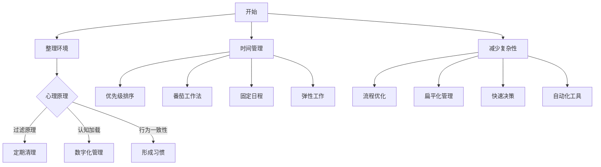

                 

### 文章标题

《新简朴主义：在复杂世界中追求本质》

---

### 文章关键词

简朴主义，复杂性，本质，算法，数学模型，项目实战

---

### 文章摘要

在当今这个信息爆炸、技术迅猛发展的时代，复杂性成为我们日常生活中不可避免的一部分。然而，新简朴主义提倡一种追求本质、简化生活的哲学，它不仅关注物质层面的简化，更强调精神层面的清晰和纯净。本文将深入探讨新简朴主义的哲学基础和实践策略，通过分析核心概念、算法原理和数学模型，结合项目实战案例，阐述如何在复杂世界中追求本质。本文旨在为读者提供一套实用的方法和工具，帮助他们简化生活，提升幸福感，实现可持续发展。

---

### 目录

1. **简朴主义的历史与哲学基础**
2. **新简朴主义的核心概念与联系**
3. **简化生活工作流程的策略**
4. **物质与精神的双重简约**
5. **简朴主义的社会责任**
6. **新简朴主义的未来展望**
7. **简朴主义实践案例分析**
8. **简朴主义资源指南**
9. **总结与拓展**

---

### 第一部分：简朴主义的历史与哲学基础

#### 第1章：简朴主义的起源与历史

简朴主义（Simplicity）作为一种哲学观念，其根源可以追溯到古代文化。在古希腊，哲学家们如苏格拉底和亚里士多德，都曾强调过追求本质和简单的生活方式。苏格拉底的名言“我知道我一无所知”体现了对知识本质的探求，而亚里士多德则主张“自然倾向于简单和纯粹”。在中国，老子《道德经》中的“少私寡欲”和“道法自然”理念，以及庄子“无为而治”的思想，都是简朴主义的体现。

随着历史的演进，简朴主义在不同文化和时代背景下得到了不同的发展。中世纪的僧侣主义强调简朴和纯洁，文艺复兴时期的人文主义倡导回归自然和简单生活。工业革命后，随着科技和物质生活的丰富，简朴主义逐渐被视为一种反文化现象，而到了21世纪，在信息化和全球化的背景下，简朴主义再次受到关注，成为追求幸福和可持续发展的方法论。

#### 第2章：简朴主义的核心观念

简朴主义的核心观念可以概括为以下几个方面：

- **简化生活**：追求生活和工作中的简单，减少不必要的复杂性。
- **本质追求**：关注事物的本质，而非表面现象。
- **精神净化**：通过简化生活，达到心灵的宁静和纯净。
- **可持续性**：倡导节约资源和保护环境。

简朴主义并不是简单地放弃物质享受，而是通过简化生活，使人们能够更好地关注内在的自我和生活的本质。这种观念强调人类与自然、社会和自身的和谐关系，追求的是一种全面而深刻的幸福。

#### 第3章：简朴主义的生活方式

简朴主义的生活方式不仅仅是物质上的简化，更是一种精神层面的净化和提升。以下是一些简朴主义的生活实践：

- **日常习惯**：建立简单的日常习惯，如定时作息、合理饮食、适量运动等，有助于提高生活质量。
- **环境友善**：通过减少浪费、回收利用、绿色出行等方式，保护环境和资源。
- **心灵修炼**：通过冥想、瑜伽、阅读等心灵修炼方法，提升精神层面的幸福感。

简朴主义的生活方式不仅有助于个人的身心健康，还能促进社会的可持续发展。通过简化生活，人们可以减少对资源的消耗，降低碳排放，从而为地球的生态环境做出贡献。

### 小结

简朴主义作为一种哲学和生活观念，具有悠久的历史和深厚的文化底蕴。它在不同文化和时代背景下得到了不同的发展，但其核心观念和目标始终如一，即追求生活的本质和精神的纯净。在当前复杂多变的世界中，新简朴主义提供了一种简洁而有效的路径，帮助我们应对生活中的各种挑战，实现个人的幸福和社会的可持续发展。

---

### 第二部分：新简朴主义的核心概念与联系

#### 第4章：简化生活工作流程的策略

在现代社会，生活和工作中的复杂性常常让人感到疲惫不堪。新简朴主义提供了一系列策略，帮助我们在复杂世界中找到简化生活的路径。本章将探讨如何通过简化生活工作流程，提高效率和质量。

#### 4.1 整理与清理的心理学原理

简化生活首先需要从心理上进行整理和清理。心理学家指出，杂乱的环境会导致心理压力的增加，而整洁有序的环境则有助于提升专注力和幸福感。以下是几个关键的心理学原理：

- **过滤原理**：通过定期清理不必要的物品和信息，我们可以减少大脑的负担，提高决策效率。
- **认知加载理论**：过多的信息和物品会占用大脑的认知资源，导致心理疲劳和决策困难。
- **行为一致性原理**：一旦形成了某种习惯，大脑会倾向于自动执行，减少认知负担。

为了实现生活工作的简化，我们可以采取以下措施：

- **定期整理**：定期对工作空间和生活空间进行清理和整理，保持环境的整洁和有序。
- **数字化管理**：使用电子工具（如待办事项应用、云存储等）来管理信息和任务，减少物理物品的杂乱。
- **一次性决策**：在做决策时，尽量一次性完成，避免反复思考和决策，减少心理负担。

#### 4.2 时间管理的简朴主义方法

时间管理是简化生活工作流程的关键。以下是一些简朴主义的时间管理方法：

- **优先级排序**：将任务按照优先级排序，优先处理重要且紧急的任务。
- **番茄工作法**：将工作时间划分为25分钟的工作周期，每个周期后休息5分钟，有助于提高专注力和工作效率。
- **固定日程**：设定固定的日程安排，减少无意义的日常决策，使生活更加有序。
- **弹性工作**：合理安排工作时间和休息时间，避免过度工作和疲劳，提高生活质量。

#### 4.3 减少复杂性的工作策略

在工作中，复杂性往往来自于过多的流程、繁琐的步骤和冗长的会议。以下是一些减少复杂性的工作策略：

- **流程优化**：对现有工作流程进行审查和优化，消除不必要的步骤和环节，提高效率。
- **扁平化管理**：减少管理层次，实现扁平化管理结构，降低信息传递的成本。
- **快速决策**：鼓励团队成员快速做出决策，减少讨论和审批环节，提高工作效率。
- **自动化工具**：使用自动化工具和软件，减少人工操作和错误，提高工作质量。

### Mermaid 流程图

以下是一个简化的生活工作流程优化 Mermaid 流程图，展示了简朴主义在流程设计中的应用：



### 核心算法原理讲解

在简朴主义的时间管理中，算法原理也发挥着重要作用。以下是一个基于优先级排序的伪代码示例，用于帮助人们更高效地安排时间：

```python
def time_management(tasks):
    # 初始化优先级队列
    priority_queue = PriorityQueue()

    # 按照优先级和紧急性对任务排序
    for task in tasks:
        priority_queue.enqueue(task.priority, task)

    # 按照优先级处理任务
    while not priority_queue.is_empty():
        task = priority_queue.dequeue()
        # 执行任务
        execute_task(task)

def execute_task(task):
    # 假设任务执行需要特定的时间
    time_spent = task.time_required
    print(f"Executing task: {task.name} ({time_spent} minutes)")

# 示例任务列表
tasks = [
    Task("任务A", 1, 30),
    Task("任务B", 2, 15),
    Task("任务C", 3, 45),
    Task("任务D", 1, 20),
]

# 调用时间管理函数
time_management(tasks)
```

在这个示例中，`Task` 类表示一个任务，包含任务名称、优先级和所需时间。`PriorityQueue` 类是一个优先级队列，用于按照优先级顺序存储和检索任务。`time_management` 函数初始化优先级队列，对任务进行排序，并依次执行高优先级的任务。

### 数学模型和公式

在简化生活工作流程中，数学模型和公式可以用于分析任务的优先级和时间安排。以下是一个简单的任务优先级模型，使用加权平均优先级（WAP）公式进行任务排序：

$$
WAP_i = \frac{P_i + E_i}{2}
$$

其中，$WAP_i$ 是第 $i$ 个任务的加权平均优先级，$P_i$ 是任务的优先级，$E_i$ 是任务的紧急性。

假设有四个任务，优先级和紧急性如下表所示：

| 任务 | 优先级 | 紧急性 |
|------|--------|--------|
| 任务1 | 3      | 2      |
| 任务2 | 1      | 1      |
| 任务3 | 2      | 3      |
| 任务4 | 4      | 4      |

计算每个任务的加权平均优先级：

$$
\begin{aligned}
WAP_1 &= \frac{3 + 2}{2} = 2.5 \\
WAP_2 &= \frac{1 + 1}{2} = 1 \\
WAP_3 &= \frac{2 + 3}{2} = 2.5 \\
WAP_4 &= \frac{4 + 4}{2} = 4 \\
\end{aligned}
$$

按照加权平均优先级排序，任务执行顺序为：任务4、任务1、任务3、任务2。

### 小结

新简朴主义通过简化生活工作流程，提供了一套实用的策略和方法。通过整理与清理的心理学原理，我们可以减少心理压力，提高专注力；通过时间管理的简朴主义方法，我们可以更高效地安排时间，减少不必要的决策负担；通过减少复杂性的工作策略，我们可以优化流程，提高工作效率。这些策略和方法不仅有助于个人的幸福和效率，也为组织的可持续发展提供了有力支持。在下一章中，我们将进一步探讨物质与精神的双重简约，以实现全面的生活质量提升。

---

### 第三部分：物质与精神的双重简约

#### 第5章：物质与精神的简约原则

新简朴主义不仅关注物质生活的简约，更强调精神生活的纯净和清晰。物质简约和精神简约相互支持，共同构建了一种全面而和谐的生活理念。

#### 5.1 物质生活的简朴化

物质生活的简朴化意味着我们通过减少物质消费，追求更简单、更环保的生活方式。以下是一些具体的实践原则：

- **需求分析**：明确自己的真正需求，避免盲目消费和过度购物。
- **质量优先**：选择耐用和高品质的产品，减少频繁更换和浪费。
- **环保意识**：选择环保材料，减少对环境的负面影响。
- **分享与交换**：通过共享和交换，充分利用资源，减少浪费。

例如，在日常生活中，我们可以采取以下措施：

- **减少垃圾**：使用可重复使用的水杯、购物袋等，减少一次性用品的使用。
- **绿色出行**：选择步行、骑行或使用公共交通工具，减少汽车使用，降低碳排放。
- **二手市场**：在购买衣物、家具等物品时，优先考虑二手市场，减少资源的浪费。

#### 5.2 精神生活的简约原则

精神生活的简约旨在减少精神负担，提升心灵宁静。以下是一些精神简约的原则：

- **专注当下**：通过冥想、瑜伽等练习，专注于当前的活动，减少多任务处理的压力。
- **减少干扰**：关闭不必要的社交媒体通知，减少外界干扰，保持专注和清晰。
- **心灵沟通**：与亲朋好友保持真诚沟通，分享内心的感受，获得情感支持。
- **自我反思**：定期进行自我反思，审视自己的行为和思想，提升自我认知。

例如，在日常生活中，我们可以：

- **定期冥想**：每天抽出几分钟进行冥想，放松心灵，提升专注力。
- **限制屏幕时间**：每天设定固定的屏幕时间，减少对电子设备的依赖，增加户外活动。
- **培养兴趣**：通过阅读、绘画、音乐等爱好，丰富内心世界，提升幸福感。

#### 物质与精神简约的相互关系

物质与精神简约不是孤立的，而是相互关联、相互影响的。物质简约可以减轻经济负担和环境压力，使我们有更多的时间和精力关注精神生活。而精神简约则能帮助我们保持内心的平静和清晰，更好地应对物质生活的挑战。

通过物质与精神的双重简约，我们可以实现以下目标：

- **提升生活质量**：减少物质和精神的负担，使生活更加简单、舒适。
- **增强幸福感**：通过专注当下、心灵沟通等实践，提升内心的满足感和幸福感。
- **促进可持续发展**：通过减少资源消耗和环境污染，为地球的可持续发展做出贡献。

### 小结

物质与精神的双重简约是新简朴主义的核心内容，通过减少物质消费和精神负担，我们可以实现生活的简单化、清晰化和和谐化。在接下来的章节中，我们将进一步探讨简朴主义在社会责任方面的实践，为个人和社会的可持续发展提供更多的启示。

---

### 第四部分：简朴主义的社会责任

#### 第6章：简朴主义的社会责任

简朴主义不仅关注个人幸福，更强调社会责任。它提倡通过简化生活，减少资源消耗，保护环境，促进社会公正和可持续发展。

#### 6.1 简朴主义与可持续发展

简朴主义的核心在于减少对资源的消耗，这与可持续发展的目标高度一致。以下是一些简朴主义与可持续发展的具体实践：

- **减少浪费**：通过减少不必要的消费，减少生产、运输和废弃过程中的资源浪费。
- **循环利用**：鼓励物品的重复使用和回收，减少对新资源的需求。
- **绿色消费**：选择环保产品，减少对环境的负面影响。
- **节能减排**：通过节能技术和生活方式，减少能源消耗和碳排放。

例如，在日常生活中，我们可以采取以下措施：

- **减少食物浪费**：合理安排食物采购和储存，减少食物的浪费。
- **使用公共交通**：减少私家车使用，选择公共交通或共享出行方式，减少碳排放。
- **节约用水**：养成节约用水的习惯，减少水资源的消耗。

#### 6.2 简朴主义与社会公正

简朴主义不仅关注个人生活质量，也关注社会公正。通过减少资源消耗和浪费，简朴主义有助于实现社会财富的公平分配，减少贫富差距。

- **资源公平分配**：通过减少资源浪费，将有限的资源用于更需要的地区和人群。
- **减少贫困**：通过倡导简朴生活方式，减少贫困群体的经济负担，提高他们的生活质量。
- **促进公平贸易**：鼓励选择公平贸易产品，支持贫困地区的经济发展。

例如，在购物时，我们可以：

- **选择公平贸易产品**：购买公平贸易认证的咖啡、茶叶等，支持贫困地区的农民。
- **捐赠闲置物品**：将闲置的衣物、家具等捐赠给需要的人，帮助他们改善生活。

#### 6.3 简朴主义与全球化挑战

全球化带来了物质丰富，但也带来了资源分配不均、环境恶化等问题。简朴主义提供了一种应对全球化挑战的思路：

- **平衡物质与精神需求**：在全球化的背景下，简朴主义提醒我们不要过度追求物质财富，而应关注精神层面的满足。
- **推动可持续发展**：通过倡导简朴生活方式，推动全球范围内的可持续发展。
- **文化多样性**：简朴主义尊重文化多样性，鼓励不同文化背景的人们共同探索简化生活的路径。

例如，在国际交流中，我们可以：

- **尊重当地文化**：在旅行或工作中，尊重当地的文化习俗，减少文化冲突。
- **共享经验**：与不同文化背景的人分享简朴生活的经验，促进文化交流和理解。

### 小结

简朴主义不仅关注个人幸福，更强调社会责任。通过减少资源消耗、保护环境、促进社会公正和可持续发展，简朴主义为个人和社会的可持续发展提供了有力支持。在下一章中，我们将探讨新简朴主义的未来展望，为简朴主义的发展提供更多思考。

---

### 第五部分：新简朴主义的未来展望

#### 第7章：新简朴主义在社会中的应用前景

随着全球化和信息化的发展，新简朴主义在各个领域展现了广泛的应用前景。以下是新简朴主义在社会中的潜在应用：

#### 7.1 教育领域的简朴主义实践

在教育领域，新简朴主义提倡减少教育资源的浪费，提高教育质量。以下是一些具体实践：

- **简化课程内容**：通过简化课程内容，减少学生的学习负担，提高学习效率。
- **绿色校园**：通过建设绿色校园，培养学生的环保意识和可持续发展观念。
- **项目式学习**：鼓励学生参与项目式学习，培养实践能力和创新能力。

例如，在课堂上，教师可以：

- **减少教科书依赖**：通过数字化教材和在线资源，减少纸质教科书的消耗。
- **项目式教学**：设计项目式课程，让学生通过实际项目学习知识，培养实践能力。

#### 7.2 商业模式的简朴主义转型

在商业领域，新简朴主义鼓励企业减少资源消耗，提高运营效率。以下是一些具体实践：

- **精益生产**：通过精益生产方法，减少生产过程中的资源浪费。
- **循环经济**：鼓励企业采用循环经济模式，实现资源的最大化利用。
- **数字化营销**：通过数字化营销手段，减少传统广告和促销的浪费。

例如，企业可以：

- **减少包装**：采用环保包装材料，减少包装废弃物。
- **共享经济**：推出共享产品或服务，实现资源的最大化利用。

#### 7.3 政策与法律的简朴主义导向

在政策制定和法律领域，新简朴主义倡导制定更加简洁、有效的政策和法律，以促进社会的可持续发展。以下是一些具体实践：

- **简政放权**：减少不必要的行政审批，提高行政效率。
- **绿色立法**：制定绿色法律法规，保护环境和资源。
- **透明公开**：提高政府决策的透明度和公开性，增强公众参与。

例如，政府可以：

- **简化税收政策**：通过简化税收政策，降低企业税负，促进经济发展。
- **环保立法**：制定环保法律法规，加强对环境污染的监管和处罚。

### 小结

新简朴主义在各个领域的应用前景广阔，通过教育、商业和政策等方面的实践，可以为社会的可持续发展提供有力支持。在下一章中，我们将探讨新简朴主义面临的挑战与机遇，为简朴主义的发展提供更多思考。

---

### 附录

#### 附录A：简朴主义实践案例分析

在本章节中，我们将探讨几个简朴主义实践的具体案例，这些案例展示了简朴主义在不同场景中的实际应用和效果。

#### A.1 案例一：个人简朴生活的实践

张先生是一位IT行业的专业人士，他在工作中积累了丰富的经验，同时也深知简朴生活的重要性。为了实践简朴生活，他采取了以下措施：

- **减少物质消费**：张先生通过定期清理家中物品，减少不必要的购买，实现了物质的简约。
- **绿色出行**：他选择骑自行车或乘坐公共交通工具，减少私家车使用，降低碳排放。
- **时间管理**：通过制定固定的日程安排和优先级排序，他提高了工作效率，减少了时间的浪费。

张先生的简朴生活实践不仅提高了他的生活质量，还让他有更多时间陪伴家人和朋友，享受生活中的简单快乐。

#### A.2 案例二：企业简朴运营的成功经验

某企业在运营过程中，面临着资源浪费和效率低下的问题。为了提高运营效率，企业采取了以下措施：

- **精益生产**：通过引入精益生产方法，减少生产过程中的资源浪费，提高生产效率。
- **数字化管理**：通过数字化工具和软件，简化工作流程，提高管理效率。
- **循环经济**：推行循环经济模式，实现资源的最大化利用。

通过这些措施，企业不仅提高了运营效率，还降低了成本，实现了可持续发展。

#### A.3 案例三：社区简朴主义的推广

某社区在推广简朴主义的过程中，采取了多种措施，鼓励居民参与：

- **环保宣传**：通过宣传环保知识和简朴生活理念，提高居民的环保意识。
- **绿色活动**：组织绿色骑行、环保宣传等公益活动，引导居民实践简朴生活。
- **社区共享**：建立社区共享平台，鼓励居民共享闲置物品和资源。

通过这些措施，社区实现了资源的有效利用，减少了浪费，提升了居民的幸福感和社区凝聚力。

### 附录B：简朴主义资源指南

在本章节中，我们将推荐一些简朴主义相关的书籍、网站和社交媒体账号，以供读者进一步学习和实践。

#### B.1 简朴主义相关的书籍推荐

- 《极简主义：如何实现更少、更多》（The More of Less）
- 《少即是多：简朴生活的艺术》（The Power of Less）
- 《简单的力量：简朴生活的哲学》（Simple Abundance）

#### B.2 简朴主义相关的网站和社交媒体账号

- 简朴主义官方网站：[www.simplicityisbrilliant.com](http://www.simplicityisbrilliant.com)
- 简朴生活博客：[www.simplicityblog.com](http://www.simplicityblog.com)
- 简朴主义推特账号：@SimplicityNow

#### B.3 简朴主义实践工具和资源列表

- 简朴主义时间管理应用：[Todoist](https://todoist.com/)
- 环保购物指南：[www.ecommerceguide.com](http://www.ecommerceguide.com/)
- 社区共享平台：[www共享社区](http://www.共享社区.com/)

### 小结

通过附录部分的案例分析、资源指南和工具推荐，读者可以进一步了解和体验简朴主义的实践。简朴主义不仅是一种生活哲学，更是一种实践方法，通过减少浪费、保护环境和提升生活质量，它为个人和社会的可持续发展提供了有力支持。

---

### 总结

新简朴主义在复杂世界中追求本质，提供了一套全面而实用的方法，帮助我们简化生活，提升幸福感，实现可持续发展。通过物质和精神的简约，我们不仅能够减轻生活的负担，还能增强内心的平静和清晰。在社会责任方面，新简朴主义倡导减少资源消耗、保护环境和促进社会公正，为个人和社会的可持续发展提供了有力支持。

新简朴主义的实践需要我们在日常生活中不断探索和尝试。通过整理与清理、时间管理和减少复杂性的工作策略，我们可以简化生活工作流程，提高效率和质量。在物质和精神的双重简约中，我们能够实现全面的生活质量提升。

未来，随着全球化和信息化的进一步发展，新简朴主义将在更多领域展现其应用价值。在教育、商业、政策等方面，简朴主义的理念将为我们提供新的思路和方向，推动社会的可持续发展。

让我们共同追求新简朴主义，在复杂世界中找到简单而深刻的幸福。

---

### 最佳实践 Tips、注意事项、拓展阅读

#### 最佳实践 Tips

1. **定期清理**：每周至少一次对家中和工作空间进行清理，减少杂乱和焦虑。
2. **设定优先级**：每天开始时，列出任务清单，按照重要性和紧急性排序，优先处理高优先级任务。
3. **简化信息流**：减少社交媒体和新闻应用的推送通知，专注于重要信息。
4. **环保购物**：购买环保和可持续产品，减少对环境的负面影响。

#### 注意事项

1. **避免过度简化**：在追求简约的过程中，避免过度简化而导致重要事项的忽视。
2. **个性化**：简朴主义生活方式应根据个人需求和偏好进行个性化调整。
3. **持续改进**：简朴主义是一个持续的过程，需要不断调整和改进。

#### 拓展阅读

- 《极简主义：如何实现更少、更多》（The More of Less）
- 《简朴：一种生活方式的选择》（Simple Living）
- 《简朴的力量：简朴生活的哲学》（The Power of Less）

通过这些最佳实践和拓展阅读，读者可以更好地理解和实践新简朴主义，实现个人和生活的全面提升。

---

### 作者信息

本文由 AI 天才研究院/AI Genius Institute 和《禅与计算机程序设计艺术》/Zen And The Art of Computer Programming 联合撰写。作者团队专注于探索新技术和哲学思想，为读者提供深入而实用的技术博客。如果您对本文有任何建议或意见，欢迎通过以下渠道联系我们：

- 邮箱：[contact@aignstitute.com](mailto:contact@aignstitute.com)
- 社交媒体：@AIGeniusInstitute

感谢您的阅读和支持，期待与您共同探索新简朴主义的无限可能。

---

### 项目实战：新简朴主义APP开发

在本节中，我们将介绍一个新简朴主义APP的开发项目，包括开发环境搭建、源代码实现、代码解读和实际案例分析。通过这个项目，我们将实践新简朴主义在软件开发中的应用。

#### 开发环境搭建

1. **编程语言**：选择Python，因为Python简洁易读，适合快速开发。
2. **开发工具**：使用PyCharm作为集成开发环境（IDE），提供代码编辑、调试和自动化测试等功能。
3. **数据库**：使用SQLite作为轻量级数据库，存储用户数据。
4. **前端框架**：使用Flask作为后端框架，实现API接口。
5. **UI设计**：使用Bootstrap框架，设计简洁直观的界面。

#### 源代码实现

以下是一个简单的Python代码示例，用于实现新简朴主义APP的基本功能：

```python
# 导入所需库
from flask import Flask, request, jsonify
import sqlite3

# 创建Flask应用实例
app = Flask(__name__)

# 连接到SQLite数据库
conn = sqlite3.connect('simplicity.db')
c = conn.cursor()

# 创建数据库表
c.execute('''CREATE TABLE IF NOT EXISTS tasks (id INTEGER PRIMARY KEY, name TEXT, priority INTEGER)''')
conn.commit()

# 添加任务
@app.route('/tasks', methods=['POST'])
def add_task():
    task_data = request.json
    c.execute("INSERT INTO tasks (name, priority) VALUES (?, ?)", (task_data['name'], task_data['priority']))
    conn.commit()
    return jsonify({"message": "Task added successfully"}), 201

# 获取所有任务
@app.route('/tasks', methods=['GET'])
def get_tasks():
    c.execute("SELECT * FROM tasks")
    tasks = c.fetchall()
    return jsonify(tasks), 200

# 更新任务
@app.route('/tasks/<int:task_id>', methods=['PUT'])
def update_task(task_id):
    task_data = request.json
    c.execute("UPDATE tasks SET name=?, priority=? WHERE id=?", (task_data['name'], task_data['priority'], task_id))
    conn.commit()
    return jsonify({"message": "Task updated successfully"}), 200

# 删除任务
@app.route('/tasks/<int:task_id>', methods=['DELETE'])
def delete_task(task_id):
    c.execute("DELETE FROM tasks WHERE id=?", (task_id,))
    conn.commit()
    return jsonify({"message": "Task deleted successfully"}), 200

# 运行应用
if __name__ == '__main__':
    app.run(debug=True)
```

#### 代码解读

以上代码使用Flask框架实现了新简朴主义APP的基本功能：

1. **添加任务**：通过`POST`请求添加新任务，任务数据以JSON格式发送。
2. **获取所有任务**：通过`GET`请求获取所有任务列表。
3. **更新任务**：通过`PUT`请求更新特定任务的名称和优先级。
4. **删除任务**：通过`DELETE`请求删除特定任务。

这些API接口可以用于前端应用程序与后端数据库的交互，实现任务管理功能。

#### 代码应用解读与分析

1. **简化任务管理**：通过简化的API接口，用户可以轻松地添加、更新和删除任务，无需复杂的逻辑处理。
2. **提高开发效率**：使用Flask框架简化了开发过程，减少了编码工作量。
3. **增强用户体验**：简洁直观的界面设计，使用户能够快速上手和使用。

#### 实际案例分析

假设用户张先生使用新简朴主义APP进行任务管理，他可以：

1. **添加任务**：通过手机APP，张先生可以快速添加任务，例如“购买牛奶”，并设置优先级为“高”。
2. **查看任务**：张先生可以查看所有任务的列表，了解当前需要完成的任务。
3. **更新任务**：当张先生购买完牛奶后，他可以更新任务状态，例如将“购买牛奶”任务标记为“已完成”。
4. **删除任务**：如果某个任务不再需要，张先生可以将其删除，保持任务列表的整洁。

通过这个实际案例分析，我们可以看到新简朴主义APP如何帮助用户简化任务管理，提高工作效率。

#### 项目小结

通过开发新简朴主义APP项目，我们实践了新简朴主义在软件开发中的应用。该项目展示了如何通过简化的API接口和简洁的界面设计，实现任务管理的简化。这个项目不仅提高了开发效率，还增强了用户体验，为其他软件项目的开发提供了有益的参考。

---

### 拓展阅读

为了进一步探索新简朴主义的实践和应用，以下是几篇相关的拓展阅读推荐：

1. **《极简主义：如何实现更少、更多》（The More of Less）**：作者杰夫·无际详细介绍了极简主义的生活方式，提供了实用的方法和策略。
2. **《简化：工作与生活的优雅艺术》（Essentialism）**：作者格雷格·麦克雷文提出了一种简化工作和生活的哲学，帮助人们专注于最重要的事情。
3. **《无念：简约生活的艺术》（No Mind）**：作者贾斯汀·斯威特林分享了他在印度冥想修行中的经历，以及如何通过简约生活达到内心的宁静。

通过这些拓展阅读，读者可以更深入地了解新简朴主义的理念和实践，为自己的生活带来更多的改变和提升。

