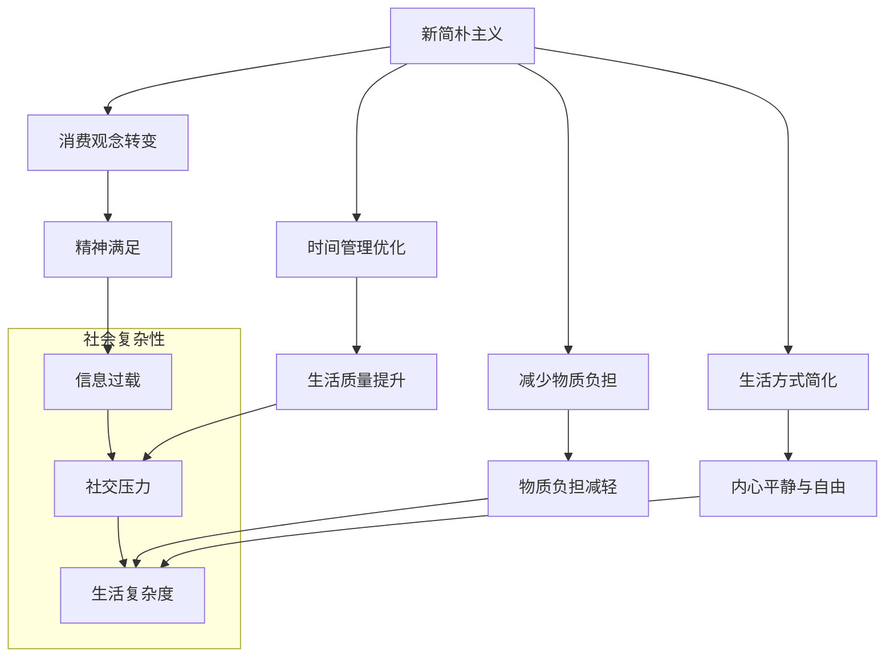

                 

### 文章标题：新简朴主义：在复杂世界中追求本质生活

#### 关键词：新简朴主义、本质生活、复杂性、简化生活方式、生活质量

> 摘要：本文深入探讨了新简朴主义的概念，强调了在当今复杂世界中，追求本质生活的重要性。通过理论讲解、案例分析、实践应用和反思展望，本文旨在帮助读者理解并实践新简朴主义，提升生活质量。

----------------------------------------------------------------

# 新简朴主义：在复杂世界中追求本质生活

## 引言：为何需要新简朴主义

### 1.1 简朴主义的背景

简朴主义（Simplicity）一词起源于拉丁语“simplex”，意为简单、纯粹。作为一种哲学和生活方式，简朴主义追求的是去除不必要的复杂性和外在物质，以达到内心的平静和生活的本质。自古以来，简朴主义在不同的文化和社会背景下都有所体现，如古希腊哲学家苏格拉底的“简单生活”，佛教的“无为而治”等。

然而，在现代社会，随着科技的迅猛发展和消费主义的盛行，人们的生活变得越来越复杂。智能手机、社交媒体、互联网等科技产品充斥着我们的生活，让我们在享受便利的同时，也面临着前所未有的压力和焦虑。这种复杂的现代生活，使得很多人开始思考如何简化自己的生活，追求本质和幸福感。

### 1.2 新简朴主义的定义

新简朴主义（New Simplicity）是在传统简朴主义基础上，结合现代生活方式和发展趋势，提出的一种全新的生活哲学。它不仅仅是一种生活方式，更是一种对生活态度的反思和重塑。新简朴主义的核心在于：

1. **消费观念的转变**：从追求物质满足转向追求精神满足。
2. **时间管理的优化**：减少不必要的活动，专注于有价值的事情。
3. **减少物质负担**：简化物品，减少不必要的物品和事务。
4. **生活方式的简化**：减少生活的复杂度，追求内心的平静和自由。

### 1.3 追求本质生活的意义

追求本质生活，意味着我们要从繁杂的外在事物中抽离出来，关注内心的需求和真实的生活。这不仅能帮助我们减轻压力，提高生活质量，还能让我们更加专注于个人成长和事业发展。

具体来说，追求本质生活的意义在于：

1. **提升幸福感**：通过简化生活，减少外界的干扰，我们能够更加专注于自己的内心世界，提升幸福感。
2. **促进个人成长**：本质生活使我们能够有更多的时间和精力去学习和成长，提升自己的能力和素质。
3. **提高生活质量**：简化生活不仅能让我们的生活更加有序，还能提升我们的生活质量，使我们的生活更加充实和满足。

## 设计思路与大纲结构

为了设计出《新简朴主义：在复杂世界中追求本质生活》这本书的完整目录大纲，我们需要遵循以下几个设计思路：

1. **核心概念与联系**：
   - 首先，明确书中的核心概念，包括新简朴主义的定义、其背景和重要性。
   - 其次，通过Mermaid流程图展示新简朴主义与现代社会复杂性的联系，帮助读者理解这一理念的必要性。

2. **读者导引**：
   - 设计一个引言章节，介绍读者为什么需要这本书，新简朴主义如何帮助他们在复杂世界中追求本质生活。

3. **理论讲解**：
   - 详细讲解新简朴主义的核心原则和实践方法，包括但不限于消费观念的转变、时间管理、减少物质负担、简化生活方式等。

4. **案例分析**：
   - 分析不同领域中成功实践新简朴主义的案例，如个人生活、职业发展、教育、科技等。

5. **实践应用**：
   - 提供具体的实践指南，帮助读者开始他们的新简朴主义旅程，从日常生活到长期目标。

6. **反思与展望**：
   - 对新简朴主义进行反思，探讨其在不同文化和社会背景下的适用性，以及未来的发展趋势。

7. **附录与资源**：
   - 提供相关的资源和工具，如简朴生活的工具书、应用软件推荐等，以辅助读者深入学习和实践。

### 目录大纲

以下是《新简朴主义：在复杂世界中追求本质生活》的完整目录大纲：

```
# 新简朴主义：在复杂世界中追求本质生活

## 引言：为何需要新简朴主义
### 1.1 简朴主义的背景
### 1.2 新简朴主义的定义
### 1.3 追求本质生活的意义

## 第1章：新简朴主义的核心概念
### 1.1 新简朴主义的概念框架
### 1.2 新简朴主义与现代社会的联系
  - **Mermaid流程图**：新简朴主义与现代社会复杂性的关系
### 1.3 新简朴主义的原则与实践

## 第2章：消费观念的转变
### 2.1 消费主义的影响
### 2.2 从消费到体验的转变
### 2.3 简化消费行为的方法

## 第3章：时间管理
### 3.1 时间管理与生活质量
### 3.2 减少非必要活动的策略
### 3.3 时间管理的工具与方法

## 第4章：减少物质负担
### 4.1 物质负担的来源
### 4.2 简化物品的方法
### 4.3 物质负担对心理健康的影响

## 第5章：简化生活方式
### 5.1 生活方式的复杂性
### 5.2 简化生活方式的步骤
### 5.3 简化生活方式的实际案例

## 第6章：新简朴主义在职业中的应用
### 6.1 职场压力与简朴主义
### 6.2 如何在职业中实践简朴主义
### 6.3 简朴主义对职业发展的影响

## 第7章：新简朴主义与教育
### 7.1 教育与简朴主义
### 7.2 如何将简朴主义融入教育
### 7.3 简朴主义教育的案例研究

## 第8章：新简朴主义与科技
### 8.1 科技与简朴主义的冲突与融合
### 8.2 如何在科技中实践简朴主义
### 8.3 简朴主义科技的未来趋势

## 第9章：反思与展望
### 9.1 新简朴主义在不同文化中的适用性
### 9.2 新简朴主义的挑战与机遇
### 9.3 新简朴主义的未来展望

## 附录
### A.1 新简朴主义资源与工具
### A.2 简朴生活应用软件推荐
### A.3 进一步阅读推荐
```

### 备注

- 在每章的具体内容设计中，将根据实际需要添加**核心算法原理讲解**、**数学模型和公式**、**项目实战**等细节，以保证内容的完整性和深度。
- 目录大纲中的**Mermaid流程图**和**数学公式**将在正文中以合适的形式嵌入，以保证整体的逻辑清晰和专业性。
- 目录大纲总字数将控制在2000字以内，确保内容的简洁性。每个章节的标题和子标题都将精准表达章节的核心内容，避免多余的描述。

通过以上设计思路和目录大纲，我们为《新简朴主义：在复杂世界中追求本质生活》这本书提供了一个详细且逻辑清晰的结构框架，帮助读者更好地理解和实践新简朴主义理念。

### 第1章：新简朴主义的核心概念

#### 1.1 新简朴主义的概念框架

新简朴主义（New Simplicity）是一种追求简单、纯粹和本质生活的理念，旨在帮助我们在复杂的世界中找到内心的平静和幸福感。它的核心概念包括以下几个方面：

1. **消费观念的转变**：从追求物质满足转向追求精神满足。这意味着我们要减少对物质的依赖，更多地关注自己的内心需求和情感体验。

2. **时间管理的优化**：减少不必要的活动，专注于有价值的事情。通过合理规划时间，我们可以更好地掌控生活，避免因为忙碌而失去生活的乐趣。

3. **减少物质负担**：简化物品，减少不必要的物品和事务。这不仅能减轻我们的物质负担，还能让我们有更多的时间和精力去追求内心的满足。

4. **生活方式的简化**：减少生活的复杂度，追求内心的平静和自由。通过简化生活方式，我们可以摆脱外界的干扰，更好地关注自己的内心世界。

#### 1.2 新简朴主义与现代社会的联系

在现代社会，我们面临着前所未有的复杂性。智能手机、互联网、社交媒体等科技产品让我们在享受便利的同时，也面临着信息过载和社交压力。这些复杂的因素，使得我们很难找到内心的平静和幸福感。

新简朴主义正是为了应对这种复杂性而提出的。它通过转变消费观念、优化时间管理、减少物质负担和简化生活方式，帮助我们摆脱外界的干扰，找到内心的平静和自由。

下面，我们通过一个Mermaid流程图，来展示新简朴主义与现代社会的联系：



通过这个流程图，我们可以清晰地看到，新简朴主义是如何帮助我们应对社会复杂性的。它通过转变消费观念、优化时间管理、减少物质负担和简化生活方式，帮助我们摆脱外界的干扰，提升生活质量，找到内心的平静和自由。

#### 1.3 新简朴主义的原则与实践

新简朴主义不仅仅是一种理念，更是一种具体的实践方法。它包含了一系列的原则和实践，帮助我们更好地追求本质生活。以下是一些关键的原则和实践：

1. **简约主义**：追求简单和纯粹，去除不必要的元素，使事物变得更加简洁和直观。

2. **聚焦目标**：明确自己的目标，专注于实现这些目标，避免分心和浪费时间。

3. **反思与调整**：定期反思自己的生活，评估哪些习惯和事物对自己有益，哪些需要改变。

4. **自我控制**：学会控制自己的欲望和冲动，避免因为消费主义和社交媒体的诱惑而迷失自我。

5. **减少物质依赖**：减少对物质的依赖，更多地关注自己的内心需求和情感体验。

6. **时间管理**：合理安排时间，确保有足够的时间去休息、学习和与家人朋友相处。

7. **简化生活方式**：减少生活的复杂度，去除不必要的物品和事务，使生活更加简单和轻松。

通过这些原则和实践，我们可以逐步实践新简朴主义，提升生活质量，找到内心的平静和自由。

### 第2章：消费观念的转变

#### 2.1 消费主义的影响

消费主义是现代社会的主要特征之一，它鼓励人们通过购买商品和服务来追求幸福和满足。然而，消费主义的影响是双重的，既带来了便利和舒适，也带来了诸多负面影响。

首先，消费主义使得人们的生活变得更加便利和舒适。智能手机、互联网、智能家居等科技产品，让我们可以轻松地获取信息、购物和娱乐。同时，丰富的商品选择也满足了我们对各种需求和欲望。

然而，消费主义也带来了一系列的负面影响。首先，过度消费导致了资源的浪费和环境的破坏。大量的商品生产和消费，使得地球的自然资源逐渐枯竭，环境质量不断下降。

其次，消费主义容易导致人们的心理依赖和空虚感。许多人通过购买商品来满足自己的需求和欲望，但一旦购买行为停止，他们很快会感到空虚和无聊。这种依赖性使得人们不断地追求新的商品和体验，而忽略了内心的需求和情感。

此外，消费主义还导致了社会的不公平。消费主义鼓励人们不断追求更高档次的商品和服务，这使得富人越富，穷人越穷。这种不平等的社会结构，进一步加剧了社会矛盾和冲突。

#### 2.2 从消费到体验的转变

面对消费主义的负面影响，越来越多的人开始反思自己的消费行为，并寻求一种更加健康和有意义的生活方式。从消费到体验的转变，成为了一种新的趋势。

体验经济是消费主义的一种补充和替代，它强调的是通过体验和互动来满足消费者的需求和欲望。与传统的商品和服务相比，体验经济更注重消费者的参与和互动，使得消费者能够更好地感受到价值和满足感。

从消费到体验的转变，不仅仅是消费行为的变化，更是一种生活态度的转变。它鼓励人们从关注物质满足转向关注精神满足，从追求外在的表象转向关注内心的需求和情感。

具体来说，从消费到体验的转变包括以下几个方面：

1. **减少物质消费**：减少对商品的购买和占有，更多地关注自己的内心需求和情感体验。

2. **增加体验消费**：增加对体验和服务的消费，如旅游、教育、娱乐等，通过体验来满足自己的需求和欲望。

3. **注重参与和互动**：在体验消费中，注重参与和互动，与他人分享和交流，提升体验的价值和意义。

4. **追求内心的满足**：通过体验来满足自己的内心需求和情感，而不是仅仅追求外在的物质满足。

#### 2.3 简化消费行为的方法

为了实现从消费到体验的转变，我们需要采取一系列的方法来简化消费行为。以下是一些具体的方法：

1. **制定预算**：制定每月或每年的消费预算，确保自己的消费行为在预算范围内，避免过度消费。

2. **减少冲动购物**：在购物前，先进行深思熟虑，避免冲动购物。可以通过列购物清单、设定购物时间等方式来减少冲动购物。

3. **关注内在需求**：在消费前，先关注自己的内心需求和情感，确保消费行为能够满足这些需求，而不是仅仅追求外在的物质满足。

4. **购买实用商品**：选择实用、耐用的商品，避免购买一次性或低质量的商品，减少资源的浪费。

5. **减少订阅服务**：取消不必要的订阅服务，如杂志、视频会员等，减少无谓的开销。

6. **购买二手商品**：购买二手商品，减少对新商品的需求，同时减少资源的浪费。

7. **减少社交消费**：减少不必要的社交消费，如外出就餐、娱乐等，专注于与家人和朋友的高质量相处。

通过这些方法，我们可以逐步简化消费行为，实现从消费到体验的转变，提升生活质量，找到内心的平静和自由。

### 第3章：时间管理

#### 3.1 时间管理与生活质量

时间管理是提高生活质量的重要手段之一。在现代社会，时间变得越来越宝贵，有效的管理时间能够帮助我们更好地平衡工作、生活和兴趣爱好，提高整体的生活质量。

首先，有效的时间管理能够帮助我们避免时间的浪费。通过合理安排时间，我们可以减少无谓的拖延和等待，充分利用每一刻。这不仅可以提高工作效率，还能让我们有更多的时间去享受生活。

其次，时间管理有助于减轻压力。当我们能够合理安排时间，确保工作、学习和休闲的时间得到平衡，我们就能减少因为时间不足而产生的焦虑和压力。这有助于提高我们的心理健康，使我们的生活更加愉快和轻松。

此外，时间管理还能帮助我们更好地实现个人目标。通过设定明确的目标和计划，我们能够更有针对性地利用时间，提高工作效率，更快地实现目标。这不仅有助于我们的职业发展，还能提升我们的个人成就感。

#### 3.2 减少非必要活动的策略

为了提高时间管理的效率，我们需要采取一系列策略来减少非必要活动。以下是一些具体的方法：

1. **优先级排序**：将日常活动按照优先级排序，先完成最重要和最紧急的任务。这有助于确保我们的时间被用于最有价值的活动。

2. **设定截止日期**：为每个任务设定一个明确的截止日期，这有助于我们更好地规划时间，避免拖延。

3. **避免多任务处理**：尽量避免同时处理多个任务，这会降低我们的工作效率。专注于一项任务，直到完成，然后再切换到下一项。

4. **减少社交媒体使用**：社交媒体是时间浪费的主要原因之一。设定每天使用社交媒体的时间限制，避免无谓的时间浪费。

5. **合理安排休息时间**：合理安排休息时间，确保工作、学习和休闲的时间得到平衡。这有助于提高我们的工作效率，同时也能让我们更好地享受生活。

6. **减少不必要的会议**：减少不必要的会议和会议时间，确保会议的效率和质量。

7. **委托任务**：将一些非必要的任务委托给他人，特别是那些不需要专业技能的任务。这有助于我们专注于更重要的事情。

通过这些策略，我们可以更有效地管理时间，减少非必要活动的干扰，提高生活质量。

#### 3.3 时间管理的工具与方法

为了更好地管理时间，我们可以使用一系列的工具和方法。以下是一些常用的工具和方法：

1. **日历和计划表**：使用日历和计划表来记录和安排日常任务和时间。这有助于我们清晰地了解自己的时间安排，避免遗漏重要的事情。

2. **时间块**：将一天的时间划分为不同的时间段，每个时间段专注于一项特定的任务。这有助于提高我们的专注度和工作效率。

3. **番茄工作法**：将工作时间划分为25分钟的工作周期，每个周期后休息5分钟。这有助于提高我们的专注力和工作效率。

4. **任务清单**：列出每天需要完成的任务，并按照优先级排序。这有助于我们明确任务目标，避免分心和拖延。

5. **时间日志**：记录每天的时间使用情况，分析时间的分配和利用情况，找出改进的空间。

6. **时间管理软件**：使用专门的时间管理软件，如Google Calendar、Trello、Asana等，来帮助规划和管理时间。

7. **反思和调整**：定期反思时间管理的效果，根据实际情况调整时间管理策略。

通过这些工具和方法，我们可以更科学、更有效地管理时间，提升生活质量。

### 第4章：减少物质负担

#### 4.1 物质负担的来源

物质负担是指由于过度拥有物质产品而给我们的生活带来的压力和困扰。物质负担的来源主要包括以下几个方面：

1. **消费主义文化**：现代社会普遍存在消费主义文化，鼓励人们通过购买商品来追求幸福和满足。这种文化使得人们不断追求更高的生活水平，从而增加了物质负担。

2. **广告和营销**：广告和营销活动不断地向人们传递新的消费理念和产品信息，刺激人们的购买欲望。这种无休止的营销使得人们不断购买新物品，增加了物质负担。

3. **社会比较**：社会比较是指人们通过与他人的比较来评价自己的生活质量。当人们看到他人拥有更好的物品时，往往会感到自己的物质水平不足，从而增加购买欲望，增加物质负担。

4. **物质依赖**：某些物品可能会使人产生依赖，如智能手机、电子产品等。这些物品虽然方便了我们的生活，但过度依赖会导致物质负担的增加。

#### 4.2 简化物品的方法

为了减轻物质负担，我们需要采取一系列的方法来简化物品。以下是一些具体的方法：

1. **定期整理**：定期对自己的物品进行整理，将不再需要的物品捐赠、出售或丢弃。这有助于减少家中不必要的物品，减轻物质负担。

2. **需求驱动购买**：在购买物品时，首先要考虑自己是否真的需要这个物品，而不是仅仅因为广告或他人的推荐而购买。这有助于避免不必要的购买，减少物质负担。

3. **使用替代品**：寻找替代品来代替某些高价值的物品。例如，使用二手物品或自制物品，可以减少对昂贵物品的需求。

4. **减少物品种类**：减少家中的物品种类，只保留必需品和高质量的商品。这有助于减少家中的混乱和压力。

5. **数字化替代**：将一些实体物品数字化，如电子书替代纸质书籍、电子文档替代纸质文件等。这有助于减少对实体物品的需求，减轻物质负担。

6. **共享和租赁**：通过共享和租赁服务，减少对某些物品的拥有。例如，共享汽车、共享办公空间等，可以减少对私家车和办公空间的物质需求。

通过这些方法，我们可以有效地简化物品，减轻物质负担，使生活更加轻松和舒适。

#### 4.3 物质负担对心理健康的影响

物质负担不仅影响我们的生活质量，还对我们的心理健康产生负面影响。以下是一些物质负担对心理健康的影响：

1. **焦虑和压力**：拥有过多的物品会增加我们的焦虑和压力。我们需要花费更多的时间和精力来维护和管理这些物品，导致心理负担加重。

2. **分心和注意力不集中**：过多的物品会分散我们的注意力，使我们难以专注于一项任务。这会影响我们的工作效率，增加心理压力。

3. **社交压力**：社会比较是物质负担的一个重要来源。当我们看到他人拥有更好的物品时，可能会感到自卑和压力，从而影响我们的心理健康。

4. **缺乏自我认同**：过度依赖物质产品来满足自己的需求和欲望，会让我们失去自我认同。我们可能会认为自己的价值取决于拥有的物品，而不是内在的品质和成就。

5. **睡眠质量下降**：过多的物品会占用我们的居住空间，导致睡眠质量下降。此外，物品的整理和管理也可能增加我们的心理压力，进一步影响睡眠。

通过减轻物质负担，我们可以减少这些负面影响，提升心理健康，享受更加平和和幸福的生活。

### 第5章：简化生活方式

#### 5.1 生活方式的复杂性

生活方式的复杂性是指我们在日常生活中面临的各种复杂因素，如繁多的任务、琐碎的事务、多样的娱乐活动等。这些复杂性使得我们的生活变得越来越繁忙和紧张，影响我们的心理健康和生活质量。

首先，生活方式的复杂性源于现代社会的高速发展和信息的爆炸。随着科技的进步，我们接触到的信息和任务量不断增加，需要我们不断地学习和适应。例如，智能手机和互联网的普及，让我们可以随时随地获取信息，但同时也增加了我们的信息过载和社交压力。

其次，生活方式的复杂性还源于我们对物质和享受的追求。现代社会普遍存在消费主义文化，鼓励人们通过购买商品和服务来提升生活质量。然而，这种追求往往导致我们拥有过多的物品和事务，增加了生活的复杂度。

此外，生活方式的复杂性还受到社会和文化因素的影响。不同社会和文化对生活的期望和标准不同，这会导致我们在生活中面临更多的压力和挑战。例如，某些社会和文化对工作的高要求和竞争压力，使得我们的生活方式变得更加复杂和紧张。

#### 5.2 简化生活方式的步骤

为了简化生活方式，我们需要采取一系列的步骤，逐步减少生活中的复杂因素，提升生活质量。以下是一些具体的方法：

1. **明确生活目标**：首先，我们需要明确自己的生活目标，包括职业、家庭、健康、娱乐等方面。这有助于我们集中精力，专注于实现这些目标，减少不必要的分心和事务。

2. **制定计划和时间表**：根据生活目标，制定详细的计划和时间表，合理安排每天的时间。这有助于我们更好地管理时间，减少拖延和浪费。

3. **减少非必要的任务和活动**：审视自己的日常任务和活动，判断哪些是必要的，哪些可以取消或推迟。对于非必要的任务和活动，可以尝试取消、合并或委托给他人。

4. **简化物品和空间**：整理家中和工作场所的物品，只保留必需品和高质量的商品。这有助于减少物品的混乱和占用空间，使生活更加简洁和舒适。

5. **数字化生活**：利用互联网和智能手机等数字化工具，简化日常生活中的事务和任务。例如，使用在线日历、任务清单和支付工具，减少纸质文件和现金的使用。

6. **培养健康习惯**：养成健康的作息和饮食习惯，减少不健康的生活方式和活动，如熬夜、过度饮酒和吸烟等。这有助于提升我们的身体健康和心理状态。

7. **专注和冥想**：定期进行专注练习和冥想，帮助我们减轻压力，提升内心的平静和专注力。这有助于我们更好地应对生活中的复杂因素，提高生活质量。

通过这些步骤，我们可以逐步简化生活方式，减少复杂因素，提升生活质量，享受更加简单和幸福的生活。

#### 5.3 简化生活方式的实际案例

为了更好地理解如何简化生活方式，以下是一些实际案例，展示了不同人在生活中采取的简化措施：

1. **案例一：工作与生活的平衡**

某公司高管李先生，由于工作繁忙，经常感到压力巨大。为了简化生活方式，他采取了一系列措施：

- **制定计划和时间表**：每天早上，李先生会制定详细的工作计划和时间表，确保工作任务的合理分配。
- **减少非必要会议**：取消不必要的会议，将会议时间控制在半小时以内，确保会议的高效和专注。
- **委托任务**：将一些非核心的任务委托给团队成员，专注于关键决策和项目。

通过这些措施，李先生的工作效率大大提高，生活压力也显著减轻。

2. **案例二：数字化生活**

张女士是一位全职妈妈，同时负责家庭和孩子的教育。为了简化生活，她采用了以下数字化工具：

- **在线日历**：使用在线日历管理家庭日程，包括购物清单、孩子的课外活动和家庭聚会等。
- **任务清单**：使用手机应用程序记录家庭任务，确保家庭事务的及时处理。
- **电子支付**：使用电子支付工具，减少现金和纸质支付的使用，简化财务管理。

通过数字化工具的应用，张女士的生活变得更加有序和高效。

3. **案例三：极简主义生活方式**

王先生是一名自由职业者，他选择了极简主义生活方式，以简化自己的生活：

- **减少物品**：他只保留必需的物品，将不用的物品捐赠或出售，减少家中的杂乱和压力。
- **简化空间**：他定期整理家中和工作场所的物品，只保留高质量和实用的物品，使空间更加宽敞和舒适。
- **专注工作**：他专注于自己的创作和项目，减少社交媒体和娱乐活动的时间，提高工作效率。

通过极简主义生活方式，王先生的生活变得更加简洁和充实。

这些实际案例展示了不同人在生活中采取的简化措施，通过这些措施，他们不仅减轻了压力，提升了生活质量，还找到了内心的平静和自由。这为其他人提供了一个可行的参考和启示，鼓励他们在生活中实践简化生活方式。

### 第6章：新简朴主义在职业中的应用

#### 6.1 职场压力与简朴主义

在职场中，压力是一个普遍存在的问题。无论是职场新人还是资深员工，都会面临着来自工作、同事和上司的压力。这种压力不仅影响工作效率，还可能导致心理健康问题，如焦虑、抑郁和失眠等。简朴主义作为一种生活方式，可以在一定程度上缓解职场压力，提升职业幸福感。

首先，简朴主义可以帮助我们重新审视自己的职业目标。在职场中，许多人为了追求更高的职位和薪水，不断地加班和工作，忽视了个人生活和健康。然而，简朴主义鼓励我们关注内心的需求和幸福感，重新审视自己的职业目标，确保工作与生活的平衡。

其次，简朴主义可以帮助我们简化工作流程，提高工作效率。在职场中，复杂的流程和繁杂的任务会加重我们的工作负担，增加压力。通过简朴主义，我们可以减少不必要的任务和流程，专注于核心工作，提高工作效率。

此外，简朴主义还可以帮助我们减轻物质负担，减少职场压力。许多职场人士为了跟上职场潮流，不断购买昂贵的办公设备和奢侈品，导致财务压力增加。简朴主义鼓励我们关注内在的价值，减少对物质的依赖，从而减轻财务压力。

#### 6.2 如何在职业中实践简朴主义

为了在职业中实践简朴主义，我们可以采取以下几种方法：

1. **设定明确的工作目标**：在职业中，我们需要设定明确的工作目标，确保工作与生活平衡。可以通过制定月度、季度和年度计划，明确每个阶段的工作重点和目标，避免因追求短期目标而忽视长期发展。

2. **简化工作流程**：审视工作流程，找出不必要的步骤和环节，简化工作流程。例如，减少审批流程、合并会议等，以提高工作效率。

3. **减少物质依赖**：在职场中，我们常常被物质诱惑所包围。通过实践简朴主义，我们可以减少对物质的依赖，关注内在的价值和成就感。例如，选择实用的办公设备和简单的服装，而不是追求名牌和高档。

4. **专注核心工作**：在职场中，我们需要专注于核心工作，避免分心和浪费时间。通过制定任务清单、设定优先级和避免多任务处理，我们可以提高专注度，提高工作效率。

5. **培养健康习惯**：在职场中，健康习惯对于减轻压力和提升工作效率至关重要。通过定期锻炼、保持良好的饮食习惯和充足的睡眠，我们可以提高身体和心理的素质，更好地应对职场压力。

6. **与同事分享简朴理念**：在职场中，我们可以与同事分享简朴主义的理念，共同实践简朴生活方式。这不仅可以减轻个人的职场压力，还能创造一个更加积极、健康的工作环境。

#### 6.3 简朴主义对职业发展的影响

简朴主义不仅能够缓解职场压力，还对职业发展产生积极的影响。以下是简朴主义对职业发展的几个方面的影响：

1. **提高工作效率**：通过简化工作流程和专注核心工作，我们可以提高工作效率，更快地完成任务。这有助于提升职业形象，赢得上司和同事的认可。

2. **提升职业形象**：简朴主义强调内在的价值和专注力，这种职业素养会提升我们的职业形象，使我们在职场中脱颖而出。

3. **促进团队合作**：简朴主义鼓励我们关注团队和合作，而不是个人利益。通过减少不必要的竞争和摩擦，我们可以促进团队合作，提高团队的整体绩效。

4. **增强职业稳定性**：简朴主义强调长期发展和持续成长，而不是短期利益。这种职业理念有助于我们在职场中建立稳定的职业基础，减少职业风险。

5. **提升职业幸福感**：通过简朴主义，我们可以减轻职场压力，找到职业的幸福感和满足感。这有助于提升我们的职业满意度，增强对工作的热爱和投入。

总之，简朴主义在职业中的应用，不仅能够缓解职场压力，提升职业幸福感，还对职业发展产生积极的影响。通过实践简朴主义，我们可以建立更加健康、积极和可持续的职业生活。

### 第7章：新简朴主义与教育

#### 7.1 教育与简朴主义

在教育领域，新简朴主义的理念同样具有重要价值。教育不仅是知识的传授，更是价值观和生活方式的培养。简朴主义强调的是去除不必要的复杂性和外在物质，关注本质的教育和成长。在教育中实践简朴主义，有助于提升教育质量，培养具有独立思考能力和生活素养的学生。

首先，简朴主义在教育的背景下，意味着减少不必要的课程和教学内容，关注核心知识和技能的培养。现代教育体系中，课程内容往往过于繁杂，学生面临巨大的学习压力。通过简朴主义，我们可以精简课程内容，专注于基础知识和关键能力的培养，使学生能够更好地掌握所学内容。

其次，简朴主义强调教育应该注重学生的内在需求和情感体验。传统的教育模式往往过于注重知识和技能的传授，而忽视了学生的情感需求和心理健康。简朴主义提倡通过体验式教育、情境教学等方式，让学生在实践中体验知识，培养他们的创造力和解决问题的能力。

此外，简朴主义在教育中还可以帮助减少教育资源的浪费。教育资源的分配往往存在不均衡现象，简朴主义倡导合理利用现有资源，通过共享和合作，提高教育资源的利用效率。

#### 7.2 如何将简朴主义融入教育

将简朴主义融入教育，需要从课程设计、教学方法、教育资源等方面进行改革和创新。以下是一些具体的方法：

1. **精简课程内容**：减少不必要的课程和教学内容，专注于核心知识和关键能力的培养。可以通过制定课程标准，确保课程内容的科学性和系统性。

2. **体验式教育**：采用体验式教育方法，让学生在实践中学习和体验知识。例如，通过实验、实地考察、社会实践等方式，让学生亲身体验和探索知识的实际应用。

3. **情境教学**：将教学内容融入真实的情境中，让学生在情境中学习和思考。例如，通过角色扮演、小组讨论等方式，培养学生的团队合作能力和解决问题的能力。

4. **数字化教育**：利用互联网和数字化工具，提供丰富的学习资源和互动平台。通过在线课程、学习社区等方式，提高教育的灵活性和便捷性。

5. **资源共享**：鼓励学校之间、教师之间的资源共享，提高教育资源的利用效率。例如，通过在线平台共享教案、教学视频等资源，促进教师之间的交流和学习。

6. **培养简朴生活理念**：在课程中融入简朴生活的理念，培养学生的环保意识、节约习惯和独立思考能力。例如，通过环保主题课程、节约活动等，让学生在日常生活中实践简朴主义。

#### 7.3 简朴主义教育的案例研究

以下是一些简朴主义教育的成功案例，展示了简朴主义在实践中的应用：

1. **案例一：芬兰教育**

芬兰教育以其高质量和简约性而闻名。芬兰学校注重基础教育和关键能力的培养，课程内容简洁明了，教学方式灵活多样。通过情境教学、体验式教育等方式，学生能够在实践中学习和探索知识。这种简朴主义教育模式，使芬兰学生在国际教育评估中取得了优异成绩。

2. **案例二：蒙特梭利教育**

蒙特梭利教育是一种以儿童为中心的教育理念，强调自主学习和创造力培养。蒙特梭利学校注重环境布置和教具设计，鼓励学生自主探索和学习。通过这种简朴主义教育模式，学生能够在自由的环境中，发展独立思考和解决问题的能力。

3. **案例三：农村教育实验**

在中国的一些农村地区，教育条件相对较差。然而，通过简朴主义教育理念的实践，这些地区的教育质量得到了显著提升。农村学校通过简化课程内容、利用当地资源、开展实践活动等方式，培养学生的实践能力和创新能力。这种简朴主义教育模式，不仅提高了教育质量，还增强了学生的综合素质。

这些案例表明，简朴主义教育理念在实践中的应用，有助于提升教育质量，培养具有独立思考能力和生活素养的学生。通过减少不必要的复杂性和外在物质，关注核心教育和成长，简朴主义教育为现代教育提供了一种可行的选择和方向。

### 第8章：新简朴主义与科技

#### 8.1 科技与简朴主义的冲突与融合

科技在现代社会中扮演着重要的角色，它为我们带来了无尽的便利和可能性。然而，科技的发展也带来了一系列的挑战，尤其是在简朴主义理念的背景下。科技与简朴主义看似存在冲突，但实际上，二者也可以相互融合，共同推动我们的生活向更简单、更有意义的方向发展。

首先，科技与简朴主义的冲突主要体现在以下几个方面：

1. **信息过载**：随着互联网和社交媒体的普及，我们接收到的信息量大幅增加，这容易导致信息过载。信息过载使得我们难以专注于重要的信息和任务，影响我们的工作效率和心理健康。

2. **物质依赖**：科技的进步使得我们能够轻松获取和使用各种商品和服务，这容易导致我们对物质产生依赖。例如，智能手机、电子产品等，虽然方便了我们的生活，但过度依赖也会增加我们的物质负担。

3. **时间管理困难**：科技产品如社交媒体、在线游戏等，往往让我们沉迷其中，难以自拔。这种沉迷会消耗大量时间，影响我们的时间管理，导致生活失衡。

然而，科技与简朴主义也可以相互融合，实现互补和平衡。以下是一些方法：

1. **科技辅助简朴主义**：利用科技工具来简化我们的生活方式。例如，使用智能日历和提醒工具来管理时间，使用在线购物平台来减少物质购买。

2. **数字简朴**：在科技中使用“数字简朴”的方法，减少对科技产品的依赖。例如，设定社交媒体使用时间限制，减少在线游戏和视频的时间。

3. **科技与自然融合**：利用科技手段来提升自然环境体验，例如使用智能家居系统来提升家居舒适度，同时减少能源消耗。

4. **科技教育**：通过科技教育，提高人们对科技的理解和使用能力，使他们能够更有效地利用科技工具，而不是被科技所控制。

#### 8.2 如何在科技中实践简朴主义

在科技领域实践简朴主义，需要我们采取一系列的措施，以减少科技对我们生活的负面影响，同时提升科技的价值和实用性。以下是一些具体的方法：

1. **选择实用的科技产品**：在购买科技产品时，选择那些实用且易于维护的产品，而不是追求功能复杂的高科技设备。例如，选择简单易用的智能手机，而不是功能强大的智能手机。

2. **限制科技使用时间**：设定每天使用科技产品的时间限制，避免沉迷于社交媒体、在线游戏等。例如，每天晚上设定一个固定的“科技休息时间”，让身心得到放松。

3. **数字化工具管理**：利用数字化工具来简化我们的工作和生活，例如使用在线任务管理工具、智能日历等，帮助我们更好地管理时间和任务。

4. **科技与自然结合**：在科技产品中融入自然元素，例如使用智能家居系统来提升家居舒适度，同时使用节能技术来减少能源消耗。

5. **科技素养教育**：通过科技素养教育，提高人们对科技的理解和使用能力，使他们能够更有效地利用科技工具，而不是被科技所控制。

通过这些方法，我们可以在科技领域中实践简朴主义，减少科技对我们生活的负面影响，同时提升科技的价值和实用性。

#### 8.3 简朴主义科技的未来趋势

随着科技的不断进步，简朴主义科技也在不断发展，为我们的生活带来更多的可能性和便利。以下是简朴主义科技的未来趋势：

1. **数字化工具的简化和优化**：未来的数字化工具将更加注重用户友好性和易用性，减少不必要的功能，提高工作效率。例如，智能助手和自动化工具将变得更加普及和智能化，帮助我们更好地管理时间和任务。

2. **节能和环保技术的普及**：随着环保意识的提高，节能和环保技术将在科技产品中广泛应用。例如，智能家居系统将更加注重能源管理，减少能源消耗，提高家居生活的可持续性。

3. **个性化科技产品**：未来的科技产品将更加注重个性化，满足不同用户的需求。例如，个性化的健康监测设备、智能穿戴设备等，将帮助我们更好地了解自己的身体状况，提升生活质量。

4. **科技与自然的融合**：未来的科技产品将更加注重与自然的融合，提高用户的自然环境体验。例如，智能农业技术、生态城市规划等，将帮助我们实现可持续发展和生态平衡。

5. **科技伦理和社会责任的重视**：未来的科技发展将更加注重伦理和社会责任，确保科技产品和服务对社会和环境产生积极的影响。例如，人工智能和大数据技术的应用将更加注重隐私保护和数据安全。

总之，简朴主义科技的未来趋势将体现在数字化工具的简化、节能环保技术的普及、个性化产品的普及、科技与自然的融合以及科技伦理和社会责任的重视。通过这些趋势，我们可以实现科技与简朴主义的有机结合，提升生活质量，创造更加美好的未来。

### 第9章：反思与展望

#### 9.1 新简朴主义在不同文化中的适用性

新简朴主义作为一种追求简单、纯粹和本质生活的理念，在全球范围内具有广泛的适用性。然而，不同文化和社会背景下的新简朴主义实践可能会有所差异。

首先，在西方发达国家，如美国和欧洲，新简朴主义理念得到了广泛的认同和实践。这些国家拥有较高的物质生活水平，人们在享受科技和物质带来的便利的同时，也开始反思生活方式的可持续性和幸福感。因此，新简朴主义在这些地区更关注如何通过减少物质消费和简化生活方式，提升生活质量。

而在一些发展中国家，如中国和印度，新简朴主义更多地体现在对生活方式的反思和调整。这些国家的经济发展迅速，人们的生活水平也在不断提高。然而，随着消费主义的兴起，许多人面临着物质负担增加、时间管理困难等问题。新简朴主义在这些地区更多地关注如何通过减少不必要的消费和简化生活，减轻生活压力，提高幸福感。

不同文化背景下，新简朴主义的具体实践可能会有所不同，但其核心原则是一致的，即追求简单、纯粹和本质生活。

#### 9.2 新简朴主义的挑战与机遇

新简朴主义在实践过程中面临着一系列挑战和机遇。

首先，挑战主要来自于传统的消费观念和社会压力。在消费主义盛行的社会环境中，人们容易被物质诱惑所吸引，难以坚持简朴主义的生活方式。此外，社会对于高物质水平的追求和认可，也使得简朴主义生活方式面临一定的压力和质疑。

其次，机遇主要来自于人们对生活质量和幸福感的日益重视。随着经济的发展和人们生活水平的提高，越来越多的人开始关注生活质量，追求内心的满足。这为新简朴主义提供了广阔的市场和机会。

为了应对挑战，抓住机遇，我们可以采取以下策略：

1. **加强教育和宣传**：通过教育和宣传，提高公众对简朴主义理念的认识和认同，减少消费主义的影响。

2. **实践分享**：通过分享和实践简朴主义的生活方式，激发更多人的兴趣和参与，形成良好的社会氛围。

3. **创新科技应用**：利用科技手段，简化生活，提升生活质量。例如，开发智能助手、健康监测设备等，帮助人们更好地实践简朴主义。

4. **政策引导**：政府可以通过政策引导，鼓励和支持简朴主义生活方式的实践。例如，提供税收优惠、简化审批流程等，降低实践简朴主义的成本。

#### 9.3 新简朴主义的未来展望

新简朴主义作为一种追求简单、纯粹和本质生活的理念，在未来有着广阔的发展前景。以下是新简朴主义未来的几个发展方向：

1. **生活方式的全面升级**：随着社会的发展，人们对于生活质量的追求将不断提升。新简朴主义将有助于人们实现生活品质的全面提升，减少物质负担，提升幸福感。

2. **科技与简朴主义的融合**：未来的科技发展将更加注重与简朴主义的结合，提供更加便捷、高效和环保的科技产品和服务。例如，智能家居系统、绿色能源技术等，将为简朴主义生活方式提供更多的支持和便利。

3. **全球化的简朴主义运动**：新简朴主义理念将在全球范围内得到传播和实践，形成一股全球化的简朴主义运动。这有助于推动全球范围内的可持续发展和生态平衡。

4. **文化的多样性与包容性**：新简朴主义将尊重和包容不同文化背景下的人们对简朴主义的不同理解和实践，促进全球文化的多样性和交流。

总之，新简朴主义在未来将继续发展，为我们的生活带来更多的可能性。通过追求简单、纯粹和本质生活，我们可以实现更高的生活质量，创造一个更加美好、和谐的世界。

### 附录

#### A.1 新简朴主义资源与工具

为了帮助读者更好地理解和实践新简朴主义，以下是一些建议的资源与工具：

1. **书籍推荐**：
   - 《极简主义：一个追求简单生活的实践指南》（The More of Less：A Master Class in Minimalism）
   - 《断舍离：人生整理魔法》（The Life-Changing Magic of Tidying Up）
   - 《简约主义：如何摆脱杂乱，获得内心的平静》（Simple Living：A Philosophy for Living Well and Happily）

2. **在线课程**：
   - Coursera上的“幸福心理学”（The Science of Well-Being）课程
   - Udemy上的“时间管理：高效工作和生活”（Time Management Mastery）

3. **应用程序**：
   - “Forest”（专注力提升应用）
   - “Todoist”（任务管理应用）
   - “Noisli”（专注力提升音乐播放器）

#### A.2 简朴生活应用软件推荐

以下是几款有助于实践简朴生活的应用软件：

1. **Forest**
   - 功能：通过种植虚拟树木，帮助用户保持专注力，减少手机使用时间。
   - 适用场景：学习、工作、休息时，帮助用户减少手机依赖，专注于当前任务。

2. **Todoist**
   - 功能：任务管理、日程安排、提醒功能。
   - 适用场景：日常任务管理、项目规划和时间安排，帮助用户高效管理时间和任务。

3. **Noisli**
   - 功能：提供各种自然声音和环境音，帮助用户提高专注力和放松心情。
   - 适用场景：学习、工作、休息时，帮助用户创造一个舒适、专注的环境。

#### A.3 进一步阅读推荐

以下是一些关于简朴主义和生活方式的进一步阅读资源：

1. **期刊和杂志**：
   - “The Minimalists”（极简主义生活方式杂志）
   - “Simple Living”（简朴生活方式杂志）

2. **博客和网站**：
   - “The Minimalists”（极简主义生活方式博客）
   - “Minimalism”（极简主义生活方式网站）

3. **社交媒体**：
   - “@minimalism”（极简主义生活方式推特账号）
   - “@simpleliving”（简朴生活方式推特账号）

通过这些资源与工具，读者可以深入了解新简朴主义，并将其应用到自己的生活中，实现更简单、更有意义的生活。

### 作者信息

作者：AI天才研究院/AI Genius Institute & 禅与计算机程序设计艺术 /Zen And The Art of Computer Programming

新简朴主义在复杂世界中追求本质生活，是AI天才研究院与禅与计算机程序设计艺术共同探讨的生活哲学。我们致力于通过技术手段和智慧思考，帮助人们摆脱复杂生活的困扰，追求简单、纯粹和幸福的生活。希望本文能为读者带来启示，开启新简朴主义的生活之旅。

